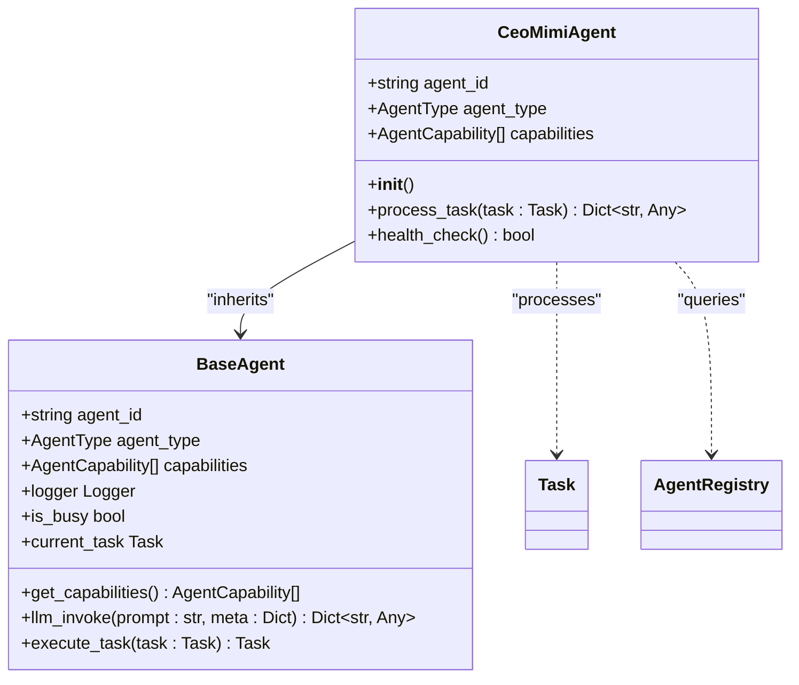
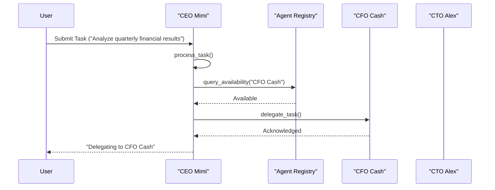
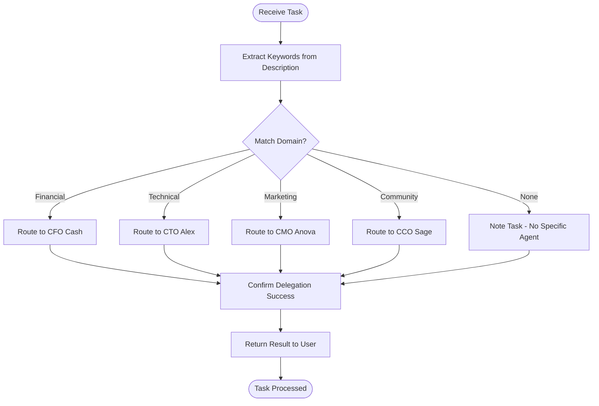
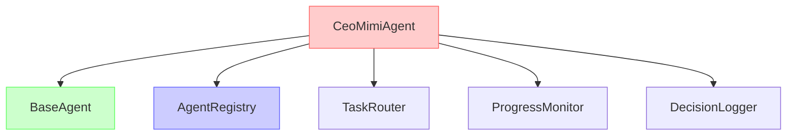

# CEO Agent (Mimi)

<cite>
**Referenced Files in This Document **   
- [ceo_mimi.py](file://_legacy/agents/business/ceo_mimi.py)
- [CEO_Agent_Logic.md](file://371-os/CEO_Agent_Logic.md)
- [mimi_ceo.yml](file://os-workspace/libs/prompts/agent-definitions/mimi_ceo.yml)
- [ceo-mimi.json](file://questflow/agents/core/ceo-mimi.json)
- [agent_registry.py](file://_legacy/services/orchestration/agent_registry.py)
</cite>

## Table of Contents
1. [Introduction](#introduction)
2. [Project Structure](#project-structure)
3. [Core Components](#core-components)
4. [Architecture Overview](#architecture-overview)
5. [Detailed Component Analysis](#detailed-component-analysis)
6. [Dependency Analysis](#dependency-analysis)
7. [Performance Considerations](#performance-considerations)
8. [Troubleshooting Guide](#troubleshooting-guide)
9. [Conclusion](#conclusion)

## Introduction
The CEO Agent (Mimi) serves as the strategic leadership component within the 371 DAO ecosystem, functioning as the central orchestrator for high-level decision-making and task delegation. Designed with a unified brain/body architecture, Mimi analyzes incoming strategic initiatives and routes them to appropriate C-suite agents based on domain expertise, workload, and organizational priorities. This documentation provides comprehensive insight into Mimi's implementation, API interfaces, integration patterns, and operational guidance.

## Project Structure
The CEO Agent is implemented across multiple directories reflecting its role in both legacy and modernized architectures. The core logic resides in the `_legacy` directory while configuration and definition files are maintained in workspace-specific locations for centralized management.

```mermaid
graph TD
A[CEO Agent (Mimi)] --> B[_legacy/agents/business/ceo_mimi.py]
A --> C[371-os/CEO_Agent_Logic.md]
A --> D[os-workspace/libs/prompts/agent-definitions/mimi_ceo.yml]
A --> E[questflow/agents/core/ceo-mimi.json]
A --> F[_legacy/services/orchestration/agent_registry.py]
```

**Diagram sources **
- [ceo_mimi.py](file://_legacy/agents/business/ceo_mimi.py)
- [CEO_Agent_Logic.md](file://371-os/CEO_Agent_Logic.md)
- [mimi_ceo.yml](file://os-workspace/libs/prompts/agent-definitions/mimi_ceo.yml)
- [ceo-mimi.json](file://questflow/agents/core/ceo-mimi.json)
- [agent_registry.py](file://_legacy/services/orchestration/agent_registry.py)

**Section sources**
- [ceo_mimi.py](file://_legacy/agents/business/ceo_mimi.py)
- [CEO_Agent_Logic.md](file://371-os/CEO_Agent_Logic.md)

## Core Components

The CEO Agent comprises several key components that enable its strategic orchestration capabilities:

- **Strategic Delegation Engine**: Analyzes task descriptions using keyword matching and semantic analysis to determine optimal agent routing.
- **Health Monitoring System**: Provides real-time status checks and performance tracking.
- **Agent Registry Integration**: Interfaces with the central registry to query agent availability and capabilities.
- **Unified Brain/Body Architecture**: Separates agent definition (brain) from execution logic (body) for modularity and maintainability.

**Section sources**
- [ceo_mimi.py](file://_legacy/agents/business/ceo_mimi.py#L6-L43)
- [mimi_ceo.yml](file://os-workspace/libs/prompts/agent-definitions/mimi_ceo.yml#L1-L106)

## Architecture Overview

The CEO Agent implements a unified brain/body architecture pattern where the agent's cognitive framework is defined separately from its executable implementation. This separation enables easier updates, testing, and deployment across environments.

```mermaid
graph TD
subgraph "Brain (Definition)"
A[mimi_ceo.yml] --> |Configuration| B[Delegation Rules]
A --> |Personality| C[Personality Traits]
A --> |Capabilities| D[Required Tools]
end
subgraph "Body (Execution)"
E[ceo_mimi.py] --> |Processes Tasks| F[process_task()]
E --> |Monitors Health| G[health_check()]
E --> |Extends Base| H[BaseAgent]
end
I[Agent Registry] < --> E
J[External Systems] < --> E
```

**Diagram sources **
- [ceo_mimi.py](file://_legacy/agents/business/ceo_mimi.py#L6-L43)
- [mimi_ceo.yml](file://os-workspace/libs/prompts/agent-definitions/mimi_ceo.yml#L1-L106)
- [agent_registry.py](file://_legacy/services/orchestration/agent_registry.py#L1-L1)

## Detailed Component Analysis

### Strategic Orchestration Analysis

The CEO Agent's primary function is strategic task delegation based on domain-specific keywords and confidence thresholds.

#### For Object-Oriented Components:


**Diagram sources **
- [ceo_mimi.py](file://_legacy/agents/business/ceo_mimi.py#L6-L43)
- [_legacy/agents/base_agent/base_agent.py](file://_legacy/agents/base_agent/base_agent.py#L94-L158)

#### For API/Service Components:


**Diagram sources **
- [ceo_mimi.py](file://_legacy/agents/business/ceo_mimi.py#L30-L40)
- [agent_registry.py](file://_legacy/services/orchestration/agent_registry.py#L1-L1)

#### For Complex Logic Components:


**Diagram sources **
- [ceo_mimi.py](file://_legacy/agents/business/ceo_mimi.py#L30-L40)
- [CEO_Agent_Logic.md](file://371-os/CEO_Agent_Logic.md#L1-L28)

**Section sources**
- [ceo_mimi.py](file://_legacy/agents/business/ceo_mimi.py#L1-L100)
- [CEO_Agent_Logic.md](file://371-os/CEO_Agent_Logic.md#L1-L28)

### Configuration and Definition Analysis

The agent's behavior is governed by YAML configuration that defines delegation rules, escalation criteria, and performance targets.

**Section sources**
- [mimi_ceo.yml](file://os-workspace/libs/prompts/agent-definitions/mimi_ceo.yml#L1-L106)
- [ceo-mimi.json](file://questflow/agents/core/ceo-mimi.json#L1-L87)

## Dependency Analysis

The CEO Agent depends on several critical components within the 371 DAO ecosystem to fulfill its orchestration responsibilities.



**Diagram sources **
- [ceo_mimi.py](file://_legacy/agents/business/ceo_mimi.py#L6-L43)
- [_legacy/agents/base_agent/base_agent.py](file://_legacy/agents/base_agent/base_agent.py#L94-L158)
- [agent_registry.py](file://_legacy/services/orchestration/agent_registry.py#L1-L1)

**Section sources**
- [ceo_mimi.py](file://_legacy/agents/business/ceo_mimi.py#L1-L100)
- [_legacy/agents/base_agent/base_agent.py](file://_legacy/agents/base_agent/base_agent.py#L1-L200)
- [agent_registry.py](file://_legacy/services/orchestration/agent_registry.py#L1-L1)

## Performance Considerations

The CEO Agent is designed with strict performance targets to ensure responsive and reliable operation within the 371 DAO ecosystem:

- **Response Time**: Target <500ms average processing time
- **Delegation Accuracy**: >95% correct routing rate
- **Escalation Rate**: <5% requiring human intervention
- **Availability**: >98% uptime target

These metrics are continuously monitored through integrated health checking and performance logging systems. The agent employs caching mechanisms and concurrent processing capabilities inherited from the improved-base-agent framework to maintain optimal performance under load.

## Troubleshooting Guide

Common issues with the CEO Agent typically involve delegation failures or integration problems with the agent registry.

**Section sources**
- [ceo_mimi.py](file://_legacy/agents/business/ceo_mimi.py#L30-L40)
- [test_ceo_agent.py](file://371-os/tests/unit/agents/test_ceo_agent.py#L1-L1)
- [agent_registry.py](file://_legacy/services/orchestration/agent_registry.py#L1-L1)

### Delegation Issues

When tasks are not being delegated correctly:

1. **Verify Keyword Matching**: Check that task descriptions contain keywords defined in `mimi_ceo.yml`
2. **Check Agent Availability**: Confirm target agents are registered and available via the agent registry
3. **Review Confidence Thresholds**: Ensure confidence scores meet minimum requirements (0.8 default)
4. **Examine Escalation Criteria**: High-impact tasks may require executive review

### Integration Problems

For agent registry connectivity issues:

1. Validate registry service is running
2. Check network connectivity between CEO agent and registry
3. Verify authentication credentials if required
4. Review logs for timeout or connection errors

## Conclusion

The CEO Agent (Mimi) serves as the strategic nucleus of the 371 DAO ecosystem, providing intelligent task delegation, cross-functional coordination, and executive oversight. Its unified brain/body architecture separates cognitive definition from execution logic, enabling flexible updates and robust performance monitoring. Through precise keyword-based routing and integration with the agent registry, Mimi ensures efficient distribution of responsibilities across the C-suite agent team while maintaining strategic alignment and organizational coherence.