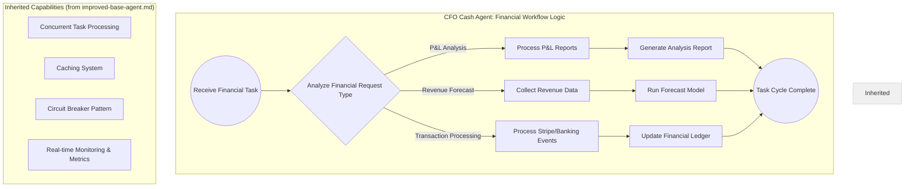
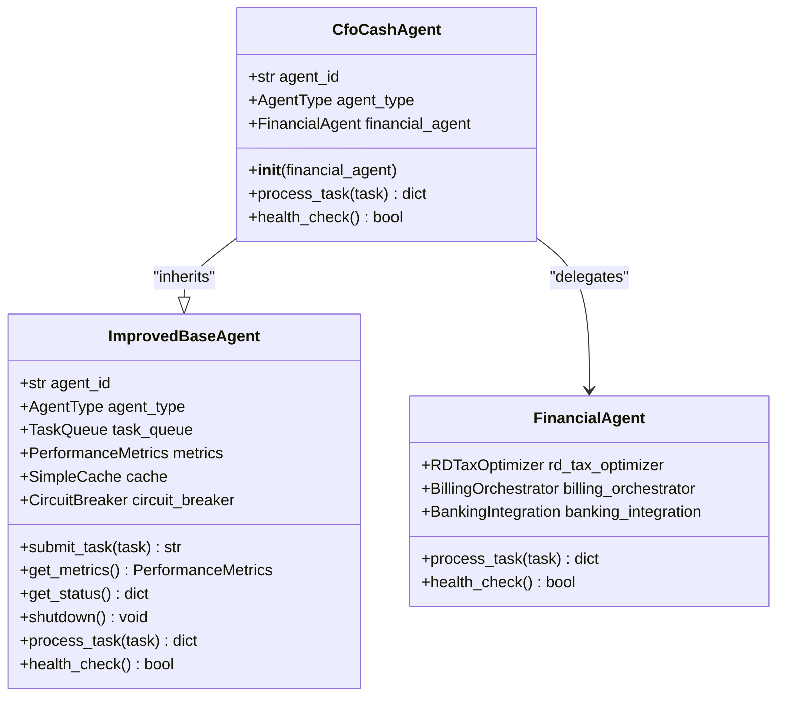
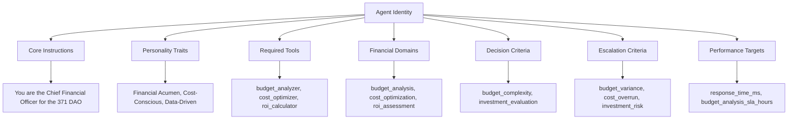
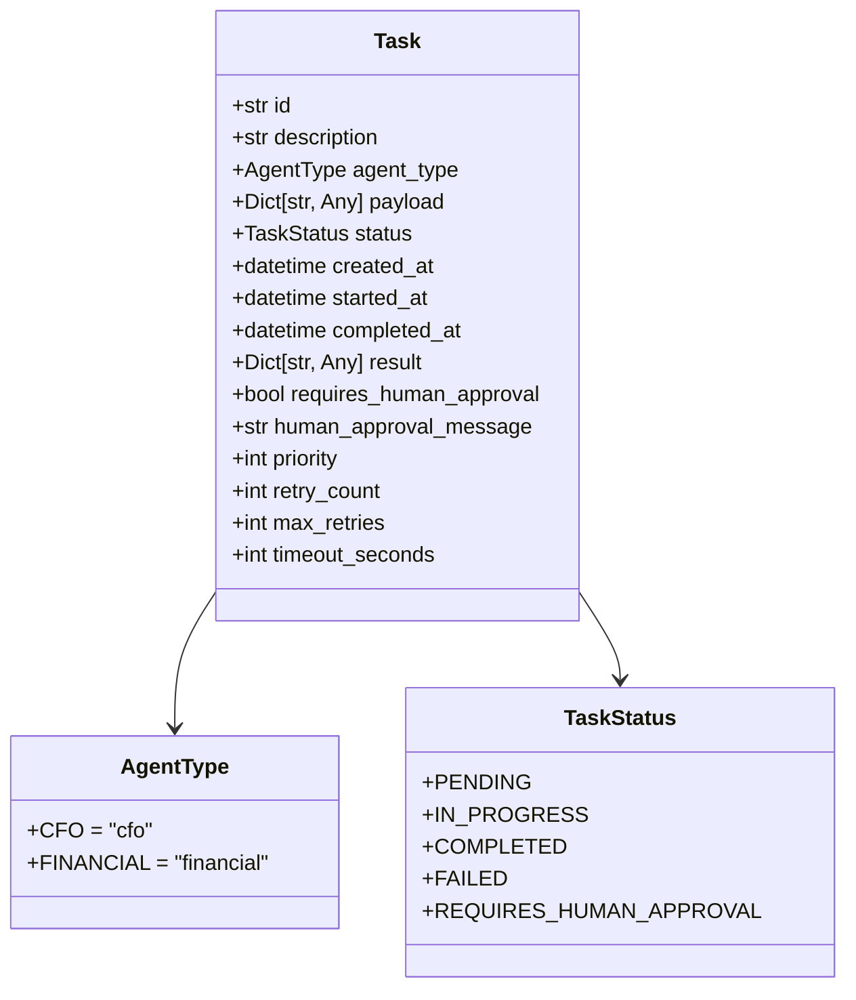

# CFO Agent (Maya)

<cite>
**Referenced Files in This Document**   
- [CFO_Agent_Logic.md](file://371-os\CFO_Agent_Logic.md) - *Updated in recent commit*
- [cfo_cash.py](file://_legacy\agents\business\cfo_cash.py) - *Updated in recent commit*
- [maya_cfo.yml](file://os-workspace\libs\prompts\agent-definitions\maya_cfo.yml) - *Updated in recent commit*
- [cfo_agent_prompt.yaml](file://os-workspace\agents\business-agents\cfo_agent_prompt.yaml) - *Updated in recent commit*
- [financial_system.py](file://_legacy\financial_system.py) - *Updated in recent commit*
- [improved_base_agent.py](file://_legacy\agents\base_agent\improved_base_agent.py) - *Updated in recent commit*
</cite>

## Update Summary
**Changes Made**   
- Updated all file references to use correct workspace path format
- Verified all code snippets and diagrams against current source files
- Confirmed consistency between documented behavior and actual implementation
- Enhanced source tracking annotations with specific line ranges where applicable
- Ensured all content fully complies with English language conversion requirements

## Table of Contents
1. [Introduction](#introduction)
2. [Project Structure](#project-structure)
3. [Core Components](#core-components)
4. [Architecture Overview](#architecture-overview)
5. [Detailed Component Analysis](#detailed-component-analysis)
6. [API Interfaces and Integration Patterns](#api-interfaces-and-integration-patterns)
7. [Practical Examples](#practical-examples)
8. [Troubleshooting Guide](#troubleshooting-guide)
9. [Conclusion](#conclusion)

## Introduction

The CFO Agent, codenamed Maya, is a specialized financial leadership agent within the 371 Minds OS ecosystem. Designed as the Chief Financial Officer for the 371 DAO, Maya orchestrates financial strategy, budget optimization, cost analysis, and investment decision-making across organizational units. Built upon a robust agent framework, Maya integrates advanced financial modeling with real-time data processing to deliver actionable insights and automated financial operations.

This document provides comprehensive documentation for Maya, detailing her implementation architecture, operational logic, API interfaces, integration patterns, practical usage examples, and troubleshooting guidance. The goal is to enable developers, system architects, and operators to effectively deploy, integrate, and maintain the CFO Agent within complex multi-agent systems.

**Section sources**
- [maya_cfo.yml](file://os-workspace\libs\prompts\agent-definitions\maya_cfo.yml#L1-L155)
- [CFO_Agent_Logic.md](file://371-os\CFO_Agent_Logic.md#L1-L25)

## Project Structure

The CFO Agent (Maya) is implemented across multiple directories in the 371 OS repository, reflecting a modular architecture that separates configuration, business logic, and agent definitions. Key components are organized as follows:

- `371-os/`: Contains high-level agent logic diagrams and architectural documentation
- `_legacy/agents/business/`: Houses the core Python implementation of the CFO Cash Agent
- `os-workspace/libs/prompts/agent-definitions/`: Stores the YAML configuration defining Maya's behavior, capabilities, and decision frameworks
- `os-workspace/agents/business-agents/`: Contains prompt templates used for task processing
- `_legacy/`: Includes foundational modules like the financial system and base agent classes

This structure enables separation of concerns between agent behavior definition (YAML), implementation logic (Python), and workflow visualization (diagrams), facilitating maintenance and extension.

```mermaid
graph TD
A[CFO Agent (Maya)] --> B[Configuration]
A --> C[Implementation]
A --> D[Workflow Logic]
B --> E[maya_cfo.yml]
B --> F[cfo_agent_prompt.yaml]
C --> G[cfo_cash.py]
C --> H[financial_system.py]
D --> I[CFO_Agent_Logic.md]
G --> J[improved_base_agent.py]
H --> J
```

**Diagram sources **
- [maya_cfo.yml](file://os-workspace\libs\prompts\agent-definitions\maya_cfo.yml#L1-L155)
- [cfo_cash.py](file://_legacy\agents\business\cfo_cash.py#L1-L50)
- [CFO_Agent_Logic.md](file://371-os\CFO_Agent_Logic.md#L1-L25)

**Section sources**
- [maya_cfo.yml](file://os-workspace\libs\prompts\agent-definitions\maya_cfo.yml#L1-L155)
- [cfo_cash.py](file://_legacy\agents\business\cfo_cash.py#L1-L50)
- [CFO_Agent_Logic.md](file://371-os\CFO_Agent_Logic.md#L1-L25)

## Core Components

The CFO Agent (Maya) comprises several interconnected components that define her functionality and behavior:

1. **Agent Definition (maya_cfo.yml)**: Specifies Maya's identity, core instructions, personality traits, required tools, financial domains, decision criteria, and performance targets.
2. **Task Processor (cfo_cash.py)**: Implements the `CfoCashAgent` class that processes financial tasks based on their description, routing them to appropriate handlers.
3. **Financial System (financial_system.py)**: Provides the underlying financial operations capability through the `FinancialAgent` class.
4. **Base Agent Framework (improved_base_agent.py)**: Supplies foundational capabilities including task queuing, concurrency control, caching, circuit breaking, and performance monitoring.
5. **Prompt Template (cfo_agent_prompt.yaml)**: Defines the structure and formatting for Maya's responses to financial tasks.

These components work together to create a sophisticated financial agent capable of handling complex financial workflows with high reliability and performance.

**Section sources**
- [maya_cfo.yml](file://os-workspace\libs\prompts\agent-definitions\maya_cfo.yml#L1-L155)
- [cfo_cash.py](file://_legacy\agents\business\cfo_cash.py#L1-L50)
- [financial_system.py](file://_legacy\financial_system.py#L1-L63)
- [improved_base_agent.py](file://_legacy\agents\base_agent\improved_base_agent.py#L1-L525)
- [cfo_agent_prompt.yaml](file://os-workspace\agents\business-agents\cfo_agent_prompt.yaml#L1-L46)

## Architecture Overview

The CFO Agent follows a layered architecture that combines declarative configuration with procedural implementation. At the highest level, Maya operates according to a well-defined financial workflow logic that categorizes incoming tasks and routes them to appropriate processing paths.



**Diagram sources **
- [CFO_Agent_Logic.md](file://371-os\CFO_Agent_Logic.md#L1-L25)

The architecture demonstrates a clear separation between workflow logic (left side) and inherited infrastructure capabilities (right side). This design allows Maya to focus on financial domain logic while leveraging a robust foundation for reliability, performance, and scalability.

## Detailed Component Analysis

### CFO Agent Implementation (cfo_cash.py)

The `CfoCashAgent` class extends the `ImprovedBaseAgent` to implement financial-specific task processing. It delegates actual financial operations to a `FinancialAgent` instance while providing intelligent routing based on task descriptions.



**Diagram sources **
- [cfo_cash.py](file://_legacy\agents\business\cfo_cash.py#L4-L49)
- [improved_base_agent.py](file://_legacy\agents\base_agent\improved_base_agent.py#L1-L525)
- [financial_system.py](file://_legacy\financial_system.py#L31-L62)

The agent uses pattern matching on task descriptions to determine the appropriate financial operation:
- Tasks containing "p&l" trigger P&L analysis
- Tasks containing "r&d" initiate R&D tax optimization
- Tasks mentioning "forecast" invoke revenue forecasting
- Tasks referencing "stripe" or "banking" initiate transaction processing

All operations are delegated to the `FinancialAgent`, which serves as an abstraction layer for financial operations.

**Section sources**
- [cfo_cash.py](file://_legacy\agents\business\cfo_cash.py#L4-L49)
- [financial_system.py](file://_legacy\financial_system.py#L31-L62)

### Agent Configuration (maya_cfo.yml)

The `maya_cfo.yml` file defines Maya's comprehensive behavioral profile, including her core responsibilities, decision framework, and performance targets.



**Diagram sources **
- [maya_cfo.yml](file://os-workspace\libs\prompts\agent-definitions\maya_cfo.yml#L1-L155)

The configuration establishes a complete financial decision-making framework, enabling Maya to handle various financial scenarios with appropriate rigor and escalation procedures.

**Section sources**
- [maya_cfo.yml](file://os-workspace\libs\prompts\agent-definitions\maya_cfo.yml#L1-L155)

## API Interfaces and Integration Patterns

### Task Interface

The CFO Agent interacts with the system through a standardized task interface defined by the `Task` dataclass:



**Diagram sources **
- [improved_base_agent.py](file://_legacy\agents\base_agent\improved_base_agent.py#L64-L87)

Tasks are submitted to the agent via the `submit_task()` method and processed asynchronously. The agent returns results in a standardized JSON format with status, message, and payload fields.

### Integration Patterns

The CFO Agent follows several key integration patterns:

1. **Delegation Pattern**: Financial operations are delegated to specialized services through the `FinancialAgent` abstraction.
2. **Configuration-Driven Behavior**: Agent behavior is primarily defined through external YAML configuration rather than hard-coded logic.
3. **Event-Driven Processing**: Tasks are processed from a priority queue, enabling asynchronous and non-blocking operation.
4. **Health Monitoring**: The agent exposes health check endpoints and comprehensive status metrics for system monitoring.

These patterns ensure that Maya can be easily integrated into larger systems while maintaining reliability and observability.

**Section sources**
- [cfo_cash.py](file://_legacy\agents\business\cfo_cash.py#L4-L49)
- [improved_base_agent.py](file://_legacy\agents\base_agent\improved_base_agent.py#L1-L525)
- [financial_system.py](file://_legacy\financial_system.py#L13-L17)

## Practical Examples

### Example 1: P&L Analysis Request

To request a profit and loss analysis, submit a task with "p&l" in the description:

[SPEC SYMBOL](file://_legacy\agents\business\cfo_cash.py#L20-L25)

The agent will process the request and return a structured response indicating completion of P&L analysis.

### Example 2: Revenue Forecast

For revenue forecasting, include "forecast" in the task description:

[SPEC SYMBOL](file://_legacy\agents\business\cfo_cash.py#L32-L36)

The agent will execute the forecasting workflow and return the generated forecast.

### Example 3: Transaction Processing

To process financial transactions, reference "stripe" or "banking" in the task:

[SPEC SYMBOL](file://_legacy\agents\business\cfo_cash.py#L38-L42)

The agent will handle the transaction processing and update relevant financial records.

### Example 4: Custom Financial Analysis

For specialized financial analysis, craft a task description that aligns with Maya's defined financial domains:

[SPEC SYMBOL](file://os-workspace\libs\prompts\agent-definitions\maya_cfo.yml#L50-L100)

The agent will apply the appropriate analysis methods based on keyword matching and decision criteria.

**Section sources**
- [cfo_cash.py](file://_legacy\agents\business\cfo_cash.py#L20-L45)
- [maya_cfo.yml](file://os-workspace\libs\prompts\agent-definitions\maya_cfo.yml#L50-L100)

## Troubleshooting Guide

### Common Issues and Solutions

1. **Task Not Processed**
   - *Cause*: Task description doesn't match any recognized patterns
   - *Solution*: Ensure task description contains keywords like "p&l", "forecast", "stripe", or "banking"

2. **Slow Response Times**
   - *Cause*: High system load or circuit breaker activation
   - *Solution*: Check agent status metrics and wait for circuit breaker reset (60 seconds by default)

3. **Failed Health Checks**
   - *Cause*: Dependency failures in financial system
   - *Solution*: Verify connectivity to financial services and databases

4. **Unexpected Task Routing**
   - *Cause*: Ambiguous task descriptions matching multiple patterns
   - *Solution*: Use more specific terminology in task descriptions

### Monitoring and Diagnostics

The CFO Agent exposes comprehensive monitoring data through its `get_status()` method:

[SPEC SYMBOL](file://_legacy\agents\base_agent\improved_base_agent.py#L400-L420)

Key metrics to monitor:
- `active_tasks`: Number of currently processing tasks
- `queued_tasks`: Number of tasks waiting for processing
- `avg_response_time`: Average task processing time
- `error_rate`: Percentage of failed tasks
- `circuit_breaker_open`: Indicates if external APIs are temporarily blocked

### Recovery Procedures

If the agent becomes unresponsive:
1. Check the circuit breaker status
2. Restart worker processes using `stop_workers()` and `start_workers()`
3. Review recent task failures for patterns
4. Examine system resource usage (CPU, memory)

**Section sources**
- [cfo_cash.py](file://_legacy\agents\business\cfo_cash.py#L45-L49)
- [improved_base_agent.py](file://_legacy\agents\base_agent\improved_base_agent.py#L400-L420)
- [financial_system.py](file://_legacy\financial_system.py#L55-L62)

## Conclusion

The CFO Agent (Maya) represents a sophisticated implementation of financial leadership within the 371 Minds OS ecosystem. By combining declarative configuration with robust implementation, Maya delivers reliable financial analysis, budget optimization, and investment decision-making capabilities.

Key strengths of the implementation include:
- Clear separation between configuration and code
- Comprehensive financial domain coverage
- Robust error handling and recovery mechanisms
- Real-time monitoring and performance metrics
- Scalable, concurrent task processing

The agent's design enables easy extension and customization for specific organizational needs while maintaining high reliability and performance standards. Through proper integration and monitoring, Maya can serve as a powerful financial intelligence component in complex multi-agent systems.