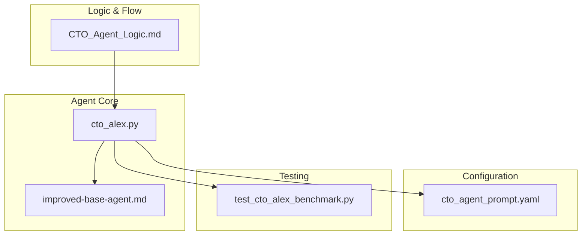
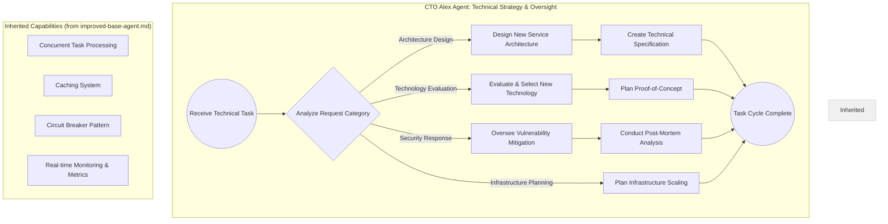
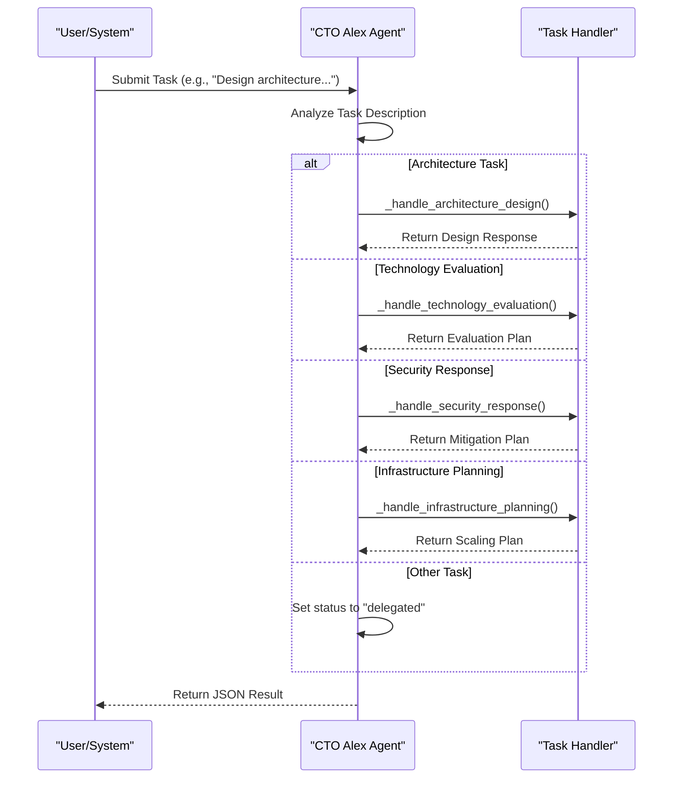
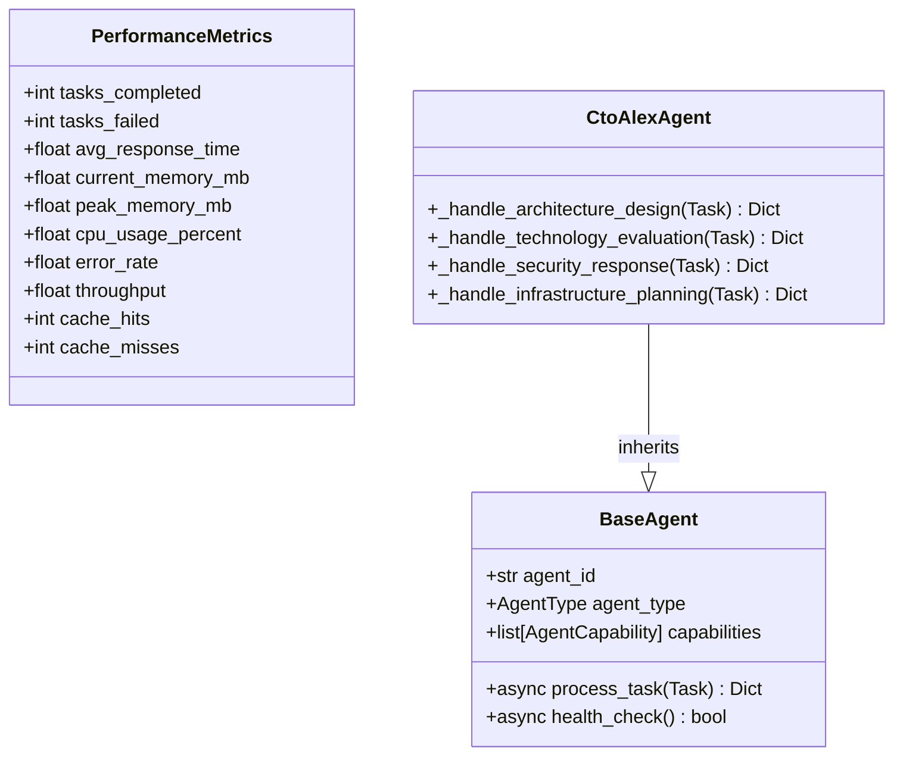
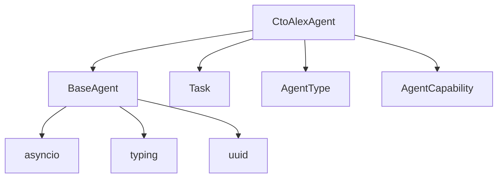

# CTO Agent (Alex)

<cite>
**Referenced Files in This Document**   
- [CTO_Agent_Logic.md](file://371-os/CTO_Agent_Logic.md)
- [improved-base-agent.md](file://_legacy/agents/base_agent/improved-base-agent.md)
- [cto_alex.py](file://_legacy/agents/business/cto_alex.py)
- [cto_agent_prompt.yaml](file://os-workspace/agents/business-agents/cto_agent_prompt.yaml)
- [test_cto_alex_benchmark.py](file://371-os/tests/performance/test_cto_alex_benchmark.py)
</cite>

## Table of Contents
1. [Introduction](#introduction)  
2. [Project Structure](#project-structure)  
3. [Core Components](#core-components)  
4. [Architecture Overview](#architecture-overview)  
5. [Detailed Component Analysis](#detailed-component-analysis)  
6. [Dependency Analysis](#dependency-analysis)  
7. [Performance Considerations](#performance-considerations)  
8. [Troubleshooting Guide](#troubleshooting-guide)  
9. [Conclusion](#conclusion)  

## Introduction
The CTO Agent (Alex) is a specialized autonomous agent within the 371 Minds OS framework, designed to serve as the Chief Technology Officer for technical decision-making, architecture design, and infrastructure oversight. This document provides a comprehensive analysis of Alex’s role, technical architecture, capabilities, communication style, and integration within the broader agent ecosystem. The agent is built on a robust foundation of concurrent processing, real-time monitoring, and domain-specific logic for handling architecture, security, technology evaluation, and scaling tasks.

## Project Structure
The CTO Agent (Alex) is integrated into the 371 Minds OS repository with a modular structure that separates logic, configuration, testing, and deployment. Key directories include:
- `371-os/`: Contains core logic and test files for the agent.
- `_legacy/agents/business/`: Houses the primary implementation of the `CtoAlexAgent` class.
- `os-workspace/agents/business-agents/`: Stores the YAML prompt template that defines Alex’s behavior and response format.
- `371-os/tests/performance/`: Includes benchmarking scripts to validate agent functionality under load.

The agent inherits capabilities from the `improved-base-agent`, enabling advanced performance and resilience features.



**Diagram sources**  
- [cto_alex.py](file://_legacy/agents/business/cto_alex.py#L1-L100)  
- [cto_agent_prompt.yaml](file://os-workspace/agents/business-agents/cto_agent_prompt.yaml#L1-L47)  
- [test_cto_alex_benchmark.py](file://371-os/tests/performance/test_cto_alex_benchmark.py#L1-L69)  
- [CTO_Agent_Logic.md](file://371-os/CTO_Agent_Logic.md#L1-L27)  

**Section sources**  
- [cto_alex.py](file://_legacy/agents/business/cto_alex.py#L1-L100)  
- [CTO_Agent_Logic.md](file://371-os/CTO_Agent_Logic.md#L1-L27)  

## Core Components
The CTO Agent (Alex) is composed of several key components that define its behavior and capabilities:

- **Task Processing Engine**: The `process_task` method routes incoming tasks based on keywords in the description.
- **Specialized Handlers**: Methods like `_handle_architecture_design`, `_handle_security_response`, etc., execute domain-specific logic.
- **Inherited Capabilities**: Built on `improved-base-agent`, Alex supports concurrent task processing, caching, circuit breakers, and real-time monitoring.
- **Prompt Template**: The YAML file defines the agent’s context, response format, and metadata requirements.
- **Health Check**: A simple `health_check` method confirms agent availability.

These components work together to ensure Alex can respond to technical leadership tasks with precision and scalability.

**Section sources**  
- [cto_alex.py](file://_legacy/agents/business/cto_alex.py#L1-L100)  
- [improved-base-agent.md](file://_legacy/agents/base_agent/improved-base-agent.md#L1-L57)  
- [cto_agent_prompt.yaml](file://os-workspace/agents/business-agents/cto_agent_prompt.yaml#L1-L47)  

## Architecture Overview
The CTO Agent (Alex) follows a modular, event-driven architecture where tasks are received, categorized, and processed by specialized handlers. It leverages inheritance to extend the base agent with enhanced performance and resilience.



**Diagram sources**  
- [CTO_Agent_Logic.md](file://371-os/CTO_Agent_Logic.md#L1-L27)  
- [improved-base-agent.md](file://_legacy/agents/base_agent/improved-base-agent.md#L1-L57)  

## Detailed Component Analysis

### Task Processing Logic
The `process_task` method is the central dispatcher for all incoming tasks. It uses keyword matching to route tasks to the appropriate handler.

```python
async def process_task(self, task: Task) -> Dict[str, Any]:
    description = task.description.lower()

    if "architecture" in description:
        result = self._handle_architecture_design(task)
    elif "evaluate" in description or "select" in description:
        result = self._handle_technology_evaluation(task)
    elif "security" in description or "vulnerability" in description:
        result = self._handle_security_response(task)
    elif "infrastructure" in description or "scaling" in description:
        result = self._handle_infrastructure_planning(task)
    else:
        result = {"status": "delegated", "message": f"Task '{task.description}' not a direct CTO task, delegating."}
    return result
```

This logic ensures that only relevant tasks are processed directly, while others are delegated, maintaining focus on technical leadership.

#### Sequence Diagram: Task Processing Flow


**Diagram sources**  
- [cto_alex.py](file://_legacy/agents/business/cto_alex.py#L25-L65)  

**Section sources**  
- [cto_alex.py](file://_legacy/agents/business/cto_alex.py#L25-L65)  

### Inherited Capabilities
Alex inherits advanced features from the `improved-base-agent`, including:

- **Concurrent Task Processing**: Uses a priority-based task queue and worker pool.
- **Caching System**: TTL-based cache with LRU eviction.
- **Circuit Breaker**: Prevents cascading failures.
- **Real-time Monitoring**: Tracks performance metrics like response time, memory usage, and error rate.

These capabilities ensure high availability and performance under load.



**Diagram sources**  
- [improved-base-agent.md](file://_legacy/agents/base_agent/improved-base-agent.md#L1-L57)  
- [cto_alex.py](file://_legacy/agents/business/cto_alex.py#L1-L100)  

**Section sources**  
- [improved-base-agent.md](file://_legacy/agents/base_agent/improved-base-agent.md#L1-L57)  
- [cto_alex.py](file://_legacy/agents/business/cto_alex.py#L1-L100)  

## Dependency Analysis
The CTO Agent (Alex) depends on several core modules:



Alex is tightly coupled with the base agent framework but maintains loose coupling with external systems through standardized task payloads and JSON responses.

**Diagram sources**  
- [cto_alex.py](file://_legacy/agents/business/cto_alex.py#L1-L10)  
- [base_agent.py](file://_legacy/agents/base_agent/base_agent.py#L1-L20)  

**Section sources**  
- [cto_alex.py](file://_legacy/agents/business/cto_alex.py#L1-L100)  

## Performance Considerations
Alex is optimized for high-throughput, low-latency task processing:
- **Concurrency**: Supports parallel execution via worker pools.
- **Caching**: Reduces redundant computation for frequently accessed data.
- **Monitoring**: Exposes metrics for throughput, response time, and error rates.
- **Scalability**: Stateless design allows horizontal scaling.

The benchmark test (`test_cto_alex_benchmark.py`) validates that Alex processes tasks correctly and efficiently, with assertions for each task type.

**Section sources**  
- [improved-base-agent.md](file://_legacy/agents/base_agent/improved-base-agent.md#L1-L57)  
- [test_cto_alex_benchmark.py](file://371-os/tests/performance/test_cto_alex_benchmark.py#L1-L69)  

## Troubleshooting Guide
Common issues and resolutions:

- **Task Not Processed**: Ensure task description contains keywords like "architecture", "evaluate", "security", or "infrastructure".
- **Performance Degradation**: Check cache hit ratio and adjust TTL or pool size.
- **Health Check Fails**: Verify agent initialization and dependency loading.

The agent logs task processing steps, aiding in debugging.

**Section sources**  
- [cto_alex.py](file://_legacy/agents/business/cto_alex.py#L1-L100)  
- [test_cto_alex_benchmark.py](file://371-os/tests/performance/test_cto_alex_benchmark.py#L1-L69)  

## Conclusion
The CTO Agent (Alex) is a technically proficient, resilient, and scalable component of the 371 Minds OS. By combining domain-specific logic with inherited performance features, Alex effectively fulfills the role of a Chief Technology Officer in an autonomous agent ecosystem. Its design emphasizes clarity, maintainability, and extensibility, making it a model for other specialized agents.