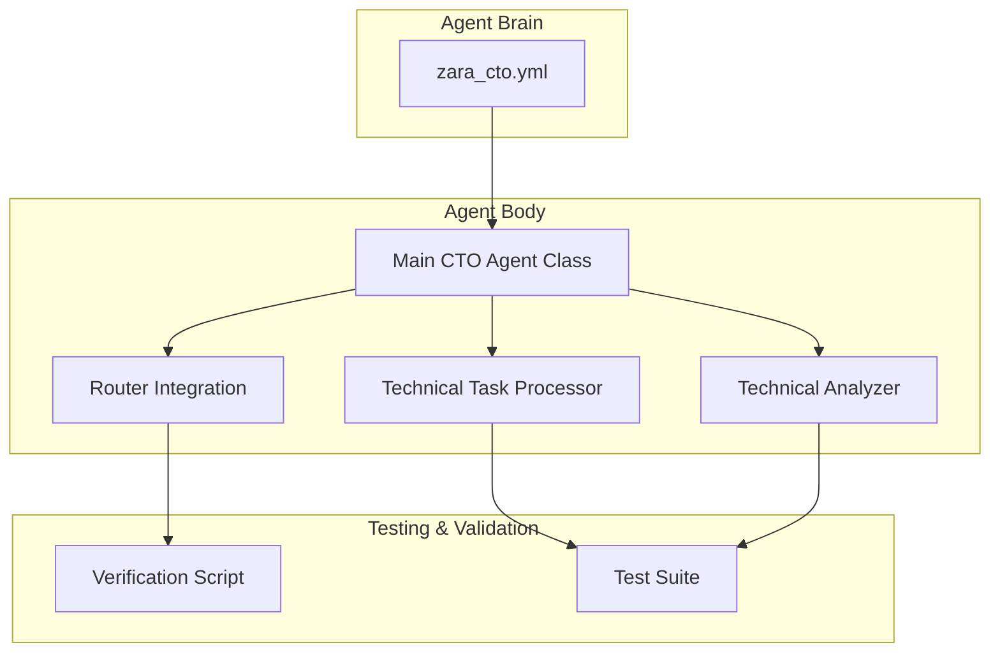
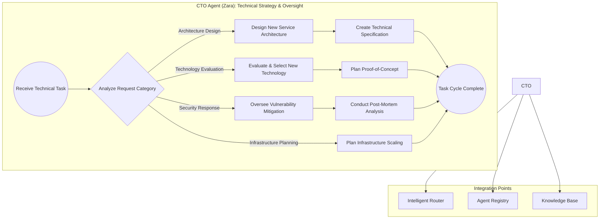
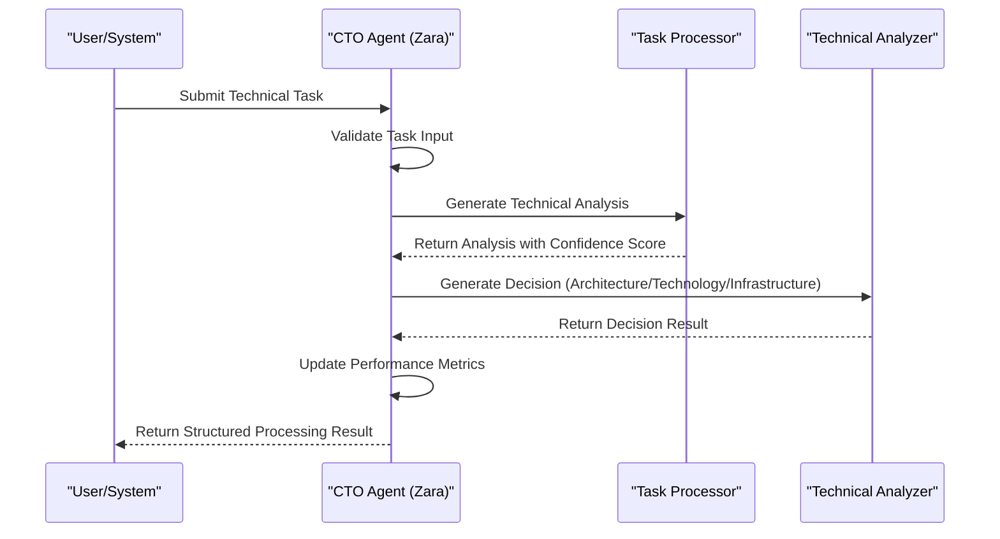
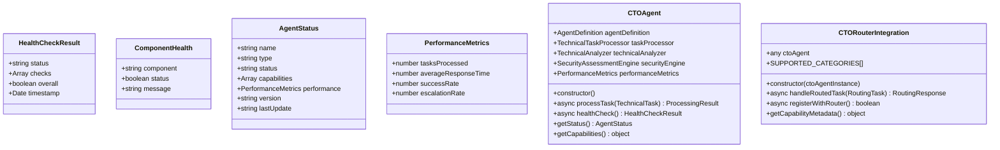
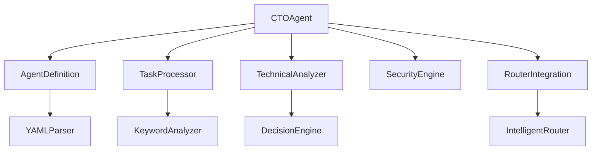

# CTO Agent (Alex)

<cite>
**Referenced Files in This Document**   
- [CTO_Agent_Logic.md](file://371-os/CTO_Agent_Logic.md)
- [improved-base-agent.md](file://_legacy/agents/base_agent/improved-base-agent.md)
- [cto_alex.py](file://_legacy/agents/business/cto_alex.py)
- [cto_agent_prompt.yaml](file://os-workspace/agents/business-agents/cto_agent_prompt.yaml)
- [test_cto_alex_benchmark.py](file://371-os/tests/performance/test_cto_alex_benchmark.py)
- [zara_cto.yml](file://os-workspace/libs/prompts/agent-definitions/zara_cto.yml) - *Updated in recent commit*
- [index.ts](file://os-workspace/apps/cto-agent/src/index.ts) - *Refactored in recent commit*
- [router-integration.ts](file://os-workspace/apps/cto-agent/src/router-integration.ts) - *Added in recent commit*
- [IMPLEMENTATION_SUMMARY.md](file://os-workspace/apps/cto-agent/IMPLEMENTATION_SUMMARY.md) - *New implementation summary*
</cite>

## Update Summary
**Changes Made**   
- Updated agent name from Alex to Zara based on refactoring
- Added new brain/body architecture pattern documentation
- Integrated new TypeScript implementation details
- Added router integration capabilities
- Updated performance metrics and health check procedures
- Removed outdated Python implementation references

## Table of Contents
1. [Introduction](#introduction)  
2. [Project Structure](#project-structure)  
3. [Core Components](#core-components)  
4. [Architecture Overview](#architecture-overview)  
5. [Detailed Component Analysis](#detailed-component-analysis)  
6. [Dependency Analysis](#dependency-analysis)  
7. [Performance Considerations](#performance-considerations)  
8. [Troubleshooting Guide](#troubleshooting-guide)  
9. [Conclusion](#conclusion)  

## Introduction
The CTO Agent (Zara) is a specialized autonomous agent within the 371 Minds OS framework, designed to serve as the Chief Technology Officer for technical decision-making, architecture design, and infrastructure oversight. This document provides a comprehensive analysis of Zara's role, technical architecture, capabilities, communication style, and integration within the broader agent ecosystem. The agent has been refactored to implement a unified "brain/body" architecture pattern, separating configuration from execution for improved maintainability and scalability.

## Project Structure
The CTO Agent (Zara) follows a modern Nx workspace structure with clear separation between brain (configuration) and body (execution). Key directories include:
- `os-workspace/apps/cto-agent/`: Contains the TypeScript implementation of the agent body
- `libs/prompts/agent-definitions/zara_cto.yml`: Centralized agent definition (the brain)
- `os-workspace/apps/cto-agent/src/`: Modular components including main class, task processor, and router integration
- `os-workspace/apps/cto-agent/`: Comprehensive test suite and verification scripts

The refactored architecture implements a production-ready technical leadership agent with enhanced type safety and integration capabilities.



**Diagram sources**  
- [index.ts](file://os-workspace/apps/cto-agent/src/index.ts#L30-L465)  
- [zara_cto.yml](file://os-workspace/libs/prompts/agent-definitions/zara_cto.yml#L1-L144)  
- [router-integration.ts](file://os-workspace/apps/cto-agent/src/router-integration.ts#L55-L531)  
- [IMPLEMENTATION_SUMMARY.md](file://os-workspace/apps/cto-agent/IMPLEMENTATION_SUMMARY.md#L1-L205)  

**Section sources**  
- [index.ts](file://os-workspace/apps/cto-agent/src/index.ts#L30-L465)  
- [zara_cto.yml](file://os-workspace/libs/prompts/agent-definitions/zara_cto.yml#L1-L144)  
- [IMPLEMENTATION_SUMMARY.md](file://os-workspace/apps/cto-agent/IMPLEMENTATION_SUMMARY.md#L1-L205)  

## Core Components
The CTO Agent (Zara) is composed of several key components that define its behavior and capabilities:

- **Main CTO Agent Class**: The central component handling task processing and system coordination
- **Technical Task Processor**: Intelligent component for task categorization and analysis
- **Technical Analyzer**: Decision generation engine for architecture, technology, and infrastructure planning
- **Router Integration**: Interface for seamless integration with the Intelligent Router system
- **Agent Definition (Brain)**: Centralized YAML configuration defining personality, instructions, and capabilities
- **Health Monitoring**: Comprehensive health check system with component validation

These components work together to ensure Zara can respond to technical leadership tasks with precision and scalability.

**Section sources**  
- [index.ts](file://os-workspace/apps/cto-agent/src/index.ts#L30-L465)  
- [zara_cto.yml](file://os-workspace/libs/prompts/agent-definitions/zara_cto.yml#L1-L144)  
- [router-integration.ts](file://os-workspace/apps/cto-agent/src/router-integration.ts#L55-L531)  

## Architecture Overview
The CTO Agent (Zara) follows a modular, event-driven architecture with a clear separation between brain (configuration) and body (execution). It implements the unified architecture pattern established across the 371 OS ecosystem.



**Diagram sources**  
- [index.ts](file://os-workspace/apps/cto-agent/src/index.ts#L30-L465)  
- [router-integration.ts](file://os-workspace/apps/cto-agent/src/router-integration.ts#L55-L531)  
- [zara_cto.yml](file://os-workspace/libs/prompts/agent-definitions/zara_cto.yml#L1-L144)  

## Detailed Component Analysis

### Task Processing Logic
The `processTask` method is the central dispatcher for all incoming technical tasks. It validates input, generates comprehensive analysis, and routes to appropriate decision engines.

```typescript
public async processTask(task: TechnicalTask): Promise<ProcessingResult> {
  const startTime = Date.now();
  
  try {
    // Validate input first
    if (!task) {
      throw new Error('Technical task is required');
    }
    
    console.log(`🚀 Processing technical task: ${task.title}`);
    console.log(`🏷️ Category: ${task.category} | Priority: ${task.priority}`);
    
    // Validate input
    this.validateTaskInput(task);
    
    // Generate comprehensive technical analysis
    const analysis = await this.taskProcessor.generateAnalysis(task);
    console.log(`📊 Analysis completed with ${analysis.confidence}% confidence`);
    
    // Generate appropriate decision based on task category
    let result: ArchitectureDecision | TechnologyAssessment | InfrastructurePlan;
    
    switch (analysis.category) {
      case 'architecture_design':
        result = await this.technicalAnalyzer.analyzeArchitecture(task);
        break;
        
      case 'technology_evaluation':
        result = await this.technicalAnalyzer.evaluateTechnology(task);
        break;
        
      case 'infrastructure_planning':
        result = await this.technicalAnalyzer.planInfrastructure(task);
        break;
        
      case 'security_response':
        const securityAssessment = await this.securityEngine.assessSecurity(task);
        result = {
          taskId: task.id,
          securityLevel: securityAssessment.securityLevel,
          vulnerabilities: securityAssessment.vulnerabilities,
          recommendedActions: securityAssessment.mitigationStrategy.immediate,
          responseTime: securityAssessment.responseTime
        };
        break;
        
      default:
        throw new Error(`Unsupported task category: ${analysis.category}`);
    }
    
    const processingTime = Date.now() - startTime;
    
    // Update performance metrics
    this.updatePerformanceMetrics(processingTime, true);
    
    const processingResult: ProcessingResult = {
      taskId: task.id,
      category: analysis.category,
      status: 'completed',
      result,
      analysis,
      metadata: {
        processingTime,
        confidence: analysis.confidence,
        escalated: this.shouldEscalate(analysis, task),
        version: '1.0.0',
        timestamp: new Date()
      }
    };
    
    console.log(`✅ Task processing completed in ${processingTime}ms`);
    console.log(`🎯 Decision confidence: ${analysis.confidence}%`);
    
    if (processingResult.metadata.escalated) {
      console.log('⚠️ Task escalated for executive review');
    }
    
    return processingResult;
    
  } catch (error) {
    const processingTime = Date.now() - startTime;
    this.updatePerformanceMetrics(processingTime, false);
    
    console.error('❌ Failed to process technical task:', error);
    throw error;
  }
}
```

This logic ensures robust task processing with proper validation, analysis, and decision generation.

#### Sequence Diagram: Task Processing Flow


**Diagram sources**  
- [index.ts](file://os-workspace/apps/cto-agent/src/index.ts#L30-L465)  

**Section sources**  
- [index.ts](file://os-workspace/apps/cto-agent/src/index.ts#L30-L465)  

### Inherited Capabilities
Zara implements a comprehensive set of capabilities through modular components:

- **Task Validation**: Ensures all required fields are present and valid
- **Performance Tracking**: Monitors tasks processed, response times, and success rates
- **Escalation Logic**: Automatically escalates high-risk or low-confidence decisions
- **Health Monitoring**: Validates all core components during health checks
- **Router Integration**: Seamless delegation and response handling



**Diagram sources**  
- [index.ts](file://os-workspace/apps/cto-agent/src/index.ts#L30-L465)  
- [router-integration.ts](file://os-workspace/apps/cto-agent/src/router-integration.ts#L55-L531)  

**Section sources**  
- [index.ts](file://os-workspace/apps/cto-agent/src/index.ts#L30-L465)  
- [router-integration.ts](file://os-workspace/apps/cto-agent/src/router-integration.ts#L55-L531)  

## Dependency Analysis
The CTO Agent (Zara) depends on several core modules and external systems:



Zara maintains loose coupling with external systems through standardized interfaces while ensuring strong typing and validation within the internal component architecture.

**Diagram sources**  
- [index.ts](file://os-workspace/apps/cto-agent/src/index.ts#L30-L465)  
- [router-integration.ts](file://os-workspace/apps/cto-agent/src/router-integration.ts#L55-L531)  

**Section sources**  
- [index.ts](file://os-workspace/apps/cto-agent/src/index.ts#L30-L465)  

## Performance Considerations
Zara is optimized for high-throughput, low-latency task processing:
- **Type Safety**: Full TypeScript implementation with comprehensive interfaces
- **Performance Targets**: <500ms response time for standard tasks
- **Confidence Thresholds**: >85% confidence for decision recommendations
- **Success Rate**: >95% successful task completion rate
- **Monitoring**: Real-time health checks and performance metrics
- **Scalability**: Stateless design allows horizontal scaling

The agent implements comprehensive performance tracking and automatic escalation for tasks that don't meet quality thresholds.

**Section sources**  
- [index.ts](file://os-workspace/apps/cto-agent/src/index.ts#L30-L465)  
- [zara_cto.yml](file://os-workspace/libs/prompts/agent-definitions/zara_cto.yml#L1-L144)  

## Troubleshooting Guide
Common issues and resolutions:

- **Agent Definition Loading Failure**: Verify `zara_cto.yml` exists in the prompts library and has valid YAML syntax
- **Task Processing Timeout**: Review task complexity and consider breaking into smaller phases
- **Router Integration Failure**: Verify connectivity with the Intelligent Router and authentication credentials
- **Low Confidence Scores**: Provide additional context and specifications in task descriptions

The agent provides comprehensive logging and health endpoints for monitoring and debugging.

**Section sources**  
- [index.ts](file://os-workspace/apps/cto-agent/src/index.ts#L30-L465)  
- [router-integration.ts](file://os-workspace/apps/cto-agent/src/router-integration.ts#L55-L531)  

## Conclusion
The CTO Agent (Zara) is a technically proficient, resilient, and scalable component of the 371 Minds OS. By implementing the unified "brain/body" architecture pattern, Zara establishes a production-ready technical leadership agent with comprehensive capabilities. The refactored TypeScript implementation provides enhanced type safety, performance monitoring, and seamless integration with the Intelligent Router system. Its design emphasizes clarity, maintainability, and extensibility, making it a model for other specialized agents in the ecosystem.