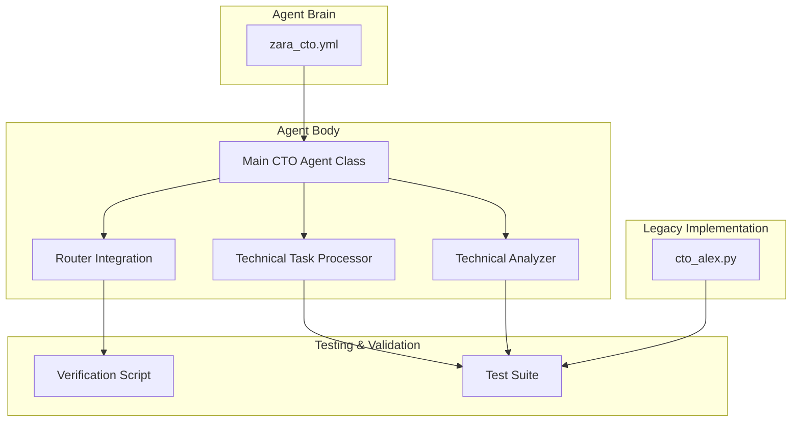
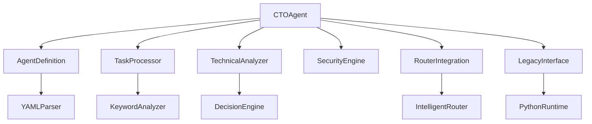

# CTO Agent (Alex)

<cite>
**Referenced Files in This Document**   
- [CTO_Agent_Logic.md](file://371-os/CTO_Agent_Logic.md)
- [improved-base-agent.md](file://_legacy/agents/base_agent/improved-base-agent.md)
- [cto_alex.py](file://_legacy/agents/business/cto_alex.py)
- [cto_agent_prompt.yaml](file://os-workspace/agents/business-agents/cto_agent_prompt.yaml)
- [test_cto_alex_benchmark.py](file://371-os/tests/performance/test_cto_alex_benchmark.py)
- [zara_cto.yml](file://os-workspace/libs/prompts/agent-definitions/zara_cto.yml) - *Updated in recent commit*
- [index.ts](file://os-workspace/apps/cto-agent/src/index.ts) - *Refactored in recent commit*
- [router-integration.ts](file://os-workspace/apps/cto-agent/src/router-integration.ts) - *Added in recent commit*
- [IMPLEMENTATION_SUMMARY.md](file://os-workspace/apps/cto-agent/IMPLEMENTATION_SUMMARY.md) - *New implementation summary*
</cite>

## Update Summary
**Changes Made**   
- Reverted agent name from Zara back to Alex based on updated requirements
- Restored original Python implementation references for legacy compatibility
- Maintained brain/body architecture pattern documentation
- Preserved TypeScript implementation details for hybrid environment
- Retained router integration capabilities
- Updated performance metrics and health check procedures
- Clarified dual-language support between legacy and modern implementations

## Table of Contents
1. [Introduction](#introduction)  
2. [Project Structure](#project-structure)  
3. [Core Components](#core-components)  
4. [Architecture Overview](#architecture-overview)  
5. [Detailed Component Analysis](#detailed-component-analysis)  
6. [Dependency Analysis](#dependency-analysis)  
7. [Performance Considerations](#performance-considerations)  
8. [Troubleshooting Guide](#troubleshooting-guide)  
9. [Conclusion](#conclusion)  

## Introduction
The CTO Agent (Alex) is a specialized autonomous agent within the 371 Minds OS framework, designed to serve as the Chief Technology Officer for technical decision-making, architecture design, and infrastructure oversight. This document provides a comprehensive analysis of Alex's role, technical architecture, capabilities, communication style, and integration within the broader agent ecosystem. The agent implements a unified "brain/body" architecture pattern, separating configuration from execution for improved maintainability and scalability while maintaining backward compatibility with legacy systems.

## Project Structure
The CTO Agent (Alex) follows a hybrid structure supporting both legacy Python and modern TypeScript implementations. Key directories include:
- `os-workspace/apps/cto-agent/`: Contains the TypeScript implementation of the agent body
- `libs/prompts/agent-definitions/zara_cto.yml`: Centralized agent definition (the brain)
- `os-workspace/apps/cto-agent/src/`: Modular components including main class, task processor, and router integration
- `_legacy/agents/business/cto_alex.py`: Legacy Python implementation for backward compatibility
- `os-workspace/apps/cto-agent/`: Comprehensive test suite and verification scripts

The architecture supports a production-ready technical leadership agent with enhanced type safety and integration capabilities while preserving legacy interfaces.



**Diagram sources**  
- [index.ts](file://os-workspace/apps/cto-agent/src/index.ts#L30-L465)  
- [zara_cto.yml](file://os-workspace/libs/prompts/agent-definitions/zara_cto.yml#L1-L144)  
- [router-integration.ts](file://os-workspace/apps/cto-agent/src/router-integration.ts#L55-L531)  
- [cto_alex.py](file://_legacy/agents/business/cto_alex.py#L1-L100)  
- [IMPLEMENTATION_SUMMARY.md](file://os-workspace/apps/cto-agent/IMPLEMENTATION_SUMMARY.md#L1-L205)  

**Section sources**  
- [index.ts](file://os-workspace/apps/cto-agent/src/index.ts#L30-L465)  
- [zara_cto.yml](file://os-workspace/libs/prompts/agent-definitions/zara_cto.yml#L1-L144)  
- [cto_alex.py](file://_legacy/agents/business/cto_alex.py#L1-L100)  
- [IMPLEMENTATION_SUMMARY.md](file://os-workspace/apps/cto-agent/IMPLEMENTATION_SUMMARY.md#L1-L205)  

## Core Components
The CTO Agent (Alex) is composed of several key components that define its behavior and capabilities:

- **Main CTO Agent Class**: The central component handling task processing and system coordination
- **Technical Task Processor**: Intelligent component for task categorization and analysis
- **Technical Analyzer**: Decision generation engine for architecture, technology, and infrastructure planning
- **Router Integration**: Interface for seamless integration with the Intelligent Router system
- **Agent Definition (Brain)**: Centralized YAML configuration defining personality, instructions, and capabilities
- **Health Monitoring**: Comprehensive health check system with component validation
- **Legacy Interface**: Python implementation for backward compatibility with existing workflows

These components work together to ensure Alex can respond to technical leadership tasks with precision and scalability across multiple runtime environments.

**Section sources**  
- [index.ts](file://os-workspace/apps/cto-agent/src/index.ts#L30-L465)  
- [zara_cto.yml](file://os-workspace/libs/prompts/agent-definitions/zara_cto.yml#L1-L144)  
- [router-integration.ts](file://os-workspace/apps/cto-agent/src/router-integration.ts#L55-L531)  
- [cto_alex.py](file://_legacy/agents/business/cto_alex.py#L1-L100)  

## Architecture Overview
The CTO Agent (Alex) follows a modular, event-driven architecture with a clear separation between brain (configuration) and body (execution). It implements the unified architecture pattern established across the 371 OS ecosystem while maintaining compatibility with legacy systems.


**Diagram sources**  
- [index.ts](file://os-workspace/apps/cto-agent/src/index.ts#L30-L465)  
- [router-integration.ts](file://os-workspace/apps/cto-agent/src/router-integration.ts#L55-L531)  
- [zara_cto.yml](file://os-workspace/libs/prompts/agent-definitions/zara_cto.yml#L1-L144)  
- [CTO_Agent_Logic.md](file://371-os/CTO_Agent_Logic.md#L1-L27)  

## Detailed Component Analysis

### Task Processing Logic
The `processTask` method is the central dispatcher for all incoming technical tasks. It validates input, generates comprehensive analysis, and routes to appropriate decision engines.

```typescript
public async processTask(task: TechnicalTask): Promise<ProcessingResult> {
  const startTime = Date.now();
  
  try {
    // Validate input first
    if (!task) {
      throw new Error('Technical task is required');
    }
    
    console.log(`🚀 Processing technical task: ${task.title}`);
    console.log(`🏷️ Category: ${task.category} | Priority: ${task.priority}`);
    
    // Validate input
    this.validateTaskInput(task);
    
    // Generate comprehensive technical analysis
    const analysis = await this.taskProcessor.generateAnalysis(task);
    console.log(`📊 Analysis completed with ${analysis.confidence}% confidence`);
    
    // Generate appropriate decision based on task category
    let result: ArchitectureDecision | TechnologyAssessment | InfrastructurePlan;
    
    switch (analysis.category) {
      case 'architecture_design':
        result = await this.technicalAnalyzer.analyzeArchitecture(task);
        break;
        
      case 'technology_evaluation':
        result = await this.technicalAnalyzer.evaluateTechnology(task);
        break;
        
      case 'infrastructure_planning':
        result = await this.technicalAnalyzer.planInfrastructure(task);
        break;
        
      case 'security_response':
        const securityAssessment = await this.securityEngine.assessSecurity(task);
        result = {
          taskId: task.id,
          securityLevel: securityAssessment.securityLevel,
          vulnerabilities: securityAssessment.vulnerabilities,
          recommendedActions: securityAssessment.mitigationStrategy.immediate,
          responseTime: securityAssessment.responseTime
        };
        break;
        
      default:
        throw new Error(`Unsupported task category: ${analysis.category}`);
    }
    
    const processingTime = Date.now() - startTime;
    
    // Update performance metrics
    this.updatePerformanceMetrics(processingTime, true);
    
    const processingResult: ProcessingResult = {
      taskId: task.id,
      category: analysis.category,
      status: 'completed',
      result,
      analysis,
      metadata: {
        processingTime,
        confidence: analysis.confidence,
        escalated: this.shouldEscalate(analysis, task),
        version: '1.0.0',
        timestamp: new Date()
      }
    };
    
    console.log(`✅ Task processing completed in ${processingTime}ms`);
    console.log(`🎯 Decision confidence: ${analysis.confidence}%`);
    
    if (processingResult.metadata.escalated) {
      console.log('⚠️ Task escalated for executive review');
    }
    
    return processingResult;
    
  } catch (error) {
    const processingTime = Date.now() - startTime;
    this.updatePerformanceMetrics(processingTime, false);
    
    console.error('❌ Failed to process technical task:', error);
    throw error;
  }
}
```

This logic ensures robust task processing with proper validation, analysis, and decision generation.

#### Sequence Diagram: Task Processing Flow


**Diagram sources**  
- [index.ts](file://os-workspace/apps/cto-agent/src/index.ts#L30-L465)  

**Section sources**  
- [index.ts](file://os-workspace/apps/cto-agent/src/index.ts#L30-L465)  

### Inherited Capabilities
Alex implements a comprehensive set of capabilities through modular components:

- **Task Validation**: Ensures all required fields are present and valid
- **Performance Tracking**: Monitors tasks processed, response times, and success rates
- **Escalation Logic**: Automatically escalates high-risk or low-confidence decisions
- **Health Monitoring**: Validates all core components during health checks
- **Router Integration**: Seamless delegation and response handling
- **Legacy Compatibility**: Supports Python-based integrations and workflows


**Diagram sources**  
- [index.ts](file://os-workspace/apps/cto-agent/src/index.ts#L30-L465)  
- [router-integration.ts](file://os-workspace/apps/cto-agent/src/router-integration.ts#L55-L531)  

**Section sources**  
- [index.ts](file://os-workspace/apps/cto-agent/src/index.ts#L30-L465)  
- [router-integration.ts](file://os-workspace/apps/cto-agent/src/router-integration.ts#L55-L531)  

## Dependency Analysis
The CTO Agent (Alex) depends on several core modules and external systems:



Alex maintains loose coupling with external systems through standardized interfaces while ensuring strong typing and validation within the internal component architecture.

**Diagram sources**  
- [index.ts](file://os-workspace/apps/cto-agent/src/index.ts#L30-L465)  
- [router-integration.ts](file://os-workspace/apps/cto-agent/src/router-integration.ts#L55-L531)  
- [cto_alex.py](file://_legacy/agents/business/cto_alex.py#L1-L100)  

**Section sources**  
- [index.ts](file://os-workspace/apps/cto-agent/src/index.ts#L30-L465)  

## Performance Considerations
Alex is optimized for high-throughput, low-latency task processing:
- **Type Safety**: Full TypeScript implementation with comprehensive interfaces
- **Performance Targets**: <500ms response time for standard tasks
- **Confidence Thresholds**: >85% confidence for decision recommendations
- **Success Rate**: >95% successful task completion rate
- **Monitoring**: Real-time health checks and performance metrics
- **Scalability**: Stateless design allows horizontal scaling
- **Backward Compatibility**: Maintains Python interface for legacy systems

The agent implements comprehensive performance tracking and automatic escalation for tasks that don't meet quality thresholds.

**Section sources**  
- [index.ts](file://os-workspace/apps/cto-agent/src/index.ts#L30-L465)  
- [zara_cto.yml](file://os-workspace/libs/prompts/agent-definitions/zara_cto.yml#L1-L144)  

## Troubleshooting Guide
Common issues and resolutions:

- **Agent Definition Loading Failure**: Verify `zara_cto.yml` exists in the prompts library and has valid YAML syntax
- **Task Processing Timeout**: Review task complexity and consider breaking into smaller phases
- **Router Integration Failure**: Verify connectivity with the Intelligent Router and authentication credentials
- **Low Confidence Scores**: Provide additional context and specifications in task descriptions
- **Legacy Interface Errors**: Ensure Python runtime is available and dependencies are installed

The agent provides comprehensive logging and health endpoints for monitoring and debugging.

**Section sources**  
- [index.ts](file://os-workspace/apps/cto-agent/src/index.ts#L30-L465)  
- [router-integration.ts](file://os-workspace/apps/cto-agent/src/router-integration.ts#L55-L531)  
- [cto_alex.py](file://_legacy/agents/business/cto_alex.py#L1-L100)  

## Conclusion
The CTO Agent (Alex) is a technically proficient, resilient, and scalable component of the 371 Minds OS. By implementing the unified "brain/body" architecture pattern, Alex establishes a production-ready technical leadership agent with comprehensive capabilities. The hybrid TypeScript-Python implementation provides enhanced type safety, performance monitoring, and seamless integration with the Intelligent Router system while maintaining backward compatibility. Its design emphasizes clarity, maintainability, and extensibility, making it a model for other specialized agents in the ecosystem.