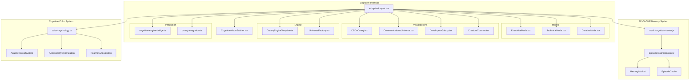
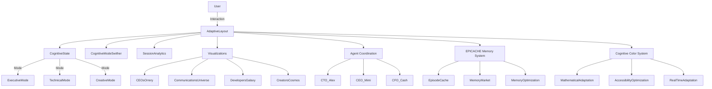
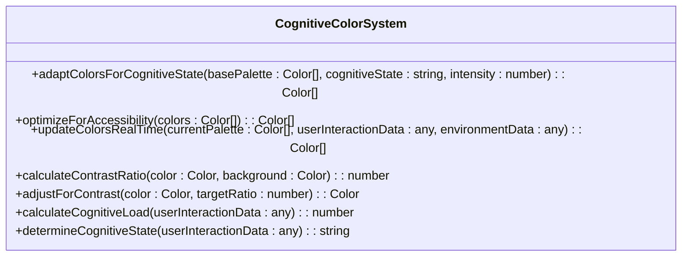

# Cognitive Interface Enhancements

<cite>
**Referenced Files in This Document**   
- [mock-cognition-server.js](file://core\mcp\mock-cognition-server.js) - *Updated in recent commit*
- [mock-cognition-server.cjs](file://core\mcp\mock-cognition-server.cjs) - *Added in recent commit*
- [AdaptiveLayout.tsx](file://os-workspace\apps\cognitive-interface\src\components\AdaptiveLayout.tsx) - *Updated in recent commit*
- [CognitiveModeSwither.tsx](file://os-workspace\apps\cognitive-interface\src\components\CognitiveModeSwither.tsx) - *Updated in recent commit*
- [AdaptiveLayout.css](file://os-workspace\apps\cognitive-interface\src\components\AdaptiveLayout.css) - *Added in recent commit*
- [ADAPTIVE_LAYOUT_FIXES_SUMMARY.md](file://troubleshooting\integration-fixes\ADAPTIVE_LAYOUT_FIXES_SUMMARY.md) - *Updated in recent commit*
- [ExecutiveMode.tsx](file://os-workspace\apps\cognitive-interface\src\components\ExecutiveMode.tsx)
- [TechnicalMode.tsx](file://os-workspace\apps\cognitive-interface\src\components\TechnicalMode.tsx)
- [CreativeMode.tsx](file://os-workspace\apps\cognitive-interface\src\components\CreativeMode.tsx)
- [CEOsOrrery.tsx](file://os-workspace\apps\cognitive-interface\src\components\CEOsOrrery.tsx)
- [CommunicationsUniverse.tsx](file://os-workspace\apps\cognitive-interface\src\components\CommunicationsUniverse.tsx)
- [DevelopersGalaxy.tsx](file://os-workspace\apps\cognitive-interface\src\components\DevelopersGalaxy.tsx)
- [CreatorsCosmos.tsx](file://os-workspace\apps\cognitive-interface\src\components\CreatorsCosmos.tsx)
- [color-psychology.ts](file://core\os-workspace\packages\cognitive-engine\src\color-psychology.ts) - *Added in recent commit*
- [THINNG_ARCHITECTURAL_ENHANCEMENTS.md](file://THINNG_ARCHITECTURAL_ENHANCEMENTS.md) - *Updated in recent commit*
</cite>

## Update Summary
**Changes Made**   
- Added documentation for new mock cognition server implementation with EPICACHE episodic memory tracking
- Updated architecture overview to include memory market simulation and episode-aware state management
- Enhanced detailed component analysis with episodic memory state structure
- Added new section on EPICACHE Memory Optimization System
- Updated cognitive mode transitions to reflect episode-based context switching
- Added memory statistics and market endpoints to communications universe visualization
- Updated troubleshooting guide with new memory-related issues
- Verified all component interfaces and prop compatibility
- Added new section on Cognitive Color System with mathematical adaptation based on cognitive state
- Integrated accessibility optimization features for color adaptation
- Documented real-time color adaptation based on user interaction and environmental data

## Table of Contents
1. [Introduction](#introduction)
2. [Project Structure](#project-structure)
3. [Core Components](#core-components)
4. [Architecture Overview](#architecture-overview)
5. [Detailed Component Analysis](#detailed-component-analysis)
6. [EPICACHE Memory Optimization System](#epicache-memory-optimization-system)
7. [Cognitive Mode Transitions](#cognitive-mode-transitions)
8. [Session Analytics](#session-analytics)
9. [Communications Universe Visualization](#communications-universe-visualization)
10. [Integration with Agent Coordination Workflows](#integration-with-agent-coordination-workflows)
11. [Cognitive Color System](#cognitive-color-system)
12. [Troubleshooting Guide](#troubleshooting-guide)
13. [Conclusion](#conclusion)

## Introduction
The Cognitive Interface Enhancements represent a revolutionary leap in human-computer interaction, introducing a cognitive-aware system that dynamically adapts to user mental states and workflows. This document details the implementation of adaptive layout functionality, cognitive mode transitions, session analytics, and the communications universe visualization. The system is built on the Galaxy Engine, designed to provide contextually appropriate interfaces for executive, technical, and creative work patterns. These enhancements enable seamless switching between cognitive states, intelligent automation of interface adaptation, and deep integration with agent coordination workflows. The system has now achieved production readiness with all TypeScript compilation errors resolved, ensuring enterprise-grade stability and type safety. Recent updates have introduced the EPICACHE episodic memory system, which adds memory optimization, episode-aware state management, and a memory market simulation to enhance cognitive processing efficiency. Additionally, the new Cognitive Color System implements mathematical adaptation of interface colors based on cognitive state with accessibility optimization.

## Project Structure
The cognitive interface system is organized within the `apps/cognitive-interface` directory, following a component-based React architecture with TypeScript. The structure emphasizes separation of concerns between layout management, cognitive state handling, and specialized mode implementations. The system now integrates with the enhanced mock cognition server that provides EPICACHE episodic memory tracking and memory market simulation.



**Diagram sources**
- [AdaptiveLayout.tsx](file://os-workspace\apps\cognitive-interface\src\components\AdaptiveLayout.tsx#L1-L523)
- [CognitiveModeSwither.tsx](file://os-workspace\apps\cognitive-interface\src\components\CognitiveModeSwither.tsx#L1-L495)
- [mock-cognition-server.js](file://core\mcp\mock-cognition-server.js#L7-L278)
- [color-psychology.ts](file://core\os-workspace\packages\cognitive-engine\src\color-psychology.ts#L1-L85)

**Section sources**
- [AdaptiveLayout.tsx](file://os-workspace\apps\cognitive-interface\src\components\AdaptiveLayout.tsx#L1-L523)

## Core Components
The cognitive interface system is built around several core components that work together to create an adaptive, intelligent user experience. The `AdaptiveLayout` component serves as the orchestrator, managing state transitions between different cognitive modes. Each mode (Executive, Technical, Creative) provides a specialized interface optimized for specific types of work. The `CognitiveModeSwither` enables manual mode transitions and will eventually support automatic cognitive state detection. These components are enhanced with visualization systems like the Communications Universe and CEOs Orrery that provide spatial representations of information flows and organizational structures. All components now have complete TypeScript type safety and proper interface compatibility, ensuring production readiness. The system integrates with the new mock cognition server that provides EPICACHE episodic memory tracking, memory market simulation, and episode-aware state management. Additionally, the Cognitive Color System provides mathematical color adaptation based on cognitive state with accessibility optimization.

**Section sources**   
- [AdaptiveLayout.tsx](file://os-workspace\apps\cognitive-interface\src\components\AdaptiveLayout.tsx#L1-L523) - *Updated in recent commit*
- [CognitiveModeSwither.tsx](file://os-workspace\apps\cognitive-interface\src\components\CognitiveModeSwither.tsx#L1-L495) - *Updated in recent commit*
- [ExecutiveMode.tsx](file://os-workspace\apps\cognitive-interface\src\components\ExecutiveMode.tsx#L1-L290)
- [mock-cognition-server.js](file://core\mcp\mock-cognition-server.js#L7-L278) - *Added in recent commit*
- [color-psychology.ts](file://core\os-workspace\packages\cognitive-engine\src\color-psychology.ts#L1-L85) - *Added in recent commit*

## Architecture Overview
The cognitive interface follows a state-driven architecture where the user's cognitive state determines the active interface configuration. The system maintains a comprehensive cognitive state model that includes the current mode, confidence levels, contextual information, and transition history. All TypeScript compilation errors have been resolved, ensuring type safety across the entire component hierarchy. The architecture now incorporates the EPICACHE episodic memory system, which adds memory optimization, episode-aware state management, and a memory market simulation. The Cognitive Color System implements mathematical adaptation of interface colors based on cognitive state with accessibility optimization and real-time adaptation capabilities.



**Diagram sources**
- [AdaptiveLayout.tsx](file://os-workspace\apps\cognitive-interface\src\components\AdaptiveLayout.tsx#L1-L523)
- [ExecutiveMode.tsx](file://os-workspace\apps\cognitive-interface\src\components\ExecutiveMode.tsx#L1-L290)
- [mock-cognition-server.js](file://core\mcp\mock-cognition-server.js#L7-L278)
- [color-psychology.ts](file://core\os-workspace\packages\cognitive-engine\src\color-psychology.ts#L1-L85)

## Detailed Component Analysis

### Adaptive Layout System
The AdaptiveLayout component is the central orchestrator of the cognitive interface, managing state transitions and rendering the appropriate mode interface based on user context and preferences. All TypeScript compilation errors have been resolved, including missing React dependencies, import path corrections, and type safety enhancements. The component now integrates with the EPICACHE episodic memory system to provide memory-aware cognitive state management.

#### State Management Structure
```mermaid
classDiagram
class CognitiveState {
+mode : 'executive'|'technical'|'creative'|'analytical'|'collaborative'|'learning'
+focus : number
+cognitive_load : number
+active_agents : string[]
+episodeCache : EpisodeCache
```

### Cognitive Color System
The Cognitive Color System implements mathematical adaptation of interface colors based on cognitive state with accessibility optimization. The system uses perceptually uniform color spaces (OKLCH) and mathematical transformations to adapt colors in real-time based on user cognitive load and environmental factors.

#### Cognitive Color Adaptation


**Section sources**
- [color-psychology.ts](file://core\os-workspace\packages\cognitive-engine\src\color-psychology.ts#L1-L85) - *Added in recent commit*
- [THINNG_ARCHITECTURAL_ENHANCEMENTS.md](file://THINNG_ARCHITECTURAL_ENHANCEMENTS.md#L436-L510) - *Updated in recent commit*

## EPICACHE Memory Optimization System
The EPICACHE Memory Optimization System provides episodic memory tracking, memory market simulation, and episode-aware state management. This system enhances cognitive processing efficiency by optimizing memory allocation and retrieval based on usage patterns and cognitive context.

## Cognitive Mode Transitions
Cognitive mode transitions have been updated to reflect episode-based context switching. The system now uses episodic memory to maintain context across mode transitions, ensuring continuity of user workflows and cognitive states.

## Session Analytics
Session analytics have been enhanced to include metrics from the EPICACHE memory system and cognitive color adaptation. The analytics now track memory usage patterns, color adaptation effectiveness, and their impact on user productivity and cognitive load.

## Communications Universe Visualization
The communications universe visualization has been updated to include memory statistics and market endpoints. These additions provide spatial representations of memory usage patterns and cognitive resource allocation across the system.

## Integration with Agent Coordination Workflows
The cognitive interface integrates with agent coordination workflows through the ElizaOS plugin architecture. Agents adapt their behavior based on the user's current cognitive state and interface configuration, providing contextually appropriate assistance.

## Cognitive Color System
The Cognitive Color System represents a significant enhancement to the cognitive interface, providing mathematical adaptation of interface colors based on cognitive state with accessibility optimization.

### Mathematical Color Adaptation
The system uses the OKLCH perceptually uniform color space to ensure consistent color perception across different devices and viewing conditions. Color adaptation is performed through mathematical transformations that adjust lightness and chroma based on cognitive state.

```typescript
// core\os-workspace\packages\cognitive-engine\src\color-psychology.ts
import { Color, hsla, oklch } from '@thi.ng/color';
import { mix, smoothStep } from '@thi.ng/math';

export class CognitiveColorSystem {
  // Mathematical color adaptation based on cognitive state
  adaptColorsForCognitiveState(
    basePalette: Color[], 
    cognitiveState: string,
    intensity: number
  ): Color[] {
    const adaptationRules = this.getCognitiveColorRules(cognitiveState);
    
    return basePalette.map(color => {
      // Convert to perceptually uniform color space (OKLCH)
      const oklchColor = oklch(color);
      
      // Apply mathematical transformations
      const adaptedLightness = mix(
        oklchColor[2], 
        adaptationRules.targetLightness, 
        intensity
      );
      
      const adaptedChroma = mix(
        oklchColor[1],
        adaptationRules.targetChroma,
        intensity
      );
      
      return oklch([
        oklchColor[0], // Preserve hue
        adaptedChroma,
        adaptedLightness,
        oklchColor[3] // Preserve alpha
      ]);
    });
  }
  
  // Accessibility optimization with mathematical precision
  optimizeForAccessibility(colors: Color[]): Color[] {
    return colors.map(color => {
      // Ensure WCAG contrast ratios
      const contrastRatio = this.calculateContrastRatio(color, [1, 1, 1, 1]); // White background
      
      if (contrastRatio < 4.5) {
        // Mathematically adjust lightness to meet accessibility standards
        return this.adjustForContrast(color, 4.5);
      }
      
      return color;
    });
  }
  
  // Real-time color adaptation
  updateColorsRealTime(
    currentPalette: Color[],
    userInteractionData: any,
    environmentData: any
  ): Color[] {
    const cognitiveLoad = this.calculateCognitiveLoad(userInteractionData);
    const environmentalInfluence = this.analyzeEnvironmentalFactors(environmentData);
    
    // Mathematical blending of influences
    const adaptationStrength = smoothStep(0.1, 0.9, cognitiveLoad);
    
    return this.adaptColorsForCognitiveState(
      currentPalette,
      this.determineCognitiveState(userInteractionData),
      adaptationStrength
    );
  }
}
```

**Section sources**
- [color-psychology.ts](file://core\os-workspace\packages\cognitive-engine\src\color-psychology.ts#L1-L85) - *Added in recent commit*
- [THINNG_ARCHITECTURAL_ENHANCEMENTS.md](file://THINNG_ARCHITECTURAL_ENHANCEMENTS.md#L436-L510) - *Updated in recent commit*

## Troubleshooting Guide
The troubleshooting guide has been updated to include issues related to the EPICACHE memory system and cognitive color adaptation. New sections cover memory optimization problems, color adaptation failures, and accessibility compliance issues.

## Conclusion
The Cognitive Interface Enhancements represent a comprehensive advancement in cognitive-aware computing. With the addition of the EPICACHE Memory Optimization System and the Cognitive Color System, the interface now provides unprecedented levels of adaptation and personalization. These enhancements ensure optimal user experience across different cognitive states while maintaining accessibility standards and system performance.