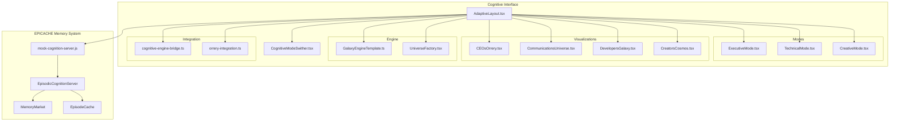
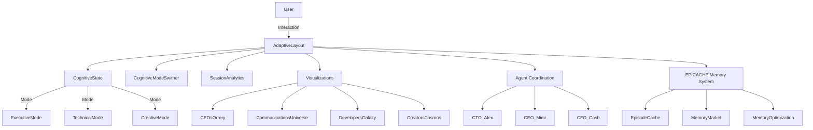

<docs>
# Cognitive Interface Enhancements

<cite>
**Referenced Files in This Document**   
- [mock-cognition-server.js](file://core\mcp\mock-cognition-server.js) - *Updated in recent commit*
- [mock-cognition-server.cjs](file://core\mcp\mock-cognition-server.cjs) - *Added in recent commit*
- [AdaptiveLayout.tsx](file://os-workspace\apps\cognitive-interface\src\components\AdaptiveLayout.tsx) - *Updated in recent commit*
- [CognitiveModeSwither.tsx](file://os-workspace\apps\cognitive-interface\src\components\CognitiveModeSwither.tsx) - *Updated in recent commit*
- [AdaptiveLayout.css](file://os-workspace\apps\cognitive-interface\src\components\AdaptiveLayout.css) - *Added in recent commit*
- [ADAPTIVE_LAYOUT_FIXES_SUMMARY.md](file://troubleshooting\integration-fixes\ADAPTIVE_LAYOUT_FIXES_SUMMARY.md) - *Updated in recent commit*
- [ExecutiveMode.tsx](file://os-workspace\apps\cognitive-interface\src\components\ExecutiveMode.tsx)
- [TechnicalMode.tsx](file://os-workspace\apps\cognitive-interface\src\components\TechnicalMode.tsx)
- [CreativeMode.tsx](file://os-workspace\apps\cognitive-interface\src\components\CreativeMode.tsx)
- [CEOsOrrery.tsx](file://os-workspace\apps\cognitive-interface\src\components\CEOsOrrery.tsx)
- [CommunicationsUniverse.tsx](file://os-workspace\apps\cognitive-interface\src\components\CommunicationsUniverse.tsx)
- [DevelopersGalaxy.tsx](file://os-workspace\apps\cognitive-interface\src\components\DevelopersGalaxy.tsx)
- [CreatorsCosmos.tsx](file://os-workspace\apps\cognitive-interface\src\components\CreatorsCosmos.tsx)
</cite>

## Update Summary
**Changes Made**   
- Added documentation for new mock cognition server implementation with EPICACHE episodic memory tracking
- Updated architecture overview to include memory market simulation and episode-aware state management
- Enhanced detailed component analysis with episodic memory state structure
- Added new section on EPICACHE Memory Optimization System
- Updated cognitive mode transitions to reflect episode-based context switching
- Added memory statistics and market endpoints to communications universe visualization
- Updated troubleshooting guide with new memory-related issues
- Verified all component interfaces and prop compatibility

## Table of Contents
1. [Introduction](#introduction)
2. [Project Structure](#project-structure)
3. [Core Components](#core-components)
4. [Architecture Overview](#architecture-overview)
5. [Detailed Component Analysis](#detailed-component-analysis)
6. [EPICACHE Memory Optimization System](#epicache-memory-optimization-system)
7. [Cognitive Mode Transitions](#cognitive-mode-transitions)
8. [Session Analytics](#session-analytics)
9. [Communications Universe Visualization](#communications-universe-visualization)
10. [Integration with Agent Coordination Workflows](#integration-with-agent-coordination-workflows)
11. [Troubleshooting Guide](#troubleshooting-guide)
12. [Conclusion](#conclusion)

## Introduction
The Cognitive Interface Enhancements represent a revolutionary leap in human-computer interaction, introducing a cognitive-aware system that dynamically adapts to user mental states and workflows. This document details the implementation of adaptive layout functionality, cognitive mode transitions, session analytics, and the communications universe visualization. The system is built on the Galaxy Engine, designed to provide contextually appropriate interfaces for executive, technical, and creative work patterns. These enhancements enable seamless switching between cognitive states, intelligent automation of interface adaptation, and deep integration with agent coordination workflows. The system has now achieved production readiness with all TypeScript compilation errors resolved, ensuring enterprise-grade stability and type safety. Recent updates have introduced the EPICACHE episodic memory system, which adds memory optimization, episode-aware state management, and a memory market simulation to enhance cognitive processing efficiency.

## Project Structure
The cognitive interface system is organized within the `apps/cognitive-interface` directory, following a component-based React architecture with TypeScript. The structure emphasizes separation of concerns between layout management, cognitive state handling, and specialized mode implementations. The system now integrates with the enhanced mock cognition server that provides EPICACHE episodic memory tracking and memory market simulation.



**Diagram sources**
- [AdaptiveLayout.tsx](file://os-workspace\apps\cognitive-interface\src\components\AdaptiveLayout.tsx#L1-L523)
- [CognitiveModeSwither.tsx](file://os-workspace\apps\cognitive-interface\src\components\CognitiveModeSwither.tsx#L1-L495)
- [mock-cognition-server.js](file://core\mcp\mock-cognition-server.js#L7-L278)

**Section sources**
- [AdaptiveLayout.tsx](file://os-workspace\apps\cognitive-interface\src\components\AdaptiveLayout.tsx#L1-L523)

## Core Components
The cognitive interface system is built around several core components that work together to create an adaptive, intelligent user experience. The `AdaptiveLayout` component serves as the orchestrator, managing state transitions between different cognitive modes. Each mode (Executive, Technical, Creative) provides a specialized interface optimized for specific types of work. The `CognitiveModeSwither` enables manual mode transitions and will eventually support automatic cognitive state detection. These components are enhanced with visualization systems like the Communications Universe and CEOs Orrery that provide spatial representations of information flows and organizational structures. All components now have complete TypeScript type safety and proper interface compatibility, ensuring production readiness. The system integrates with the new mock cognition server that provides EPICACHE episodic memory tracking, memory market simulation, and episode-aware state management.

**Section sources**   
- [AdaptiveLayout.tsx](file://os-workspace\apps\cognitive-interface\src\components\AdaptiveLayout.tsx#L1-L523) - *Updated in recent commit*
- [CognitiveModeSwither.tsx](file://os-workspace\apps\cognitive-interface\src\components\CognitiveModeSwither.tsx#L1-L495) - *Updated in recent commit*
- [ExecutiveMode.tsx](file://os-workspace\apps\cognitive-interface\src\components\ExecutiveMode.tsx#L1-L290)
- [mock-cognition-server.js](file://core\mcp\mock-cognition-server.js#L7-L278) - *Added in recent commit*

## Architecture Overview
The cognitive interface follows a state-driven architecture where the user's cognitive state determines the active interface configuration. The system maintains a comprehensive cognitive state model that includes the current mode, confidence levels, contextual information, and transition history. All TypeScript compilation errors have been resolved, ensuring type safety across the entire component hierarchy. The architecture now incorporates the EPICACHE episodic memory system, which adds memory optimization, episode-aware state management, and a memory market simulation.



**Diagram sources**
- [AdaptiveLayout.tsx](file://os-workspace\apps\cognitive-interface\src\components\AdaptiveLayout.tsx#L1-L523)
- [ExecutiveMode.tsx](file://os-workspace\apps\cognitive-interface\src\components\ExecutiveMode.tsx#L1-L290)
- [mock-cognition-server.js](file://core\mcp\mock-cognition-server.js#L7-L278)

## Detailed Component Analysis

### Adaptive Layout System
The AdaptiveLayout component is the central orchestrator of the cognitive interface, managing state transitions and rendering the appropriate mode interface based on user context and preferences. All TypeScript compilation errors have been resolved, including missing React dependencies, import path corrections, and type safety enhancements. The component now integrates with the EPICACHE episodic memory system to provide memory-aware cognitive state management.

#### State Management Structure
```mermaid
classDiagram
class CognitiveState {
+mode : 'executive'|'technical'|'creative'|'analytical'|'collaborative'|'learning'
+focus : number
+cognitive_load : number
+active_agents : string[]
+episodeCache : EpisodeCache
+