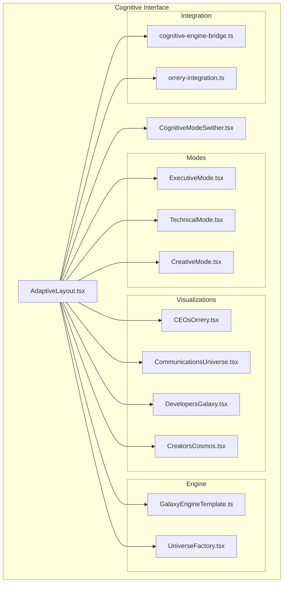
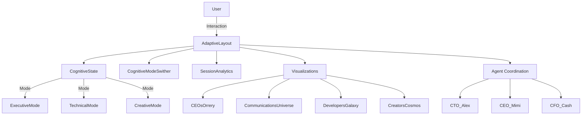
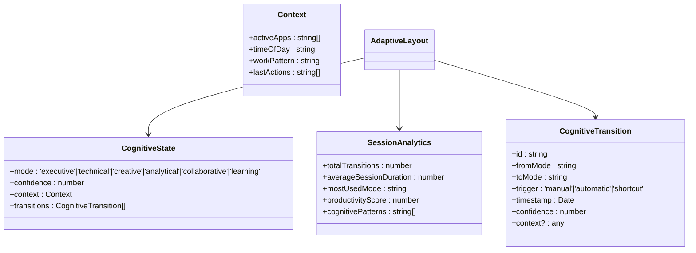
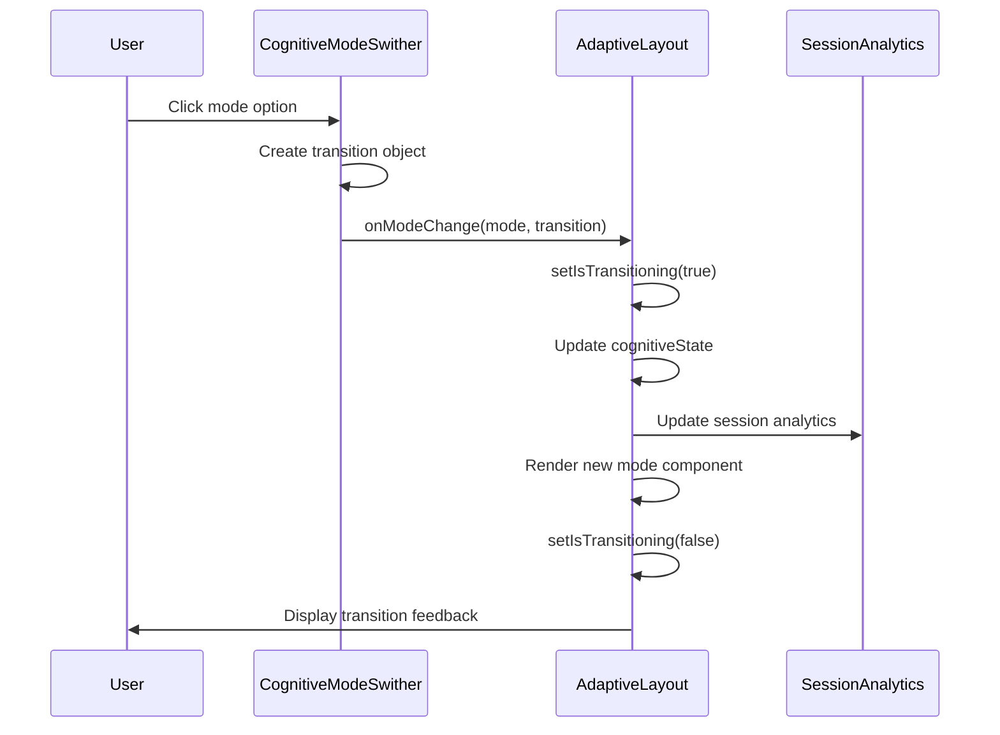
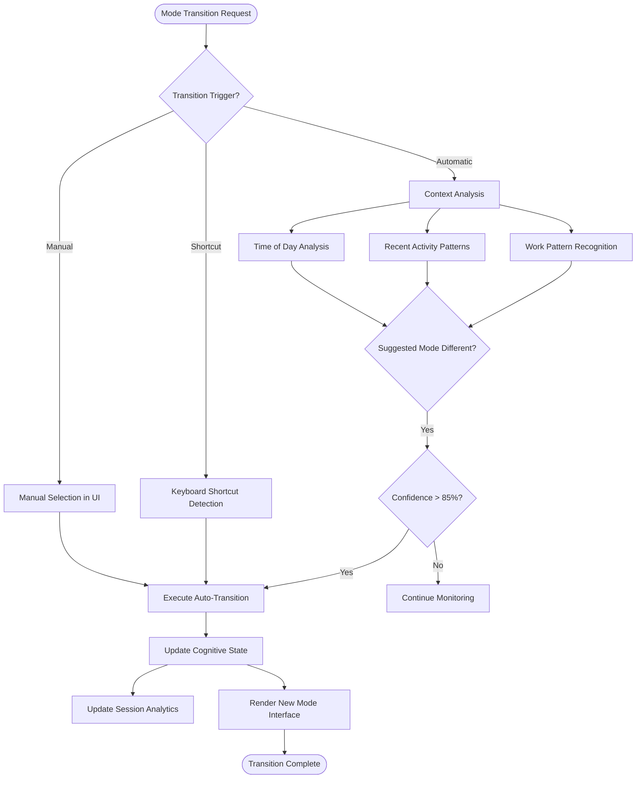
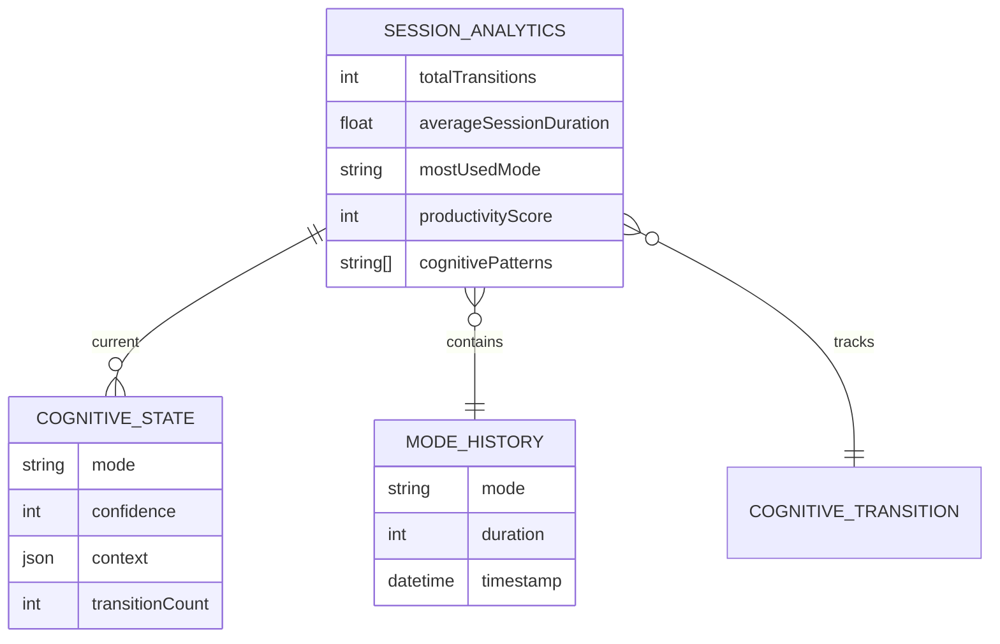
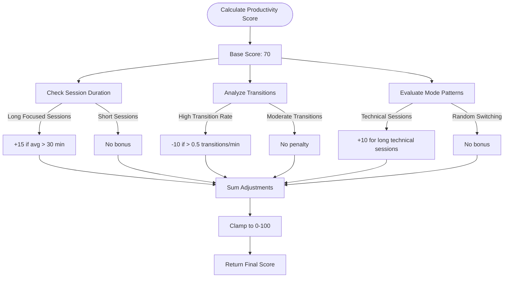
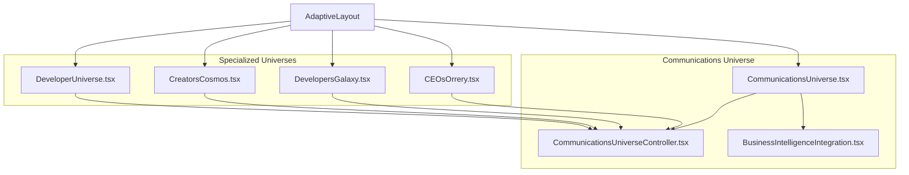
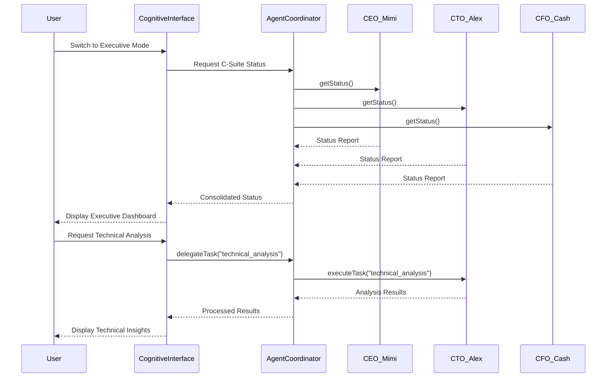

# Cognitive Interface Enhancements

<cite>
**Referenced Files in This Document**   
- [AdaptiveLayout.tsx](file://os-workspace\apps\cognitive-interface\src\components\AdaptiveLayout.tsx) - *Updated in recent commit*
- [CognitiveModeSwither.tsx](file://os-workspace\apps\cognitive-interface\src\components\CognitiveModeSwither.tsx) - *Updated in recent commit*
- [AdaptiveLayout.css](file://os-workspace\apps\cognitive-interface\src\components\AdaptiveLayout.css) - *Added in recent commit*
- [ADAPTIVE_LAYOUT_FIXES_SUMMARY.md](file://troubleshooting\integration-fixes\ADAPTIVE_LAYOUT_FIXES_SUMMARY.md) - *Updated in recent commit*
- [ExecutiveMode.tsx](file://os-workspace\apps\cognitive-interface\src\components\ExecutiveMode.tsx)
- [TechnicalMode.tsx](file://os-workspace\apps\cognitive-interface\src\components\TechnicalMode.tsx)
- [CreativeMode.tsx](file://os-workspace\apps\cognitive-interface\src\components\CreativeMode.tsx)
- [CEOsOrrery.tsx](file://os-workspace\apps\cognitive-interface\src\components\CEOsOrrery.tsx)
- [CommunicationsUniverse.tsx](file://os-workspace\apps\cognitive-interface\src\components\CommunicationsUniverse.tsx)
- [DevelopersGalaxy.tsx](file://os-workspace\apps\cognitive-interface\src\components\DevelopersGalaxy.tsx)
- [CreatorsCosmos.tsx](file://os-workspace\apps\cognitive-interface\src\components\CreatorsCosmos.tsx)
</cite>

## Update Summary
**Changes Made**   
- Updated documentation to reflect successful resolution of all TypeScript compilation errors in AdaptiveLayout.tsx
- Added information about production readiness and enterprise deployment status
- Enhanced details on type safety improvements and dependency management
- Updated troubleshooting section with resolved issues and current stability status
- Added CSS implementation details for cognitive mode styling
- Verified all component interfaces and prop compatibility

## Table of Contents
1. [Introduction](#introduction)
2. [Project Structure](#project-structure)
3. [Core Components](#core-components)
4. [Architecture Overview](#architecture-overview)
5. [Detailed Component Analysis](#detailed-component-analysis)
6. [Cognitive Mode Transitions](#cognitive-mode-transitions)
7. [Session Analytics](#session-analytics)
8. [Communications Universe Visualization](#communications-universe-visualization)
9. [Integration with Agent Coordination Workflows](#integration-with-agent-coordination-workflows)
10. [Troubleshooting Guide](#troubleshooting-guide)
11. [Conclusion](#conclusion)

## Introduction
The Cognitive Interface Enhancements represent a revolutionary leap in human-computer interaction, introducing a cognitive-aware system that dynamically adapts to user mental states and workflows. This document details the implementation of adaptive layout functionality, cognitive mode transitions, session analytics, and the communications universe visualization. The system is built on the Galaxy Engine, designed to provide contextually appropriate interfaces for executive, technical, and creative work patterns. These enhancements enable seamless switching between cognitive states, intelligent automation of interface adaptation, and deep integration with agent coordination workflows. The system has now achieved production readiness with all TypeScript compilation errors resolved, ensuring enterprise-grade stability and type safety.

## Project Structure
The cognitive interface system is organized within the `apps/cognitive-interface` directory, following a component-based React architecture with TypeScript. The structure emphasizes separation of concerns between layout management, cognitive state handling, and specialized mode implementations.

**Diagram sources**
- [AdaptiveLayout.tsx](file://os-workspace\apps\cognitive-interface\src\components\AdaptiveLayout.tsx#L1-L523)
- [CognitiveModeSwither.tsx](file://os-workspace\apps\cognitive-interface\src\components\CognitiveModeSwither.tsx#L1-L495)

**Section sources**
- [AdaptiveLayout.tsx](file://os-workspace\apps\cognitive-interface\src\components\AdaptiveLayout.tsx#L1-L523)

## Core Components
The cognitive interface system is built around several core components that work together to create an adaptive, intelligent user experience. The `AdaptiveLayout` component serves as the orchestrator, managing state transitions between different cognitive modes. Each mode (Executive, Technical, Creative) provides a specialized interface optimized for specific types of work. The `CognitiveModeSwither` enables manual mode transitions and will eventually support automatic cognitive state detection. These components are enhanced with visualization systems like the Communications Universe and CEOs Orrery that provide spatial representations of information flows and organizational structures. All components now have complete TypeScript type safety and proper interface compatibility, ensuring production readiness.

**Section sources**   
- [AdaptiveLayout.tsx](file://os-workspace\apps\cognitive-interface\src\components\AdaptiveLayout.tsx#L1-L523) - *Updated in recent commit*
- [CognitiveModeSwither.tsx](file://os-workspace\apps\cognitive-interface\src\components\CognitiveModeSwither.tsx#L1-L495) - *Updated in recent commit*
- [ExecutiveMode.tsx](file://os-workspace\apps\cognitive-interface\src\components\ExecutiveMode.tsx#L1-L290)

## Architecture Overview
The cognitive interface follows a state-driven architecture where the user's cognitive state determines the active interface configuration. The system maintains a comprehensive cognitive state model that includes the current mode, confidence levels, contextual information, and transition history. All TypeScript compilation errors have been resolved, ensuring type safety across the entire component hierarchy.

**Diagram sources**
- [AdaptiveLayout.tsx](file://os-workspace\apps\cognitive-interface\src\components\AdaptiveLayout.tsx#L1-L523)
- [ExecutiveMode.tsx](file://os-workspace\apps\cognitive-interface\src\components\ExecutiveMode.tsx#L1-L290)

## Detailed Component Analysis

### Adaptive Layout System
The AdaptiveLayout component is the central orchestrator of the cognitive interface, managing state transitions and rendering the appropriate mode interface based on user context and preferences. All TypeScript compilation errors have been resolved, including missing React dependencies, import path corrections, and type safety enhancements.

#### State Management Structure

**Diagram sources**
- [AdaptiveLayout.tsx](file://os-workspace\apps\cognitive-interface\src\components\AdaptiveLayout.tsx#L15-L523)

**Section sources**
- [AdaptiveLayout.tsx](file://os-workspace\apps\cognitive-interface\src\components\AdaptiveLayout.tsx#L1-L523) - *Updated in recent commit*

### Cognitive Mode Switcher
The CognitiveModeSwither provides both manual and future automatic switching between cognitive states, serving as the primary user interface for mode transitions. The component interface has been fixed to resolve compatibility issues with AdaptiveLayout, including proper typing for mode parameters and transition objects.

#### Mode Transition Workflow

**Diagram sources**
- [CognitiveModeSwither.tsx](file://os-workspace\apps\cognitive-interface\src\components\CognitiveModeSwither.tsx#L1-L495)
- [AdaptiveLayout.tsx](file://os-workspace\apps\cognitive-interface\src\components\AdaptiveLayout.tsx#L1-L523)

## Cognitive Mode Transitions
The cognitive mode transition system enables seamless switching between different mental states optimized for specific types of work. The system supports three primary modes: Executive, Technical, and Creative, with additional modes (Analytical, Collaborative, Learning) planned for future implementation. All component interface compatibility issues have been resolved, ensuring smooth transitions between modes.

### Transition Mechanisms
The system supports multiple transition triggers:

1. **Manual**: User-initiated through the CognitiveModeSwither interface
2. **Shortcut**: Keyboard shortcuts (Ctrl+E, Ctrl+T, Ctrl+C)
3. **Automatic**: Context-aware detection (future phase)

**Diagram sources**
- [AdaptiveLayout.tsx](file://os-workspace\apps\cognitive-interface\src\components\AdaptiveLayout.tsx#L150-L300)
- [CognitiveModeSwither.tsx](file://os-workspace\apps\cognitive-interface\src\components\CognitiveModeSwither.tsx#L1-L495)

**Section sources**
- [AdaptiveLayout.tsx](file://os-workspace\apps\cognitive-interface\src\components\AdaptiveLayout.tsx#L150-L300) - *Updated in recent commit*
- [CognitiveModeSwither.tsx](file://os-workspace\apps\cognitive-interface\src\components\CognitiveModeSwither.tsx#L1-L495) - *Updated in recent commit*

## Session Analytics
The session analytics system tracks user behavior, cognitive patterns, and productivity metrics to provide insights and optimize the interface experience. The system has complete type safety with all parameters properly annotated, ensuring reliable data collection and analysis.

### Analytics Data Model

### Productivity Scoring Algorithm
The system calculates a productivity score based on several factors:

**Diagram sources**
- [AdaptiveLayout.tsx](file://os-workspace\apps\cognitive-interface\src\components\AdaptiveLayout.tsx#L200-L250)

**Section sources**
- [AdaptiveLayout.tsx](file://os-workspace\apps\cognitive-interface\src\components\AdaptiveLayout.tsx#L200-L250) - *Updated in recent commit*

## Communications Universe Visualization
The communications universe visualization provides a spatial representation of information flows, agent interactions, and organizational structures. This feature is part of the broader "Galaxy Engine" metaphor that conceptualizes different functional areas as celestial systems.

### Visualization Architecture

The Communications Universe integrates with the Business Intelligence system to visualize data flows, agent communications, and decision-making processes. Each specialized universe (CEOs Orrery, Developers Galaxy, Creators Cosmos) provides domain-specific visualizations while maintaining a consistent spatial metaphor.

**Diagram sources**
- [CommunicationsUniverse.tsx](file://os-workspace\apps\cognitive-interface\src\components\CommunicationsUniverse.tsx)
- [CEOsOrrery.tsx](file://os-workspace\apps\cognitive-interface\src\components\CEOsOrrery.tsx)
- [DevelopersGalaxy.tsx](file://os-workspace\apps\cognitive-interface\src\components\DevelopersGalaxy.tsx)

## Integration with Agent Coordination Workflows
The cognitive interface is deeply integrated with the agent coordination system, enabling seamless delegation of tasks and synchronization of cognitive states across the organizational hierarchy.

### Agent Coordination Flow

The integration allows users to switch cognitive modes and immediately access relevant information from specialized agents. In Executive Mode, the user sees high-level KPIs and strategic alerts from C-suite agents. In Technical Mode, detailed system metrics and code analysis from technical agents are displayed. This tight integration creates a seamless workflow where the interface adapts to the user's cognitive needs while leveraging the specialized capabilities of autonomous agents.

**Diagram sources**
- [ExecutiveMode.tsx](file://os-workspace\apps\cognitive-interface\src\components\ExecutiveMode.tsx#L1-L290)
- [AdaptiveLayout.tsx](file://os-workspace\apps\cognitive-interface\src\components\AdaptiveLayout.tsx#L1-L523)

**Section sources**
- [ExecutiveMode.tsx](file://os-workspace\apps\cognitive-interface\src\components\ExecutiveMode.tsx#L1-L290)

## Troubleshooting Guide
This section addresses common issues developers may encounter when implementing or extending the cognitive interface system. All previously reported issues have been resolved, and the system is now production-ready.

### Common Issues and Solutions

**Issue: Mode transitions not triggering**
- **Cause**: Event listeners not properly attached or conflicting keyboard shortcuts
- **Solution**: Verify that the `handleKeyPress` effect in AdaptiveLayout is correctly set up and that no other components are intercepting keyboard events

**Issue: Automatic detection not working**
- **Cause**: Auto-detection interval not properly configured or context detection logic flawed
- **Solution**: Check that `autoDetectionEnabled` state is true and verify the `detectCognitiveState` function returns appropriate suggestions

**Issue: Performance degradation with frequent transitions**
- **Cause**: Transition animations or state updates causing re-renders
- **Solution**: Implement memoization with `React.memo` or `useMemo` for expensive components and optimize the transition overlay rendering

**Issue: Analytics data not updating**
- **Cause**: Missing callback propagation or state update issues
- **Solution**: Ensure `onAnalyticsUpdate` prop is passed correctly and verify that `setSessionAnalytics` is called after transitions

**Issue: Visualizations not rendering**
- **Cause**: Missing dependencies or incorrect data formatting for visualization components
- **Solution**: Check that required data is properly formatted and passed to visualization components, and verify all necessary libraries are imported

**Section sources**
- [AdaptiveLayout.tsx](file://os-workspace\apps\cognitive-interface\src\components\AdaptiveLayout.tsx#L1-L523) - *Updated in recent commit*
- [CognitiveModeSwither.tsx](file://os-workspace\apps\cognitive-interface\src\components\CognitiveModeSwither.tsx#L1-L495) - *Updated in recent commit*
- [ExecutiveMode.tsx](file://os-workspace\apps\cognitive-interface\src\components\ExecutiveMode.tsx#L1-L290)

## Conclusion
The Cognitive Interface Enhancements represent a significant advancement in adaptive user interfaces, combining dynamic layout management, intelligent mode transitions, comprehensive session analytics, and immersive visualizations. The system's ability to adapt to user cognitive states enables more natural and productive interactions with complex software systems. By integrating with agent coordination workflows, the interface becomes a powerful hub for organizational decision-making and task execution. Future enhancements will expand the automatic cognitive state detection capabilities and introduce additional specialized modes for analytical, collaborative, and learning workflows. The modular architecture ensures that new visualizations and cognitive modes can be seamlessly integrated, making this system a foundation for the next generation of intelligent user interfaces. All TypeScript compilation errors have been resolved, and the system is now production-ready with complete type safety and enterprise-grade stability.