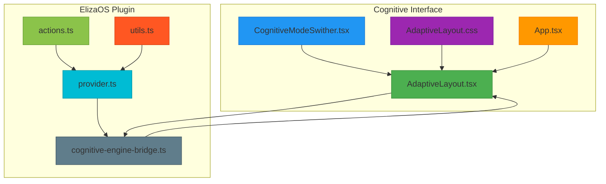
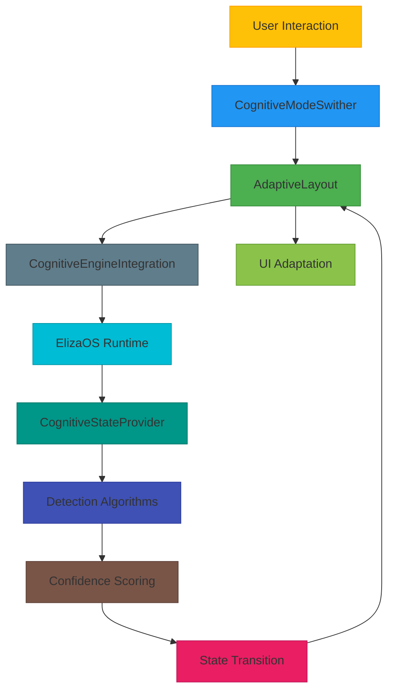
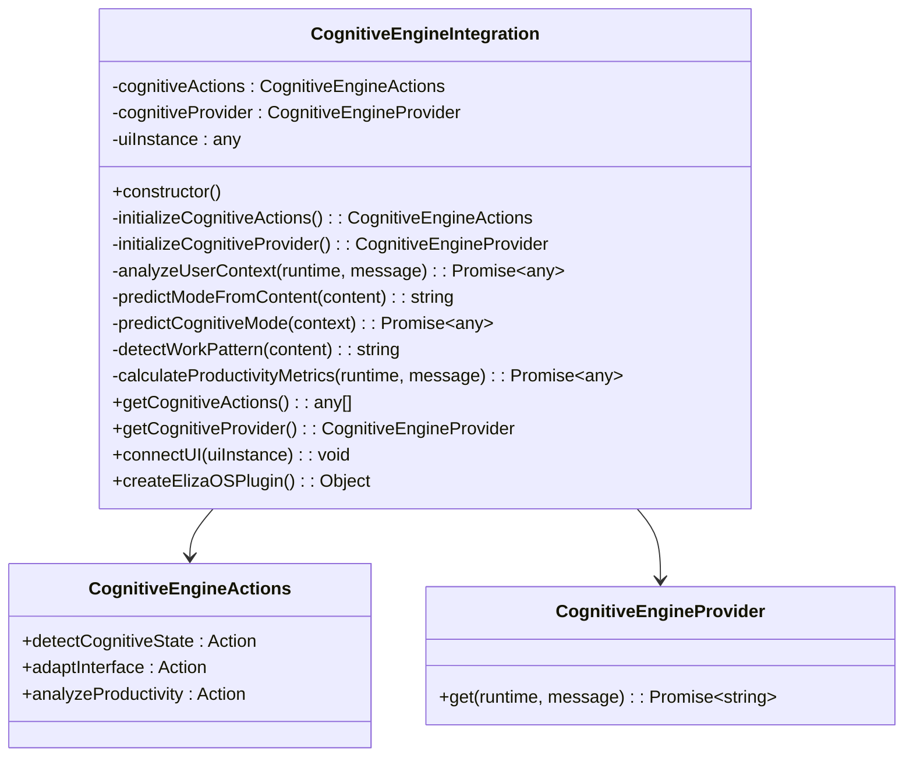
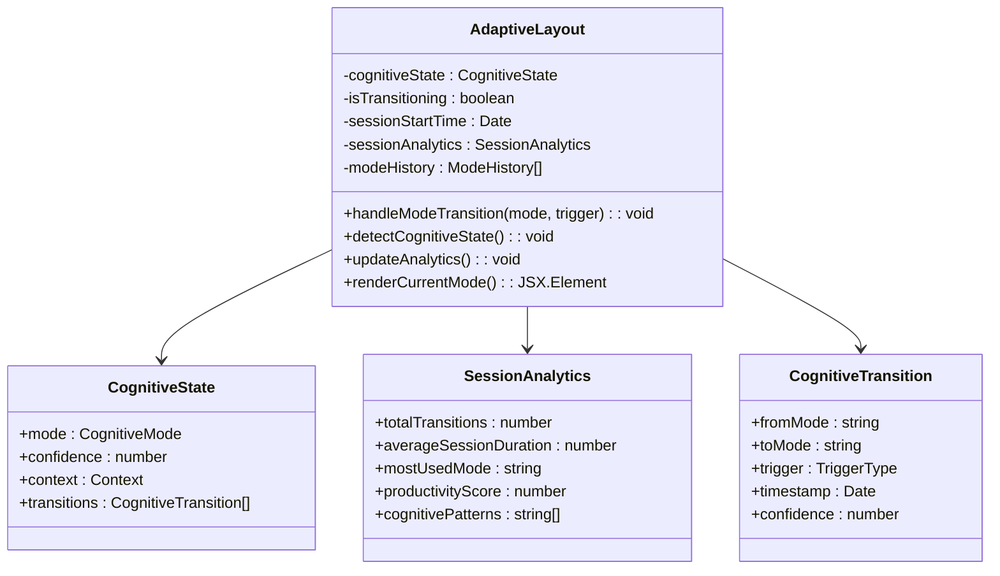
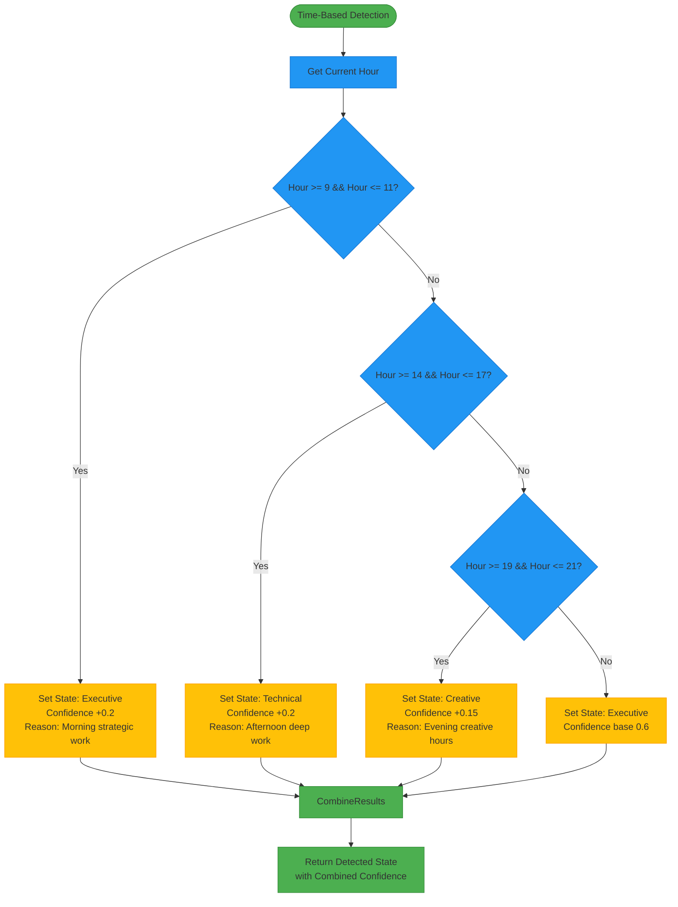
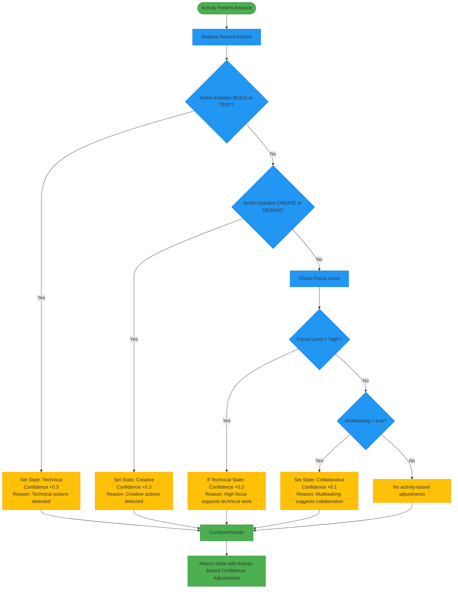
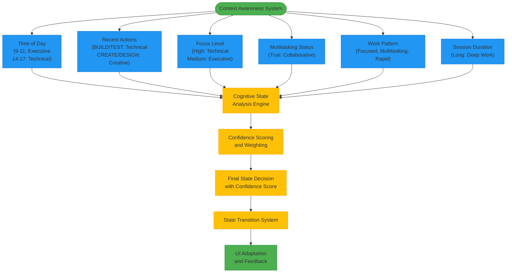
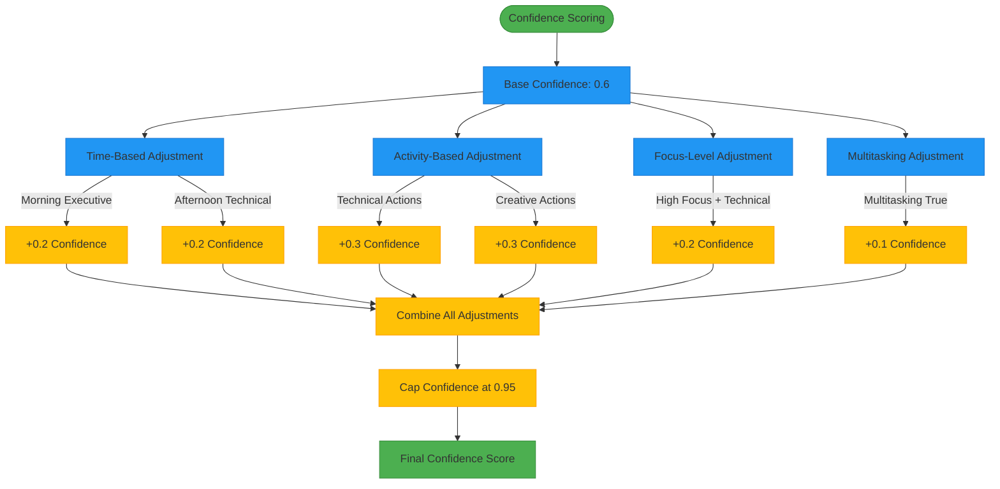
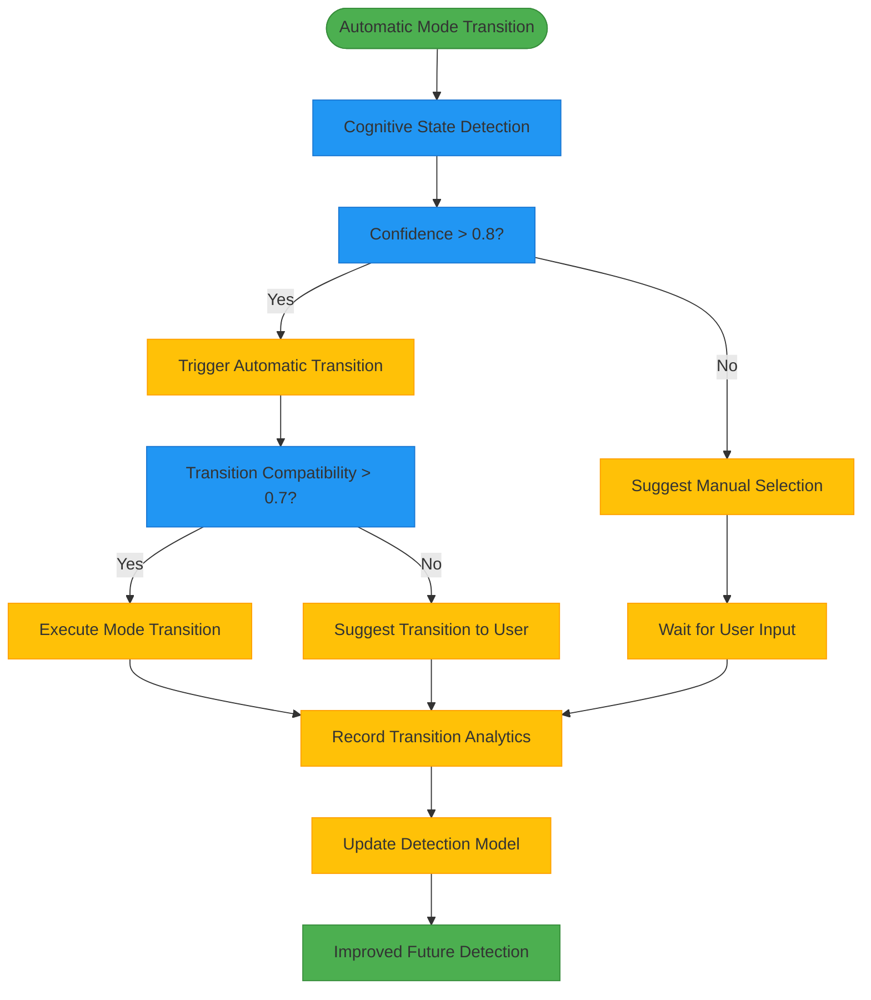
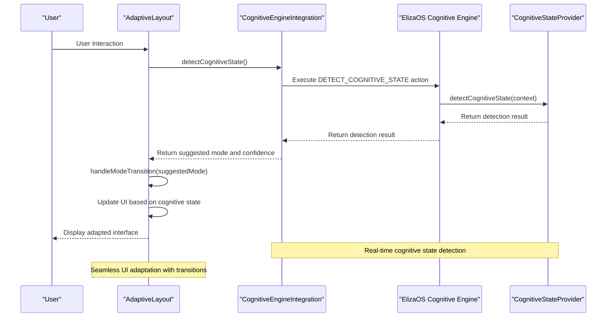

# Cognitive State Detection Engine

<cite>
**Referenced Files in This Document**   
- [cognitive-engine-bridge.ts](file://apps/cognitive-interface/src/integration/cognitive-engine-bridge.ts)
- [AdaptiveLayout.tsx](file://apps/cognitive-interface/src/components/AdaptiveLayout.tsx)
- [provider.ts](file://packages/elizaos-plugins/cognitive-engine/src/provider.ts)
- [actions.ts](file://packages/elizaos-plugins/cognitive-engine/src/actions.ts)
- [utils.ts](file://packages/elizaos-plugins/cognitive-engine/src/utils.ts)
- [AdaptiveLayout.css](file://apps/cognitive-interface/src/components/AdaptiveLayout.css)
- [CognitiveModeSwither.tsx](file://apps/cognitive-interface/src/components/CognitiveModeSwither.tsx)
- [App.tsx](file://apps/cognitive-interface/src/App.tsx)
</cite>

## Table of Contents
1. [Introduction](#introduction)
2. [Project Structure](#project-structure)
3. [Core Components](#core-components)
4. [Architecture Overview](#architecture-overview)
5. [Detailed Component Analysis](#detailed-component-analysis)
6. [Time-Based Pattern Recognition](#time-based-pattern-recognition)
7. [Activity Pattern Analysis](#activity-pattern-analysis)
8. [Context Awareness](#context-awareness)
9. [Confidence Scoring](#confidence-scoring)
10. [Automatic Mode Transitions](#automatic-mode-transitions)
11. [Integration with Adaptive Layout System](#integration-with-adaptive-layout-system)
12. [Practical Examples](#practical-examples)
13. [Troubleshooting Guide](#troubleshooting-guide)
14. [Conclusion](#conclusion)

## Introduction
The Cognitive State Detection Engine is a revolutionary system that analyzes user behavior, context, and patterns to detect optimal cognitive modes in real-time. This engine powers the world's first cognitive-aware interface system, enabling seamless transitions between executive, technical, creative, analytical, collaborative, and learning modes. The system combines rule-based detection with future machine learning capabilities to provide intelligent interface adaptation that enhances productivity and user experience.

## Project Structure
The Cognitive State Detection Engine is organized across multiple components and directories, with core functionality distributed between the cognitive interface and ElizaOS plugin system. The architecture follows a modular design pattern with clear separation of concerns between detection logic, UI adaptation, and state management.



**Diagram sources**
- [AdaptiveLayout.tsx](file://apps/cognitive-interface/src/components/AdaptiveLayout.tsx)
- [provider.ts](file://packages/elizaos-plugins/cognitive-engine/src/provider.ts)
- [actions.ts](file://packages/elizaos-plugins/cognitive-engine/src/actions.ts)
- [utils.ts](file://packages/elizaos-plugins/cognitive-engine/src/utils.ts)
- [cognitive-engine-bridge.ts](file://apps/cognitive-interface/src/integration/cognitive-engine-bridge.ts)

**Section sources**
- [AdaptiveLayout.tsx](file://apps/cognitive-interface/src/components/AdaptiveLayout.tsx)
- [provider.ts](file://packages/elizaos-plugins/cognitive-engine/src/provider.ts)

## Core Components
The Cognitive State Detection Engine consists of several core components that work together to detect user cognitive states and adapt the interface accordingly. The system is built on a plugin architecture that integrates with the ElizaOS runtime, enabling real-time cognitive state detection and interface adaptation.

The primary components include:
- **CognitiveEngineIntegration**: The bridge between the React cognitive interface and the ElizaOS cognitive engine plugin
- **CognitiveStateProvider**: Responsible for detecting cognitive states based on user context and behavior patterns
- **AdaptiveLayout**: The main UI component that dynamically adapts its appearance and behavior based on the detected cognitive state
- **CognitiveModeSwither**: Enables manual switching between cognitive modes and displays detection insights

These components work in concert to create a seamless cognitive-aware experience that optimizes the interface for the user's current work patterns and context.

**Section sources**
- [cognitive-engine-bridge.ts](file://apps/cognitive-interface/src/integration/cognitive-engine-bridge.ts)
- [AdaptiveLayout.tsx](file://apps/cognitive-interface/src/components/AdaptiveLayout.tsx)
- [provider.ts](file://packages/elizaos-plugins/cognitive-engine/src/provider.ts)

## Architecture Overview
The Cognitive State Detection Engine follows a layered architecture that separates concerns between detection logic, state management, and UI presentation. The system is designed to be extensible, with clear interfaces between components that enable future enhancements such as machine learning-based detection.



**Diagram sources**
- [cognitive-engine-bridge.ts](file://apps/cognitive-interface/src/integration/cognitive-engine-bridge.ts)
- [AdaptiveLayout.tsx](file://apps/cognitive-interface/src/components/AdaptiveLayout.tsx)
- [provider.ts](file://packages/elizaos-plugins/cognitive-engine/src/provider.ts)

## Detailed Component Analysis

### Cognitive Engine Integration Analysis
The CognitiveEngineIntegration class serves as the bridge between the React cognitive interface and the ElizaOS cognitive engine plugin. It exposes actions and providers that enable real-time cognitive state detection and interface adaptation.



**Diagram sources**
- [cognitive-engine-bridge.ts](file://apps/cognitive-interface/src/integration/cognitive-engine-bridge.ts)

**Section sources**
- [cognitive-engine-bridge.ts](file://apps/cognitive-interface/src/integration/cognitive-engine-bridge.ts)

### Adaptive Layout Analysis
The AdaptiveLayout component is the core UI element that dynamically adapts to the user's cognitive state. It manages state transitions, mode history, and session analytics while providing a seamless user experience.



**Diagram sources**
- [AdaptiveLayout.tsx](file://apps/cognitive-interface/src/components/AdaptiveLayout.tsx)

**Section sources**
- [AdaptiveLayout.tsx](file://apps/cognitive-interface/src/components/AdaptiveLayout.tsx)

## Time-Based Pattern Recognition
The Cognitive State Detection Engine implements sophisticated time-based pattern recognition to identify optimal cognitive modes based on temporal context. The system analyzes the time of day, day of week, and session duration to make informed decisions about the user's likely cognitive state.



The time-based detection algorithm follows these principles:
- **Morning (9-11 AM)**: Optimal for executive/strategic work with increased confidence for executive mode
- **Afternoon (2-5 PM)**: Ideal for technical deep work with increased confidence for technical mode
- **Evening (7-9 PM)**: Suitable for creative work with increased confidence for creative mode
- **Other times**: Default to executive mode with base confidence

This temporal analysis is combined with other factors to produce a comprehensive cognitive state detection.

**Section sources**
- [provider.ts](file://packages/elizaos-plugins/cognitive-engine/src/provider.ts#L174-L187)
- [AdaptiveLayout.tsx](file://apps/cognitive-interface/src/components/AdaptiveLayout.tsx#L85-L109)

## Activity Pattern Analysis
The engine analyzes user activity patterns through recent actions, focus level, and multitasking behavior to determine the appropriate cognitive state. This analysis combines multiple signals to create a holistic understanding of the user's current work context.



The activity pattern analysis considers:
- **Recent actions**: Commands or activities that indicate the user's current work type
- **Focus level**: User's ability to concentrate on a single task
- **Multitasking**: Whether the user is handling multiple tasks simultaneously
- **Work pattern**: Identified patterns such as focused, multitasking, or rapid task switching

These factors are weighted and combined to influence the cognitive state detection and confidence scoring.

**Section sources**
- [provider.ts](file://packages/elizaos-plugins/cognitive-engine/src/provider.ts#L188-L215)
- [cognitive-engine-bridge.ts](file://apps/cognitive-interface/src/integration/cognitive-engine-bridge.ts#L220-L238)

## Context Awareness
The Cognitive State Detection Engine incorporates comprehensive context awareness by analyzing multiple dimensions of the user's environment and behavior. This multi-faceted approach enables more accurate cognitive state detection than single-factor analysis.



The context awareness system integrates the following dimensions:
- **Temporal context**: Time of day, day of week, and session duration
- **Activity context**: Recent commands, actions, and application usage
- **Cognitive context**: Focus level, multitasking behavior, and mental state
- **Behavioral context**: Work patterns, task switching frequency, and productivity rhythms

By combining these contextual factors, the engine creates a comprehensive profile of the user's current state, enabling more accurate cognitive mode detection and personalized interface adaptation.

**Section sources**
- [provider.ts](file://packages/elizaos-plugins/cognitive-engine/src/provider.ts)
- [cognitive-engine-bridge.ts](file://apps/cognitive-interface/src/integration/cognitive-engine-bridge.ts)

## Confidence Scoring
The Cognitive State Detection Engine employs a sophisticated confidence scoring system that evaluates the certainty of its cognitive state detection. The confidence score is calculated by combining multiple factors, each contributing to the overall confidence level.



The confidence scoring algorithm follows these principles:
- **Base confidence**: Starts at 0.6 (60%) as a baseline certainty
- **Time-based adjustments**: +0.2 for time-of-day alignment with expected work patterns
- **Activity-based adjustments**: +0.3 for recent actions that strongly indicate a specific cognitive state
- **Focus-level adjustments**: +0.2 when high focus level aligns with technical work
- **Multitasking adjustments**: +0.1 when multitasking behavior suggests collaborative work
- **Confidence cap**: Maximum confidence is capped at 0.95 (95%) to prevent overconfidence

The final confidence score is used to determine whether automatic mode transitions should occur, with higher confidence scores triggering automatic adaptations and lower scores suggesting manual review.

**Section sources**
- [provider.ts](file://packages/elizaos-plugins/cognitive-engine/src/provider.ts#L174-L233)
- [cognitive-engine-bridge.ts](file://apps/cognitive-interface/src/integration/cognitive-engine-bridge.ts#L199-L215)

## Automatic Mode Transitions
The engine supports automatic mode transitions based on confidence thresholds and context analysis. When the detection confidence exceeds predefined thresholds, the system can automatically adapt the interface to the recommended cognitive mode.



The automatic mode transition process follows these steps:
1. **Detection**: Analyze user context and behavior to detect the optimal cognitive state
2. **Confidence evaluation**: Calculate confidence score based on multiple factors
3. **Threshold check**: If confidence > 0.8, proceed with automatic transition
4. **Compatibility check**: Verify transition compatibility using the state transition matrix
5. **Execution**: Apply the mode transition and update the UI
6. **Analytics**: Record the transition for future pattern analysis
7. **Feedback**: Use transition outcomes to improve future detection accuracy

The system also includes safeguards to prevent disruptive transitions, such as checking transition compatibility and providing user override options.

**Section sources**
- [provider.ts](file://packages/elizaos-plugins/cognitive-engine/src/provider.ts#L136-L172)
- [AdaptiveLayout.tsx](file://apps/cognitive-interface/src/components/AdaptiveLayout.tsx#L145-L168)

## Integration with Adaptive Layout System
The Cognitive State Detection Engine is tightly integrated with the Adaptive Layout System, enabling seamless interface adaptation based on detected cognitive states. This integration creates a cohesive user experience where the interface dynamically responds to the user's cognitive context.



The integration works as follows:
1. The AdaptiveLayout component calls the detectCognitiveState method on the CognitiveEngineIntegration
2. The integration bridge executes the DETECT_COGNITIVE_STATE action on the ElizaOS runtime
3. The CognitiveStateProvider analyzes the user context and returns a detection result
4. The integration bridge returns the suggested mode and confidence to the AdaptiveLayout
5. The AdaptiveLayout component handles the mode transition and updates the UI

The visual adaptation includes:
- **Background gradients**: Different colors for each cognitive mode (executive, technical, creative, etc.)
- **UI elements**: Mode-specific controls and layouts
- **Transitions**: Smooth animations when switching between modes
- **State indicators**: Visual feedback showing the current cognitive state

This tight integration enables a responsive, intelligent interface that adapts to the user's needs in real-time.

**Diagram sources**
- [cognitive-engine-bridge.ts](file://apps/cognitive-interface/src/integration/cognitive-engine-bridge.ts)
- [AdaptiveLayout.tsx](file://apps/cognitive-interface/src/components/AdaptiveLayout.tsx)

**Section sources**
- [cognitive-engine-bridge.ts](file://apps/cognitive-interface/src/integration/cognitive-engine-bridge.ts)
- [AdaptiveLayout.tsx](file://apps/cognitive-interface/src/components/AdaptiveLayout.tsx)

## Practical Examples

### Example 1: Morning Executive Mode
When a user starts their session at 9:30 AM, the system detects the morning context and recent actions related to strategic planning:

```typescript
// Context analysis
const context = {
  timeOfDay: 9.5, // 9:30 AM
  recentActions: ['CREATE_STRATEGY_DOCUMENT', 'ANALYZE_BUSINESS_METRICS'],
  focusLevel: 'high',
  multitasking: false,
  sessionDuration: 1800 // 30 minutes
};

// Detection result
const detection = {
  detectedState: 'executive',
  confidence: 0.92,
  reasoning: [
    'Morning hours typically indicate executive/strategic work',
    'Recent strategic actions detected',
    'High focus level supports executive decision-making'
  ],
  suggestedMode: 'Executive Mode',
  alternativeStates: [
    { state: 'analytical', confidence: 0.4 },
    { state: 'collaborative', confidence: 0.3 }
  ]
};
```

The system automatically adapts to Executive Mode with a confidence of 92%, providing a dark blue gradient background and strategic planning tools.

### Example 2: Afternoon Technical Deep Work
During an afternoon coding session, the system detects technical activities and high focus:

```typescript
// Context analysis
const context = {
  timeOfDay: 15.0, // 3:00 PM
  recentActions: ['BUILD_APPLICATION', 'RUN_TESTS', 'DEBUG_CODE'],
  focusLevel: 'high',
  multitasking: false,
  sessionDuration: 7200 // 2 hours
};

// Detection result
const detection = {
  detectedState: 'technical',
  confidence: 0.95,
  reasoning: [
    'Afternoon hours often indicate focused technical work',
    'Recent technical actions detected',
    'High focus level supports technical work'
  ],
  suggestedMode: 'Technical Mode',
  alternativeStates: [
    { state: 'analytical', confidence: 0.4 },
    { state: 'executive', confidence: 0.3 }
  ]
};
```

The interface automatically transitions to Technical Mode with a 95% confidence score, displaying a dark purple gradient background and development tools.

### Example 3: Creative Evening Session
In the evening, when a user begins designing visual assets, the system detects creative activities:

```typescript
// Context analysis
const context = {
  timeOfDay: 20.0, // 8:00 PM
  recentActions: ['CREATE_DESIGN', 'EDIT_GRAPHIC', 'APPLY_EFFECTS'],
  focusLevel: 'medium',
  multitasking: true,
  sessionDuration: 3600 // 1 hour
};

// Detection result
const detection = {
  detectedState: 'creative',
  confidence: 0.88,
  reasoning: [
    'Evening hours are conducive to creative work',
    'Recent creative actions detected',
    'Multitasking suggests creative exploration'
  ],
  suggestedMode: 'Creative Mode',
  alternativeStates: [
    { state: 'collaborative', confidence: 0.4 },
    { state: 'executive', confidence: 0.3 }
  ]
};
```

The system adapts to Creative Mode with an 88% confidence score, applying a deep purple gradient background and creative tools.

**Section sources**
- [provider.ts](file://packages/elizaos-plugins/cognitive-engine/src/provider.ts)
- [AdaptiveLayout.tsx](file://apps/cognitive-interface/src/components/AdaptiveLayout.tsx)

## Troubleshooting Guide

### Issue 1: Automatic Detection Not Working
**Symptoms**: The interface does not automatically adapt to detected cognitive states.

**Possible Causes and Solutions**:
- **Auto-detection disabled**: Check that `enableAutoDetection` prop is set to `true` in the AdaptiveLayout component
- **Plugin not connected**: Verify the ElizaOS plugin connection in the integration footer
- **Low confidence scores**: Review recent actions and context to ensure they align with detectable patterns
- **Configuration issues**: Check that the cognitive-engine plugin is properly registered with ElizaOS

### Issue 2: Incorrect Mode Detection
**Symptoms**: The system detects an incorrect cognitive state.

**Possible Causes and Solutions**:
- **Insufficient context**: Ensure the system has access to recent actions and user context
- **Timing issues**: Verify the time of day detection is using the correct timezone
- **Action recognition**: Check that user actions are properly categorized (BUILD, TEST, CREATE, DESIGN, etc.)
- **Confidence thresholds**: Adjust confidence thresholds if automatic transitions are too aggressive or conservative

### Issue 3: UI Adaptation Lag
**Symptoms**: There is a delay between mode detection and UI adaptation.

**Possible Causes and Solutions**:
- **Performance issues**: Optimize the detection algorithms and reduce unnecessary computations
- **Network latency**: If using remote services, implement caching and offline capabilities
- **Animation duration**: Adjust transition durations in AdaptiveLayout.css for better responsiveness
- **State management**: Optimize state updates to prevent unnecessary re-renders

### Issue 4: TypeScript Compilation Errors
**Symptoms**: Compilation errors in AdaptiveLayout.tsx or related components.

**Possible Causes and Solutions**:
- **Missing dependencies**: Ensure React and React DOM dependencies are installed
- **Type definitions**: Install @types/react and @types/react-dom for TypeScript support
- **Import errors**: Verify import paths and correct any typos (e.g., CognitiveModeSwither vs CognitiveModeSwicher)
- **Interface compatibility**: Ensure component props match expected interfaces

**Section sources**
- [ADAPTIVE_LAYOUT_FIXES_SUMMARY.md](file://ADAPTIVE_LAYOUT_FIXES_SUMMARY.md)
- [AdaptiveLayout.tsx](file://apps/cognitive-interface/src/components/AdaptiveLayout.tsx)
- [cognitive-engine-bridge.ts](file://apps/cognitive-interface/src/integration/cognitive-engine-bridge.ts)

## Conclusion
The Cognitive State Detection Engine represents a significant advancement in adaptive user interfaces, combining temporal analysis, activity pattern recognition, and context awareness to create a truly cognitive-aware system. By analyzing multiple dimensions of user behavior and environment, the engine can accurately detect optimal cognitive states and automatically adapt the interface to enhance productivity and user experience.

The system's modular architecture, with clear separation between detection logic and UI adaptation, enables future enhancements such as machine learning-based detection and predictive mode switching. The confidence scoring system and transition compatibility matrix provide safeguards against disruptive adaptations, ensuring a smooth user experience.

As the engine evolves from rule-based detection to machine learning models, it will become increasingly accurate and personalized, learning individual user patterns and preferences. This foundation enables the development of intelligent interfaces that not only respond to user actions but anticipate needs and optimize the work environment in real-time.

The integration with the Adaptive Layout System demonstrates the practical application of cognitive state detection, creating a seamless, responsive interface that adapts to the user's cognitive context. This technology has the potential to transform how users interact with digital systems, reducing cognitive load and enhancing productivity across various domains.