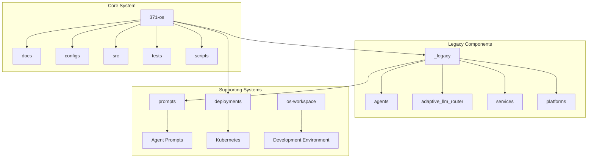
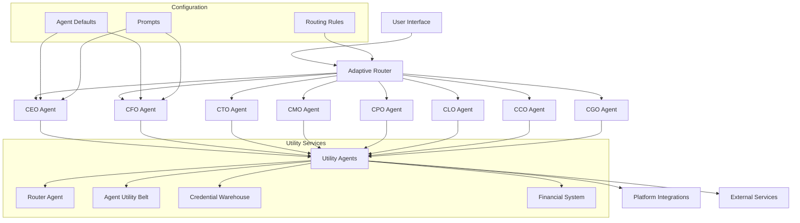
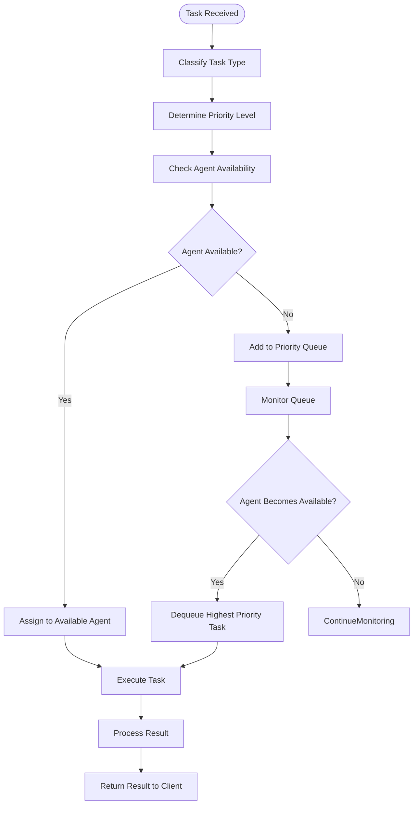
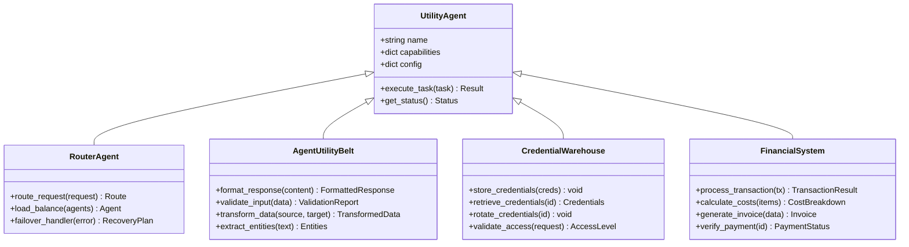
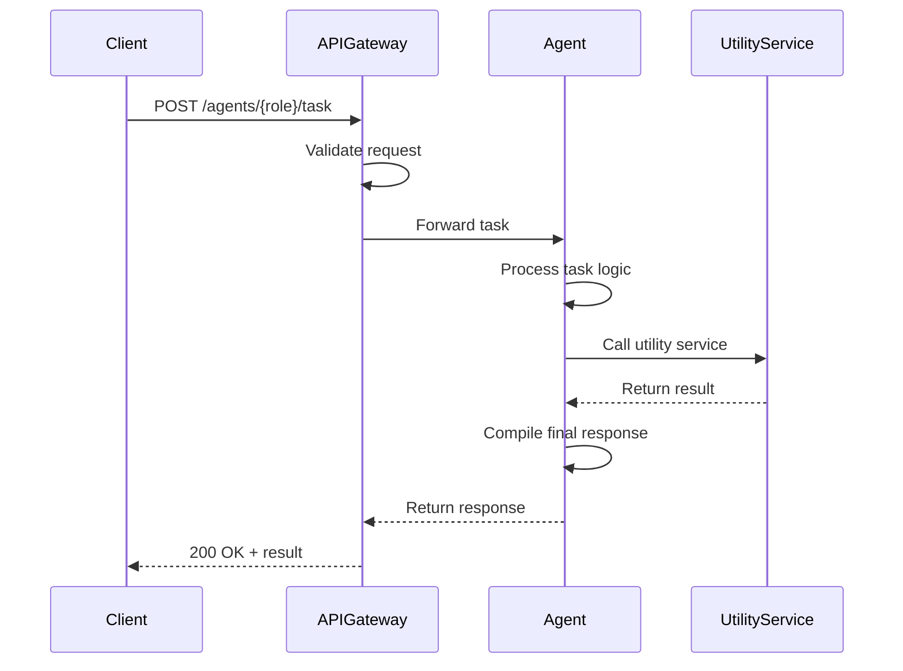
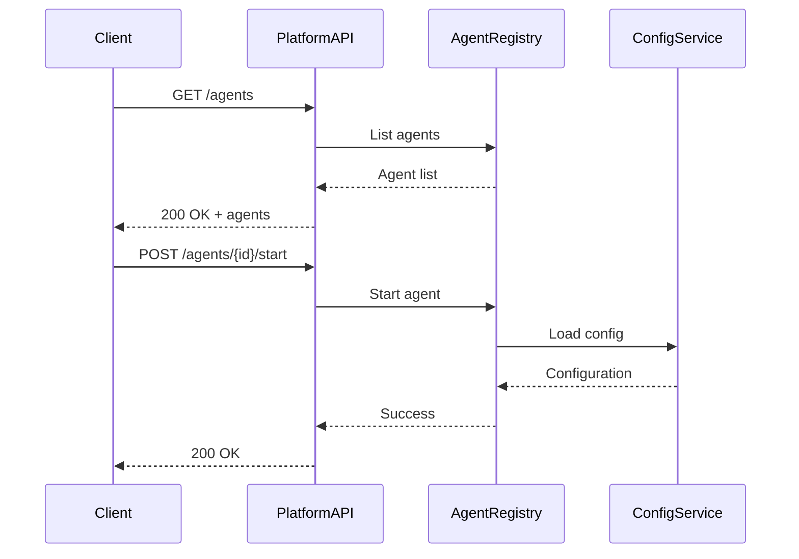
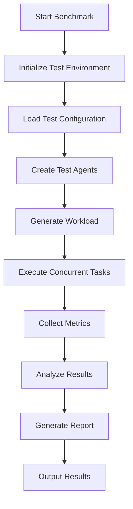

# Core Libraries Documentation

<cite>
**Referenced Files in This Document**   
- [Adaptive_Router_Logic.md](file://371-os/Adaptive_Router_Logic.md)
- [CCO_Agent_Logic.md](file://371-os/CCO_Agent_Logic.md)
- [CEO_Agent_Logic.md](file://371-os/CEO_Agent_Logic.md)
- [CFO_Agent_Logic.md](file://371-os/CFO_Agent_Logic.md)
- [CGO_Agent_Logic.md](file://371-os/CGO_Agent_Logic.md)
- [CLO_Agent_Logic.md](file://371-os/CLO_Agent_Logic.md)
- [CMO_Marketing_Agent_Logic.md](file://371-os/CMO_Marketing_Agent_Logic.md)
- [CMO_Monetization_Agent_Logic.md](file://371-os/CMO_Monetization_Agent_Logic.md)
- [CPO_Agent_Logic.md](file://371-os/CPO_Agent_Logic.md)
- [CTO_Agent_Logic.md](file://371-os/CTO_Agent_Logic.md)
- [_MASTER_ARCHITECTURE.md](file://371-os/_MASTER_ARCHITECTURE.md)
- [agent_api.md](file://371-os/docs/api/agent_api.md)
- [platform_api.md](file://371-os/docs/api/platform_api.md)
- [task_api.md](file://371-os/docs/api/task_api.md)
- [agent_lifecycle.md](file://371-os/docs/architecture/agent_lifecycle.md)
- [platform_integration.md](file://371-os/docs/architecture/platform_integration.md)
- [basic_agent_example.py](file://371-os/docs/examples/basic_agent_example.py)
- [workflow_example.py](file://371-os/docs/examples/workflow_example.py)
- [test_cgo_agent_benchmark.py](file://371-os/tests/performance/test_cgo_agent_benchmark.py)
- [test_content_generation_agent_benchmark.py](file://371-os/tests/performance/test_content_generation_agent_benchmark.py)
- [agent_defaults.yaml](file://371-os/configs/agents/agent_defaults.yaml)
- [routing_rules.yaml](file://371-os/configs/agents/routing_rules.yaml)
- [production.yaml](file://371-os/configs/production.yaml)
- [deployment.yaml](file://371-os/deployment/kubernetes/deployment.yaml)
- [secrets.yaml](file://371-os/deployment/kubernetes/secrets.yaml)
- [financial_system.py](file://_legacy/financial_system.py)
- [adaptive_llm_router.py](file://_legacy/adaptive_llm_router/adaptive_llm_router.py)
- [base_agent.py](file://_legacy/agents/base_agent/base_agent.py)
- [ceo_mimi.py](file://_legacy/agents/business/ceo_mimi.py)
- [cfo_cash.py](file://_legacy/agents/business/cfo_cash.py)
- [clo_sage.py](file://_legacy/agents/business/clo_sage.py)
- [cto_alex.py](file://_legacy/agents/business/cto_alex.py)
- [content_generation_agent.py](file://_legacy/agents/marketing/content_generation_agent.py)
- [deployment_agent.py](file://_legacy/agents/technical/deployment_agent.py)
- [router_agent.py](file://_legacy/agents/utility/router_agent.py)
- [agent_utility_belt.py](file://_legacy/agents/utility/agent_utility_belt.py)
- [ceo_mimi.yaml](file://prompts/business_agents/ceo_mimi.yaml)
- [cfo_agent_prompt.yaml](file://prompts/business_agents/cfo_agent_prompt.yaml)
- [clo_agent_prompt.yaml](file://prompts/business_agents/clo_agent_prompt.yaml)
- [cto_agent_prompt.yaml](file://prompts/business_agents/cto_agent_prompt.yaml)
- [content_generation_agent.yaml](file://prompts/marketing_agents/content_generation_agent.yaml)
- [deployment_agent.yaml](file://prompts/technical_agents/deployment_agent.yaml)
- [router_agent.yaml](file://prompts/utlilty_agents/router_agent.yaml)
</cite>

## Table of Contents
1. [Introduction](#introduction)
2. [Project Structure](#project-structure)
3. [Core Components](#core-components)
4. [Architecture Overview](#architecture-overview)
5. [Detailed Component Analysis](#detailed-component-analysis)
6. [API Interfaces](#api-interfaces)
7. [Integration Patterns](#integration-patterns)
8. [Performance and Benchmarking](#performance-and-benchmarking)
9. [Troubleshooting Guide](#troubleshooting-guide)
10. [Conclusion](#conclusion)

## Introduction
The Core Libraries system forms the foundational infrastructure for the 371 Minds OS, an autonomous agent operating system designed to enable intelligent, role-based AI agents to perform complex business and technical tasks. This documentation provides a comprehensive overview of the core libraries, including their architecture, key components, API interfaces, integration patterns, and practical usage examples. The system is built around a modular agent framework where specialized agents (CEO, CFO, CTO, etc.) operate with defined roles, responsibilities, and decision-making capabilities, coordinated through adaptive routing and shared utility services.

## Project Structure
The Core Libraries system is organized into a well-structured repository with distinct directories for different concerns. The primary components are located in the `371-os` directory, which contains the core logic, configuration, and documentation. The `_legacy` directory contains mature agent implementations and utility modules that have been integrated into the core system. Supporting documentation, examples, and deployment configurations provide a complete ecosystem for development and operation.



**Diagram sources**
- [371-os](file://371-os)
- [_legacy](file://_legacy)
- [prompts](file://prompts)
- [deployments](file://deployments)

**Section sources**
- [371-os](file://371-os)
- [_legacy](file://_legacy)

## Core Components
The Core Libraries system comprises several key components that work together to enable autonomous agent functionality. These include role-based executive agents (CEO, CFO, CTO, etc.), adaptive routing logic, shared utility agents, and configuration management. Each component is designed to operate independently while contributing to the overall system intelligence.

The executive agents represent different business functions:
- **CEO Agent**: Strategic decision-making and overall system orchestration
- **CFO Agent**: Financial management, budgeting, and cost optimization
- **CTO Agent**: Technical architecture, infrastructure, and development oversight
- **CMO Agent**: Marketing strategy and monetization planning
- **CPO Agent**: Product development and lifecycle management
- **CLO Agent**: Legal and compliance oversight
- **CCO Agent**: Customer experience and operations management
- **CGO Agent**: Growth strategy and market expansion

These agents are implemented as modular components with defined interfaces, allowing for easy extension and replacement. They share common patterns in their implementation, including configuration loading, prompt management, and interaction with other system components.

**Section sources**
- [CEO_Agent_Logic.md](file://371-os/CEO_Agent_Logic.md)
- [CFO_Agent_Logic.md](file://371-os/CFO_Agent_Logic.md)
- [CTO_Agent_Logic.md](file://371-os/CTO_Agent_Logic.md)
- [CMO_Marketing_Agent_Logic.md](file://371-os/CMO_Marketing_Agent_Logic.md)
- [CPO_Agent_Logic.md](file://371-os/CPO_Agent_Logic.md)
- [CLO_Agent_Logic.md](file://371-os/CLO_Agent_Logic.md)
- [CCO_Agent_Logic.md](file://371-os/CCO_Agent_Logic.md)
- [CGO_Agent_Logic.md](file://371-os/CGO_Agent_Logic.md)

## Architecture Overview
The Core Libraries system follows a distributed agent architecture where specialized agents operate as independent services that communicate through well-defined APIs and message passing. The system is designed to be scalable, resilient, and extensible, with clear separation of concerns between different functional areas.



**Diagram sources**
- [_MASTER_ARCHITECTURE.md](file://371-os/_MASTER_ARCHITECTURE.md)
- [Adaptive_Router_Logic.md](file://371-os/Adaptive_Router_Logic.md)
- [agent_lifecycle.md](file://371-os/docs/architecture/agent_lifecycle.md)
- [platform_integration.md](file://371-os/docs/architecture/platform_integration.md)

## Detailed Component Analysis

### Executive Agent Architecture
The executive agents follow a consistent architectural pattern across all roles. Each agent is configured with role-specific parameters, prompts, and capabilities, allowing them to perform their designated functions effectively.

```mermaid
classDiagram
class ExecutiveAgent {
+string role
+string name
+dict config
+string prompt_template
+dict capabilities
+initialize() void
+process_task(task) Result
+make_decision(context) Decision
+communicate(message) void
+get_status() Status
}
class CEOAgent {
+strategic_planning(context) Strategy
+resource_allocation(request) Allocation
+risk_assessment(scenario) RiskProfile
}
class CFOAgent {
+budget_management(request) BudgetPlan
+cost_analysis(project) CostReport
+financial_forecasting(period) Forecast
}
class CTOAgent {
+architecture_design(requirements) Design
+technology_evaluation(options) Evaluation
+infrastructure_planning(needs) Plan
}
class CMOAgent {
+marketing_strategy(target) Strategy
+campaign_planning(objectives) Campaign
+performance_analysis(results) Insights
}
class CPOAgent {
+product_roadmap(vision) Roadmap
+feature_prioritization(requests) PrioritizedList
+user_experience_analysis(feedback) Recommendations
}
class CLOAgent {
+compliance_check(document) ComplianceReport
+risk_identification(context) RiskAssessment
+policy_recommendation(needs) Policy
}
class CCOAgent {
+customer_experience_analysis(data) Insights
+service_improvement(issues) Recommendations
+operations_optimization(process) OptimizationPlan
}
class CGOAgent {
+growth_strategy(market) Strategy
+market_expansion_analysis(opportunity) Analysis
+partnership_evaluation(candidate) Evaluation
}
ExecutiveAgent <|-- CEOAgent
ExecutiveAgent <|-- CFOAgent
ExecutiveAgent <|-- CTOAgent
ExecutiveAgent <|-- CMOAgent
ExecutiveAgent <|-- CPOAgent
ExecutiveAgent <|-- CLOAgent
ExecutiveAgent <|-- CCOAgent
ExecutiveAgent <|-- CGOAgent
```



**Diagram sources**
- [CEO_Agent_Logic.md](file://371-os/CEO_Agent_Logic.md)
- [CFO_Agent_Logic.md](file://371-os/CFO_Agent_Logic.md)
- [CTO_Agent_Logic.md](file://371-os/CTO_Agent_Logic.md)
- [CMO_Marketing_Agent_Logic.md](file://371-os/CMO_Marketing_Agent_Logic.md)
- [CPO_Agent_Logic.md](file://371-os/CPO_Agent_Logic.md)
- [CLO_Agent_Logic.md](file://371-os/CLO_Agent_Logic.md)
- [CCO_Agent_Logic.md](file://371-os/CCO_Agent_Logic.md)
- [CGO_Agent_Logic.md](file://371-os/CGO_Agent_Logic.md)

**Section sources**
- [CEO_Agent_Logic.md](file://371-os/CEO_Agent_Logic.md)
- [CFO_Agent_Logic.md](file://371-os/CFO_Agent_Logic.md)
- [CTO_Agent_Logic.md](file://371-os/CTO_Agent_Logic.md)

### Adaptive Routing System
The adaptive routing system determines which agent should handle a given task based on the task's nature, urgency, complexity, and the current system state. This ensures optimal resource utilization and response quality.



**Diagram sources**
- [Adaptive_Router_Logic.md](file://371-os/Adaptive_Router_Logic.md)
- [routing_rules.yaml](file://371-os/configs/agents/routing_rules.yaml)

**Section sources**
- [Adaptive_Router_Logic.md](file://371-os/Adaptive_Router_Logic.md)

### Utility Agents
Utility agents provide shared services that can be leveraged by executive agents to perform common tasks. These agents enhance efficiency by centralizing functionality that would otherwise be duplicated across multiple agents.



**Diagram sources**
- [router_agent.py](file://_legacy/agents/utility/router_agent.py)
- [agent_utility_belt.py](file://_legacy/agents/utility/agent_utility_belt.py)
- [credential_warehouse_agent.py](file://_legacy/agents/utility/credential_warehouse_agent.py)
- [financial_system.py](file://_legacy/financial_system.py)

**Section sources**
- [router_agent.py](file://_legacy/agents/utility/router_agent.py)
- [agent_utility_belt.py](file://_legacy/agents/utility/agent_utility_belt.py)

## API Interfaces
The Core Libraries system exposes several API interfaces that enable interaction with agents and system components. These APIs follow RESTful principles and are designed for both human and machine consumption.

### Agent API
The Agent API allows clients to interact with individual agents, submit tasks, and retrieve results.



**Diagram sources**
- [agent_api.md](file://371-os/docs/api/agent_api.md)
- [basic_agent_example.py](file://371-os/docs/examples/basic_agent_example.py)

**Section sources**
- [agent_api.md](file://371-os/docs/api/agent_api.md)

### Platform API
The Platform API provides access to platform-level functionality, including agent management, system status, and configuration.



**Diagram sources**
- [platform_api.md](file://371-os/docs/api/platform_api.md)
- [task_api.md](file://371-os/docs/api/task_api.md)

**Section sources**
- [platform_api.md](file://371-os/docs/api/platform_api.md)

## Integration Patterns
The Core Libraries system supports various integration patterns that enable seamless interaction with external systems and services.

### Configuration Management
Agents are configured through YAML files that define their behavior, capabilities, and operational parameters.

```yaml
# agent_defaults.yaml
agent_defaults:
  timeout: 300
  max_retries: 3
  temperature: 0.7
  model: "gpt-4-turbo"
  response_format: "json"
  monitoring_enabled: true
  logging_level: "info"
```

```yaml
# routing_rules.yaml
routing_rules:
  - task_type: "strategic_planning"
    required_role: "CEO"
    priority: "high"
    timeout: 600
  - task_type: "budget_analysis"
    required_role: "CFO"
    priority: "medium"
    timeout: 300
  - task_type: "technical_design"
    required_role: "CTO"
    priority: "high"
    timeout: 900
```

**Section sources**
- [agent_defaults.yaml](file://371-os/configs/agents/agent_defaults.yaml)
- [routing_rules.yaml](file://371-os/configs/agents/routing_rules.yaml)

### Prompt Management
Agent behavior is guided by prompt templates that are loaded from YAML configuration files.

```yaml
# ceo_mimi.yaml
role: "Chief Executive Officer"
name: "Mimi"
personality:
  - "strategic"
  - "decisive"
  - "visionary"
communication_style: "professional but approachable"
core_directives:
  - "Prioritize long-term sustainability over short-term gains"
  - "Balance innovation with risk management"
  - "Ensure alignment with company mission and values"
decision_making_framework: "SWOT analysis combined with scenario planning"
response_format: "structured JSON with executive summary"
```

**Section sources**
- [ceo_mimi.yaml](file://prompts/business_agents/ceo_mimi.yaml)
- [cfo_agent_prompt.yaml](file://prompts/business_agents/cfo_agent_prompt.yaml)

## Performance and Benchmarking
The system includes comprehensive performance testing and benchmarking capabilities to ensure reliability and efficiency under various conditions.



The performance suite includes tests for:
- Agent response time under varying loads
- Memory usage during extended operations
- Accuracy of decision-making across scenarios
- Resilience to failures and network issues
- Scalability with increasing agent count

**Section sources**
- [test_cgo_agent_benchmark.py](file://371-os/tests/performance/test_cgo_agent_benchmark.py)
- [test_content_generation_agent_benchmark.py](file://371-os/tests/performance/test_content_generation_agent_benchmark.py)

## Troubleshooting Guide
This section provides guidance for diagnosing and resolving common issues with the Core Libraries system.

### Common Issues and Solutions
**Issue**: Agent not responding to requests
**Solution**: 
1. Check agent status via Platform API
2. Verify configuration files are correctly loaded
3. Ensure required services are running
4. Check logs for error messages

**Issue**: Slow response times
**Solution**:
1. Review system resource utilization
2. Check for bottlenecks in utility services
3. Verify network connectivity
4. Consider scaling agent instances

**Issue**: Configuration not being applied
**Solution**:
1. Validate YAML syntax
2. Check file permissions
3. Verify file paths in application configuration
4. Restart affected services

**Section sources**
- [troubleshooting](file://troubleshooting)
- [logs](file://_legacy/services/email_system/automation/analytics/email-tracking.js)

## Conclusion
The Core Libraries system provides a robust foundation for building and operating autonomous agent systems. Its modular architecture, clear separation of concerns, and comprehensive tooling make it suitable for complex business and technical applications. By leveraging role-based agents, adaptive routing, and shared utility services, the system enables intelligent automation of diverse tasks while maintaining scalability and maintainability. The extensive documentation, examples, and testing infrastructure support rapid development and reliable operation in production environments.