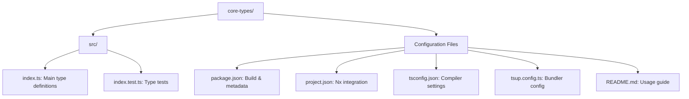
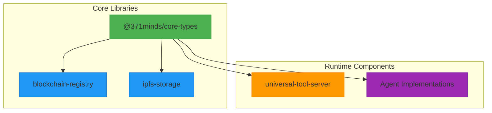

# Core Types Documentation

<cite>
**Referenced Files in This Document**   
- [index.ts](file://os-workspace/libs/core-types/src/index.ts)
- [README.md](file://os-workspace/libs/core-types/README.md)
- [package.json](file://os-workspace/libs/core-types/package.json)
- [project.json](file://os-workspace/libs/core-types/project.json)
</cite>

## Table of Contents
1. [Introduction](#introduction)
2. [Project Structure](#project-structure)
3. [Core Components](#core-components)
4. [Architecture Overview](#architecture-overview)
5. [Usage Examples](#usage-examples)
6. [Integration Patterns](#integration-patterns)
7. [Development and Testing](#development-and-testing)
8. [Troubleshooting Guide](#troubleshooting-guide)
9. [Conclusion](#conclusion)

## Introduction
The **@371minds/core-types** library provides shared TypeScript interfaces for the 371 Minds OS ecosystem. It serves as a foundational type system that ensures consistency, type safety, and interoperability across various components of the platform. This documentation details its purpose, structure, usage, and integration patterns to support developers working within the 371 Minds OS framework.

The library is designed to standardize data models such as agent capabilities, registry entries, and reputation scores—critical constructs in a decentralized agent-based architecture. By centralizing these definitions, it reduces redundancy, prevents type mismatches, and streamlines development across multiple packages.

## Project Structure
The **core-types** library follows a minimal and focused structure optimized for type sharing in a monorepo environment. It contains only essential files needed for type definition, testing, and packaging.



**Diagram sources**
- [README.md](file://os-workspace/libs/core-types/README.md#L50-L55)
- [project.json](file://os-workspace/libs/core-types/project.json#L1-L22)

**Section sources**
- [README.md](file://os-workspace/libs/core-types/README.md#L50-L55)
- [project.json](file://os-workspace/libs/core-types/project.json#L1-L22)

## Core Components
The **core-types** library defines three primary interfaces that form the backbone of agent metadata and interaction in the 371 Minds OS:

### AgentRegistryEntry
Represents a registered agent in the system, containing identifying and operational metadata.

**: Properties**
- `agentId`: Unique string identifier for the agent
- `did`: Decentralized Identifier (DID) for cryptographic identity
- `capabilities`: Array of `AgentCapability` objects defining what the agent can do
- `reputation`: `ReputationScore` object indicating trustworthiness
- `stakeAmount`: `bigint` representing economic commitment

### AgentCapability
Describes a functional capability that an agent can perform.

**: Properties**
- `name`: Capability name (e.g., "code-generation", "financial-analysis")
- `description`: Human-readable explanation of the capability
- `version`: Semantic version string for compatibility tracking

### ReputationScore
Encapsulates a numerical reputation value with temporal context.

**: Properties**
- `value`: Number between 0 and 1 representing trust level
- `lastUpdated`: JavaScript `Date` object indicating when the score was last modified

These types are exported from the main entry point and can be imported by any package in the system.

```typescript
import { AgentRegistryEntry, AgentCapability, ReputationScore } from '@371minds/core-types';
```

**Section sources**
- [index.ts](file://os-workspace/libs/core-types/src/index.ts#L10-L68)
- [README.md](file://os-workspace/libs/core-types/README.md#L25-L35)

## Architecture Overview
The **core-types** library plays a central role in the type architecture of the 371 Minds OS. It acts as a single source of truth for critical data structures used across distributed components.



**Diagram sources**
- [index.ts](file://os-workspace/libs/core-types/src/index.ts#L10-L68)
- [README.md](file://os-workspace/libs/core-types/README.md#L72-L79)

## Usage Examples
The **core-types** library is designed for straightforward integration into TypeScript projects within the 371 OS ecosystem.

### Installation
```bash
bun add @371minds/core-types
```

### Basic Usage
```typescript
import { AgentRegistryEntry, AgentCapability, ReputationScore } from '@371minds/core-types';

// Create a capability
const codeGenCapability: AgentCapability = {
  name: 'code-generation',
  description: 'Generates code in multiple programming languages',
  version: '1.0.0'
};

// Create a reputation score
const reputation: ReputationScore = {
  value: 0.95,
  lastUpdated: new Date()
};

// Create a full agent registry entry
const agentEntry: AgentRegistryEntry = {
  agentId: 'cto-alex-001',
  did: 'did:371:alex123456789',
  capabilities: [codeGenCapability],
  reputation: reputation,
  stakeAmount: BigInt(5000)
};
```

### Advanced Pattern: Dynamic Capability Registration
```typescript
function registerAgent(
  id: string, 
  did: string, 
  capabilities: Array<{name: string, desc: string, ver: string}>
): AgentRegistryEntry {
  const capabilityObjects = capabilities.map(cap => ({
    name: cap.name,
    description: cap.desc,
    version: cap.ver
  }));

  return {
    agentId: id,
    did: did,
    capabilities: capabilityObjects,
    reputation: { value: 0.8, lastUpdated: new Date() },
    stakeAmount: BigInt(1000)
  };
}
```

**Section sources**
- [README.md](file://os-workspace/libs/core-types/README.md#L15-L45)
- [index.ts](file://os-workspace/libs/core-types/src/index.ts#L10-L68)

## Integration Patterns
The **core-types** library is integrated across multiple layers of the 371 Minds OS architecture.

### Blockchain Registry Integration
Used to standardize agent registration data stored on-chain:
```typescript
// In blockchain-registry
import { AgentRegistryEntry } from '@371minds/core-types';
// Ensures on-chain data matches expected schema
```

### IPFS Metadata Storage
Facilitates consistent metadata storage for agents:
```typescript
// In ipfs-storage
import { AgentCapability } from '@371minds/core-types';
// Used when storing capability manifests off-chain
```

### Agent Coordination
Enables type-safe communication between agents via the Universal Tool Server:
```typescript
// In universal-tool-server
import { AgentRegistryEntry } from '@371minds/core-types';
// Validates agent discovery and routing information
```

### Development Workflow
The library is built using **tsup**, a fast TypeScript bundler, and integrated into the Nx workspace for monorepo management. This ensures efficient builds and consistent tooling across the ecosystem.

**Section sources**
- [README.md](file://os-workspace/libs/core-types/README.md#L72-L79)
- [package.json](file://os-workspace/libs/core-types/package.json#L1-L22)
- [project.json](file://os-workspace/libs/core-types/project.json#L1-L22)

## Development and Testing
The **core-types** library follows a strict development model focused on type correctness and compatibility.

### Building
```bash
bun run build
```
This command uses **tsup** to generate both ESM and CJS builds along with declaration files.

### Testing
```bash
bun test
```
Tests are minimal but effective—focusing on verifying that interfaces can be implemented and instantiated correctly, ensuring type safety at runtime.

### Versioning and Publishing
The library uses semantic versioning. Breaking changes to interfaces require a major version bump to prevent compatibility issues across dependent packages.

**Section sources**
- [README.md](file://os-workspace/libs/core-types/README.md#L58-L70)
- [package.json](file://os-workspace/libs/core-types/package.json#L7-L10)

## Troubleshooting Guide
Common issues and solutions when using **@371minds/core-types**:

### Issue: Type Import Errors
**: Symptom**
```
Cannot find module '@371minds/core-types' or its corresponding type declarations.
```

**: Solution**
Ensure the package is installed:
```bash
bun add @371minds/core-types
```

Verify the import path is correct and matches the export in `index.ts`.

### Issue: BigInt Serialization
**: Symptom**
`stakeAmount` (a `bigint`) fails to serialize to JSON.

**: Solution**
Use a replacer function:
```typescript
JSON.stringify(agentEntry, (key, value) => 
  typeof value === 'bigint' ? value.toString() : value
);
```

### Issue: Date Handling in Reputation
**: Symptom**
`lastUpdated` field shows incorrect timezone or formatting.

**: Solution**
Always use `new Date()` and consider normalizing to UTC:
```typescript
reputation.lastUpdated = new Date(Date.now());
```

**Section sources**
- [index.ts](file://os-workspace/libs/core-types/src/index.ts#L50-L60)
- [README.md](file://os-workspace/libs/core-types/README.md#L35-L45)

## Conclusion
The **@371minds/core-types** library is a foundational component of the 371 Minds OS, providing standardized, type-safe interfaces for agent metadata. Its design promotes consistency, reduces errors, and enables seamless integration across blockchain, storage, and coordination layers. By centralizing core data structures, it enhances developer experience and system reliability in a complex, distributed agent architecture.