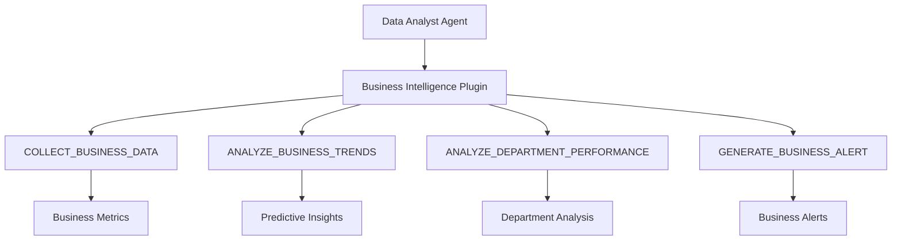
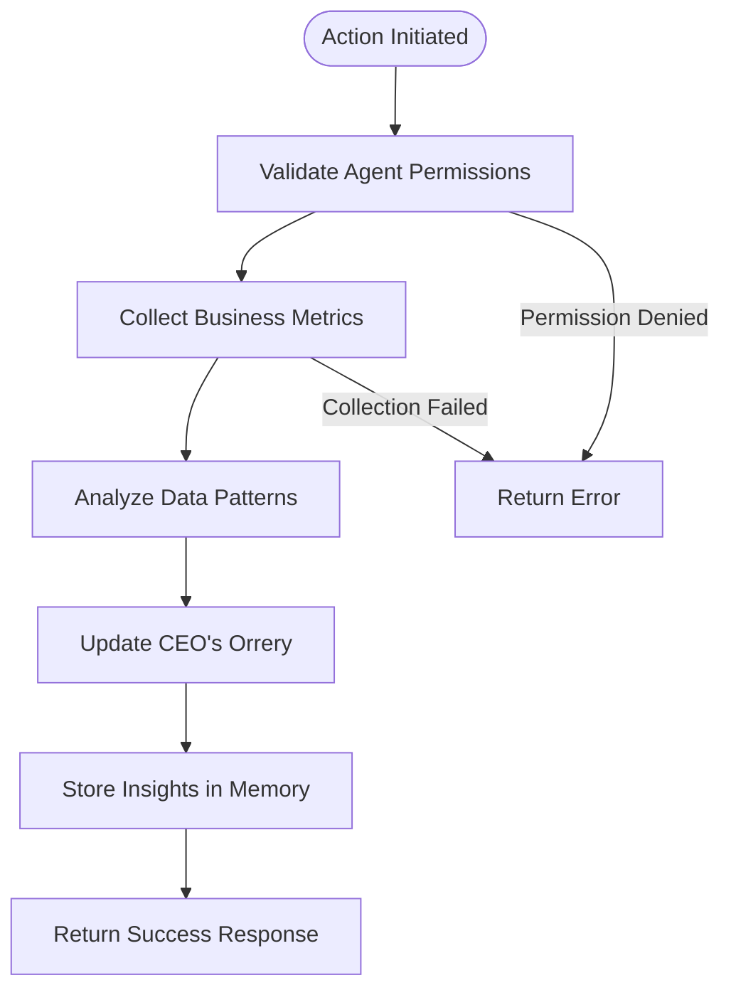
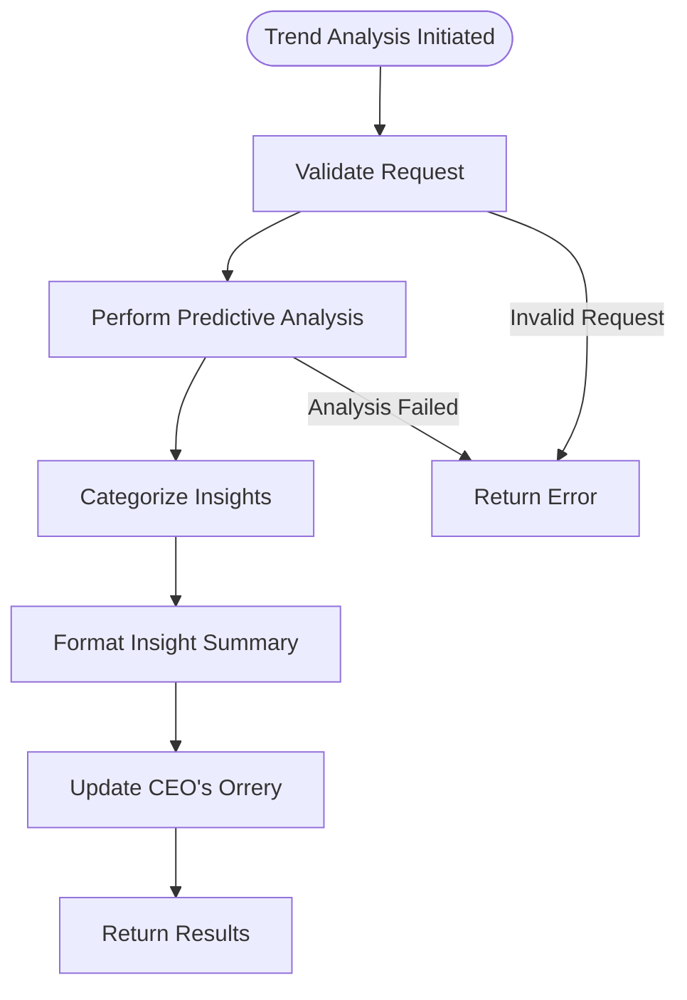
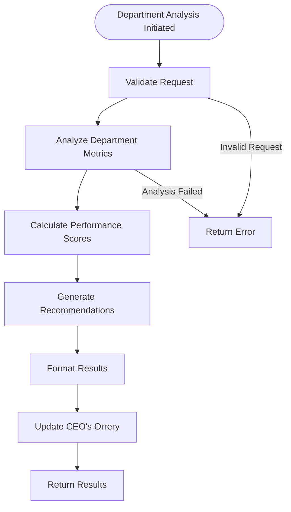
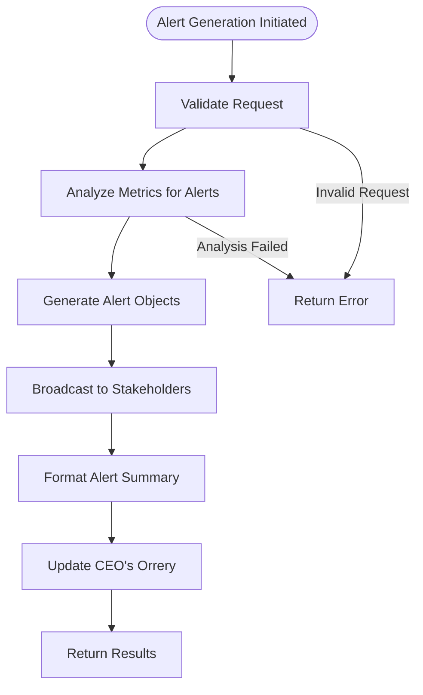
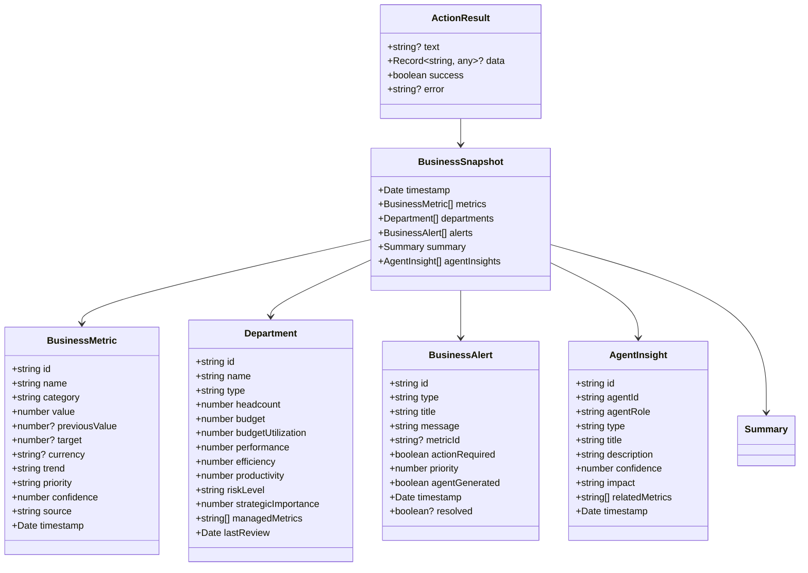
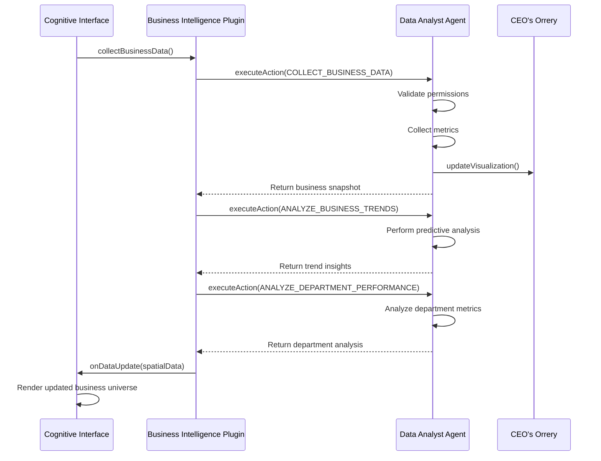

# Data Analyst Agent

<cite>
**Referenced Files in This Document**   
- [data-analyst.json](file://questflow/agents/specialized/data-analyst.json)
- [business-intelligence.json](file://questflow/agents/specialized/business-intelligence.json)
- [types.ts](file://os-workspace/packages/business-intelligence/src/types.ts)
- [actions.ts](file://os-workspace/packages/business-intelligence/src/actions.ts)
- [BusinessIntelligenceIntegration.tsx](file://os-workspace/apps/cognitive-interface/src/components/BusinessIntelligenceIntegration.tsx)
- [BUSINESS_INTELLIGENCE_ACTIONS_FIXES.md](file://BUSINESS_INTELLIGENCE_ACTIONS_FIXES.md)
</cite>

## Table of Contents
1. [Introduction](#introduction)
2. [Core Configuration](#core-configuration)
3. [Capabilities and Functionality](#capabilities-and-functionality)
4. [Integration with Business Intelligence System](#integration-with-business-intelligence-system)
5. [Action Implementation Details](#action-implementation-details)
6. [Data Structures and Types](#data-structures-and-types)
7. [Workflow and Execution Flow](#workflow-and-execution-flow)
8. [Practical Usage Examples](#practical-usage-examples)
9. [Troubleshooting Guide](#troubleshooting-guide)

## Introduction
The Data Analyst Agent is a specialized autonomous agent within the 371OS ecosystem designed to perform advanced data analysis, statistical modeling, and insight generation. It operates as part of a broader business intelligence framework, working in conjunction with C-suite agents to provide data-driven decision support. The agent leverages AI-powered analytical capabilities to process business metrics, identify patterns, and generate actionable insights for organizational leadership.

This documentation provides comprehensive details about the Data Analyst Agent's configuration, capabilities, integration points, and operational workflows. It serves as a reference for developers, system administrators, and stakeholders who need to understand or extend the agent's functionality within the autonomous agent operating system.

## Core Configuration
The Data Analyst Agent is configured through a JSON specification that defines its identity, capabilities, and operational parameters. The configuration ensures the agent operates with appropriate settings for analytical tasks.

```json
{
  "name": "data-analyst-agent",
  "description": "An agent specialized in data analysis tasks",
  "provider": "openai",
  "model": "gpt-4",
  "capabilities": [
    "data-analysis",
    "statistical-modeling",
    "insight-generation"
  ],
  "parameters": {
    "temperature": 0.3,
    "maxTokens": 2000
  },
  "instructions": "You are an expert data analyst. Your role is to analyze data, identify patterns, and generate insights. Always provide clear explanations for your findings and use appropriate statistical methods."
}
```

**Section sources**
- [data-analyst.json](file://questflow/agents/specialized/data-analyst.json#L0-L15)

## Capabilities and Functionality
The Data Analyst Agent possesses specialized capabilities for processing and interpreting business data. While the agent configuration specifies general analytical capabilities, it integrates with a comprehensive business intelligence system that provides specific action implementations for various analytical tasks.

The agent's core capabilities include:
- **Data Analysis**: Processing structured business metrics and identifying meaningful patterns
- **Statistical Modeling**: Applying appropriate statistical methods to validate findings
- **Insight Generation**: Transforming raw data into actionable business intelligence

These capabilities are extended through integration with the Business Intelligence plugin, which provides specific action implementations for collecting, analyzing, and reporting on business data.

**Section sources**
- [data-analyst.json](file://questflow/agents/specialized/data-analyst.json#L0-L15)
- [business-intelligence.json](file://questflow/agents/specialized/business-intelligence.json#L0-L30)

## Integration with Business Intelligence System
The Data Analyst Agent integrates with a comprehensive business intelligence system that provides specialized actions for various analytical tasks. This integration enables the agent to perform sophisticated business analysis beyond basic data processing.



**Diagram sources**
- [actions.ts](file://os-workspace/packages/business-intelligence/src/actions.ts#L0-L736)
- [types.ts](file://os-workspace/packages/business-intelligence/src/types.ts#L0-L299)

**Section sources**
- [actions.ts](file://os-workspace/packages/business-intelligence/src/actions.ts#L0-L736)
- [types.ts](file://os-workspace/packages/business-intelligence/src/types.ts#L0-L299)

## Action Implementation Details
The Business Intelligence system implements four primary actions that the Data Analyst Agent can execute. These actions are designed to work together to provide comprehensive business analysis.

### COLLECT_BUSINESS_DATA Action
This action collects and analyzes comprehensive business metrics from various sources.



**Diagram sources**
- [actions.ts](file://os-workspace/packages/business-intelligence/src/actions.ts#L48-L150)

### ANALYZE_BUSINESS_TRENDS Action
This action performs predictive analysis on business metrics to identify trends and future opportunities.



**Diagram sources**
- [actions.ts](file://os-workspace/packages/business-intelligence/src/actions.ts#L274-L371)

### ANALYZE_DEPARTMENT_PERFORMANCE Action
This action conducts comprehensive analysis of department performance and efficiency metrics.



**Diagram sources**
- [actions.ts](file://os-workspace/packages/business-intelligence/src/actions.ts#L472-L569)

### GENERATE_BUSINESS_ALERT Action
This action generates intelligent business alerts based on metric thresholds and pattern analysis.



**Diagram sources**
- [actions.ts](file://os-workspace/packages/business-intelligence/src/actions.ts#L152-L272)

## Data Structures and Types
The Business Intelligence system defines comprehensive types that structure the data processed and generated by the Data Analyst Agent.



**Diagram sources**
- [types.ts](file://os-workspace/packages/business-intelligence/src/types.ts#L0-L299)

**Section sources**
- [types.ts](file://os-workspace/packages/business-intelligence/src/types.ts#L0-L299)

## Workflow and Execution Flow
The Data Analyst Agent follows a coordinated workflow when performing comprehensive business analysis. This workflow integrates multiple analytical actions to provide a holistic view of business performance.



**Diagram sources**
- [BusinessIntelligenceIntegration.tsx](file://os-workspace/apps/cognitive-interface/src/components/BusinessIntelligenceIntegration.tsx#L366-L388)
- [actions.ts](file://os-workspace/packages/business-intelligence/src/actions.ts#L0-L736)

**Section sources**
- [BusinessIntelligenceIntegration.tsx](file://os-workspace/apps/cognitive-interface/src/components/BusinessIntelligenceIntegration.tsx#L0-L488)

## Practical Usage Examples
The Data Analyst Agent can be utilized in various business scenarios to provide data-driven insights. The following examples demonstrate practical applications of the agent's capabilities.

### Example 1: Quarterly Business Review
```typescript
// Execute comprehensive business analysis for quarterly review
const [dataResponse, trendsResponse, departmentResponse] = await Promise.all([
  plugin.executeAction({
    action: 'COLLECT_BUSINESS_DATA',
    parameters: { timeRange: 'quarter' },
  }),
  plugin.executeAction({
    action: 'ANALYZE_BUSINESS_TRENDS',
    parameters: { lookbackPeriod: 90, forecastPeriod: 90 },
  }),
  plugin.executeAction({
    action: 'ANALYZE_DEPARTMENT_PERFORMANCE',
    parameters: { analysisType: 'comprehensive' },
  }),
]);
```

### Example 2: Department Performance Analysis
```typescript
// Analyze engineering department performance
const response = await plugin.executeAction({
  action: 'ANALYZE_DEPARTMENT_PERFORMANCE',
  parameters: { 
    departmentId: 'engineering',
    analysisType: 'comprehensive'
  },
});

// Process the results
if (response.success && response.data?.results) {
  const engineeringAnalysis = response.data.results.find(
    r => r.department.id === 'engineering'
  );
  console.log(`Engineering Score: ${engineeringAnalysis.score}/100`);
  console.log('Recommendations:', engineeringAnalysis.recommendations);
}
```

### Example 3: Business Alert Monitoring
```typescript
// Monitor for critical business alerts
const alertResponse = await plugin.executeAction({
  action: 'GENERATE_BUSINESS_ALERT',
  parameters: { severity: 'critical' },
});

if (alertResponse.success && alertResponse.data?.alerts) {
  alertResponse.data.alerts.forEach(alert => {
    if (alert.actionRequired) {
      console.log(`🚨 Critical Alert: ${alert.title}`);
      console.log(`Message: ${alert.message}`);
      console.log(`Priority: ${alert.priority}/10`);
    }
  });
}
```

**Section sources**
- [BusinessIntelligenceIntegration.tsx](file://os-workspace/apps/cognitive-interface/src/components/BusinessIntelligenceIntegration.tsx#L366-L388)
- [actions.ts](file://os-workspace/packages/business-intelligence/src/actions.ts#L0-L736)

## Troubleshooting Guide
This section addresses common issues that may occur when working with the Data Analyst Agent and provides solutions for resolving them.

### Connection Issues
**Problem**: Unable to connect to the ElizaOS Business Intelligence Plugin
**Solution**: Verify that the agent endpoint is correctly configured and that the ElizaOS runtime is active. Check network connectivity and firewall settings.

**Section sources**
- [BusinessIntelligenceIntegration.tsx](file://os-workspace/apps/cognitive-interface/src/components/BusinessIntelligenceIntegration.tsx#L102-L112)

### Action Execution Failures
**Problem**: Business intelligence actions fail to execute
**Solution**: Check agent permissions and ensure the requesting agent has the appropriate role (CEO, CFO, CTO, CLO, or business-analyst). Verify that the action name is correctly specified.

**Section sources**
- [actions.ts](file://os-workspace/packages/business-intelligence/src/actions.ts#L60-L68)

### Data Synchronization Problems
**Problem**: Business data is not updating in the CEO's Orrery
**Solution**: Verify that the real-time mode is enabled and the refresh interval is properly configured. Check that the `onDataUpdate` callback is correctly implemented in the integration component.

**Section sources**
- [BusinessIntelligenceIntegration.tsx](file://os-workspace/apps/cognitive-interface/src/components/BusinessIntelligenceIntegration.tsx#L408-L428)

### Performance Issues
**Problem**: Slow response times for analytical actions
**Solution**: The system simulates processing time for demonstration purposes. In a production environment, ensure that data sources are optimized and that the agent has sufficient computational resources.

**Section sources**
- [BusinessIntelligenceIntegration.tsx](file://os-workspace/apps/cognitive-interface/src/components/BusinessIntelligenceIntegration.tsx#L178-L180)