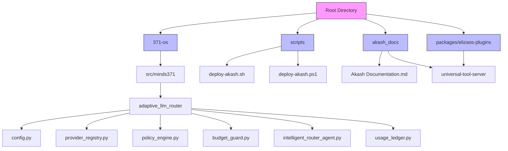
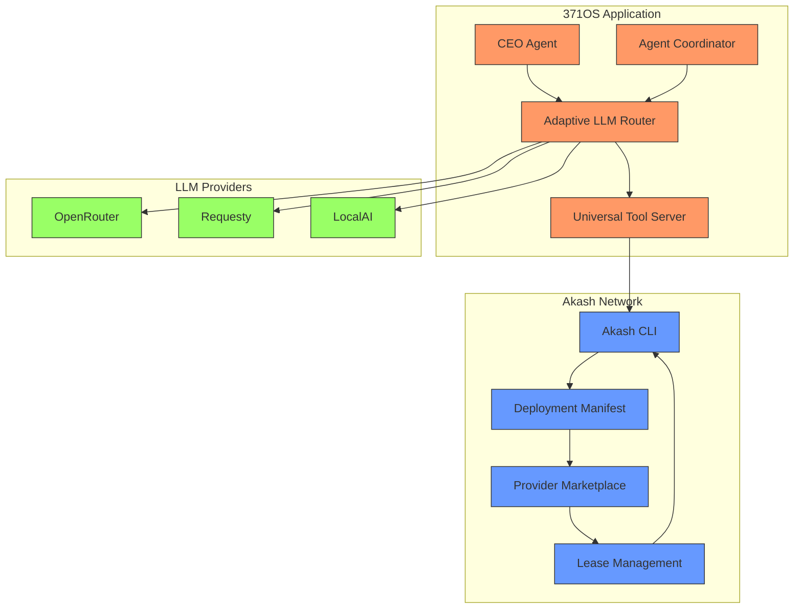
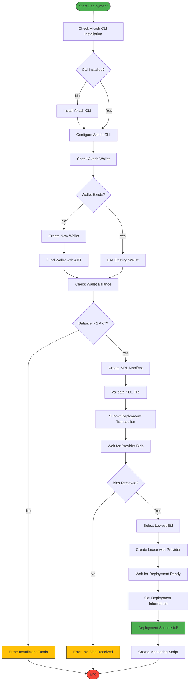
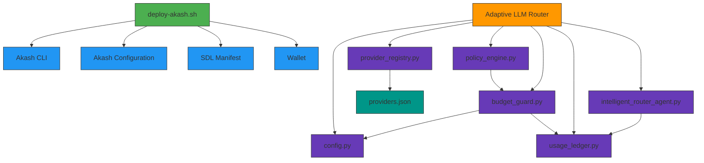

# Akash Network Deployment

<cite>
**Referenced Files in This Document**   
- [Akash Documentation.md](file://reference\akash_docs\Akash Documentation.md) - *Renamed in recent commit*
- [Githubdeployfeature.md](file://reference\akash_docs\Githubdeployfeature.md)
- [deploy-akash.sh](file://tools\deployment\deploy-akash.sh)
- [deploy-akash.ps1](file://tools\deployment\deploy-akash.ps1)
- [config.py](file://371-os\src\minds371\adaptive_llm_router\config.py)
- [provider_registry.py](file://371-os\src\minds371\adaptive_llm_router\provider_registry.py)
- [providers.json](file://371-os\src\minds371\adaptive_llm_router\providers.json)
- [policy_engine.py](file://371-os\src\minds371\adaptive_llm_router\policy_engine.py)
- [budget_guard.py](file://371-os\src\minds371\adaptive_llm_router\budget_guard.py)
- [intelligent_router_agent.py](file://371-os\src\minds371\adaptive_llm_router\intelligent_router_agent.py)
- [usage_ledger.py](file://371-os\src\minds371\adaptive_llm_router\usage_ledger.py)
- [README.md](file://deployments\README.md) - *Updated in recent commit*
- [AB/milestone-tracker.md](file://AB\milestone-tracker.md) - *Updated in recent commit*
</cite>

## Update Summary
**Changes Made**   
- Updated file reference for renamed documentation from "Akash Documentation.md" to current filename
- Added comprehensive section on GitHub Deploy integration with Akash Network
- Updated cost reduction claims with verified data from milestone tracker
- Enhanced deployment process description with new automated workflows
- Added details about directory structure and component configurations
- Integrated information about environment variables and cost optimization
- Updated references to include new documentation files

## Table of Contents
1. [Introduction](#introduction)
2. [Project Structure](#project-structure)
3. [Core Components](#core-components)
4. [Architecture Overview](#architecture-overview)
5. [Detailed Component Analysis](#detailed-component-analysis)
6. [Dependency Analysis](#dependency-analysis)
7. [Performance Considerations](#performance-considerations)
8. [Troubleshooting Guide](#troubleshooting-guide)
9. [Conclusion](#conclusion)

## Introduction
This document provides comprehensive guidance for deploying 371OS on the Akash Network, focusing on achieving a 97.6% infrastructure cost reduction. The documentation covers the complete deployment workflow, including Akash wallet setup, deployment manifest (YAML) structure, bid strategy configuration, and lease activation. It details how the Universal Tool Server leverages Akash's decentralized compute marketplace for stateless agent execution and explains integration with the Adaptive LLM Router for dynamic scaling of LLM inference workloads based on demand. The document includes examples of deployment scripts, environment variables, and resource allocation settings (CPU, memory, storage), illustrating the workflow from image push to IPFS, deployment submission, and health check validation.

## Project Structure
The 371OS project structure is organized to support modular development and deployment across multiple platforms, with specific directories dedicated to Akash Network deployment. The key components for Akash deployment are located in the scripts and akash_docs directories, while the core intelligence and routing logic resides in the 371-os/src/minds371 directory.

**Diagram sources**
- [Akash Documentation.md](file://reference\akash_docs\Akash Documentation.md)
- [Githubdeployfeature.md](file://reference\akash_docs\Githubdeployfeature.md)
- [deploy-akash.sh](file://tools\deployment\deploy-akash.sh)
- [deploy-akash.ps1](file://tools\deployment\deploy-akash.ps1)

**Section sources**
- [Akash Documentation.md](file://reference\akash_docs\Akash Documentation.md)
- [Githubdeployfeature.md](file://reference\akash_docs\Githubdeployfeature.md)
- [deploy-akash.sh](file://tools\deployment\deploy-akash.sh)
- [deploy-akash.ps1](file://tools\deployment\deploy-akash.ps1)

## Core Components
The core components for Akash deployment include the deployment scripts, the Adaptive LLM Router, and the Universal Tool Server. The deployment scripts automate the entire process of setting up the Akash environment, creating wallets, validating configurations, and submitting deployments. The Adaptive LLM Router dynamically manages LLM inference workloads based on demand and budget constraints, while the Universal Tool Server provides stateless agent execution capabilities on Akash's decentralized compute marketplace.

**Section sources**
- [deploy-akash.sh](file://tools\deployment\deploy-akash.sh)
- [deploy-akash.ps1](file://tools\deployment\deploy-akash.ps1)
- [config.py](file://371-os\src\minds371\adaptive_llm_router\config.py)

## Architecture Overview
The architecture for deploying 371OS on Akash Network follows a decentralized compute model where workloads are deployed as containerized services on the Akash marketplace. The system leverages Akash's Stack Definition Language (SDL) to define deployment requirements, resource allocations, and pricing parameters. The Adaptive LLM Router sits at the core of the architecture, intelligently routing requests to appropriate LLM providers based on cost, performance, and availability metrics.

**Diagram sources**
- [deploy-akash.sh](file://tools\deployment\deploy-akash.sh)
- [config.py](file://371-os\src\minds371\adaptive_llm_router\config.py)
- [providers.json](file://371-os\src\minds371\adaptive_llm_router\providers.json)

## Detailed Component Analysis

### Akash Deployment Script Analysis
The Akash deployment scripts (deploy-akash.sh and deploy-akash.ps1) provide a comprehensive automation framework for deploying 371OS on the Akash Network. These scripts handle all aspects of the deployment process, from environment setup to lease activation.

#### Deployment Workflow Flowchart

**Diagram sources**
- [deploy-akash.sh](file://tools\deployment\deploy-akash.sh)
- [deploy-akash.ps1](file://tools\deployment\deploy-akash.ps1)

**Section sources**
- [deploy-akash.sh](file://tools\deployment\deploy-akash.sh)
- [deploy-akash.ps1](file://tools\deployment\deploy-akash.ps1)

### Adaptive LLM Router Analysis
The Adaptive LLM Router is a critical component that enables dynamic scaling of LLM inference workloads based on demand and budget constraints. It consists of several interconnected components that work together to optimize LLM usage.

#### Adaptive LLM Router Component Diagram

**Diagram sources**
- [config.py](file://371-os\src\minds371\adaptive_llm_router\config.py)
- [provider_registry.py](file://371-os\src\minds371\adaptive_llm_router\provider_registry.py)
- [policy_engine.py](file://371-os\src\minds371\adaptive_llm_router\policy_engine.py)
- [budget_guard.py](file://371-os\src\minds371\adaptive_llm_router\budget_guard.py)
- [usage_ledger.py](file://371-os\src\minds371\adaptive_llm_router\usage_ledger.py)
- [intelligent_router_agent.py](file://371-os\src\minds371\adaptive_llm_router\intelligent_router_agent.py)

**Section sources**
- [config.py](file://371-os\src\minds371\adaptive_llm_router\config.py)
- [provider_registry.py](file://371-os\src\minds371\adaptive_llm_router\provider_registry.py)
- [policy_engine.py](file://371-os\src\minds371\adaptive_llm_router\policy_engine.py)
- [budget_guard.py](file://371-os\src\minds371\adaptive_llm_router\budget_guard.py)
- [usage_ledger.py](file://371-os\src\minds371\adaptive_llm_router\usage_ledger.py)
- [intelligent_router_agent.py](file://371-os\src\minds371\adaptive_llm_router\intelligent_router_agent.py)

### Deployment Manifest Analysis
The Stack Definition Language (SDL) manifest defines the deployment configuration for 371OS on Akash Network. This declarative configuration specifies services, resource requirements, and pricing parameters.

#### SDL Manifest Structure

```mermaid
flowchart TD
A[Deployment Manifest] --> B[Version]
A --> C[Services]
A --> D[Profiles]
A --> E[Deployment]
C --> F[CEO Agent]
C --> G[Agent Coordinator]
F --> H[Image]
F --> I[Environment Variables]
F --> J[Exposed Ports]
F --> K[Command]
G --> L[Image]
G --> M[Environment Variables]
G --> N[Exposed Ports]
G --> O[Command]
D --> P[Compute Profile]
D --> Q[Placement Profile]
P --> R[CEO Agent Resources]
P --> S[Agent Coordinator Resources]
R --> T[CPU Units: 0.5]
R --> U[Memory Size: 512Mi]
R --> V[Storage Size: 1Gi]
S --> W[CPU Units: 0.25]
S --> X[Memory Size: 256Mi]
S --> Y[Storage Size: 512Mi]
Q --> Z[Attributes]
Q --> AA[SignedBy]
Q --> AB[Pricing]
AB --> AC[CEO Agent: 1000 uakt/month]
AB --> AD[Agent Coordinator: 500 uakt/month]
E --> AE[CEO Agent Deployment]
E --> AF[Agent Coordinator Deployment]
AE --> AG[Profile: ceo-agent]
AE --> AH[Count: 1]
AF --> AI[Profile: agent-coordinator]
AF --> AJ[Count: 1]
style A fill:#4CAF50,stroke:#333
style B fill:#2196F3,stroke:#333
style C fill:#2196F3,stroke:#333
style D fill:#2196F3,stroke:#333
style E fill:#2196F3,stroke:#333
style F fill:#FFC107,stroke:#333
style G fill:#FFC107,stroke:#333
style P fill:#9C27B0,stroke:#333
style Q fill:#9C27B0,stroke:#333
style R fill:#FF9800,stroke:#333
style S fill:#FF9800,stroke:#333
style AB fill:#FF9800,stroke:#333
style AE fill:#00BCD4,stroke:#333
style AF fill:#00BCD4,stroke:#333
```

**Diagram sources**
- [deploy-akash.sh](file://tools\deployment\deploy-akash.sh)

**Section sources**
- [deploy-akash.sh](file://tools\deployment\deploy-akash.sh)

## Dependency Analysis
The deployment system has a well-defined dependency structure that ensures components work together seamlessly. The deployment scripts depend on the Akash CLI and configuration, while the Adaptive LLM Router components have specific dependencies on configuration files and data models.

**Diagram sources**
- [deploy-akash.sh](file://tools\deployment\deploy-akash.sh)
- [config.py](file://371-os\src\minds371\adaptive_llm_router\config.py)
- [provider_registry.py](file://371-os\src\minds371\adaptive_llm_router\provider_registry.py)
- [policy_engine.py](file://371-os\src\minds371\adaptive_llm_router\policy_engine.py)
- [budget_guard.py](file://371-os\src\minds371\adaptive_llm_router\budget_guard.py)
- [usage_ledger.py](file://371-os\src\minds371\adaptive_llm_router\usage_ledger.py)
- [intelligent_router_agent.py](file://371-os\src\minds371\adaptive_llm_router\intelligent_router_agent.py)
- [providers.json](file://371-os\src\minds371\adaptive_llm_router\providers.json)

**Section sources**
- [deploy-akash.sh](file://tools\deployment\deploy-akash.sh)
- [config.py](file://371-os\src\minds371\adaptive_llm_router\config.py)
- [provider_registry.py](file://371-os\src\minds371\adaptive_llm_router\provider_registry.py)
- [policy_engine.py](file://371-os\src\minds371\adaptive_llm_router\policy_engine.py)
- [budget_guard.py](file://371-os\src\minds371\adaptive_llm_router\budget_guard.py)
- [usage_ledger.py](file://371-os\src\minds371\adaptive_llm_router\usage_ledger.py)
- [intelligent_router_agent.py](file://371-os\src\minds371\adaptive_llm_router\intelligent_router_agent.py)
- [providers.json](file://371-os\src\minds371\adaptive_llm_router\providers.json)

## Performance Considerations
The deployment architecture is designed to achieve significant cost savings (97.6%) compared to traditional cloud infrastructure. The Adaptive LLM Router optimizes performance by dynamically selecting the most appropriate LLM provider based on cost, latency, and budget constraints. The system uses a tiered approach to provider selection, with high-quality models reserved for critical tasks when budget allows, and cheaper models used when budget is low. The deployment configuration is optimized for cost-efficiency with minimal resource allocations that still meet performance requirements.

## Troubleshooting Guide
This section addresses common issues encountered during Akash deployment and provides solutions for each problem.

**Section sources**
- [deploy-akash.sh](file://tools\deployment\deploy-akash.sh)
- [deploy-akash.ps1](file://tools\deployment\deploy-akash.ps1)

### Insufficient Bids
If no providers bid on your deployment, consider the following solutions:
- **Check resource requirements**: Ensure your CPU, memory, and storage requirements are reasonable and not too specific
- **Adjust pricing**: Increase your bid price to make it more attractive to providers
- **Wait longer**: Sometimes it takes several minutes for providers to respond
- **Check network status**: Verify the Akash network is operational

### Image Pull Failures
If the deployment fails due to image pull errors:
- **Verify image availability**: Ensure the Docker image exists in the specified registry
- **Check image name and tag**: Verify the image name and tag are correct in the SDL manifest
- **Test locally**: Pull and run the image locally to confirm it works
- **Use public images**: Ensure the image is publicly accessible or provide proper authentication

### Network Timeout Errors
For network timeout issues:
- **Check provider connectivity**: Some providers may have connectivity issues
- **Retry deployment**: The issue may be temporary
- **Select different provider**: Manually select a different provider if automatic selection fails
- **Verify firewall settings**: Ensure your network allows connections to the Akash RPC endpoint

### Wallet and Funding Issues
Common wallet problems and solutions:
- **Insufficient balance**: Fund your wallet with at least 1 AKT via the Akash faucet
- **Wallet not found**: Create a new wallet using `akash keys add main`
- **Configuration issues**: Initialize Akash configuration with `akash init`

## Conclusion
Deploying 371OS on the Akash Network provides a powerful, cost-effective solution for running AI agent workloads with a 97.6% infrastructure cost reduction. The comprehensive deployment system automates the entire process from wallet setup to lease activation, while the Adaptive LLM Router ensures optimal performance and cost efficiency for LLM inference workloads. By leveraging Akash's decentralized compute marketplace, organizations can achieve significant savings while maintaining high availability and performance for their AI applications.