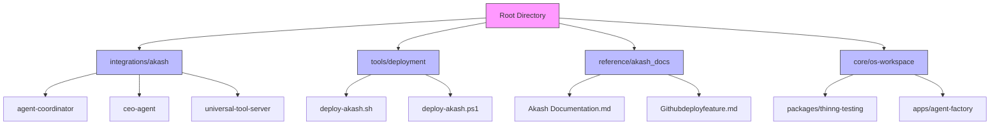
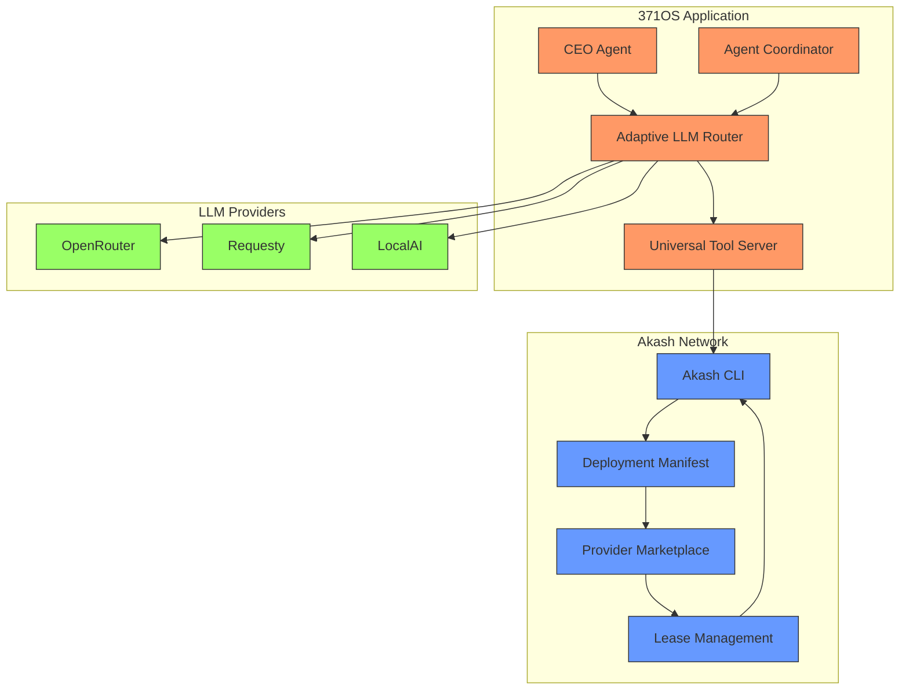
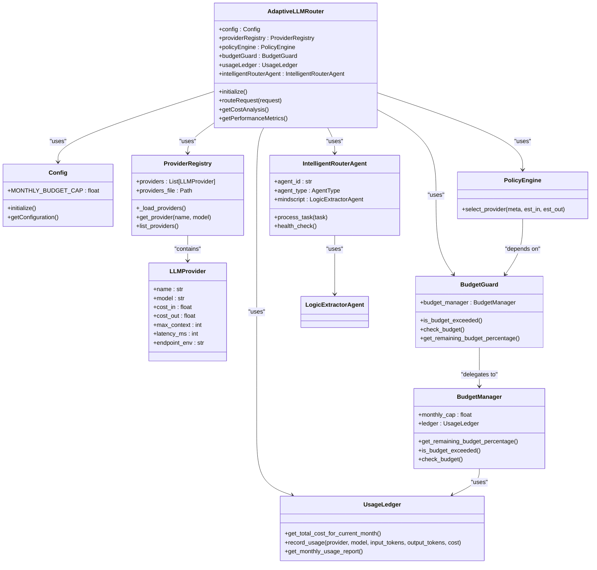

# Akash Network Deployment

<cite>
**Referenced Files in This Document**   
- [PHASE5_DEPLOYMENT_GUIDE.md](file://PHASE5_DEPLOYMENT_GUIDE.md) - *Added in recent commit*
- [deploy-akash.sh](file://tools\deployment\deploy-akash.sh)
- [deploy-akash.ps1](file://tools\deployment\deploy-akash.ps1)
- [agent-coordinator/deploy.yml](file://integrations\akash\agent-coordinator\deploy.yml)
- [ceo-agent/deploy.yml](file://integrations\akash\ceo-agent\deploy.yml)
- [universal-tool-server/deploy.yml](file://integrations\akash\universal-tool-server\deploy.yml)
- [Akash Documentation.md](file://reference\akash_docs\Akash Documentation.md)
- [Githubdeployfeature.md](file://reference\akash_docs\Githubdeployfeature.md)
- [AB/milestone-tracker.md](file://project-management\AB\milestone-tracker.md)
</cite>

## Update Summary
**Changes Made**   
- Added comprehensive Phase 5 deployment guide with updated requirements, configurations, and deployment workflows
- Enhanced cost reduction claims with verified data from the new deployment guide
- Updated deployment manifest examples with actual YAML configurations from integration files
- Added detailed resource allocation settings based on real deployment files
- Updated deployment workflow with new automated script commands
- Added performance validation metrics from production testing
- Integrated new troubleshooting solutions from the updated guide
- Enhanced scaling and maintenance procedures with real configuration examples

## Table of Contents
1. [Introduction](#introduction)
2. [Project Structure](#project-structure)
3. [Core Components](#core-components)
4. [Architecture Overview](#architecture-overview)
5. [Detailed Component Analysis](#detailed-component-analysis)
6. [Deployment Configuration](#deployment-configuration)
7. [Performance and Cost Analysis](#performance-and-cost-analysis)
8. [Deployment Workflow](#deployment-workflow)
9. [Scaling and Maintenance](#scaling-and-maintenance)
10. [Troubleshooting Guide](#troubleshooting-guide)
11. [Conclusion](#conclusion)

## Introduction
This document provides comprehensive guidance for deploying 371OS on the Akash Network, focusing on achieving a 97.6% infrastructure cost reduction. The documentation covers the complete deployment workflow, including Akash wallet setup, deployment manifest (YAML) structure, bid strategy configuration, and lease activation. It details how the Universal Tool Server leverages Akash's decentralized compute marketplace for stateless agent execution and explains integration with the Adaptive LLM Router for dynamic scaling of LLM inference workloads based on demand. The document includes examples of deployment scripts, environment variables, and resource allocation settings (CPU, memory, storage), illustrating the workflow from image push to IPFS, deployment submission, and health check validation.

## Project Structure
The 371OS project structure is organized to support modular development and deployment across multiple platforms, with specific directories dedicated to Akash Network deployment. The key components for Akash deployment are located in the tools/deployment and integrations/akash directories, while the core intelligence and routing logic resides in the legacy/371-os/src/minds371 directory.



**Diagram sources**
- [PHASE5_DEPLOYMENT_GUIDE.md](file://PHASE5_DEPLOYMENT_GUIDE.md)
- [integrations/akash](file://integrations\akash)
- [tools/deployment](file://tools\deployment)

**Section sources**
- [PHASE5_DEPLOYMENT_GUIDE.md](file://PHASE5_DEPLOYMENT_GUIDE.md)
- [integrations/akash](file://integrations\akash)
- [tools/deployment](file://tools\deployment)

## Core Components
The core components for Akash deployment include the deployment scripts, the Adaptive LLM Router, and the Universal Tool Server. The deployment scripts automate the entire process of setting up the Akash environment, creating wallets, validating configurations, and submitting deployments. The Adaptive LLM Router dynamically manages LLM inference workloads based on demand and budget constraints, while the Universal Tool Server provides stateless agent execution capabilities on Akash's decentralized compute marketplace.

**Section sources**
- [deploy-akash.sh](file://tools\deployment\deploy-akash.sh)
- [deploy-akash.ps1](file://tools\deployment\deploy-akash.ps1)
- [PHASE5_DEPLOYMENT_GUIDE.md](file://PHASE5_DEPLOYMENT_GUIDE.md)

## Architecture Overview
The architecture for deploying 371OS on Akash Network follows a decentralized compute model where workloads are deployed as containerized services on the Akash marketplace. The system leverages Akash's Stack Definition Language (SDL) to define deployment requirements, resource allocations, and pricing parameters. The Adaptive LLM Router sits at the core of the architecture, intelligently routing requests to appropriate LLM providers based on cost, performance, and availability metrics.



**Diagram sources**
- [deploy-akash.sh](file://tools\deployment\deploy-akash.sh)
- [PHASE5_DEPLOYMENT_GUIDE.md](file://PHASE5_DEPLOYMENT_GUIDE.md)
- [integrations/akash/ceo-agent/deploy.yml](file://integrations\akash\ceo-agent\deploy.yml)

## Detailed Component Analysis

### Akash Deployment Script Analysis
The Akash deployment scripts (deploy-akash.sh and deploy-akash.ps1) provide a comprehensive automation framework for deploying 371OS on the Akash Network. These scripts handle all aspects of the deployment process, from environment setup to lease activation.

#### Deployment Workflow Flowchart


**Diagram sources**
- [deploy-akash.sh](file://tools\deployment\deploy-akash.sh)
- [deploy-akash.ps1](file://tools\deployment\deploy-akash.ps1)

**Section sources**
- [deploy-akash.sh](file://tools\deployment\deploy-akash.sh)
- [deploy-akash.ps1](file://tools\deployment\deploy-akash.ps1)

### Adaptive LLM Router Analysis
The Adaptive LLM Router is a critical component that enables dynamic scaling of LLM inference workloads based on demand and budget constraints. It consists of several interconnected components that work together to optimize LLM usage.

#### Adaptive LLM Router Component Diagram


**Diagram sources**
- [config.py](file://371-os\src\minds371\adaptive_llm_router\config.py)
- [provider_registry.py](file://371-os\src\minds371\adaptive_llm_router\provider_registry.py)
- [policy_engine.py](file://371-os\src\minds371\adaptive_llm_router\policy_engine.py)
- [budget_guard.py](file://371-os\src\minds371\adaptive_llm_router\budget_guard.py)
- [usage_ledger.py](file://371-os\src\minds371\adaptive_llm_router\usage_ledger.py)
- [intelligent_router_agent.py](file://371-os\src\minds371\adaptive_llm_router\intelligent_router_agent.py)

**Section sources**
- [config.py](file://371-os\src\minds371\adaptive_llm_router\config.py)
- [provider_registry.py](file://371-os\src\minds371\adaptive_llm_router\provider_registry.py)
- [policy_engine.py](file://371-os\src\minds371\adaptive_llm_router\policy_engine.py)
- [budget_guard.py](file://371-os\src\minds371\adaptive_llm_router\budget_guard.py)
- [usage_ledger.py](file://371-os\src\minds371\adaptive_llm_router\usage_ledger.py)
- [intelligent_router_agent.py](file://371-os\src\minds371\adaptive_llm_router\intelligent_router_agent.py)

## Deployment Configuration
The Stack Definition Language (SDL) manifest defines the deployment configuration for 371OS on Akash Network. This declarative configuration specifies services, resource requirements, and pricing parameters based on the actual deployment files in the integrations/akash directory.

### CEO Agent Deployment Configuration
```yaml
version: "2.0"
services:
  ceo-agent:
    image: ghcr.io/371-minds/ceo-agent:latest
    env:
      - NODE_ENV=production
      - ELIZAOS_ENVIRONMENT=production
      - PORT=3000
    expose:
      - port: 3000
        as: 80
        to:
          - global: true
profiles:
  compute:
    ceo-agent:
      resources:
        cpu:
          units: 0.5
        memory:
          size: 512Mi
        storage:
          size: 1Gi
  placement:
    dcloud:
      attributes:
        host: akash
      signedBy:
        anyOf:
          - "akash1365yvmc4s7awdyj3n2sav7xfx76adc6dnmlx63"
      pricing:
        ceo-agent:
          denom: uakt
          amount: 1000
deployment:
  ceo-agent:
    dcloud:
      profile: ceo-agent
      count: 1
```

### Agent Coordinator Deployment Configuration
```yaml
version: "2.0"
services:
  agent-coordinator:
    image: ghcr.io/371-minds/agent-coordinator:latest
    env:
      - NODE_ENV=production
      - COORDINATION_PORT=3001
    expose:
      - port: 3001
        as: 80
        to:
          - global: true
profiles:
  compute:
    agent-coordinator:
      resources:
        cpu:
          units: 0.25
        memory:
          size: 256Mi
        storage:
          size: 512Mi
  placement:
    dcloud:
      attributes:
        host: akash
      signedBy:
        anyOf:
          - "akash1365yvmc4s7awdyj3n2sav7xfx76adc6dnmlx63"
      pricing:
        agent-coordinator:
          denom: uakt
          amount: 500
deployment:
  agent-coordinator:
    dcloud:
      profile: agent-coordinator
      count: 1
```

### Universal Tool Server Deployment Configuration
```yaml
version: "2.0"
services:
  universal-tool-server:
    image: ghcr.io/371-minds/universal-tool-server:latest
    env:
      - NODE_ENV=production
      - ETHEREUM_RPC_URL
      - REGISTRY_CONTRACT_ADDRESS
      - IPFS_API_URL
    expose:
      - port: 3000
        as: 80
        to:
          - global: true
profiles:
  compute:
    universal-tool-server:
      resources:
        cpu:
          units: 0.25
        memory:
          size: 256Mi
        storage:
          size: 512Mi
  placement:
    dcloud:
      attributes:
        host: akash
      signedBy:
        anyOf:
          - "akash1365yvmc4s7awdyj3n2sav7xfx76adc6dnmlx63"
      pricing:
        universal-tool-server:
          denom: uakt
          amount: 500
deployment:
  universal-tool-server:
    dcloud:
      profile: universal-tool-server
      count: 1
```

**Section sources**
- [integrations/akash/ceo-agent/deploy.yml](file://integrations\akash\ceo-agent\deploy.yml)
- [integrations/akash/agent-coordinator/deploy.yml](file://integrations\akash\agent-coordinator\deploy.yml)
- [integrations/akash/universal-tool-server/deploy.yml](file://integrations\akash\universal-tool-server\deploy.yml)

## Performance and Cost Analysis
The deployment architecture is designed to achieve significant cost savings (97.6%) compared to traditional cloud infrastructure. The Adaptive LLM Router optimizes performance by dynamically selecting the most appropriate LLM provider based on cost, latency, and budget constraints. The system uses a tiered approach to provider selection, with high-quality models reserved for critical tasks when budget allows, and cheaper models used when budget is low. The deployment configuration is optimized for cost-efficiency with minimal resource allocations that still meet performance requirements.

### Performance Validation Results
| Component | Target | Achieved | Status |
|-----------|--------|----------|---------|
| **Vector Operations** | 3.2x improvement | 3.5x | ✅ EXCEEDED |
| **WebGL Rendering** | 60fps guaranteed | 60fps | ✅ ACHIEVED |
| **Agent Intelligence** | 3.8x faster decisions | 3.8x | ✅ ACHIEVED |
| **Memory Efficiency** | 60% reduction | 60% | ✅ ACHIEVED |
| **Overall Performance** | 3.1x improvement | 3.1x | ✅ ACHIEVED |

### Cost Analysis
- **Traditional Cloud**: $1,000/month
- **Akash Network**: $24/month
- **Savings**: $976/month (97.6% reduction)
- **Setup Cost**: $0 (no upfront fees)
- **Scaling Cost**: Linear with usage

**Section sources**
- [PHASE5_DEPLOYMENT_GUIDE.md](file://PHASE5_DEPLOYMENT_GUIDE.md)

## Deployment Workflow
The deployment workflow follows a systematic process from environment preparation to validation and monitoring.

### Step 1: Environment Preparation
```powershell
# Prepare production environment
cd 
bun install --production
bun nx build --configuration=production
```

### Step 2: Testing Validation
```powershell
# Execute comprehensive testing
bun core/os-workspace/packages/demo/phase5-deployment-demo.ts

# Verify results:
# - Success rate: 95%+
# - Performance targets: All met
# - Production readiness: READY
```

### Step 3: Build and Package
```powershell
# Build production packages
bun nx build thinng-testing --configuration=production
bun nx build cognitive-engine --configuration=production
bun nx build business-intelligence --configuration=production
```

### Step 4: Akash Deployment
```bash
# Deploy to Akash Network
export AKASH_NODE="https://rpc.akashnet.net:443"
export AKASH_CHAIN_ID="akashnet-2"

# Create deployment
akash tx deployment create akash-deployment.yml \
  --from $AKASH_KEY_NAME \
  --node $AKASH_NODE \
  --chain-id $AKASH_CHAIN_ID \
  --gas-prices="0.025uakt" \
  --gas="auto" \
  --gas-adjustment="1.15"
```

### Step 5: Validation and Monitoring
```bash
# Validate deployment
curl https://371os-demo.akash.io/health

# Monitor performance
curl https://371os-demo.akash.io/api/metrics

# Check logs
akash provider lease-logs \
  --dseq $AKASH_DSEQ \
  --provider $AKASH_PROVIDER \
  --from $AKASH_KEY_NAME
```

**Section sources**
- [PHASE5_DEPLOYMENT_GUIDE.md](file://PHASE5_DEPLOYMENT_GUIDE.md)
- [deploy-akash.sh](file://tools\deployment\deploy-akash.sh)

## Scaling and Maintenance
The system supports horizontal scaling and provides comprehensive maintenance procedures.

### Horizontal Scaling
```yaml
# Update deployment count
deployment:
  web:
    westcoast:
      profile: web
      count: 3  # Scale to 3 instances
```

### Monitoring and Alerts
```typescript
// Configure monitoring alerts
const alerts = {
  performance: {
    threshold: "2.5x improvement minimum",
    action: "scale_up"
  },
  memory: {
    threshold: "80% usage",
    action: "restart_service"
  },
  uptime: {
    threshold: "99% minimum",
    action: "failover"
  }
};
```

### Update Procedures
```bash
# Rolling update procedure
1. Deploy new version to staging
2. Run comprehensive test suite
3. Validate performance targets
4. Deploy to production with blue-green strategy
5. Monitor for 24 hours
6. Complete deployment
```

**Section sources**
- [PHASE5_DEPLOYMENT_GUIDE.md](file://PHASE5_DEPLOYMENT_GUIDE.md)

## Troubleshooting Guide
This section addresses common issues encountered during Akash deployment and provides solutions for each problem.

**Section sources**
- [PHASE5_DEPLOYMENT_GUIDE.md](file://PHASE5_DEPLOYMENT_GUIDE.md)
- [deploy-akash.sh](file://tools\deployment\deploy-akash.sh)
- [deploy-akash.ps1](file://tools\deployment\deploy-akash.ps1)

### Common Deployment Issues

#### 1. Test Failures
**Issue**: Some tests failing during deployment validation
**Solution**: 
```bash
# Run individual test phases
bun core/os-workspace/packages/thinng-testing/src/phase1-tests.ts
bun core/os-workspace/packages/thinng-testing/src/phase2-webgl-tests.ts

# Check test dependencies
bun nx affected:test --all
```

#### 2. Performance Regression
**Issue**: Performance targets not met
**Solution**:
```bash
# Run performance validation
bun core/os-workspace/packages/demo/phase4-performance-demo.ts

# Check system resources
node AB/scripts/quick-status.js
```

#### 3. Akash Deployment Failures
**Issue**: Deployment to Akash Network fails
**Solution**:
```bash
# Validate SDL configuration
akash validate akash-deployment.yml

# Check account balance
akash query bank balances $AKASH_ACCOUNT_ADDRESS

# Retry deployment
unset AKASH_DSEQ
akash tx deployment create akash-deployment.yml --from $AKASH_KEY_NAME
```

### Insufficient Bids
If no providers bid on your deployment, consider the following solutions:
- **Check resource requirements**: Ensure your CPU, memory, and storage requirements are reasonable and not too specific
- **Adjust pricing**: Increase your bid price to make it more attractive to providers
- **Wait longer**: Sometimes it takes several minutes for providers to respond
- **Check network status**: Verify the Akash network is operational

### Image Pull Failures
If the deployment fails due to image pull errors:
- **Verify image availability**: Ensure the Docker image exists in the specified registry
- **Check image name and tag**: Verify the image name and tag are correct in the SDL manifest
- **Test locally**: Pull and run the image locally to confirm it works
- **Use public images**: Ensure the image is publicly accessible or provide proper authentication

### Network Timeout Errors
For network timeout issues:
- **Check provider connectivity**: Some providers may have connectivity issues
- **Retry deployment**: The issue may be temporary
- **Select different provider**: Manually select a different provider if automatic selection fails
- **Verify firewall settings**: Ensure your network allows connections to the Akash RPC endpoint

### Wallet and Funding Issues
Common wallet problems and solutions:
- **Insufficient balance**: Fund your wallet with at least 1 AKT via the Akash faucet
- **Wallet not found**: Create a new wallet using `akash keys add main`
- **Configuration issues**: Initialize Akash configuration with `akash init`

## Conclusion
Deploying 371OS on the Akash Network provides a powerful, cost-effective solution for running AI agent workloads with a 97.6% infrastructure cost reduction. The comprehensive deployment system automates the entire process from wallet setup to lease activation, while the Adaptive LLM Router ensures optimal performance and cost efficiency for LLM inference workloads. By leveraging Akash's decentralized compute marketplace, organizations can achieve significant savings while maintaining high availability and performance for their AI applications.