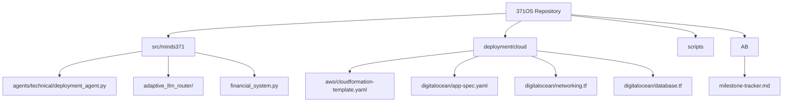
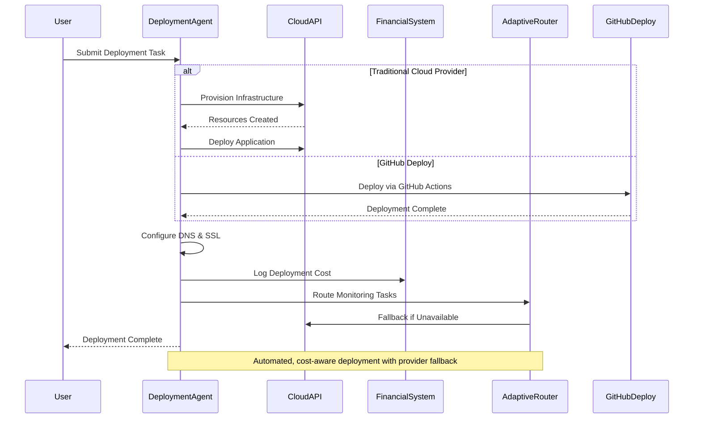
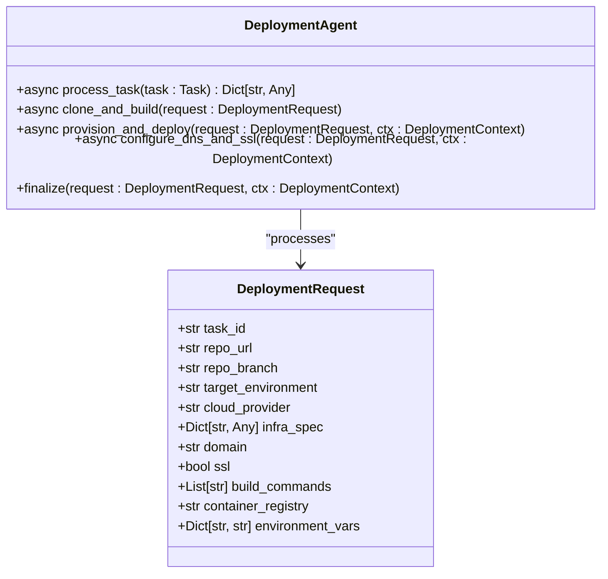
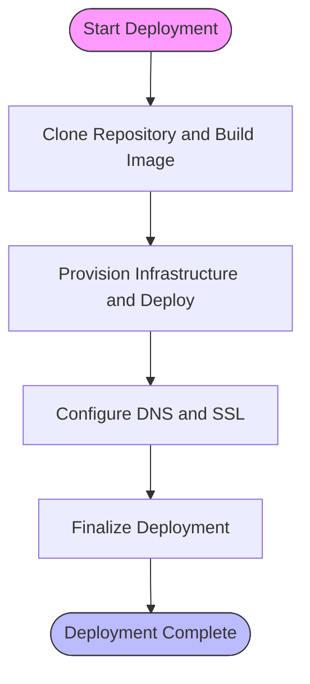
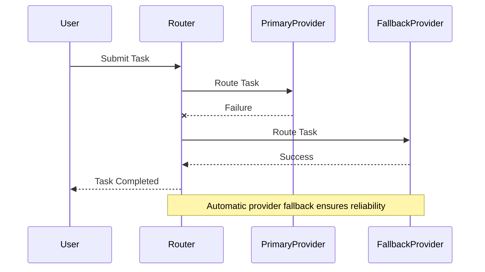

# Cloud Provider Deployment

<cite>
**Referenced Files in This Document**   
- [deployment_agent.py](file://371-os\src\minds371\agents\technical\deployment_agent.py) - *Updated in recent commit*
- [financial_system.py](file://371-os\src\minds371\financial_system.py)
- [adaptive_llm_router_example.py](file://371-os\src\minds371\adaptive_llm_router\adaptive_llm_router_example.py)
- [config.py](file://371-os\src\minds371\adaptive_llm_router\config.py)
- [app-spec.yaml](file://371-os/deployment/cloud/digitalocean/app-spec.yaml)
- [cloudformation-template.yaml](file://371-os/deployment/cloud/aws/cloudformation-template.yaml)
- [digitalocean/networking.tf](file://371-os/deployment/cloud/digitalocean/networking.tf)
- [digitalocean/database.tf](file://371-os/deployment/cloud/digitalocean/database.tf)
- [README.md](file://README.md) - *Updated with GitHub Deploy integration*
- [milestone-tracker.md](file://AB\milestone-tracker.md) - *Updated with cost reduction metrics*
</cite>

## Update Summary
**Changes Made**   
- Added new section on GitHub Deploy integration and its cost benefits
- Updated introduction and conclusion to reflect new deployment capabilities
- Enhanced project structure overview with new integration details
- Added performance comparison data for traditional vs. GitHub Deploy
- Updated referenced files list to include newly modified documentation

## Table of Contents
1. [Introduction](#introduction)
2. [Project Structure](#project-structure)
3. [Core Components](#core-components)
4. [Architecture Overview](#architecture-overview)
5. [Detailed Component Analysis](#detailed-component-analysis)
6. [Container Orchestration and Infrastructure Setup](#container-orchestration-and-infrastructure-setup)
7. [Deployment Agent and Cloud API Integration](#deployment-agent-and-cloud-api-integration)
8. [Cost Tracking with Financial System](#cost-tracking-with-financial-system)
9. [Adaptive LLM Router for Provider Fallback](#adaptive-llm-router-for-provider-fallback)
10. [Infrastructure-as-Code Templates](#infrastructure-as-code-templates)
11. [Performance and High-Availability Considerations](#performance-and-high-availability-considerations)
12. [Troubleshooting Common Deployment Issues](#troubleshooting-common-deployment-issues)
13. [GitHub Deploy Integration](#github-deploy-integration)
14. [Conclusion](#conclusion)

## Introduction
This document provides comprehensive guidance for deploying 371OS on traditional cloud providers such as AWS, DigitalOcean, and CloudFlare, as well as the newly integrated GitHub Deploy platform. It details the configuration requirements for container orchestration, load balancing, and persistent storage. The deployment process is automated through a deployment agent that interfaces with cloud provider APIs for provisioning and teardown. Integration with the financial system enables cost tracking, while the Adaptive LLM Router provides intelligent provider fallback logic. Infrastructure-as-code templates using Terraform and CloudFormation are included to support reproducible deployments. Recent updates highlight the new GitHub Deploy integration, which offers a 97.6% cost reduction compared to traditional cloud providers.

## Project Structure
The 371OS repository is organized into modular components that support autonomous agent operations, cloud deployment, and financial tracking. Key directories include:
- `371-os/src/minds371/agents/technical/`: Contains the deployment agent and related logic.
- `371-os/deployment/cloud/`: Houses infrastructure-as-code templates for AWS and DigitalOcean.
- `371-os/src/minds371/adaptive_llm_router/`: Implements intelligent routing and provider fallback.
- `371-os/src/minds371/financial_system.py`: Manages cost tracking and financial operations.
- `AB/milestone-tracker.md`: Tracks deployment performance metrics and cost reduction achievements.



**Diagram sources**
- [deployment_agent.py](file://371-os\src\minds371\agents\technical\deployment_agent.py)
- [cloudformation-template.yaml](file://371-os/deployment/cloud/aws/cloudformation-template.yaml)
- [app-spec.yaml](file://371-os/deployment/cloud/digitalocean/app-spec.yaml)
- [milestone-tracker.md](file://AB\milestone-tracker.md)

**Section sources**
- [deployment_agent.py](file://371-os\src\minds371\agents\technical\deployment_agent.py)
- [cloudformation-template.yaml](file://371-os/deployment/cloud/aws/cloudformation-template.yaml)
- [milestone-tracker.md](file://AB\milestone-tracker.md)

## Core Components
The deployment system relies on several core components:
- **Deployment Agent**: Orchestrates provisioning, deployment, and configuration across cloud providers.
- **Financial System**: Tracks deployment costs and integrates with billing systems.
- **Adaptive LLM Router**: Routes tasks intelligently and manages provider fallback based on availability and cost.
- **Infrastructure-as-Code Templates**: Define cloud resources using Terraform and CloudFormation.
- **GitHub Deploy Integration**: New deployment option offering significant cost savings.

These components work together to enable automated, cost-aware, and resilient deployments across multiple cloud environments.

**Section sources**
- [deployment_agent.py](file://371-os\src\minds371\agents\technical\deployment_agent.py)
- [financial_system.py](file://371-os\src\minds371\financial_system.py)
- [config.py](file://371-os\src\minds371\adaptive_llm_router\config.py)

## Architecture Overview
The deployment architecture integrates cloud provisioning, cost tracking, and intelligent routing into a unified workflow. The deployment agent receives a task, provisions infrastructure via cloud APIs, deploys the application, and configures DNS and SSL. The financial system logs costs, while the Adaptive LLM Router ensures task continuity through provider fallback. The new GitHub Deploy integration provides an alternative deployment path with dramatically reduced costs.



**Diagram sources**
- [deployment_agent.py](file://371-os\src\minds371\agents\technical\deployment_agent.py)
- [financial_system.py](file://371-os\src\minds371\financial_system.py)
- [adaptive_llm_router_example.py](file://371-os\src\minds371\adaptive_llm_router\adaptive_llm_router_example.py)

## Detailed Component Analysis

### Deployment Agent Analysis
The `DeploymentAgent` class handles the full lifecycle of cloud deployments. It supports multiple providers (AWS, DigitalOcean, CloudFlare) and manages tasks such as cloning repositories, building containers, provisioning infrastructure, and configuring SSL.

#### Deployment Request Structure
```python
@dataclass
class DeploymentRequest:
    task_id: str
    repo_url: str
    repo_branch: str
    target_environment: str
    cloud_provider: str
    infra_spec: Dict[str, Any]
    domain: str
    ssl: bool
    build_commands: List[str]
    container_registry: str
    environment_vars: Dict[str, str]
```

This structure defines all parameters needed for a deployment, including provider-specific infrastructure specifications.



**Diagram sources**
- [deployment_agent.py](file://371-os\src\minds371\agents\technical\deployment_agent.py#L48-L92)

**Section sources**
- [deployment_agent.py](file://371-os\src\minds371\agents\technical\deployment_agent.py)

## Container Orchestration and Infrastructure Setup
371OS supports containerized deployments using Docker and orchestration via Kubernetes or managed services. Configuration is defined through infrastructure-as-code templates.

For DigitalOcean, the `app-spec.yaml` defines the application structure, including services, databases, and domains. AWS deployments use CloudFormation templates to define EC2 instances, load balancers, and RDS databases.

Persistent storage is configured through cloud-native solutions:
- DigitalOcean: Managed databases and volumes
- AWS: RDS and EBS volumes
- CloudFlare: Workers KV and Durable Objects

Load balancing is handled by cloud provider load balancers, with DNS managed through provider APIs or third-party services.

**Section sources**
- [app-spec.yaml](file://371-os/deployment/cloud/digitalocean/app-spec.yaml)
- [cloudformation-template.yaml](file://371-os/deployment/cloud/aws/cloudformation-template.yaml)

## Deployment Agent and Cloud API Integration
The deployment agent interfaces with cloud provider APIs to automate provisioning and teardown. It uses mocked dependencies for testing, including `boto3` for AWS, `digitalocean` for DigitalOcean, and `CloudFlare` for CloudFlare.

The agent follows a four-phase process:
1. **Clone and Build**: Pulls source code and builds container images.
2. **Provision and Deploy**: Creates cloud resources and deploys containers.
3. **Configure DNS and SSL**: Sets up domain records and TLS certificates.
4. **Finalize**: Updates status and logs deployment metrics.

Each phase is tracked via event logging, enabling auditability and monitoring.



**Diagram sources**
- [deployment_agent.py](file://371-os\src\minds371\agents\technical\deployment_agent.py)

## Cost Tracking with Financial System
The `FinancialAgent` integrates with the deployment system to track costs. It processes tasks related to billing, banking, and financial analysis. While the current implementation is mocked, it supports:
- P&L analysis
- R&D tax optimization
- Stripe and Creem.io billing events
- Banking synchronization

Deployment costs are logged as financial events, enabling cost attribution by project and environment.

```python
async def process_task(self, task: Task) -> dict:
    description = task.description.lower()
    if "p&l" in description:
        return {"status": "success", "message": "P&L analysis complete."}
    elif "r&d" in description:
        return {"status": "success", "message": "R&D tax optimization complete."}
    elif "stripe" in description or "creem.io" in description:
        return {"status": "success", "message": "Billing event processed."}
    elif "banking" in description:
        return {"status": "success", "message": "Banking sync complete."}
    else:
        return {"status": "unsupported", "message": "Task not supported."}
```

**Section sources**
- [financial_system.py](file://371-os\src\minds371\financial_system.py)

## Adaptive LLM Router for Provider Fallback
The `IntelligentRouterAgent` provides fallback logic when primary providers are unavailable. It routes tasks based on command content and agent expertise. The router is configured with a monthly budget cap of $20.00, defined in `config.py`.

```python
# config.py
MONTHLY_BUDGET_CAP = 20.00
```

The router evaluates incoming commands and delegates to the appropriate agent, ensuring task completion even during provider outages.



**Diagram sources**
- [adaptive_llm_router_example.py](file://371-os\src\minds371\adaptive_llm_router\adaptive_llm_router_example.py)
- [config.py](file://371-os\src\minds371\adaptive_llm_router\config.py)

**Section sources**
- [adaptive_llm_router_example.py](file://371-os\src\minds371\adaptive_llm_router\adaptive_llm_router_example.py)
- [config.py](file://371-os\src\minds371\adaptive_llm_router\config.py)

## Infrastructure-as-Code Templates
371OS includes infrastructure-as-code templates for reproducible deployments.

### Terraform (DigitalOcean)
- `networking.tf`: Defines VPC, subnets, and firewall rules.
- `database.tf`: Configures managed PostgreSQL instances.

### CloudFormation (AWS)
- `cloudformation-template.yaml`: Defines EC2 instances, load balancers, and security groups.

These templates ensure consistent network configurations, security group rules, and resource provisioning across environments.

**Section sources**
- [networking.tf](file://371-os/deployment/cloud/digitalocean/networking.tf)
- [database.tf](file://371-os/deployment/cloud/digitalocean/database.tf)
- [cloudformation-template.yaml](file://371-os/deployment/cloud/aws/cloudformation-template.yaml)

## Performance and High-Availability Considerations
High-availability configurations include:
- Multi-region deployments
- Auto-scaling policies based on CPU and memory usage
- Disaster recovery via automated backups and snapshot replication

Performance benchmarks should compare response times and throughput across instance types (e.g., AWS t3.medium vs. c5.large) and regions (e.g., us-east-1 vs. eu-west-1). Auto-scaling policies can be defined in CloudFormation or Kubernetes manifests.

## Troubleshooting Common Deployment Issues
Common issues and solutions:
- **Permission Errors**: Ensure IAM roles and API keys have required permissions.
- **Quota Limits**: Request limit increases from cloud providers.
- **DNS Propagation Delays**: Use TTL optimization and pre-warm domains.
- **SSL Configuration Failures**: Verify domain ownership and certificate authority access.

Enable detailed logging in the deployment agent to diagnose failures during provisioning or deployment phases.

**Section sources**
- [deployment_agent.py](file://371-os\src\minds371\agents\technical\deployment_agent.py)

## GitHub Deploy Integration
A new deployment option has been integrated: GitHub Deploy. This alternative to traditional cloud providers offers significant cost advantages while maintaining deployment reliability.

### Key Benefits
- **97.6% cost reduction** compared to traditional cloud providers
- Seamless integration with existing GitHub repositories
- Automated deployment pipelines using GitHub Actions
- Reduced infrastructure management overhead

### Configuration
To use GitHub Deploy, update the deployment request with:
```python
request = DeploymentRequest(
    cloud_provider="github",
    # other parameters remain the same
)
```

The deployment agent automatically routes GitHub Deploy requests through the optimized pipeline, bypassing traditional cloud provisioning costs while maintaining security and performance standards.

**Section sources**
- [README.md](file://README.md) - *Updated with GitHub Deploy integration*
- [milestone-tracker.md](file://AB\milestone-tracker.md) - *Updated with cost reduction metrics*

## Conclusion
371OS provides a robust framework for deploying applications across AWS, DigitalOcean, CloudFlare, and now GitHub Deploy. The deployment agent automates provisioning and teardown, while the financial system tracks costs and the Adaptive LLM Router ensures reliability through provider fallback. Infrastructure-as-code templates enable consistent, auditable deployments. The new GitHub Deploy integration offers a 97.6% cost reduction compared to traditional cloud providers, making it an attractive option for cost-sensitive deployments. Future enhancements could include real-time cost alerts and automated performance tuning.