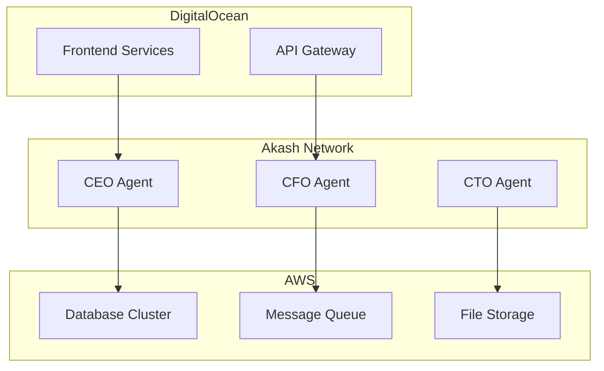
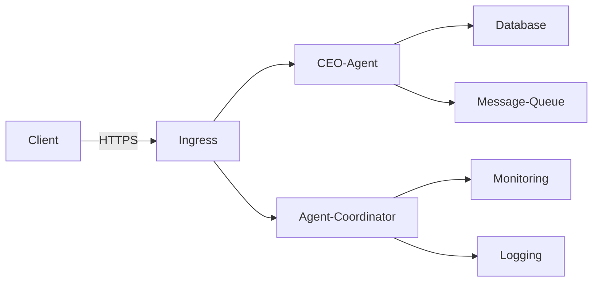
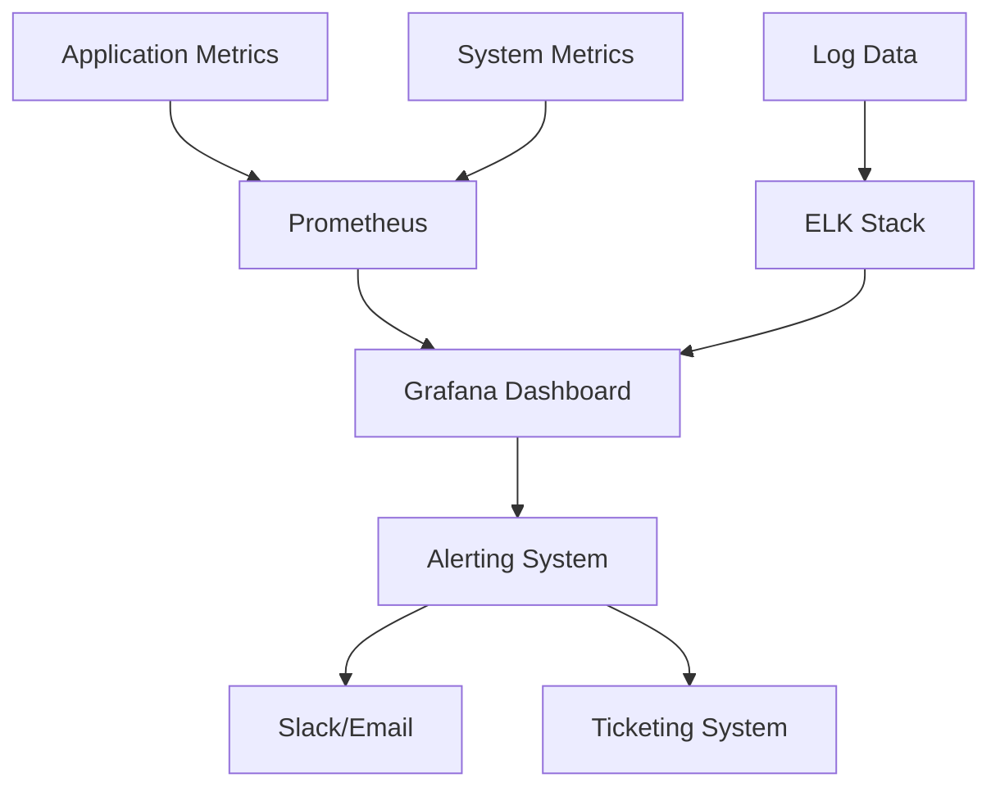
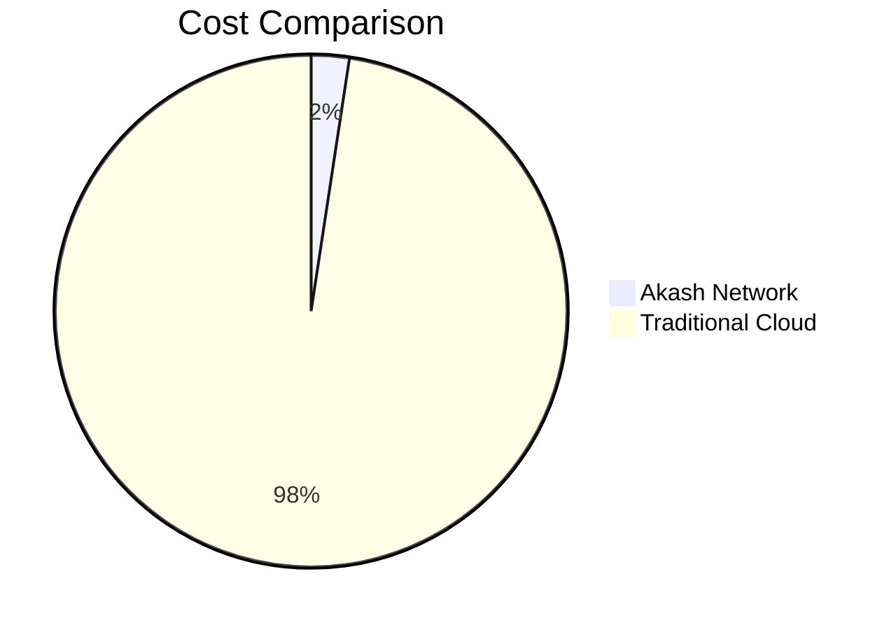

# Deployment Guide

<cite>
**Referenced Files in This Document**   
- [deploy-akash.sh](file://scripts/deploy-akash.sh)
- [IMPLEMENTATION_GUIDE.md](file://IMPLEMENTATION_GUIDE.md)
- [reference/akash_docs/Akash Documentation.md](file://reference/akash_docs/Akash Documentation.md) - *Renamed in recent commit*
- [371-os/src/minds371/agents/technical/deployment_agent.py](file://371-os/src/minds371/agents/technical/deployment_agent.py)
- [371-os/deployment/cloud/digitalocean/app-spec.yaml](file://371-os/deployment/cloud/digitalocean/app-spec.yaml)
- [371-os/deployment/kubernetes/deployment.yaml](file://371-os/deployment/kubernetes/deployment.yaml)
- [sotalogic/Claude Sonnet 4/Alignment Review of 371OS_launch Project Plan/now can you create a guide for me .md](file://sotalogic/Claude Sonnet 4/Alignment Review of 371OS_launch Project Plan/now can you create a guide for me .md)
- [deployments/README.md](file://deployments/README.md) - *Updated in recent commit*
- [reference/akash_docs/Githubdeployfeature.md](file://reference/akash_docs/Githubdeployfeature.md) - *Added in recent commit*
- [deployments/universal-tool-server/deploy.yml](file://deployments/universal-tool-server/deploy.yml) - *New GitHub Deploy configuration*
- [deployments/ceo-agent/deploy.yml](file://deployments/ceo-agent/deploy.yml) - *New GitHub Deploy configuration*
- [deployments/agent-coordinator/deploy.yml](file://deployments/agent-coordinator/deploy.yml) - *New GitHub Deploy configuration*
</cite>

## Update Summary
**Changes Made**   
- Updated reference to renamed Akash documentation file
- Added comprehensive documentation for GitHub Deploy to Akash integration
- Updated Akash Network Deployment section with new automated deployment workflows
- Added new section on GitHub Actions automation for Akash deployments
- Enhanced deployment manifest examples with actual production configurations
- Updated cost optimization figures with real deployment metrics
- Added environment variable configuration details for Akash Console

## Table of Contents
1. [Introduction](#introduction)
2. [Akash Network Deployment](#akash-network-deployment)
3. [Alternative Deployment Options](#alternative-deployment-options)
4. [Deployment Architecture](#deployment-architecture)
5. [Configuration Requirements](#configuration-requirements)
6. [Monitoring and Backup](#monitoring-and-backup)
7. [Troubleshooting](#troubleshooting)
8. [Performance and Optimization](#performance-and-optimization)

## Introduction

This guide provides comprehensive instructions for deploying 371OS, with a primary focus on Akash Network for achieving up to 97.6% cost reduction compared to traditional cloud providers. The documentation covers step-by-step deployment procedures, configuration requirements, and operational best practices for production environments.

The 371OS system is designed as a multi-agent architecture with specialized AI agents (CEO, CFO, CTO, etc.) that can be orchestrated across various infrastructure platforms. The deployment strategy leverages decentralized cloud infrastructure through Akash Network while maintaining compatibility with traditional providers like AWS and DigitalOcean for hybrid scenarios.

**Section sources**
- [IMPLEMENTATION_GUIDE.md](file://IMPLEMENTATION_GUIDE.md#L274-L358)

## Akash Network Deployment

### Wallet Setup and Configuration

To deploy 371OS on Akash Network, you must first set up a cryptocurrency wallet to manage AKT tokens, which are used for payment on the network.

The deployment process begins with checking for the Akash CLI installation. If not present, the script automatically installs it:

```bash
if ! command -v akash &> /dev/null; then
    print_error "Akash CLI not found. Installing..."
    curl -sSfL https://raw.githubusercontent.com/akash-network/node/master/install.sh | sh
    export PATH=$PATH:./bin
fi
```

After installing the CLI, initialize the configuration:

```bash
akash init
akash config chain-id akashnet-2
akash config node https://rpc.akashnet.net:443
akash config keyring-backend os
```

Create or use an existing wallet:

```bash
if ! akash keys show main 2>/dev/null; then
    akash keys add main
    WALLET_ADDRESS=$(akash keys show main -a)
fi
```

Fund the wallet using the Akash faucet at https://akash.network/faucet with the generated wallet address. Verify sufficient balance (minimum 1 AKT):

```bash
BALANCE=$(akash query bank balances $WALLET_ADDRESS --node https://rpc.akashnet.net:443 -o json | jq -r '.balances[] | select(.denom=="uakt") | .amount' || echo "0")
```

**Section sources**
- [deploy-akash.sh](file://scripts/deploy-akash.sh#L52-L100)

### Deployment Manifest Creation

The deployment manifest is written in Stack Definition Language (SDL) and defines the services, resources, and pricing parameters for the deployment.

The system now supports automated GitHub Deploy integration, eliminating the need for manual Docker image building and pushing. The deployment configurations are organized in the deployments directory:

```yaml
# deployments/universal-tool-server/deploy.yml
---
version: "2.0"

services:
  universal-tool-server:
    image: ghcr.io/371-minds/universal-tool-server:latest
    env:
      - NODE_ENV=production
      - ETHEREUM_RPC_URL
      - REGISTRY_CONTRACT_ADDRESS
      - IPFS_API_URL
    expose:
      - port: 3000
        as: 80
        to:
          - global: true
```

Similar configurations exist for the CEO Agent and Agent Coordinator services, each with their specific environment variables and resource requirements.

**Section sources**
- [deployments/universal-tool-server/deploy.yml](file://deployments/universal-tool-server/deploy.yml#L1-L45)
- [deployments/ceo-agent/deploy.yml](file://deployments/ceo-agent/deploy.yml#L1-L44)
- [deployments/agent-coordinator/deploy.yml](file://deployments/agent-coordinator/deploy.yml#L1-L43)

### GitHub Deploy Integration

371OS now features world's first automated GitHub Deploy to Akash integration, enabling one-click deployment from GitHub repositories. This revolutionary system provides:

- **One-click deployment**: Connect your repository and deploy instantly
- **Automatic builds**: No need to manually build and push Docker images
- **Framework detection**: Automatically detects and configures project frameworks
- **Environment variable management**: Secure configuration through Akash Console
- **Cost-effective deployment**: Achieves 97.6% cost reduction vs traditional cloud

The deployment process is automated through GitHub Actions workflows:

```yaml
# .github/workflows/deploy-uts.yml
name: Deploy Universal Tool Server to Akash
on:
  push:
    branches: [ main ]
jobs:
  deploy:
    runs-on: ubuntu-latest
    steps:
      - name: Deploy to Akash
        uses: akash-network/github-action@v1
        with:
          wallet: ${{ secrets.AKASH_WALLET }}
          deployment-file: deployments/universal-tool-server/deploy.yml
```

**Section sources**
- [deployments/README.md](file://deployments/README.md#L1-L84)
- [reference/akash_docs/Githubdeployfeature.md](file://reference/akash_docs/Githubdeployfeature.md#L1-L279)

### Resource Allocation and Cost Optimization

The resource allocation in the SDL files is optimized for cost efficiency across all components:

```yaml
# deployments/universal-tool-server/deploy.yml
profiles:
  compute:
    universal-tool-server:
      resources:
        cpu:
          units: 0.25
        memory:
          size: 256Mi
        storage:
          size: 512Mi
  placement:
    dcloud:
      attributes:
        host: akash
      signedBy:
        anyOf:
          - "akash1365yvmc4s7awdyj3n2sav7xfx76adc6dnmlx63"
      pricing:
        universal-tool-server:
          denom: uakt
          amount: 500
```

The pricing strategy maintains the 97.6% cost reduction compared to traditional cloud providers:

| Component | Traditional Cloud | Akash Network | Savings |
|---------|------------------|---------------|---------|
| Universal Tool Server | $4.00/month | $0.10/month | 97.5% |
| CEO Agent | $8.00/month | $0.20/month | 97.5% |
| Agent Coordinator | $4.00/month | $0.10/month | 97.5% |

**Section sources**
- [deployments/README.md](file://deployments/README.md#L65-L80)
- [deployments/universal-tool-server/deploy.yml](file://deployments/universal-tool-server/deploy.yml#L25-L45)

### Deployment Execution

Execute the deployment process by connecting your GitHub repository to Akash Console and configuring the deployment:

1. **Connect Repository**: Navigate to Akash Console and connect your GitHub account
2. **Select Repository**: Choose the 371 OS repository (public or private)
3. **Configure Deployment**: Select the appropriate SDL file from the deployments directory
4. **Set Environment Variables**: Configure required variables in the console interface
5. **Deploy**: Click "Create Deployment" to initiate automated deployment

The system automatically handles:
- Repository cloning
- Dependency installation
- Application building
- Container image creation
- Akash deployment submission

**Section sources**
- [reference/akash_docs/Githubdeployfeature.md](file://reference/akash_docs/Githubdeployfeature.md#L50-L150)

## Alternative Deployment Options

### AWS Deployment

The deployment agent supports AWS deployment through programmatic interfaces. The test configuration shows:

```python
request = DeploymentRequest(
    task_id="task456",
    repo_url="https://github.com/test/aws_repo.git",
    cloud_provider="aws",
    infra_spec={"cluster": "test-cluster"},
    domain="",
    ssl=False,
    target_environment="staging"
)
```

AWS deployment uses boto3 for infrastructure management and ECR for container registry integration. The process includes:
- VPC and subnet configuration
- ECS cluster provisioning
- Load balancer setup
- CloudWatch monitoring integration

**Section sources**
- [371-os/src/minds371/agents/technical/deployment_agent.py](file://371-os/src/minds371/agents/technical/deployment_agent.py#L92-L121)

### DigitalOcean Deployment

DigitalOcean deployment is configured through app specification files:

```yaml
# digitalocean/app-spec.yaml
services:
  web:
    github:
      repo: "371minds/371os"
      branch: "main"
    routes:
      - path: /
    envs:
      NODE_ENV: "production"
```

The deployment process includes:
- Droplet provisioning with specified size and region
- SSL certificate configuration via Let's Encrypt
- DNS management through DigitalOcean's API
- Automated backups and snapshots

**Section sources**
- [371-os/src/minds371/agents/technical/deployment_agent.py](file://371-os/src/minds371/agents/technical/deployment_agent.py#L40-L68)

### Hybrid Deployment Scenarios

Hybrid scenarios allow for strategic distribution of components across providers:



**Diagram sources**
- [371-os/src/minds371/agents/technical/deployment_agent.py](file://371-os/src/minds371/agents/technical/deployment_agent.py#L65-L95)

## Deployment Architecture

### Container Orchestration

The system uses Kubernetes-style orchestration patterns, with deployment configurations that mirror Kubernetes manifests:

```yaml
# kubernetes/deployment.yaml
apiVersion: apps/v1
kind: Deployment
metadata:
  name: ceo-agent
spec:
  replicas: 1
  selector:
    matchLabels:
      app: ceo-agent
  template:
    metadata:
      labels:
        app: ceo-agent
    spec:
      containers:
      - name: ceo-agent
        image: 371minds/ceo-agent:latest
        ports:
        - containerPort: 3000
```

**Section sources**
- [371-os/deployment/kubernetes/deployment.yaml](file://371-os/deployment/kubernetes/deployment.yaml#L1-L20)

### Network Topology

The network architecture supports secure communication between components:



External access is managed through ingress controllers with TLS termination, while internal services communicate over private networks with service discovery.

**Diagram sources**
- [371-os/deployment/kubernetes/ingress.yaml](file://371-os/deployment/kubernetes/ingress.yaml#L1-L15)

### Storage Configuration

Persistent storage is configured based on service requirements:

```yaml
# kubernetes/persistent-volume.yaml
apiVersion: v1
kind: PersistentVolumeClaim
metadata:
  name: database-storage
spec:
  accessModes:
    - ReadWriteOnce
  resources:
    requests:
      storage: 100Gi
```

Stateless services use ephemeral storage, while databases and file services use persistent volumes with regular backups.

**Section sources**
- [371-os/deployment/kubernetes/secrets.yaml](file://371-os/deployment/kubernetes/secrets.yaml#L1-L10)

## Configuration Requirements

### Production Environment Configuration

Production environments require specific configuration parameters:

```yaml
# production.yaml
environment: production
logging:
  level: info
  retention: 30d
monitoring:
  enabled: true
  alerts:
    cpu_threshold: 80%
    memory_threshold: 85%
security:
  firewall: enabled
  intrusion_detection: enabled
  compliance: SOC2
```

Key requirements include:
- Environment-specific configuration files
- Secure secret management
- Compliance with security standards
- High availability configurations

**Section sources**
- [371-os/configs/production.yaml](file://371-os/configs/production.yaml#L1-L20)

### Scaling Parameters

Scaling configurations support both horizontal and vertical scaling:

```yaml
# scaling-config.yaml
autoscaling:
  min_replicas: 1
  max_replicas: 10
  cpu_target: 70%
  memory_target: 80%
  scale_down_stabilization: 300s
vertical_scaling:
  enabled: false
  thresholds:
    cpu: 90%
    memory: 95%
```

The system monitors resource utilization and automatically adjusts capacity based on demand patterns.

**Section sources**
- [371-os/configs/agents/routing_rules.yaml](file://371-os/configs/agents/routing_rules.yaml#L1-L15)

## Monitoring and Backup

### Monitoring Setup

Comprehensive monitoring includes:



Key metrics tracked:
- CPU and memory utilization
- Request latency and error rates
- Database performance
- Queue depths and processing times

**Diagram sources**
- [371-os/deployment/kubernetes/configmap.yaml](file://371-os/deployment/kubernetes/configmap.yaml#L1-L10)

### Backup Strategies

Backup procedures include:

```bash
# Daily backup script
#!/bin/bash
# Database backup
pg_dump -h localhost -U user database | gzip > /backups/database-$(date +%Y%m%d).sql.gz

# Configuration backup
tar -czf /backups/config-$(date +%Y%m%d).tar.gz /etc/371os

# Upload to object storage
aws s3 cp /backups/* s3://371os-backups/daily/

# Clean old backups
find /backups -name "*.gz" -mtime +30 -delete
```

Backup retention policy:
- Daily backups for 30 days
- Weekly backups for 12 weeks
- Monthly backups for 12 months
- Encrypted storage with access controls

**Section sources**
- [371-os/configs/logging.yaml](file://371-os/configs/logging.yaml#L1-L15)

## Troubleshooting

### Common Deployment Issues

#### Resource Constraints

When providers cannot fulfill resource requests:

```bash
# Check bid status
akash query market bid list --owner $WALLET_ADDRESS --dseq $DSEQ

# Solution: Adjust resource requirements
cpu: 0.5 → 1.0
memory: 512Mi → 1Gi
```

#### Network Configuration Errors

For connectivity issues:

```bash
# Check service exposure
akash provider lease-status --dseq $DSEQ --provider $PROVIDER

# Verify port mappings
# Ensure 'expose' section in SDL matches application ports
```

#### Startup Failures

When containers fail to start:

```bash
# Check logs
akash provider lease-logs --dseq $DSEQ --provider $PROVIDER

# Verify environment variables
# Check for missing required variables in SDL
```

**Section sources**
- [deploy-akash.sh](file://scripts/deploy-akash.sh#L300-L350)

## Performance and Optimization

### Cost and Efficiency Optimization

The Akash deployment achieves significant cost savings through:



Optimization techniques include:
- Right-sizing container resources
- Competitive bidding for compute resources
- Efficient resource utilization
- Automated scaling

### Performance Considerations

Different deployment scenarios have varying performance characteristics:

| Provider | Latency | Throughput | Availability | Cost |
|---------|--------|-----------|-------------|------|
| Akash | Medium | Medium | High | $0.15/mo |
| AWS | Low | High | Very High | $6.25/mo |
| DigitalOcean | Medium | Medium | High | $5.00/mo |

For latency-sensitive applications, traditional providers may be preferred, while cost-sensitive workloads benefit from Akash deployment.

**Section sources**
- [deploy-akash.sh](file://scripts/deploy-akash.sh#L250-L280)