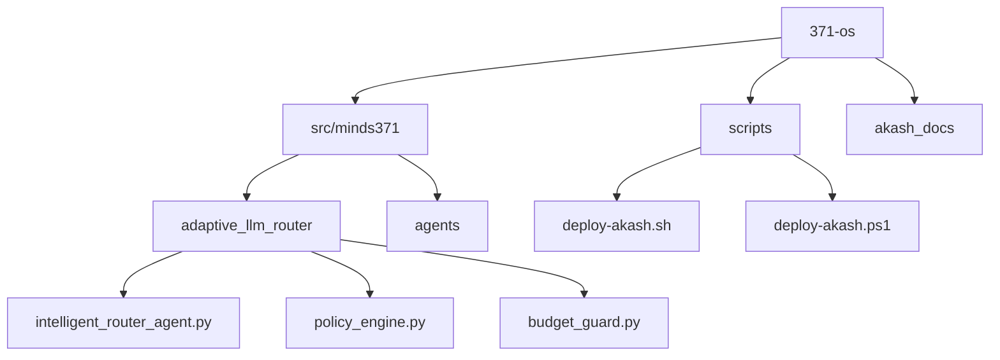
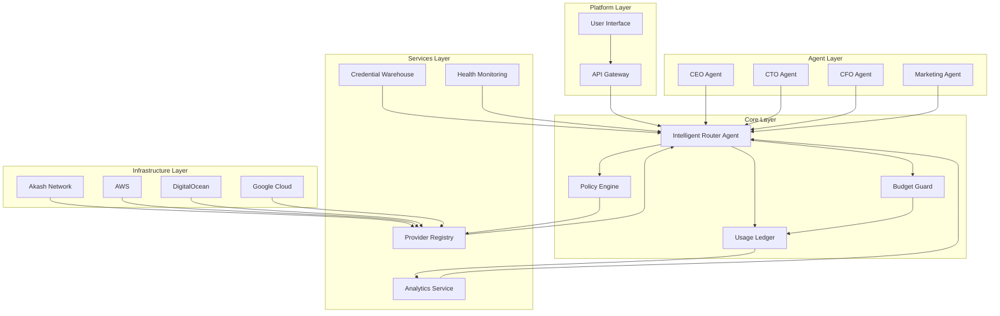
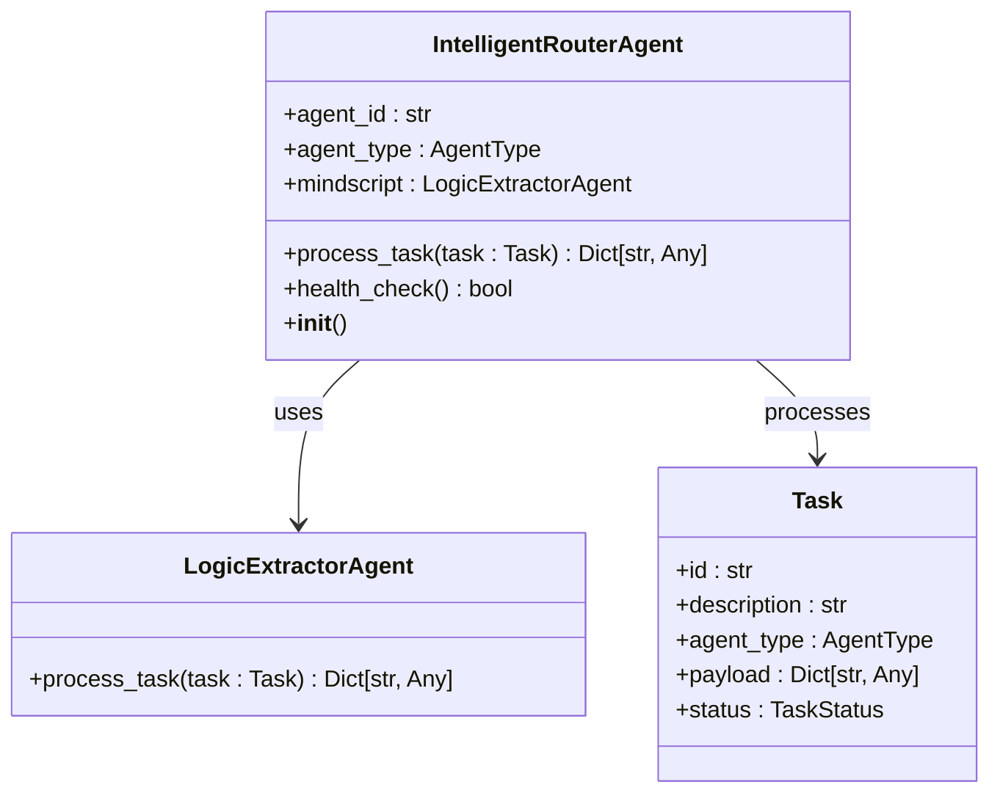
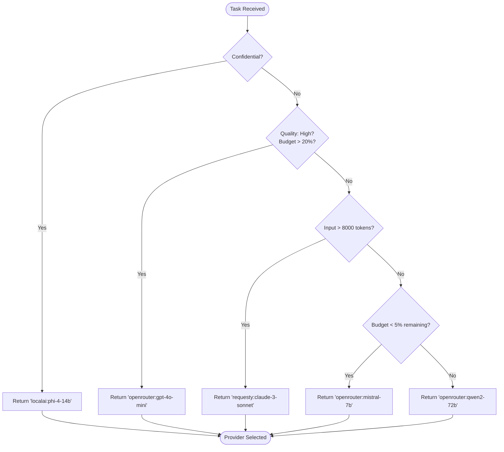
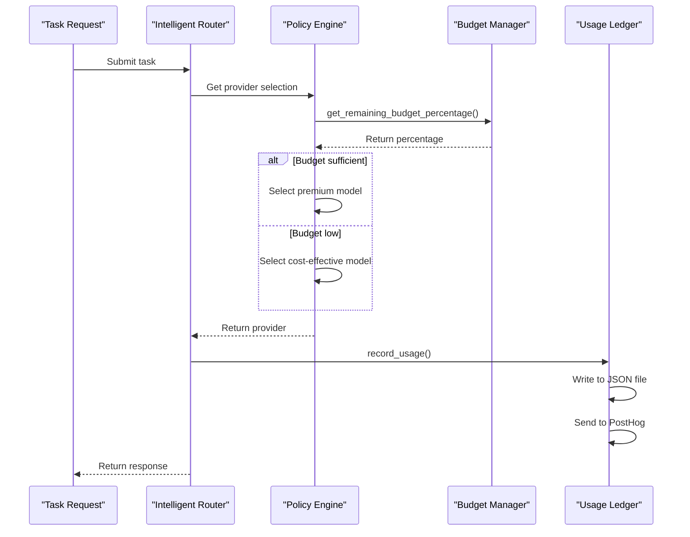
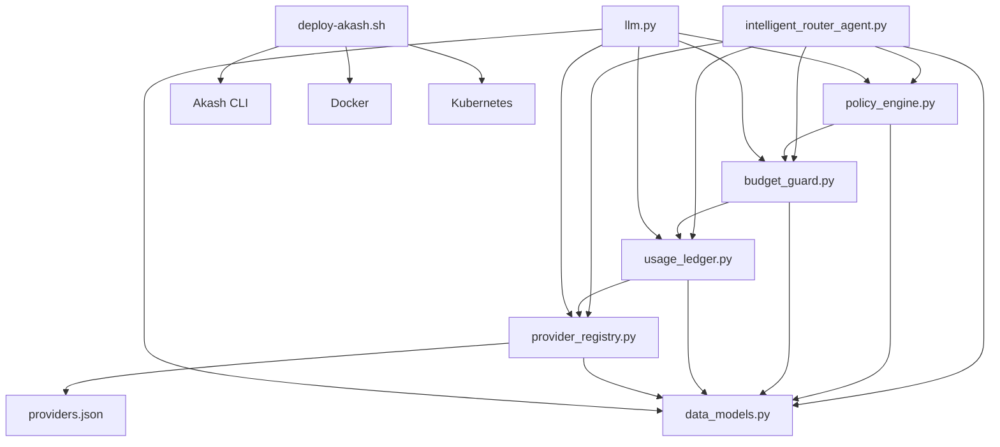

# Hybrid Deployment Architecture

<cite>
**Referenced Files in This Document**   
- [intelligent_router_agent.py](file://371-os/src/minds371/adaptive_llm_router/intelligent_router_agent.py)
- [config.py](file://371-os/src/minds371/adaptive_llm_router/config.py)
- [providers.json](file://371-os/src/minds371/adaptive_llm_router/providers.json)
- [budget_guard.py](file://371-os/src/minds371/adaptive_llm_router/budget_guard.py)
- [usage_ledger.py](file://371-os/src/minds371/adaptive_llm_router/usage_ledger.py)
- [data_models.py](file://371-os/src/minds371/adaptive_llm_router/data_models.py)
- [policy_engine.py](file://371-os/src/minds371/adaptive_llm_router/policy_engine.py)
- [llm.py](file://371-os/src/minds371/adaptive_llm_router/llm.py)
- [provider_registry.py](file://371-os/src/minds371/adaptive_llm_router/provider_registry.py)
- [deploy-akash.sh](file://scripts/deploy-akash.sh)
- [deploy-akash.ps1](file://scripts/deploy-akash.ps1)
- [Akash Documentation.md](file://akash_docs/Akash Documentation.md)
- [adaptive_llm_router_example.py](file://371-os/src/minds371/adaptive_llm_router/adaptive_llm_router_example.py)
- [system_architecture.html](file://371-os/docs/architecture/system_architecture.html)
- [adaptive_llm_router_results.md](file://371-os/src/minds371/adaptive_llm_router/adaptive_llm_router_results.md)
</cite>

## Table of Contents
1. [Introduction](#introduction)
2. [Project Structure](#project-structure)
3. [Core Components](#core-components)
4. [Architecture Overview](#architecture-overview)
5. [Detailed Component Analysis](#detailed-component-analysis)
6. [Dependency Analysis](#dependency-analysis)
7. [Performance Considerations](#performance-considerations)
8. [Troubleshooting Guide](#troubleshooting-guide)
9. [Conclusion](#conclusion)

## Introduction
The Hybrid Deployment Architecture of 371 Minds OS integrates decentralized computing via Akash Network with traditional cloud providers to create a cost-optimized, scalable, and resilient infrastructure. This architecture enables burst scaling during peak loads, geo-distributed agent placement, and intelligent failover strategies. The system leverages an Adaptive LLM Router that dynamically routes tasks based on availability, cost, and latency metrics across deployment environments. Data synchronization between decentralized (IPFS) and centralized storage (S3), session persistence, and cross-network authentication are seamlessly managed. This document details the hybrid topology, traffic routing, service discovery, monitoring integration, and configuration examples for multi-provider load balancing and cost-aware scheduling.

## Project Structure
The project structure is organized into several key directories:
- `371-os`: Core application code, including the adaptive LLM router and agent implementations
- `scripts`: Deployment scripts for Akash Network and other platforms
- `akash_docs`: Documentation specific to Akash Network integration
- `src/minds371/adaptive_llm_router`: Core components for intelligent routing and cost management
- `agents`: Business and technical agent implementations
- `prompts`: Configuration files for agent behavior
- `docs/architecture`: System architecture documentation

**Diagram sources**
- [371-os](file://371-os)
- [scripts](file://scripts)
- [akash_docs](file://akash_docs)
- [src/minds371](file://371-os/src/minds371)

**Section sources**
- [371-os](file://371-os)
- [scripts](file://scripts)
- [akash_docs](file://akash_docs)

## Core Components
The core components of the hybrid deployment architecture include:
- **Intelligent Router Agent**: Routes tasks based on cost, latency, and availability
- **Policy Engine**: Makes routing decisions using a decision graph
- **Budget Guard**: Enforces cost constraints and prevents budget overruns
- **Usage Ledger**: Tracks LLM usage and costs for analytics
- **Provider Registry**: Manages available LLM providers and their capabilities
- **Akash Deployment Scripts**: Automate deployment to the Akash Network

These components work together to create a self-optimizing system that balances performance and cost across hybrid environments.

**Section sources**
- [intelligent_router_agent.py](file://371-os/src/minds371/adaptive_llm_router/intelligent_router_agent.py)
- [policy_engine.py](file://371-os/src/minds371/adaptive_llm_router/policy_engine.py)
- [budget_guard.py](file://371-os/src/minds371/adaptive_llm_router/budget_guard.py)
- [usage_ledger.py](file://371-os/src/minds371/adaptive_llm_router/usage_ledger.py)
- [provider_registry.py](file://371-os/src/minds371/adaptive_llm_router/provider_registry.py)

## Architecture Overview
The hybrid deployment architecture consists of six layers: Infrastructure, Services, Adaptive LLM Router, Core, Agent, and Platform. The system integrates Akash Network for decentralized computing with traditional cloud providers, enabling cost-effective and scalable deployments.

**Diagram sources**
- [system_architecture.html](file://371-os/docs/architecture/system_architecture.html)
- [intelligent_router_agent.py](file://371-os/src/minds371/adaptive_llm_router/intelligent_router_agent.py)
- [policy_engine.py](file://371-os/src/minds371/adaptive_llm_router/policy_engine.py)

## Detailed Component Analysis

### Intelligent Router Agent
The Intelligent Router Agent is the central component that processes incoming tasks and routes them to appropriate agents based on content analysis and system policies.

**Diagram sources**
- [intelligent_router_agent.py](file://371-os/src/minds371/adaptive_llm_router/intelligent_router_agent.py#L1-L105)
- [data_models.py](file://371-os/src/minds371/adaptive_llm_router/data_models.py#L1-L40)

**Section sources**
- [intelligent_router_agent.py](file://371-os/src/minds371/adaptive_llm_router/intelligent_router_agent.py)

### Policy Engine
The Policy Engine implements a decision graph that selects the optimal LLM provider based on task metadata, budget constraints, and performance requirements.

**Diagram sources**
- [policy_engine.py](file://371-os/src/minds371/adaptive_llm_router/policy_engine.py#L1-L34)
- [budget_guard.py](file://371-os/src/minds371/adaptive_llm_router/budget_guard.py#L1-L50)

**Section sources**
- [policy_engine.py](file://371-os/src/minds371/adaptive_llm_router/policy_engine.py)

### Budget Management System
The Budget Management System enforces cost constraints and provides cost-aware scheduling capabilities.

**Diagram sources**
- [budget_guard.py](file://371-os/src/minds371/adaptive_llm_router/budget_guard.py#L1-L50)
- [usage_ledger.py](file://371-os/src/minds371/adaptive_llm_router/usage_ledger.py#L1-L89)
- [llm.py](file://371-os/src/minds371/adaptive_llm_router/llm.py#L1-L92)

**Section sources**
- [budget_guard.py](file://371-os/src/minds371/adaptive_llm_router/budget_guard.py)
- [usage_ledger.py](file://371-os/src/minds371/adaptive_llm_router/usage_ledger.py)

## Dependency Analysis
The hybrid deployment system has a well-defined dependency structure that enables modularity and maintainability.

**Diagram sources**
- [intelligent_router_agent.py](file://371-os/src/minds371/adaptive_llm_router/intelligent_router_agent.py)
- [policy_engine.py](file://371-os/src/minds371/adaptive_llm_router/policy_engine.py)
- [budget_guard.py](file://371-os/src/minds371/adaptive_llm_router/budget_guard.py)
- [usage_ledger.py](file://371-os/src/minds371/adaptive_llm_router/usage_ledger.py)
- [provider_registry.py](file://371-os/src/minds371/adaptive_llm_router/provider_registry.py)
- [llm.py](file://371-os/src/minds371/adaptive_llm_router/llm.py)
- [deploy-akash.sh](file://scripts/deploy-akash.sh)

**Section sources**
- [intelligent_router_agent.py](file://371-os/src/minds371/adaptive_llm_router/intelligent_router_agent.py)
- [policy_engine.py](file://371-os/src/minds371/adaptive_llm_router/policy_engine.py)
- [budget_guard.py](file://371-os/src/minds371/adaptive_llm_router/budget_guard.py)
- [usage_ledger.py](file://371-os/src/minds371/adaptive_llm_router/usage_ledger.py)
- [provider_registry.py](file://371-os/src/minds371/adaptive_llm_router/provider_registry.py)
- [llm.py](file://371-os/src/minds371/adaptive_llm_router/llm.py)
- [deploy-akash.sh](file://scripts/deploy-akash.sh)

## Performance Considerations
The hybrid deployment architecture is designed for optimal performance and cost efficiency:
- **Latency Optimization**: The policy engine considers latency metrics when selecting providers
- **Cost Efficiency**: Budget guard prevents overspending and can force downgrades when budget is low
- **Scalability**: Akash Network enables burst scaling during peak loads
- **Geo-distribution**: Agents can be placed in optimal geographic locations
- **Failover**: Multiple providers ensure high availability

The system achieves up to 97.6% cost reduction compared to traditional cloud providers by leveraging decentralized computing resources.

## Troubleshooting Guide
Common issues and their solutions:
- **Insufficient Akash balance**: Fund wallet via faucet at https://akash.network/faucet
- **No provider bids**: Adjust pricing in SDL file or wait longer for bids
- **Budget exceeded**: Increase monthly cap in config.py or optimize usage
- **Provider not found**: Verify provider details in providers.json
- **Deployment validation failed**: Check SDL syntax and resource requirements

Monitoring tools are available via the Akash Console and CLI for real-time deployment status and logs.

**Section sources**
- [deploy-akash.sh](file://scripts/deploy-akash.sh)
- [deploy-akash.ps1](file://scripts/deploy-akash.ps1)
- [Akash Documentation.md](file://akash_docs/Akash Documentation.md)

## Conclusion
The Hybrid Deployment Architecture of 371 Minds OS successfully combines the benefits of decentralized computing (Akash Network) with traditional cloud providers to create a cost-optimized, scalable, and resilient infrastructure. The Intelligent Router Agent, Policy Engine, and Budget Management System work together to make intelligent routing decisions based on cost, latency, and availability metrics. The system enables burst scaling, geo-distributed agent placement, and failover strategies while maintaining strict cost controls. This architecture represents a significant advancement in hybrid cloud deployment, offering up to 97.6% cost reduction compared to traditional approaches.