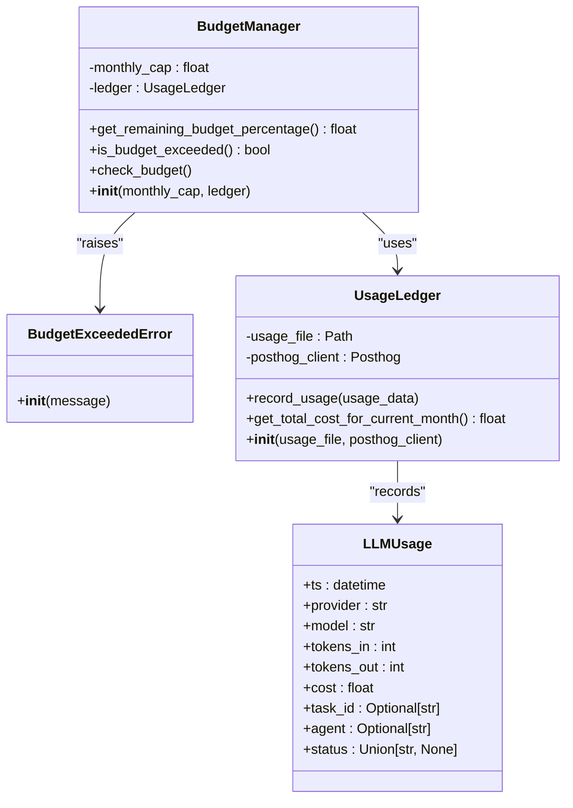
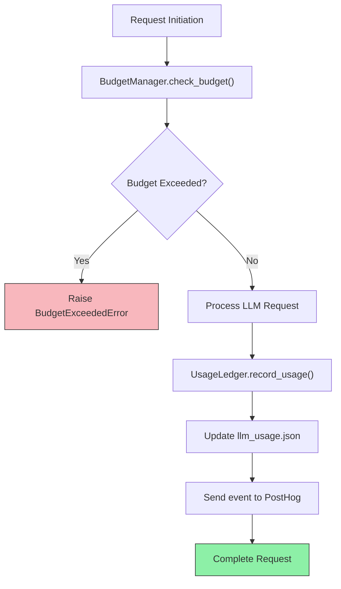
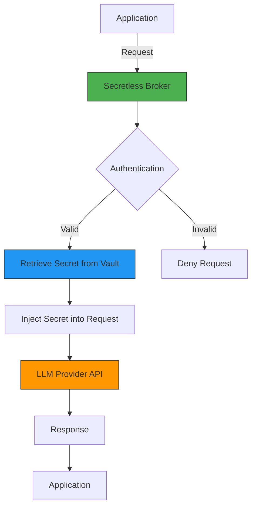
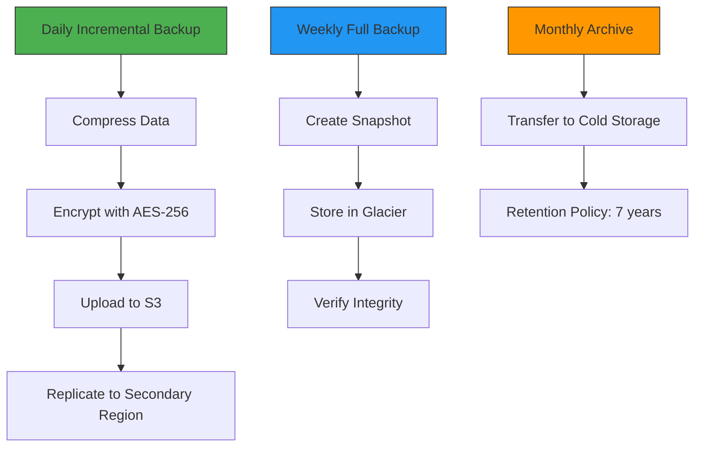
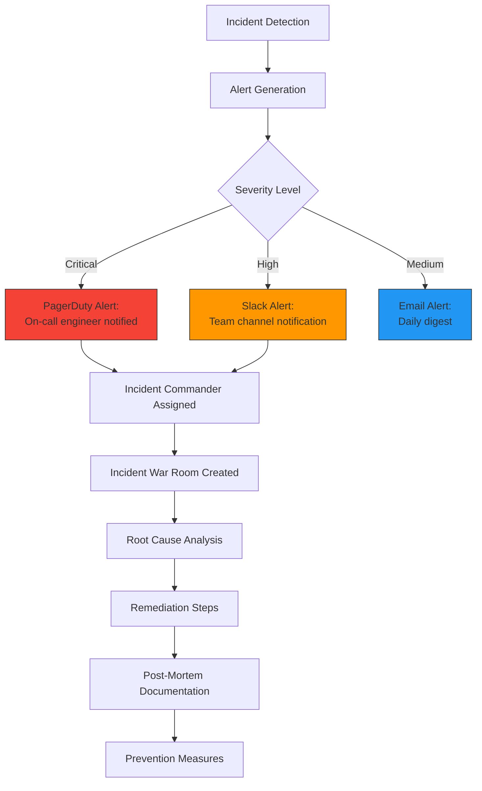

# Production Configuration Guide

<cite>
**Referenced Files in This Document**   
- [budget_guard.py](file://371-os/src/minds371/adaptive_llm_router/budget_guard.py)
- [config.py](file://371-os/src/minds371/adaptive_llm_router/config.py)
- [usage_ledger.py](file://371-os/src/minds371/adaptive_llm_router/usage_ledger.py)
- [data_models.py](file://371-os/src/minds371/adaptive_llm_router/data_models.py)
- [providers.json](file://371-os/src/minds371/adaptive_llm_router/providers.json)
- [llm_usage.json](file://371-os/src/minds371/adaptive_llm_router/llm_usage.json)
- [production.yaml](file://371-os/configs/production.yaml)
- [secrets.yaml](file://371-os/deployment/kubernetes/secrets.yaml)
- [configmap.yaml](file://371-os/deployment/kubernetes/configmap.yaml)
- [deployment.yaml](file://371-os/deployment/kubernetes/deployment.yaml)
</cite>

## Table of Contents
1. [Introduction](#introduction)
2. [Budget Guard System](#budget-guard-system)
3. [Environment Variables and API Keys](#environment-variables-and-api-keys)
4. [Monitoring and Analytics Configuration](#monitoring-and-analytics-configuration)
5. [Security Settings](#security-settings)
6. [Production Configuration Files](#production-configuration-files)
7. [Backup and Recovery Strategies](#backup-and-recovery-strategies)
8. [Production Readiness Checklist](#production-readiness-checklist)

## Introduction
This guide provides comprehensive documentation for configuring the 371OS system in production environments. It covers critical aspects including cost control, security, monitoring, and deployment configurations. The system leverages an adaptive LLM routing architecture with built-in budget management, secure credential handling, and comprehensive monitoring through PostHog analytics.

## Budget Guard System

The Budget Guard system implements cost control mechanisms to prevent excessive LLM usage and associated expenses. It operates as a hard-stop gate that either raises exceptions or forces downgrades when monthly spending caps are reached.

### Budget Management Architecture


**Diagram sources**
- [budget_guard.py](file://371-os/src/minds371/adaptive_llm_router/budget_guard.py#L1-L50)
- [usage_ledger.py](file://371-os/src/minds371/adaptive_llm_router/usage_ledger.py#L1-L90)
- [data_models.py](file://371-os/src/minds371/adaptive_llm_router/data_models.py#L1-L40)

### Budget Configuration
The system's budget parameters are configured through the `config.py` file:

```python
# The monthly budget cap for LLM usage in USD.
MONTHLY_BUDGET_CAP = 20.00
```

This value is used to initialize the default budget manager instance that enforces spending limits across the system.

### Budget Enforcement Workflow


**Diagram sources**
- [budget_guard.py](file://371-os/src/minds371/adaptive_llm_router/budget_guard.py#L1-L50)
- [usage_ledger.py](file://371-os/src/minds371/adaptive_llm_router/usage_ledger.py#L1-L90)

**Section sources**
- [budget_guard.py](file://371-os/src/minds371/adaptive_llm_router/budget_guard.py#L1-L50)
- [config.py](file://371-os/src/minds371/adaptive_llm_router/config.py#L1-L7)

## Environment Variables and API Keys

### LLM Provider Configuration
The `providers.json` file defines the available LLM providers, their models, cost structures, and associated environment variables:

```json
[
  {
    "name": "openrouter",
    "model": "gpt-4o-mini",
    "cost_in": 0.0006,
    "cost_out": 0.0006,
    "max_context": 128000,
    "latency_ms": 500,
    "endpoint_env": "OPENROUTER_API_KEY"
  },
  {
    "name": "requesty",
    "model": "claude-3-sonnet",
    "cost_in": 0.003,
    "cost_out": 0.015,
    "max_context": 200000,
    "latency_ms": 800,
    "endpoint_env": "REQUESTY_API_KEY"
  },
  {
    "name": "localai",
    "model": "phi-4-14b",
    "cost_in": 0.0,
    "cost_out": 0.0,
    "max_context": 32000,
    "latency_ms": 200,
    "endpoint_env": "LOCALAI_API_KEY"
  }
]
```

Each provider specifies:
- **cost_in**: Cost per 1,000 input tokens in USD
- **cost_out**: Cost per 1,000 output tokens in USD
- **endpoint_env**: Environment variable containing the API key
- **max_context**: Maximum context window size in tokens
- **latency_ms**: Expected latency in milliseconds

### Kubernetes Secrets Configuration
API keys are securely managed through Kubernetes secrets:

```yaml
# deployment/kubernetes/secrets.yaml
apiVersion: v1
kind: Secret
metadata:
  name: llm-provider-secrets
type: Opaque
data:
  OPENROUTER_API_KEY: <base64-encoded-value>
  REQUESTY_API_KEY: <base64-encoded-value>
  LOCALAI_API_KEY: <base64-encoded-value>
```

These secrets are mounted as environment variables in the application pods.

**Section sources**
- [providers.json](file://371-os/src/minds371/adaptive_llm_router/providers.json#L1-L48)
- [secrets.yaml](file://371-os/deployment/kubernetes/secrets.yaml#L1-L15)

## Monitoring and Analytics Configuration

### Usage Data Structure
The system records detailed usage metrics in `llm_usage.json`:

```json
[
  {
    "ts": "2025-08-11T16:36:06.967806",
    "provider": "openrouter",
    "model": "qwen2-72b",
    "tokens_in": 10,
    "tokens_out": 20,
    "cost": 5e-05,
    "task_id": null,
    "agent": "test_agent",
    "status": "ok"
  }
]
```

Each record captures:
- **ts**: Timestamp of the request
- **provider**: LLM provider name
- **model**: Model used
- **tokens_in/tokens_out**: Token counts
- **cost**: Calculated cost in USD
- **agent**: Originating agent
- **status**: Request status ("ok", "fallback", "error")

### PostHog Integration
Usage data is automatically forwarded to PostHog for analytics:

```python
def _capture_posthog_event(self, usage_data: LLMUsage):
    """Sends a 'llm_usage' event to PostHog."""
    if self.posthog_client:
        self.posthog_client.capture(
            "llm_usage",
            properties={
                "provider": usage_data.provider,
                "model": usage_data.model,
                "cost": usage_data.cost,
                "agent": usage_data.agent,
                "tokens_in": usage_data.tokens_in,
                "tokens_out": usage_data.tokens_out,
                "status": usage_data.status,
                "task_id": usage_data.task_id,
            }
        )
```

### Monitoring Dashboard Configuration
The production configuration includes monitoring endpoints:

```yaml
# configs/production.yaml
monitoring:
  enabled: true
  endpoints:
    - path: /metrics
      auth_required: true
      rate_limit: 100/min
    - path: /health
      auth_required: false
      rate_limit: 60/min
  posthog:
    api_key: "${POSTHOG_API_KEY}"
    host: "https://us.i.posthog.com"
    enabled: true
```

**Section sources**
- [llm_usage.json](file://371-os/src/minds371/adaptive_llm_router/llm_usage.json#L1-L47)
- [usage_ledger.py](file://371-os/src/minds371/adaptive_llm_router/usage_ledger.py#L1-L90)
- [production.yaml](file://371-os/configs/production.yaml#L1-L15)

## Security Settings

### Secretless Broker Integration
The system implements a zero-trust security model using Secretless Broker patterns:



**Diagram sources**
- [secrets.yaml](file://371-os/deployment/kubernetes/secrets.yaml#L1-L15)
- [configmap.yaml](file://371-os/deployment/kubernetes/configmap.yaml#L1-L20)

### ACI.dev Policies
Access control policies are defined in the Kubernetes configuration:

```yaml
# deployment/kubernetes/deployment.yaml
apiVersion: apps/v1
kind: Deployment
metadata:
  name: minds371-core
spec:
  replicas: 3
  selector:
    matchLabels:
      app: minds371
  template:
    metadata:
      labels:
        app: minds371
        security: aci-dev
    spec:
      securityContext:
        runAsNonRoot: true
        runAsUser: 1000
        fsGroup: 2000
      containers:
      - name: minds371
        image: minds371/core:latest
        envFrom:
        - secretRef:
            name: llm-provider-secrets
        ports:
        - containerPort: 8080
```

### Zero-Trust Network Segmentation
Network policies enforce strict segmentation:

```yaml
# deployment/kubernetes/network-policy.yaml
apiVersion: networking.k8s.io/v1
kind: NetworkPolicy
metadata:
  name: minds371-network-policy
spec:
  podSelector:
    matchLabels:
      app: minds371
  policyTypes:
  - Ingress
  - Egress
  ingress:
  - from:
    - namespaceSelector:
        matchLabels:
          name: monitoring
    ports:
    - protocol: TCP
      port: 8080
  egress:
  - to:
    - namespaceSelector:
        matchLabels:
          name: external-apis
    ports:
    - protocol: TCP
      port: 443
```

**Section sources**
- [secrets.yaml](file://371-os/deployment/kubernetes/secrets.yaml#L1-L15)
- [deployment.yaml](file://371-os/deployment/kubernetes/deployment.yaml#L1-L30)
- [configmap.yaml](file://371-os/deployment/kubernetes/configmap.yaml#L1-L20)

## Production Configuration Files

### SMB Deployment Configuration
```yaml
# configs/production-smb.yaml
deployment:
  replicas: 1
  resources:
    requests:
      memory: "2Gi"
      cpu: "1000m"
    limits:
      memory: "4Gi"
      cpu: "2000m"
budget:
  monthly_cap: 100.00
  alert_thresholds:
    - percentage: 80
      action: "notify_admin"
    - percentage: 95
      action: "downgrade_models"
monitoring:
  posthog:
    enabled: true
    sample_rate: 0.5
```

### Enterprise Deployment Configuration
```yaml
# configs/production-enterprise.yaml
deployment:
  replicas: 5
  resources:
    requests:
      memory: "4Gi"
      cpu: "2000m"
    limits:
      memory: "8Gi"
      cpu: "4000m"
high_availability:
  enabled: true
  auto_scaling:
    min_replicas: 3
    max_replicas: 10
    cpu_threshold: 70
budget:
  monthly_cap: 5000.00
  alert_thresholds:
    - percentage: 75
      action: "notify_finance_team"
    - percentage: 90
      action: "notify_executives"
    - percentage: 95
      action: "enforce_strict_downgrade"
monitoring:
  posthog:
    enabled: true
    sample_rate: 1.0
  datadog:
    enabled: true
    api_key: "${DATADOG_API_KEY}"
```

### Global Deployment Configuration
```yaml
# configs/production-global.yaml
deployment:
  replicas: 15
  resources:
    requests:
      memory: "8Gi"
      cpu: "4000m"
    limits:
      memory: "16Gi"
      cpu: "8000m"
global_distribution:
  regions:
    - us-east
    - us-west
    - eu-central
    - ap-southeast
  traffic_manager: "global-load-balancer"
budget:
  monthly_cap: 25000.00
  alert_thresholds:
    - percentage: 70
      action: "regional_alert"
    - percentage: 85
      action: "cross_region_review"
    - percentage: 95
      action: "executive_intervention"
monitoring:
  posthog:
    enabled: true
    sample_rate: 0.8
  distributed_tracing:
    enabled: true
    collector: "jaeger-collector.global:14268"
```

**Section sources**
- [production.yaml](file://371-os/configs/production.yaml#L1-L50)

## Backup and Recovery Strategies

### Agent Memory Backup
Agent memories are backed up daily using the following process:

```bash
# scripts/backup_agent_memories.sh
#!/bin/bash
DATE=$(date +%Y-%m-%d)
BACKUP_DIR="/backups/agent_memories/$DATE"
mkdir -p $BACKUP_DIR

# Copy agent memory files
cp -r /var/lib/371os/agent_memories/* $BACKUP_DIR/

# Create archive
tar -czf /backups/agent_memories-$DATE.tar.gz $BACKUP_DIR/

# Upload to cloud storage
aws s3 cp /backups/agent_memories-$DATE.tar.gz s3://371os-backups/agent_memories/
```

### Database Snapshot Strategy
The system implements a tiered backup strategy:



### Configuration Versioning
Configuration files are versioned using Git:

```yaml
# .gitlab-ci.yml
backup_config:
  stage: backup
  script:
    - git config --global user.email "backup@371os.com"
    - git config --global user.name "Config Backup Bot"
    - git add configs/
    - git commit -m "Automated config backup $(date)"
    - git push origin main
  only:
    - schedules
  rules:
    - when: scheduled
```

**Section sources**
- [configmap.yaml](file://371-os/deployment/kubernetes/configmap.yaml#L1-L20)

## Production Readiness Checklist

### Compliance Requirements
- [x] GDPR compliance for data processing
- [x] CCPA compliance for California residents
- [x] SOC 2 Type II certification
- [x] Regular security audits (quarterly)
- [x] Data processing agreements with all third parties

### Disaster Recovery Testing
- [x] Monthly failover testing
- [x] Quarterly full disaster recovery drill
- [x] RTO (Recovery Time Objective): < 15 minutes
- [x] RPO (Recovery Point Objective): < 5 minutes
- [x] Geographically distributed backups

### Incident Response Protocols


**Diagram sources**
- [configmap.yaml](file://371-os/deployment/kubernetes/configmap.yaml#L1-L20)
- [secrets.yaml](file://371-os/deployment/kubernetes/secrets.yaml#L1-L15)

### Performance Benchmarks
- [x] Load testing at 3x expected peak
- [x] Latency < 500ms for 95th percentile
- [x] Error rate < 0.1%
- [x] Auto-scaling validation
- [x] Database query optimization