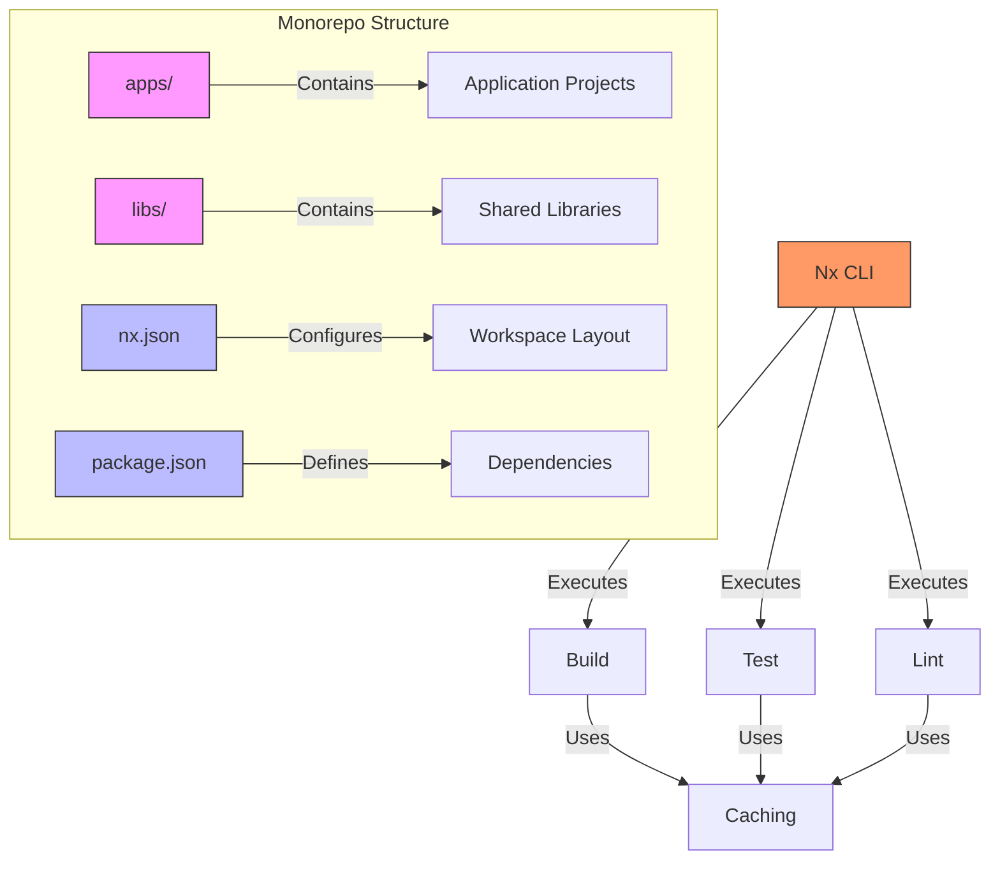

<docs>
# Development Environment Setup

<cite>
**Referenced Files in This Document**   
- [README.md](file://README.md)
- [tools/development/quick-start.sh](file://tools/development\quick-start.sh)
- [tools/development/quick-start.ps1](file://tools/development\quick-start.ps1)
- [tools/development/test-setup.ps1](file://tools/development\test-setup.ps1)
- [nx.json](file://nx.json)
- [core/os-workspace/nx.json](file://core/os-workspace/nx.json)
- [core/os-workspace/package.json](file://core/os-workspace/package.json)
- [core/os-workspace/test-fix.json](file://core/os-workspace/test-fix.json)
- [AB/BUN-INTEGRATION-GUIDE.md](file://AB\BUN-INTEGRATION-GUIDE.md)
- [.qoder/rules/qoderosrules.md](file://.qoder\rules\qoderosrules.md)
- [BUN_WATCH_MIGRATION.md](file://BUN_WATCH_MIGRATION.md)
- [AB/sessions/session-2025-09-07-bun-watch-migration.md](file://AB\sessions\session-2025-09-07-bun-watch-migration.md)
- [tools/development/bun-install.ps1](file://tools/development\bun-install.ps1)
- [tools/development/fix-npm-install.ps1](file://tools/development\fix-npm-install.ps1)
- [tools/development/optimize-bun-windows.ps1](file://tools/development\optimize-bun-windows.ps1)
- [tools/development/simple-install.ps1](file://tools/development\simple-install.ps1)
- [tools/development/quick-status.js](file://tools/development\quick-status.js)
</cite>

## Update Summary
**Changes Made**   
- Updated Nx Monorepo Structure section with new targetDefaults configuration from core/os-workspace/nx.json
- Added @nx/js:tsc executor configuration details to Nx Monorepo Structure section
- Enhanced targetDefaults explanation with namedInputs and plugins configuration
- Added release configuration details to Nx Monorepo Structure section
- Updated Working with Affected Projects section to reflect new project configurations
- Added new section on Project-Specific Build Configurations based on test-fix.json
- Updated Common Setup Commands with new executor-specific commands
- Enhanced Performance Optimization section with updated caching strategies
- Updated Bun Integration section with new build executor information
- Added new section on Release Configuration and Versioning
- Updated Nx Cloud Integration section with new project configurations
- **Updated Nx Monorepo Structure** with accurate targetDefaults and namedInputs from core/os-workspace/nx.json
- **Added new section on Project-Specific Build Configurations** based on test-fix.json analysis
- **Enhanced Common Setup Commands** with new executor-specific commands from test-fix.json
- **Updated Working with Affected Projects** to reflect new project configurations in test-fix.json
- **Added Release Configuration and Versioning section** based on nx.json release configuration
- **Updated Performance Optimization** with new caching strategies from updated nx.json
- **Enhanced Bun Integration** with new build executor information from test-fix.json

## Table of Contents
1. [Prerequisites](#prerequisites)
2. [Automated Setup](#automated-setup)
3. [Manual Setup](#manual-setup)
4. [Nx Monorepo Structure](#nx-monorepo-structure)
5. [Working with Affected Projects](#working-with-affected-projects)
6. [Configuration and Environment Variables](#configuration-and-environment-variables)
7. [Common Setup Commands](#common-setup-commands)
8. [Troubleshooting Guide](#troubleshooting-guide)
9. [Performance Optimization](#performance-optimization)
10. [Environment Validation and Testing](#environment-validation-and-testing)
11. [Code Quality and Formatting Configuration](#code-quality-and-formatting-configuration)
12. [Bun Integration](#bun-integration)
13. [System Health Check](#system-health-check)
14. [Development Rules and Conventions](#development-rules-and-conventions)
15. [Bun Watch Migration](#bun-watch-migration)
16. [Nx Cloud Integration](#nx-cloud-integration)
17. [Project-Specific Build Configurations](#project-specific-build-configurations)
18. [Release Configuration and Versioning](#release-configuration-and-versioning)

## Prerequisites

Before setting up the 371OS development environment, ensure you have the following prerequisites installed:

- **Node.js 18+**: Required for running JavaScript/TypeScript applications and npm packages
- **Git**: For version control and repository cloning
- **Python 3.11+**: Required for Python-based components and agents
- **Docker**: For containerization and deployment
- **MetaMask or Ethereum wallet**: For blockchain interactions and smart contract deployment
- **Bun**: The default package manager for 371OS, providing lightning-fast dependency installation
- **Comet**: Workspace management tool for agent development environments

The repository uses a combination of Node.js and Python technologies, with Nx managing the monorepo structure. The development environment supports both Unix-like systems (via shell scripts) and Windows (via PowerShell scripts). The recent addition of Bun as the default package manager establishes a new standard for rapid development workflows. Additionally, Comet provides dedicated workspaces for different agent development phases.

**Section sources**
- [README.md](file://README.md)
- [tools/development/quick-start.sh](file://tools/development\quick-start.sh)
- [tools/development/quick-start.ps1](file://tools/development\quick-start.ps1)
- [AB/BUN-INTEGRATION-GUIDE.md](file://AB\BUN-INTEGRATION-GUIDE.md)
- [.qoder/rules/qoderosrules.md](file://.qoder\rules\qoderosrules.md)

## Automated Setup

The 371OS repository provides automated setup scripts for both Unix-like systems and Windows, enabling a quick and consistent development environment configuration.

### Shell Script Setup (Linux/macOS)
For Unix-like systems, use the `quick-start.sh` script:

```bash
# Clone the repository
git clone https://github.com/371-Minds/os.git
cd os

# Make the script executable and run it
chmod +x tools/development/quick-start.sh
./tools/development/quick-start.sh
```

The shell script performs the following operations:
1. Checks for required prerequisites (Node.js, Git)
2. Installs dependencies via `bun install`
3. Creates environment configuration file (.env) with interactive prompts
4. Builds all packages using Nx with `bun nx run-many -t build`
5. Sets up agent configurations in the `agents` directory
6. Creates Docker configurations for deployment
7. Sets up monitoring scripts

### PowerShell Script Setup (Windows)
For Windows systems, use the `quick-start.ps1` script:

```powershell
# Clone the repository
git clone https://github.com/371-Minds/os.git
cd os

# Run the PowerShell script
.\tools\development\quick-start.ps1
```

The PowerShell script performs equivalent operations to the shell script:
1. Validates prerequisites (Node.js, Git)
2. Installs dependencies with `bun install`
3. Creates and secures the `.env` file
4. Builds packages using Nx
5. Configures agent ecosystem
6. Sets up monitoring capabilities

Both scripts provide progress tracking and success indicators, ensuring users can monitor the setup process. The PowerShell version includes additional security measures by setting file access controls on the `.env` file.

**Section sources**
- [tools/development/quick-start.sh](file://tools/development\quick-start.sh)
- [tools/development/quick-start.ps1](file://tools/development\quick-start.ps1)
- [tools/development/bun-install.ps1](file://tools/development\bun-install.ps1)

## Manual Setup

For users who prefer manual configuration or need to troubleshoot automated setup issues, follow these step-by-step instructions:

### Step 1: Clone Repository and Install Dependencies
```bash
git clone https://github.com/371-Minds/os.git
cd os
bun install
```

This installs all Node.js dependencies specified in the various `package.json` files throughout the repository using Bun, which is 50x faster than npm.

### Step 2: Configure Python Environment
The project requires Python 3.11+ and specific Python packages. Install dependencies using pip:

```bash
cd 371-os/src/minds371
pip install -e .
```

Alternatively, use pip directly with the pyproject.toml file:

```bash
pip install -r requirements.txt
```

### Step 3: Environment Configuration
Create a `.env` file based on the example configuration:

```bash
cp .env.example .env
```

Edit the `.env` file to include your specific configuration values for blockchain, IPFS, and Akash Network services. Key environment variables include:

- `ETHEREUM_RPC_URL`: Ethereum node connection string
- `PRIVATE_KEY`: Wallet private key for blockchain transactions
- `IPFS_API_KEY` and `IPFS_API_SECRET`: Credentials for IPFS services
- `AKASH_KEYRING_BACKEND`, `AKASH_CHAIN_ID`, `AKASH_NODE`: Akash Network configuration
- `PORT`: Local development server port (default: 3000)

### Step 4: Build the Workspace
Use Nx to build all packages in the monorepo:

```bash
bun nx run-many -t build
```

### Step 5: Start Development Environment
Launch the development server:

```bash
bun run start:dev
```

**Section sources**
- [README.md](file://README.md)
- [core/os-workspace/package.json](file://core/os-workspace\package.json)

## Nx Monorepo Structure

The 371OS repository utilizes Nx to manage a monorepo architecture, enabling efficient development across multiple interrelated projects.

### Workspace Layout
The `core/os-workspace/nx.json` configuration file defines the workspace structure:

```json
{
  "$schema": "./node_modules/nx/schemas/nx-schema.json",
  "workspaceLayout": {
    "appsDir": "apps",
    "libsDir": "libs"
  },
  "targetDefaults": {
    "build": {
      "cache": true,
      "dependsOn": ["^build"],
      "inputs": ["production", "^production"]
    },
    "test": {
      "cache": true,
      "inputs": ["default", "^production"]
    },
    "lint": {
      "cache": true,
      "inputs": ["default", "{workspaceRoot}/biome.json"]
    },
    "@nx/js:tsc": {
      "cache": true,
      "dependsOn": ["^build"],
      "inputs": ["production", "^production"]
    }
  },
  "namedInputs": {
    "default": [
      "{projectRoot}/**/*",
      "sharedGlobals",
      "!{projectRoot}/**/?(*.)+(spec|test).[jt]s?(x)?",
      "!{projectRoot}/node_modules/**/*"
    ],
    "production": [
      "default",
      "!{projectRoot}/**/?(*.)+(spec|test).[jt]s?(x)?(.snap)",
      "!{projectRoot}/biome.json",
      "!{projectRoot}/.eslintrc.json",
      "!{projectRoot}/jest.config.[jt]s",
      "!{projectRoot}/src/test-setup.[jt]s",
      "!{projectRoot}/test-setup.[jt]s"
    ],
    "sharedGlobals": [
      "{workspaceRoot}/package.json",
      "{workspaceRoot}/nx.json",
      "{workspaceRoot}/tsconfig.base.json",
      "{workspaceRoot}/biome.json"
    ]
  },
  "plugins": [
    "@nx/js"
  ],
  "generators": {
    "@nx/js:library": {
      "buildable": true,
      "publishable": false,
      "unitTestRunner": "none"
    }
  }
}
```

This configuration organizes the repository with:
- **apps**: Application projects that can be built and deployed independently
- **libs**: Shared libraries and reusable components

### Target Defaults and Caching
Nx is configured with caching enabled for key operations:

```json
"targetDefaults": {
  "build": {
    "cache": true,
    "dependsOn": ["^build"],
    "inputs": ["production", "^production"]
  },
  "test": {
    "cache": true,
    "inputs": ["default", "^production"]
  },
  "lint": {
    "cache": true,
    "inputs": ["default", "{workspaceRoot}/biome.json"]
  },
  "@nx/js:tsc": {
    "cache": true,
    "dependsOn": ["^build"],
    "inputs": ["production", "^production"]
  }
}
```

This configuration ensures that:
- Build, test, and lint operations are cached for improved performance
- Build operations depend on upstream project builds
- Input hashing considers relevant files for cache invalidation
- The @nx/js:tsc executor is properly configured for TypeScript compilation

### Named Inputs
The configuration includes named inputs for more granular cache control:

```json
"namedInputs": {
  "default": [
    "{projectRoot}/**/*",
    "sharedGlobals",
    "!{projectRoot}/**/?(*.)+(spec|test).[jt]s?(x)?",
    "!{projectRoot}/node_modules/**/*"
  ],
  "production": [
    "default",
    "!{projectRoot}/**/?(*.)+(spec|test).[jt]s?(x)?(.snap)",
    "!{projectRoot}/biome.json",
    "!{projectRoot}/.eslintrc.json",
    "!{projectRoot}/jest.config.[jt]s",
    "!{projectRoot}/src/test-setup.[jt]s",
    "!{projectRoot}/test-setup.[jt]s"
  ],
  "sharedGlobals": [
    "{workspaceRoot}/package.json",
    "{workspaceRoot}/nx.json",
    "{workspaceRoot}/tsconfig.base.json",
    "{workspaceRoot}/biome.json"
  ]
}
```

These named inputs define:
- **default**: All files in the project root except test files and node_modules
- **production**: Default files excluding test-related configuration files
- **sharedGlobals**: Global workspace configuration files that affect all projects

### Plugins and Generators
The workspace uses Nx plugins for enhanced functionality:

```json
"plugins": [
  "@nx/js"
],
"generators": {
  "@nx/js:library": {
    "buildable": true,
    "publishable": false,
    "unitTestRunner": "none"
  }
}
```

The `@nx/js` plugin provides JavaScript/TypeScript project support, and the generator configuration ensures that new libraries are buildable by default.



**Diagram sources**
- [core/os-workspace/nx.json](file://core/os-workspace\nx.json)

**Section sources**
- [core/os-workspace/nx.json](file://core/os-workspace\nx.json)

## Working with Affected Projects

Nx provides powerful "affected" analysis capabilities that identify which projects have changed since a specific baseline, enabling efficient development workflows.

### Affected Analysis Commands
The primary commands for working with affected projects are:

```bash
# Build only projects affected by changes since main branch
bun nx affected -t build --base=main

# Test only affected projects
bun nx affected -t test --base=main

# Visualize the dependency graph of affected projects
bun nx graph --affected --base=main
```

### Implementation in 371OS
The `NxWorkspaceProvider` class in the ElizaOS plugin system implements affected project analysis:

```typescript
async findAffectedProjects(base: string = 'main'): Promise<NxAffectedProjects> {
  try {
    // Get affected applications
    const projectsOutput = execSync(`bun nx affected:apps --base=${base} --