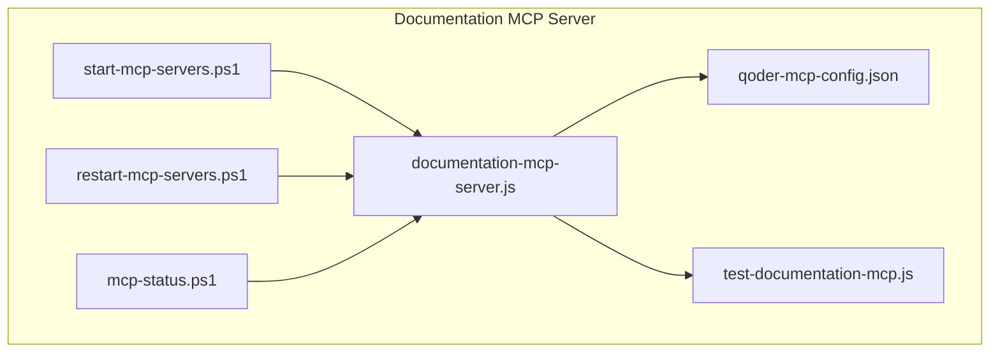
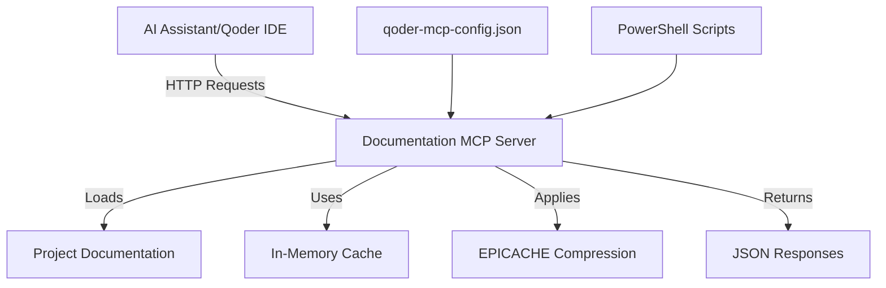
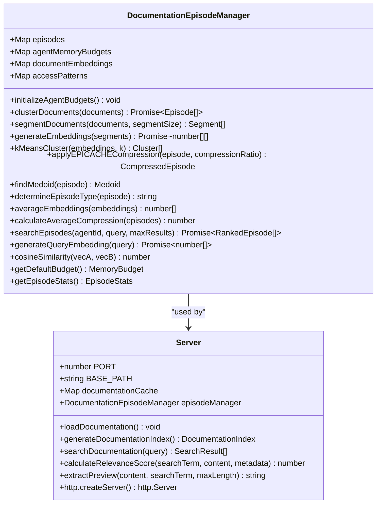
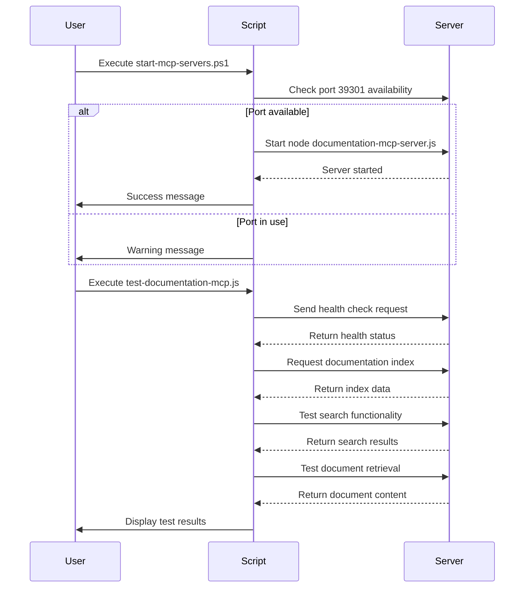

<docs>
# Documentation MCP Server

<cite>
**Referenced Files in This Document**   
- [documentation-mcp-server.js](file://core/mcp/documentation-mcp-server.js)
- [README.md](file://core/mcp/README.md)
- [test-documentation-mcp.js](file://core/mcp/test-documentation-mcp.js)
- [qoder-mcp-config.json](file://core/mcp/qoder-mcp-config.json)
- [INTEGRATION_SUMMARY.md](file://core/mcp/INTEGRATION_SUMMARY.md)
- [start-mcp-servers.ps1](file://core/mcp/start-mcp-servers.ps1)
- [restart-mcp-servers.ps1](file://core/mcp/restart-mcp-servers.ps1)
- [simple-restart-mcp.ps1](file://core/mcp/simple-restart-mcp.ps1)
- [mcp-status.ps1](file://core/mcp/mcp-status.ps1)
- [DOCUMENTATION_STRUCTURE](file://core/mcp/documentation-mcp-server.js#L307-L383)
- [DocumentationEpisodeManager](file://core/mcp/documentation-mcp-server.js#L19-L304)
</cite>

## Table of Contents
1. [Introduction](#introduction)
2. [Project Structure](#project-structure)
3. [Core Components](#core-components)
4. [Architecture Overview](#architecture-overview)
5. [Detailed Component Analysis](#detailed-component-analysis)
6. [Dependency Analysis](#dependency-analysis)
7. [Performance Considerations](#performance-considerations)
8. [Troubleshooting Guide](#troubleshooting-guide)
9. [Conclusion](#conclusion)

## Introduction
The Documentation MCP Server is a critical component of the 371 OS ecosystem, providing AI assistants with structured access to project documentation through the Model Context Protocol (MCP). This server enables intelligent search, document retrieval, and metadata access across the entire project repository. It serves as a knowledge base for AI assistants like Qoder, allowing them to understand project context, architecture, and implementation details. The server runs on port 39301 and provides RESTful endpoints for health checks, documentation indexing, search functionality, and document retrieval. Integrated with EPICACHE technology, it offers advanced memory management and compression capabilities for efficient document clustering and retrieval.

## Project Structure
The Documentation MCP Server is located in the `core/mcp` directory of the 371 OS repository. This directory contains all necessary components for the server's operation, including the main server implementation, configuration files, testing scripts, and management utilities. The server is designed to work alongside other MCP servers in the ecosystem, particularly the Cognition Layer MCP Server. The project structure follows a modular approach with clear separation between server logic, configuration, testing, and operations management.



**Diagram sources**
- [documentation-mcp-server.js](file://core/mcp/documentation-mcp-server.js)
- [qoder-mcp-config.json](file://core/mcp/qoder-mcp-config.json)
- [test-documentation-mcp.js](file://core/mcp/test-documentation-mcp.js)
- [start-mcp-servers.ps1](file://core/mcp/start-mcp-servers.ps1)
- [restart-mcp-servers.ps1](file://core/mcp/restart-mcp-servers.ps1)
- [mcp-status.ps1](file://core/mcp/mcp-status.ps1)

**Section sources**
- [documentation-mcp-server.js](file://core/mcp/documentation-mcp-server.js)
- [README.md](file://core/mcp/README.md)

## Core Components
The Documentation MCP Server consists of several core components that work together to provide comprehensive documentation access. The main server implementation in `documentation-mcp-server.js` handles HTTP requests and serves documentation content. The `DocumentationEpisodeManager` class implements EPICACHE technology for episodic memory management and document clustering. The `DOCUMENTATION_STRUCTURE` configuration defines the documentation hierarchy and metadata. Supporting scripts enable testing, startup, and status monitoring of the server. The server integrates with the broader MCP ecosystem through configuration in `qoder-mcp-config.json`, allowing AI assistants to discover and connect to its services.

**Section sources**
- [documentation-mcp-server.js](file://core/mcp/documentation-mcp-server.js#L19-L304)
- [DOCUMENTATION_STRUCTURE](file://core/mcp/documentation-mcp-server.js#L307-L383)
- [qoder-mcp-config.json](file://core/mcp/qoder-mcp-config.json)

## Architecture Overview
The Documentation MCP Server follows a client-server architecture with RESTful API endpoints. It operates on port 39301 and provides access to project documentation through standardized MCP endpoints. The server loads documentation into memory at startup, creating an in-memory cache for fast access. When a request is received, the server processes it according to the endpoint and returns the appropriate response. The architecture includes EPICACHE integration for document clustering and compression, improving memory efficiency and retrieval performance. The server is designed to work alongside other MCP servers, with configuration managed through JSON files and operations controlled by PowerShell scripts.



**Diagram sources**
- [documentation-mcp-server.js](file://core/mcp/documentation-mcp-server.js)
- [qoder-mcp-config.json](file://core/mcp/qoder-mcp-config.json)
- [start-mcp-servers.ps1](file://core/mcp/start-mcp-servers.ps1)

## Detailed Component Analysis

### Documentation Server Implementation
The `documentation-mcp-server.js` file contains the complete implementation of the Documentation MCP Server. It creates an HTTP server that listens on port 39301 and handles requests to various endpoints. The server loads documentation from the project directory into memory at startup, creating a cache for fast access. It provides endpoints for health checks, documentation indexing, search functionality, and document retrieval. The implementation uses Node.js's built-in HTTP module for server functionality and the file system module for reading documentation files.

#### For Object-Oriented Components:


**Diagram sources**
- [documentation-mcp-server.js](file://core/mcp/documentation-mcp-server.js#L19-L304)

**Section sources**
- [documentation-mcp-server.js](file://core/mcp/documentation-mcp-server.js)

### Configuration and Management
The Documentation MCP Server is configured and managed through several supporting files. The `qoder-mcp-config.json` file contains the configuration for integrating the server with Qoder IDE and other AI assistants. Various PowerShell scripts provide management functionality, including starting, stopping, restarting, and checking the status of the server. These scripts ensure reliable operation and simplify server management for developers.

#### For API/Service Components:


**Diagram sources**
- [start-mcp-servers.ps1](file://core/mcp/start-mcp-servers.ps1)
- [test-documentation-mcp.js](file://core/mcp/test-documentation-mcp.js)

**Section sources**
- [start-mcp-servers.ps1](file://core/mcp/start-mcp-servers.ps1)
- [test-documentation-mcp.js](file://core/mcp/test-documentation-mcp.js)
- [qoder-mcp-config.json](file://core/mcp/qoder-mcp-config.json)

## Dependency Analysis
The Documentation MCP Server has minimal external dependencies, relying primarily on Node.js built-in modules such as `http`, `url`, `fs`, and `path`. It depends on the project's directory structure and documentation files being present and accessible. The server integrates with other components in the MCP ecosystem, particularly the Cognition Layer MCP Server, through shared configuration in `qoder-mcp-config.json`. Management scripts depend on PowerShell being available on the system. The server has no direct database dependencies, as it loads documentation into memory at startup. There are no circular dependencies within the server implementation.

```mermaid
graph TD
    Server[documentation-mcp-server.js] --> http[Node.js http module]
    Server --> url[Node.js url module]
    Server --> fs[Node.js fs module]
    Server --> path[Node.js path module]
    Server --> Documentation[Project Documentation Files]
    Config[qoder-mcp-config.json] --> Server
    Test[test-documentation-mcp.js] --> Server
    Start[start-mcp-servers.ps1] --> Server
    Restart[restart-mcp-servers.ps1] --> Server
