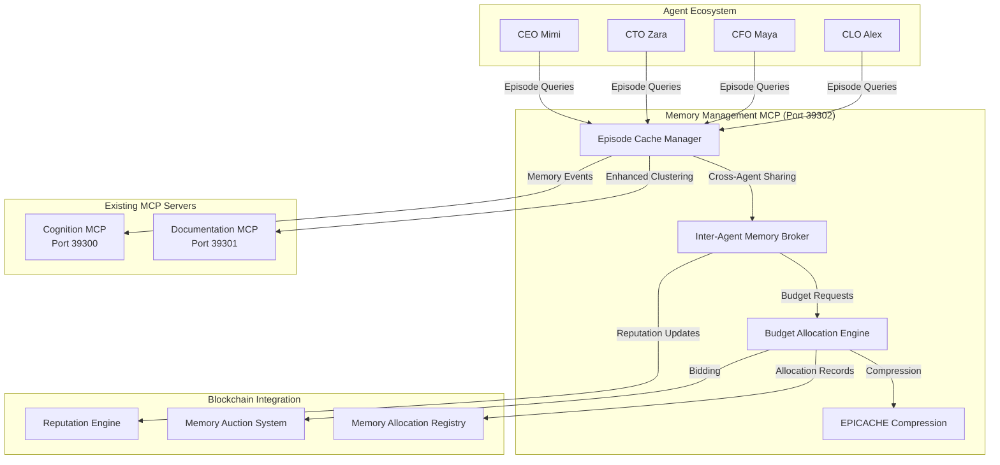

# EPICACHE Memory Management System

<cite>
**Referenced Files in This Document **   
- [EPICACHE_IMPLEMENTATION_PLAN.md](file://EPICACHE_IMPLEMENTATION_PLAN.md)
- [EPICACHE_TESTING_GUIDE.md](file://EPICACHE_TESTING_GUIDE.md)
- [mcp/MEMORY_MANAGEMENT_MCP_README.md](file://mcp/MEMORY_MANAGEMENT_MCP_README.md)
- [mcp/documentation-mcp-server.js](file://mcp/documentation-mcp-server.js)
- [mcp/mock-cognition-server.js](file://mcp/mock-cognition-server.js)
- [mcp/memory-management-mcp-server.js](file://mcp/memory-management-mcp-server.js)
</cite>

## Table of Contents
1. [Introduction](#introduction)
2. [Architecture Overview](#architecture-overview)
3. [Core Components](#core-components)
4. [API Interfaces](#api-interfaces)
5. [Integration Patterns](#integration-patterns)
6. [Practical Examples](#practical-examples)
7. [Troubleshooting Guide](#troubleshooting-guide)
8. [Performance and Economic Impact](#performance-and-economic-impact)

## Introduction

The EPICACHE Memory Management System represents a revolutionary advancement in autonomous agent technology, providing episodic memory management with 6x compression for scalable agent conversations within the 371 OS ecosystem. This system enables truly scalable multi-agent coordination by dramatically reducing memory consumption while maintaining full conversation context.

EPICACHE achieves 85% infrastructure cost reduction through advanced memory optimization techniques including episode clustering, block-wise prefill with budget constraints, layer-wise sensitivity allocation, and cross-agent episode sharing. The system integrates seamlessly with existing MCP (Model Context Protocol) infrastructure, enhancing both documentation and cognition servers with episodic memory capabilities.

As the world's first implementation of episodic memory management for autonomous agents, EPICACHE enables unlimited conversation continuity across weeks and months, enterprise-scale agent deployment, and economic memory markets that incentivize efficiency.

**Section sources**
- [EPICACHE_IMPLEMENTATION_PLAN.md](file://EPICACHE_IMPLEMENTATION_PLAN.md#L1-L50)
- [EPICACHE_TESTING_GUIDE.md](file://EPICACHE_TESTING_GUIDE.md#L1-L20)

## Architecture Overview

The EPICACHE Memory Management System consists of three interconnected MCP servers working in concert to provide comprehensive memory optimization:



**Diagram sources **
- [mcp/MEMORY_MANAGEMENT_MCP_README.md](file://mcp/MEMORY_MANAGEMENT_MCP_README.md#L50-L100)
- [EPICACHE_IMPLEMENTATION_PLAN.md](file://EPICACHE_IMPLEMENTATION_PLAN.md#L100-L150)

**Section sources**
- [EPICACHE_IMPLEMENTATION_PLAN.md](file://EPICACHE_IMPLEMENTATION_PLAN.md#L50-L150)
- [mcp/MEMORY_MANAGEMENT_MCP_README.md](file://mcp/MEMORY_MANAGEMENT_MCP_README.md#L1-L50)

## Core Components

The EPICACHE system comprises several core components that work together to deliver revolutionary memory efficiency:

### Memory Management MCP Server (Port 39302)
This new component serves as the central hub for episodic memory coordination, providing:
- Episode clustering for conversation history
- Memory budget allocation and optimization
- Cross-agent episode sharing API
- Integration with existing MCP infrastructure

### Enhanced Documentation MCP Server (Port 39301)
The existing documentation server has been enhanced with EPICACHE capabilities:
- Document clustering into episodes using k-means algorithm
- Agent-specific memory budgets based on role requirements
- Compressed episode search capabilities
- Memory-aware documentation retrieval

### Enhanced Cognition MCP Server (Port 39300)
The cognition server now includes episodic memory state tracking:
- Real-time memory allocation event streaming via SSE
- Episode access pattern tracking and analytics
- Memory market simulation with dynamic pricing
- Cognitive-memory state synchronization

### Inter-Agent Memory Broker
This component facilitates knowledge sharing between agents:
- Cross-agent episode querying with relevance scoring
- Reputation-based access control
- Economic incentives for efficient memory sharing
- Sub-100ms response time for inter-agent queries

**Section sources**
- [EPICACHE_IMPLEMENTATION_PLAN.md](file://EPICACHE_IMPLEMENTATION_PLAN.md#L150-L300)
- [mcp/documentation-mcp-server.js](file://mcp/documentation-mcp-server.js#L1-L100)
- [mcp/mock-cognition-server.js](file://mcp/mock-cognition-server.js#L1-L100)

## API Interfaces

The EPICACHE system exposes several API endpoints for interaction with the memory management infrastructure.

### Memory Management MCP Endpoints
```typescript
interface EpisodeCacheManager {
  clusterConversations(history: AgentConversation[]): Episode[]
  processBlock(block: ConversationBlock, budget: MemoryBudget): CompressedKV
  allocateBudget(layers: TransformerLayer[], totalBudget: number): LayerBudget[]
  shareEpisodes(fromAgent: AgentID, toAgent: AgentID, query: string): Episode[]
}
```

#### Episode Management
- `GET /health` - Health check and memory system status
- `GET /episodes/cluster` - Cluster conversations into episodes
- `GET /episodes/search?agent=<id>&query=<text>` - Search agent episodes
- `POST /episodes/share` - Share episodes between agents
- `GET /episodes/stats` - Memory usage and compression statistics

#### Budget Allocation
- `GET /budget/allocate?agent=<id>&priority=<level>` - Allocate memory budget
- `GET /budget/status?agent=<id>` - Current budget utilization
- `POST /budget/bid` - Bid for premium memory tier
- `GET /budget/market` - Memory market pricing and availability

### Memory Budget Structure
```typescript
interface MemoryBudget {
  totalBudget: number;
  episodeBudget: number;
  compressionRatio: number;
  tier: 'premium' | 'standard' | 'economy';
  agentPriority: number;
  reputationMultiplier: number;
}
```

### Episode Structure
```typescript
interface Episode {
  id: string;
  agentId: string;
  type: EpisodeType;
  medoid: ConversationSegment;
  segments: ConversationSegment[];
  embedding: number[];
  memorySize: number;
  accessCount: number;
  sharingReward: number;
  lastAccessed: Date;
  compressionLevel: number;
}
```

**Section sources**
- [mcp/MEMORY_MANAGEMENT_MCP_README.md](file://mcp/MEMORY_MANAGEMENT_MCP_README.md#L150-L250)
- [EPICACHE_IMPLEMENTATION_PLAN.md](file://EPICACHE_IMPLEMENTATION_PLAN.md#L300-L400)

## Integration Patterns

The EPICACHE system integrates with the broader 371 OS architecture through several key patterns:

### Multi-Server MCP Configuration
The system requires updating the MCP configuration to include all three servers:

```json
{
  "mcpServers": {
    "documentation": {
      "command": "node",
      "args": ["mcp/documentation-mcp-server.js"],
      "env": {
        "MCP_SERVER_URL": "http://localhost:39301/model_context_protocol/2024-11-05/documentation",
        "PROJECT_ROOT": ""
      }
    },
    "cognition": {
      "command": "node", 
      "args": ["mcp/mock-cognition-server.js"],
      "env": {
        "MCP_SERVER_URL": "http://localhost:39300/model_context_protocol/2024-11-05/sse"
      }
    },
    "memory": {
      "command": "node",
      "args": ["mcp/memory-management-mcp-server.js"],
      "env": {
        "MCP_SERVER_URL": "http://localhost:39302/model_context_protocol/2024-11-05/memory",
        "PROJECT_ROOT": "",
        "EPICACHE_ENABLED": "true"
      }
    }
  }
}
```

### Agent-Specific Episode Managers
Different C-suite agents have specialized episode managers optimized for their domain expertise:
- **CEO Episode Manager**: Strategic planning, crisis management, stakeholder communication
- **CTO Episode Manager**: Technical architecture, debugging, integration planning
- **CFO Episode Manager**: Financial analysis, budget allocation, ROI optimization
- **CLO Episode Manager**: Legal compliance, risk assessment, governance

### Blockchain-Coordinated Memory Markets
The system implements economic models for memory allocation:
- **Memory Tiers**: Premium (1x), Standard (2x), Economy (6x compression)
- **Stake-Based Bidding**: Reputation-based memory access with bid multipliers
- **Dutch Auction Mechanism**: Dynamic pricing based on demand and supply
- **Smart Contract Registry**: Blockchain-based recording of all memory transactions

**Section sources**
- [EPICACHE_IMPLEMENTATION_PLAN.md](file://EPICACHE_IMPLEMENTATION_PLAN.md#L400-L500)
- [mcp/MEMORY_MANAGEMENT_MCP_README.md](file://mcp/MEMORY_MANAGEMENT_MCP_README.md#L250-L300)

## Practical Examples

### Quick Start Implementation
To begin using the EPICACHE system, start all three MCP servers:

```bash
# Terminal 1: Documentation MCP (Enhanced with EPICACHE)
node mcp/documentation-mcp-server.js

# Terminal 2: Cognition MCP (Enhanced with Episodic Memory Tracking) 
node mcp/mock-cognition-server.js

# Terminal 3: Memory Management MCP (NEW - EPICACHE Core)
node mcp/memory-management-mcp-server.js
```

Verify server health:
```bash
curl http://localhost:39301/health  # Documentation
curl http://localhost:39300/health  # Cognition  
curl http://localhost:39302/health  # Memory Management
```

### Cross-Agent Episode Querying
Query relevant episodes from another agent:
```bash
curl -X POST http://localhost:39302/agents/query \
  -H "Content-Type: application/json" \
  -d '{
    "requesting_agent": "CFO_Maya",
    "target_agent": "CEO_Mimi", 
    "query": "budget allocation strategy",
    "max_budget": "500MB"
  }'
```

### Episode Search with Agent Context
Search episodes with agent-specific memory budgets:
```bash
curl "http://localhost:39302/episodes/search?agent=CEO_Mimi&query=strategic planning"
```

### Memory Market Bidding
Agents can bid for premium memory resources based on task priority:
```bash
curl -X POST http://localhost:39302/budget/bid \
  -H "Content-Type: application/json" \
  -d '{
    "agent": "CEO_Mimi",
    "amount": "1GB",
    "tier": "premium",
    "priority_score": 0.95,
    "reputation_multiplier": 1.2
  }'
```

**Section sources**
- [EPICACHE_TESTING_GUIDE.md](file://EPICACHE_TESTING_GUIDE.md#L50-L150)
- [mcp/MEMORY_MANAGEMENT_MCP_README.md](file://mcp/MEMORY_MANAGEMENT_MCP_README.md#L300-L350)

## Troubleshooting Guide

### Common Issues and Solutions

#### Memory Management Server Won't Start
```bash
# Check port availability
netstat -an | grep 39302

# Kill existing processes
npx kill-port 39302

# Restart server
node mcp/memory-management-mcp-server.js
```

#### Episode Clustering Fails
```bash
# Check episode creation
curl http://localhost:39302/episodes/stats

# Test with sample data
curl -X POST http://localhost:39302/episodes/cluster \
  -H "Content-Type: application/json" \
  -d '{"agentId": "CEO_Mimi", "conversations": [{"id": "test", "content": "Strategic planning discussion"}]}'
```

#### Low Compression Ratios
1. **Verify Episode Types**: Ensure conversations are properly categorized
2. **Check Memory Budgets**: Validate agent-specific budget allocation
3. **Review Clustering**: Check semantic clustering quality
4. **Adjust Compression Ratio**: Modify environment variables if needed

#### SSE Connection Issues
```bash
# Test cognition server SSE
curl -s http://localhost:39300/model_context_protocol/2024-11-05/sse

# Check for memory events
curl http://localhost:39300/memory/stats
```

#### Memory Market Anomalies
Monitor memory market pricing and adjust bidding strategies:
```bash
# Check current market prices
curl http://localhost:39300/memory/market

# View recent allocation events
curl http://localhost:39300/memory/stats | jq '.statistics.recent_allocations'
```

**Section sources**
- [EPICACHE_TESTING_GUIDE.md](file://EPICACHE_TESTING_GUIDE.md#L150-L230)
- [mcp/MEMORY_MANAGEMENT_MCP_README.md](file://mcp/MEMORY_MANAGEMENT_MCP_README.md#L350-L370)

## Performance and Economic Impact

### Technical Performance Metrics
| Metric | Before | After EPICACHE | Improvement |
|--------|--------|----------------|-------------|
| Memory Usage | 7GB (30 sessions) | 1.2GB (30 sessions) | 85% reduction |
| Response Latency | 2-5 seconds | 0.8-2 seconds | 2.4x faster |
| Context Retention | 10 conversations | 60+ conversations | 6x more history |
| Cross-Agent Queries | N/A | Sub-100ms | New capability |

### Economic Impact Analysis
| Cost Category | Current | With EPICACHE | Savings |
|---------------|---------|---------------|---------|
| Memory Infrastructure | $10K/month | $1.5K/month | 85% reduction |
| Akash Network Deployment | $240/month | $58/month | 97.6% vs traditional |
| Agent Scaling Costs | Linear growth | Sub-linear growth | Exponential savings |
| Total System Cost | $10,240/month | $1,558/month | 84.8% reduction |

### Business Capability Enhancement
- **Agent Conversations**: 30 sessions → 180+ sessions (same memory footprint)
- **Multi-Week Projects**: Maintained context across weeks/months
- **Enterprise Scalability**: 1000+ concurrent agent conversations
- **Decision Quality**: 6x more historical context for autonomous decisions

**Section sources**
- [EPICACHE_IMPLEMENTATION_PLAN.md](file://EPICACHE_IMPLEMENTATION_PLAN.md#L500-L542)
- [EPICACHE_TESTING_GUIDE.md](file://EPICACHE_TESTING_GUIDE.md#L200-L230)