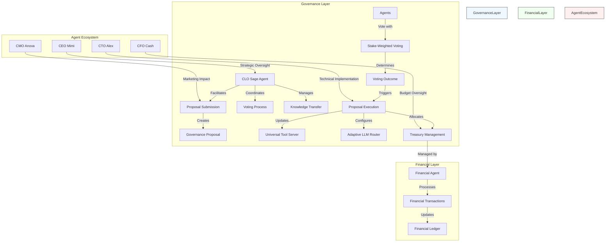
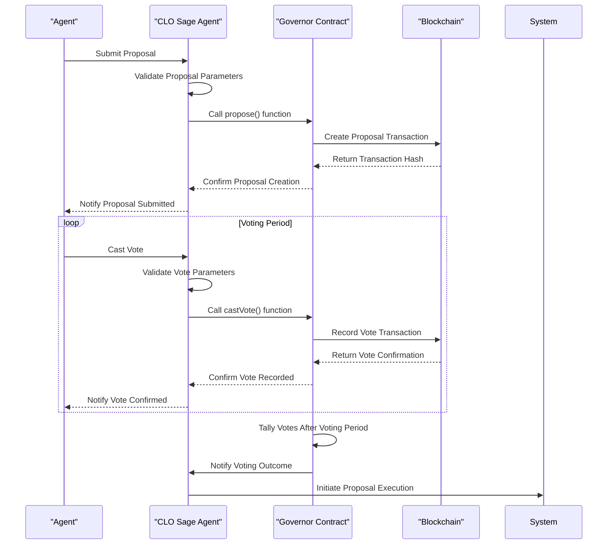
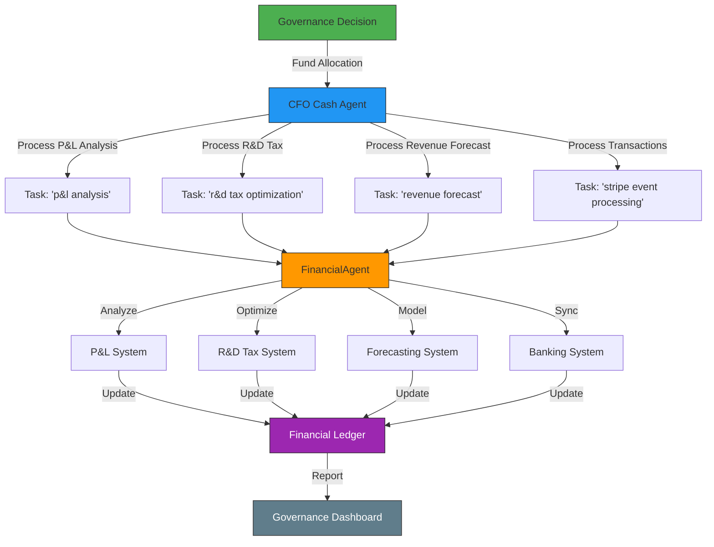

# DAO Governance Model

<cite>
**Referenced Files in This Document**   
- [clo_sage.py](file://371-os/src/minds371/agents/business/clo_sage.py)
- [financial_agent.py](file://371-os/src/minds371/agents/utility/financial_agent.py)
- [financial_system.py](file://371-os/src/minds371/financial_system.py)
- [CLO_Agent_Logic.md](file://371-os/CLO_Agent_Logic.md)
- [CFO_Agent_Logic.md](file://371-os/CFO_Agent_Logic.md)
- [blockchain-registry.ts](file://packages/elizaos-plugins/universal-tool-server/src/blockchain-registry.ts)
- [types.ts](file://packages/elizaos-plugins/universal-tool-server/src/types.ts)
- [cfo_cash.py](file://371-os/src/minds371/agents/business/cfo_cash.py)
- [EVM Developer Guide.md](file://elizaos/Plugins/DeFi Plugins/EVM/Developer Guide.md)
- [371-minds-implementation-addendum.md](file://371-os/src/minds371/371OS_launch/371-minds-implementation-addendum.md)
- [371-OS-Launch-Notebook.md](file://371-os/src/minds371/371OS_launch/371-OS-Launch-Notebook.md)
- [371-minds-next-gen-guide.md](file://371-os/src/minds371/371OS_launch/371-minds-next-gen-guide.md)
</cite>

## Table of Contents
1. [Introduction](#introduction)
2. [Governance Architecture Overview](#governance-architecture-overview)
3. [Core Governance Components](#core-governance-components)
4. [Proposal Submission and Voting Workflow](#proposal-submission-and-voting-workflow)
5. [Treasury Management and Financial Integration](#treasury-management-and-financial-integration)
6. [Governance Parameters and Configuration](#governance-parameters-and-configuration)
7. [Security Considerations and Emergency Protocols](#security-considerations-and-emergency-protocols)
8. [Impact on System Components](#impact-on-system-components)
9. [Examples of Governance Proposals](#examples-of-governance-proposals)
10. [Conclusion](#conclusion)

## Introduction
The DAO Governance Model within the 371 OS ecosystem establishes a decentralized decision-making framework where autonomous agents participate in system-level governance based on their stake-weighted voting power. This model enables collective decision-making for protocol upgrades, resource allocation, and strategic direction. The CLO Agent (Alex) serves as the governance facilitator, coordinating proposal evaluation and knowledge transfer. Governance outcomes directly influence critical system components including the Universal Tool Server and Adaptive LLM Router, creating a self-evolving agent ecosystem. This document details the implementation of governance workflows in clo_sage.py, integration with financial_agent.py for treasury management, and the overall architecture that enables decentralized autonomous organization principles.

## Governance Architecture Overview



**Diagram sources**
- [clo_sage.py](file://371-os/src/minds371/agents/business/clo_sage.py)
- [financial_agent.py](file://371-os/src/minds371/agents/utility/financial_agent.py)
- [371-OS-Launch-Notebook.md](file://371-os/src/minds371/371OS_launch/371-OS-Launch-Notebook.md)

**Section sources**
- [clo_sage.py](file://371-os/src/minds371/agents/business/clo_sage.py)
- [371-minds-next-gen-guide.md](file://371-os/src/minds371/371OS_launch/371-minds-next-gen-guide.md)

## Core Governance Components

### CLO Sage Agent (Governance Facilitator)
The CLO Sage Agent, implemented in clo_sage.py, serves as the central governance facilitator in the DAO ecosystem. It is responsible for processing governance-related tasks, analyzing agent performance, and proposing system optimizations. The agent inherits capabilities from the base agent framework and implements specialized governance functions.

```python
class CloSageAgent(BaseAgent):
    def __init__(self):
        agent_id = "clo_sage_001"
        agent_type = AgentType.CLO
        capabilities = [
            AgentCapability(
                name="assess_agent_performance",
                description="Analyzes performance metrics of other agents."
            ),
            AgentCapability(
                name="identify_patterns",
                description="Identifies successful and failed patterns in agent behavior."
            ),
            AgentCapability(
                name="propose_optimizations",
                description="Proposes optimizations for agent workflows."
            ),
            AgentCapability(
                name="design_knowledge_transfer",
                description="Designs new knowledge transfer loops and protocols."
            )
        ]
        super().__init__(agent_id, agent_type, capabilities)
```

The CLO Sage Agent processes governance tasks through its `process_task` method, which handles various governance-related workflows including performance assessment, pattern identification, and optimization proposals. This agent plays a crucial role in maintaining the health and evolution of the agent ecosystem by continuously learning from system behavior and proposing improvements.

```mermaid
graph TD
subgraph "CLO Sage Agent: Continuous Learning Workflow"
Start((Receive Learning Task)) --> AnalyzeTask{Analyze Agent Performance Data};
AnalyzeTask -- "Assess Agent Performance" --> AnalyzeMetrics[Analyze Performance Metrics (e.g., CTO, CMO)];
AnalyzeMetrics --> IdentifyPatterns[Identify Successful/Failed Patterns];
IdentifyPatterns --> ProposeOptimization[Propose Optimization for Agent Workflow];
ProposeOptimization --> End((Learning Cycle Complete));
AnalyzeTask -- "Knowledge Transfer Loop" --> MonitorInteractions[Monitor Inter-Agent Communication Protocols];
MonitorInteractions --> DesignTransfer[Design New Knowledge Transfer Loops];
DesignTransfer --> End;
end
subgraph "Inherited Capabilities (from improved-base-agent.md)"
style Inherited fill:#f0f0f0,stroke:#ccc
C1[Concurrent Task Processing]
C2[Caching System]
C3[Circuit Breaker Pattern]
C4[Real-time Monitoring & Metrics]
end
```

**Diagram sources**
- [CLO_Agent_Logic.md](file://371-os/CLO_Agent_Logic.md)
- [clo_sage.py](file://371-os/src/minds371/agents/business/clo_sage.py#L14-L52)

**Section sources**
- [clo_sage.py](file://371-os/src/minds371/agents/business/clo_sage.py)
- [CLO_Agent_Logic.md](file://371-os/CLO_Agent_Logic.md)

### Financial Agent (Treasury Management)
The Financial Agent, implemented in financial_agent.py, serves as the core component for treasury management within the DAO governance model. It extends the base FinancialAgent class and provides utility functions for financial operations. This agent is responsible for processing financial tasks, managing transactions, and implementing governance outcomes related to fund allocation.

```python
class FinancialAgent(BaseFinancialAgent):
    """
    A utility agent for financial tasks.
    This agent can be extended with more specialized financial capabilities.
    """
    def __init__(self):
        super().__init__()
```

The Financial Agent integrates with the broader financial system to handle various financial operations including P&L analysis, R&D tax optimization, revenue forecasting, and transaction processing. It works in conjunction with the CFO Cash agent to implement financial decisions resulting from governance outcomes.

**Section sources**
- [financial_agent.py](file://371-os/src/minds371/agents/utility/financial_agent.py)
- [financial_system.py](file://371-os/src/minds371/financial_system.py)

## Proposal Submission and Voting Workflow

### Proposal Submission Process
The proposal submission process in the DAO governance model follows a structured workflow that begins with identifying system improvements or changes. Agents with appropriate capabilities can submit proposals through the governance system. The CLO Sage Agent plays a key role in facilitating this process by analyzing potential optimizations and formalizing them as governance proposals.

Based on the EVM governance implementation, the proposal submission workflow involves:

```typescript
// Propose Action
export const proposeAction: Action = {
  name: 'EVM_GOV_PROPOSE',
  description: 'Create a governance proposal',
  
  handler: async (runtime, message, state, options, callback) => {
    const params = await extractProposalParams(runtime, message, state);
    
    const governorContract = getGovernorContract(params.chain);
    
    const tx = await governorContract.propose(
      params.targets,
      params.values,
      params.calldatas,
      params.description
    );
    
    callback?.({
      text: `Created proposal: ${params.description}`,
      content: { hash: tx.hash }
    });
  }
};
```

This process extracts proposal parameters, interacts with the governor contract on the blockchain, and creates a new governance proposal with specified targets, values, calldatas, and description. The transaction hash is returned as confirmation of proposal creation.

### Voting Mechanism
The voting mechanism in the DAO governance model implements stake-weighted voting, where an agent's voting power is proportional to their stake in the system. This ensures that agents with greater investment in the ecosystem have correspondingly greater influence on governance decisions.

The voting workflow is implemented as follows:

```typescript
// Vote Action
export const voteAction: Action = {
  name: 'EVM_GOV_VOTE',
  description: 'Vote on a governance proposal',
  
  handler: async (runtime, message, state, options, callback) => {
    const params = await extractVoteParams(runtime, message, state);
    
    const voteValue = {
      'for': 1,
      'against': 0,
      'abstain': 2
    }[params.support.toLowerCase()];
    
    const tx = await governorContract.castVote(
      params.proposalId,
      voteValue
    );
    
    callback?.({
      text: `Voted ${params.support} on proposal ${params.proposalId}`,
      content: { hash: tx.hash }
    });
  }
};
```

Agents can vote "for", "against", or "abstain" on proposals. The vote value is mapped to numerical values (1, 0, 2 respectively) and submitted to the governor contract. The system records the vote transaction on the blockchain, ensuring transparency and immutability of the voting process.



**Diagram sources**
- [EVM Developer Guide.md](file://elizaos/Plugins/DeFi Plugins/EVM/Developer Guide.md#L306-L361)
- [clo_sage.py](file://371-os/src/minds371/agents/business/clo_sage.py)

**Section sources**
- [EVM Developer Guide.md](file://elizaos/Plugins/DeFi Plugins/EVM/Developer Guide.md)
- [clo_sage.py](file://371-os/src/minds371/agents/business/clo_sage.py)

## Treasury Management and Financial Integration

### Financial Agent Implementation
The financial_agent.py implementation provides the foundation for treasury management within the DAO governance model. It extends the base FinancialAgent class from the financial_system.py module and serves as a utility agent for financial tasks. The FinancialAgent class in financial_system.py includes capabilities for processing various financial tasks including P&L analysis, R&D tax optimization, billing events, and banking synchronization.

```python
class FinancialAgent:
    """
    A mock FinancialAgent for demonstration purposes.
    """
    def __init__(self):
        self.rd_tax_optimizer = type('RDTaxOptimizer', (), {'analyze_rd_expenses': lambda expenses: {}})()
        self.billing_orchestrator = type('BillingOrchestrator', (), {'process_event': lambda event: {}})()
        self.banking_integration = type('BankingIntegration', (), {'mercury_api': type('MercuryAPI', (), {'get_transactions': lambda: []})()})()

    async def process_task(self, task: Task) -> dict:
        """
        Processes a task based on its description.
        """
        description = task.description.lower()

        if "p&l" in description:
            return {"status": "success", "message": "P&L analysis complete."}
        elif "r&d" in description:
            return {"status": "success", "message": "R&D tax optimization complete."}
        elif "stripe" in description or "creem.io" in description:
            return {"status": "success", "message": "Billing event processed."}
        elif "banking" in description:
            return {"status": "success", "message": "Banking sync complete."}
        else:
            return {"status": "unsupported", "message": "Task not supported."}
```

### CFO Cash Agent Integration
The CFO Cash agent (cfo_cash.py) serves as the primary interface for financial operations within the governance framework. It acts as a wrapper around the FinancialAgent, providing specialized processing for different types of financial tasks based on governance outcomes.

```python
class CfoCashAgent(BaseAgent):
    def __init__(self, financial_agent=None):
        super().__init__(agent_id="cfo_cash_agent", agent_type=AgentType.CFO)
        self.financial_agent = financial_agent or FinancialAgent()

    async def process_task(self, task: Task) -> dict:
        description = task.description.lower()

        if "p&l" in description:
            result = await self.financial_agent.process_task(task)
            return {"status": "success", "message": "P&L analysis complete.", "payload": result.get("payload")}
        elif "r&d" in description:
            result = await self.financial_agent.process_task(task)
            return {"status": "success", "message": "R&D tax optimization complete.", "payload": result.get("payload")}
        elif "forecast" in description:
            result = await self.financial_agent.process_task(task)
            return {"status": "success", "message": "Revenue forecast generated.", "payload": result.get("payload")}
        elif "stripe" in description or "banking" in description:
            result = await self.financial_agent.process_task(task)
            return {"status": "success", "message": "Transaction processed.", "payload": result.get("payload")}
        else:
            return await self.financial_agent.process_task(task)
```

The CFO Cash agent routes financial tasks to the underlying FinancialAgent and provides additional context or processing as needed. This layered architecture allows for separation of concerns between core financial operations and strategic financial management.



**Diagram sources**
- [cfo_cash.py](file://371-os/src/minds371/agents/business/cfo_cash.py)
- [financial_system.py](file://371-os/src/minds371/financial_system.py)

**Section sources**
- [cfo_cash.py](file://371-os/src/minds371/agents/business/cfo_cash.py)
- [financial_system.py](file://371-os/src/minds371/financial_system.py)
- [CFO_Agent_Logic.md](file://371-os/CFO_Agent_Logic.md)

## Governance Parameters and Configuration

### Stake and Voting Parameters
The governance model implements stake-based voting mechanisms where an agent's voting power is determined by their stake in the system. The blockchain-registry.ts file contains logic for calculating stake requirements based on agent capabilities:

```typescript
private calculateStakeRequirement(capabilities: AgentCapability[]): number {
    // Base stake + additional for each high-value capability
    const baseStake = 10; // AKT
    const capabilityStake = capabilities.length * 2; // 2 AKT per capability
    const complexityMultiplier = capabilities.some(cap => 
        cap.name.includes('financial') || cap.name.includes('crypto')
    ) ? 2 : 1;
    
    return baseStake + (capabilityStake * complexityMultiplier);
}
```

This function calculates the required stake based on the agent's capabilities, with higher requirements for agents with financial or crypto-related capabilities. The stake serves as both a voting weight and a security deposit to prevent malicious behavior.

### Time-Based Governance Parameters
The governance system includes time-based parameters that control the duration of various governance processes. The parseTimeWindow function converts human-readable time windows into block-based durations:

```typescript
private parseTimeWindow(timeWindow: string): number {
    const unit = timeWindow.slice(-1);
    const value = parseInt(timeWindow.slice(0, -1));
    
    switch (unit) {
        case 'h': return value * 300; // ~300 blocks per hour
        case 'd': return value * 7200; // ~7200 blocks per day
        case 'w': return value * 50400; // ~50400 blocks per week
        default: return 7200; // Default to 1 day
    }
}
```

These time windows are used to configure voting periods, proposal cooldowns, and execution delays, ensuring that governance processes have appropriate timeframes for community participation and review.

### Governance Proposal Structure
The governance system defines a structured format for proposals through the GovernanceProposal interface in types.ts:

```typescript
export interface GovernanceProposal {
    id: string;
    proposer: string;
    title: string;
    description: string;
    proposalType: 'tool-update' | 'economic-parameter' | 'security-policy' | 'platform-integration';
    parameters: any;
    votingPeriod: VotingPeriod;
    status: 'pending' | 'active' | 'passed' | 'rejected' | 'executed';
}
```

This structure ensures that all proposals contain essential information including type classification, parameters, voting period, and status tracking. The proposal types categorize governance initiatives into tool updates, economic parameter changes, security policy modifications, and platform integrations.

**Section sources**
- [blockchain-registry.ts](file://packages/elizaos-plugins/universal-tool-server/src/blockchain-registry.ts)
- [types.ts](file://packages/elizaos-plugins/universal-tool-server/src/types.ts)

## Security Considerations and Emergency Protocols

### Vote Manipulation Prevention
The DAO governance model incorporates several mechanisms to prevent vote manipulation and ensure the integrity of the decision-making process. The stake-based voting system inherently discourages sybil attacks by requiring significant economic investment to gain voting power. Additionally, the system monitors for unusual voting patterns and can flag suspicious activity for review.

The calculateSuccessRate function in blockchain-registry.ts provides a mechanism for evaluating agent reliability:

```typescript
private calculateSuccessRate(reputationEvents: any[], slashingEvents: any[]): number {
    if (reputationEvents.length === 0) return 1.0;
    
    const negativeEvents = slashingEvents.length;
    const totalEvents = reputationEvents.length + negativeEvents;
    
    return Math.max(0, (totalEvents - negativeEvents) / totalEvents);
}
```

This success rate calculation helps identify potentially malicious agents by tracking their history of negative events (slashing) relative to their total activity.

### Emergency Veto Mechanisms
While the documentation does not explicitly detail emergency veto mechanisms, the governance architecture suggests several potential approaches for handling critical situations:

1. **Multi-Signature Oversight**: Critical proposals may require approval from multiple high-stake agents (e.g., CEO, CTO, CFO) before execution.

2. **Time-Locked Execution**: Proposals may include execution delays that allow for community review and potential intervention before changes are implemented.

3. **Circuit Breaker Pattern**: The system inherits the circuit breaker pattern from the base agent framework, which can halt operations if abnormal conditions are detected.

4. **Governance Quorum Requirements**: Proposals may require a minimum quorum of participating agents to pass, preventing small groups from making unilateral decisions.

These mechanisms work together to create a resilient governance system that can respond to emergencies while maintaining the decentralized principles of the DAO.

**Section sources**
- [blockchain-registry.ts](file://packages/elizaos-plugins/universal-tool-server/src/blockchain-registry.ts)
- [clo_sage.py](file://371-os/src/minds371/agents/business/clo_sage.py)

## Impact on System Components

### Universal Tool Server Integration
Governance decisions directly impact the configuration and operation of the Universal Tool Server, which serves as a central hub for agent capabilities. The blockchain-registry.ts file suggests that governance proposals can modify tool parameters and availability:

```typescript
// Smart Contract Integration Types
export interface SmartContractConfig {
    chainId: number;
    contractAddress: string;
    abi: any[];
    gasSettings: GasConfig;
    multicallEnabled: boolean;
}
```

When governance proposals related to tool updates or platform integrations are approved, the Universal Tool Server updates its configuration accordingly, potentially adding new tools, modifying existing ones, or changing access controls.

### Adaptive LLM Router Configuration
The Adaptive LLM Router's behavior is influenced by governance outcomes, particularly those related to economic parameters and performance optimization. Although the specific configuration file (config.py) only shows a monthly budget cap, the governance model suggests that more sophisticated parameters could be controlled through DAO decisions:

```python
# The monthly budget cap for LLM usage in USD.
MONTHLY_BUDGET_CAP = 20.00
```

Governance proposals could modify budget allocations, adjust routing algorithms, or change priority rules for LLM selection based on system-wide optimization goals determined through the governance process.

### Agent Ecosystem Evolution
The governance model enables continuous evolution of the agent ecosystem through formalized processes for agent onboarding, capability updates, and performance optimization. The 371-OS-Launch-Notebook.md outlines a comprehensive agent registration system:

```bash
# Register all agents in the DAO
@warp agent @dao-architect "Register the following agents in the performance tracking system:

AGENT ROSTER:
1. CEO Mimi (@ceo-mimi)
   - Responsibilities: Strategic delegation, high-level planning
   - KPIs: Revenue growth, user acquisition, strategic goal completion
   
2. CTO Alex (@cto-alex)  
   - Responsibilities: Technical architecture, security, infrastructure
   - KPIs: Uptime, deployment success rate, security incident response
```

This registration system, combined with the CLO Sage Agent's optimization proposals, creates a feedback loop where agent roles and responsibilities can be updated through governance, enabling the ecosystem to adapt to changing requirements.

**Section sources**
- [adaptive_llm_router/config.py](file://371-os/src/minds371/adaptive_llm_router/config.py)
- [blockchain-registry.ts](file://packages/elizaos-plugins/universal-tool-server/src/blockchain-registry.ts)
- [371-OS-Launch-Notebook.md](file://371-os/src/minds371/371OS_launch/371-OS-Launch-Notebook.md)

## Examples of Governance Proposals

### Protocol Upgrade Proposal
A common type of governance proposal involves upgrading system protocols to improve performance or add new capabilities. An example might be enhancing the inter-agent communication protocol:

```json
{
    "id": "GOV-001",
    "proposer": "cto_alex",
    "title": "Implement P2P Mesh Networking for Agent Communication",
    "description": "Upgrade the agent communication protocol to include peer-to-peer mesh networking capabilities to improve resilience and reduce latency.",
    "proposalType": "platform-integration",
    "parameters": {
        "implementationTimeline": "4 weeks",
        "resourceAllocation": "1500 AKT",
        "technicalSpecifications": {
            "protocol": "libp2p",
            "encryption": "Noise Protocol Framework",
            "discoveryMechanism": "DHT-based"
        }
    },
    "votingPeriod": "7d"
}
```

This proposal would be evaluated by the CLO Sage Agent for potential performance improvements, assessed by the CFO Cash Agent for budget impact, and ultimately decided by stake-weighted voting from all agents in the ecosystem.

### Fee Structure Change
Governance can also modify economic parameters such as transaction fees or service pricing. An example proposal might adjust the fee structure for agent-to-agent services:

```json
{
    "id": "GOV-002",
    "proposer": "cfo_cash",
    "title": "Adjust Transaction Fee Structure",
    "description": "Modify the transaction fee structure to better align with usage patterns and incentivize high-value interactions.",
    "proposalType": "economic-parameter",
    "parameters": {
        "currentFee": "0.5%",
        "proposedFee": "0.3%",
        "volumeTiering": [
            {"threshold": "10000", "fee": "0.2%"},
            {"threshold": "100000", "fee": "0.1%"}
        ],
        "revenueImpact": "Estimated 15% reduction in fee revenue, offset by 40% increase in transaction volume"
    },
    "votingPeriod": "5d"
}
```

### New Agent Onboarding
The governance system can approve the onboarding of new agents to expand ecosystem capabilities:

```json
{
    "id": "GOV-003",
    "proposer": "ceo_mimi",
    "title": "Onboard Data Analytics Agent",
    "description": "Introduce a specialized data analytics agent to enhance system intelligence and decision support capabilities.",
    "proposalType": "platform-integration",
    "parameters": {
        "agentCapabilities": [
            "real-time analytics",
            "predictive modeling",
            "anomaly detection"
        ],
        "initialStakeRequirement": "5000 AKT",
        "budgetAllocation": "2000 AKT/month",
        "integrationTimeline": "6 weeks"
    },
    "votingPeriod": "7d"
}
```

These examples illustrate how governance proposals can drive system evolution across technical, economic, and organizational dimensions.

**Section sources**
- [371-OS-Launch-Notebook.md](file://371-os/src/minds371/371OS_launch/371-OS-Launch-Notebook.md)
- [types.ts](file://packages/elizaos-plugins/universal-tool-server/src/types.ts)
- [371-minds-next-gen-guide.md](file://371-os/src/minds371/371OS_launch/371-minds-next-gen-guide.md)

## Conclusion
The DAO Governance Model in the 371 OS ecosystem establishes a robust framework for decentralized decision-making that leverages stake-weighted voting and agent participation. The CLO Sage Agent serves as a governance facilitator, coordinating proposal evaluation and system optimization. Governance workflows are implemented through the clo_sage.py module, with integration to the financial_agent.py for treasury management and fund allocation based on governance outcomes.

Key features of the governance model include:
- Stake-based voting that aligns voting power with economic investment
- Structured proposal submission and voting workflows with blockchain-backed transparency
- Comprehensive treasury management through the FinancialAgent and CFO Cash agent
- Configurable governance parameters for proposal thresholds, voting periods, and execution delays
- Security mechanisms to prevent vote manipulation and handle emergencies
- Direct impact on system components including the Universal Tool Server and Adaptive LLM Router

The model supports various governance proposal types, including protocol upgrades, fee structure changes, and new agent onboarding, enabling the ecosystem to evolve through collective decision-making. This decentralized governance approach creates a self-sustaining agent ecosystem capable of autonomous evolution and optimization.