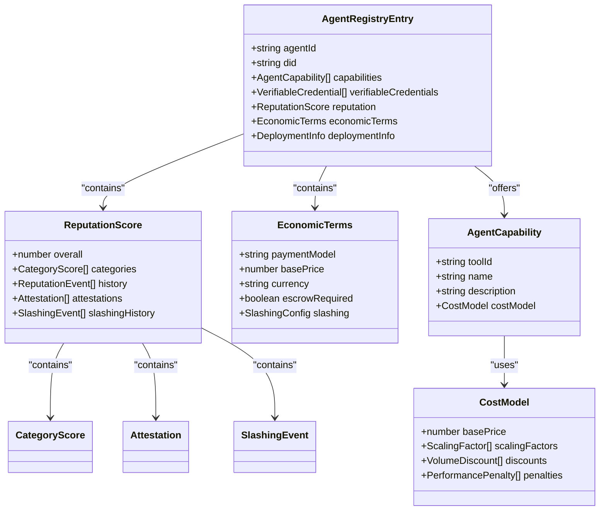
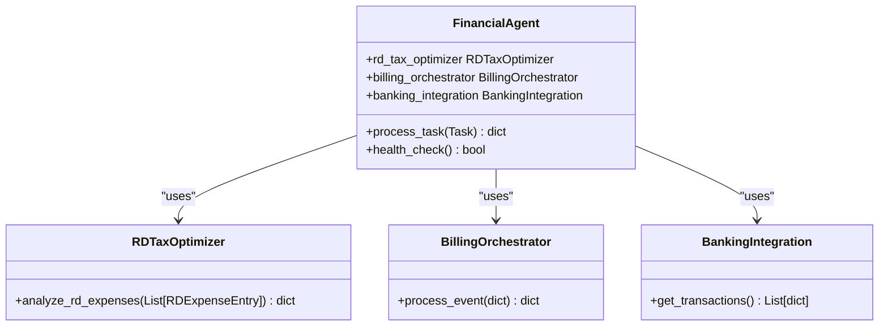
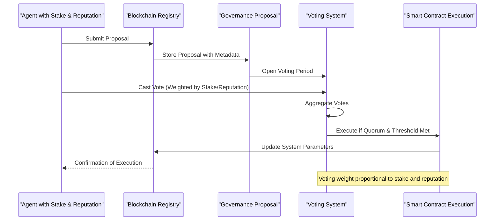
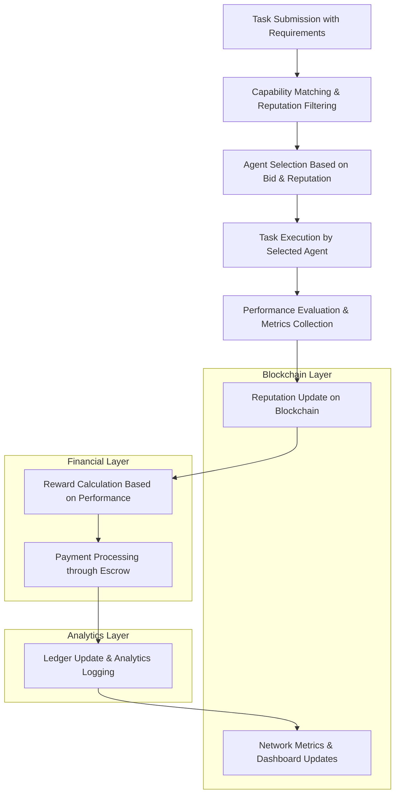
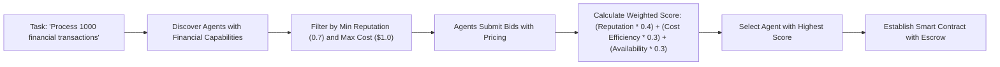
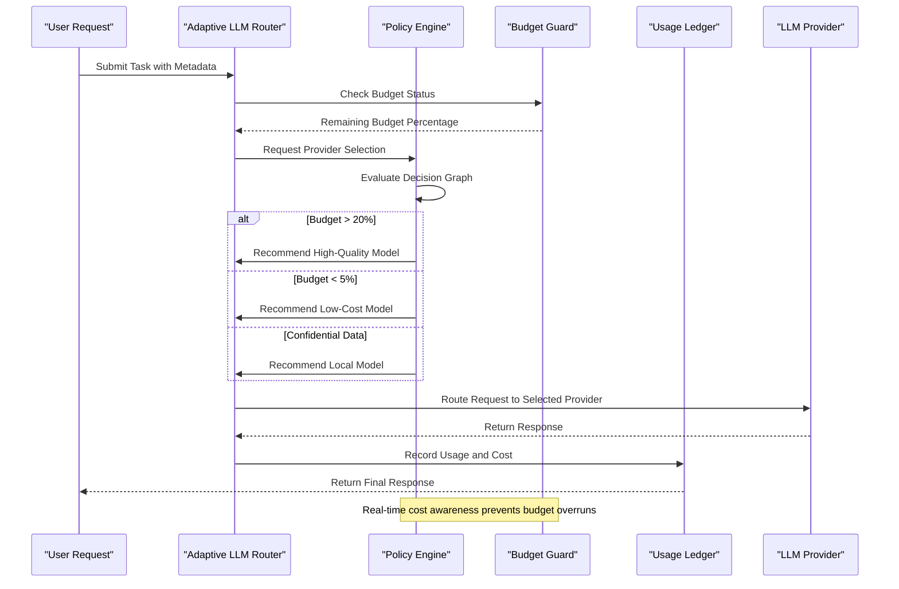

# Economic Incentive Model

<cite>
**Referenced Files in This Document**   
- [financial_agent.py](file://371-os/src/minds371/agents/utility/financial_agent.py)
- [financial_system.py](file://371-os/src/minds371/financial_system.py)
- [financial_agent.md](file://371-os/src/minds371/agents/utility/financial_agent.md)
- [intelligent_router_agent.py](file://371-os/src/minds371/adaptive_llm_router/intelligent_router_agent.py)
- [budget_guard.py](file://371-os/src/minds371/adaptive_llm_router/budget_guard.py)
- [config.py](file://371-os/src/minds371/adaptive_llm_router/config.py)
- [policy_engine.py](file://371-os/src/minds371/adaptive_llm_router/policy_engine.py)
- [usage_ledger.py](file://371-os/src/minds371/adaptive_llm_router/usage_ledger.py)
- [data_models.py](file://371-os/src/minds371/adaptive_llm_router/data_models.py)
- [blockchain-registry.ts](file://packages/elizaos-plugins/universal-tool-server/src/blockchain-registry.ts)
- [types.ts](file://packages/elizaos-plugins/universal-tool-server/src/types.ts)
- [actions.ts](file://packages/elizaos-plugins/universal-tool-server/src/actions.ts)
- [financial_agent.yaml](file://prompts/utility_agents/financial_agent.yaml)
</cite>

## Table of Contents
1. [Introduction](#introduction)
2. [Stake-Based Reputation System](#stake-based-reputation-system)
3. [Financial Agent Implementation](#financial-agent-implementation)
4. [DAO Governance Model](#dao-governance-model)
5. [Economic Data Flows](#economic-data-flows)
6. [Configuration Options](#configuration-options)
7. [Task Bidding and Competition](#task-bidding-and-competition)
8. [Integration with Universal Tool Server and Adaptive LLM Router](#integration-with-universal-tool-server-and-adaptive-llm-router)
9. [Anti-Gaming Strategies](#anti-gaming-strategies)
10. [Conclusion](#conclusion)

## Introduction

The Economic Incentive Model is a comprehensive framework designed to align agent behavior with system goals through token staking, reputation scoring, and financial incentives. This model creates a self-regulating ecosystem where agents are rewarded for reliable performance and penalized for substandard work. The system integrates stake-based reputation mechanisms, financial transaction management, and decentralized governance to ensure optimal performance across the agent network. By combining economic incentives with cryptographic verification and blockchain-based reputation tracking, the model establishes trustless coordination between autonomous agents.

**Section sources**
- [financial_system.py](file://371-os/src/minds371/financial_system.py#L0-L63)
- [blockchain-registry.ts](file://packages/elizaos-plugins/universal-tool-server/src/blockchain-registry.ts#L0-L400)

## Stake-Based Reputation System

The stake-based reputation system forms the foundation of the economic incentive model, ensuring that agents have skin in the game while building trust through verifiable performance. Agents must stake tokens to participate in the network, with stake requirements dynamically calculated based on their capabilities and service complexity.



**Diagram sources**
- [types.ts](file://packages/elizaos-plugins/universal-tool-server/src/types.ts#L0-L271)

**Section sources**
- [blockchain-registry.ts](file://packages/elizaos-plugins/universal-tool-server/src/blockchain-registry.ts#L0-L400)
- [types.ts](file://packages/elizaos-plugins/universal-tool-server/src/types.ts#L0-L271)

### Stake Calculation Mechanism

The system calculates stake requirements based on agent capabilities, with higher-stakes requirements for more complex or sensitive services. The calculation algorithm considers three factors:

1. **Base Stake**: 10 AKT tokens as the minimum requirement
2. **Capability Multiplier**: 2 AKT per capability
3. **Complexity Multiplier**: Doubled for financial or crypto-related capabilities

```python
def calculateStakeRequirement(capabilities: List[AgentCapability]) -> float:
    baseStake = 10  # AKT
    capabilityStake = len(capabilities) * 2  # 2 AKT per capability
    complexityMultiplier = 2 if any(
        'financial' in cap.name or 'crypto' in cap.name 
        for cap in capabilities
    ) else 1
    
    return baseStake + (capabilityStake * complexityMultiplier)
```

Agents that fail to meet performance standards are subject to slashing, where a portion of their stake is forfeited as a penalty. This mechanism ensures accountability and deters malicious or negligent behavior.

## Financial Agent Implementation

The Financial Agent serves as the central component for managing economic transactions, performance tracking, and financial operations within the system. It extends the base FinancialAgent class to provide specialized financial capabilities.



**Diagram sources**
- [financial_system.py](file://371-os/src/minds371/financial_system.py#L0-L63)

**Section sources**
- [financial_agent.py](file://371-os/src/minds371/agents/utility/financial_agent.py#L0-L9)
- [financial_system.py](file://371-os/src/minds371/financial_system.py#L0-L63)

### Core Financial Operations

The Financial Agent handles several critical financial operations:

- **P&L Analysis**: Processes profit and loss statements for financial reporting
- **R&D Tax Optimization**: Identifies and optimizes research and development tax credits
- **Billing Orchestration**: Manages subscription events from platforms like Stripe and Creem.io
- **Banking Synchronization**: Syncs transactions from banking APIs

The agent processes tasks asynchronously, returning structured results with status codes and detailed messages. Each operation is logged with PostHog for analytics and auditing purposes.

```python
async def process_task(self, task: Task) -> dict:
    description = task.description.lower()
    
    if "p&l" in description:
        return {"status": "success", "message": "P&L analysis complete."}
    elif "r&d" in description:
        return {"status": "success", "message": "R&D tax optimization complete."}
    elif "stripe" in description or "creem.io" in description:
        return {"status": "success", "message": "Billing event processed."}
    elif "banking" in description:
        return {"status": "success", "synced_transactions": 1}
    else:
        return {"status": "unsupported", "message": "Task not supported."}
```

## DAO Governance Model

The DAO governance model enables agents to participate in decision-making processes based on their stake and reputation scores. This decentralized approach ensures that network evolution is driven by the most reliable and invested participants.

### Governance Mechanisms

The system implements several governance mechanisms:

1. **Proposal Submission**: Agents can submit governance proposals for tool updates, economic parameters, security policies, or platform integrations
2. **Voting Rights**: Voting power is determined by a combination of stake amount and reputation score
3. **Quorum Requirements**: Proposals require minimum participation thresholds to prevent low-engagement decisions
4. **Execution Automation**: Passed proposals are automatically executed through smart contracts



**Diagram sources**
- [blockchain-registry.ts](file://packages/elizaos-plugins/universal-tool-server/src/blockchain-registry.ts#L0-L400)
- [types.ts](file://packages/elizaos-plugins/universal-tool-server/src/types.ts#L0-L271)

**Section sources**
- [blockchain-registry.ts](file://packages/elizaos-plugins/universal-tool-server/src/blockchain-registry.ts#L0-L400)
- [types.ts](file://packages/elizaos-plugins/universal-tool-server/src/types.ts#L0-L271)

### Reputation-Based Participation

Agent influence in governance decisions is determined by a composite score that combines:

- **Stake Weight**: Proportional to the amount of tokens staked
- **Reputation Score**: Based on historical performance and peer attestations
- **Tenure Multiplier**: Rewards long-term network participants

This multi-factor approach prevents both whale dominance (through reputation requirements) and Sybil attacks (through staking requirements).

## Economic Data Flows

The economic data flows illustrate how financial information moves through the system during task execution, performance evaluation, and reward distribution.



**Diagram sources**
- [usage_ledger.py](file://371-os/src/minds371/adaptive_llm_router/usage_ledger.py#L0-L88)
- [blockchain-registry.ts](file://packages/elizaos-plugins/universal-tool-server/src/blockchain-registry.ts#L0-L400)

**Section sources**
- [usage_ledger.py](file://371-os/src/minds371/adaptive_llm_router/usage_ledger.py#L0-L88)
- [blockchain-registry.ts](file://packages/elizaos-plugins/universal-tool-server/src/blockchain-registry.ts#L0-L400)

### Performance Evaluation Metrics

The system collects comprehensive performance metrics for each task execution:

- **Latency Metrics**: P50, P95, and P99 response times
- **Success Rate**: Percentage of successful executions
- **Cost Efficiency**: Actual cost versus estimated cost
- **Quality Score**: Output quality assessment
- **Reliability**: Uptime and availability

These metrics feed into the agent's reputation score and influence future task assignments and reward calculations.

## Configuration Options

The economic incentive model provides extensive configuration options to tailor the system to specific requirements and use cases.

### Staking Requirements

Stake requirements can be configured through several parameters:

- **Base Stake**: Minimum stake required for network participation
- **Capability Multipliers**: Additional stake per capability type
- **Service Category Multipliers**: Higher stakes for sensitive services
- **Dynamic Adjustments**: Automatic adjustments based on network conditions

### Reward Structures

The reward system supports multiple payment models:

- **Per-Call Pricing**: Fixed price per API call or task
- **Subscription Model**: Recurring payments for ongoing services
- **Compute-Time Based**: Charges based on computational resources used
- **Outcome-Based**: Rewards tied to successful outcomes

```python
class EconomicTerms:
    paymentModel: Literal['per-call', 'subscription', 'compute-time', 'outcome-based']
    basePrice: float
    currency: Literal['AKT', 'ETH', 'USDC', 'native']
    dynamicPricing: Optional[DynamicPricingConfig]
    escrowRequired: bool
    slashing: Optional[SlashingConfig]
```

### Penalty Mechanisms

The system implements several penalty mechanisms to enforce reliability:

- **Slashing**: Partial forfeiture of stake for poor performance
- **Reputation Demotion**: Reduction in reputation score
- **Temporary Suspension**: Short-term exclusion from task bidding
- **Increased Bond Requirements**: Higher stakes required after violations

## Task Bidding and Competition

Agents compete for tasks through a transparent bidding process that considers both price and reputation.

### Bidding Process

1. **Task Publication**: A task is published with specific requirements and constraints
2. **Agent Discovery**: Agents with matching capabilities are identified
3. **Bid Submission**: Qualified agents submit bids with pricing and SLA commitments
4. **Selection Algorithm**: Tasks are awarded based on a weighted score of price, reputation, and availability
5. **Contract Establishment**: Smart contracts establish the terms and escrow payments



**Diagram sources**
- [blockchain-registry.ts](file://packages/elizaos-plugins/universal-tool-server/src/blockchain-registry.ts#L0-L400)
- [actions.ts](file://packages/elizaos-plugins/universal-tool-server/src/actions.ts#L0-L199)

**Section sources**
- [blockchain-registry.ts](file://packages/elizaos-plugins/universal-tool-server/src/blockchain-registry.ts#L0-L400)
- [actions.ts](file://packages/elizaos-plugins/universal-tool-server/src/actions.ts#L0-L199)

### Example Competition Scenario

Consider three agents competing for a financial processing task:

- **Agent A**: Reputation 0.95, Price $0.80, Availability 24/7
- **Agent B**: Reputation 0.85, Price $0.60, Availability 24/7
- **Agent C**: Reputation 0.75, Price $0.40, Availability 12/7

Using the weighted scoring algorithm:
- Agent A Score: (0.95 * 0.4) + (0.6 * 0.3) + (1.0 * 0.3) = 0.86
- Agent B Score: (0.85 * 0.4) + (0.7 * 0.3) + (1.0 * 0.3) = 0.82
- Agent C Score: (0.75 * 0.4) + (0.8 * 0.3) + (0.5 * 0.3) = 0.69

Despite higher pricing, Agent A wins the task due to superior reputation and availability, demonstrating the system's emphasis on reliability over cost alone.

## Integration with Universal Tool Server and Adaptive LLM Router

The economic incentive model integrates seamlessly with the Universal Tool Server and Adaptive LLM Router to enable cost-aware operations and optimal resource allocation.

### Adaptive LLM Router Integration

The Adaptive LLM Router uses economic constraints and performance data to make intelligent routing decisions:



**Diagram sources**
- [policy_engine.py](file://371-os/src/minds371/adaptive_llm_router/policy_engine.py#L0-L33)
- [budget_guard.py](file://371-os/src/minds371/adaptive_llm_router/budget_guard.py#L0-L49)
- [usage_ledger.py](file://371-os/src/minds371/adaptive_llm_router/usage_ledger.py#L0-L88)

**Section sources**
- [policy_engine.py](file://371-os/src/minds371/adaptive_llm_router/policy_engine.py#L0-L33)
- [budget_guard.py](file://371-os/src/minds371/adaptive_llm_router/budget_guard.py#L0-L49)
- [usage_ledger.py](file://371-os/src/minds371/adaptive_llm_router/usage_ledger.py#L0-L88)

### Universal Tool Server Integration

The Universal Tool Server provides a decentralized marketplace for agent services, enabling discovery and economic coordination:

1. **Registration**: Agents register capabilities and economic terms on the blockchain
2. **Discovery**: Requesters discover agents based on capabilities, reputation, and cost
3. **Execution**: Secure tool calls with cryptographic authentication
4. **Settlement**: Automated payments and reputation updates

The integration ensures that all economic interactions are transparent, verifiable, and resistant to manipulation.

## Anti-Gaming Strategies

The system implements multiple strategies to prevent gaming of the incentive system and ensure genuine performance.

### Sybil Attack Prevention

- **Staking Requirements**: Significant token stake required for participation
- **Identity Verification**: Integration with decentralized identity systems
- **Behavioral Analysis**: Detection of coordinated behavior across multiple accounts

### Reputation Manipulation Prevention

- **Cryptographic Evidence**: All reputation updates include verifiable evidence
- **Diverse Raters**: Reputation weighted by rater reputation and diversity
- **Temporal Decay**: Older reputation data gradually loses influence
- **Slashing Conditions**: Penalties for submitting false reputation updates

```python
def updateReputation(update: ReputationUpdate) -> str:
    # Create cryptographic evidence hash
    evidenceHash = ethers.id(JSON.stringify({
        "executionId": update.executionId,
        "evidence": update.evidence,
        "rater": update.raterDid,
        "timestamp": update.timestamp
    }))
    
    # Convert rating to on-chain format (0-100)
    rating = Math.min(100, Math.max(0, Math.round(update.rating * 100)))
    
    # Submit transaction with cryptographic proof
    tx = contractWithSigner.updateReputation(
        agentIdBytes,
        rating,
        evidenceHash
    )
    
    return tx.hash
```

### Economic Balance Mechanisms

- **Dynamic Pricing**: Market-based pricing prevents artificial inflation/deflation
- **Anti-Whale Measures**: Voting power caps to prevent single-entity dominance
- **Randomized Audits**: Unexpected performance verification to deter corner-cutting
- **Escrow Systems**: Funds held until performance verification is complete

These strategies work together to create a robust economic ecosystem that rewards genuine value creation while discouraging exploitative behavior.

## Conclusion

The Economic Incentive Model presents a comprehensive framework for aligning agent behavior with system goals through a sophisticated combination of staking, reputation scoring, and financial incentives. By integrating blockchain-based verification, decentralized governance, and adaptive resource allocation, the system creates a self-regulating ecosystem that rewards reliability and performance. The Financial Agent implementation provides robust transaction management and performance tracking, while the DAO governance model ensures that network evolution is driven by the most invested participants. Integration with the Universal Tool Server and Adaptive LLM Router enables cost-aware operations and optimal resource allocation. Through carefully designed anti-gaming strategies, the model maintains economic integrity and prevents manipulation. This holistic approach establishes a trustless coordination mechanism that scales effectively while maintaining high standards of reliability and performance across the agent network.