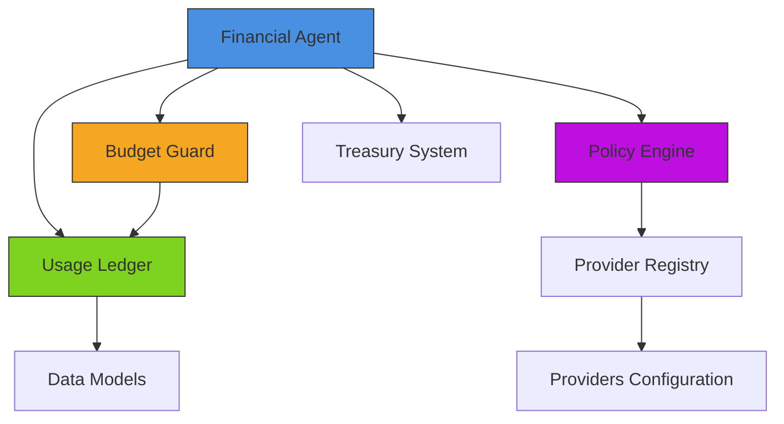
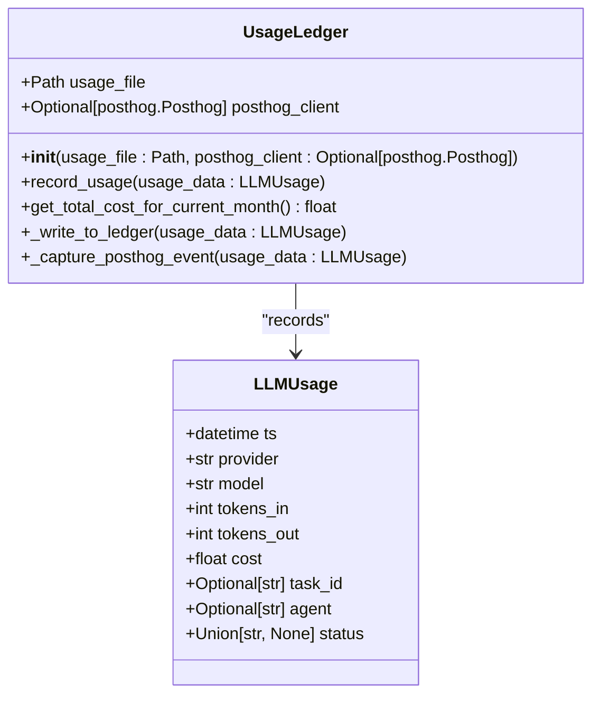
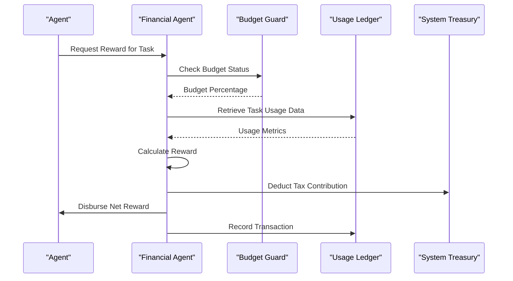
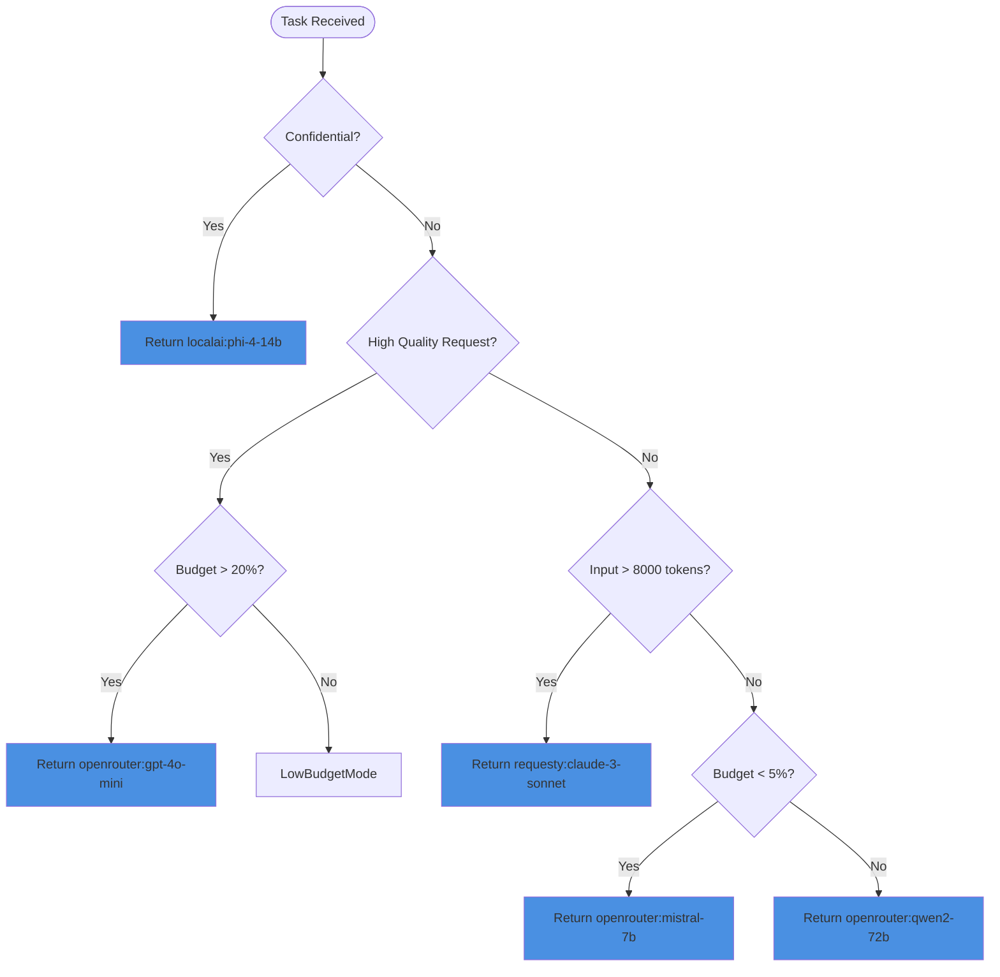
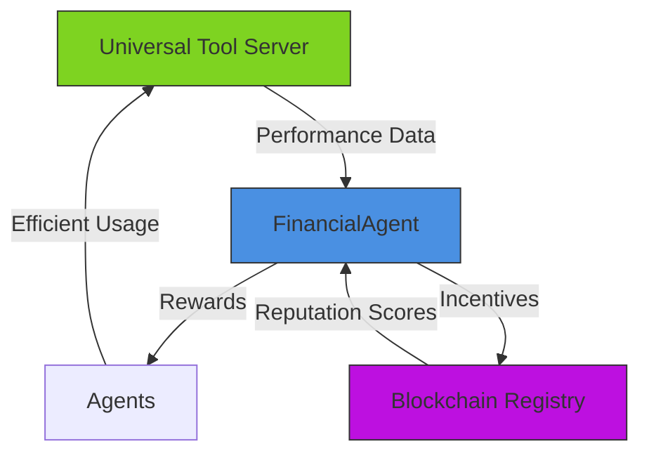

# Reward Distribution Mechanism

<cite>
**Referenced Files in This Document**   
- [financial_agent.py](file://371-os/src/minds371/agents/utility/financial_agent.py)
- [budget_guard.py](file://371-os/src/minds371/adaptive_llm_router/budget_guard.py)
- [usage_ledger.py](file://371-os/src/minds371/adaptive_llm_router/usage_ledger.py)
- [data_models.py](file://371-os/src/minds371/adaptive_llm_router/data_models.py)
- [config.py](file://371-os/src/minds371/adaptive_llm_router/config.py)
- [policy_engine.py](file://371-os/src/minds371/adaptive_llm_router/policy_engine.py)
- [provider_registry.py](file://371-os/src/minds371/adaptive_llm_router/provider_registry.py)
- [providers.json](file://371-os/src/minds371/adaptive_llm_router/providers.json)
</cite>

## Table of Contents
1. [Introduction](#introduction)
2. [Core Components](#core-components)
3. [Reward Calculation Framework](#reward-calculation-framework)
4. [Multi-Tiered Reward Structure](#multi-tiered-reward-structure)
5. [Financial Ledger System](#financial-ledger-system)
6. [Workflow Examples](#workflow-examples)
7. [Configuration Options](#configuration-options)
8. [Integration with Adaptive LLM Router](#integration-with-adaptive-llm-router)
9. [Integration with Universal Tool Server](#integration-with-universal-tool-server)
10. [Anti-Gaming Measures](#anti-gaming-measures)

## Introduction
The Reward Distribution Mechanism governs how agents are compensated for successful task completion and cost-efficient operations within the 371OS ecosystem. This system implements a sophisticated financial model that combines base compensation, performance bonuses, and reputation-based incentives. The mechanism is designed to promote efficient resource utilization while ensuring fair compensation for high-quality work. The system integrates with multiple components including the financial_agent.py for reward calculation, budget_guard.py for cost monitoring, and a comprehensive ledger system for tracking all financial transactions.

## Core Components

The reward distribution system comprises several interconnected components that work together to calculate, approve, and disburse rewards. The primary components include the Financial Agent, Budget Guard, Usage Ledger, and Provider Registry, each playing a critical role in the overall reward calculation and distribution process.



**Diagram sources**
- [financial_agent.py](file://371-os/src/minds371/agents/utility/financial_agent.py)
- [budget_guard.py](file://371-os/src/minds371/adaptive_llm_router/budget_guard.py)
- [usage_ledger.py](file://371-os/src/minds371/adaptive_llm_router/usage_ledger.py)
- [policy_engine.py](file://371-os/src/minds371/adaptive_llm_router/policy_engine.py)

**Section sources**
- [financial_agent.py](file://371-os/src/minds371/agents/utility/financial_agent.py#L0-L8)
- [budget_guard.py](file://371-os/src/minds371/adaptive_llm_router/budget_guard.py#L0-L49)

## Reward Calculation Framework

The reward calculation framework is implemented primarily in the financial_agent.py module, which extends the base FinancialAgent class to handle reward-specific operations. The system calculates rewards based on three primary factors: task complexity, performance metrics, and budget adherence.

The FinancialAgent class serves as the central component for financial operations, including reward calculation and distribution. It inherits from a base financial agent and implements specialized methods for processing financial tasks related to agent compensation.

```python
from ...financial_system import FinancialAgent as BaseFinancialAgent

class FinancialAgent(BaseFinancialAgent):
    """
    A utility agent for financial tasks.
    This agent can be extended with more specialized financial capabilities.
    """
    def __init__(self):
        super().__init__()
```

The reward calculation process begins when a task is completed and the agent requests compensation. The FinancialAgent evaluates the task based on predefined criteria including task complexity, quality of output, and resource efficiency. The system then calculates the appropriate reward amount, taking into account both base compensation and potential bonuses.

**Section sources**
- [financial_agent.py](file://371-os/src/minds371/agents/utility/financial_agent.py#L0-L8)

## Multi-Tiered Reward Structure

The reward system implements a multi-tiered structure that combines base compensation with performance-based bonuses and reputation incentives. This approach ensures that agents are rewarded not only for completing tasks but also for doing so efficiently and with high quality.

The three-tiered structure consists of:
1. **Base Compensation**: Fixed payment for task completion based on task complexity
2. **Performance Bonuses**: Additional rewards for exceeding quality thresholds or completing tasks ahead of schedule
3. **Reputation Incentives**: Long-term rewards based on consistent high performance and positive peer reviews

The system uses a combination of quantitative metrics (such as task completion time and resource usage) and qualitative assessments (such as output quality and user satisfaction) to determine the final reward amount. This balanced approach encourages agents to optimize both efficiency and quality in their work.

## Financial Ledger System

The financial ledger system tracks all earnings, withdrawals, and tax-like contributions to the system treasury. Implemented in the usage_ledger.py module, this system maintains a comprehensive record of all financial transactions within the ecosystem.



**Diagram sources**
- [usage_ledger.py](file://371-os/src/minds371/adaptive_llm_router/usage_ledger.py#L0-L88)
- [data_models.py](file://371-os/src/minds371/adaptive_llm_router/data_models.py#L0-L39)

**Section sources**
- [usage_ledger.py](file://371-os/src/minds371/adaptive_llm_router/usage_ledger.py#L0-L88)

The UsageLedger class is responsible for persisting every request's cost, latency, success status, and response quality score. It writes usage records to a JSON file (llm_usage.json) and sends events to PostHog for analytics. The ledger provides methods to record usage and calculate the total cost for the current month, which is essential for budget monitoring and reward calculation.

Key methods in the UsageLedger include:
- `record_usage()`: Records a single usage event to the ledger and PostHog
- `get_total_cost_for_current_month()`: Calculates the total cost of LLM usage for the current calendar month
- `_write_to_ledger()`: Appends a usage record to the JSON file
- `_capture_posthog_event()`: Sends a 'llm_usage' event to PostHog

## Workflow Examples

The reward distribution workflow follows a structured process from task completion to final disbursement. When an agent completes a task, the following sequence occurs:



**Diagram sources**
- [financial_agent.py](file://371-os/src/minds371/agents/utility/financial_agent.py)
- [budget_guard.py](file://371-os/src/minds371/adaptive_llm_router/budget_guard.py)
- [usage_ledger.py](file://371-os/src/minds371/adaptive_llm_router/usage_ledger.py)

**Section sources**
- [financial_agent.py](file://371-os/src/minds371/agents/utility/financial_agent.py#L0-L8)
- [budget_guard.py](file://371-os/src/minds371/adaptive_llm_router/budget_guard.py#L0-L49)
- [usage_ledger.py](file://371-os/src/minds371/adaptive_llm_router/usage_ledger.py#L0-L88)

For example, when a content generation agent completes a writing task, the system evaluates the output quality, checks the computational resources used against the budget, and calculates the final reward. If the agent completed the task with exceptional quality while using fewer resources than expected, they would receive both a performance bonus and a reputation point increase.

## Configuration Options

The reward system provides several configuration options that can be adjusted to meet different operational requirements. These options are primarily defined in the config.py file and the providers.json configuration.

```python
"""
Configuration for the Adaptive LLM Router.
"""

# The monthly budget cap for LLM usage in USD.
MONTHLY_BUDGET_CAP = 20.00
```

The primary configuration parameters include:
- **Reward Pools**: Configurable pools that determine the total available funds for distribution
- **Distribution Schedules**: Settings that control when rewards are processed and disbursed
- **Penalty Deductions**: Rules for deducting rewards for poor performance or excessive resource usage
- **Tax Rates**: Configurable contribution rates to the system treasury

The providers.json file contains detailed configuration for each LLM provider, including cost metrics that directly impact reward calculations:

```json
[
  {
    "name": "openrouter",
    "model": "gpt-4o-mini",
    "cost_in": 0.0006,
    "cost_out": 0.0006,
    "max_context": 128000,
    "latency_ms": 500,
    "endpoint_env": "OPENROUTER_API_KEY"
  },
  {
    "name": "requesty",
    "model": "claude-3-sonnet",
    "cost_in": 0.003,
    "cost_out": 0.015,
    "max_context": 200000,
    "latency_ms": 800,
    "endpoint_env": "REQUESTY_API_KEY"
  }
]
```

**Section sources**
- [config.py](file://371-os/src/minds371/adaptive_llm_router/config.py#L0-L6)
- [providers.json](file://371-os/src/minds371/adaptive_llm_router/providers.json#L0-L47)

## Integration with Adaptive LLM Router

The reward system is tightly integrated with the Adaptive LLM Router to incentivize cost-aware provider selection. The policy_engine.py module implements decision logic that balances task requirements with cost considerations.



**Diagram sources**
- [policy_engine.py](file://371-os/src/minds371/adaptive_llm_router/policy_engine.py#L0-L33)

**Section sources**
- [policy_engine.py](file://371-os/src/minds371/adaptive_llm_router/policy_engine.py#L0-L33)
- [config.py](file://371-os/src/minds371/adaptive_llm_router/config.py#L0-L6)

The policy engine uses a decision graph to select providers based on:
1. Privacy requirements (forces LocalAI for confidential tasks)
2. Task criticality (uses high-quality models for critical tasks if budget allows)
3. Context length requirements (uses long-context models for large inputs)
4. Budget status (uses cheapest models when budget is low)
5. Default balanced selection for all other cases

This integration ensures that agents are rewarded for making cost-effective provider selections while still meeting task requirements.

## Integration with Universal Tool Server

The reward system integrates with the Universal Tool Server to provide resource utilization rewards. The Universal Tool Server's blockchain registry tracks agent performance metrics including latency, cost, reliability, and user satisfaction.

The integration enables:
- Performance-based rewards for efficient tool usage
- Reputation scoring based on consistent high performance
- Economic incentives through staking mechanisms
- Cross-agent collaboration rewards

The system monitors performance across the Universal Tool Server network, identifying top performers and providing additional incentives for cost-efficient operations. This creates a positive feedback loop where agents are motivated to optimize their resource usage and improve service quality.



**Diagram sources**
- [types.ts](file://packages/elizaos-plugins/universal-tool-server/src/types.ts)
- [actions.ts](file://packages/elizaos-plugins/universal-tool-server/src/actions.ts)

## Anti-Gaming Measures

The reward system incorporates several anti-gaming measures to prevent exploitation and ensure fair compensation. These measures include:

1. **Budget Enforcement**: The BudgetGuard class implements hard-stop gates that prevent operations when the monthly cap is reached, raising a BudgetExceededError when limits are exceeded.

```python
class BudgetManager:
    """
    Manages the LLM budget by checking usage against a monthly cap.
    """
    def __init__(self, monthly_cap: float, ledger: UsageLedger):
        self.monthly_cap = monthly_cap
        self.ledger = ledger

    def is_budget_exceeded(self) -> bool:
        """
        Checks if the current spend has exceeded the monthly cap.
        """
        return self.get_remaining_budget_percentage() <= 0

    def check_budget(self):
        """
        Raises a BudgetExceededError if the budget is exhausted.
        """
        if self.is_budget_exceeded():
            raise BudgetExceededError(f"Monthly budget of ${self.monthly_cap} has been exceeded.")
```

2. **Usage Verification**: The system verifies actual resource usage through the UsageLedger, which records detailed metrics for each operation, preventing agents from claiming rewards for non-existent work.

3. **Reputation System**: A blockchain-based reputation system tracks long-term performance, making it difficult for agents to game the system without damaging their reputation.

4. **Quality Assessment**: Output quality is assessed through multiple mechanisms, preventing agents from submitting low-quality work quickly to maximize reward frequency.

5. **Temporal Controls**: The system implements cooldown periods and rate limits to prevent rapid-fire task submission and reward claiming.

These anti-gaming measures work together to create a robust reward system that incentivizes genuine value creation while discouraging exploitative behaviors.

**Section sources**
- [budget_guard.py](file://371-os/src/minds371/adaptive_llm_router/budget_guard.py#L0-L49)
- [usage_ledger.py](file://371-os/src/minds371/adaptive_llm_router/usage_ledger.py#L0-L88)
- [data_models.py](file://371-os/src/minds371/adaptive_llm_router/data_models.py#L0-L39)