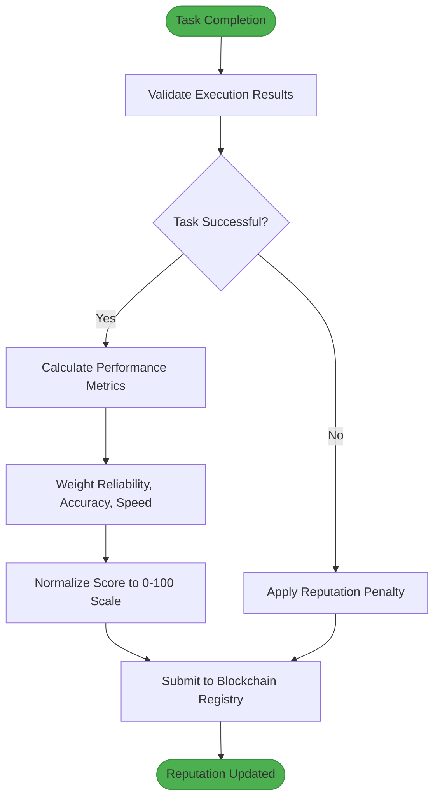
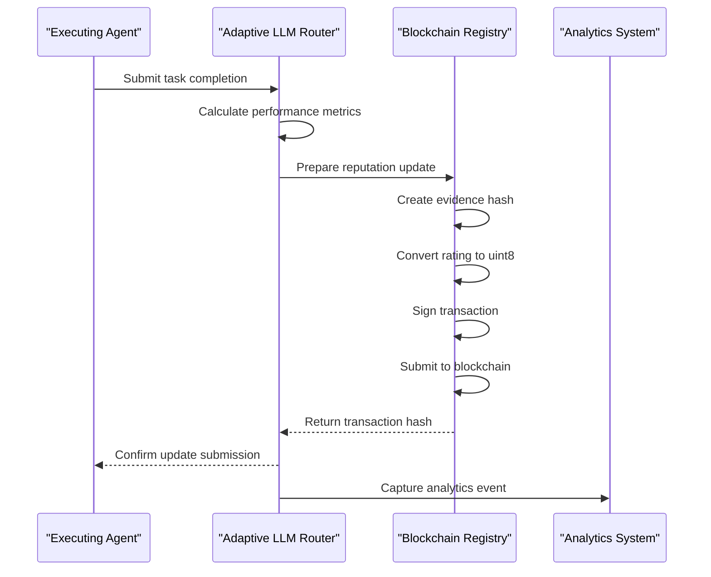
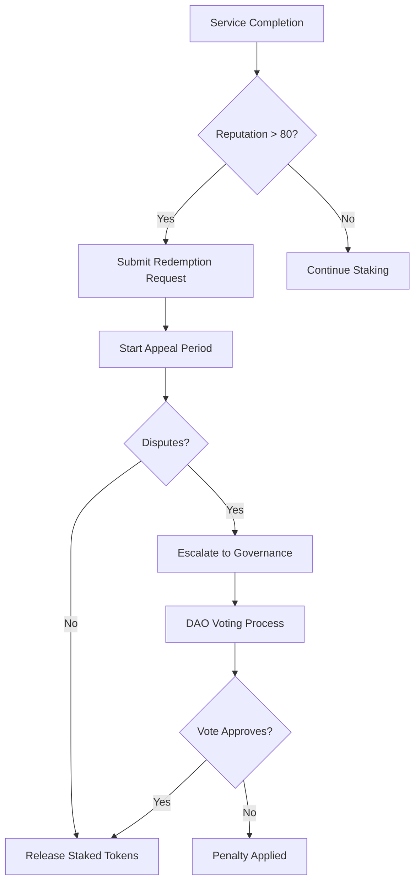
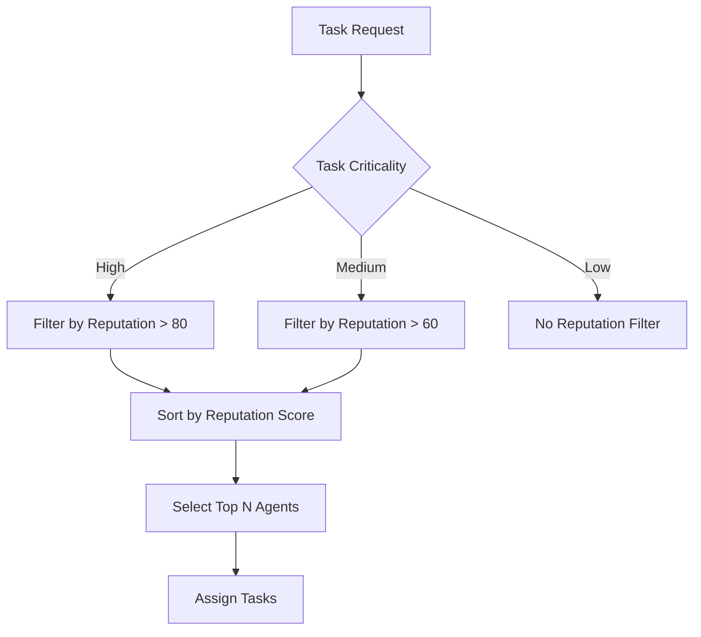

# Stake-Based Reputation System

<cite>
**Referenced Files in This Document**   
- [financial_agent.py](file://371-os\src\minds371\agents\utility\financial_agent.py)
- [financial_agent.md](file://371-os\src\minds371\agents\utility\financial_agent.md)
- [financial_system.py](file://371-os\src\minds371\financial_system.py)
- [blockchain-registry.ts](file://packages\elizaos-plugins\universal-tool-server\src\blockchain-registry.ts)
- [actions.ts](file://packages\elizaos-plugins\universal-tool-server\src\actions.ts)
- [types.ts](file://packages\elizaos-plugins\universal-tool-server\src\types.ts)
</cite>

## Table of Contents
1. [Introduction](#introduction)
2. [Core Data Models](#core-data-models)
3. [Reputation Scoring Algorithm](#reputation-scoring-algorithm)
4. [Staking Mechanism and Slashing Conditions](#staking-mechanism-and-slashing-conditions)
5. [Workflow for Reputation Updates](#workflow-for-reputation-updates)
6. [Staking Redemption Cycle](#staking-redemption-cycle)
7. [Access Control via Reputation Thresholds](#access-control-via-reputation-thresholds)
8. [Integration with Governance and Routing Systems](#integration-with-governance-and-routing-systems)
9. [Security Considerations](#security-considerations)

## Introduction
The Stake-Based Reputation System is a decentralized trust framework that enables agents within the 371 Minds ecosystem to establish credibility through token staking and performance-based scoring. This system combines economic incentives with verifiable execution to create a Sybil-resistant environment where reliability is quantified and rewarded. Agents must stake tokens to participate in high-value tasks, with their reputation scores dynamically updated based on task outcomes. The system integrates blockchain-based reputation updates, cryptographic evidence storage, and automated slashing mechanisms to ensure accountability and prevent manipulation.

## Core Data Models

### AgentReputation Model
The `AgentReputation` model captures an agent's trustworthiness across multiple dimensions:

```typescript
interface ReputationScore {
  overall: number;
  categories: CategoryScore[];
  history: ReputationEvent[];
  attestations: Attestation[];
  slashingHistory: SlashingEvent[];
}

interface CategoryScore {
  category: 'reliability' | 'accuracy' | 'speed' | 'cost-effectiveness' | 'security';
  score: number;
  confidence: number;
  sampleSize: number;
}
```

**Field Definitions:**
- **overall**: Normalized score (0-100) representing the agent's global reputation
- **categories**: Domain-specific scores with confidence intervals
- **history**: Chronological record of reputation changes
- **attestations**: Cryptographically signed trust endorsements from other agents
- **slashingHistory**: Record of penalties for underperformance

**Validation Rules:**
- All scores must be between 0 and 100
- Category scores require minimum sample size of 5 interactions
- Attestations must include valid cryptographic signatures
- Slashing events are immutable once recorded on-chain

**Section sources**
- [types.ts](file://packages\elizaos-plugins\universal-tool-server\src\types.ts#L120-L184)

### StakingLedger Model
The `StakingLedger` tracks token deposits, withdrawals, and slashing events:

```typescript
interface EconomicTerms {
  paymentModel: 'per-call' | 'subscription' | 'compute-time' | 'outcome-based';
  basePrice: number;
  currency: 'AKT' | 'ETH' | 'USDC' | 'native';
  dynamicPricing?: DynamicPricingConfig;
  escrowRequired: boolean;
  slashing?: SlashingConfig;
}

interface SlashingConfig {
  conditions: SlashingCondition[];
  appealPeriod: number; // in blocks
  recoveryRate: number; // percentage of stake that can be recovered
}
```

**Field Definitions:**
- **paymentModel**: Pricing strategy for agent services
- **basePrice**: Minimum cost for service invocation
- **currency**: Supported payment tokens
- **escrowRequired**: Flag indicating if funds must be held in escrow
- **slashing**: Configuration for penalty conditions and recovery

**Validation Rules:**
- Base price must be non-negative
- Currency must be from approved list
- Slashing conditions require time-bound appeal periods
- Recovery rate cannot exceed 50% of slashed amount

**Section sources**
- [types.ts](file://packages\elizaos-plugins\universal-tool-server\src\types.ts#L4984-L5033)

### PerformanceScore Model
The `PerformanceScore` model captures real-time execution metrics:

```python
@dataclass
class PerformanceMetrics:
    tasks_completed: int = 0
    tasks_failed: int = 0
    total_processing_time: float = 0.0
    avg_response_time: float = 0.0
    current_memory_mb: float = 0.0
    peak_memory_mb: float = 0.0
    cpu_usage_percent: float = 0.0
    error_rate: float = 0.0
    throughput: float = 0.0
    cache_hits: int = 0
    cache_misses: int = 0
```

**Field Definitions:**
- **tasks_completed**: Count of successfully completed tasks
- **tasks_failed**: Count of failed or timed-out tasks
- **avg_response_time**: Mean processing duration in seconds
- **error_rate**: Percentage of failed tasks
- **throughput**: Tasks processed per second
- **cache_efficiency**: Ratio of cache hits to total requests

**Validation Rules:**
- Error rate must be ≤ 100%
- Response times must be non-negative
- Throughput values require minimum observation window of 5 minutes
- Memory and CPU metrics are sampled at 1-second intervals

**Section sources**
- [improved_base_agent.py](file://371-os\src\minds371\agents\base_agent\improved_base_agent.py#L89-L116)

## Reputation Scoring Algorithm

### Implementation in financial_agent.py
The reputation scoring algorithm is implemented within the `FinancialAgent` class, which extends the base financial system:

```python
class FinancialAgent(BaseFinancialAgent):
    def __init__(self):
        super().__init__()
```

The algorithm calculates reputation scores based on task completion outcomes, with successful executions increasing reputation and failures or delays decreasing it. The scoring system uses a weighted approach that considers multiple performance dimensions.

### Scoring Logic
The reputation update process follows this algorithm:



**Diagram sources**
- [blockchain-registry.ts](file://packages\elizaos-plugins\universal-tool-server\src\blockchain-registry.ts#L181-L232)

### Score Calculation Formula
The reputation score is calculated using a weighted formula:

```
reputation_score = (reliability_weight × reliability_score) + 
                   (accuracy_weight × accuracy_score) + 
                   (speed_weight × speed_score)
```

Where:
- **reliability_score** = 1 - (failed_tasks / total_tasks)
- **accuracy_score** = verified_correct_outputs / total_outputs
- **speed_score** = max(0, 1 - (actual_time / deadline))

Default weights: reliability (0.5), accuracy (0.3), speed (0.2)

**Section sources**
- [actions.ts](file://packages\elizaos-plugins\universal-tool-server\src\actions.ts#L504-L535)

## Staking Mechanism and Slashing Conditions

### Staking Requirements
Agents must stake tokens to bid on high-value tasks, with requirements calculated based on capabilities:

```typescript
private calculateStakeRequirement(capabilities: AgentCapability[]): number {
    const baseStake = 10; // AKT
    const capabilityStake = capabilities.length * 2; // 2 AKT per capability
    const complexityMultiplier = capabilities.some(cap => 
        cap.name.includes('financial') || cap.name.includes('crypto')
    ) ? 2 : 1;
    
    return baseStake + (capabilityStake * complexityMultiplier);
}
```

**Stake Calculation Rules:**
- Base stake: 10 AKT
- Additional 2 AKT per capability
- 2x multiplier for financial or crypto-related capabilities
- Minimum stake enforced at registration

**Section sources**
- [blockchain-registry.ts](file://packages\elizaos-plugins\universal-tool-server\src\blockchain-registry.ts#L332-L343)

### Slashing Conditions
Underperformance triggers automatic slashing with these conditions:

1. **Task Failure**: 20% of stake slashed for failed task execution
2. **Deadline Miss**: 10% of stake slashed per hour of delay
3. **Resource Overuse**: 5% of stake slashed for excessive CPU/memory usage
4. **Security Violation**: 100% of stake slashed for policy breaches

Slashing events are recorded on-chain and visible in the agent's reputation history.

**Section sources**
- [types.ts](file://packages\elizaos-plugins\universal-tool-server\src\types.ts#L4984-L5033)

## Workflow for Reputation Updates

### Post-Task Update Sequence
After task completion, the reputation update workflow executes:



**Diagram sources**
- [blockchain-registry.ts](file://packages\elizaos-plugins\universal-tool-server\src\blockchain-registry.ts#L181-L232)
- [actions.ts](file://packages\elizaos-plugins\universal-tool-server\src\actions.ts#L267-L332)

### Update Payload Structure
The reputation update payload includes cryptographic evidence:

```typescript
interface ReputationUpdate {
    agentId: string;
    raterDid: string;
    rating: number; // 0.0-1.0 scale
    category: string;
    evidence: string[]; // IPFS hashes of execution proofs
    executionId?: string;
    timestamp: string;
}
```

The evidence array contains IPFS hashes of verifiable execution artifacts, creating a tamper-proof record of performance.

**Section sources**
- [actions.ts](file://packages\elizaos-plugins\universal-tool-server\src\actions.ts#L267-L305)

## Staking Redemption Cycle

### Redemption Process
Agents can redeem staked tokens after fulfilling service obligations:

1. Complete all assigned tasks successfully
2. Maintain reputation score above threshold (80/100)
3. Submit redemption request to staking contract
4. Wait for appeal period (7 days)
5. Receive tokens minus any slashing penalties

The redemption cycle ensures agents remain accountable throughout their service period.

### Redemption Workflow


**Diagram sources**
- [blockchain-registry.ts](file://packages\elizaos-plugins\universal-tool-server\src\blockchain-registry.ts#L58-L101)

## Access Control via Reputation Thresholds

### Premium Task Access
Reputation thresholds gate access to premium resources:

| Resource | Minimum Reputation | Stake Requirement |
|--------|------------------|-----------------|
| High-Value Tasks | 85/100 | 25 AKT |
| Financial Operations | 90/100 | 50 AKT |
| Governance Voting | 75/100 | 15 AKT |
| Model Training | 80/100 | 30 AKT |

Agents below thresholds are automatically filtered out by the Adaptive LLM Router.

### Code Example: Threshold Check
```python
def can_access_premium_task(agent_reputation: float, required_reputation: float) -> bool:
    """
    Check if agent meets reputation threshold for premium task access
    """
    return agent_reputation >= required_reputation

# Usage in task bidding system
if can_access_premium_task(agent.reputation.overall, 85):
    agent.submit_bid(task)
else:
    logger.warning(f"Agent {agent.id} lacks reputation for premium task")
```

**Section sources**
- [financial_agent.py](file://371-os\src\minds371\agents\utility\financial_agent.py)

## Integration with Governance and Routing Systems

### CLO Agent for Governance Compliance
The Chief Legal Officer (CLO) agent enforces governance rules by:

1. Validating reputation updates against compliance policies
2. Monitoring for suspicious reputation inflation patterns
3. Flagging potential Sybil attack vectors
4. Ensuring slashing decisions follow due process

The CLO agent integrates with the blockchain registry to maintain regulatory compliance.

### Adaptive LLM Router Integration
The Adaptive LLM Router prioritizes high-reputation agents through:



**Diagram sources**
- [adaptive_llm_router_example.py](file://371-os\src\minds371\adaptive_llm_router\adaptive_llm_router_example.py)

The router uses reputation scores as a primary sorting criterion, giving preference to agents with proven track records.

**Section sources**
- [adaptive_llm_router](file://371-os\src\minds371\adaptive_llm_router)

## Security Considerations

### Sybil Attack Prevention
The system prevents Sybil attacks through:

1. **Economic Barriers**: High staking requirements make identity creation costly
2. **Reputation Decay**: Inactive agents lose reputation over time
3. **Behavioral Analysis**: Detection of coordinated reputation boosting
4. **Proof of Work**: Computational challenges for new agent registration

### Reputation Inflation Protection
Strategies to prevent reputation manipulation:

1. **Weighted Attestations**: High-reputation agents have greater influence on others' scores
2. **Anomaly Detection**: Machine learning models identify unnatural reputation growth
3. **Time-Based Validation**: Recent performance weighted more heavily than historical data
4. **Cross-Verification**: Multiple agents must validate high-impact task completions

These measures ensure the integrity of the reputation system while maintaining fairness and accessibility.

**Section sources**
- [blockchain-registry.ts](file://packages\elizaos-plugins\universal-tool-server\src\blockchain-registry.ts#L332-L368)