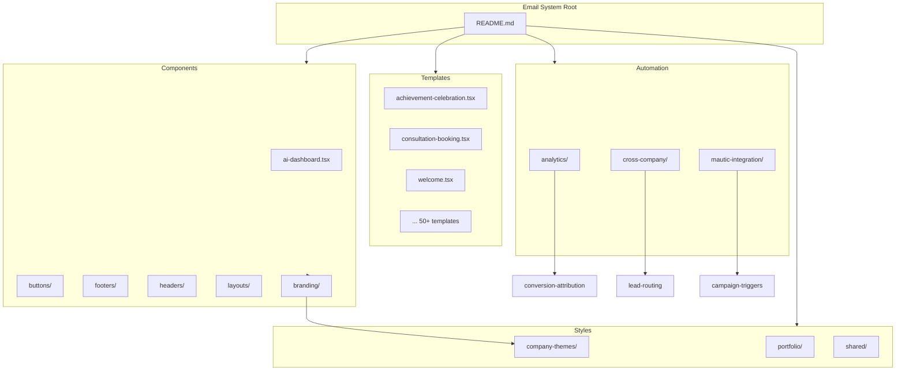
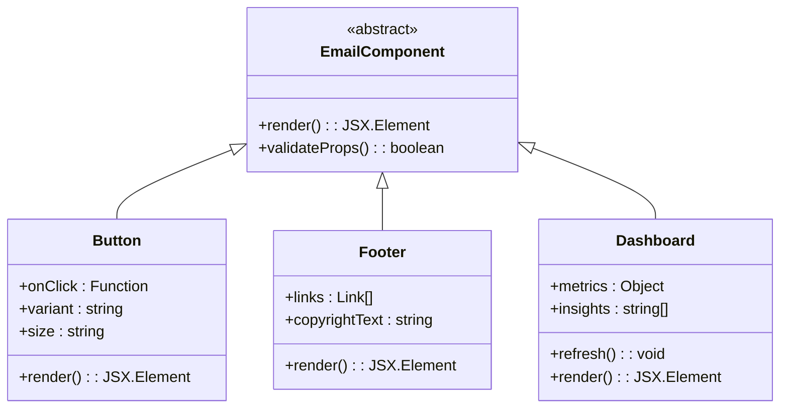
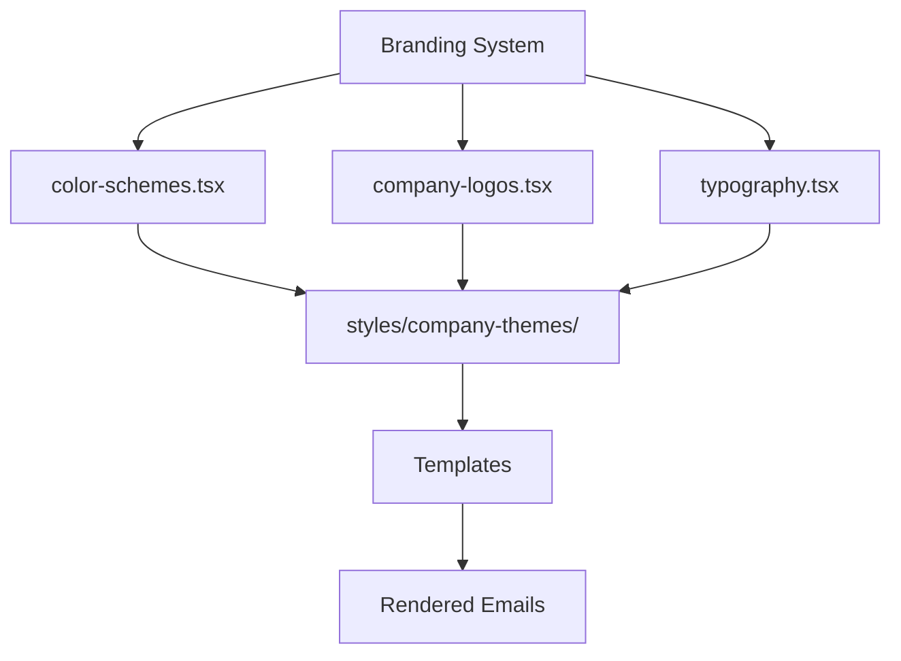
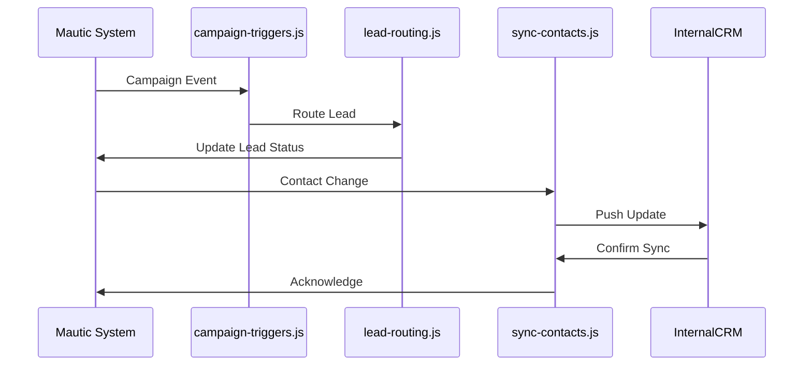
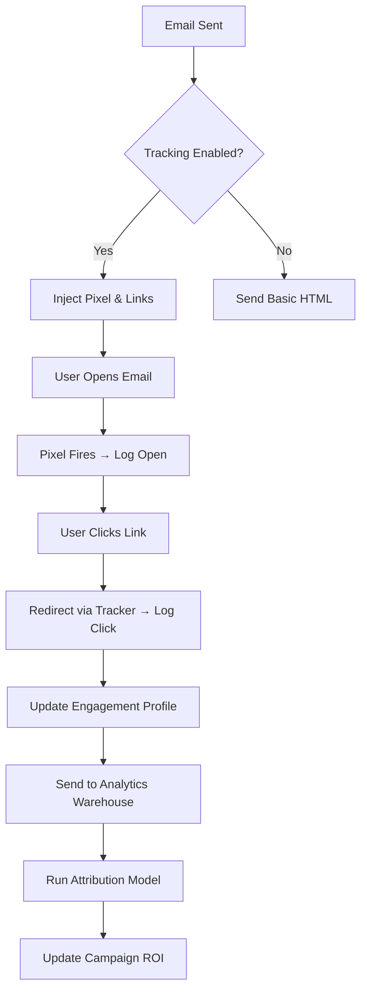

# Email System Architecture

<cite>
**Referenced Files in This Document**   
- [README.md](file://371-os/src/minds371/services/email_system/README.md)
- [ai-dashboard.tsx](file://371-os/src/minds371/services/email_system/components/ai-dashboard.tsx)
- [color-schemes.tsx](file://371-os/src/minds371/services/email_system/components/branding/color-schemes.tsx)
- [company-logos.tsx](file://371-os/src/minds371/services/email_system/components/branding/company-logos.tsx)
- [typography.tsx](file://371-os/src/minds371/services/email_system/components/branding/typography.tsx)
- [cta-button.tsx](file://371-os/src/minds371/services/email_system/components/buttons/cta-button.tsx)
- [demo-button.tsx](file://371-os/src/minds371/services/email_system/components/buttons/demo-button.tsx)
- [social-share-button.tsx](file://371-os/src/minds371/services/email_system/components/buttons/social-share-button.tsx)
- [upgrade-button.tsx](file://371-os/src/minds371/services/email_system/components/buttons/upgrade-button.tsx)
- [company-footer.tsx](file://371-os/src/minds371/services/email_system/components/footers/company-footer.tsx)
- [legal-footer.tsx](file://371-os/src/minds371/services/email_system/components/footers/legal-footer.tsx)
- [conversion-attribution.js](file://371-os/src/minds371/services/email_system/automation/analytics/conversion-attribution.js)
- [email-tracking.js](file://371-os/src/minds371/services/email_system/automation/analytics/email-tracking.js)
- [portfolio-metrics.js](file://371-os/src/minds371/services/email_system/automation/analytics/portfolio-metrics.js)
- [lead-routing.js](file://371-os/src/minds371/services/email_system/automation/cross-company/lead-routing.js)
- [portfolio-nurturing.js](file://371-os/src/minds371/services/email_system/automation/cross-company/portfolio-nurturing.js)
- [upsell-sequences.js](file://371-os/src/minds371/services/email_system/automation/cross-company/upsell-sequences.js)
- [campaign-triggers.js](file://371-os/src/minds371/services/email_system/automation/mautic-integration/campaign-triggers.js)
- [import-templates.js](file://371-os/src/minds371/services/email_system/automation/mautic-integration/import-templates.js)
- [sync-contacts.js](file://371-os/src/minds371/services/email_system/automation/mautic-integration/sync-contacts.js)
</cite>

## Table of Contents
1. [Introduction](#introduction)
2. [Project Structure](#project-structure)
3. [Core Components](#core-components)
4. [Branding System](#branding-system)
5. [Template Engine](#template-engine)
6. [Automation Workflows](#automation-workflows)
7. [Analytics Capabilities](#analytics-capabilities)
8. [Integration Patterns](#integration-patterns)
9. [Implementation Details for Customization](#implementation-details-for-customization)
10. [Conclusion](#conclusion)

## Introduction
The Email System is a modular, React-based email templating and automation platform integrated within the 371 Minds ecosystem. It combines dynamic component rendering with advanced automation workflows and analytics to support personalized, cross-company communication strategies. Built using React Email, it enables developers and marketers to create responsive, branded email templates while supporting integration with Mautic for campaign management and contact synchronization. This document provides a comprehensive overview of its architecture, branding capabilities, template engine, automation logic, analytics, and integration patterns.

## Project Structure
The email system follows a component-driven architecture with clear separation of concerns across templates, UI components, styling, and automation logic. The structure is optimized for scalability and reusability across multiple business units and branding requirements.



**Diagram sources**
- [README.md](file://371-os/src/minds371/services/email_system/README.md)

**Section sources**
- [README.md](file://371-os/src/minds371/services/email_system/README.md)

## Core Components
The core components of the email system are built using React and follow a modular design pattern that promotes reuse and consistency across templates. These components include interactive UI elements such as buttons and dashboards, as well as structural elements like headers and footers.

Key components include:
- **ai-dashboard.tsx**: A dynamic dashboard component that visualizes email performance metrics and AI-driven insights.
- **Button components**: CTA, demo, social share, and upgrade buttons with consistent styling and event handling.
- **Footer components**: Company and legal footers with configurable links and compliance text.

These components are designed to be imported into email templates and rendered server-side using React Email's rendering engine.



**Diagram sources**
- [ai-dashboard.tsx](file://371-os/src/minds371/services/email_system/components/ai-dashboard.tsx)
- [cta-button.tsx](file://371-os/src/minds371/services/email_system/components/buttons/cta-button.tsx)
- [company-footer.tsx](file://371-os/src/minds371/services/email_system/components/footers/company-footer.tsx)

**Section sources**
- [ai-dashboard.tsx](file://371-os/src/minds371/services/email_system/components/ai-dashboard.tsx)
- [cta-button.tsx](file://371-os/src/minds371/services/email_system/components/buttons/cta-button.tsx)
- [demo-button.tsx](file://371-os/src/minds371/services/email_system/components/buttons/demo-button.tsx)
- [social-share-button.tsx](file://371-os/src/minds371/services/email_system/components/buttons/social-share-button.tsx)
- [upgrade-button.tsx](file://371-os/src/minds371/services/email_system/components/buttons/upgrade-button.tsx)
- [company-footer.tsx](file://371-os/src/minds371/services/email_system/components/footers/company-footer.tsx)
- [legal-footer.tsx](file://371-os/src/minds371/services/email_system/components/footers/legal-footer.tsx)

## Branding System
The branding system enables consistent visual identity across all email communications through configurable design tokens and reusable components. It supports multi-tenant scenarios where different companies or departments can maintain unique brand styles.

Branding components include:
- **color-schemes.tsx**: Defines primary, secondary, and accent colors for each brand.
- **company-logos.tsx**: Manages logo variants (light/dark mode, horizontal/vertical) with responsive sizing.
- **typography.tsx**: Specifies font families, sizes, and weights aligned with brand guidelines.

These components are linked to theme files in the `styles/company-themes/` directory, allowing dynamic theme switching based on recipient or campaign context.



**Diagram sources**
- [color-schemes.tsx](file://371-os/src/minds371/services/email_system/components/branding/color-schemes.tsx)
- [company-logos.tsx](file://371-os/src/minds371/services/email_system/components/branding/company-logos.tsx)
- [typography.tsx](file://371-os/src/minds371/services/email_system/components/branding/typography.tsx)

**Section sources**
- [color-schemes.tsx](file://371-os/src/minds371/services/email_system/components/branding/color-schemes.tsx)
- [company-logos.tsx](file://371-os/src/minds371/services/email_system/components/branding/company-logos.tsx)
- [typography.tsx](file://371-os/src/minds371/services/email_system/components/branding/typography.tsx)

## Template Engine
The template engine leverages React Email to compile JSX templates into responsive HTML emails compatible with major email clients. Templates are located in the `templates/` directory and follow a naming convention that reflects their use case (e.g., `welcome.tsx`, `trial-reminder.tsx`).

Each template imports components from the `components/` directory and applies styles from `styles/shared/` or company-specific theme files. The engine supports dynamic data injection via props, enabling personalization at scale.

Example template structure:
```tsx
<EmailTemplate recipient={user} campaign={data}>
  <Header logo={brand.logo} />
  <Body>
    <WelcomeMessage name={user.firstName} />
    <CTAButton url={onboardingLink} />
  </Body>
  <Footer links={legalLinks} />
</EmailTemplate>
```

Templates are pre-rendered server-side and cached for high-performance delivery.

## Automation Workflows
The automation subsystem handles complex workflows across three domains: analytics tracking, cross-company lead management, and Mautic integration.

### Cross-Company Automation
- **lead-routing.js**: Routes incoming leads to appropriate business units based on industry, size, and intent signals.
- **portfolio-nurturing.js**: Executes drip campaigns for portfolio companies with tailored content sequences.
- **upsell-sequences.js**: Triggers revenue expansion workflows based on usage patterns and engagement metrics.

### Mautic Integration
- **campaign-triggers.js**: Listens for Mautic campaign events and initiates downstream actions.
- **import-templates.js**: Converts React Email templates into Mautic-compatible formats.
- **sync-contacts.js**: Bi-directional contact synchronization between internal CRM and Mautic.



**Diagram sources**
- [lead-routing.js](file://371-os/src/minds371/services/email_system/automation/cross-company/lead-routing.js)
- [campaign-triggers.js](file://371-os/src/minds371/services/email_system/automation/mautic-integration/campaign-triggers.js)
- [sync-contacts.js](file://371-os/src/minds371/services/email_system/automation/mautic-integration/sync-contacts.js)

**Section sources**
- [lead-routing.js](file://371-os/src/minds371/services/email_system/automation/cross-company/lead-routing.js)
- [portfolio-nurturing.js](file://371-os/src/minds371/services/email_system/automation/cross-company/portfolio-nurturing.js)
- [upsell-sequences.js](file://371-os/src/minds371/services/email_system/automation/cross-company/upsell-sequences.js)
- [campaign-triggers.js](file://371-os/src/minds371/services/email_system/automation/mautic-integration/campaign-triggers.js)
- [import-templates.js](file://371-os/src/minds371/services/email_system/automation/mautic-integration/import-templates.js)
- [sync-contacts.js](file://371-os/src/minds371/services/email_system/automation/mautic-integration/sync-contacts.js)

## Analytics Capabilities
The analytics module provides deep insight into email performance and conversion impact. It includes client-side tracking and server-side attribution modeling.

Key files:
- **email-tracking.js**: Injects tracking pixels and link wrappers to monitor opens, clicks, and engagement duration.
- **conversion-attribution.js**: Applies multi-touch attribution models to assign credit to email interactions in conversion paths.
- **portfolio-metrics.js**: Aggregates performance data across portfolio companies for benchmarking and trend analysis.

Tracking data is anonymized and aggregated to comply with privacy regulations, with opt-out mechanisms enforced by default.



**Diagram sources**
- [email-tracking.js](file://371-os/src/minds371/services/email_system/automation/analytics/email-tracking.js)
- [conversion-attribution.js](file://371-os/src/minds371/services/email_system/automation/analytics/conversion-attribution.js)
- [portfolio-metrics.js](file://371-os/src/minds371/services/email_system/automation/analytics/portfolio-metrics.js)

**Section sources**
- [email-tracking.js](file://371-os/src/minds371/services/email_system/automation/analytics/email-tracking.js)
- [conversion-attribution.js](file://371-os/src/minds371/services/email_system/automation/analytics/conversion-attribution.js)
- [portfolio-metrics.js](file://371-os/src/minds371/services/email_system/automation/analytics/portfolio-metrics.js)

## Integration Patterns
The email system integrates with external platforms through well-defined patterns:

1. **Mautic Integration**: Uses REST APIs and webhook listeners to synchronize templates, contacts, and campaign data.
2. **CRM Sync**: Bi-directional contact synchronization ensures alignment between marketing and sales databases.
3. **Analytics Pipeline**: Exports engagement data to data warehouses for business intelligence reporting.
4. **AI Dashboard**: Pulls real-time metrics into the `ai-dashboard.tsx` component for executive visibility.

Integration points are configured via environment variables and support OAuth2 authentication for secure access.

## Implementation Details for Customization
To customize the email system:
1. Add new templates in `templates/` using React Email syntax.
2. Extend branding by modifying files in `components/branding/` and adding new themes in `styles/company-themes/`.
3. Create automation scripts in `automation/` directories following existing patterns.
4. Register new Mautic integrations in `mautic-integration/` with proper error handling and rate limiting.

All changes should be tested using the local development server before deployment. Version control and code reviews are enforced via pull request workflows.

## Conclusion
The Email System is a robust, extensible platform for creating branded, automated email communications within the 371 Minds ecosystem. Its component-based architecture, powerful automation workflows, and deep analytics capabilities make it suitable for enterprise-scale marketing operations. The integration with Mautic enhances its campaign management functionality, while the React-based template engine ensures design consistency and developer productivity. With proper customization and configuration, it can support complex cross-company communication strategies and drive measurable business outcomes.