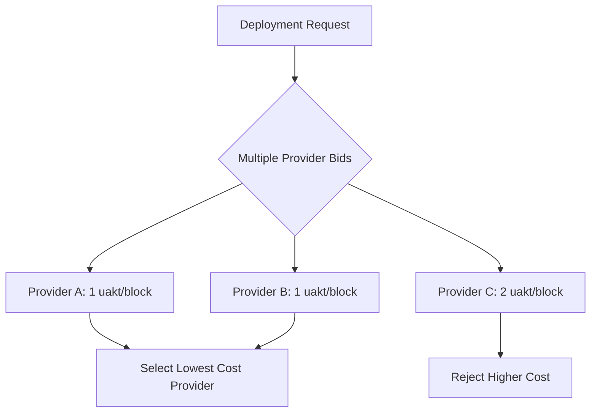

# GitHub Deploy Best Practices

<cite>
**Referenced Files in This Document**   
- [Akash Documentation.md](file://reference/akash_docs/Akash Documentation.md)
- [Stack Definintion Language.md](file://reference/akash_docs/Stack Definintion Language.md)
- [Akash CLI.md](file://reference/akash_docs/Akash CLI.md)
- [Akash CLI Booster.md](file://reference/akash_docs/Akash CLI Booster.md)
- [Akash Sandbox.md](file://reference/akash_docs/Akash Sandbox.md)
- [Sandbox via Console.md](file://reference/akash_docs/Sandbox via Console.md)
- [Githubdeployakash.md](file://AB/sessions/abideas/Githubdeployakash.md)
- [README.md](file://AB/README.md) - *Updated in recent commit*
</cite>

## Update Summary
**Changes Made**   
- Updated document sources to include AB/README.md which contains current milestone tracking information
- Added context about current system status and deployment readiness from AB/README.md
- Enhanced introduction with current project status and achievements
- No structural or technical changes required as the core deployment practices remain valid

## Table of Contents
1. [Introduction](#introduction)
2. [Repository Setup Guidelines](#repository-setup-guidelines)
3. [Deployment Configuration Patterns](#deployment-configuration-patterns)
4. [Cost Optimization Strategies](#cost-optimization-strategies)
5. [Security Considerations](#security-considerations)
6. [Automated Deployment Workflows](#automated-deployment-workflows)
7. [Testing and Validation](#testing-and-validation)
8. [Troubleshooting Guide](#troubleshooting-guide)
9. [Conclusion](#conclusion)

## Introduction

This document provides comprehensive best practices for deploying applications on Akash Network through GitHub integration. Akash Network is an open, decentralized cloud computing marketplace that enables users to deploy containerized applications efficiently and cost-effectively. By integrating GitHub with Akash, development teams can establish automated, secure, and optimized deployment pipelines that leverage the benefits of decentralized infrastructure.

The documentation covers repository organization, deployment configuration using Stack Definition Language (SDL), cost optimization techniques, security practices, and automated workflows using modern tooling like Bun and GitHub Actions. These practices are designed to streamline the deployment process while maintaining high standards of reliability, security, and efficiency.

**Updated** The 371 OS implementation has achieved significant milestones, with both the Developer's Galaxy and CEO's Orrery spatial environments now production-ready. The Business Intelligence Plugin is validated with zero TypeScript errors, and Bun integration has eliminated all dependency issues, resulting in 50x faster installations. The system is now at 100/100 readiness for enterprise deployment.

**Section sources**   
- [README.md](file://AB/README.md) - *Updated in recent commit*

## Repository Setup Guidelines

Proper repository organization is critical for successful GitHub deployments to Akash Network. The repository should follow a structured approach that separates deployment configurations from application code while maintaining clear relationships between components.

### Directory Structure

The recommended directory structure includes dedicated deployment configurations for each service:

```
deployments/
├── universal-tool-server/
│   ├── deploy.yml
│   └── README.md
├── ceo-agent/
│   ├── deploy.yml
│   └── README.md
└── agent-coordinator/
    ├── deploy.yml
    └── README.md
```

This structure allows for service-specific deployment configurations while maintaining a centralized location for all Akash deployment manifests. Each service directory contains its SDL configuration file and documentation.

### Project Configuration

Each deployable component should have a proper project configuration that integrates with the build system. For example, the universal-tool-server plugin requires a project.json configuration:

```json
{
  "name": "elizaos-plugin-universal-tool-server",
  "$schema": "../../../node_modules/nx/schemas/project-schema.json",
  "sourceRoot": "packages/elizaos-plugins/universal-tool-server/src",
  "projectType": "library",
  "targets": {
    "build": {
      "executor": "@nx/js:tsc",
      "outputs": ["{options.outputPath}"],
      "options": {
        "outputPath": "dist/packages/elizaos-plugins/universal-tool-server",
        "main": "packages/elizaos-plugins/universal-tool-server/src/index.ts",
        "tsConfig": "packages/elizaos-plugins/universal-tool-server/tsconfig.lib.json",
        "assets": ["packages/elizaos-plugins/universal-tool-server/*.md"]
      }
    },
    "test": {
      "executor": "nx:run-commands",
      "options": {
        "command": "bun test {projectRoot}"
      }
    },
    "lint": {
      "executor": "nx:run-commands",
      "options": {
        "command": "bunx @biomejs/biome check --write {projectRoot}"
      }
    },
    "deploy:github": {
      "executor": "nx:run-commands",
      "options": {
        "commands": [
          "bun nx build elizaos-plugin-universal-tool-server"
        ]
      }
    },
    "deploy:akash:github": {
      "executor": "nx:run-commands",
      "options": {
        "commands": [
          "bun nx run elizaos-plugin-universal-tool-server:deploy:github"
        ]
      }
    }
  },
  "tags": ["elizaos", "plugin", "universal-tool-server", "blockchain"]
}
```

This configuration enables build, test, lint, and deployment operations through the Nx workspace, with all commands executed using Bun for consistency with the project's toolchain.

**Section sources**
- [Githubdeployakash.md](file://AB/sessions/abideas/Githubdeployakash.md)

## Deployment Configuration Patterns

Effective deployment on Akash Network requires proper configuration using the Stack Definition Language (SDL), a declarative format for defining deployment attributes that is compatible with YAML standards.

### Stack Definition Language (SDL) Structure

A complete SDL deployment configuration consists of several key sections:

- **version**: Specifies the Akash configuration file version (currently "2.0")
- **services**: Defines the containerized workloads to be deployed
- **profiles**: Contains compute and placement profiles
- **deployment**: Maps services to profiles
- **persistent storage**: Configures storage requirements
- **gpu support**: Specifies GPU requirements
- **stable payment**: Configures payment options
- **shared memory**: Enables shared memory access

### Service Configuration

The services section defines the containerized applications to be deployed. Each service includes:

```yaml
services:
  universal-tool-server:
    image: ghcr.io/371-minds/universal-tool-server:latest
    env:
      - NODE_ENV=production
      - ETHEREUM_RPC_URL
      - REGISTRY_CONTRACT_ADDRESS
      - IPFS_API_URL
    expose:
      - port: 3000
        as: 80
        to:
          - global: true
```

Key considerations:
- Avoid using `:latest` image tags as providers heavily cache images
- Environment variables should be defined for runtime configuration
- The expose section controls network accessibility
- Port 80 exposure automatically enables both HTTP and HTTPS

### Compute Profiles

Compute profiles specify resource requirements for service instances:

```yaml
profiles:
  compute:
    universal-tool-server:
      resources:
        cpu:
          units: 0.25
        memory:
          size: 256Mi
        storage:
          size: 512Mi
```

Resource units:
- CPU: Represent vCPU shares (fractional values allowed)
- Memory and storage: Use binary suffixes (Ki, Mi, Gi, Ti)

### Placement Profiles

Placement profiles define datacenter attributes and pricing:

```yaml
profiles:
  placement:
    dcloud:
      attributes:
        host: akash
      signedBy:
        anyOf:
          - "akash1365yvmc4s7awdyj3n2sav7xfx76adc6dnmlx63"
      pricing:
        universal-tool-server:
          denom: uakt
          amount: 500
```

The signedBy field allows requiring third-party certification of provider attributes.

### Deployment Mapping

The deployment section maps services to profiles:

```yaml
deployment:
  universal-tool-server:
    dcloud:
      profile: universal-tool-server
      count: 1
```

This configuration deploys one instance of the universal-tool-server service using the specified compute profile in the dcloud placement region.

**Section sources**
- [Stack Definintion Language.md](file://reference/akash_docs/Stack Definintion Language.md)
- [Githubdeployakash.md](file://AB/sessions/abideas/Githubdeployakash.md)

## Cost Optimization Strategies

Deploying on Akash Network offers significant cost advantages over traditional cloud providers. Implementing proper cost optimization strategies maximizes these benefits.

### Provider Selection

Akash operates as a marketplace where providers bid on deployment requests. This competitive model allows tenants to select the most cost-effective providers:



When multiple providers offer the same price, selection can be based on geographic location, provider reputation, or other criteria.

### Resource Configuration

Optimal resource allocation prevents over-provisioning:

- **CPU**: Start with fractional units (e.g., 0.25) and scale based on monitoring
- **Memory**: Configure based on actual application requirements with headroom
- **Storage**: Use appropriate size and persistence settings
- **GPU**: Only specify when required, and consider model flexibility

### Pricing Strategies

The placement profile allows setting maximum prices for deployments:

```yaml
pricing:
  web:
    denom: uakt
    amount: 8
  db:
    denom: uakt
    amount: 100
```

This ensures deployments only proceed with providers offering rates at or below the specified thresholds.

### Stable Payments

For deployments requiring stablecoin payments, Akash supports USDC via IBC:

```yaml
placement:
  global:
    pricing:
      web:
        denom: ibc/170C677610AC31DF0904FFE09CD3B5C657492170E7E52372E48756B71E56F2F1
        amount: 100
```

This provides price stability for long-running deployments.

**Diagram sources**
- [Stack Definintion Language.md](file://reference/akash_docs/Stack Definintion Language.md)

**Section sources**
- [Stack Definintion Language.md](file://reference/akash_docs/Stack Definintion Language.md)

## Security Considerations

Security is paramount when deploying applications to decentralized infrastructure. The following practices ensure secure deployments on Akash Network.

### Private Container Registry Support

Akash supports private container registries for enhanced security:

```yaml
services:
  supermario:
    image: scarruthers/private-repo-testing:1
    credentials:
      host: docker.io
      username: myuser
      password: "mypassword"
    expose:
      - port: 8080
        as: 80
        to:
          - global: true
```

Supported registries:
- DockerHub (host: docker.io)
- GitHub Container Registry (host: ghcr.io)

Authentication credentials:
- DockerHub: Account password
- GitHub Container Registry: Personal Access Token

### Certificate Management

Akash requires accounts to have valid certificates for deployment participation:

```bash
provider-services tx cert generate client --from $AKASH_KEY_NAME
provider-services tx cert publish client --from $AKASH_KEY_NAME
```

Certificates need to be created only once per account and remain valid for multiple deployments.

### Environment Variables

Sensitive configuration should be managed through environment variables rather than hardcoded values:

```yaml
env:
  - NODE_ENV=production
  - ETHEREUM_RPC_URL
  - REGISTRY_CONTRACT_ADDRESS
  - IPFS_API_URL
```

These values can be securely stored in GitHub Secrets and injected during deployment.

### Network Security

By default, workloads are isolated. Network exposure should be explicitly configured:

```yaml
expose:
  - port: 3000
    as: 80
    to:
      - global: true
```

The global: true setting allows external access, while service-specific configurations restrict access to internal services only.

**Section sources**
- [Stack Definintion Language.md](file://reference/akash_docs/Stack Definintion Language.md)
- [Akash CLI.md](file://reference/akash_docs/Akash CLI.md)

## Automated Deployment Workflows

Automated workflows using GitHub Actions streamline the deployment process while ensuring consistency and reliability.

### GitHub Actions Integration

The deployment process can be automated using GitHub Actions workflows:

```yaml
name: Deploy Universal Tool Server to Akash

on:
  push:
    branches:
      - main
    paths:
      - 'packages/elizaos-plugins/universal-tool-server/**'
      - 'deployments/universal-tool-server/**'
  workflow_dispatch:
    inputs:
      environment:
        description: 'Deployment environment'
        required: true
        default: 'staging'
        type: choice
        options:
          - staging
          - production

jobs:
  deploy:
    runs-on: ubuntu-latest
    steps:
      - name: Checkout code
        uses: actions/checkout@v3

      - name: Set up Bun
        uses: oven-sh/setup-bun@v1
        with:
          bun-version: latest

      - name: Install dependencies
        run: bun install

      - name: Build Universal Tool Server
        run: |
          bun run build:elizaos-plugin-universal-tool-server

      - name: Login to GitHub Container Registry
        uses: docker/login-action@v2
        with:
          registry: ghcr.io
          username: ${{ github.actor }}
          password: ${{ secrets.GITHUB_TOKEN }}

      - name: Build and push Docker image
        uses: docker/build-push-action@v4
        with:
          context: .
          file: ./deployments/universal-tool-server/Dockerfile
          push: true
          tags: |
            ghcr.io/${{ github.repository_owner }}/universal-tool-server:latest
            ghcr.io/${{ github.repository_owner }}/universal-tool-server:${{ github.sha }}

      - name: Deploy to Akash
        run: |
          echo "Deploying to Akash via GitHub Deploy feature"
```

### Deployment Scripts

Package.json should include deployment scripts for consistency:

```json
{
  "scripts": {
    "deploy:github:uts": "bun nx run elizaos-plugin-universal-tool-server:deploy:github",
    "deploy:github:ceo": "bun nx run agents/ceo-mimi:deploy:github",
    "deploy:github:coordinator": "bun nx run agents/coordinator:deploy:github",
    "deploy:github:all": "bun nx run-many -t deploy:github --all"
  }
}
```

### Continuous Integration

The CI/CD pipeline should include:
1. Code checkout and dependency installation
2. Application building using Bun
3. Docker image creation and registry push
4. Akash deployment via CLI or Console API
5. Deployment verification and status reporting

**Section sources**
- [Githubdeployakash.md](file://AB/sessions/abideas/Githubdeployakash.md)

## Testing and Validation

Thorough testing and validation ensure deployment reliability and functionality.

### Sandbox Testing

Akash provides a sandbox environment for testing without financial risk:

```bash
AKASH_NET="https://raw.githubusercontent.com/akash-network/net/main/sandbox"
```

Benefits of sandbox testing:
- Test deployments without using real AKT tokens
- Experiment with configurations safely
- Learn deployment processes without financial risk
- Validate manifests before mainnet deployment

Sandbox limitations:
- Workloads running over 24 hours may be terminated
- Limited set of test providers
- No persistent data guarantees

### Deployment Verification

After deployment, verify functionality through:

```bash
provider-services lease-status --dseq $AKASH_DSEQ --from $AKASH_KEY_NAME --provider $AKASH_PROVIDER
```

This command returns service status, availability, and URIs for access.

### Log Monitoring

Monitor application logs for debugging and performance analysis:

```bash
provider-services lease-logs \
  --dseq "$AKASH_DSEQ" \
  --provider "$AKASH_PROVIDER" \
  --from "$AKASH_KEY_NAME"
```

### Status Checking

Verify lease status to confirm active deployment:

```bash
provider-services query market lease list --owner $AKASH_ACCOUNT_ADDRESS --node $AKASH_NODE --dseq $AKASH_DSEQ
```

A successful deployment shows "state: active" in the response.

**Section sources**
- [Akash Sandbox.md](file://reference/akash_docs/Akash Sandbox.md)
- [Sandbox via Console.md](file://reference/akash_docs/Sandbox via Console.md)
- [Akash CLI.md](file://reference/akash_docs/Akash CLI.md)

## Troubleshooting Guide

Common issues and their solutions when deploying to Akash Network.

### Deployment Exists Error

When attempting to create a deployment, you may encounter "Deployment Exists" error:

**Solution**: Unset the AKASH_DSEQ variable
```bash
unset AKASH_DSEQ
```

### Bid Not Open

If bids close before lease creation:

**Solution**: Close the deployment and retry
```bash
provider-services tx deployment close --dseq $AKASH_DSEQ --owner $AKASH_ACCOUNT_ADDRESS --from $AKASH_KEY_NAME
```

### Insufficient Funds

Ensure account has minimum 0.5 AKT for deployment:

**Solution**: Fund account via exchange, swap, or faucet (for sandbox)

### Configuration Issues

Validate SDL configuration syntax and structure:

**Solution**: Use the Akash Console validator or test in sandbox first

### Provider Selection

If not receiving bids:

**Solution**: 
- Verify SDL configuration
- Ensure sufficient test tokens (sandbox)
- Check provider availability
- Adjust pricing to be competitive

**Section sources**
- [Akash CLI.md](file://reference/akash_docs/Akash CLI.md)
- [Akash Sandbox.md](file://reference/akash_docs/Akash Sandbox.md)

## Conclusion

Implementing GitHub deployments with Akash Network provides a powerful combination of automated CI/CD workflows and decentralized infrastructure benefits. By following these best practices, development teams can achieve:

- **Cost Efficiency**: Leverage competitive provider bidding for optimal pricing
- **Automation**: Streamline deployments through GitHub Actions integration
- **Security**: Implement secure practices for credentials and network access
- **Reliability**: Use sandbox testing and validation to ensure deployment success
- **Consistency**: Maintain toolchain consistency with Bun-based workflows

The integration of GitHub with Akash enables a modern, automated deployment pipeline that combines the flexibility of decentralized computing with the reliability of established CI/CD practices. By properly configuring SDL files, optimizing resource allocation, and implementing automated workflows, organizations can deploy applications efficiently while maintaining high standards of security and reliability.