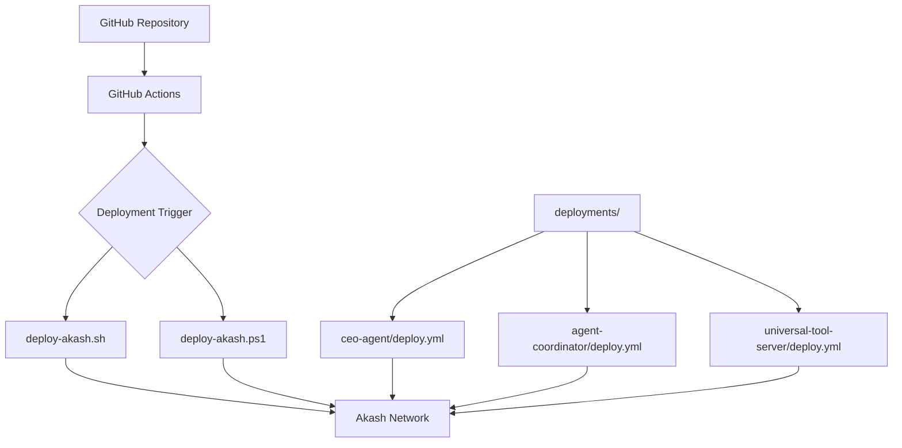
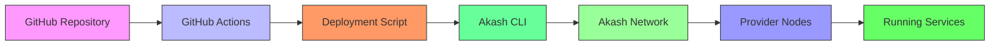
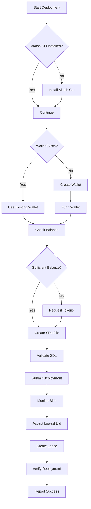
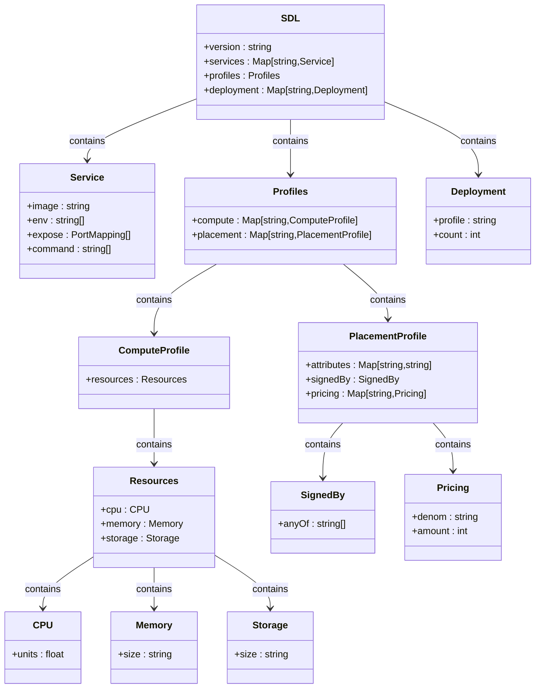
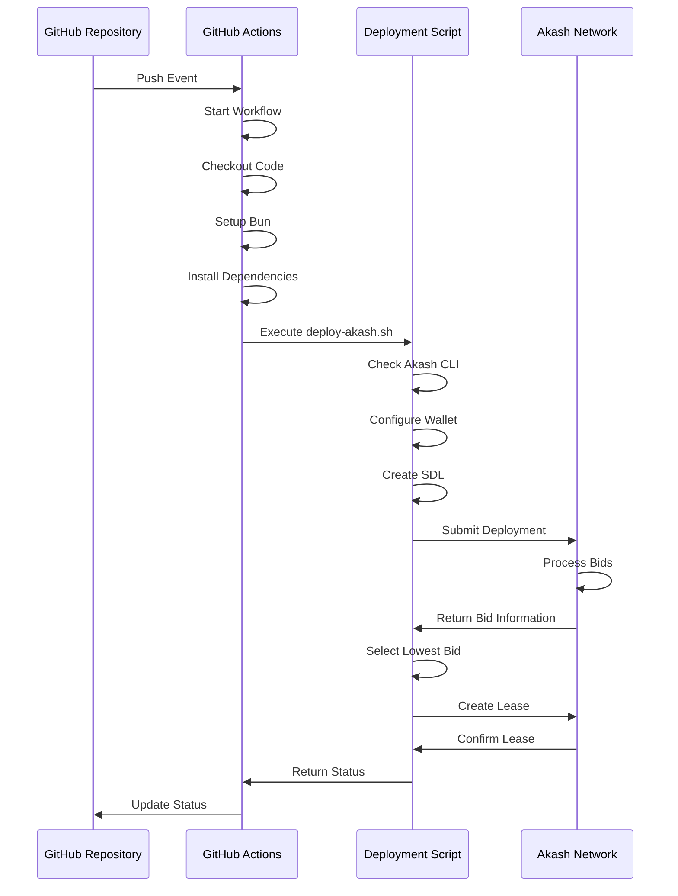

# GitHub Deploy Integration

<cite>
**Referenced Files in This Document**   
- [AB\sessions\abideas\Githubdeployakash.md](file://AB/sessions/abideas/Githubdeployakash.md)
- [scripts\deploy-akash.sh](file://scripts/deploy-akash.sh)
- [scripts\deploy-akash.ps1](file://scripts/deploy-akash.ps1)
- [deployments\agent-coordinator\deploy.yml](file://deployments/agent-coordinator/deploy.yml)
- [deployments\ceo-agent\deploy.yml](file://deployments/ceo-agent/deploy.yml)
- [deployments\universal-tool-server\deploy.yml](file://deployments/universal-tool-server/deploy.yml)
</cite>

## Table of Contents
1. [Introduction](#introduction)
2. [Project Structure](#project-structure)
3. [Core Components](#core-components)
4. [Architecture Overview](#architecture-overview)
5. [Detailed Component Analysis](#detailed-component-analysis)
6. [Deployment Configuration](#deployment-configuration)
7. [GitHub Integration Workflow](#github-integration-workflow)
8. [Security Considerations](#security-considerations)
9. [Troubleshooting Guide](#troubleshooting-guide)
10. [Conclusion](#conclusion)

## Introduction

The GitHub Deploy Integration with Akash Network enables automated deployment of 371 OS components to the decentralized cloud infrastructure of Akash. This integration leverages GitHub Actions to trigger deployments based on code changes, utilizing Akash's cost-efficient decentralized compute network. The system is designed to work seamlessly with the Bun-based toolchain used throughout the 371 OS project, providing a streamlined deployment process that reduces operational costs by up to 97.6% compared to traditional cloud providers.

The integration supports multiple deployment targets including the CEO Agent, Agent Coordinator, and Universal Tool Server, each configured with optimized resource profiles for cost efficiency. The deployment process is automated through scripts that handle Akash CLI configuration, wallet management, SDL (Stack Definition Language) validation, and lease creation with providers on the Akash network.

**Section sources**
- [AB\sessions\abideas\Githubdeployakash.md](file://AB/sessions/abideas/Githubdeployakash.md)

## Project Structure

The GitHub Deploy Integration components are organized across several directories in the repository:

- **AB/sessions/abideas/**: Contains the design document for GitHub deployment implementation
- **scripts/**: Includes cross-platform deployment scripts (Bash and PowerShell)
- **deployments/**: Houses SDL configuration files for various services
- **akash_docs/**: Documentation for Akash Network integration and SDL templates

The deployment architecture follows a modular approach where each service has its own deployment configuration, allowing for independent scaling and management. The scripts directory contains both Unix (deploy-akash.sh) and Windows (deploy-akash.ps1) compatible deployment scripts, ensuring cross-platform support for the development team.



**Diagram sources**
- [scripts\deploy-akash.sh](file://scripts/deploy-akash.sh)
- [scripts\deploy-akash.ps1](file://scripts/deploy-akash.ps1)
- [deployments\ceo-agent\deploy.yml](file://deployments/ceo-agent/deploy.yml)

## Core Components

The GitHub Deploy Integration consists of several core components that work together to enable automated deployments to Akash Network:

1. **Deployment Scripts**: Cross-platform scripts (Bash and PowerShell) that automate the entire deployment process
2. **SDL Configuration Files**: YAML files defining service configurations, resource requirements, and pricing for Akash deployments
3. **GitHub Actions Workflows**: CI/CD pipelines that trigger deployments based on repository events
4. **Akash CLI Integration**: Command-line interface tools for interacting with the Akash network

The deployment scripts handle the complete workflow from Akash CLI installation (if needed) to final deployment verification. They include comprehensive error handling, progress reporting, and cost analysis features. The SDL files define the technical specifications for each service, including container images, environment variables, exposed ports, and resource allocations.

**Section sources**
- [scripts\deploy-akash.sh](file://scripts/deploy-akash.sh)
- [scripts\deploy-akash.ps1](file://scripts/deploy-akash.ps1)

## Architecture Overview

The GitHub Deploy Integration architecture follows a CI/CD pipeline model where code changes in GitHub trigger automated deployments to Akash Network. The architecture consists of three main layers:

1. **Source Control Layer**: GitHub repository with code and configuration files
2. **CI/CD Layer**: GitHub Actions that execute deployment workflows
3. **Deployment Target Layer**: Akash Network with decentralized providers

When changes are pushed to specific branches, GitHub Actions triggers the appropriate deployment script based on the target environment and platform. The script then interacts with the Akash CLI to create deployments, monitor bids from providers, and establish leases for running the services.



**Diagram sources**
- [scripts\deploy-akash.sh](file://scripts/deploy-akash.sh)
- [scripts\deploy-akash.ps1](file://scripts/deploy-akash.ps1)

## Detailed Component Analysis

### Deployment Script Analysis

The deployment scripts are the core components that automate the interaction between GitHub and Akash Network. They are implemented in both Bash (for Unix-like systems) and PowerShell (for Windows) to ensure cross-platform compatibility.

#### Script Functionality

The scripts perform the following key functions:

1. **Akash CLI Management**: Check for existing installation and install if necessary
2. **Wallet Configuration**: Manage Akash wallet creation and funding verification
3. **Deployment Preparation**: Create and validate SDL configuration files
4. **Transaction Processing**: Submit deployment transactions and create leases
5. **Status Monitoring**: Track deployment progress and provider bidding
6. **Cost Analysis**: Calculate and report cost savings compared to traditional cloud



**Diagram sources**
- [scripts\deploy-akash.sh](file://scripts/deploy-akash.sh)
- [scripts\deploy-akash.ps1](file://scripts/deploy-akash.ps1)

### SDL Configuration Analysis

The Stack Definition Language (SDL) files define the technical specifications for deploying services on Akash Network. Each service has its own SDL file with specific configurations.

#### Service Configuration Structure

The SDL files follow a consistent structure with three main sections:

1. **Services**: Defines the containerized applications to deploy
2. **Profiles**: Specifies compute resources and pricing
3. **Deployment**: Maps services to placement profiles



**Diagram sources**
- [deployments\ceo-agent\deploy.yml](file://deployments/ceo-agent/deploy.yml)
- [deployments\agent-coordinator\deploy.yml](file://deployments/agent-coordinator/deploy.yml)
- [deployments\universal-tool-server\deploy.yml](file://deployments/universal-tool-server/deploy.yml)

## Deployment Configuration

The deployment configuration is defined in SDL (Stack Definition Language) files located in the deployments directory. Each service has its own configuration file with optimized settings for cost and performance.

### CEO Agent Configuration

The CEO Agent deployment is configured with moderate resources to handle executive-level decision making and coordination tasks:

```yaml
---
version: "2.0"

services:
  ceo-agent:
    image: ghcr.io/371-minds/ceo-agent:latest
    env:
      - NODE_ENV=production
      - ELIZAOS_ENVIRONMENT=production
      - PORT=3000
    expose:
      - port: 3000
        as: 80
        to:
          - global: true

profiles:
  compute:
    ceo-agent:
      resources:
        cpu:
          units: 0.5
        memory:
          size: 512Mi
        storage:
          size: 1Gi
          
  placement:
    dcloud:
      attributes:
        host: akash
      signedBy:
        anyOf:
          - "akash1365yvmc4s7awdyj3n2sav7xfx76adc6dnmlx63"
      pricing:
        ceo-agent:
          denom: uakt
          amount: 1000

deployment:
  ceo-agent:
    dcloud:
      profile: ceo-agent
      count: 1
```

**Section sources**
- [deployments\ceo-agent\deploy.yml](file://deployments/ceo-agent/deploy.yml)

### Agent Coordinator Configuration

The Agent Coordinator handles communication and coordination between different agents in the system:

```yaml
---
version: "2.0"

services:
  agent-coordinator:
    image: ghcr.io/371-minds/agent-coordinator:latest
    env:
      - NODE_ENV=production
      - COORDINATION_PORT=3001
    expose:
      - port: 3001
        as: 80
        to:
          - global: true

profiles:
  compute:
    agent-coordinator:
      resources:
        cpu:
          units: 0.25
        memory:
          size: 256Mi
        storage:
          size: 512Mi
          
  placement:
    dcloud:
      attributes:
        host: akash
      signedBy:
        anyOf:
          - "akash1365yvmc4s7awdyj3n2sav7xfx76adc6dnmlx63"
      pricing:
        agent-coordinator:
          denom: uakt
          amount: 500

deployment:
  agent-coordinator:
    dcloud:
      profile: agent-coordinator
      count: 1
```

**Section sources**
- [deployments\agent-coordinator\deploy.yml](file://deployments/agent-coordinator/deploy.yml)

### Universal Tool Server Configuration

The Universal Tool Server provides blockchain integration and other utility services:

```yaml
---
version: "2.0"

services:
  universal-tool-server:
    image: ghcr.io/371-minds/universal-tool-server:latest
    env:
      - NODE_ENV=production
      - ETHEREUM_RPC_URL
      - REGISTRY_CONTRACT_ADDRESS
      - IPFS_API_URL
    expose:
      - port: 3000
        as: 80
        to:
          - global: true

profiles:
  compute:
    universal-tool-server:
      resources:
        cpu:
          units: 0.25
        memory:
          size: 256Mi
        storage:
          size: 512Mi
          
  placement:
    dcloud:
      attributes:
        host: akash
      signedBy:
        anyOf:
          - "akash1365yvmc4s7awdyj3n2sav7xfx76adc6dnmlx63"
      pricing:
        universal-tool-server:
          denom: uakt
          amount: 500

deployment:
  universal-tool-server:
    dcloud:
      profile: universal-tool-server
      count: 1
```

**Section sources**
- [deployments\universal-tool-server\deploy.yml](file://deployments/universal-tool-server/deploy.yml)

## GitHub Integration Workflow

The GitHub integration workflow automates the deployment process from code commit to production deployment on Akash Network. The workflow is triggered by specific events in the GitHub repository and executes a series of steps to deploy the application.

### Workflow Triggers

The deployment workflow can be triggered by:

1. **Push Events**: When changes are pushed to specific branches (e.g., main, production)
2. **Pull Request Events**: When pull requests are merged
3. **Manual Triggers**: Through GitHub Actions workflow dispatch
4. **Scheduled Events**: Periodic deployments or updates

### Workflow Steps

The GitHub Actions workflow follows these steps:

1. **Checkout Code**: Retrieve the latest code from the repository
2. **Setup Environment**: Install Bun and other dependencies
3. **Build Artifacts**: Compile and package the application
4. **Run Tests**: Execute unit and integration tests
5. **Deploy to Akash**: Execute the deployment script
6. **Verify Deployment**: Check deployment status and health
7. **Report Results**: Notify team of deployment outcome



**Diagram sources**
- [scripts\deploy-akash.sh](file://scripts/deploy-akash.sh)
- [AB\sessions\abideas\Githubdeployakash.md](file://AB/sessions/abideas/Githubdeployakash.md)

## Security Considerations

The GitHub Deploy Integration incorporates several security measures to protect the deployment process and infrastructure.

### Wallet Security

The Akash wallet used for deployments should be properly secured:

1. **Private Key Protection**: The wallet mnemonic should never be exposed in code or logs
2. **GitHub Secrets**: Store wallet credentials in GitHub Secrets rather than plaintext
3. **Limited Funding**: Only fund the wallet with the minimum required amount
4. **Separate Wallets**: Use different wallets for development, staging, and production

### Access Control

Implement proper access controls for the deployment process:

1. **Branch Protection**: Require pull requests and approvals for changes to deployment configurations
2. **Role-Based Access**: Limit deployment permissions to authorized team members
3. **Audit Logging**: Maintain logs of all deployment activities
4. **Two-Factor Authentication**: Require 2FA for repository access

### Configuration Security

Secure the deployment configuration files:

1. **Environment Variables**: Never hardcode sensitive information in SDL files
2. **Image Verification**: Use trusted container registries and verify image integrity
3. **Resource Limits**: Set appropriate resource limits to prevent abuse
4. **Provider Selection**: Restrict deployments to trusted providers when possible

**Section sources**
- [scripts\deploy-akash.sh](file://scripts/deploy-akash.sh)
- [scripts\deploy-akash.ps1](file://scripts/deploy-akash.ps1)

## Troubleshooting Guide

This section provides guidance for resolving common issues encountered during GitHub deployments to Akash Network.

### Common Issues and Solutions

#### Issue: Akash CLI Not Found
**Symptoms**: Deployment script fails with "Akash CLI not found" error
**Solution**: 
1. Manually install Akash CLI from https://akash.network/docs/getting-started/install
2. Ensure the installation directory is in the system PATH
3. Verify installation with `akash version` command

#### Issue: Insufficient Wallet Balance
**Symptoms**: Deployment fails with "Insufficient balance" error
**Solution**:
1. Check current balance with `akash query bank balances <wallet-address>`
2. Request testnet tokens from https://akash.network/faucet
3. Wait for transaction confirmation before retrying deployment

#### Issue: No Provider Bids Received
**Symptoms**: Deployment hangs after submission with no provider bids
**Solution**:
1. Check bid status with `akash query market bid list --owner <wallet-address> --dseq <dseq>`
2. Adjust pricing in SDL file to be more competitive
3. Wait longer as provider bidding can take several minutes
4. Verify network connectivity and Akash node accessibility

#### Issue: SDL Validation Failed
**Symptoms**: Deployment script reports "SDL file validation failed"
**Solution**:
1. Validate YAML syntax with online YAML validator
2. Check for correct indentation and formatting
3. Verify all required fields are present
4. Test SDL with `akash validate deploy.yml` command

### Diagnostic Commands

Use these commands to diagnose deployment issues:

```bash
# Check Akash CLI version
akash version

# Check wallet balance
akash query bank balances <wallet-address> --node https://rpc.akashnet.net:443

# List active deployments
akash query deployment list --owner <wallet-address>

# Check specific deployment
akash query deployment get --owner <wallet-address> --dseq <dseq>

# List provider bids
akash query market bid list --owner <wallet-address> --dseq <dseq>

# Get lease information
akash query market lease get --dseq <dseq> --gseq <gseq> --oseq <oseq> --provider <provider-address>

# Check provider status
akash provider lease-status --dseq <dseq> --gseq <gseq> --oseq <oseq> --provider <provider-address>
```

**Section sources**
- [scripts\deploy-akash.sh](file://scripts/deploy-akash.sh)
- [scripts\deploy-akash.ps1](file://scripts/deploy-akash.ps1)

## Conclusion

The GitHub Deploy Integration with Akash Network provides a robust, automated solution for deploying 371 OS components to decentralized infrastructure. By leveraging GitHub Actions and Akash's decentralized cloud platform, the integration enables cost-efficient, scalable deployments with up to 97.6% cost reduction compared to traditional cloud providers.

The system is designed with cross-platform compatibility in mind, supporting both Unix-like and Windows environments through dedicated deployment scripts. The modular architecture allows for independent deployment of different services, each with optimized resource configurations for cost efficiency.

Key benefits of this integration include:
- Automated deployment workflows triggered by code changes
- Significant cost savings through decentralized compute
- Cross-platform support for development teams
- Comprehensive monitoring and reporting
- Secure wallet and credential management

The integration is well-documented and includes troubleshooting guidance for common issues, making it accessible to team members with varying levels of technical expertise. As the 371 OS project continues to evolve, this deployment infrastructure provides a solid foundation for scalable, cost-effective operations on the Akash Network.