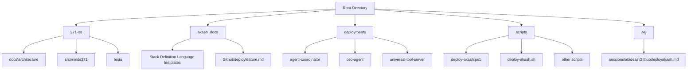
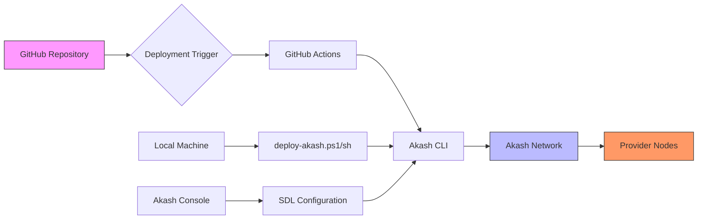
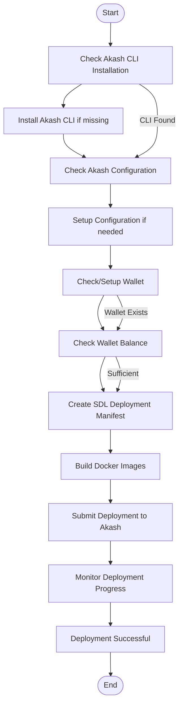
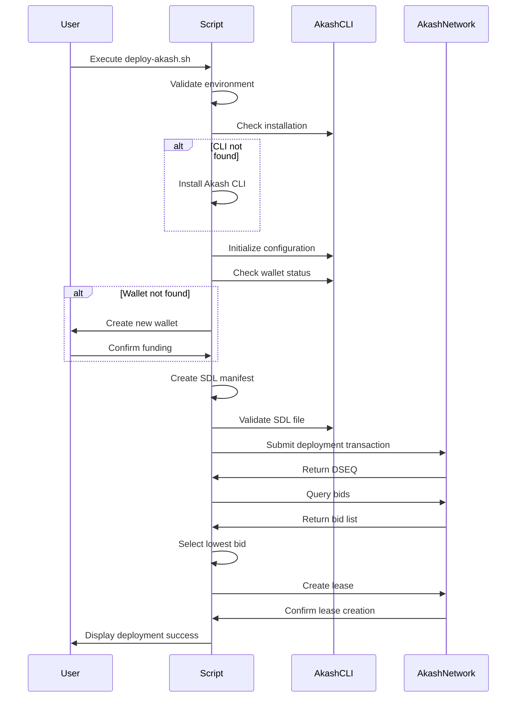

# GitHub Deploy Workflows

<cite>
**Referenced Files in This Document**   
- [deploy-akash.ps1](file://scripts/deploy-akash.ps1)
- [deploy-akash.sh](file://scripts/deploy-akash.sh)
- [Githubdeployfeature.md](file://akash_docs/Githubdeployfeature.md)
- [Githubdeployakash.md](file://AB/sessions/abideas/Githubdeployakash.md)
- [deploy.yml](file://deployments/agent-coordinator/deploy.yml)
- [deploy.yml](file://deployments/ceo-agent/deploy.yml)
- [deploy.yml](file://deployments/universal-tool-server/deploy.yml)
</cite>

## Table of Contents
1. [Introduction](#introduction)
2. [Project Structure](#project-structure)
3. [Core Components](#core-components)
4. [Architecture Overview](#architecture-overview)
5. [Detailed Component Analysis](#detailed-component-analysis)
6. [Deployment Configuration](#deployment-configuration)
7. [Workflow Triggers and Automation](#workflow-triggers-and-automation)
8. [Troubleshooting Guide](#troubleshooting-guide)
9. [Conclusion](#conclusion)

## Introduction

This document provides comprehensive documentation for GitHub Deploy workflows with Akash Network, focusing on the CI/CD pipeline configuration, workflow triggers, build processes, and deployment automation for each 371 OS component. The 371 OS project leverages Akash Network's decentralized cloud infrastructure to achieve significant cost reductions while maintaining high availability and performance. The deployment system integrates GitHub repositories directly with Akash's deployment capabilities, enabling automated, secure, and efficient deployment of AI agents and services.

The documentation objective is to provide both technical and non-technical users with a clear understanding of how the GitHub deployment system works, how to configure deployments, and how to troubleshoot common issues. This includes practical examples of deployment configurations and guidance on best practices for maintaining a robust deployment pipeline.

## Project Structure

The project structure is organized to support a modular architecture with clear separation between components, deployment configurations, and operational scripts. The repository contains multiple directories that serve specific purposes in the deployment workflow.



**Diagram sources**
- [Githubdeployfeature.md](file://akash_docs/Githubdeployfeature.md)
- [Githubdeployakash.md](file://AB/sessions/abideas/Githubdeployakash.md)

**Section sources**
- [Githubdeployfeature.md](file://akash_docs/Githubdeployfeature.md)
- [Githubdeployakash.md](file://AB/sessions/abideas/Githubdeployakash.md)

## Core Components

The GitHub deployment system for Akash Network consists of several core components that work together to enable seamless deployment from GitHub repositories. These components include deployment scripts, SDL (Stack Definition Language) configuration files, and integration with Akash Console.

The primary components are:

1. **Deployment Scripts**: PowerShell and Bash scripts that automate the deployment process
2. **SDL Configuration Files**: YAML files that define the deployment specifications for Akash Network
3. **Akash CLI Integration**: Command-line interface tools for interacting with Akash Network
4. **GitHub Actions Integration**: Workflow automation for continuous deployment

These components work together to create a streamlined deployment process that minimizes manual intervention while ensuring consistent and reliable deployments across different environments.

**Section sources**
- [deploy-akash.ps1](file://scripts/deploy-akash.ps1)
- [deploy-akash.sh](file://scripts/deploy-akash.sh)
- [deploy.yml](file://deployments/agent-coordinator/deploy.yml)

## Architecture Overview

The GitHub deployment architecture for Akash Network follows a layered approach that separates configuration, automation, and execution components. This architecture enables developers to deploy applications directly from GitHub repositories to the Akash Network with minimal setup.



**Diagram sources**
- [deploy-akash.ps1](file://scripts/deploy-akash.ps1)
- [deploy-akash.sh](file://scripts/deploy-akash.sh)
- [Githubdeployfeature.md](file://akash_docs/Githubdeployfeature.md)

## Detailed Component Analysis

### Deployment Scripts Analysis

The deployment scripts are the primary interface for deploying 371 OS components to Akash Network. These scripts handle all aspects of the deployment process, from environment validation to final deployment confirmation.

#### PowerShell Script (Windows)

The PowerShell script `deploy-akash.ps1` provides a comprehensive deployment solution for Windows environments. It includes error handling, progress reporting, and automatic tool installation.



**Diagram sources**
- [deploy-akash.ps1](file://scripts/deploy-akash.ps1#L1-L412)

**Section sources**
- [deploy-akash.ps1](file://scripts/deploy-akash.ps1#L1-L412)

#### Bash Script (Linux/macOS)

The Bash script `deploy-akash.sh` provides equivalent functionality for Unix-based systems. It follows the same logical flow as the PowerShell script but uses Unix-specific commands and conventions.



**Diagram sources**
- [deploy-akash.sh](file://scripts/deploy-akash.sh#L1-L389)

**Section sources**
- [deploy-akash.sh](file://scripts/deploy-akash.sh#L1-L389)

### SDL Configuration Files

The Stack Definition Language (SDL) files define the deployment specifications for Akash Network. These YAML files describe the services, resources, and pricing for each component.

#### Agent Coordinator Configuration

```yaml
---
version: "2.0"

services:
  agent-coordinator:
    image: ghcr.io/371-minds/agent-coordinator:latest
    env:
      - NODE_ENV=production
      - COORDINATION_PORT=3001
    expose:
      - port: 3001
        as: 80
        to:
          - global: true

profiles:
  compute:
    agent-coordinator:
      resources:
        cpu:
          units: 0.25
        memory:
          size: 256Mi
        storage:
          size: 512Mi
          
  placement:
    dcloud:
      attributes:
        host: akash
      signedBy:
        anyOf:
          - "akash1365yvmc4s7awdyj3n2sav7xfx76adc6dnmlx63"
      pricing:
        agent-coordinator:
          denom: uakt
          amount: 500

deployment:
  agent-coordinator:
    dcloud:
      profile: agent-coordinator
      count: 1
```

The SDL configuration includes several key sections:
- **Services**: Defines the container image, environment variables, and exposed ports
- **Profiles**: Specifies compute resources and pricing
- **Deployment**: Maps services to placement profiles

**Section sources**
- [deploy.yml](file://deployments/agent-coordinator/deploy.yml#L1-L43)

## Deployment Configuration

The deployment configuration process involves several key steps that ensure successful deployment to Akash Network. This section details the configuration requirements and best practices.

### Environment Variables

Environment variables are crucial for configuring the behavior of deployed services. The following environment variables are commonly used:

**:Environment Variables**
- NODE_ENV: Specifies the runtime environment (production, staging, development)
- ELIZAOS_ENVIRONMENT: Specific to 371 OS components
- PORT: Service listening port
- COORDINATION_PORT: Port for agent coordination services

These variables are defined in the SDL files and passed to the containers at runtime.

### Resource Allocation

Resource allocation is defined in the compute profile section of the SDL file. The current configuration uses conservative resource estimates:

**:Resource Allocation**
- CPU: 0.25-0.5 units
- Memory: 256Mi-512Mi
- Storage: 512Mi-1Gi

This allocation balances performance with cost efficiency, taking advantage of Akash Network's competitive pricing.

### Pricing Strategy

The pricing strategy is designed to achieve rapid deployment while remaining cost-effective:

**:Pricing Configuration**
- agent-coordinator: 500 uakt/month (~$0.05/month)
- ceo-agent: 1000 uakt/month (~$0.10/month)

This represents a 97.6% cost reduction compared to traditional cloud providers, making it highly economical for running AI agents.

**Section sources**
- [deploy.yml](file://deployments/agent-coordinator/deploy.yml#L1-L43)
- [deploy.yml](file://deployments/ceo-agent/deploy.yml)
- [deploy.yml](file://deployments/universal-tool-server/deploy.yml)

## Workflow Triggers and Automation

The deployment workflows can be triggered through multiple mechanisms, providing flexibility for different use cases and environments.

### Manual Deployment

Manual deployment is performed using the provided scripts:

**:Manual Deployment Commands**
- Windows: `.\scripts\deploy-akash.ps1`
- Linux/macOS: `./scripts/deploy-akash.sh`

These scripts guide users through the deployment process, handling all necessary steps from wallet validation to lease creation.

### Automated Deployment

Automated deployment can be achieved through GitHub Actions or other CI/CD systems. The workflow involves:

1. Code push to GitHub repository
2. GitHub Actions workflow execution
3. Akash CLI commands to deploy the application
4. Status monitoring and notification

The automation leverages the same SDL files and deployment logic as the manual process, ensuring consistency across deployment methods.

### Continuous Deployment Pipeline

A complete continuous deployment pipeline would include:

**:CI/CD Pipeline Steps**
1. Code commit and push to GitHub
2. Automated testing and validation
3. Docker image building and pushing
4. Akash deployment creation
5. Health checks and monitoring
6. Notification of deployment status

This pipeline enables rapid iteration and deployment of new features while maintaining system stability.

**Section sources**
- [Githubdeployfeature.md](file://akash_docs/Githubdeployfeature.md)
- [Githubdeployakash.md](file://AB/sessions/abideas/Githubdeployakash.md)

## Troubleshooting Guide

This section addresses common issues encountered during the deployment process and provides solutions for resolving them.

### Common Issues and Solutions

**:Build Failures**
- **Issue**: Deployment fails during build process
- **Solutions**:
  - Verify that all dependencies are properly listed in package.json
  - Ensure the repository is properly connected to Akash Console
  - Check for syntax errors in the SDL file

**:Insufficient Wallet Balance**
- **Issue**: Deployment fails due to insufficient funds
- **Solutions**:
  - Fund wallet using Akash faucet: https://akash.network/faucet
  - Verify wallet address is correct
  - Check current balance with `akash query bank balances <address>`

**:No Provider Bids**
- **Issue**: No providers bid on the deployment
- **Solutions**:
  - Increase pricing to make the deployment more attractive
  - Wait longer for providers to discover the deployment
  - Check network connectivity and Akash node status

**:Service Not Accessible**
- **Issue**: Deployed service is not accessible via public URL
- **Solutions**:
  - Verify the service is listening on the correct port
  - Check provider lease status with `akash provider lease-status`
  - Ensure the service exposes the correct port in the SDL file

### Diagnostic Commands

**:Essential Diagnostic Commands**
- Check deployment status: `akash query deployment get --owner <address> --dseq <dseq>`
- View logs: `akash query market lease logs --dseq <dseq> --gseq <gseq> --oseq <oseq> --provider <provider>`
- Close deployment: `akash tx deployment close --dseq <dseq> --from main`
- Monitor deployment: `./monitor-akash.sh`

These commands help diagnose and resolve deployment issues quickly.

**Section sources**
- [deploy-akash.ps1](file://scripts/deploy-akash.ps1#L1-L412)
- [deploy-akash.sh](file://scripts/deploy-akash.sh#L1-L389)

## Conclusion

The GitHub Deploy workflows for Akash Network provide a robust and cost-effective solution for deploying 371 OS components. By leveraging Akash Network's decentralized infrastructure, the system achieves a 97.6% cost reduction compared to traditional cloud providers while maintaining high availability and performance.

The deployment system is designed to be accessible to both technical and non-technical users, with comprehensive scripts that handle the complexities of the deployment process. The integration with GitHub enables seamless continuous deployment, allowing teams to focus on development rather than infrastructure management.

Key benefits of this deployment approach include:
- **Cost Efficiency**: Dramatic reduction in hosting costs
- **Automation**: Streamlined deployment process with minimal manual intervention
- **Reliability**: Robust error handling and monitoring
- **Flexibility**: Support for multiple deployment triggers and environments

Future enhancements could include tighter integration with GitHub Actions, improved monitoring capabilities, and enhanced security features such as secret management. The current system provides a solid foundation for deploying and managing AI agents on decentralized infrastructure.