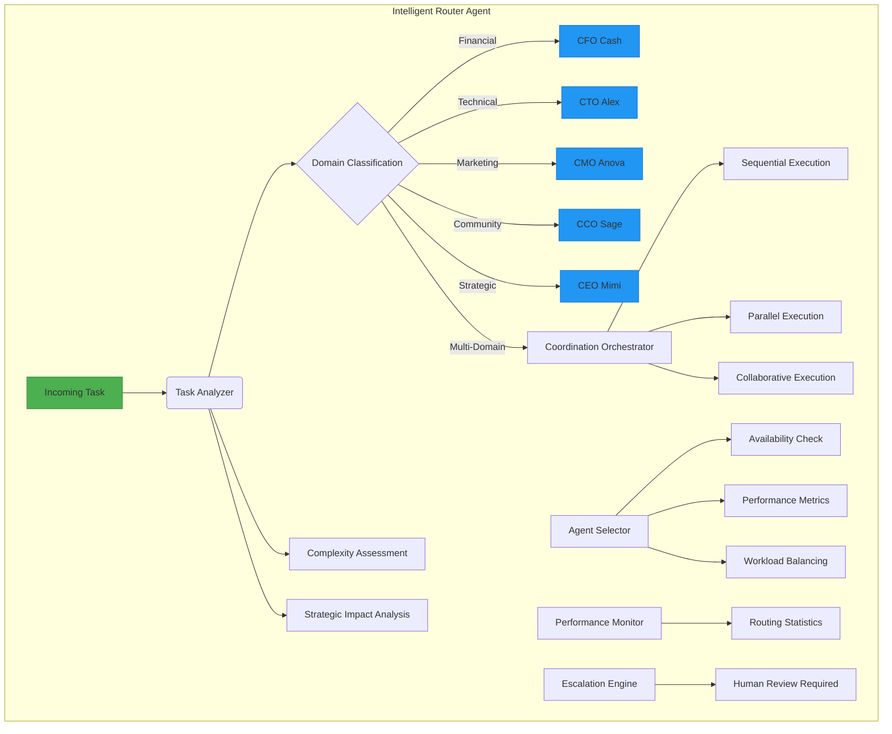
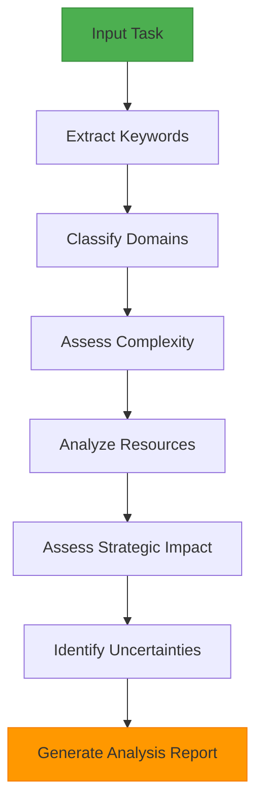
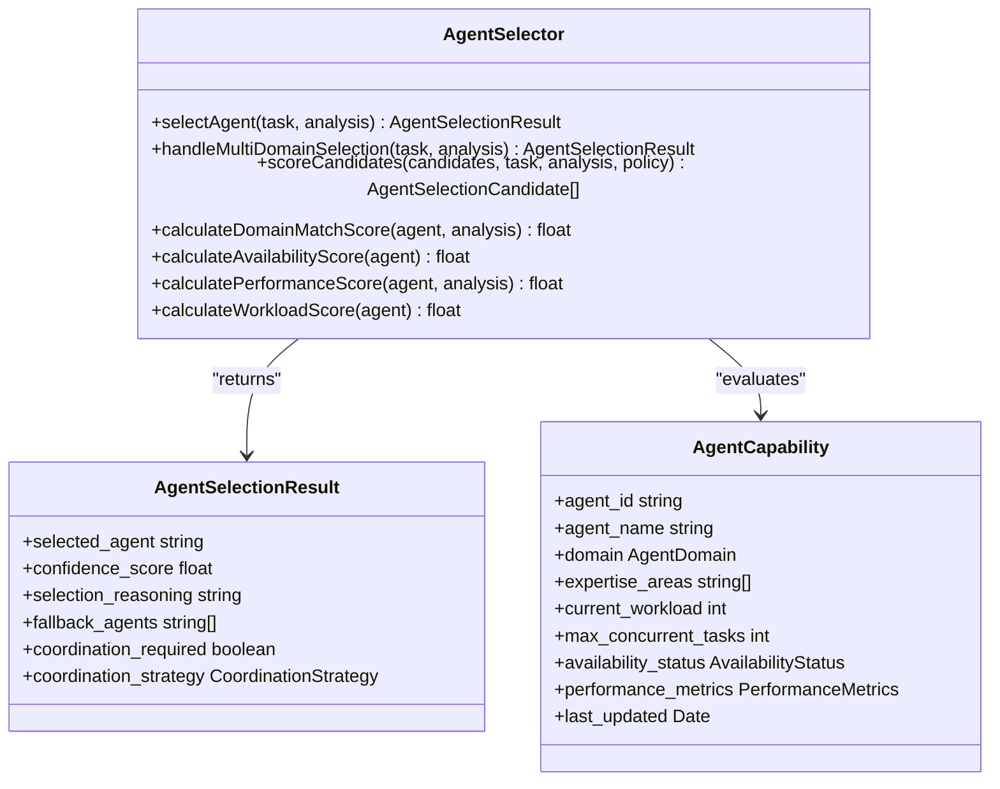
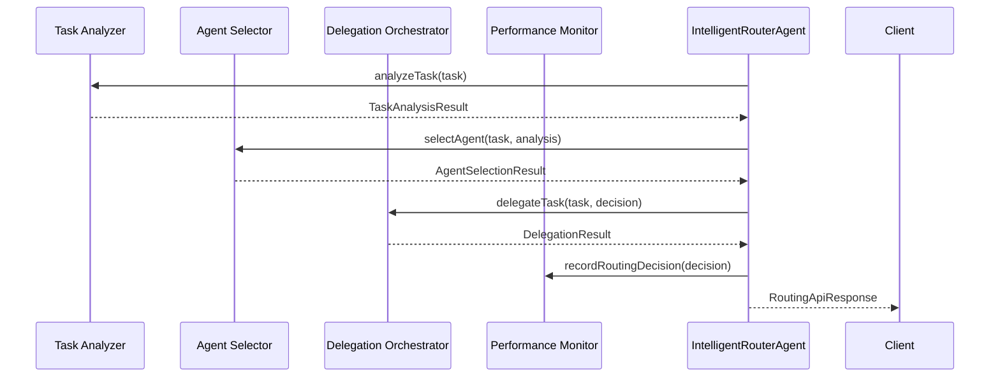
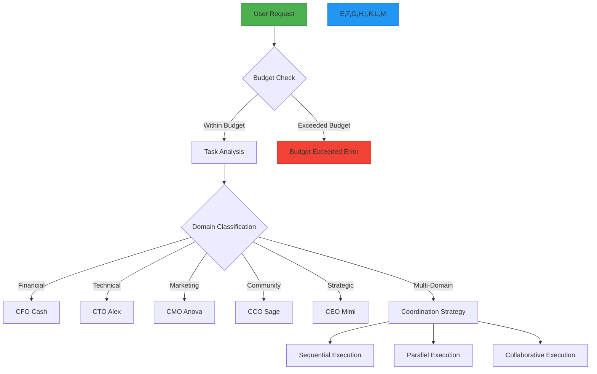

# Intelligent Router Agent

<cite>
**Referenced Files in This Document**   
- [intelligent_router.yml](file://os-workspace/libs/prompts/agent-definitions/intelligent_router.yml)
- [intelligent_router_agent.py](file://_legacy/adaptive_llm_router/intelligent_router_agent.py)
- [index.ts](file://os-workspace/apps/intelligent-router/src/index.ts)
- [router-engine.ts](file://os-workspace/apps/intelligent-router/src/router-engine.ts)
- [task-analyzer.ts](file://os-workspace/apps/intelligent-router/src/task-analyzer.ts)
- [agent-selector.ts](file://os-workspace/apps/intelligent-router/src/agent-selector.ts)
- [Adaptive_Router_Logic.md](file://371-os/Adaptive_Router_Logic.md)
</cite>

## Table of Contents
1. [Introduction](#introduction)
2. [Architecture Overview](#architecture-overview)
3. [Core Components](#core-components)
4. [API Interfaces](#api-interfaces)
5. [Integration with C-Suite Agents](#integration-with-c-suite-agents)
6. [Routing Decision Examples](#routing-decision-examples)
7. [Troubleshooting Guide](#troubleshooting-guide)

## Introduction

The Intelligent Router Agent serves as the central nervous system for task routing within the 371 OS ecosystem. It functions as a sophisticated decision-making engine that analyzes incoming tasks and intelligently delegates them to the most appropriate C-Suite agents based on content analysis, strategic priorities, and agent capabilities.

This agent implements a unified brain/body architecture where the "brain" consists of its decision logic defined in configuration files, while the "body" comprises the implementation components that execute routing operations. The router follows a systematic process of task analysis, domain classification, agent selection, and delegation orchestration to ensure optimal task distribution across the agent ecosystem.

The Intelligent Router Agent is designed with adaptability at its core, continuously learning from routing outcomes to improve future decisions. It balances multiple factors including domain expertise, workload distribution, historical performance, and strategic importance when making routing decisions.

**Section sources**
- [intelligent_router.yml](file://os-workspace/libs/prompts/agent-definitions/intelligent_router.yml#L1-L124)
- [Adaptive_Router_Logic.md](file://371-os/Adaptive_Router_Logic.md#L1-L36)

## Architecture Overview

The Intelligent Router Agent follows a modular architecture with distinct components working together to process and route tasks efficiently. The system is built around a unified brain/body architecture where configuration defines behavior while implementation handles execution.



**Diagram sources**
- [index.ts](file://os-workspace/apps/intelligent-router/src/index.ts#L29-L365)
- [router-engine.ts](file://os-workspace/apps/intelligent-router/src/router-engine.ts#L31-L482)
- [Adaptive_Router_Logic.md](file://371-os/Adaptive_Router_Logic.md#L1-L36)

## Core Components

The Intelligent Router Agent consists of several interconnected components that work together to analyze tasks and make intelligent routing decisions. Each component has a specific responsibility within the routing workflow.

### Task Analyzer

The Task Analyzer performs comprehensive content analysis of incoming tasks to extract metadata, classify domains, assess complexity, and identify routing requirements. It uses keyword matching, pattern recognition, and contextual analysis to understand task characteristics.



**Diagram sources**
- [task-analyzer.ts](file://os-workspace/apps/intelligent-router/src/task-analyzer.ts#L17-L413)

### Agent Selector

The Agent Selector determines the most appropriate agent(s) for a task based on capabilities, availability, workload, and historical performance. It evaluates candidates using a weighted scoring system that considers multiple factors.



**Diagram sources**
- [agent-selector.ts](file://os-workspace/apps/intelligent-router/src/agent-selector.ts#L39-L586)

### Router Engine

The Router Engine orchestrates the entire routing process, coordinating between the Task Analyzer, Agent Selector, and Delegation Orchestrator. It manages the workflow from task validation through final delegation.



**Diagram sources**
- [router-engine.ts](file://os-workspace/apps/intelligent-router/src/router-engine.ts#L31-L482)

**Section sources**
- [index.ts](file://os-workspace/apps/intelligent-router/src/index.ts#L29-L365)
- [router-engine.ts](file://os-workspace/apps/intelligent-router/src/router-engine.ts#L31-L482)
- [task-analyzer.ts](file://os-workspace/apps/intelligent-router/src/task-analyzer.ts#L17-L413)
- [agent-selector.ts](file://os-workspace/apps/intelligent-router/src/agent-selector.ts#L39-L586)

## API Interfaces

The Intelligent Router Agent provides a comprehensive API for task analysis, routing, and system monitoring. These interfaces enable seamless integration with other components of the 371 OS ecosystem.

### Primary Routing Methods

```mermaid
classDiagram
class IntelligentRouterAgent {
+routeTask(task) Promise~RoutingApiResponse<RoutingDecision>~
+analyzeAndDelegate(task) Promise~RoutingApiResponse<RoutingDecision>~
+getStatistics() Promise~any~
+getPerformanceReport(days) Promise~any~
+healthCheck() Promise~{healthy : boolean, details : Record<string, any>}~
+updateConfiguration(newConfig) void
+shutdown() Promise~void~
}
class RoutingTask {
+id string
+title string
+description string
+priority TaskPriority
+domain_hints AgentDomain[]
+resource_requirements ResourceRequirement[]
+strategic_importance boolean
+deadline Date
+submitted_at Date
+submitted_by string
}
class RoutingDecision {
+success boolean
+primary_agent string
+confidence_score float
+routing_rationale string
+alternative_agents string[]
+coordination_required boolean
+estimated_completion_time number
+escalation_required boolean
+decision_timestamp Date
}
IntelligentRouterAgent --> RoutingTask : "accepts"
IntelligentRouterAgent --> RoutingDecision : "returns"
```

**Diagram sources**
- [index.ts](file://os-workspace/apps/intelligent-router/src/index.ts#L55-L85)

### Configuration Structure

The agent's behavior is defined by a comprehensive configuration structure that includes routing policies, escalation rules, and performance targets.

```json
{
  "agent_name": "Intelligent Router Agent",
  "agent_type": "intelligent_router",
  "routing_policies": {
    "domain_classification": {
      "financial": {
        "keywords": ["financial", "budget", "revenue"],
        "primary_agent": "CFO Cash",
        "fallback_agents": ["Financial Analyst"],
        "confidence_threshold": 0.8
      },
      "technical": {
        "keywords": ["technical", "development", "architecture"],
        "primary_agent": "CTO Alex",
        "fallback_agents": ["Technical Lead"],
        "confidence_threshold": 0.8
      }
    },
    "workload_balancing": {
      "max_concurrent_tasks": 5,
      "priority_multiplier": 1.5,
      "availability_check_required": true,
      "fallback_threshold": 0.7
    }
  },
  "escalation_rules": {
    "uncertainty_threshold": 0.6,
    "multi_domain_complexity": 3,
    "resource_conflict_detection": true
  },
  "performance_targets": {
    "routing_accuracy": 0.95,
    "average_response_time": 500,
    "delegation_success_rate": 0.90,
    "escalation_rate": 0.05
  }
}
```

**Section sources**
- [intelligent_router.yml](file://os-workspace/libs/prompts/agent-definitions/intelligent_router.yml#L1-L124)
- [index.ts](file://os-workspace/apps/intelligent-router/src/index.ts#L29-L365)

## Integration with C-Suite Agents

The Intelligent Router Agent integrates with various C-Suite agents according to predefined routing policies and domain classifications. It maintains awareness of each agent's capabilities, availability, and performance metrics.

### C-Suite Agent Capabilities

| Agent | Domain | Primary Responsibilities | Key Keywords |
|-------|------|--------------------------|------------|
| CEO Mimi | Strategic | Strategic planning, executive decisions, organizational vision | strategic, planning, vision, roadmap, leadership |
| CFO Cash | Financial | Financial analysis, budget management, investment decisions | financial, budget, revenue, cost, investment, ROI |
| CTO Alex | Technical | Technical implementation, software development, security | technical, development, architecture, security, code |
| CMO Anova | Marketing | Marketing campaigns, brand management, customer engagement | marketing, campaign, brand, promotion, growth |
| CCO Sage | Community | Community engagement, stakeholder relations, governance | community, outreach, stakeholder, governance, partnership |

### Routing Workflow



**Diagram sources**
- [Adaptive_Router_Logic.md](file://371-os/Adaptive_Router_Logic.md#L1-L36)
- [intelligent_router.yml](file://os-workspace/libs/prompts/agent-definitions/intelligent_router.yml#L1-L124)

**Section sources**
- [intelligent_router.yml](file://os-workspace/libs/prompts/agent-definitions/intelligent_router.yml#L1-L124)
- [Adaptive_Router_Logic.md](file://371-os/Adaptive_Router_Logic.md#L1-L36)

## Routing Decision Examples

The following examples illustrate how the Intelligent Router Agent processes different types of tasks and makes intelligent routing decisions.

### Example 1: Financial Analysis Request

When receiving a request to "Analyze Q3 financial performance and identify cost optimization opportunities," the agent:

1. Extracts keywords: "financial," "performance," "cost," "optimization"
2. Classifies domain: Financial (confidence score: 0.92)
3. Selects primary agent: CFO Cash
4. Generates rationale: "Routed to CFO Cash based on financial domain classification (confidence: 0.92). Task complexity: 0.65. Strategic impact: HIGH."
5. Executes delegation to CFO Cash agent

### Example 2: Technical Implementation Request

For a request to "Implement secure authentication system with multi-factor authentication," the agent:

1. Extracts keywords: "implement," "secure," "authentication," "multi-factor"
2. Classifies domain: Technical (confidence score: 0.88)
3. Selects primary agent: CTO Alex
4. Identifies resource requirements: Security specialist, computational resources
5. Generates rationale: "Routed to CTO Alex based on technical domain classification (confidence: 0.88). Task requires security expertise and infrastructure implementation."
6. Executes delegation to CTO Alex agent

### Example 3: Multi-Domain Product Launch

When processing a request to "Launch new product requiring technical development, marketing campaign, and financial planning," the agent:

1. Extracts keywords: "launch," "product," "technical," "marketing," "financial," "planning"
2. Classifies domains: Technical (score: 0.75), Marketing (score: 0.70), Financial (score: 0.65)
3. Identifies multi-domain complexity
4. Selects coordination strategy: Collaborative Execution
5. Designates primary agent: CEO Mimi (strategic oversight)
6. Coordinates delegation to CTO Alex (technical), CMO Anova (marketing), and CFO Cash (financial)
7. Generates rationale: "Multi-domain coordination required with collaborative execution strategy. Primary agent CEO Mimi for overall direction with specialized agents handling domain-specific aspects."

**Section sources**
- [intelligent_router.yml](file://os-workspace/libs/prompts/agent-definitions/intelligent_router.yml#L1-L124)
- [router-engine.ts](file://os-workspace/apps/intelligent-router/src/router-engine.ts#L31-L482)

## Troubleshooting Guide

This section addresses common issues that may occur with the Intelligent Router Agent and provides guidance for resolution.

### Common Issues and Solutions

| Issue | Symptoms | Root Cause | Solution |
|-------|---------|----------|----------|
| Routing Failures | Tasks not being delegated, escalation rate above 5% | Low confidence in domain classification, missing keywords | Update domain keyword lists in configuration, add domain hints to tasks |
| Performance Degradation | Increased response time (>750ms), timeout errors | High concurrent load, resource constraints | Adjust max_concurrent_routings in configuration, optimize system resources |
| Incorrect Agent Selection | Tasks routed to wrong agents, delegation success rate <90% | Outdated agent registry, inaccurate performance metrics | Refresh agent registry, recalibrate performance scoring |
| Escalation Overload | Excessive human review requests | Overly sensitive escalation rules, ambiguous tasks | Adjust uncertainty_threshold, provide clearer task descriptions |
| Configuration Loading Errors | Default brain definition used, custom policies ignored | Missing or invalid intelligent_router.yml file | Verify file path and syntax, ensure required fields are present |

### Health Check Procedures

Regular health checks should be performed to ensure the agent is functioning properly:

1. **System Status**: Verify the agent is initialized and workers are started
2. **Component Health**: Check status of Task Analyzer, Agent Selector, and Performance Monitor
3. **Resource Utilization**: Monitor memory usage, CPU consumption, and active routings
4. **Performance Metrics**: Review routing accuracy, response time, and error rates
5. **Configuration Validation**: Ensure brain definition is loaded correctly with all required fields

The `healthCheck()` method provides comprehensive system diagnostics and should be called regularly to monitor agent health.

### Monitoring and Optimization

Key performance indicators should be monitored to maintain optimal routing efficiency:

- **Routing Accuracy**: Target ≥95% correct routing decisions
- **Average Response Time**: Target ≤500ms per routing decision
- **Delegation Success Rate**: Target ≥90% successful delegations
- **Escalation Rate**: Target ≤5% of tasks requiring human intervention

Performance can be optimized by:
- Regularly updating domain keyword lists based on routing outcomes
- Fine-tuning confidence thresholds for domain classification
- Adjusting workload balancing parameters based on agent availability
- Incorporating feedback from completed tasks to improve future decisions

**Section sources**
- [index.ts](file://os-workspace/apps/intelligent-router/src/index.ts#L29-L365)
- [router-engine.ts](file://os-workspace/apps/intelligent-router/src/router-engine.ts#L31-L482)
- [intelligent_router.yml](file://os-workspace/libs/prompts/agent-definitions/intelligent_router.yml#L1-L124)