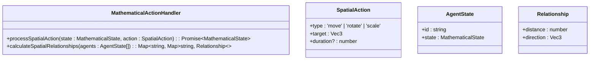

# Mathematical State Management

<cite>
**Referenced Files in This Document**   
- [math-bridge.ts](file://core/os-workspace/packages/src/lib/math-bridge.ts)
- [thinng-foundation.ts](file://core/os-workspace/packages/src/lib/thinng-foundation.ts)
- [types.ts](file://core/os-workspace/packages/src/lib/types.ts)
- [State Management.md](file://documentation/reference/elizaos/Guides/State Management.md)
</cite>

## Table of Contents
1. [Introduction](#introduction)
2. [Core Components](#core-components)
3. [Mathematical State Interface](#mathematical-state-interface)
4. [Mathematical Memory Provider](#mathematical-memory-provider)
5. [Mathematical Action Handler](#mathematical-action-handler)
6. [Mathematical Utilities](#mathematical-utilities)
7. [Integration with ElizaOS State Management](#integration-with-elizaos-state-management)
8. [Practical Examples](#practical-examples)
9. [Troubleshooting Guide](#troubleshooting-guide)

## Introduction
Mathematical State Management provides a robust framework for integrating mathematical precision into state management within the ElizaOS ecosystem. By leveraging the thi.ng mathematical library, this system enhances spatial computing, geometric operations, and performance optimization for autonomous agents. The implementation bridges ElizaOS core types with advanced mathematical operations, enabling precise spatial transformations, optimized data structures, and enhanced memory management.

## Core Components
The Mathematical State Management system consists of several key components that work together to provide mathematical precision in state operations. These components include the MathematicalState interface, MathematicalMemoryProvider class, MathematicalActionHandler class, and ElizaMathUtils utility class. Each component plays a specific role in enhancing the mathematical capabilities of the state management system.

**Section sources**
- [math-bridge.ts](file://core/os-workspace/packages/src/lib/math-bridge.ts#L20-L488)
- [thinng-foundation.ts](file://core/os-workspace/packages/src/lib/thinng-foundation.ts#L1-L454)

## Mathematical State Interface
The MathematicalState interface extends the base State interface with mathematical properties for spatial computing. It includes position, rotation, scale, velocity, and acceleration vectors, as well as spatial properties such as bounding box, center, and radius. This interface enables precise spatial calculations and transformations within the agent environment.


**Diagram sources**
- [math-bridge.ts](file://core/os-workspace/packages/src/lib/math-bridge.ts#L20-L34)
- [types.ts](file://core/os-workspace/packages/src/lib/types.ts#L138-L156)

## Mathematical Memory Provider
The MathematicalMemoryProvider class implements the IMemoryProvider interface with mathematical optimizations. It maintains a spatial index for efficient memory retrieval based on spatial relationships. The provider enhances memory sorting by combining temporal recency with spatial relevance, ensuring that memories close in both time and space are prioritized.


**Diagram sources**
- [math-bridge.ts](file://core/os-workspace/packages/src/lib/math-bridge.ts#L39-L309)

## Mathematical Action Handler
The MathematicalActionHandler class provides static methods for processing spatial actions with mathematical precision. It supports move, rotate, and scale operations with smooth interpolation based on duration. The handler automatically updates spatial properties such as bounding box and center when state changes occur, maintaining consistency in the spatial representation.



**Diagram sources**
- [math-bridge.ts](file://core/os-workspace/packages/src/lib/math-bridge.ts#L314-L435)

## Mathematical Utilities
The ElizaMathUtils class provides utility functions for converting between ElizaOS state and mathematical state representations. It handles the transformation of position, rotation, and scale properties between object notation and array notation, ensuring compatibility between different parts of the system.


**Diagram sources**
- [math-bridge.ts](file://core/os-workspace/packages/src/lib/math-bridge.ts#L440-L488)

## Integration with ElizaOS State Management
The Mathematical State Management system integrates with ElizaOS state management through the composeState method. This integration allows for the inclusion of mathematical providers when specific spatial data is needed. The system leverages caching for performance while providing options to skip cache when data freshness is critical.


**Diagram sources**
- [State Management.md](file://documentation/reference/elizaos/Guides/State Management.md#L1-L1160)
- [math-bridge.ts](file://core/os-workspace/packages/src/lib/math-bridge.ts#L20-L488)

## Practical Examples
### Example 1: Processing Spatial Move Action
```typescript
const initialState: MathematicalState = {
  position: [0, 0, 0],
  rotation: [0, 0, 0],
  scale: [1, 1, 1]
};

const action = {
  type: 'move' as const,
  target: [5, 5, 5] as Vec3,
  duration: 1
};

const newState = await MathematicalActionHandler.processSpatialAction(
  initialState,
  action
);
```

### Example 2: Calculating Spatial Relationships
```typescript
const agents = [
  {
    id: 'agent1',
    state: { position: [0, 0, 0] } as MathematicalState
  },
  {
    id: 'agent2',
    state: { position: [3, 4, 0] } as MathematicalState
  }
];

const relationships = MathematicalActionHandler.calculateSpatialRelationships(agents);
```

### Example 3: Converting Between State Formats
```typescript
const elizaState = {
  bio: {
    position: { x: 1, y: 2, z: 3 },
    rotation: { x: 0.1, y: 0.2, z: 0.3 },
    scale: { x: 2, y: 2, z: 2 }
  }
};

const mathState = ElizaMathUtils.toMathematicalState(elizaState as any);
const backToEliza = ElizaMathUtils.fromMathematicalState(mathState);
```

**Section sources**
- [math-bridge.ts](file://core/os-workspace/packages/src/lib/math-bridge.ts#L314-L488)
- [thinng-foundation.test.ts](file://core/os-workspace/packages/src/lib/thinng-foundation.test.ts#L446-L529)

## Troubleshooting Guide
### Common Issues and Solutions
#### 1. Stale Cache Data
**Problem**: State contains outdated information
**Solution**: Force fresh data by setting skipCache parameter to true in composeState method.

#### 2. Provider Timeout Issues
**Problem**: Slow providers blocking state composition
**Solution**: Implement timeouts in provider get methods using Promise.race with a timeout promise.

#### 3. Memory Leaks from Cache
**Problem**: Cache grows indefinitely
**Solution**: Implement cache size limits using a bounded cache with LRU eviction policy.

#### 4. Circular Provider Dependencies
**Problem**: Providers depending on each other
**Solution**: Use provider positioning and cached state instead of calling composeState within providers.

**Section sources**
- [State Management.md](file://documentation/reference/elizaos/Guides/State Management.md#L789-L991)
- [math-bridge.ts](file://core/os-workspace/packages/src/lib/math-bridge.ts#L39-L309)