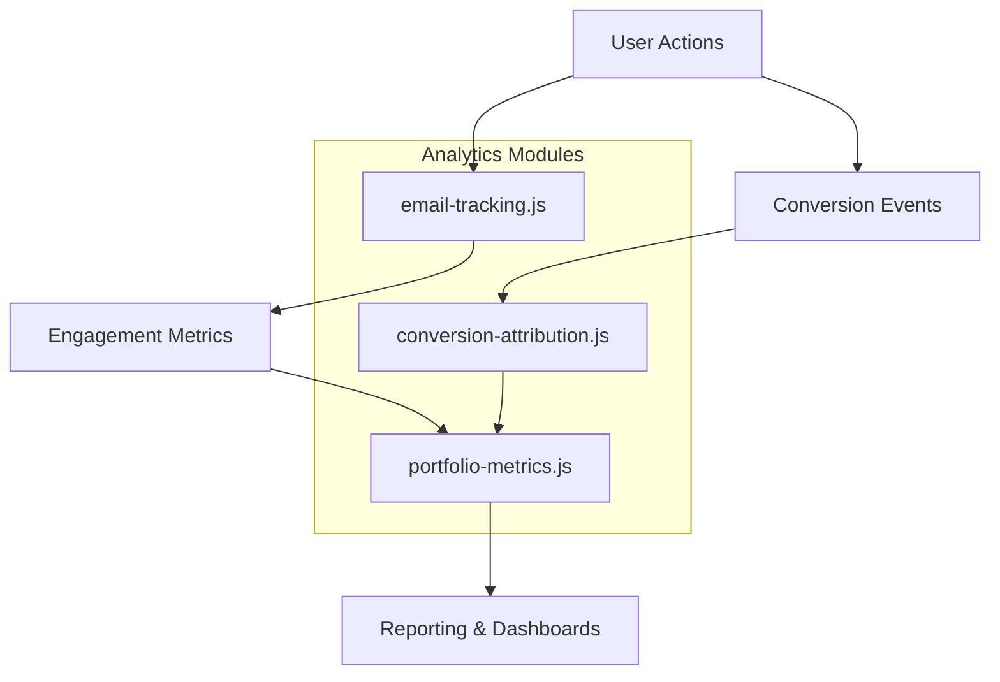
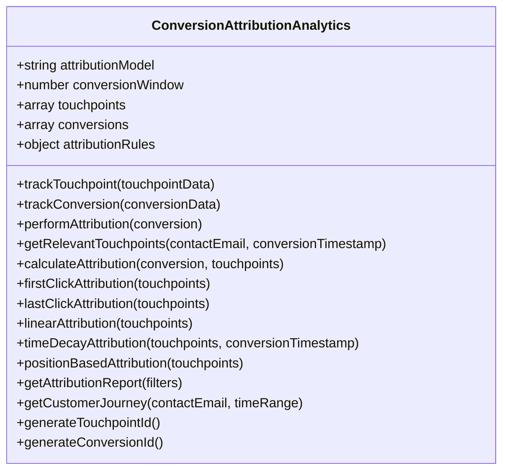
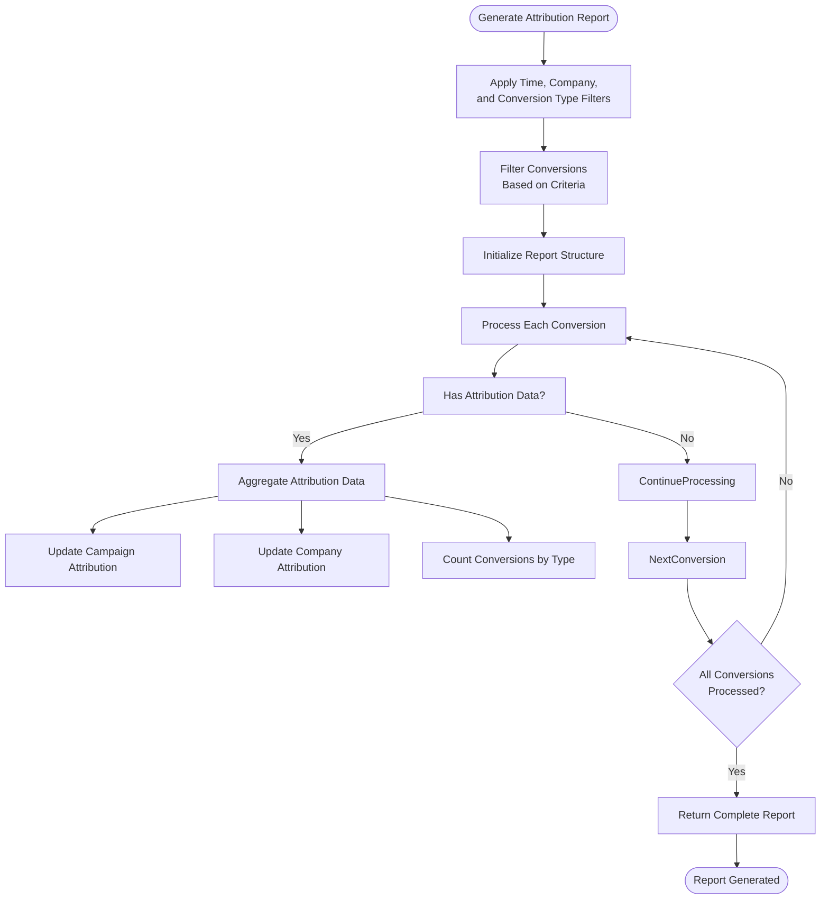
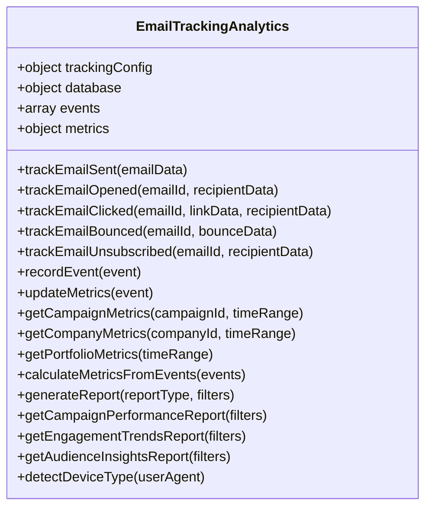
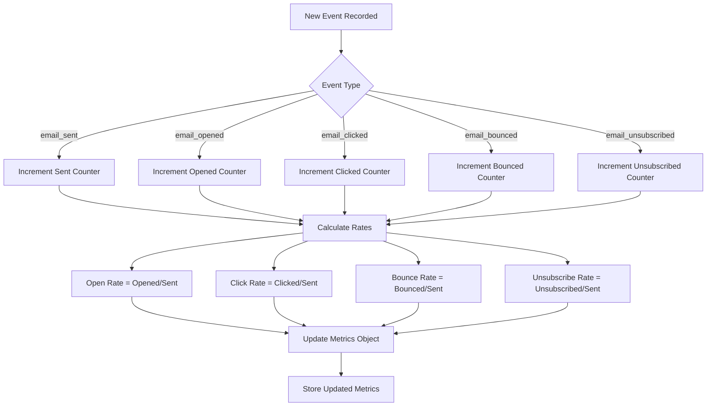
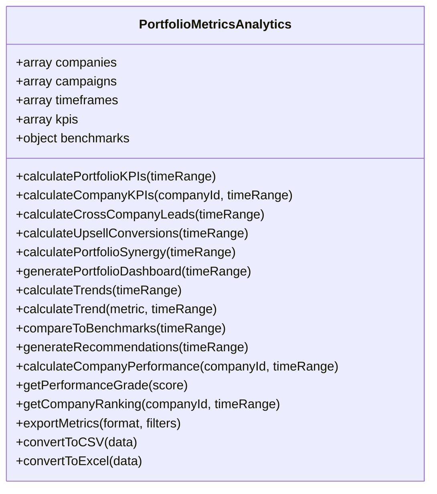
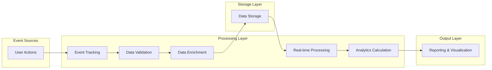
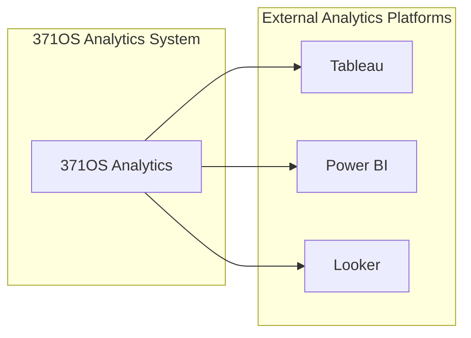

# Analytics and User Behavior Tracking

<cite>
**Referenced Files in This Document**   
- [conversion-attribution.js](file://371-os\src\minds371\services\email_system\automation\analytics\conversion-attribution.js)
- [email-tracking.js](file://371-os\src\minds371\services\email_system\automation\analytics\email-tracking.js)
- [portfolio-metrics.js](file://371-os\src\minds371\services\email_system\automation\analytics\portfolio-metrics.js)
- [color-schemes.tsx](file://371-os\src\minds371\services\email_system\components\branding\color-schemes.tsx) - *Updated in recent commit*
- [animations.css](file://371-os\src\minds371\services\email_system\styles\shared\animations.css) - *Added animation effects in recent commit*
</cite>

## Update Summary
**Changes Made**   
- Updated dashboard visualization section to include new color schemes and animation effects
- Added information about enhanced analytics presentation capabilities
- Enhanced documentation of visual components in analytics system
- Added references to new styling and animation files

## Table of Contents
1. [Introduction](#introduction)
2. [Core Analytics Components](#core-analytics-components)
3. [Conversion Attribution System](#conversion-attribution-system)
4. [Email Engagement Tracking](#email-engagement-tracking)
5. [Portfolio Performance Analytics](#portfolio-performance-analytics)
6. [Data Collection Pipeline](#data-collection-pipeline)
7. [Event Schema and Integration](#event-schema-and-integration)
8. [Analytics Queries and Dashboard Visualizations](#analytics-queries-and-dashboard-visualizations)
9. [Configuration and Compliance](#configuration-and-compliance)
10. [Common Issues and Best Practices](#common-issues-and-best-practices)

## Introduction
The 371OS analytics and tracking system provides comprehensive insights into user behavior, email engagement, and business outcomes across the portfolio of companies. This document details the implementation of three core analytics modules: conversion-attribution.js for mapping user actions to business outcomes using multi-touch attribution models, email-tracking.js for monitoring email engagement metrics such as opens, clicks, and conversions, and portfolio-metrics.js for aggregating cross-company performance indicators and ROI calculations. The system enables data-driven decision making by connecting marketing touchpoints to revenue outcomes and providing portfolio-wide performance visibility.

## Core Analytics Components

The analytics system in 371OS consists of three specialized JavaScript modules that work together to provide comprehensive tracking and measurement capabilities. These components are located in the email system automation analytics directory and serve distinct but complementary purposes in the overall analytics ecosystem.



**Diagram sources**
- [email-tracking.js](file://371-os\src\minds371\services\email_system\automation\analytics\email-tracking.js)
- [conversion-attribution.js](file://371-os\src\minds371\services\email_system\automation\analytics\conversion-attribution.js)
- [portfolio-metrics.js](file://371-os\src\minds371\services\email_system\automation\analytics\portfolio-metrics.js)

**Section sources**
- [email-tracking.js](file://371-os\src\minds371\services\email_system\automation\analytics\email-tracking.js)
- [conversion-attribution.js](file://371-os\src\minds371\services\email_system\automation\analytics\conversion-attribution.js)
- [portfolio-metrics.js](file://371-os\src\minds371\services\email_system\automation\analytics\portfolio-metrics.js)

## Conversion Attribution System

The conversion-attribution.js module implements a sophisticated multi-touch attribution system that maps user interactions to business outcomes. This component tracks customer journeys across multiple touchpoints and attributes conversions to the appropriate marketing efforts based on configurable attribution models.

### Implementation of Multi-Touch Attribution Models

The ConversionAttributionAnalytics class provides several attribution models to determine how credit is assigned to different marketing touchpoints in the customer journey:



**Diagram sources**
- [conversion-attribution.js](file://371-os\src\minds371\services\email_system\automation\analytics\conversion-attribution.js#L1-L380)

**Section sources**
- [conversion-attribution.js](file://371-os\src\minds371\services\email_system\automation\analytics\conversion-attribution.js#L1-L380)

#### Attribution Models

The system supports multiple attribution models, each with different approaches to assigning credit to marketing touchpoints:

**First Click Attribution**: Assigns 100% of the conversion credit to the first touchpoint in the customer journey.
```javascript
firstClickAttribution(touchpoints) {
    if (touchpoints.length === 0) return {};
    const firstTouchpoint = touchpoints[0];
    return {
        [firstTouchpoint.campaignId]: {
            touchpointId: firstTouchpoint.id,
            weight: 1.0,
            campaignId: firstTouchpoint.campaignId,
            companyId: firstTouchpoint.companyId
        }
    };
}
```

**Last Click Attribution**: Assigns 100% of the conversion credit to the last touchpoint before conversion.
```javascript
lastClickAttribution(touchpoints) {
    if (touchpoints.length === 0) return {};
    const lastTouchpoint = touchpoints[touchpoints.length - 1];
    return {
        [lastTouchpoint.campaignId]: {
            touchpointId: lastTouchpoint.id,
            weight: 1.0,
            campaignId: lastTouchpoint.campaignId,
            companyId: lastTouchpoint.companyId
        }
    };
}
```

**Linear Attribution**: Distributes credit equally across all touchpoints in the customer journey.
```javascript
linearAttribution(touchpoints) {
    if (touchpoints.length === 0) return {};
    const weight = 1.0 / touchpoints.length;
    const attribution = {};
    
    touchpoints.forEach(tp => {
        if (!attribution[tp.campaignId]) {
            attribution[tp.campaignId] = {
                touchpointIds: [],
                weight: 0,
                campaignId: tp.campaignId,
                companyId: tp.companyId
            };
        }
        
        attribution[tp.campaignId].touchpointIds.push(tp.id);
        attribution[tp.campaignId].weight += weight;
    });
    
    return attribution;
}
```

**Time Decay Attribution**: Assigns more credit to touchpoints that occurred closer to the conversion event, using an exponential decay function.
```javascript
timeDecayAttribution(touchpoints, conversionTimestamp) {
    if (touchpoints.length === 0) return {};
    
    const attribution = {};
    let totalWeight = 0;
    
    const weights = touchpoints.map(tp => {
        const daysDiff = (conversionTimestamp - tp.timestamp) / (1000 * 60 * 60 * 24);
        const weight = Math.exp(-daysDiff / 7); // 7-day half-life
        totalWeight += weight;
        return { touchpoint: tp, weight };
    });
    
    weights.forEach(({ touchpoint, weight }) => {
        const normalizedWeight = weight / totalWeight;
        
        if (!attribution[touchpoint.campaignId]) {
            attribution[touchpoint.campaignId] = {
                touchpointIds: [],
                weight: 0,
                campaignId: touchpoint.campaignId,
                companyId: touchpoint.companyId
            };
        }
        
        attribution[touchpoint.campaignId].touchpointIds.push(touchpoint.id);
        attribution[touchpoint.campaignId].weight += normalizedWeight;
    });
    
    return attribution;
}
```

**Position Based Attribution**: Assigns 40% of credit to the first touchpoint, 40% to the last touchpoint, and distributes the remaining 20% equally among middle touchpoints.
```javascript
positionBasedAttribution(touchpoints) {
    if (touchpoints.length === 0) return {};
    if (touchpoints.length === 1) return this.firstClickAttribution(touchpoints);
    
    const attribution = {};
    const firstTouchpoint = touchpoints[0];
    const lastTouchpoint = touchpoints[touchpoints.length - 1];
    const middleTouchpoints = touchpoints.slice(1, -1);
    
    // First touchpoint gets 40%
    attribution[firstTouchpoint.campaignId] = {
        touchpointIds: [firstTouchpoint.id],
        weight: 0.4,
        campaignId: firstTouchpoint.campaignId,
        companyId: firstTouchpoint.companyId
    };
    
    // Last touchpoint gets 40%
    if (!attribution[lastTouchpoint.campaignId]) {
        attribution[lastTouchpoint.campaignId] = {
            touchpointIds: [],
            weight: 0,
            campaignId: lastTouchpoint.campaignId,
            companyId: lastTouchpoint.companyId
        };
    }
    attribution[lastTouchpoint.campaignId].touchpointIds.push(lastTouchpoint.id);
    attribution[lastTouchpoint.campaignId].weight += 0.4;
    
    // Middle touchpoints share 20%
    if (middleTouchpoints.length > 0) {
        const middleWeight = 0.2 / middleTouchpoints.length;
        middleTouchpoints.forEach(tp => {
            if (!attribution[tp.campaignId]) {
                attribution[tp.campaignId] = {
                    touchpointIds: [],
                    weight: 0,
                    campaignId: tp.campaignId,
                    companyId: tp.companyId
                };
            }
            attribution[tp.campaignId].touchpointIds.push(tp.id);
            attribution[tp.campaignId].weight += middleWeight;
        });
    }
    
    return attribution;
}
```

### Customer Journey Tracking

The system tracks the complete customer journey by recording touchpoints and conversions, then linking them through attribution analysis. The `trackTouchpoint` method captures various email interactions:

```javascript
async trackTouchpoint(touchpointData) {
    const touchpoint = {
        id: this.generateTouchpointId(),
        contactEmail: touchpointData.contactEmail,
        campaignId: touchpointData.campaignId,
        emailId: touchpointData.emailId,
        companyId: touchpointData.companyId,
        touchpointType: touchpointData.type,
        timestamp: new Date(),
        metadata: {
            subject: touchpointData.subject,
            template: touchpointData.template,
            linkClicked: touchpointData.linkClicked,
            source: touchpointData.source,
            medium: touchpointData.medium,
            campaign: touchpointData.campaign
        }
    };
    
    this.touchpoints.push(touchpoint);
    return touchpoint;
}
```

When a conversion occurs, the system automatically performs attribution analysis to determine which touchpoints contributed to the outcome:

```javascript
async trackConversion(conversionData) {
    const conversion = {
        id: this.generateConversionId(),
        contactEmail: conversionData.contactEmail,
        conversionType: conversionData.type,
        conversionValue: conversionData.value || 0,
        companyId: conversionData.companyId,
        timestamp: new Date(),
        metadata: {
            orderId: conversionData.orderId,
            productId: conversionData.productId,
            revenue: conversionData.revenue,
            currency: conversionData.currency || 'USD',
            source: conversionData.source,
            medium: conversionData.medium
        }
    };
    
    this.conversions.push(conversion);
    await this.performAttribution(conversion);
    return conversion;
}
```

### Attribution Reporting

The system provides comprehensive reporting capabilities through the `getAttributionReport` method, which aggregates attribution data across conversions and touchpoints:



**Diagram sources**
- [conversion-attribution.js](file://371-os\src\minds371\services\email_system\automation\analytics\conversion-attribution.js#L200-L280)

**Section sources**
- [conversion-attribution.js](file://371-os\src\minds371\services\email_system\automation\analytics\conversion-attribution.js#L200-L280)

## Email Engagement Tracking

The email-tracking.js module provides comprehensive monitoring of email engagement metrics, including opens, clicks, bounces, and unsubscribes. This component captures detailed information about recipient interactions with email campaigns.

### Engagement Metrics Collection

The EmailTrackingAnalytics class implements methods to track various email engagement events:



**Diagram sources**
- [email-tracking.js](file://371-os\src\minds371\services\email_system\automation\analytics\email-tracking.js#L1-L355)

**Section sources**
- [email-tracking.js](file://371-os\src\minds371\services\email_system\automation\analytics\email-tracking.js#L1-L355)

#### Event Tracking Implementation

The system tracks five key email engagement events:

**Email Sent**: Records when an email is dispatched to a recipient.
```javascript
async trackEmailSent(emailData) {
    const event = {
        type: 'email_sent',
        emailId: emailData.id,
        recipientEmail: emailData.recipient,
        campaignId: emailData.campaignId,
        companyId: emailData.companyId,
        timestamp: new Date(),
        metadata: {
            subject: emailData.subject,
            template: emailData.template,
            segmentId: emailData.segmentId
        }
    };
    
    await this.recordEvent(event);
}
```

**Email Opened**: Tracks when a recipient opens an email, typically using a tracking pixel.
```javascript
async trackEmailOpened(emailId, recipientData) {
    const event = {
        type: 'email_opened',
        emailId: emailId,
        recipientEmail: recipientData.email,
        timestamp: new Date(),
        metadata: {
            userAgent: recipientData.userAgent,
            ipAddress: recipientData.ipAddress,
            location: recipientData.location
        }
    };
    
    await this.recordEvent(event);
}
```

**Email Clicked**: Records when a recipient clicks on a link within an email.
```javascript
async trackEmailClicked(emailId, linkData, recipientData) {
    const event = {
        type: 'email_clicked',
        emailId: emailId,
        recipientEmail: recipientData.email,
        timestamp: new Date(),
        metadata: {
            linkUrl: linkData.url,
            linkText: linkData.text,
            linkPosition: linkData.position,
            userAgent: recipientData.userAgent,
            ipAddress: recipientData.ipAddress
        }
    };
    
    await this.recordEvent(event);
}
```

**Email Bounced**: Tracks delivery failures for emails.
```javascript
async trackEmailBounced(emailId, bounceData) {
    const event = {
        type: 'email_bounced',
        emailId: emailId,
        recipientEmail: bounceData.email,
        timestamp: new Date(),
        metadata: {
            bounceType: bounceData.type,
            bounceReason: bounceData.reason,
            smtpCode: bounceData.smtpCode
        }
    };
    
    await this.recordEvent(event);
}
```

**Email Unsubscribed**: Records when a recipient opts out of email communications.
```javascript
async trackEmailUnsubscribed(emailId, recipientData) {
    const event = {
        type: 'email_unsubscribed',
        emailId: emailId,
        recipientEmail: recipientData.email,
        timestamp: new Date(),
        metadata: {
            unsubscribeReason: recipientData.reason,
            unsubscribeMethod: recipientData.method
        }
    };
    
    await this.recordEvent(event);
}
```

### Real-time Metrics Calculation

The system maintains real-time metrics for email campaigns by updating counters and calculating rates whenever a new event is recorded:



**Diagram sources**
- [email-tracking.js](file://371-os\src\minds371\services\email_system\automation\analytics\email-tracking.js#L150-L190)

**Section sources**
- [email-tracking.js](file://371-os\src\minds371\services\email_system\automation\analytics\email-tracking.js#L150-L190)

### Reporting and Analytics

The email tracking system provides several methods for generating reports and insights:

**Campaign Performance Report**: Aggregates metrics for individual campaigns.
```javascript
async getCampaignPerformanceReport(filters) {
    const campaigns = [...new Set(this.events.map(e => e.campaignId))];
    const performance = {};
    
    for (const campaignId of campaigns) {
        if (campaignId) {
            performance[campaignId] = await this.getCampaignMetrics(campaignId, filters.timeRange);
        }
    }
    
    return performance;
}
```

**Engagement Trends Report**: Shows performance trends over time by grouping events by day.
```javascript
async getEngagementTrendsReport(filters) {
    const trends = {};
    const events = this.events.filter(e => 
        !filters.timeRange || 
        (e.timestamp >= filters.timeRange.start && e.timestamp <= filters.timeRange.end)
    );
    
    events.forEach(event => {
        const day = event.timestamp.toISOString().split('T')[0];
        if (!trends[day]) {
            trends[day] = { sent: 0, opened: 0, clicked: 0, bounced: 0, unsubscribed: 0 };
        }
        
        switch (event.type) {
            case 'email_sent':
                trends[day].sent++;
                break;
            case 'email_opened':
                trends[day].opened++;
                break;
            case 'email_clicked':
                trends[day].clicked++;
                break;
            case 'email_bounced':
                trends[day].bounced++;
                break;
            case 'email_unsubscribed':
                trends[day].unsubscribed++;
                break;
        }
    });
    
    return trends;
}
```

**Audience Insights Report**: Provides demographic and behavioral insights about email recipients.
```javascript
async getAudienceInsightsReport(filters) {
    const insights = {
        topDomains: {},
        deviceTypes: {},
        locations: {},
        engagementBySegment: {}
    };
    
    const events = this.events.filter(e => 
        !filters.timeRange || 
        (e.timestamp >= filters.timeRange.start && e.timestamp <= filters.timeRange.end)
    );
    
    events.forEach(event => {
        if (event.recipientEmail) {
            const domain = event.recipientEmail.split('@')[1];
            insights.topDomains[domain] = (insights.topDomains[domain] || 0) + 1;
        }
        
        if (event.metadata && event.metadata.userAgent) {
            const deviceType = this.detectDeviceType(event.metadata.userAgent);
            insights.deviceTypes[deviceType] = (insights.deviceTypes[deviceType] || 0) + 1;
        }
        
        if (event.metadata && event.metadata.location) {
            const location = event.metadata.location;
            insights.locations[location] = (insights.locations[location] || 0) + 1;
        }
    });
    
    return insights;
}
```

## Portfolio Performance Analytics

The portfolio-metrics.js module provides comprehensive analytics for the entire portfolio of companies, aggregating performance indicators and calculating ROI across the organization.

### Portfolio KPI Calculation

The PortfolioMetricsAnalytics class calculates key performance indicators for the entire portfolio, including email performance, conversion metrics, cross-company KPIs, growth metrics, and engagement metrics:



**Diagram sources**
- [portfolio-metrics.js](file://371-os\src\minds371\services\email_system\automation\analytics\portfolio-metrics.js#L1-L424)

**Section sources**
- [portfolio-metrics.js](file://371-os\src\minds371\services\email_system\automation\analytics\portfolio-metrics.js#L1-L424)

#### Portfolio KPIs

The system calculates the following portfolio-level KPIs:

**Email Performance KPIs**:
- Total emails sent
- Total emails opened
- Total emails clicked
- Portfolio open rate
- Portfolio click rate
- Portfolio bounce rate

**Conversion KPIs**:
- Total conversions
- Total revenue
- Average conversion value
- Conversion rate

**Cross-Company KPIs**:
- Cross-company leads
- Upsell conversions
- Portfolio synergy

**Growth KPIs**:
- New contacts
- Contact growth rate
- Revenue growth rate

**Engagement KPIs**:
- Average engagement score
- Active contacts
- Churn rate

```javascript
async calculatePortfolioKPIs(timeRange = null) {
    const kpis = {
        totalEmailsSent: 0,
        totalEmailsOpened: 0,
        totalEmailsClicked: 0,
        portfolioOpenRate: 0,
        portfolioClickRate: 0,
        portfolioBounceRate: 0,
        totalConversions: 0,
        totalRevenue: 0,
        averageConversionValue: 0,
        conversionRate: 0,
        crossCompanyLeads: 0,
        upsellConversions: 0,
        portfolioSynergy: 0,
        newContacts: 0,
        contactGrowthRate: 0,
        revenueGrowthRate: 0,
        averageEngagementScore: 0,
        activeContacts: 0,
        churnRate: 0
    };
    
    for (const company of this.companies) {
        const companyKPIs = await this.calculateCompanyKPIs(company.id, timeRange);
        
        kpis.totalEmailsSent += companyKPIs.emailsSent;
        kpis.totalEmailsOpened += companyKPIs.emailsOpened;
        kpis.totalEmailsClicked += companyKPIs.emailsClicked;
        kpis.totalConversions += companyKPIs.conversions;
        kpis.totalRevenue += companyKPIs.revenue;
        kpis.newContacts += companyKPIs.newContacts;
    }
    
    if (kpis.totalEmailsSent > 0) {
        kpis.portfolioOpenRate = (kpis.totalEmailsOpened / kpis.totalEmailsSent) * 100;
        kpis.portfolioClickRate = (kpis.totalEmailsClicked / kpis.totalEmailsSent) * 100;
        kpis.conversionRate = (kpis.totalConversions / kpis.totalEmailsSent) * 100;
    }
    
    if (kpis.totalConversions > 0) {
        kpis.averageConversionValue = kpis.totalRevenue / kpis.totalConversions;
    }
    
    kpis.crossCompanyLeads = await this.calculateCrossCompanyLeads(timeRange);
    kpis.upsellConversions = await this.calculateUpsellConversions(timeRange);
    kpis.portfolioSynergy = await this.calculatePortfolioSynergy(timeRange);
    
    return kpis;
}
```

### Portfolio Synergy Measurement

The system calculates a portfolio synergy score based on multiple factors that measure collaboration and integration between companies:

```javascript
async calculatePortfolioSynergy(timeRange = null) {
    const synergyFactors = {
        sharedCustomers: await this.calculateSharedCustomers(timeRange),
        crossReferrals: await this.calculateCrossReferrals(timeRange),
        collaborativeCampaigns: await this.calculateCollaborativeCampaigns(timeRange),
        resourceSharing: await this.calculateResourceSharing(timeRange)
    };
    
    const synergyScore = (
        synergyFactors.sharedCustomers * 0.3 +
        synergyFactors.crossReferrals * 0.3 +
        synergyFactors.collaborativeCampaigns * 0.2 +
        synergyFactors.resourceSharing * 0.2
    );
    
    return Math.min(100, Math.max(0, synergyScore));
}
```

The synergy score is calculated using a weighted formula:
- Shared customers: 30% weight
- Cross-referrals: 30% weight
- Collaborative campaigns: 20% weight
- Resource sharing: 20% weight

### Company Performance Ranking

The system evaluates and ranks individual companies within the portfolio based on a weighted performance score:

```javascript
async calculateCompanyPerformance(companyId, timeRange = null) {
    const kpis = await this.calculateCompanyKPIs(companyId, timeRange);
    
    const performanceScore = (
        (kpis.openRate / 30) * 25 +
        (kpis.clickRate / 5) * 20 +
        (kpis.conversionRate / 3) * 30 +
        (Math.min(kpis.revenue / 10000, 1)) * 25
    );
    
    return {
        score: Math.min(100, Math.max(0, performanceScore)),
        grade: this.getPerformanceGrade(performanceScore),
        ranking: await this.getCompanyRanking(companyId, timeRange)
    };
}
```

The performance score is calculated using the following weights:
- Open rate: 25%
- Click rate: 20%
- Conversion rate: 30%
- Revenue: 25%

### Actionable Recommendations

The system generates data-driven recommendations to improve portfolio performance:

```javascript
async generateRecommendations(timeRange = null) {
    const kpis = await this.calculatePortfolioKPIs(timeRange);
    const benchmarks = await this.compareToBenchmarks(timeRange);
    const recommendations = [];
    
    if (kpis.portfolioOpenRate < 20) {
        recommendations.push({
            type: 'email_performance',
            priority: 'high',
            title: 'Improve Email Open Rates',
            description: 'Portfolio open rate is below industry average. Consider A/B testing subject lines and send times.',
            expectedImpact: 'medium',
            effort: 'low'
        });
    }
    
    if (kpis.portfolioClickRate < 3) {
        recommendations.push({
            type: 'email_performance',
            priority: 'high',
            title: 'Enhance Email Content Engagement',
            description: 'Click rates are low. Review email content, CTAs, and personalization strategies.',
            expectedImpact: 'high',
            effort: 'medium'
        });
    }
    
    if (kpis.portfolioSynergy < 50) {
        recommendations.push({
            type: 'portfolio_synergy',
            priority: 'medium',
            title: 'Increase Portfolio Synergy',
            description: 'Explore more cross-company collaboration opportunities and shared campaigns.',
            expectedImpact: 'high',
            effort: 'high'
        });
    }
    
    if (kpis.averageConversionValue < 1000) {
        recommendations.push({
            type: 'revenue_optimization',
            priority: 'medium',
            title: 'Focus on Higher-Value Conversions',
            description: 'Target campaigns towards higher-value prospects and services.',
            expectedImpact: 'high',
            effort: 'medium'
        });
    }
    
    return recommendations.sort((a, b) => {
        const priorityOrder = { high: 3, medium: 2, low: 1 };
        return priorityOrder[b.priority] - priorityOrder[a.priority];
    });
}
```

## Data Collection Pipeline

The analytics system implements a robust data collection pipeline that captures user interactions and business outcomes across the 371OS platform. The pipeline consists of three main stages: data ingestion, processing, and storage.



**Diagram sources**
- [email-tracking.js](file://371-os\src\minds371\services\email_system\automation\analytics\email-tracking.js)
- [conversion-attribution.js](file://371-os\src\minds371\services\email_system\automation\analytics\conversion-attribution.js)
- [portfolio-metrics.js](file://371-os\src\minds371\services\email_system\automation\analytics\portfolio-metrics.js)

**Section sources**
- [email-tracking.js](file://371-os\src\minds371\services\email_system\automation\analytics\email-tracking.js)
- [conversion-attribution.js](file://371-os\src\minds371\services\email_system\automation\analytics\conversion-attribution.js)
- [portfolio-metrics.js](file://371-os\src\minds371\services\email_system\automation\analytics\portfolio-metrics.js)

### Event Ingestion

The system ingests events from various sources, primarily through the email tracking and conversion attribution modules. Each event is captured with comprehensive metadata that provides context for analysis.

### Data Validation

All incoming data is validated to ensure completeness and accuracy. The system checks for required fields and data types before processing events.

### Data Enrichment

Events are enriched with additional context such as:
- User agent information
- IP address and geolocation
- Device type detection
- Campaign metadata
- Company and portfolio context

### Data Storage

Events are stored in memory and optionally persisted to a database for long-term analysis. The system maintains separate collections for different event types.

## Event Schema and Integration

The analytics system uses a consistent event schema across all modules to ensure data interoperability and facilitate cross-component analysis.

### Event Schema Structure

All events follow a standardized structure with the following properties:

```json
{
  "type": "event_type",
  "emailId": "unique_email_identifier",
  "recipientEmail": "user@domain.com",
  "campaignId": "campaign_identifier",
  "companyId": "company_identifier",
  "timestamp": "ISO_8601_timestamp",
  "metadata": {
    "additional_context_specific_to_event_type"
  }
}
```

### Integration with Downstream Reporting Tools

The system integrates with enterprise analytics platforms to provide advanced reporting capabilities:



**Diagram sources**
- [enterprise-integration.tsx](file://371-os\src\minds371\services\email_system\templates\enterprise-integration.tsx#L81-L106)

**Section sources**
- [enterprise-integration.tsx](file://371-os\src\minds371\services\email_system\templates\enterprise-integration.tsx#L81-L106)

The integration enables:
- Real-time data synchronization
- Custom dashboard creation
- Advanced data visualization
- Cross-platform reporting

## Analytics Queries and Dashboard Visualizations

The system supports various analytical queries and provides comprehensive dashboard visualizations for monitoring performance.

### Key Analytics Queries

**Customer Journey Analysis**:
```javascript
async getCustomerJourney(contactEmail, timeRange = null) {
    let touchpoints = this.touchpoints.filter(tp => tp.contactEmail === contactEmail);
    let conversions = this.conversions.filter(c => c.contactEmail === contactEmail);
    
    if (timeRange) {
        touchpoints = touchpoints.filter(tp => 
            tp.timestamp >= timeRange.start && tp.timestamp <= timeRange.end
        );
        conversions = conversions.filter(c => 
            c.timestamp >= timeRange.start && c.timestamp <= timeRange.end
        );
    }
    
    const journey = [
        ...touchpoints.map(tp => ({ ...tp, eventType: 'touchpoint' })),
        ...conversions.map(c => ({ ...c, eventType: 'conversion' }))
    ].sort((a, b) => a.timestamp - b.timestamp);
    
    return {
        contactEmail,
        totalTouchpoints: touchpoints.length,
        totalConversions: conversions.length,
        totalValue: conversions.reduce((sum, c) => sum + c.conversionValue, 0),
        journey
    };
}
```

**Attribution Analysis Report**:
```javascript
async getAttributionReport(filters = {}) {
    let conversions = this.conversions;
    
    if (filters.timeRange) {
        conversions = conversions.filter(c => 
            c.timestamp >= filters.timeRange.start && 
            c.timestamp <= filters.timeRange.end
        );
    }
    
    if (filters.companyId) {
        conversions = conversions.filter(c => c.companyId === filters.companyId);
    }
    
    if (filters.conversionType) {
        conversions = conversions.filter(c => c.conversionType === filters.conversionType);
    }
    
    const report = {
        totalConversions: conversions.length,
        totalValue: conversions.reduce((sum, c) => sum + c.conversionValue, 0),
        campaignAttribution: {},
        companyAttribution: {},
        conversionsByType: {},
        attributionModel: this.attributionModel
    };
    
    conversions.forEach(conversion => {
        report.conversionsByType[conversion.conversionType] = 
            (report.conversionsByType[conversion.conversionType] || 0) + 1;
            
        if (conversion.attribution) {
            Object.values(conversion.attribution).forEach(attr => {
                if (!report.campaignAttribution[attr.campaignId]) {
                    report.campaignAttribution[attr.campaignId] = {
                        conversions: 0,
                        attributedValue: 0,
                        weight: 0
                    };
                }
                report.campaignAttribution[attr.campaignId].conversions++;
                report.campaignAttribution[attr.campaignId].attributedValue += attr.attributedValue;
                report.campaignAttribution[attr.campaignId].weight += attr.weight;
                
                if (!report.companyAttribution[attr.companyId]) {
                    report.companyAttribution[attr.companyId] = {
                        conversions: 0,
                        attributedValue: 0,
                        weight: 0
                    };
                }
                report.companyAttribution[attr.companyId].conversions++;
                report.companyAttribution[attr.companyId].attributedValue += attr.attributedValue;
                report.companyAttribution[attr.companyId].weight += attr.weight;
            });
        }
    });
    
    return report;
}
```

### Dashboard Visualizations

The system supports various dashboard visualizations for different stakeholders:

**Executive Dashboard**: Portfolio-level KPIs and performance trends
**Marketing Dashboard**: Campaign performance and engagement metrics
**Sales Dashboard**: Conversion tracking and revenue attribution
**Operations Dashboard**: System performance and data quality metrics

The analytics dashboards have been enhanced with updated color schemes and animation effects to improve user engagement and data comprehension. The system now supports multiple brand-specific color schemes including 371minds, readysetbuild, stacksense, legacy-archaeologist, modumind, rootlift, vision2results, multimedia-junkie, ikid, epicquest, and lyriclines. Each color scheme includes primary, secondary, accent, background, surface, text, success, warning, and error colors with corresponding gradients.

Additionally, the dashboards incorporate subtle animations to highlight key metrics and trends. Animation effects include fade-in, scale-in, slide-down, pulse, glow, and bounce animations that draw attention to important data points. These animations are designed to be subtle and professional, enhancing data presentation without distracting from the information. The system respects user preferences for reduced motion through the `prefers-reduced-motion` media query, disabling animations for users who prefer minimal motion.

**Section sources**
- [color-schemes.tsx](file://371-os\src\minds371\services\email_system\components\branding\color-schemes.tsx)
- [animations.css](file://371-os\src\minds371\services\email_system\styles\shared\animations.css)

## Configuration and Compliance

The analytics system provides configuration options for tracking sensitivity, data anonymization, and compliance with privacy regulations.

### Configuration Options

The system can be configured through constructor parameters:

**Conversion Attribution Configuration**:
```javascript
constructor(config) {
    this.attributionModel = config.attributionModel || 'last_click';
    this.conversionWindow = config.conversionWindow || 30;
    this.attributionRules = config.attributionRules || [];
}
```

**Email Tracking Configuration**:
```javascript
constructor(config) {
    this.trackingConfig = config.tracking || {};
    this.database = config.database;
}
```

**Portfolio Metrics Configuration**:
```javascript
constructor(config) {
    this.companies = config.companies || [];
    this.campaigns = config.campaigns || [];
    this.timeframes = config.timeframes || ['daily', 'weekly', 'monthly', 'quarterly'];
    this.kpis = config.kpis || [];
    this.benchmarks = config.benchmarks || {};
}
```

### Privacy and Compliance

The system supports data anonymization and complies with privacy regulations through:

- Data minimization principles
- Anonymization of personal information
- Consent management
- Data retention policies
- Secure data transmission

The enterprise integration templates indicate support for advanced compliance standards:
- SOC 2
- GDPR

## Common Issues and Best Practices

### Common Tracking Issues

**Tracking Inaccuracies**: Can occur due to:
- Email clients blocking tracking pixels
- Users disabling images in emails
- Ad blockers preventing JavaScript execution
- Network connectivity issues

**Cookie Limitations**: Browser privacy settings may restrict cookie usage, affecting:
- Session tracking
- User identification
- Cross-device tracking

**Data Sampling**: Large datasets may be sampled for performance reasons, potentially affecting:
- Statistical significance
- Trend accuracy
- Outlier detection

### Best Practices

**Conversion Funnel Setup**:
- Define clear conversion events that align with business objectives
- Implement consistent event naming conventions
- Set appropriate conversion windows based on customer journey length
- Test tracking implementation thoroughly before deployment

**Engagement Metric Interpretation**:
- Analyze trends over time rather than isolated data points
- Segment data by audience, campaign, and channel for deeper insights
- Compare performance against historical benchmarks
- Consider external factors that may influence engagement (seasonality, market conditions)

**Data Quality Management**:
- Implement data validation and cleansing processes
- Monitor data completeness and accuracy regularly
- Establish data governance policies
- Document data definitions and calculation methods

**Performance Optimization**:
- Use asynchronous tracking to minimize impact on user experience
- Implement batching for event submission to reduce network overhead
- Optimize database queries for reporting performance
- Cache frequently accessed metrics to improve dashboard responsiveness