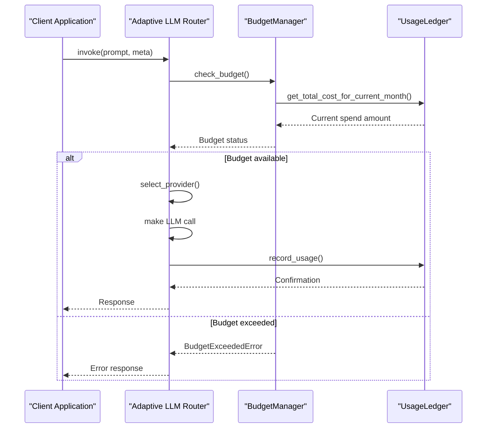
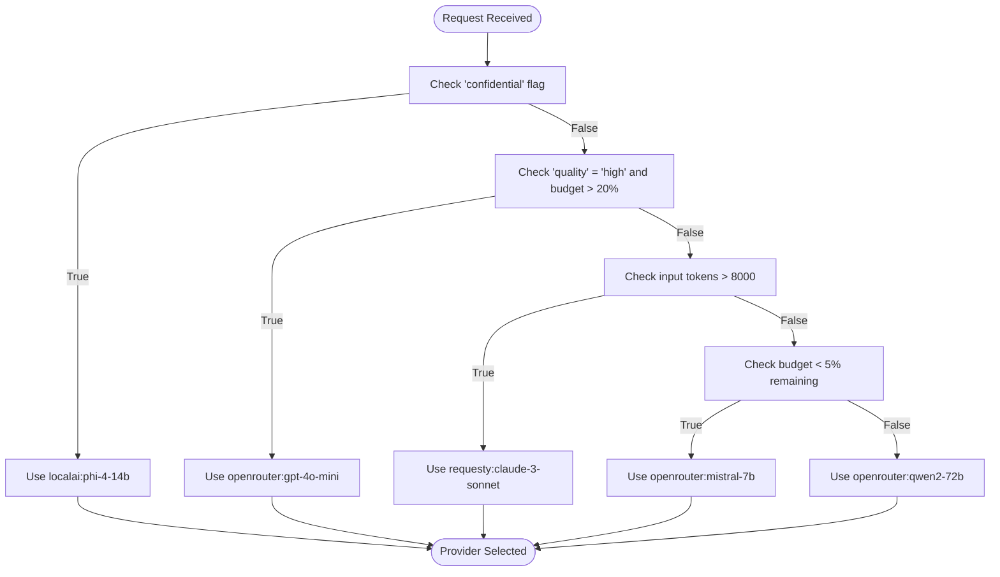
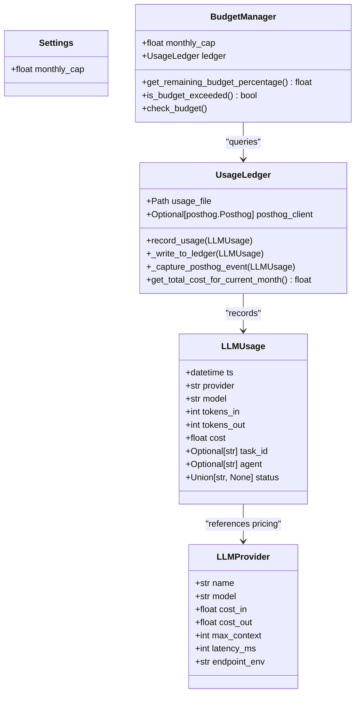
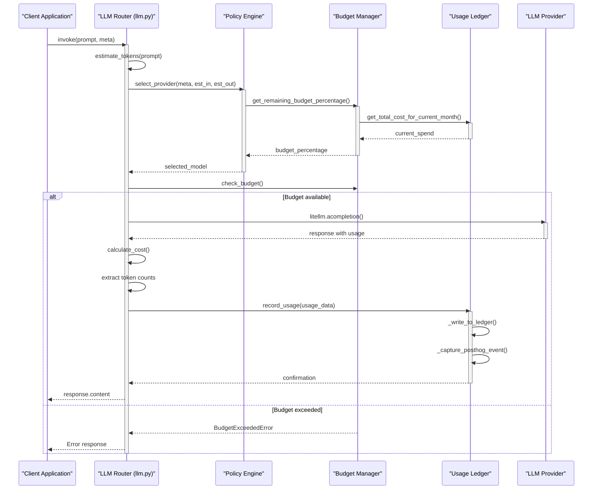

# LLM Usage and Cost Analytics

<cite>
**Referenced Files in This Document**   
- [usage_ledger.py](file://371-os/src/minds371/adaptive_llm_router/usage_ledger.py#L0-L88)
- [budget_guard.py](file://371-os/src/minds371/adaptive_llm_router/budget_guard.py#L0-L49)
- [data_models.py](file://371-os/src/minds371/adaptive_llm_router/data_models.py#L0-L39)
- [config.py](file://371-os/src/minds371/adaptive_llm_router/config.py#L0-L6)
- [llm_usage.json](file://371-os/src/minds371/adaptive_llm_router/llm_usage.json#L0-L46)
- [providers.json](file://371-os/src/minds371/adaptive_llm_router/providers.json#L0-L47)
- [llm.py](file://371-os/src/minds371/adaptive_llm_router/llm.py#L0-L91)
- [policy_engine.py](file://371-os/src/minds371/adaptive_llm_router/policy_engine.py#L0-L32)
</cite>

## Table of Contents
1. [Introduction](#introduction)
2. [Core Components Overview](#core-components-overview)
3. [Usage Ledger Implementation](#usage-ledger-implementation)
4. [Persistent Storage: llm_usage.json](#persistent-storage-llm_usagejson)
5. [Budget Enforcement with Budget Guard](#budget-enforcement-with-budget-guard)
6. [Provider Selection and Adaptive Routing](#provider-selection-and-adaptive-routing)
7. [Cost Calculation and Pricing Rules](#cost-calculation-and-pricing-rules)
8. [Configuration and Thresholds](#configuration-and-thresholds)
9. [Data Models and Structure](#data-models-and-structure)
10. [Integration and Lifecycle Flow](#integration-and-lifecycle-flow)
11. [Common Issues and Best Practices](#common-issues-and-best-practices)

## Introduction
The LLM Usage and Cost Analytics system in 371OS provides comprehensive tracking, cost monitoring, and budget enforcement for all LLM interactions. This system ensures cost transparency, enables intelligent provider selection, and prevents overspending through real-time analytics and policy enforcement. The architecture centers around the `UsageLedger` for recording interactions, the `BudgetManager` for enforcing spending limits, and the adaptive router for optimizing provider selection based on cost, performance, and task requirements.

## Core Components Overview
The LLM analytics system consists of several interconnected components:
- **UsageLedger**: Records every LLM interaction with detailed metadata
- **BudgetManager**: Enforces monthly spending caps and triggers alerts
- **LLMUsage Data Model**: Defines the structure of usage records
- **Provider Registry**: Maintains pricing and capabilities for different LLM providers
- **Policy Engine**: Determines optimal provider selection based on multiple factors
- **Configuration System**: Sets cost thresholds and reporting parameters

These components work together to create a closed-loop system where usage data directly influences future provider selection and cost optimization strategies.

## Usage Ledger Implementation

The `UsageLedger` class in `usage_ledger.py` is responsible for persisting every LLM interaction with comprehensive metadata. It serves as the central repository for all usage data, enabling detailed cost analysis and reporting.

```python
class UsageLedger:
    """
    Tracks LLM usage by writing to a JSON file and sending events to PostHog.
    """
    def __init__(self, usage_file: Path, posthog_client: Optional[posthog.Posthog] = None):
        self.usage_file = usage_file
        self.posthog_client = posthog_client

    def record_usage(self, usage_data: LLMUsage):
        """
        Records a single usage event to the ledger and PostHog.
        """
        self._write_to_ledger(usage_data)
        self._capture_posthog_event(usage_data)
```

The ledger captures essential metadata for each interaction:
- **Provider**: The LLM service used (e.g., "openrouter", "localai")
- **Model**: The specific model invoked
- **Token counts**: Input and output token usage
- **Cost**: Calculated cost in USD
- **Timestamp**: Precise time of the interaction
- **Task context**: Associated task ID and agent information
- **Status**: Outcome of the request ("ok", "fallback", "error")

The implementation includes dual persistence: writing to a local JSON file (`llm_usage.json`) for immediate access and sending events to PostHog for centralized analytics and monitoring. This ensures both local availability and integration with broader analytics platforms.

**Section sources**
- [usage_ledger.py](file://371-os/src/minds371/adaptive_llm_router/usage_ledger.py#L0-L88)

## Persistent Storage: llm_usage.json

The `llm_usage.json` file serves as the persistent storage for all LLM usage records. It maintains a simple array structure where each object represents a single LLM interaction with complete metadata.

```json
[
  {
    "ts": "2025-08-11T16:36:06.967806",
    "provider": "openrouter",
    "model": "qwen2-72b",
    "tokens_in": 10,
    "tokens_out": 20,
    "cost": 5e-05,
    "task_id": null,
    "agent": "test_agent",
    "status": "ok"
  },
  {
    "ts": "2025-08-11T16:36:06.968473",
    "provider": "openrouter",
    "model": "gpt-4o-mini",
    "tokens_in": 10,
    "tokens_out": 20,
    "cost": 1.7999999999999997e-05,
    "task_id": null,
    "agent": "test_agent",
    "status": "ok"
  }
]
```

Key characteristics of this storage format:
- **Append-only design**: New records are added to the array without modification of existing entries
- **Self-contained records**: Each entry contains all necessary information for cost calculation and analysis
- **JSON format**: Enables easy parsing and integration with various analytics tools
- **Local persistence**: Provides immediate access to usage data without external dependencies

The file is managed exclusively through the `UsageLedger` class, which handles reading, writing, and error recovery. If the file is corrupted or unreadable, the system initializes with an empty record set rather than failing.

**Section sources**
- [llm_usage.json](file://371-os/src/minds371/adaptive_llm_router/llm_usage.json#L0-L46)
- [usage_ledger.py](file://371-os/src/minds371/adaptive_llm_router/usage_ledger.py#L25-L45)

## Budget Enforcement with Budget Guard

The `BudgetManager` class in `budget_guard.py` enforces spending limits and prevents cost overruns. It works in conjunction with the `UsageLedger` to monitor cumulative spending and trigger appropriate actions when thresholds are approached or exceeded.

```python
class BudgetManager:
    """
    Manages the LLM budget by checking usage against a monthly cap.
    """
    def __init__(self, monthly_cap: float, ledger: UsageLedger):
        self.monthly_cap = monthly_cap
        self.ledger = ledger

    def get_remaining_budget_percentage(self) -> float:
        """
        Calculates the percentage of the budget that remains.
        """
        if self.monthly_cap <= 0:
            return 0.0

        current_spend = self.ledger.get_total_cost_for_current_month()
        remaining = self.monthly_cap - current_spend

        if remaining <= 0:
            return 0.0

        return (remaining / self.monthly_cap)

    def is_budget_exceeded(self) -> bool:
        """
        Checks if the current spend has exceeded the monthly cap.
        """
        return self.get_remaining_budget_percentage() <= 0

    def check_budget(self):
        """
        Raises a BudgetExceededError if the budget is exhausted.
        """
        if self.is_budget_exceeded():
            raise BudgetExceededError(f"Monthly budget of ${self.monthly_cap} has been exceeded.")
```

The budget enforcement system operates on a monthly cycle, automatically resetting calculations at the beginning of each calendar month. It provides several key methods:
- **get_remaining_budget_percentage**: Returns the proportion of budget remaining
- **is_budget_exceeded**: Boolean check for budget status
- **check_budget**: Raises an exception if the budget is exceeded

The system uses a custom `BudgetExceededError` exception to signal when spending limits have been reached, allowing calling code to implement appropriate fallback strategies.



**Diagram sources**
- [budget_guard.py](file://371-os/src/minds371/adaptive_llm_router/budget_guard.py#L0-L49)
- [usage_ledger.py](file://371-os/src/minds371/adaptive_llm_router/usage_ledger.py#L60-L75)

**Section sources**
- [budget_guard.py](file://371-os/src/minds371/adaptive_llm_router/budget_guard.py#L0-L49)

## Provider Selection and Adaptive Routing

The adaptive LLM routing system uses a sophisticated decision engine to select the optimal provider based on multiple factors including budget status, task requirements, and performance characteristics.



**Diagram sources**
- [policy_engine.py](file://371-os/src/minds371/adaptive_llm_router/policy_engine.py#L0-L32)
- [llm.py](file://371-os/src/minds371/adaptive_llm_router/llm.py#L40-L50)

The decision logic, implemented in `policy_engine.py`, follows a priority-based approach:

```python
def select_provider(meta: Dict[str, Any], est_in: int, est_out: int) -> str:
    """
    Selects the best provider and model based on task metadata and budget.
    """
    budget_percentage = budget_manager.get_remaining_budget_percentage()

    # 1. Privacy Flag: forces LocalAI
    if meta.get("confidential"):
        return "localai:phi-4-14b"

    # 2. Task Criticality: high-quality model for critical tasks if budget allows
    if meta.get("quality") == "high" and budget_percentage > 0.20:
        return "openrouter:gpt-4o-mini"

    # 3. Context Length: long-context model for large inputs
    if est_in > 8000:
        return "requesty:claude-3-sonnet"

    # 4. Low Budget Mode: cheapest model when budget is low
    if budget_percentage < 0.05:
        return "openrouter:mistral-7b"

    # 5. Balanced Default: the default choice for all other cases
    return "openrouter:qwen2-72b"
```

The main router in `llm.py` integrates this selection logic with budget checking and usage recording:

```python
async def invoke(
    prompt: str,
    meta: Dict[str, Any],
    user_id: Optional[str] = None
) -> Dict[str, Any]:
    # 1. Estimate input tokens
    est_in = estimate_tokens(prompt)
    est_out = est_in // 2

    # 2. Select the best provider
    selected_model = select_provider(meta, est_in, est_out)
    provider_name, model_name = selected_model.split(":")

    # 3. Check the budget
    try:
        budget_manager.check_budget()
    except BudgetExceededError as e:
        raise e

    # 4. Make the LLM call using litellm
    response = await litellm.acompletion(
        model=f"{provider_name}/{model_name}",
        messages=[{"role": "user", "content": prompt}],
    )

    # 5. Calculate cost
    cost = (
        (tokens_in / 1000) * provider_details.cost_in +
        (tokens_out / 1000) * provider_details.cost_out
    )

    # 6. Record usage
    usage_data = LLMUsage(
        provider=provider_name,
        model=model_name,
        tokens_in=tokens_in,
        tokens_out=tokens_out,
        cost=cost,
        task_id=meta.get("task_id"),
        agent=meta.get("agent_name"),
        status=status,
    )
    usage_ledger.record_usage(usage_data)
```

This integration creates a closed-loop system where usage data directly influences future routing decisions, enabling continuous cost optimization.

**Section sources**
- [policy_engine.py](file://371-os/src/minds371/adaptive_llm_router/policy_engine.py#L0-L32)
- [llm.py](file://371-os/src/minds371/adaptive_llm_router/llm.py#L0-L91)

## Cost Calculation and Pricing Rules

Cost calculation is based on provider-specific pricing rules defined in `providers.json` and applied through the `LLMProvider` data model. The system calculates costs based on actual token usage and provider rates.

```json
[
  {
    "name": "openrouter",
    "model": "gpt-4o-mini",
    "cost_in": 0.0006,
    "cost_out": 0.0006,
    "max_context": 128000,
    "latency_ms": 500,
    "endpoint_env": "OPENROUTER_API_KEY"
  },
  {
    "name": "requesty",
    "model": "claude-3-sonnet",
    "cost_in": 0.003,
    "cost_out": 0.015,
    "max_context": 200000,
    "latency_ms": 800,
    "endpoint_env": "REQUESTY_API_KEY"
  }
]
```

The cost calculation formula is straightforward:

```
cost = (tokens_in / 1000) * cost_per_1k_input_tokens + (tokens_out / 1000) * cost_per_1k_output_tokens
```

For example, a request to `gpt-4o-mini` with 1,000 input tokens and 500 output tokens would cost:
- Input: (1000 / 1000) * $0.0006 = $0.0006
- Output: (500 / 1000) * $0.0006 = $0.0003
- Total: $0.0009

The pricing rules include several key parameters for each provider:
- **cost_in**: Cost per 1,000 input tokens in USD
- **cost_out**: Cost per 1,000 output tokens in USD
- **max_context**: Maximum context window size in tokens
- **latency_ms**: Expected latency in milliseconds
- **endpoint_env**: Environment variable for API key

Local models like `localai:phi-4-14b` have zero cost, making them ideal for confidential tasks when budget is constrained.

**Section sources**
- [providers.json](file://371-os/src/minds371/adaptive_llm_router/providers.json#L0-L47)
- [llm.py](file://371-os/src/minds371/adaptive_llm_router/llm.py#L75-L80)
- [data_models.py](file://371-os/src/minds371/adaptive_llm_router/data_models.py#L10-L20)

## Configuration and Thresholds

The system's behavior is controlled through configuration parameters that define cost thresholds, reporting periods, and operational rules.

The primary configuration is defined in `config.py`:

```python
# The monthly budget cap for LLM usage in USD.
MONTHLY_BUDGET_CAP = 20.00
```

Additional configuration is embedded in the data models and provider definitions:

```python
class Settings(BaseModel):
    """
    Represents system settings, mirroring the `settings` table.
    """
    monthly_cap: float = 20.00
```

Key configurable parameters include:
- **MONTHLY_BUDGET_CAP**: The maximum monthly spending limit in USD
- **Provider pricing rules**: Configurable cost rates for each model
- **Decision thresholds**: Budget percentages that trigger different routing behaviors

The policy engine uses several implicit thresholds:
- **20% remaining budget**: Threshold for allowing high-quality models
- **5% remaining budget**: Trigger for switching to the cheapest available model
- **Monthly cycle**: Reporting and budget reset period

These configuration options enable system administrators to tune the cost optimization strategy based on organizational requirements and budget constraints.

**Section sources**
- [config.py](file://371-os/src/minds371/adaptive_llm_router/config.py#L0-L6)
- [data_models.py](file://371-os/src/minds371/adaptive_llm_router/data_models.py#L30-L35)

## Data Models and Structure

The system uses Pydantic models to define the structure of data objects, ensuring type safety and data integrity.

```python
class LLMProvider(BaseModel):
    """
    Represents an LLM provider and model, mirroring the `llm_providers` table.
    """
    name: str
    model: str
    cost_in: float = Field(..., description="Cost per 1k input tokens in USD")
    cost_out: float = Field(..., description="Cost per 1k output tokens in USD")
    max_context: int = Field(..., description="Maximum context window size in tokens")
    latency_ms: int = Field(..., description="Expected latency in milliseconds")
    endpoint_env: str = Field(..., description="Environment variable for the API key")

class LLMUsage(BaseModel):
    """
    Represents a single usage event, mirroring the `llm_usage` table.
    """
    ts: datetime = Field(default_factory=datetime.now)
    provider: str
    model: str
    tokens_in: int
    tokens_out: int
    cost: float
    task_id: Optional[str] = None
    agent: Optional[str] = None
    status: Union[str, None] = "ok"

class Settings(BaseModel):
    """
    Represents system settings, mirroring the `settings` table.
    """
    monthly_cap: float = 20.00
```



**Diagram sources**
- [data_models.py](file://371-os/src/minds371/adaptive_llm_router/data_models.py#L10-L35)
- [usage_ledger.py](file://371-os/src/minds371/adaptive_llm_router/usage_ledger.py#L10-L20)
- [budget_guard.py](file://371-os/src/minds371/adaptive_llm_router/budget_guard.py#L10-L20)

The data models serve as the contract between different system components, ensuring consistent data representation across the application.

**Section sources**
- [data_models.py](file://371-os/src/minds371/adaptive_llm_router/data_models.py#L0-L39)

## Integration and Lifecycle Flow

The complete lifecycle of an LLM request involves multiple components working in concert:



**Diagram sources**
- [llm.py](file://371-os/src/minds371/adaptive_llm_router/llm.py#L0-L91)
- [policy_engine.py](file://371-os/src/minds371/adaptive_llm_router/policy_engine.py#L0-L32)
- [budget_guard.py](file://371-os/src/minds371/adaptive_llm_router/budget_guard.py#L0-L49)
- [usage_ledger.py](file://371-os/src/minds371/adaptive_llm_router/usage_ledger.py#L0-L88)

The integration follows a well-defined sequence:
1. **Token estimation**: The input prompt is tokenized to estimate processing requirements
2. **Provider selection**: The policy engine selects the optimal provider based on task metadata and budget status
3. **Budget verification**: The budget manager confirms sufficient funds are available
4. **LLM invocation**: The request is sent to the selected provider
5. **Cost calculation**: Actual token usage is used to calculate precise costs
6. **Usage recording**: The interaction is recorded in the ledger for analytics and reporting

This lifecycle ensures that every LLM interaction is tracked, cost-optimized, and compliant with budget constraints.

**Section sources**
- [llm.py](file://371-os/src/minds371/adaptive_llm_router/llm.py#L0-L91)

## Common Issues and Best Practices

### Common Issues

**Clock Drift in Distributed Systems**
When multiple instances of the system run across different machines, clock drift can cause inaccurate timestamping of usage records. This may affect monthly budget calculations and reporting accuracy.

**Incomplete Usage Records**
Network failures or application crashes can result in LLM calls being made without corresponding usage records, leading to underreporting of costs.

**Currency Conversion Accuracy**
The current system assumes USD pricing. For international deployments, currency conversion rates need to be considered for accurate cost tracking.

**Token Estimation Inaccuracy**
The token estimation using `tiktoken` may not perfectly match the actual token counts from all providers, leading to cost calculation discrepancies.

### Best Practices

**Cost Optimization**
- Use the `confidential` metadata flag to route sensitive tasks to free local models
- Set appropriate quality levels to avoid over-provisioning for simple tasks
- Monitor budget utilization to adjust the monthly cap as needed
- Regularly review provider pricing and update `providers.json` accordingly

**Anomaly Detection**
- Monitor for sudden spikes in token usage or costs
- Track the ratio of estimated to actual tokens to identify estimation issues
- Watch for increases in error rates that may indicate provider issues
- Analyze provider selection patterns for unexpected changes

**System Reliability**
- Implement backup mechanisms for the `llm_usage.json` file
- Consider database storage for production environments with high volume
- Add retry logic for PostHog event submission
- Implement health checks for the budget and usage systems

**Performance Monitoring**
- Track the latency of different providers to inform routing decisions
- Monitor token processing rates to identify performance bottlenecks
- Analyze cost per task type to optimize budget allocation
- Measure the effectiveness of cost-saving strategies over time

By following these best practices, organizations can maximize the value of their LLM investments while maintaining strict cost controls and operational reliability.

**Section sources**
- [usage_ledger.py](file://371-os/src/minds371/adaptive_llm_router/usage_ledger.py#L0-L88)
- [budget_guard.py](file://371-os/src/minds371/adaptive_llm_router/budget_guard.py#L0-L49)
- [llm.py](file://371-os/src/minds371/adaptive_llm_router/llm.py#L0-L91)
- [data_models.py](file://371-os/src/minds371/adaptive_llm_router/data_models.py#L0-L39)