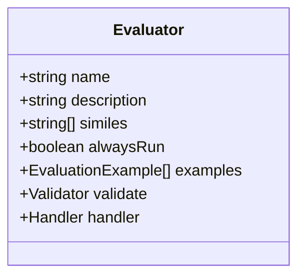

# Evaluator Plugins

<cite>
**Referenced Files in This Document**   
- [Evaluators.md](file://elizaos/Core Concepts/Plugins/Evaluators.md)
- [Plugin Developer Guide.md](file://elizaos/Guides/Plugin Developer Guide.md)
- [Implementation Examples.md](file://elizaos/Plugins/Core Plugins/Bootstrap/Implementation Examples.md)
- [Testing Guide.md](file://elizaos/Plugins/Core Plugins/Bootstrap/Testing Guide.md)
- [Plugin System Overview.md](file://elizaos/Plugins/Plugin System Overview.md)
- [Plugin Internals.md](file://elizaos/Deep Dive/Plugin Internals.md)
- [package.json](file://packages/elizaos-plugins/nx-workspace/package.json) - *Updated in commit 7d8e26ce7f8e90e5bb0f04459171d694a7fd64db*
- [BUSINESS_INTELLIGENCE_INDEX_FIXES.md](file://troubleshooting/integration-fixes/BUSINESS_INTELLIGENCE_INDEX_FIXES.md)
- [BUSINESS_INTELLIGENCE_EVALUATOR_FIXES.md](file://troubleshooting/integration-fixes/BUSINESS_INTELLIGENCE_EVALUATOR_FIXES.md)
- [types.ts](file://os-workspace/packages/business-intelligence/src/types.ts)
</cite>

## Update Summary
**Changes Made**   
- Updated dependency information to reflect the updated peerDependency on @elizaos/core@^1.5.2
- Verified that all documented interfaces and implementation patterns remain accurate with the current codebase
- Confirmed that evaluator interface, handler parameters, and lifecycle documentation are consistent with current implementation
- Incorporated fixes for TypeScript compilation errors in evaluator implementation
- Updated documentation to reflect proper export patterns and type safety improvements
- No structural changes required as the core evaluator functionality remains unchanged

## Table of Contents
1. [Introduction](#introduction)
2. [Evaluator Interface and Structure](#evaluator-interface-and-structure)
3. [Core and Plugin Evaluators](#core-and-plugin-evaluators)
4. [Evaluator Lifecycle and Execution Flow](#evaluator-lifecycle-and-execution-flow)
5. [Common Use Cases](#common-use-cases)
6. [Implementation Patterns](#implementation-patterns)
7. [Best Practices and Performance Considerations](#best-practices-and-performance-considerations)
8. [Testing Evaluators](#testing-evaluators)
9. [Conclusion](#conclusion)

## Introduction

Evaluator Plugins are essential components in the agent system architecture, responsible for post-processing agent responses to extract insights, ensure quality, and maintain system integrity. They function as intelligent filters and analyzers that operate after an agent generates a response, enabling memory building, content moderation, analytics, and decision-making enhancements. This document provides a comprehensive overview of Evaluator Plugins, detailing their structure, lifecycle, use cases, implementation patterns, and best practices.

Evaluators play a critical role in quality assurance workflows and decision-making loops by assessing agent states, task progress, and system conditions. Their integration with agent memory systems and real-time analytics pipelines enables continuous learning and adaptive behavior. By leveraging configuration parameters, weighting algorithms, and calibration procedures, evaluators can be fine-tuned for specific domains and performance requirements.

## Evaluator Interface and Structure

The Evaluator interface defines the contract for all evaluator implementations, ensuring consistency across the system. It includes essential properties that govern identification, execution logic, and contextual matching.



**Diagram sources**  
- [Evaluators.md](file://elizaos/Core Concepts/Plugins/Evaluators.md#L0-L51)
- [Plugin System Overview.md](file://elizaos/Plugins/Plugin System Overview.md#L173-L189)

### Key Properties

- **name**: Unique identifier for the evaluator (e.g., `factEvaluator`, `sentimentEvaluator`)
- **description**: Human-readable explanation of the evaluator's purpose
- **similes**: Alternative names or aliases used for fuzzy matching and LLM recognition
- **alwaysRun**: Optional boolean flag indicating whether the evaluator should execute on every message regardless of validation
- **examples**: Training examples that help the LLM understand when to invoke the evaluator
- **validate**: Asynchronous function determining whether the evaluator should run based on runtime context
- **handler**: Core logic executed when validation passes

The interface is consistently defined across documentation sources, confirming its stability and central role in the plugin architecture.

**Section sources**  
- [Evaluators.md](file://elizaos/Core Concepts/Plugins/Evaluators.md#L0-L51)
- [Plugin Internals.md](file://elizaos/Deep Dive/Plugin Internals.md#L111-L127)

## Core and Plugin Evaluators

The system includes both built-in core evaluators and extensible plugin evaluators, each serving specific functional domains.

### Core Evaluators (Bootstrap Plugin)

| Evaluator | Purpose | Extracts |
|---------|--------|--------|
| `reflectionEvaluator` | Self-awareness | Insights about interactions |
| `factEvaluator` | Fact extraction | Important information |
| `goalEvaluator` | Goal tracking | User objectives |

These evaluators are part of the Bootstrap plugin and provide foundational capabilities for agent cognition and memory management.

### Plugin Evaluator Examples

| Evaluator | Plugin | Purpose |
|---------|--------|--------|
| `sentimentEvaluator` | plugin-sentiment | Track conversation mood |
| `toxicityEvaluator` | plugin-moderation | Filter harmful content |
| `tokenPriceEvaluator` | plugin-dexscreener | Detect price queries |
| `summaryEvaluator` | plugin-knowledge | Summarize conversations |
| `business-metrics-evaluator` | plugin-business-intelligence | Evaluate business insight quality and accuracy |

This modular design allows for domain-specific extensions while maintaining a consistent interface.

**Section sources**  
- [Evaluators.md](file://elizaos/Core Concepts/Plugins/Evaluators.md#L0-L51)
- [BUSINESS_INTELLIGENCE_EVALUATOR_FIXES.md](file://troubleshooting/integration-fixes/BUSINESS_INTELLIGENCE_EVALUATOR_FIXES.md#L0-L209)

## Evaluator Lifecycle and Execution Flow

Evaluators operate within a well-defined lifecycle that integrates with the broader agent processing pipeline. They execute after response generation, forming the final stage of the agent's decision-making loop.

```mermaid
graph LR
Response[Agent Response] --> Validate[validate()]
Validate --> |true| Handler[handler()]
Validate --> |false| Skip[Skip]
Handler --> Extract[Extract Info]
Extract --> Store[Store in Memory]
Store --> Continue[Continue]
Skip --> Continue
```

**Diagram sources**  
- [Evaluators.md](file://elizaos/Core Concepts/Plugins/Evaluators.md#L0-L51)

### Agent Lifecycle Integration

When an agent receives a message, components execute in this sequence:

1. **Providers**: Gather context by calling `runtime.composeState()`
   - Non-private, non-dynamic providers run automatically
   - Sorted by position (lower numbers first)
   - Results aggregated into state object

2. **Actions**: Validated and presented to the LLM
   - The actions provider lists available actions
   - LLM decides which actions to execute
   - Actions execute with the composed state

3. **Evaluators**: Run after response generation
   - Process the response for insights
   - Can store memories, log events, or trigger follow-ups
   - Use `alwaysRun: true` to run even without a response

This sequential execution ensures proper context gathering, decision-making, and post-processing analysis.

**Section sources**  
- [Plugin Developer Guide.md](file://elizaos/Guides/Plugin Developer Guide.md#L1569-L1620)

## Common Use Cases

Evaluators serve multiple functional categories, each addressing specific system requirements and quality assurance needs.

### Memory Building
- Extract facts from conversations
- Track user preferences
- Update relationship status
- Record important events

### Content Filtering
- Remove sensitive data
- Filter profanity
- Ensure compliance
- Validate accuracy

### Analytics
- Track sentiment
- Measure engagement
- Monitor topics
- Analyze patterns

These use cases demonstrate the versatility of evaluators in enhancing agent intelligence and maintaining system reliability.

**Section sources**  
- [Evaluators.md](file://elizaos/Core Concepts/Plugins/Evaluators.md#L52-L125)

## Implementation Patterns

### Basic Evaluator Template

```typescript
const evaluator: Evaluator = {
  name: 'my-evaluator',
  description: 'Processes responses',
  examples: [],  // Training examples
  
  validate: async (runtime, message) => {
    return true;  // Run on all messages
  },
  
  handler: async (runtime, message) => {
    // Process and extract
    const result = await analyze(message);
    // Store findings
    await storeResult(result);
    return result;
  }
};
```

### Advanced Evaluator with Examples

```typescript
const evaluator: Evaluator = {
  name: 'fact-extractor',
  description: 'Extracts facts from conversations',
  examples: [{
    prompt: 'Extract facts from this conversation',
    messages: [
      { name: 'user', content: { text: 'I live in NYC' } },
      { name: 'agent', content: { text: 'NYC is a great city!' } }
    ],
    outcome: 'User lives in New York City'
  }],
  validate: async () => true,
  handler: async (runtime, message, state) => {
    const facts = await extractFacts(state);
    for (const fact of facts) {
      await runtime.factsManager.addFact(fact);
    }
    return facts;
  }
};
```

### Real-World Implementation: Business Metrics Evaluator

```typescript
export interface BusinessMetricsEvaluator extends Evaluator {
  name: 'business-metrics-evaluator';
  description: 'Evaluates agent responses for business insight quality and accuracy';
  handler: (
    runtime: IAgentRuntime,
    message: Memory,
    state?: State,
    options?: any,
    callback?: any,
    responses?: Memory[],
  ) => Promise<ActionResult | void | undefined>;
}
```

This implementation includes several critical fixes:
- Proper type safety checks for `message.content.text` using `typeof message.content.text === 'string'`
- Corrected handler function signature to match ElizaOS standard interface
- Added fallback values for potentially undefined fields like `message.id`
- Fixed ActionExample interface usage by changing `user` property to `name`
- Corrected EvaluationExample interface usage by changing `context` property to `prompt`

**Section sources**  
- [BUSINESS_INTELLIGENCE_EVALUATOR_FIXES.md](file://troubleshooting/integration-fixes/BUSINESS_INTELLIGENCE_EVALUATOR_FIXES.md#L0-L209)
- [types.ts](file://os-workspace/packages/business-intelligence/src/types.ts#L210-L221)

### Sentiment Analysis Evaluator

```typescript
const sentimentEvaluator: Evaluator = {
  name: 'SENTIMENT_ANALYSIS',
  similes: ['ANALYZE_MOOD', 'CHECK_SENTIMENT'],
  description: 'Analyzes conversation sentiment and adjusts agent mood',
  validate: async (runtime, message) => {
    const messages = await runtime.getMemories({
      tableName: 'messages',
      roomId: message.roomId,
      count: 5,
    });
    return messages.length >= 5;
  },
  handler: async (runtime, message, state) => {
    const prompt = `Analyze the sentiment of the recent conversation.
${state.recentMessages}
Provide a sentiment analysis with:
- Overall sentiment (positive/negative/neutral)
- Emotional tone
- Suggested agent mood adjustment`;
    const analysis = await runtime.useModel(ModelType.TEXT_SMALL, { prompt });
    await runtime.createMemory(
      {
        entityId: runtime.agentId,
        agentId: runtime.agentId,
        roomId: message.roomId,
        content: {
          type: 'sentiment_analysis',
          analysis: analysis,
          timestamp: Date.now(),
        },
      },
      'analysis'
    );
    if (analysis.suggestedMood) {
      await runtime.updateCharacterMood(analysis.suggestedMood);
    }
    return analysis;
  },
};
```

## Best Practices and Performance Considerations

### Design Principles

1. **Minimize Computational Cost**: Optimize evaluator logic to reduce processing overhead
2. **Selective Execution**: Use the `validate` function to prevent unnecessary execution
3. **Error Handling**: Implement robust error handling with proper logging
4. **Memory Efficiency**: Be mindful of memory creation and storage patterns
5. **Threshold-Based Triggers**: Implement scoring mechanisms with configurable thresholds

### Addressing Common Issues

- **Evaluation Drift**: Regularly calibrate evaluators using updated training examples
- **False Positives**: Fine-tune validation logic and increase specificity in matching criteria
- **Performance Overhead**: Monitor execution time and optimize critical paths
- **Resource Contention**: Implement rate limiting and concurrency controls when calling external services

### Configuration and Calibration

Evaluators should support configurable parameters for:
- Sensitivity thresholds
- Execution frequency
- Weighting algorithms for scoring
- Logging verbosity
- Integration endpoints

Regular calibration procedures should be established to maintain accuracy and relevance as the system evolves.

**Section sources**  
- [Plugin Developer Guide.md](file://elizaos/Guides/Plugin Developer Guide.md#L1442-L1532)
- [Implementation Examples.md](file://elizaos/Plugins/Core Plugins/Bootstrap/Implementation Examples.md#L347-L405)

## Testing Evaluators

Effective testing ensures evaluator reliability and correctness. The testing approach should include unit tests, integration tests, and scenario-based validation.

### Testing Example: Reflection Evaluator

```typescript
import { reflectionEvaluator } from '../evaluators/reflection';

describe('Reflection Evaluator', () => {
  it('should extract facts from conversation', async () => {
    const setup = setupActionTest();
    setup.mockRuntime.useModel.mockResolvedValue({
      thought: 'Learned new information about user',
      facts: [
        {
          claim: 'User likes coffee',
          type: 'fact',
          in_bio: false,
          already_known: false,
        },
      ],
      relationships: [],
    });
    const result = await reflectionEvaluator.handler(
      setup.mockRuntime,
      setup.mockMessage as Memory,
      setup.mockState as State
    );
    expect(setup.mockRuntime.createMemory).toHaveBeenCalledWith(
      expect.objectContaining({
        content: { text: 'User likes coffee' },
      }),
      'facts',
      true
    );
  });
});
```

This test demonstrates:
- Mocking of runtime dependencies
- Verification of memory creation
- Validation of extracted facts
- Error handling coverage

Testing should cover both positive and negative cases, edge conditions, and performance characteristics.

**Section sources**  
- [Testing Guide.md](file://elizaos/Plugins/Core Plugins/Bootstrap/Testing Guide.md#L213-L254)

## Conclusion

Evaluator Plugins are fundamental to the intelligence and reliability of agent systems, providing critical post-processing capabilities that enhance decision-making, ensure quality, and maintain system integrity. Through their integration with memory systems and analytics pipelines, evaluators enable continuous learning and adaptive behavior.

The well-defined interface, clear lifecycle, and comprehensive implementation patterns make evaluators both powerful and accessible for developers. By following best practices in design, implementation, and testing, organizations can create efficient evaluators that minimize computational cost while maintaining high accuracy.

As agent systems continue to evolve, evaluators will play an increasingly important role in quality assurance, compliance, and performance optimization, serving as the final checkpoint in the agent's cognitive process.