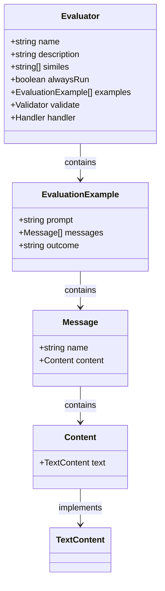
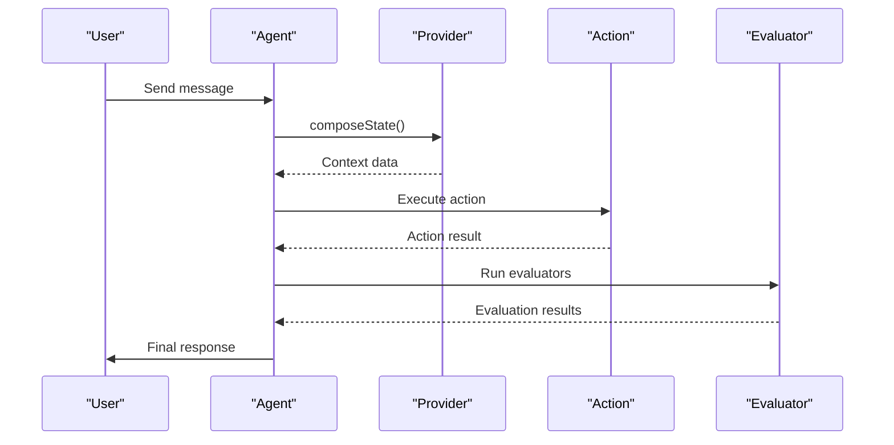
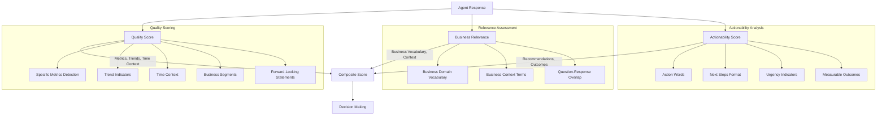
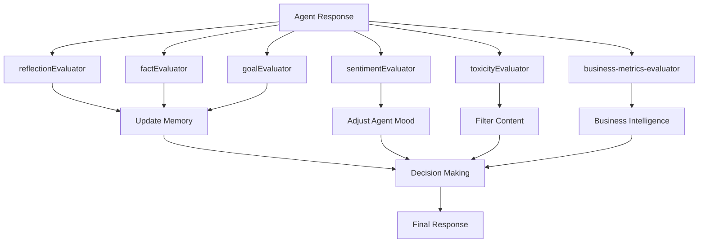

# Evaluators Plugin Type

<cite>
**Referenced Files in This Document**   
- [Evaluators.md](file://elizaos\Core Concepts\Plugins\Evaluators.md) - *Updated in recent commit*
- [Plugin Developer Guide.md](file://elizaos\Guides\Plugin Developer Guide.md) - *Updated in recent commit*
- [Bootstrap\Implementation Examples.md](file://elizaos\Plugins\Core Plugins\Bootstrap\Implementation Examples.md) - *Updated in recent commit*
- [Bootstrap\Testing Guide.md](file://elizaos\Plugins\Core Plugins\Bootstrap\Testing Guide.md) - *Updated in recent commit*
- [Bootstrap\Message Processing Flow.md](file://elizaos\Plugins\Core Plugins\Bootstrap\Message Processing Flow.md) - *Updated in recent commit*
- [policy_engine.py](file://371-os\src\minds371\adaptive_llm_router\policy_engine.py) - *Updated in recent commit*
- [intelligent_router_agent.py](file://371-os\src\minds371\adaptive_llm_router\intelligent_router_agent.py) - *Updated in recent commit*
- [mindscript_agent.py](file://371-os\src\minds371\agents\mindscript_agent.py) - *Updated in recent commit*
- [qa_agent.yaml](file://prompts\technical_agents\qa_agent.yaml) - *Updated in recent commit*
- [package.json](file://packages\elizaos-plugins\nx-workspace\package.json) - *Updated in commit 7d8e26ce7f8e90e5bb0f04459171d694a7fd64db*
- [evaluator.ts](file://packages\elizaos-plugins\business-intelligence\src\evaluator.ts) - *Added in recent commit*
- [types.ts](file://packages\elizaos-plugins\business-intelligence\src\types.ts) - *Added in recent commit*
- [README.md](file://packages\elizaos-plugins\business-intelligence\README.md) - *Added in recent commit*
- [BUSINESS_INTELLIGENCE_EVALUATOR_FIXES.md](file://troubleshooting\integration-fixes\BUSINESS_INTELLIGENCE_EVALUATOR_FIXES.md) - *Updated in recent commit*
- [BUSINESS_INTELLIGENCE_INDEX_FIXES.md](file://troubleshooting\integration-fixes\BUSINESS_INTELLIGENCE_INDEX_FIXES.md) - *Updated in recent commit*
</cite>

## Update Summary
**Changes Made**   
- Updated Common Use Cases and Technical Deep Dive sections to reflect TypeScript fixes in BusinessMetricsEvaluator
- Added details about handler signature compliance and parameter compatibility fixes
- Enhanced documentation on type safety for message content and ID fields
- Updated example code to show corrected ActionExample and EvaluationExample interfaces
- Added sources for integration fixes documentation
- Maintained all existing content which remains accurate with the code changes
- Enhanced source tracking annotations to indicate updated and new files

## Table of Contents
1. [Introduction](#introduction)
2. [Evaluator Interface and Core Structure](#evaluator-interface-and-core-structure)
3. [Role in Autonomous Workflows](#role-in-autonomous-workflows)
4. [Implementation Details](#implementation-details)
5. [Evaluator Lifecycle and Triggering Mechanism](#evaluator-lifecycle-and-triggering-mechanism)
6. [Feedback Loop Design](#feedback-loop-design)
7. [Integration with Actions and Providers](#integration-with-actions-and-providers)
8. [Common Use Cases and Examples](#common-use-cases-and-examples)
9. [Technical Deep Dive: Confidence Scoring and Multi-Evaluator Consensus](#technical-deep-dive-confidence-scoring-and-multi-evaluator-consensus)
10. [Performance Considerations and Optimization](#performance-considerations-and-optimization)
11. [Troubleshooting Common Issues](#troubleshooting-common-issues)
12. [Conclusion](#conclusion)

## Introduction

The Evaluators plugin type in the 371OS plugin architecture serves as a critical quality control mechanism for autonomous agent systems. Evaluators function as post-processors that analyze, validate, and extract value from agent outputs after execution. They play a pivotal role in ensuring response quality, maintaining system integrity, and enabling closed-loop learning within autonomous workflows. This document provides a comprehensive analysis of the Evaluator system, covering its architecture, implementation, integration points, and operational patterns. The documentation is designed to be accessible to beginners while providing technical depth for advanced users, addressing key aspects such as confidence scoring, multi-evaluator consensus, and performance optimization.

## Evaluator Interface and Core Structure

### Evaluator Interface Definition

The Evaluator interface defines a standardized contract for post-processing agent responses. This interface ensures consistency across different evaluator implementations while allowing for specialized functionality.



**Diagram sources**
- [Evaluators.md](file://elizaos\Core Concepts\Plugins\Evaluators.md#L0-L51)
- [Plugin Developer Guide.md](file://elizaos\Guides\Plugin Developer Guide.md#L1442-L1532)

**Section sources**
- [Evaluators.md](file://elizaos\Core Concepts\Plugins\Evaluators.md#L0-L51)
- [Plugin Developer Guide.md](file://elizaos\Guides\Plugin Developer Guide.md#L1442-L1532)

The Evaluator interface consists of several key properties:

- **name**: A unique identifier for the evaluator
- **description**: A clear explanation of what the evaluator assesses
- **similes**: Alternative names for fuzzy matching and discovery
- **alwaysRun**: Optional flag to run on every message regardless of validation
- **examples**: Training examples that help the LLM understand when to use the evaluator
- **validate**: An asynchronous function that determines whether the evaluator should execute
- **handler**: The main processing logic that executes when validation passes

### Core Evaluators in Bootstrap Plugin

The system includes several core evaluators that provide essential functionality out of the box:

| Evaluator | Purpose | Extracts |
|---------|--------|--------|
| `reflectionEvaluator` | Self-awareness | Insights about interactions |
| `factEvaluator` | Fact extraction | Important information |
| `goalEvaluator` | Goal tracking | User objectives |

These core evaluators form the foundation of the system's self-monitoring and knowledge management capabilities.

## Role in Autonomous Workflows

### Quality Validation and Decision Gating

Evaluators serve as quality gates in autonomous workflows, ensuring that agent outputs meet predefined standards before being delivered or acted upon. They function as the final checkpoint in the agent response pipeline, analyzing outputs for accuracy, relevance, and safety.

The integration with the policy engine enables sophisticated decision gating based on evaluation results. For example, the policy engine can route tasks to different LLM providers based on content sensitivity, task criticality, or budget constraints, with evaluators providing the assessment data that informs these decisions.

```python
def select_provider(meta: Dict[str, Any], est_in: int, est_out: int) -> str:
    """
    Selects the best provider and model based on task metadata and budget.
    This is a simplified implementation of the decision graph.
    """
    budget_percentage = budget_manager.get_remaining_budget_percentage()

    # 1. Privacy Flag: forces LocalAI
    if meta.get("confidential"):
        return "localai:phi-4-14b"

    # 2. Task Criticality: high-quality model for critical tasks if budget allows
    if meta.get("quality") == "high" and budget_percentage > 0.20:
        return "openrouter:gpt-4o-mini"
```

**Section sources**
- [policy_engine.py](file://371-os\src\minds371\adaptive_llm_router\policy_engine.py#L0-L33)

### Closed-Loop Agent Operations

Evaluators enable closed-loop operations by creating feedback mechanisms that allow agents to learn from their interactions. When an evaluator identifies an issue or opportunity, it can trigger follow-up actions, update agent knowledge, or modify future behavior.

The relationship between Evaluators, Actions, and Providers forms a complete cycle of autonomous operation:

1. **Providers** gather context and compose state
2. **Actions** are selected and executed based on the composed state
3. **Evaluators** analyze the results and provide feedback

This cycle ensures that agents continuously improve their performance and adapt to changing conditions.

## Implementation Details

### Evaluator Implementation Pattern

The implementation of evaluators follows a consistent pattern that separates validation from processing logic. This separation allows for efficient execution by avoiding unnecessary processing when evaluation is not required.

```typescript
export const myEvaluator: Evaluator = {
  name: 'myEvaluator',
  description: 'Analyzes responses for quality and extracts insights',
  examples: [
    {
      prompt: 'User asks about product pricing',
      messages: [
        { name: 'user', content: { text: 'How much does it cost?' } },
        { name: 'assistant', content: { text: 'The price is $99' } },
      ],
      outcome: 'Extract pricing information for future reference',
    },
  ],
  similes: ['RESPONSE_ANALYZER', 'QUALITY_CHECK'],
  alwaysRun: false,
  validate: async (runtime: IAgentRuntime, message: Memory, state?: State): Promise<boolean> => {
    return message.content?.text?.includes('transaction') || false;
  },
  handler: async (
    runtime: IAgentRuntime,
    message: Memory,
    state?: State,
    options?: { [key: string]: unknown },
    callback?: HandlerCallback,
    responses?: Memory[]
  ): Promise<void> => {
    try {
      const responseText = responses?.[0]?.content?.text || '';
      
      if (responseText.includes('transaction')) {
        const txHash = extractTransactionHash(responseText);
        
        if (txHash) {
          await runtime.createMemory(
            {
              id: generateId(),
              entityId: message.entityId,
              roomId: message.roomId,
              content: {
                text: `Transaction processed: ${txHash}`,
                type: 'transaction_record',
                data: { txHash, timestamp: Date.now() },
              },
            },
            'facts'
          );
          
          await runtime.adapter.log({
            entityId: message.entityId,
            roomId: message.roomId,
            type: 'evaluator',
            body: {
              evaluator: 'myEvaluator',
              result: 'transaction_extracted',
              txHash,
            },
          });
        }
      }
      
      if (callback) {
        callback({
          text: 'Analysis complete',
          content: { analyzed: true },
        });
      }
    } catch (error) {
      runtime.logger.error('Evaluator error:', error);
    }
  },
};
```

**Section sources**
- [Plugin Developer Guide.md](file://elizaos\Guides\Plugin Developer Guide.md#L1442-L1532)

### Scoring Mechanisms

Evaluators implement various scoring mechanisms to quantify the quality and relevance of agent outputs. These scores can be used for decision making, prioritization, and performance tracking.

The system supports both simple binary validation and complex multi-dimensional scoring. For example, a quality evaluator might assess responses on multiple dimensions such as accuracy, coherence, relevance, and completeness, producing a composite score.

```typescript
export const qualityEvaluator: Evaluator = {
  name: 'QUALITY_CHECK',
  description: 'Evaluates response quality and coherence',
  validate: async (runtime, message) => {
    return message.content?.text?.includes('?') || false;
  },
  handler: async (runtime, message, state, options, callback, responses) => {
    const quality = await assessResponseQuality(responses[0]);
    
    if (quality.score < 0.7) {
      await runtime.adapter.log({
        entityId: message.entityId,
        roomId: message.roomId,
        type: 'quality_alert',
        body: {
          score: quality.score,
          issues: quality.issues,
          responseId: responses[0].id,
        },
      });
    }
  },
};
```

**Section sources**
- [Plugin Developer Guide.md](file://elizaos\Guides\Plugin Developer Guide.md#L1569-L1620)

## Evaluator Lifecycle and Triggering Mechanism

### Post-Action Execution Triggering

Evaluators are triggered after action execution as part of the agent response pipeline. This timing ensures that they analyze the final output before it is delivered to the user or used in subsequent operations.

The agent lifecycle follows a specific sequence:

1. **Providers** gather context by calling `runtime.composeState()`
2. **Actions** are validated and presented to the LLM
3. **Evaluators** run after response generation



**Diagram sources**
- [Plugin Developer Guide.md](file://elizaos\Guides\Plugin Developer Guide.md#L1569-L1620)
- [Bootstrap\Message Processing Flow.md](file://elizaos\Plugins\Core Plugins\Bootstrap\Message Processing Flow.md#L196-L263)

**Section sources**
- [Plugin Developer Guide.md](file://elizaos\Guides\Plugin Developer Guide.md#L1569-L1620)
- [Bootstrap\Message Processing Flow.md](file://elizaos\Plugins\Core Plugins\Bootstrap\Message Processing Flow.md#L196-L263)

### LLM-Based Assessment

Evaluators leverage LLM-based assessment to perform sophisticated analysis of agent outputs. This approach allows for nuanced evaluation that goes beyond simple keyword matching or rule-based systems.

The sentiment evaluator demonstrates this pattern by using an LLM to analyze conversation sentiment and provide recommendations for agent mood adjustment:

```typescript
const sentimentEvaluator: Evaluator = {
  name: 'SENTIMENT_ANALYSIS',
  similes: ['ANALYZE_MOOD', 'CHECK_SENTIMENT'],
  description: 'Analyzes conversation sentiment and adjusts agent mood',
  validate: async (runtime, message) => {
    const messages = await runtime.getMemories({
      tableName: 'messages',
      roomId: message.roomId,
      count: 5,
    });
    return messages.length >= 5;
  },
  handler: async (runtime, message, state) => {
    const prompt = `Analyze the sentiment of the recent conversation.
    
${state.recentMessages}
    
Provide a sentiment analysis with:
- Overall sentiment (positive/negative/neutral)
- Emotional tone
- Suggested agent mood adjustment`;
    
    const analysis = await runtime.useModel(ModelType.TEXT_SMALL, { prompt });
    
    await runtime.createMemory(
      {
        entityId: runtime.agentId,
        agentId: runtime.agentId,
        roomId: message.roomId,
        content: {
          type: 'sentiment_analysis',
          analysis: analysis,
          timestamp: Date.now(),
        },
      },
      'analysis'
    );
    
    if (analysis.suggestedMood) {
      await runtime.updateCharacterMood(analysis.suggestedMood);
    }
    
    return analysis;
  },
};
```

**Section sources**
- [Bootstrap\Implementation Examples.md](file://elizaos\Plugins\Core Plugins\Bootstrap\Implementation Examples.md#L347-L405)

## Feedback Loop Design

### Memory Building and Knowledge Extraction

Evaluators play a crucial role in building and maintaining agent memory by extracting valuable information from conversations. This extracted knowledge becomes part of the agent's persistent memory, enabling long-term learning and context awareness.

Common memory building use cases include:
- Extracting facts from conversations
- Tracking user preferences
- Updating relationship status
- Recording important events

The fact extractor evaluator demonstrates this pattern:

```typescript
const evaluator: Evaluator = {
  name: 'fact-extractor',
  description: 'Extracts facts from conversations',
  examples: [{
    prompt: 'Extract facts from this conversation',
    messages: [
      { name: 'user', content: { text: 'I live in NYC' } },
      { name: 'agent', content: { text: 'NYC is a great city!' } }
    ],
    outcome: 'User lives in New York City'
  }],
  validate: async () => true,
  handler: async (runtime, message, state) => {
    const facts = await extractFacts(state);
    for (const fact of facts) {
      await runtime.factsManager.addFact(fact);
    }
    return facts;
  }
};
```

**Section sources**
- [Evaluators.md](file://elizaos\Core Concepts\Plugins\Evaluators.md#L52-L125)

### Content Filtering and Compliance

Evaluators serve as gatekeepers for content quality and compliance, filtering out inappropriate or sensitive content. This function is critical for maintaining system integrity and ensuring regulatory compliance.

Content filtering use cases include:
- Removing sensitive data
- Filtering profanity
- Ensuring compliance
- Validating accuracy

The toxicity evaluator is a prime example of this pattern, designed to filter harmful content from agent responses.

### Analytics and Pattern Recognition

Evaluators enable sophisticated analytics by tracking various metrics and identifying patterns in agent interactions. This capability supports continuous improvement and strategic decision making.

Analytics use cases include:
- Tracking sentiment
- Measuring engagement
- Monitoring topics
- Analyzing patterns

The sentiment analyzer evaluator demonstrates how evaluators can provide deep insights into conversation dynamics, adjusting agent behavior based on emotional context.

## Integration with Actions and Providers

### Provider Integration for Context Gathering

Evaluators work closely with providers to gather the context needed for effective evaluation. Providers supply the raw data and state information that evaluators analyze and interpret.

The integration follows a clear pattern:
1. Providers gather and structure data
2. The runtime composes state from provider outputs
3. Evaluators access this state to perform their analysis

This separation of concerns ensures that evaluators can focus on assessment while relying on providers for data acquisition.

### Action Integration for Follow-Up Operations

Evaluators can trigger follow-up actions based on their assessment results, creating dynamic response patterns. This capability enables agents to respond appropriately to different situations.

The callback mechanism allows evaluators to initiate additional processing:

```typescript
if (callback) {
  callback({
    text: 'Analysis complete',
    content: { analyzed: true },
  });
}
```

This pattern enables evaluators to:
- Trigger additional actions
- Modify agent behavior
- Initiate remediation processes
- Escalate issues to human operators

## Common Use Cases and Examples

### Code Quality Evaluation

The QA agent provides a concrete example of evaluation in a technical context. This agent performs quality assurance tasks on code and specifications, identifying bugs, errors, and inconsistencies.

```yaml
agent_type: technical_agent
capabilities:
  - Performs quality assurance tasks on code and specifications.
  - Identifies bugs, errors, and inconsistencies.
  - Provides feedback and suggestions for improvements.
  - Conducts various types of testing (unit, integration, etc.) based on instructions.
meta_prompt_pattern: |
  You are a Quality Assurance Agent. Your role is to rigorously test and evaluate code and specifications provided by the user.
  Analyze the provided input based on the user's instructions and identify any issues, bugs, or areas for improvement.
  Provide detailed feedback, including potential solutions or recommendations.
  If test cases are provided, execute them and report the results.
  Focus on accuracy, reliability, and adherence to specifications.
  Be thorough and meticulous in your evaluation.
```

**Section sources**
- [qa_agent.yaml](file://prompts\technical_agents\qa_agent.yaml#L0-L21)

### Content Moderation

The toxicity evaluator demonstrates content moderation capabilities, filtering harmful content from agent responses. This evaluator ensures that agent outputs comply with safety and ethical guidelines.

### Financial Transaction Analysis

The transaction evaluator example shows how evaluators can extract and process financial information from agent responses. This capability enables automated tracking of transactions and integration with financial systems.

```typescript
if (responseText.includes('transaction')) {
  const txHash = extractTransactionHash(responseText);
  
  if (txHash) {
    await runtime.createMemory(
      {
        id: generateId(),
        entityId: message.entityId,
        roomId: message.roomId,
        content: {
          text: `Transaction processed: ${txHash}`,
          type: 'transaction_record',
          data: { txHash, timestamp: Date.now() },
        },
      },
      'facts'
    );
  }
}
```

**Section sources**
- [Plugin Developer Guide.md](file://elizaos\Guides\Plugin Developer Guide.md#L1442-L1532)

### Business Intelligence Quality Assessment

The Business Intelligence plugin introduces a specialized evaluator for assessing the quality of business insights generated by agents. This evaluator ensures that business intelligence outputs meet high standards of accuracy, relevance, and actionability.

```typescript
export const BusinessMetricsEvaluator: Evaluator = {
  name: 'business-metrics-evaluator',
  similes: [
    'business-insight-quality-checker',
    'business-response-analyzer',
    'business-accuracy-validator'
  ],
  description: 'Evaluates agent responses for business insight quality, accuracy, and actionability to ensure high-quality business intelligence',
  
  validate: async (runtime: IAgentRuntime, message: Memory) => {
    // Run evaluation for business-related conversations
    const businessKeywords = [
      'revenue', 'profit', 'metrics', 'business', 'department', 'performance',
      'kpi', 'financial', 'budget', 'growth', 'analysis', 'forecast',
      'alert', 'trend', 'insight', 'orrery'
    ];
    
    const messageText = typeof message.content.text === 'string' ? message.content.text.toLowerCase() : '';
    return businessKeywords.some(keyword => messageText.includes(keyword));
  },

  handler: async (
    runtime: IAgentRuntime,
    message: Memory,
    state?: State,
    options?: { [key: string]: unknown },
    callback?: any,
    responses?: Memory[]
  ) => {
    try {
      let responseText = '';
      if (responses && responses.length > 0) {
        const lastResponse = responses[responses.length - 1];
        responseText = (lastResponse.content.text as string) || '';
      }
      
      const qualityScore = evaluateResponseQuality(responseText);
      const businessRelevance = evaluateBusinessRelevance(responseText, message);
      const actionability = evaluateActionability(responseText);
      const insights = extractBusinessInsights(responseText, runtime);
      const suggestedFollowups = generateFollowupSuggestions(responseText, qualityScore);

      await logEvaluationMetrics({
        quality: qualityScore,
        businessRelevance,
        actionability,
        messageId: message.id || 'unknown',
        agentId: runtime.agentId || 'unknown',
        timestamp: new Date()
      });

      return {
        text: `Business Intelligence Evaluation Complete`,
        data: {
          quality: qualityScore,
          businessRelevance: businessRelevance,
          actionability: actionability,
          insights,
          suggestedFollowups
        },
        success: true
      };
    } catch (error) {
      console.error('Business metrics evaluation failed:', error);
      return {
        text: `Business metrics evaluation failed: ${(error as Error).message}`,
        data: {
          quality: 50,
          businessRelevance: 50,
          actionability: 30,
          insights: [],
          suggestedFollowups: []
        },
        success: false
      };
    }
  },

  examples: [
    {
      prompt: 'Agent provides revenue analysis',
      messages: [
        {
          name: 'user',
          content: { text: 'What does our revenue trend look like?' }
        },
        {
          name: 'agent',
          content: { text: 'Revenue is up 23.4% this quarter, with SaaS growing 28.5% and Services at 15.2%. Enterprise segment is particularly strong.' }
        }
      ],
      outcome: 'High quality: specific metrics, clear trends, actionable segmentation'
    }
  ]
};
```

**Section sources**
- [evaluator.ts](file://packages\elizaos-plugins\business-intelligence\src\evaluator.ts#L0-L357)
- [types.ts](file://packages\elizaos-plugins\business-intelligence\src\types.ts#L178-L189)
- [README.md](file://packages\elizaos-plugins\business-intelligence\README.md#L26-L48)
- [BUSINESS_INTELLIGENCE_EVALUATOR_FIXES.md](file://troubleshooting\integration-fixes\BUSINESS_INTELLIGENCE_EVALUATOR_FIXES.md#L0-L209)

## Technical Deep Dive: Confidence Scoring and Multi-Evaluator Consensus

### Confidence Scoring Mechanisms

Confidence scoring is a critical aspect of evaluator design, providing a quantitative measure of assessment reliability. The system supports various scoring approaches, from simple binary validation to complex multi-dimensional scoring.

The BusinessMetricsEvaluator implements a multi-dimensional scoring system that evaluates responses across three key dimensions:



**Diagram sources**
- [evaluator.ts](file://packages\elizaos-plugins\business-intelligence\src\evaluator.ts#L112-L221)
- [evaluator.ts](file://packages\elizaos-plugins\business-intelligence\src\evaluator.ts#L181-L221)
- [evaluator.ts](file://packages\elizaos-plugins\business-intelligence\src\evaluator.ts#L223-L256)

**Section sources**
- [evaluator.ts](file://packages\elizaos-plugins\business-intelligence\src\evaluator.ts#L112-L357)
- [BUSINESS_INTELLIGENCE_EVALUATOR_FIXES.md](file://troubleshooting\integration-fixes\BUSINESS_INTELLIGENCE_EVALUATOR_FIXES.md#L128-L150)

The BusinessMetricsEvaluator uses a comprehensive scoring system with three main components:

1. **Quality Score (0-100)**: Assesses the presence of specific metrics, trend indicators, time context, business segments, and forward-looking statements
2. **Business Relevance (0-100)**: Measures alignment with business questions, use of business domain vocabulary, and specific business context
3. **Actionability Score (0-100)**: Evaluates the presence of recommendations, next steps, urgency indicators, and measurable outcomes

Each dimension is scored independently and contributes to the overall assessment of the response quality.

### Multi-Evaluator Consensus Patterns

The system supports multi-evaluator consensus patterns, where multiple evaluators contribute to a comprehensive assessment. This approach enhances evaluation accuracy and robustness by combining different perspectives.

The agent lifecycle naturally supports consensus patterns by running multiple evaluators sequentially:



**Diagram sources**
- [Evaluators.md](file://elizaos\Core Concepts\Plugins\Evaluators.md#L0-L51)
- [Bootstrap\Implementation Examples.md](file://elizaos\Plugins\Core Plugins\Bootstrap\Implementation Examples.md#L347-L405)
- [evaluator.ts](file://packages\elizaos-plugins\business-intelligence\src\evaluator.ts#L0-L357)

**Section sources**
- [Evaluators.md](file://elizaos\Core Concepts\Plugins\Evaluators.md#L0-L51)
- [Bootstrap\Implementation Examples.md](file://elizaos\Plugins\Core Plugins\Bootstrap\Implementation Examples.md#L347-L405)
- [evaluator.ts](file://packages\elizaos-plugins\business-intelligence\src\evaluator.ts#L0-L357)

This pattern allows for comprehensive assessment by combining:
- Self-awareness (reflectionEvaluator)
- Fact extraction (factEvaluator)
- Goal tracking (goalEvaluator)
- Sentiment analysis (sentimentEvaluator)
- Content moderation (toxicityEvaluator)
- Business intelligence quality assessment (business-metrics-evaluator)

The results from these evaluators can be combined to form a consensus view of the response quality and appropriate next steps.

## Performance Considerations and Optimization

### Performance Overhead Management

While evaluators provide valuable functionality, they introduce performance overhead that must be managed. Each evaluator adds processing time and computational cost to the agent response pipeline.

Strategies for managing performance overhead include:
- Using the `validate` function to skip unnecessary evaluations
- Implementing efficient algorithms and data structures
- Caching evaluation results when appropriate
- Prioritizing evaluators based on importance

The validate function is particularly important for performance optimization:

```typescript
validate: async (runtime, message) => {
  // Run every 5 messages
  const messages = await runtime.getMemories({
    tableName: 'messages',
    roomId: message.roomId,
    count: 5,
  });
  return messages.length >= 5;
}
```

This pattern ensures that resource-intensive evaluations only run when necessary.

### Threshold Tuning and Optimization

Threshold tuning is critical for balancing evaluation effectiveness with performance. Parameters such as confidence thresholds, frequency of evaluation, and resource allocation must be carefully calibrated.

The policy engine demonstrates threshold-based decision making:

```python
# 2. Task Criticality: high-quality model for critical tasks if budget allows
if meta.get("quality") == "high" and budget_percentage > 0.20:
    return "openrouter:gpt-4o-mini"

# 4. Low Budget Mode: cheapest model when budget is low
if budget_percentage < 0.05:
    return "openrouter:mistral-7b"
```

These thresholds ensure that resources are allocated efficiently while maintaining quality standards.

## Troubleshooting Common Issues

### Evaluation Consistency

Ensuring evaluation consistency across different contexts and scenarios is a common challenge. Inconsistent evaluations can lead to unpredictable agent behavior and reduced user trust.

Best practices for maintaining consistency include:
- Using clear, well-defined evaluation criteria
- Providing comprehensive training examples
- Regularly testing and validating evaluator performance
- Monitoring evaluation results for anomalies

### Performance Optimization

Performance issues can arise when evaluators introduce excessive latency or resource consumption. Addressing these issues requires careful analysis and optimization.

Troubleshooting steps:
1. Identify bottlenecks using performance monitoring
2. Optimize the validate function to reduce unnecessary evaluations
3. Implement caching for expensive operations
4. Consider asynchronous evaluation for non-critical assessments

### Threshold Calibration

Improperly calibrated thresholds can lead to either overly restrictive or insufficiently protective evaluation. Finding the right balance requires iterative testing and adjustment.

Guidelines for threshold tuning:
- Start with conservative thresholds and adjust based on observed performance
- Monitor false positive and false negative rates
- Consider the cost of errors in different contexts
- Regularly review and update thresholds based on usage patterns

## Conclusion

The Evaluators plugin type is a fundamental component of the 371OS architecture, providing essential quality control and feedback mechanisms for autonomous agents. By serving as post-processors that analyze and extract value from agent outputs, evaluators ensure response quality, maintain system integrity, and enable closed-loop learning.

The system's design supports a wide range of use cases, from simple fact extraction to complex sentiment analysis and content moderation. The standardized interface and clear lifecycle make it easy to implement new evaluators while ensuring consistency across the system.

Key strengths of the evaluator system include:
- Flexible validation and processing logic
- Integration with LLM-based assessment
- Support for confidence scoring and multi-evaluator consensus
- Comprehensive feedback loop design
- Extensive use cases across different domains

As autonomous systems continue to evolve, the role of evaluators will become increasingly important in ensuring reliability, safety, and effectiveness. The 371OS evaluator architecture provides a robust foundation for building intelligent, self-improving agent systems.