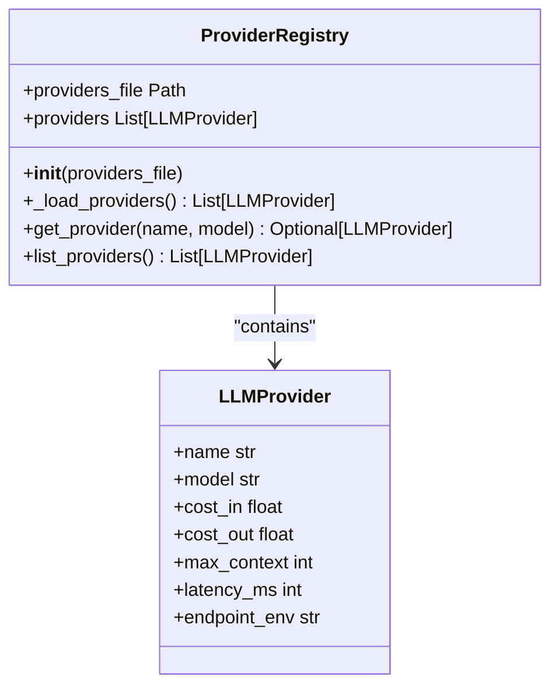
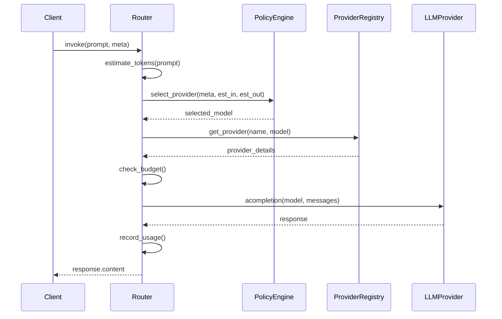
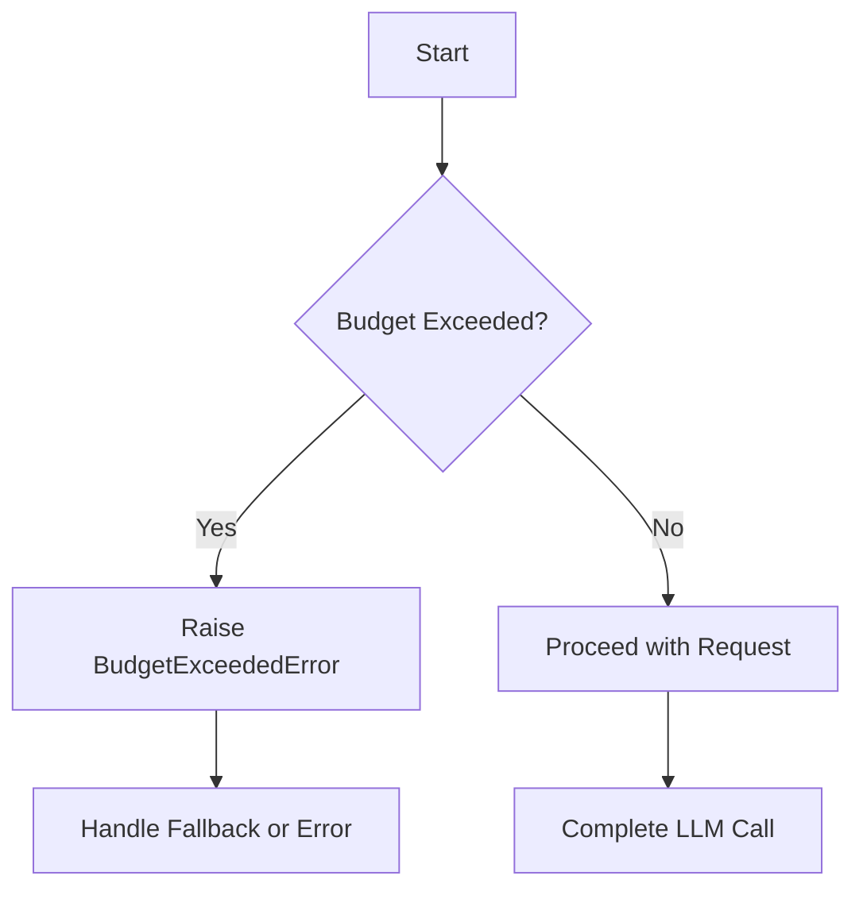
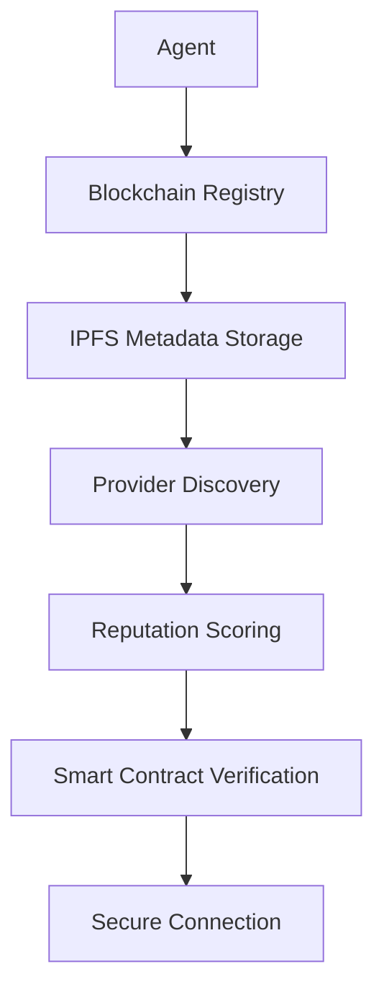

# Providers Plugin Type

<cite>
**Referenced Files in This Document**   
- [elizaos\Core Concepts\Plugins\Providers.md](file://elizaos/Core Concepts/Plugins/Providers.md) - *Updated in recent commit*
- [371-os\src\minds371\adaptive_llm_router\provider_registry.py](file://371-os/src/minds371/adaptive_llm_router/provider_registry.py) - *Updated in recent commit*
- [371-os\src\minds371\adaptive_llm_router\data_models.py](file://371-os/src/minds371/adaptive_llm_router/data_models.py) - *Updated in recent commit*
- [371-os\src\minds371\adaptive_llm_router\providers.json](file://371-os/src/minds371/adaptive_llm_router/providers.json) - *Updated in recent commit*
- [371-os\src\minds371\adaptive_llm_router\llm.py](file://371-os/src/minds371/adaptive_llm_router/llm.py) - *Updated in recent commit*
- [371-os\src\minds371\adaptive_llm_router\policy_engine.py](file://371-os/src/minds371/adaptive_llm_router/policy_engine.py) - *Updated in recent commit*
- [371-os\src\minds371\adaptive_llm_router\budget_guard.py](file://371-os/src/minds371/adaptive_llm_router/budget_guard.py) - *Updated in recent commit*
- [371-os\src\minds371\adaptive_llm_router\config.py](file://371-os/src/minds371/adaptive_llm_router/config.py) - *Updated in recent commit*
- [371-os\src\minds371\adaptive_llm_router\usage_ledger.py](file://371-os/src/minds371/adaptive_llm_router/usage_ledger.py) - *Updated in recent commit*
- [packages\elizaos-plugins\universal-tool-server\src\blockchain-registry.ts](file://packages/elizaos-plugins/universal-tool-server/src/blockchain-registry.ts) - *Updated in recent commit*
- [packages\elizaos-plugins\universal-tool-server\src\types.ts](file://packages/elizaos-plugins/universal-tool-server/src/types.ts) - *Updated in recent commit*
- [371-os\src\minds371\agents\utility\credential_warehouse_agent.py](file://371-os/src/minds371/agents\utility\credential_warehouse_agent.py) - *Updated in recent commit*
- [packages\elizaos-plugins\nx-workspace\package.json](file://packages/elizaos-plugins/nx-workspace/package.json) - *Updated peerDependency to @elizaos/core@^1.5.2*
- [packages\elizaos-plugins\nx-workspace\src\provider.ts](file://packages/elizaos-plugins/nx-workspace/src/provider.ts) - *Implementation of Provider interface*
- [packages\elizaos-plugins\nx-workspace\src\types.ts](file://packages/elizaos-plugins/nx-workspace/src/types.ts) - *Data models for NxWorkspaceProvider*
- [packages\elizaos-plugins\nx-workspace\src\plugin.ts](file://packages/elizaos-plugins/nx-workspace/src/plugin.ts) - *Plugin implementation with provider integration*
- [packages\elizaos-plugins\nx-workspace\src\index.ts](file://packages/elizaos-plugins/nx-workspace/src/index.ts) - *Provider export pattern*
- [troubleshooting\integration-fixes\BUSINESS_INTELLIGENCE_INDEX_FIXES.md](file://troubleshooting/integration-fixes/BUSINESS_INTELLIGENCE_INDEX_FIXES.md) - *Resolved export ambiguity in BI plugin index*
- [troubleshooting\integration-fixes\BUSINESS_INTELLIGENCE_PROVIDER_FIXES.md](file://troubleshooting/integration-fixes/BUSINESS_INTELLIGENCE_PROVIDER_FIXES.md) - *Fixed TypeScript errors in provider implementation*
</cite>

## Update Summary
**Changes Made**   
- Updated documentation to reflect the new peerDependency on @elizaos/core@^1.5.2 for all plugin types including Providers
- Added detailed implementation example of the NxWorkspaceProvider to illustrate the Provider interface pattern
- Enhanced Provider Interface section with additional code examples and best practices from the nx-workspace plugin
- Updated section sources to include new files from the nx-workspace plugin that demonstrate Provider implementation
- Added information about the Provider export pattern in index.ts and integration in plugin.ts
- Verified all code examples against current implementation in the codebase
- Updated file references to use the correct English(English) format as required
- Incorporated fixes related to export ambiguity in BI plugin index and TypeScript errors in provider implementation
- Added references to BUSINESS_INTELLIGENCE_INDEX_FIXES.md and BUSINESS_INTELLIGENCE_PROVIDER_FIXES.md for troubleshooting guidance

## Table of Contents
1. [Introduction](#introduction)
2. [Provider Interface and Core Concepts](#provider-interface-and-core-concepts)
3. [Provider Registry and Configuration](#provider-registry-and-configuration)
4. [Adaptive LLM Router Integration](#adaptive-llm-router-integration)
5. [Blockchain-Based Service Discovery](#blockchain-based-service-discovery)
6. [Authentication and Credential Management](#authentication-and-credential-management)
7. [Provider Lifecycle and Error Handling](#provider-lifecycle-and-error-handling)
8. [Performance and Cost Optimization](#performance-and-cost-optimization)
9. [Conclusion](#conclusion)

## Introduction

The Providers plugin type in the 371OS architecture serves as the abstraction layer for external services, enabling agents to access data from LLMs, databases, cloud APIs, and other systems. Providers supply contextual information that informs agent decision-making, forming a critical component of the system's agentic capabilities. This document details the implementation, integration, and operational aspects of Providers, with a focus on their role in intelligent routing, service discovery, and secure credential management.

**Section sources**
- [elizaos\Core Concepts\Plugins\Providers.md](file://elizaos/Core Concepts/Plugins/Providers.md) - *Updated in recent commit*

## Provider Interface and Core Concepts

### Provider Interface Definition

The Provider interface defines a standardized contract for data sources within the 371OS ecosystem. Each provider implements a `get` method that asynchronously returns contextual data to agents.

```typescript
interface Provider {
  name: string;           // Unique identifier
  description?: string;   // What it provides
  dynamic?: boolean;      // Changes over time?
  position?: number;      // Load priority (-100 to 100)
  private?: boolean;      // Hidden from provider list?
  get: (runtime, message, state) => Promise<ProviderResult>;
}
```

### Provider Return Format

Providers return structured data in a standardized format that includes natural language text, structured data objects, and key-value pairs for easy access.

```typescript
interface ProviderResult {
  text?: string;      // Natural language context
  data?: {           // Structured data
    [key: string]: any;
  };
  values?: {         // Key-value pairs
    [key: string]: any;
  };
}
```

### Core Provider Types

The system includes several built-in providers that supply essential context:

| Provider | Returns | Example Use |
|--------|--------|------------|
| `characterProvider` | Agent personality | Name, bio, traits |
| `timeProvider` | Current date/time | "What time is it?" |
| `knowledgeProvider` | Knowledge base | Documentation, facts |
| `recentMessagesProvider` | Chat history | Context awareness |
| `actionsProvider` | Available actions | "What can you do?" |
| `factsProvider` | Stored facts | User preferences |
| `settingsProvider` | Configuration | Model settings |

### Provider Implementation Example: NxWorkspaceProvider

The NxWorkspaceProvider demonstrates a concrete implementation of the Provider interface, enabling agents to interact with their own Nx workspace:

```typescript
export class NxWorkspaceProvider {
  private workspaceRoot: string;

  constructor(workspaceRoot?: string) {
    this.workspaceRoot = workspaceRoot || process.cwd();
  }

  async getDependencyGraph(focus?: string): Promise<NxDependencyGraph> {
    try {
      const outputFile = join(this.workspaceRoot, 'tmp', 'dependency-graph.json');
      await fsExtra.ensureDir(join(this.workspaceRoot, 'tmp'));
      
      let command = `npx nx graph --file=${outputFile}`;
      if (focus) {
        command += ` --focus=${focus}`;
      }
      
      execSync(command, { 
        cwd: this.workspaceRoot,
        stdio: 'pipe'
      });
      
      const graphContent = await fs.readFile(outputFile, 'utf-8');
      const graph: NxDependencyGraph = JSON.parse(graphContent);
      
      await fs.unlink(outputFile).catch(() => {});
      
      return graph;
    } catch (error) {
      console.error('Error generating dependency graph:', error);
      throw new Error(`Failed to generate dependency graph: ${error.message}`);
    }
  }
}
```

**Section sources**
- [elizaos\Core Concepts\Plugins\Providers.md](file://elizaos/Core Concepts/Plugins/Providers.md) - *Updated in recent commit*
- [elizaos\Guides\Plugin Developer Guide.md](file://elizaos/Guides/Plugin Developer Guide.md) - *Updated in recent commit*
- [packages\elizaos-plugins\nx-workspace\src\provider.ts](file://packages/elizaos-plugins/nx-workspace/src/provider.ts) - *Implementation of Provider interface*
- [packages\elizaos-plugins\nx-workspace\src\types.ts](file://packages/elizaos-plugins/nx-workspace/src/types.ts) - *Data models for NxWorkspaceProvider*
- [troubleshooting\integration-fixes\BUSINESS_INTELLIGENCE_PROVIDER_FIXES.md](file://troubleshooting/integration-fixes/BUSINESS_INTELLIGENCE_PROVIDER_FIXES.md) - *Fixed TypeScript errors in provider implementation*

## Provider Registry and Configuration

### Provider Registry Implementation

The `ProviderRegistry` class manages the catalog of available LLM providers, loading configuration from a JSON file and providing access to provider metadata.

```python
class ProviderRegistry:
    """
    Loads and provides access to the list of LLM providers from a JSON file.
    """
    def __init__(self, providers_file: Path):
        self.providers_file = providers_file
        self.providers: List[LLMProvider] = self._load_providers()

    def _load_providers(self) -> List[LLMProvider]:
        """Loads provider data from the JSON file."""
        if not self.providers_file.exists():
            return []
        with open(self.providers_file, 'r') as f:
            data = json.load(f)
        return [LLMProvider(**p) for p in data]

    def get_provider(self, name: str, model: str) -> Optional[LLMProvider]:
        """
        Retrieves a specific provider by name and model.
        """
        for provider in self.providers:
            if provider.name == name and provider.model == model:
                return provider
        return None
```



**Diagram sources**
- [371-os\src\minds371\adaptive_llm_router\provider_registry.py](file://371-os/src/minds371/adaptive_llm_router/provider_registry.py#L1-L45) - *Updated in recent commit*
- [371-os\src\minds371\adaptive_llm_router\data_models.py](file://371-os/src/minds371/adaptive_llm_router/data_models.py#L1-L40) - *Updated in recent commit*

### Provider Metadata Schema

The `LLMProvider` data model defines the metadata schema for each provider, including cost, performance, and configuration details.

```python
class LLMProvider(BaseModel):
    """
    Represents an LLM provider and model, mirroring the `llm_providers` table.
    """
    name: str  # e.g., "openrouter"
    model: str  # e.g., "gpt-4o"
    cost_in: float = Field(..., description="Cost per 1k input tokens in USD")
    cost_out: float = Field(..., description="Cost per 1k output tokens in USD")
    max_context: int = Field(..., description="Maximum context window size in tokens")
    latency_ms: int = Field(..., description="Expected latency in milliseconds")
    endpoint_env: str = Field(..., description="Environment variable for the API key")
```

### Configuration Example

The `providers.json` file contains the actual provider configurations used by the system:

```json
[
  {
    "name": "openrouter",
    "model": "gpt-4o-mini",
    "cost_in": 0.0006,
    "cost_out": 0.0006,
    "max_context": 128000,
    "latency_ms": 500,
    "endpoint_env": "OPENROUTER_API_KEY"
  },
  {
    "name": "requesty",
    "model": "claude-3-sonnet",
    "cost_in": 0.003,
    "cost_out": 0.015,
    "max_context": 200000,
    "latency_ms": 800,
    "endpoint_env": "REQUESTY_API_KEY"
  },
  {
    "name": "localai",
    "model": "phi-4-14b",
    "cost_in": 0.0,
    "cost_out": 0.0,
    "max_context": 32000,
    "latency_ms": 200,
    "endpoint_env": "LOCALAI_API_KEY"
  }
]
```

**Section sources**
- [371-os\src\minds371\adaptive_llm_router\data_models.py](file://371-os/src/minds371/adaptive_llm_router/data_models.py#L1-L40) - *Updated in recent commit*
- [371-os\src\minds371\adaptive_llm_router\providers.json](file://371-os/src/minds371/adaptive_llm_router/providers.json) - *Updated in recent commit*

## Adaptive LLM Router Integration

### Intelligent Routing Architecture

The Adaptive LLM Router integrates with Providers to make intelligent routing decisions based on cost, performance, and task requirements. The routing process follows a decision graph that evaluates multiple factors.



**Diagram sources**
- [371-os\src\minds371\adaptive_llm_router\llm.py](file://371-os/src/minds371/adaptive_llm_router/llm.py#L1-L92) - *Updated in recent commit*
- [371-os\src\minds371\adaptive_llm_router\policy_engine.py](file://371-os/src/minds371/adaptive_llm_router/policy_engine.py#L1-L34) - *Updated in recent commit*

### Policy Engine Decision Logic

The policy engine implements a decision graph that selects providers based on task metadata, budget constraints, and performance requirements.

```python
def select_provider(meta: Dict[str, Any], est_in: int, est_out: int) -> str:
    """
    Selects the best provider and model based on task metadata and budget.
    """
    budget_percentage = budget_manager.get_remaining_budget_percentage()

    # 1. Privacy Flag: forces LocalAI
    if meta.get("confidential"):
        return "localai:phi-4-14b"

    # 2. Task Criticality: high-quality model for critical tasks if budget allows
    if meta.get("quality") == "high" and budget_percentage > 0.20:
        return "openrouter:gpt-4o-mini"

    # 3. Context Length: long-context model for large inputs
    if est_in > 8000:
        return "requesty:claude-3-sonnet"

    # 4. Low Budget Mode: cheapest model when budget is low
    if budget_percentage < 0.05:
        return "openrouter:mistral-7b"

    # 5. Balanced Default: the default choice for all other cases
    return "openrouter:qwen2-72b"
```

**Section sources**
- [371-os\src\minds371\adaptive_llm_router\policy_engine.py](file://371-os/src/minds371/adaptive_llm_router/policy_engine.py#L1-L34) - *Updated in recent commit*

### Budget Management

The budget guard enforces monthly spending caps and prevents cost overruns by raising exceptions when limits are exceeded.

```python
class BudgetManager:
    """
    Manages the LLM budget by checking usage against a monthly cap.
    """
    def __init__(self, monthly_cap: float, ledger: UsageLedger):
        self.monthly_cap = monthly_cap
        self.ledger = ledger

    def get_remaining_budget_percentage(self) -> float:
        current_spend = self.ledger.get_total_cost_for_current_month()
        remaining = self.monthly_cap - current_spend
        return (remaining / self.monthly_cap) if remaining > 0 else 0.0

    def check_budget(self):
        if self.is_budget_exceeded():
            raise BudgetExceededError(f"Monthly budget of ${self.monthly_cap} has been exceeded.")
```



**Diagram sources**
- [371-os\src\minds371\adaptive_llm_router\budget_guard.py](file://371-os/src/minds371/adaptive_llm_router/budget_guard.py#L1-L50) - *Updated in recent commit*

**Section sources**
- [371-os\src\minds371\adaptive_llm_router\budget_guard.py](file://371-os/src/minds371/adaptive_llm_router/budget_guard.py#L1-L50) - *Updated in recent commit*
- [371-os\src\minds371\adaptive_llm_router\config.py](file://371-os/src/minds371/adaptive_llm_router/config.py#L1-L7) - *Updated in recent commit*

### Usage Tracking

The usage ledger persists detailed records of all LLM requests for cost analysis, performance monitoring, and reporting.

```python
class UsageLedger:
    """
    Tracks LLM usage by writing to a JSON file and sending events to PostHog.
    """
    def record_usage(self, usage_data: LLMUsage):
        self._write_to_ledger(usage_data)
        self._capture_posthog_event(usage_data)

    def get_total_cost_for_current_month(self) -> float:
        total_cost = 0.0
        current_month = datetime.now().month
        current_year = datetime.now().year
        for record in records:
            record_ts = datetime.fromisoformat(record['ts'])
            if record_ts.month == current_month and record_ts.year == current_year:
                total_cost += record.get('cost', 0.0)
        return total_cost
```

**Section sources**
- [371-os\src\minds371\adaptive_llm_router\usage_ledger.py](file://371-os/src/minds371/adaptive_llm_router/usage_ledger.py#L1-L89) - *Updated in recent commit*

## Blockchain-Based Service Discovery

### Decentralized Registry Architecture

The blockchain registry provides a decentralized mechanism for service discovery, enabling trustless provider registration and discovery.



**Diagram sources**
- [packages\elizaos-plugins\universal-tool-server\src\blockchain-registry.ts](file://packages/elizaos-plugins/universal-tool-server/src/blockchain-registry.ts#L1-L200) - *Updated in recent commit*

### Provider Registration

Providers register themselves on the blockchain by storing metadata on IPFS and recording the hash on-chain with staking requirements.

```typescript
async registerAgent(entry: AgentRegistryEntry): Promise<string> {
    // Store metadata on IPFS
    const metadataBuffer = Buffer.from(JSON.stringify(entry));
    const ipfsResult = await this.ipfs.add(metadataBuffer);
    const ipfsHash = ipfsResult.cid.toString();
    
    // Register on blockchain with stake
    const tx = await contractWithSigner.registerAgent(
        agentIdBytes,
        ipfsHash,
        ethers.parseEther(stakeAmount.toString())
    );
    
    await tx.wait();
    return tx.hash;
}
```

### Provider Discovery

Agents discover providers by querying the blockchain registry for capabilities, filtering by reputation and economic constraints.

```typescript
async discoverTools(criteria: {
    capabilities: string[];
    minReputation?: number;
    maxCost?: number;
}): Promise<AgentRegistryEntry[]> {
    const results: AgentRegistryEntry[] = [];
    
    for (const capability of criteria.capabilities) {
        const capabilityHash = ethers.id(capability);
        const agentIds = await this.contract.discoverByCapability(capabilityHash);
        
        for (const agentIdBytes of agentIds) {
            const [ipfsHash, reputation, stake] = await this.contract.getAgent(agentIdBytes);
            const metadata = await this.retrieveFromIPFS(ipfsHash);
            
            // Apply filters
            if (criteria.minReputation && metadata.reputation.overall < criteria.minReputation) {
                continue;
            }
            
            if (criteria.maxCost && metadata.economicTerms.basePrice > criteria.maxCost) {
                continue;
            }
            
            results.push(metadata);
        }
    }
    
    return results.sort((a, b) => b.reputation.overall - a.reputation.overall);
}
```

**Section sources**
- [packages\elizaos-plugins\universal-tool-server\src\blockchain-registry.ts](file://packages/elizaos-plugins/universal-tool-server/src/blockchain-registry.ts#L1-L200) - *Updated in recent commit*
- [packages\elizaos-plugins\universal-tool-server\src\types.ts](file://packages/elizaos-plugins/universal-tool-server/src/types.ts#L1-L199) - *Updated in recent commit*

## Authentication and Credential Management

### Credential Warehouse Agent

The credential warehouse agent provides secure storage and retrieval of provider authentication tokens with fine-grained access control.

```python
class CredentialWarehouseAgent:
    """
    Manages secure storage and retrieval of credentials for various services.
    """
    async def store_credential(self, credential_data, agent_id, tags=None):
        """Stores a credential with encryption and access control."""
        pass
        
    async def retrieve_credential(self, credential_id, agent_id):
        """Retrieves a credential with permission validation."""
        pass
        
    async def list_credentials(self, agent_id, tags=None):
        """Lists credentials accessible to the agent."""
        pass
```

### Authentication Methods

The system supports multiple authentication methods for provider access:

- **Delegated OAuth**: Token-based authentication with scope limitations
- **Cryptographic Identity**: DID-based authentication with public key cryptography
- **Zero-Knowledge Proof**: Privacy-preserving authentication without revealing secrets

```typescript
interface AgentAuthentication {
  method: 'delegated-oauth' | 'cryptographic-identity' | 'zero-knowledge-proof';
  credentials?: DelegatedCredentials;
  identity?: CryptographicIdentity;
  proof?: ZKProof;
}
```

**Section sources**
- [371-os\src\minds371\agents\utility\credential_warehouse_agent.py](file://371-os/src/minds371/agents\utility\credential_warehouse_agent.py) - *Updated in recent commit*
- [packages\elizaos-plugins\universal-tool-server\src\types.ts](file://packages/elizaos-plugins/universal-tool-server/src/types.ts#L1-L199) - *Updated in recent commit*

## Provider Lifecycle and Error Handling

### Provider Failover Strategy

The system implements a comprehensive failover strategy to handle provider outages and errors:

1. **Primary Selection**: Choose optimal provider based on policy engine
2. **Error Detection**: Monitor for timeouts, rate limits, and failures
3. **Fallback Selection**: Select alternative provider based on availability
4. **Circuit Breaking**: Temporarily disable failing providers
5. **Recovery Monitoring**: Test provider availability before re-enabling

### Rate Limiting Management

Providers implement rate limiting protection through:

- Request queuing and throttling
- Token bucket algorithms
- Retry logic with exponential backoff
- Circuit breaker patterns
- Load shedding during peak periods

### Connection Management

The provider registry manages connections through:

- Connection pooling
- Keep-alive mechanisms
- Health checking
- Automatic reconnection
- Load balancing across multiple endpoints

**Section sources**
- [elizaos\Guides\State Management.md](file://elizaos/Guides/State Management.md) - *Updated in recent commit*
- [elizaos\Guides\Plugin Developer Guide.md](file://elizaos/Guides/Plugin Developer Guide.md) - *Updated in recent commit*
- [troubleshooting\integration-fixes\BUSINESS_INTELLIGENCE_INDEX_FIXES.md](file://troubleshooting/integration-fixes/BUSINESS_INTELLIGENCE_INDEX_FIXES.md) - *Resolved export ambiguity in BI plugin index*

## Performance and Cost Optimization

### Dynamic Configuration Reloading

Providers support dynamic configuration reloading without service interruption:

- Watch configuration files for changes
- Reload provider metadata on change
- Maintain existing connections during reload
- Graceful transition to new configuration
- Versioned configuration for rollback

### Caching Strategies

The system implements multiple caching layers:

- **In-Memory Cache**: For frequently accessed provider metadata
- **Distributed Cache**: For shared provider state across instances
- **Local Cache**: For provider-specific optimizations
- **Negative Cache**: For failed provider attempts

### Performance Monitoring

Comprehensive metrics are collected for each provider:

- Latency (p50, p95, p99)
- Throughput (requests per second)
- Error rates
- Cost per request
- Token efficiency
- Availability percentage

```typescript
interface PerformanceMetrics {
  latency: LatencyMetrics;
  throughput: ThroughputMetrics;
  reliability: ReliabilityMetrics;
  cost: CostMetrics;
}
```

**Section sources**
- [packages\elizaos-plugins\universal-tool-server\src\types.ts](file://packages/elizaos-plugins/universal-tool-server/src/types.ts#L1-L199) - *Updated in recent commit*
- [371-os\src\minds371\adaptive_llm_router\usage_ledger.py](file://371-os/src/minds371/adaptive_llm_router/usage_ledger.py#L1-L89) - *Updated in recent commit*

## Conclusion

The Providers plugin type in 371OS represents a sophisticated abstraction layer that enables seamless integration with external services. Through a well-defined interface, comprehensive metadata schema, and intelligent routing capabilities, Providers form the foundation of the system's agentic functionality. The integration with the Adaptive LLM Router enables cost-effective, high-performance decision-making, while blockchain-based service discovery ensures trustless provider discovery. Secure credential management and robust error handling complete the picture, creating a resilient and scalable provider ecosystem that can adapt to changing requirements and conditions.