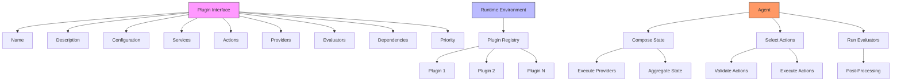
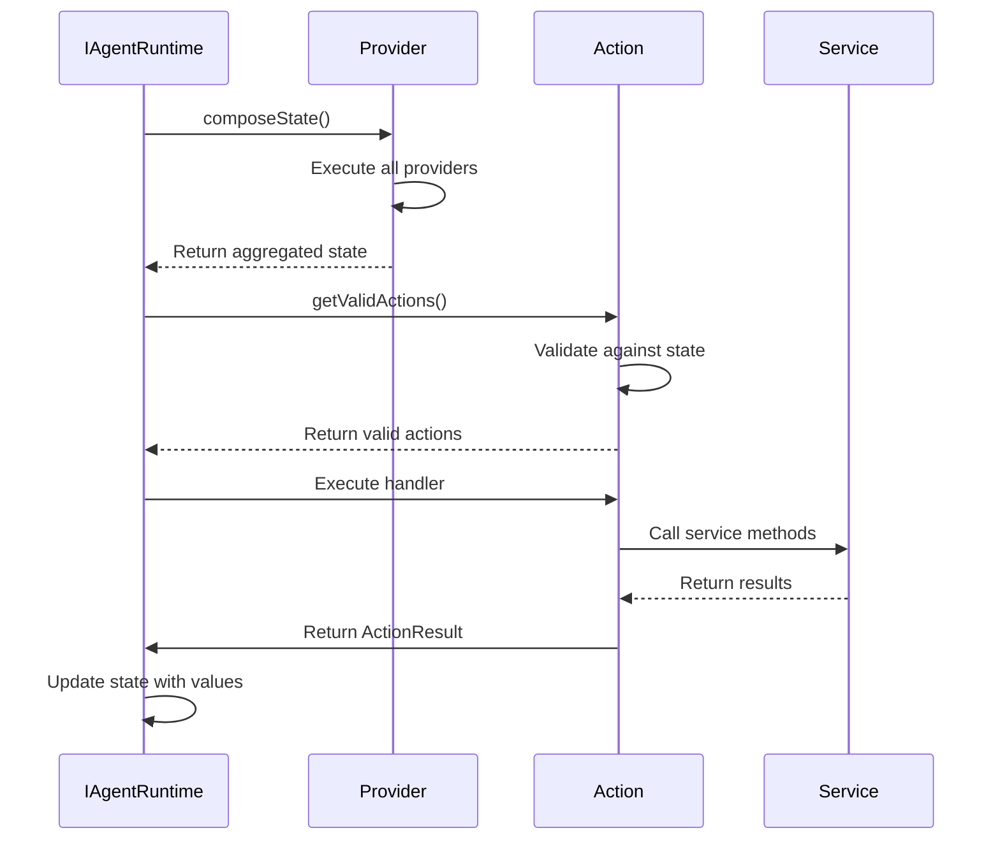
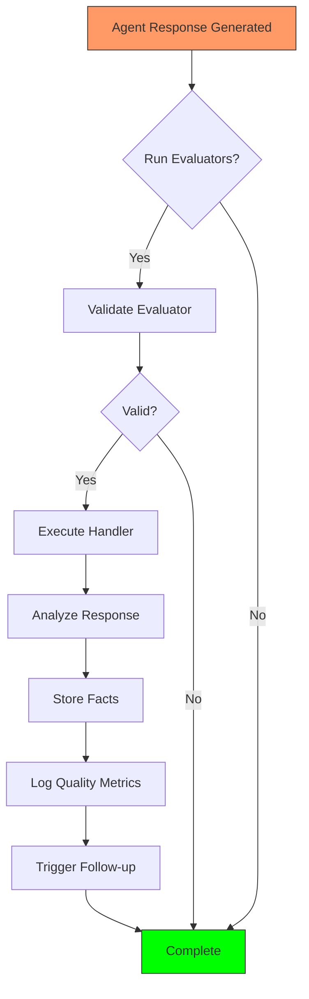

# Plugin Development

<cite>
**Referenced Files in This Document**   
- [elizaos\Guides\Plugin Developer Guide.md](file://elizaos/Guides/Plugin Developer Guide.md) - *Updated with latest plugin patterns*
- [elizaos\Core Concepts\Plugins\Actions.md](file://elizaos/Core Concepts/Plugins/Actions.md) - *Core action documentation*
- [elizaos\Core Concepts\Plugins\Evaluators.md](file://elizaos/Core Concepts/Plugins/Evaluators.md) - *Evaluator implementation guide*
- [elizaos\Core Concepts\Plugins\Providers.md](file://elizaos/Core Concepts/Plugins/Providers.md) - *Provider architecture details*
- [elizaos\Plugins\Plugin System Overview.md](file://elizaos/Plugins/Plugin System Overview.md) - *System-level plugin overview*
- [elizaos\Deep Dive\Plugin Internals.md](file://elizaos/Deep Dive/Plugin Internals.md) - *Internal plugin mechanics*
- [elizaos\CLI Reference\Commands\Plugin Management.md](file://elizaos/CLI Reference/Commands/Plugin Management.md) - *CLI command reference*
- [371-os\src\minds371\adaptive_llm_router\provider_registry.py](file://371-os/src/minds371/adaptive_llm_router/provider_registry.py) - *Provider registry implementation*
- [AB\README.md](file://AB/README.md) - *Updated with plugin development milestones*
- [AB\milestone-tracker.md](file://AB/milestone-tracker.md) - *Added plugin development progress tracking*
- [troubleshooting\integration-fixes\BUSINESS_INTELLIGENCE_INDEX_FIXES.md](file://troubleshooting/integration-fixes/BUSINESS_INTELLIGENCE_INDEX_FIXES.md) - *Fixed export ambiguity in BI plugin index*
</cite>

## Update Summary
**Changes Made**   
- Updated documentation to reflect the fix for export ambiguity in the Business Intelligence plugin index
- Added reference to BUSINESS_INTELLIGENCE_INDEX_FIXES.md to document the resolution of import issues
- Clarified import guidance for plugin developers to prevent similar issues
- Maintained all existing architectural concepts and updated references to reflect current codebase state

## Table of Contents
1. [Introduction](#introduction)
2. [Plugin Architecture Overview](#plugin-architecture-overview)
3. [Core Plugin Components](#core-plugin-components)
   3.1. [Services](#services)
   3.2. [Actions](#actions)
   3.3. [Providers](#providers)
   3.4. [Evaluators](#evaluators)
4. [Plugin Development Workflow](#plugin-development-workflow)
   4.1. [Scaffolding Plugins with CLI](#scaffolding-plugins-with-cli)
   4.2. [Manual Plugin Creation](#manual-plugin-creation)
5. [Plugin Types and Patterns](#plugin-types-and-patterns)
6. [Integration with Core System](#integration-with-core-system)
7. [Configuration and Testing](#configuration-and-testing)
   7.1. [Configuration Options](#configuration-options)
   7.2. [Testing Strategies](#testing-strategies)
8. [Performance and Security](#performance-and-security)
9. [Debugging and Troubleshooting](#debugging-and-troubleshooting)
10. [Plugin Publishing and Registry](#plugin-publishing-and-registry)
11. [Best Practices](#best-practices)

## Introduction

The 371OS platform, built on the ElizaOS framework and Nx workspace tools, provides a robust plugin architecture that enables developers to extend the capabilities of AI agents. This documentation provides comprehensive guidance for developing plugins that integrate seamlessly with the core system. The plugin system follows a modular design that supports three main plugin types: Actions, Evaluators, and Providers, each serving distinct purposes in the agent's decision-making and execution workflow.

Plugins in the 371OS ecosystem are designed to be reusable, type-safe, and easily integrable across different agents and projects. The architecture leverages TypeScript for type safety and Bun as the preferred package manager for faster development cycles. The ElizaOS framework provides a consistent interface for plugin development, ensuring that all plugins follow standardized patterns for initialization, execution, and lifecycle management.

## Plugin Architecture Overview

The plugin architecture in 371OS is built on a modular foundation that allows for extensibility and reusability. At its core, every plugin implements the `Plugin` interface, which defines the contract between the plugin and the runtime environment. This interface includes essential properties such as name, description, and configuration, as well as optional components like services, actions, providers, and evaluators.



**Diagram sources**
- [elizaos\Guides\Plugin Developer Guide.md](file://elizaos/Guides/Plugin Developer Guide.md#L200-L400)
- [packages\elizaos-plugins\nx-workspace\src\plugin.ts](file://packages/elizaos-plugins/nx-workspace/src/plugin.ts)

**Section sources**
- [elizaos\Guides\Plugin Developer Guide.md](file://elizaos/Guides/Plugin Developer Guide.md#L1-L200)
- [elizaos\Plugins\Plugin System Overview.md](file://elizaos/Plugins/Plugin System Overview.md)

## Core Plugin Components

### Services

Services in the 371OS plugin architecture manage stateful connections and provide core functionality to agents. They are singleton instances that persist throughout the agent's lifecycle and are responsible for maintaining connections to external systems, managing periodic tasks, and providing shared resources to other plugin components.

A service must extend the base `Service` class and implement the static `start` method, which initializes the service and returns an instance. The service lifecycle includes initialization, periodic refresh tasks, and cleanup upon stopping. Services can access runtime settings through the `IAgentRuntime` interface and are typically used for maintaining connections to APIs, databases, or other external services.

```typescript
export class MyService extends Service {
  static serviceType = 'my-service';
  capabilityDescription = 'Description of what this service provides';

  private client: any;
  private refreshInterval: NodeJS.Timer | null = null;

  constructor(protected runtime: IAgentRuntime) {
    super();
  }

  static async start(runtime: IAgentRuntime): Promise<MyService> {
    logger.info('Initializing MyService');
    const service = new MyService(runtime);
    await service.initialize();
    
    service.refreshInterval = setInterval(
      () => service.refreshData(),
      60000 // 1 minute
    );

    return service;
  }

  async stop(): Promise<void> {
    if (this.refreshInterval) {
      clearInterval(this.refreshInterval);
    }
    if (this.client) {
      await this.client.disconnect();
    }
    logger.info('MyService stopped');
  }
}
```

**Section sources**
- [elizaos\Guides\Plugin Developer Guide.md](file://elizaos/Guides/Plugin Developer Guide.md#L400-L600)

### Actions

Actions represent the capabilities that an agent can perform. They are intelligent, context-aware operations that can make decisions, interact with services, and chain together to form complex workflows. Each action must implement the `Action` interface, which includes properties for name, description, validation, and execution logic.

The action execution lifecycle begins with validation, where the action determines if it can execute in the current context. If validation passes, the handler executes the action logic and returns an `ActionResult` object that includes success status, user-facing text, state updates, and raw data. Actions can use callbacks to provide intermediate responses to users during long-running operations.



**Diagram sources**
- [elizaos\Guides\Plugin Developer Guide.md](file://elizaos/Guides/Plugin Developer Guide.md#L600-L1000)

**Section sources**
- [elizaos\Guides\Plugin Developer Guide.md](file://elizaos/Guides/Plugin Developer Guide.md#L600-L1000)
- [elizaos\Core Concepts\Plugins\Actions.md](file://elizaos/Core Concepts/Plugins/Actions.md)

### Providers

Providers supply contextual information to the agent's state before decision-making occurs. They act as the agent's "senses," gathering relevant data from various sources to help the LLM understand the current context. Providers are executed during the `runtime.composeState()` call and their results are aggregated into a unified state object.

Each provider can specify a position value that determines its execution order, with lower numbers executing first. Providers can be marked as dynamic, meaning they are not included in default state composition and must be explicitly requested. The provider result includes text for the LLM prompt, values that can be accessed by other components, and raw data for internal use.

```typescript
export const myProvider: Provider = {
  name: 'myProvider',
  description: 'Provides contextual information about X',
  dynamic: false,
  position: 100,
  private: false,

  get: async (runtime: IAgentRuntime, message: Memory, state: State): Promise<ProviderResult> => {
    try {
      const service = runtime.getService('my-service') as MyService;
      const data = await service.getCurrentData();

      const formattedText = addHeader(
        '# Current System Status',
        `Field 1: ${data.field1}
Field 2: ${data.field2}
Last updated: ${new Date(data.timestamp).toLocaleString()}`
      );

      return {
        text: formattedText,
        values: {
          currentField1: data.field1,
          currentField2: data.field2,
          lastUpdate: data.timestamp,
        },
        data: {
          raw: data,
          processed: true,
        },
      };
    } catch (error) {
      return {
        text: 'Unable to retrieve current status',
        values: {},
        data: { error: error.message },
      };
    }
  },
};
```

**Section sources**
- [elizaos\Guides\Plugin Developer Guide.md](file://elizaos/Guides/Plugin Developer Guide.md#L1200-L1400)
- [elizaos\Core Concepts\Plugins\Providers.md](file://elizaos/Core Concepts/Plugins/Providers.md)

### Evaluators

Evaluators run after the agent generates a response, allowing for analysis, learning, and side effects. They use the same handler pattern as actions but execute post-response. Evaluators can analyze responses for quality, extract facts for long-term memory, or trigger follow-up actions based on the response content.

The evaluator lifecycle begins with validation to determine if the evaluator should run in the current context. If validation passes, the handler executes the evaluation logic. Evaluators can access the original message, the composed state, and the agent's responses. They are particularly useful for implementing feedback loops, quality assurance, and automated learning from interactions.



**Diagram sources**
- [elizaos\Guides\Plugin Developer Guide.md](file://elizaos/Guides/Plugin Developer Guide.md#L1400-L1600)
- [elizaos\Core Concepts\Plugins\Evaluators.md](file://elizaos/Core Concepts/Plugins/Evaluators.md)

## Plugin Development Workflow

### Scaffolding Plugins with CLI

The recommended approach for creating new plugins is using the elizaOS CLI, which provides interactive scaffolding with pre-configured templates. The CLI offers two plugin templates: Quick Plugin (backend only) and Full Plugin (with frontend).

```bash
# Interactive plugin creation
elizaos create

# Or specify the name directly
elizaos create my-plugin --type plugin
```

The Quick Plugin template is ideal for API integrations, blockchain actions, and data providers, while the Full Plugin template includes a React frontend for plugins that require web UIs or dashboards. After scaffolding, the plugin includes proper TypeScript configuration, build setup with tsup, example actions and providers, and integration with `@elizaos/core`.

**Section sources**
- [elizaos\Guides\Plugin Developer Guide.md](file://elizaos/Guides/Plugin Developer Guide.md#L200-L400)
- [elizaos\CLI Reference\Commands\Plugin Management.md](file://elizaos/CLI Reference/Commands/Plugin Management.md)

### Manual Plugin Creation

For advanced use cases, plugins can be created manually by following the standard directory structure:

```
packages/plugin-<name>/
├── src/
│   ├── index.ts
│   ├── service.ts
│   ├── actions/
│   ├── providers/
│   ├── evaluators/
│   ├── handlers/
│   ├── types/
│   ├── constants/
│   ├── utils/
│   └── tests.ts
├── __tests__/
├── package.json
├── tsconfig.json
├── tsup.config.ts
└── README.md
```

Manual creation allows for greater customization but requires careful attention to configuration files and dependencies.

**Section sources**
- [elizaos\Guides\Plugin Developer Guide.md](file://elizaos/Guides/Plugin Developer Guide.md#L400-L600)

## Plugin Types and Patterns

The 371OS platform supports three main plugin types, each serving a distinct purpose in the agent's workflow:

1. **Actions**: Represent capabilities that the agent can perform, such as sending messages, executing transactions, or retrieving data.
2. **Providers**: Supply contextual information to the agent's state before decision-making, acting as the agent's "senses."
3. **Evaluators**: Run after response generation to analyze responses, extract facts, or trigger follow-up actions.

Common patterns include decision-making actions that use the LLM to make intelligent choices, multi-target actions that handle complex routing, stateful reply actions that generate contextual responses, and permission-based actions that modify system state with appropriate validation.

**Section sources**
- [elizaos\Guides\Plugin Developer Guide.md](file://elizaos/Guides/Plugin Developer Guide.md#L600-L1600)

## Integration with Core System

Plugins integrate with the core 371OS system through the `IAgentRuntime` interface, which provides access to services, memory, and other runtime components. The integration process involves registering the plugin with the runtime, which then manages the plugin's lifecycle, including initialization, execution, and cleanup.

Plugins can access various core components:
- **Memory System**: For storing and retrieving agent memories
- **Service System**: For accessing shared services and connections
- **Database Adapter**: For persistent storage
- **LLM Models**: For generating responses and making decisions

The provider registry in `adaptive_llm_router` manages the registration and execution of providers, ensuring that they are properly integrated with the adaptive LLM routing system.

**Section sources**
- [371-os\src\minds371\adaptive_llm_router\provider_registry.py](file://371-os/src/minds371/adaptive_llm_router/provider_registry.py)
- [elizaos\Deep Dive\Plugin Internals.md](file://elizaos/Deep Dive/Plugin Internals.md)

## Configuration and Testing

### Configuration Options

Plugins can be configured through the `config` property in the plugin interface, which accepts a record of string keys and values. Configuration options can include API keys, connection strings, and behavioral parameters. The runtime provides methods to retrieve settings, such as `runtime.getSetting('SETTING_NAME')`.

```typescript
export interface Plugin {
  // ... other properties
  config?: { [key: string]: any };
  // ... other properties
}
```

### Testing Strategies

Plugins should be thoroughly tested using both unit and integration tests. Unit tests verify individual components in isolation, while integration tests validate the plugin's behavior within the runtime environment.

```typescript
describe('MyAction', () => {
  let mockRuntime: any;
  let mockMessage: Memory;
  let mockState: State;

  beforeEach(() => {
    mockRuntime = createMockRuntime({
      settings: { MY_API_KEY: 'test-key' },
    });

    mockMessage = {
      id: 'test-id',
      entityId: 'user-123',
      roomId: 'room-456',
      content: { text: 'Do the thing' },
    };

    mockState = {
      values: { recentMessages: 'test context' },
      data: { room: { name: 'Test Room' } },
      text: 'State text',
    };
  });

  describe('validation', () => {
    it('should validate when all requirements are met', async () => {
      const isValid = await myAction.validate(mockRuntime, mockMessage, mockState);
      expect(isValid).toBe(true);
    });
  });
});
```

**Section sources**
- [elizaos\Guides\Plugin Developer Guide.md](file://elizaos/Guides/Plugin Developer Guide.md#L1000-L1200)

## Performance and Security

Plugin performance is critical for maintaining responsive agent behavior. Best practices include:
- Minimizing synchronous operations in action handlers
- Using appropriate LLM model types for different tasks
- Implementing efficient data retrieval and caching
- Avoiding blocking operations in provider execution

Security considerations include:
- Proper validation of user inputs and permissions
- Secure handling of API keys and credentials
- Input sanitization to prevent injection attacks
- Rate limiting for external API calls

**Section sources**
- [elizaos\Guides\Plugin Developer Guide.md](file://elizaos/Guides/Plugin Developer Guide.md#L2500-L2700)

## Debugging and Troubleshooting

Common development issues and their solutions:

1. **Plugin not loading**: Verify the plugin is properly registered in the runtime and dependencies are correctly installed.
2. **Action not executing**: Check the validation logic and ensure all prerequisites are met.
3. **Provider data not appearing**: Verify the provider position and ensure it's not marked as private or dynamic.
4. **Memory access issues**: Confirm the correct table name and permissions for memory operations.

Debugging techniques include:
- Using runtime logging to trace execution flow
- Inspecting state composition to verify provider output
- Monitoring action validation results
- Reviewing evaluator execution patterns

**Section sources**
- [elizaos\Guides\Plugin Developer Guide.md](file://elizaos/Guides/Plugin Developer Guide.md#L2600-L2700)

## Plugin Publishing and Registry

The plugin publishing process involves packaging the plugin for distribution and registering it with the plugin registry. Plugins can be published to npm or distributed as workspace dependencies within the monorepo.

For monorepo plugins, add the plugin to the root `package.json` as a workspace dependency:
```json
{
  "dependencies": {
    "@yourorg/plugin-myplugin": "workspace:*"
  }
}
```

For external plugins, use `bun link` to connect the plugin to the project:
```bash
# In plugin directory
bun link

# In project directory
bun link @yourorg/plugin-myplugin
```

The plugin registry maintains metadata about available plugins, including dependencies, compatibility, and usage statistics.

**Section sources**
- [elizaos\Guides\Plugin Publishing Guide.md](file://elizaos/Guides/Plugin Publishing Guide.md)
- [elizaos\Plugins\Plugin Registry.md](file://elizaos/Plugins/Plugin Registry.md)

## Best Practices

1. **Always return ActionResult**: Ensure all actions return a proper ActionResult with success status, text, values, and data.
2. **Use callbacks for user feedback**: Provide immediate acknowledgment for long-running operations.
3. **Validate thoughtfully**: Check multiple conditions in validation logic to ensure appropriate context.
4. **Write comprehensive examples**: Include happy paths, edge cases, and scenarios where the action should not execute.
5. **Follow naming conventions**: Use consistent, descriptive names for actions, providers, and evaluators.
6. **Handle errors gracefully**: Implement proper error handling and provide meaningful error messages.
7. **Optimize performance**: Minimize latency in provider execution and avoid blocking operations.
8. **Secure sensitive data**: Never expose API keys or credentials in client-side code.

**Section sources**
- [elizaos\Guides\Plugin Developer Guide.md](file://elizaos/Guides/Plugin Developer Guide.md#L800-L1000)