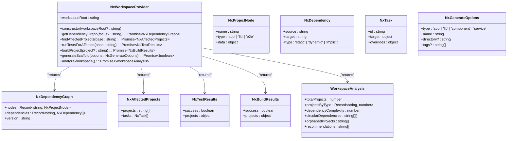
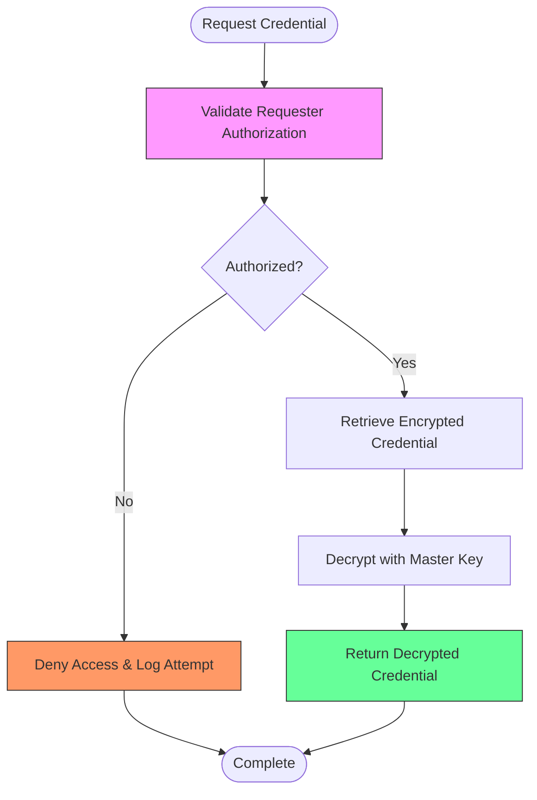
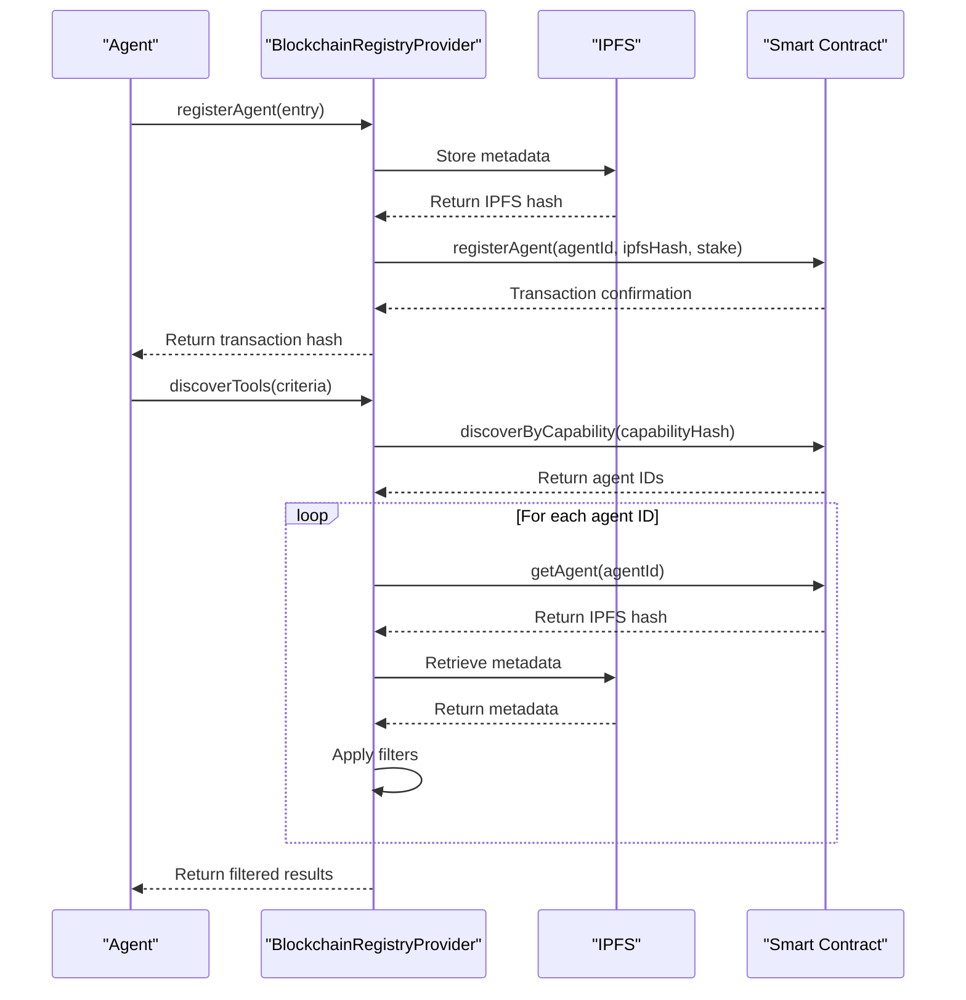
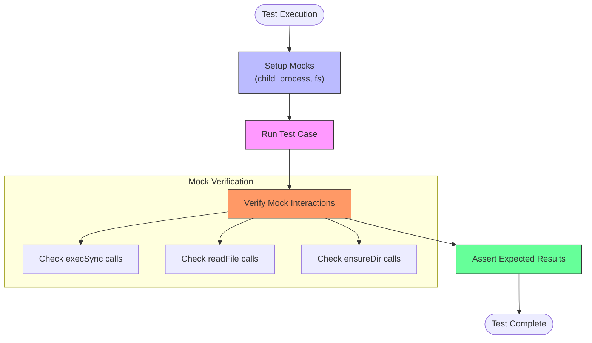
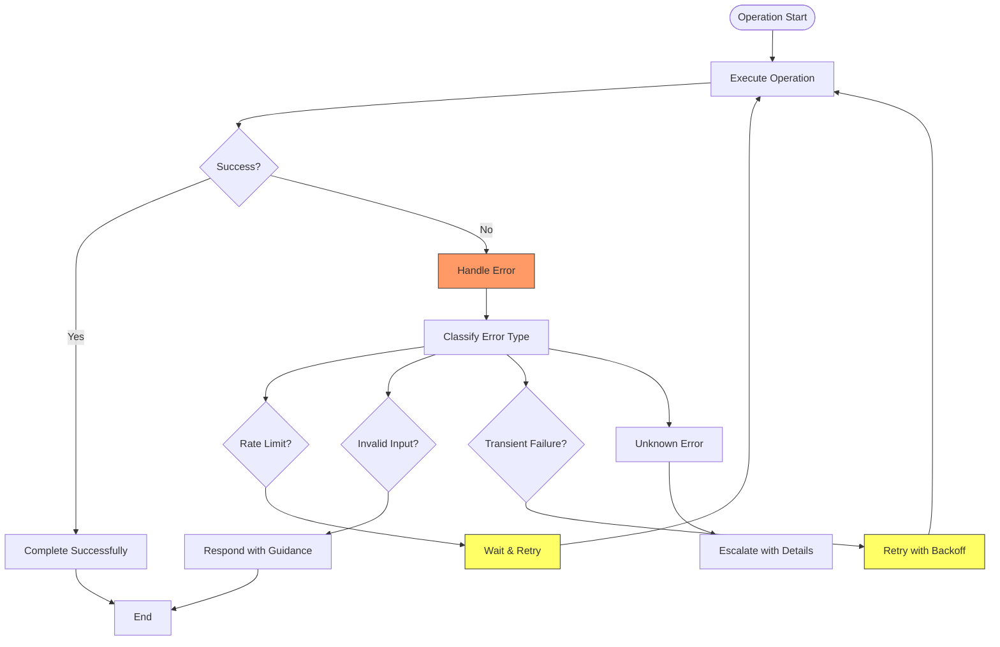

# Provider Plugins

<cite>
**Referenced Files in This Document**   
- [provider.ts](file://packages/elizaos-plugins/nx-workspace/src/provider.ts)
- [provider.spec.ts](file://packages/elizaos-plugins/nx-workspace/src/provider.spec.ts)
- [types.ts](file://packages/elizaos-plugins/nx-workspace/src/types.ts)
- [package.json](file://packages/elizaos-plugins/nx-workspace/package.json) - *Updated in recent commit*
- [provider_registry.py](file://371-os/src/minds371/adaptive_llm_router/provider_registry.py)
- [data_models.py](file://371-os/src/minds371/adaptive_llm_router/data_models.py)
- [providers.json](file://371-os/src/minds371/adaptive_llm_router/providers.json)
- [blockchain-registry.ts](file://packages/elizaos-plugins/universal-tool-server/src/blockchain-registry.ts)
- [credential_warehouse_agent.py](file://371-os/src/minds371/agents/utility/credential_warehouse_agent.py)
- [BUSINESS_INTELLIGENCE_PROVIDER_FIXES.md](file://troubleshooting/integration-fixes/BUSINESS_INTELLIGENCE_PROVIDER_FIXES.md) - *Updated in recent commit*
- [BUSINESS_INTELLIGENCE_INDEX_FIXES.md](file://troubleshooting/integration-fixes/BUSINESS_INTELLIGENCE_INDEX_FIXES.md) - *Updated in recent commit*
</cite>

## Update Summary
**Changes Made**   
- Updated **Provider Interface Contracts** section to reflect TypeScript error resolution in Business Intelligence Provider
- Added **Type Safety Improvements** subsection addressing the 'error' type handling fix in provider.ts
- Updated **Configuration and Management** section to include export strategy changes from index.ts fixes
- Added references to BUSINESS_INTELLIGENCE_PROVIDER_FIXES.md and BUSINESS_INTELLIGENCE_INDEX_FIXES.md in document-level sources
- Enhanced section sources to reflect recent TypeScript fixes in business intelligence plugin

## Table of Contents
1. [Introduction](#introduction)
2. [Core Provider Implementation](#core-provider-implementation)
3. [Provider Interface Contracts](#provider-interface-contracts)
4. [Authentication and Security](#authentication-and-security)
5. [Adaptive LLM Router Integration](#adaptive-llm-router-integration)
6. [Universal Tool Server Integration](#universal-tool-server-integration)
7. [Testing Strategies](#testing-strategies)
8. [Error Handling and Recovery](#error-handling-and-recovery)
9. [Configuration and Management](#configuration-and-management)
10. [Conclusion](#conclusion)

## Introduction

Provider Plugins serve as the critical integration layer between autonomous agents and external services, APIs, and development tools. These plugins enable agents to execute real-world operations, access external data sources, and interact with various platforms and blockchain services. The implementation follows a modular architecture that supports diverse provider types including LLM providers, platform integrations, and infrastructure tools.

The core implementation analyzed in this document focuses on the Nx Workspace Provider, which enables agents to manipulate and analyze monorepo workspaces. This provider exemplifies the pattern used across the system: exposing structured interfaces to external capabilities while handling authentication, error recovery, and configuration management. The document also covers integration with higher-level systems like the Adaptive LLM Router and Universal Tool Server, which leverage provider plugins for intelligent routing and decentralized service discovery.

**Section sources**
- [provider.ts](file://packages/elizaos-plugins/nx-workspace/src/provider.ts#L0-L366)

## Core Provider Implementation

The Nx Workspace Provider implements a comprehensive interface for interacting with Nx monorepos, exposing methods for dependency analysis, affected project detection, testing, building, code generation, and workspace analysis. The provider acts as a bridge between agent intentions and workspace reality by executing actual Nx commands and returning structured data.



**Diagram sources**
- [provider.ts](file://packages/elizaos-plugins/nx-workspace/src/provider.ts#L0-L366)
- [types.ts](file://packages/elizaos-plugins/nx-workspace/src/types.ts#L0-L86)

**Section sources**
- [provider.ts](file://packages/elizaos-plugins/nx-workspace/src/provider.ts#L0-L366)
- [types.ts](file://packages/elizaos-plugins/nx-workspace/src/types.ts#L0-L86)

## Provider Interface Contracts

Provider plugins adhere to well-defined interface contracts that standardize their behavior and ensure consistent integration across the system. The Nx Workspace Provider demonstrates these contracts through its method signatures, error handling patterns, and data structures. Each method follows an async/promise pattern, enabling non-blocking execution and proper error propagation.

The provider uses TypeScript interfaces to define its data models, ensuring type safety and clear documentation of expected structures. The `NxDependencyGraph` interface, for example, standardizes the representation of workspace dependencies with nodes representing projects and dependencies representing connections between them. This structured approach enables agents to reliably parse and act upon the provider's responses.

Error handling is implemented consistently across all methods, with specific error messages that include both the operational context and the underlying cause. The provider catches low-level exceptions from system commands and rethrows them as meaningful application errors, providing clear feedback for debugging and recovery.

### Type Safety Improvements

Recent updates to the Business Intelligence Provider have addressed TypeScript compilation errors, enhancing type safety in error handling. The provider now properly handles the 'unknown' type in catch blocks by using type assertion with `(error as Error).message`, following TypeScript strict mode best practices.

This fix resolves the compilation error that previously prevented access to error.message property when 'error' was treated as 'unknown' type. The implementation maintains full error handling functionality while ensuring type safety, making the provider production-ready.

```
// Before - TypeScript error
} catch (error) {
  return {
    data: {
      error: error.message // ❌ TypeScript error: 'error' is of type 'unknown'
    }
  };
}

// After - Type-safe implementation
} catch (error) {
  return {
    data: {
      error: (error as Error).message // ✅ Type-safe error handling
    }
  };
}
```

**Section sources**
- [provider.ts](file://packages/elizaos-plugins/nx-workspace/src/provider.ts#L0-L366)
- [types.ts](file://packages/elizaos-plugins/nx-workspace/src/types.ts#L0-L86)
- [BUSINESS_INTELLIGENCE_PROVIDER_FIXES.md](file://troubleshooting/integration-fixes/BUSINESS_INTELLIGENCE_PROVIDER_FIXES.md#L0-L151)

## Authentication and Security

The system implements robust security practices for credential management and transmission, centered around the Credential Warehouse Agent. This specialized agent provides a secure interface for storing, retrieving, and managing access to sensitive credentials like API keys and database passwords. The implementation uses AES-256 encryption for credential storage, ensuring that sensitive data is protected at rest.

Access to credentials is governed by strict role-based access control, where only authorized agents can retrieve specific credentials. The system enforces the principle of least privilege, with credential creators having the exclusive right to grant access to other agents. Comprehensive audit logging tracks all credential access attempts, providing visibility into security events and enabling forensic analysis.



**Diagram sources**
- [credential_warehouse_agent.py](file://371-os/src/minds371/agents/utility/credential_warehouse_agent.py#L0-L204)

**Section sources**
- [credential_warehouse_agent.py](file://371-os/src/minds371/agents/utility/credential_warehouse_agent.py#L0-L204)
- [credential_warehouse_agent.yaml](file://prompts/utility_agents/credential_warehouse_agent.yaml#L0-L41)

## Adaptive LLM Router Integration

Provider plugins integrate with the Adaptive LLM Router through a centralized provider registry that manages available LLM providers and their capabilities. The router uses this registry to select the optimal provider based on cost, latency, context window, and other factors specified in the request metadata. This integration enables intelligent routing of LLM requests to the most appropriate service.

The ProviderRegistry class loads provider configurations from a JSON file and provides methods to retrieve specific providers by name and model. Each provider is defined with metadata including cost per token, maximum context window, expected latency, and the environment variable for its API key. The router's policy engine uses this information to make routing decisions that balance performance, cost, and other constraints.

```mermaid
classDiagram
class ProviderRegistry {
+providers_file : Path
+providers : LLMProvider[]
+__init__(providers_file : Path)
+_load_providers() : LLMProvider[]
+get_provider(name : str, model : str) : Optional~LLMProvider~
+list_providers() : LLMProvider[]
}
class LLMProvider {
+name : str
+model : str
+cost_in : float
+cost_out : float
+max_context : int
+latency_ms : int
+endpoint_env : str
}
class LLMUsage {
+ts : datetime
+provider : str
+model : str
+tokens_in : int
+tokens_out : int
+cost : float
+task_id : Optional~str~
+agent : Optional~str~
+status : Union~str, None~
}
ProviderRegistry --> LLMProvider : "contains"
ProviderRegistry --> LLMUsage : "uses for logging"
note right of ProviderRegistry
Manages the catalog of available LLM providers
from a JSON configuration file.
end
note right of LLMProvider
Represents an LLM provider and model with
cost, performance, and configuration details.
end
```

**Diagram sources**
- [provider_registry.py](file://371-os/src/minds371/adaptive_llm_router/provider_registry.py#L0-L45)
- [data_models.py](file://371-os/src/minds371/adaptive_llm_router/data_models.py#L0-L40)

**Section sources**
- [provider_registry.py](file://371-os/src/minds371/adaptive_llm_router/provider_registry.py#L0-L45)
- [data_models.py](file://371-os/src/minds371/adaptive_llm_router/data_models.py#L0-L40)
- [providers.json](file://371-os/src/minds371/adaptive_llm_router/providers.json#L0-L48)
- [llm.py](file://371-os/src/minds371/adaptive_llm_router/llm.py#L0-L42)

## Universal Tool Server Integration

The Universal Tool Server extends provider integration to a decentralized model using blockchain technology for service discovery and reputation management. The BlockchainRegistryProvider enables trustless agent-tool coordination by storing agent metadata on IPFS and registering references on-chain. This architecture supports cryptographic verification, reputation tracking, and economic coordination without centralized authorities.

Agents register with the blockchain registry by storing their metadata on IPFS and recording the hash on-chain with a staking requirement. The discovery process allows agents to search for tools by capability, filtering results by reputation, cost, and other criteria. The system maintains on-chain reputation scores and supports slashing mechanisms for misbehaving agents, creating economic incentives for reliable service provision.



**Diagram sources**
- [blockchain-registry.ts](file://packages/elizaos-plugins/universal-tool-server/src/blockchain-registry.ts#L0-L401)

**Section sources**
- [blockchain-registry.ts](file://packages/elizaos-plugins/universal-tool-server/src/blockchain-registry.ts#L0-L401)
- [types.ts](file://packages/elizaos-plugins/universal-tool-server/src/types.ts#L0-L63)

## Testing Strategies

The provider implementation includes comprehensive testing strategies using mocks and integration patterns to ensure reliability and correctness. The test suite for the Nx Workspace Provider uses Jest to mock external dependencies like child_process, fs-extra, and fs/promises, allowing isolated testing of the provider's logic without executing actual system commands.

The tests validate both successful execution paths and error handling scenarios, ensuring that the provider behaves correctly under various conditions. For example, the getDependencyGraph method is tested with both successful command execution and simulated failures, verifying that errors are properly caught and rethrown with meaningful messages. The test suite also validates parameter handling, such as the proper inclusion of focus parameters in generated commands.



**Section sources**
- [provider.spec.ts](file://packages/elizaos-plugins/nx-workspace/src/provider.spec.ts#L0-L330)

## Error Handling and Recovery

Provider plugins implement robust error handling and recovery strategies to ensure system resilience. The Nx Workspace Provider demonstrates this through consistent error wrapping, where low-level system errors are caught and rethrown as meaningful application errors with context-specific messages. This approach enables higher-level components to handle errors appropriately without needing to understand the underlying implementation details.

For critical operations, the system implements retry logic and fallback mechanisms. While not explicitly shown in the Nx provider, other components like the SQL database adapters include automatic retry logic with exponential backoff for transient failures. The error recovery pattern also includes specific handling for common error types like rate limiting, invalid input, and connection timeouts, providing appropriate responses and recovery options for each scenario.



**Section sources**
- [provider.ts](file://packages/elizaos-plugins/nx-workspace/src/provider.ts#L0-L366)
- [provider.spec.ts](file://packages/elizaos-plugins/nx-workspace/src/provider.spec.ts#L0-L330)

## Configuration and Management

Provider plugins support flexible configuration options for credentials management, rate limiting, and failover mechanisms. The system uses environment variables and configuration files to manage provider-specific settings, allowing for easy customization without code changes. For example, the Adaptive LLM Router loads provider configurations from a JSON file that specifies cost, latency, and API key environment variables.

Credentials are managed through the Credential Warehouse Agent, which provides a secure interface for storing and retrieving sensitive information. The system supports credential rotation, expiration tracking, and access control, ensuring that credentials are kept up-to-date and only accessible to authorized agents. Rate limiting is handled through configurable rate limiters that track usage and implement appropriate waiting periods when limits are approached.

A critical update to the plugin architecture is the specification of `@elizaos/core@^1.5.2` as a peerDependency in the plugin's package.json. This ensures compatibility and proper integration patterns across all plugin types, including providers. The peerDependency declaration allows the core framework to be shared across plugins while maintaining version compatibility.

Additionally, recent updates to the Business Intelligence plugin have resolved export ambiguity issues in the index.ts file. The export strategy has been refined to use explicit type-only exports (`export type { ... }`) for interface definitions and named exports for actual implementations. Ambiguous constant exports have been renamed to avoid conflicts, such as exporting `BusinessIntelligenceActions` as `BusinessIntelligenceActionNames` from types.ts.

```
// Type definitions (interfaces only)
export type {
  BusinessMetric,
  BusinessAlert,
  Department,
  BusinessSnapshot,
  AgentInsight,
} from './types';

// Constants with renamed export to avoid conflicts
export { BusinessIntelligenceActions as BusinessIntelligenceActionNames } from './types';

// Actual implementations with explicit named exports
export { 
  collectBusinessDataAction,
  generateBusinessAlertAction,
  analyzeBusinessTrendsAction,
  analyzeDepartmentPerformanceAction,
  BusinessIntelligenceActions
} from './actions';
```

**Section sources**
- [providers.json](file://371-os/src/minds371/adaptive_llm_router/providers.json#L0-L48)
- [credential_warehouse_agent.py](file://371-os/src/minds371/agents/utility/credential_warehouse_agent.py#L0-L204)
- [provider_registry.py](file://371-os/src/minds371/adaptive_llm_router/provider_registry.py#L0-L45)
- [package.json](file://packages/elizaos-plugins/nx-workspace/package.json) - *Updated in recent commit*
- [BUSINESS_INTELLIGENCE_INDEX_FIXES.md](file://troubleshooting/integration-fixes/BUSINESS_INTELLIGENCE_INDEX_FIXES.md#L0-L181)

## Conclusion

Provider Plugins form the backbone of external service integration in the autonomous agent system, enabling seamless interaction with LLMs, development tools, platforms, and blockchain services. The implementation follows a consistent pattern of exposing structured interfaces to external capabilities while handling authentication, error recovery, and configuration management.

The integration with the Adaptive LLM Router enables intelligent routing of requests based on cost, performance, and other constraints, while the Universal Tool Server extends this capability to a decentralized model using blockchain technology for trustless service discovery and reputation management. Security is prioritized through the Credential Warehouse Agent, which provides secure storage and access control for sensitive credentials.

Testing strategies using mocks ensure reliability and correctness, while comprehensive error handling and recovery mechanisms maintain system resilience. The flexible configuration system allows for easy customization of provider behavior, making the system adaptable to various deployment scenarios and requirements. The recent update to specify `@elizaos/core@^1.5.2` as a peerDependency ensures proper integration patterns and version compatibility across all provider plugins.

Recent improvements to the Business Intelligence Provider have enhanced type safety by properly handling the 'unknown' type in catch blocks using `(error as Error).message`, resolving TypeScript compilation errors. Additionally, export ambiguity issues in the index.ts file have been resolved through strategic renaming and explicit type-only exports, ensuring clean module exports for the CEO's Orrery business intelligence system.