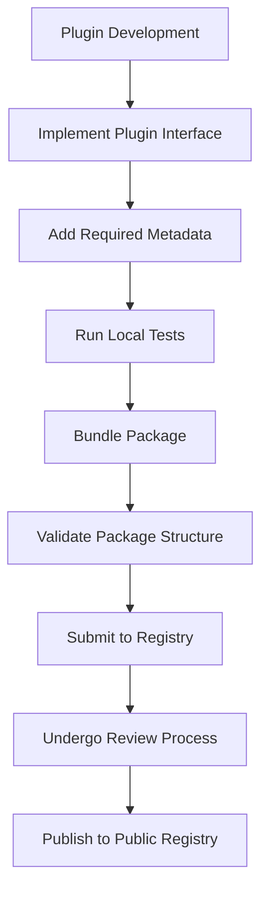
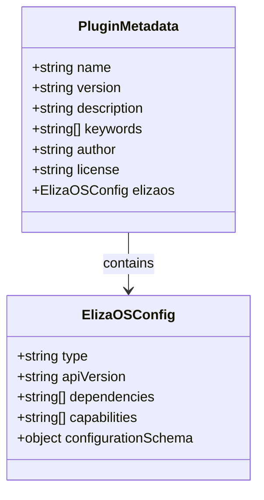
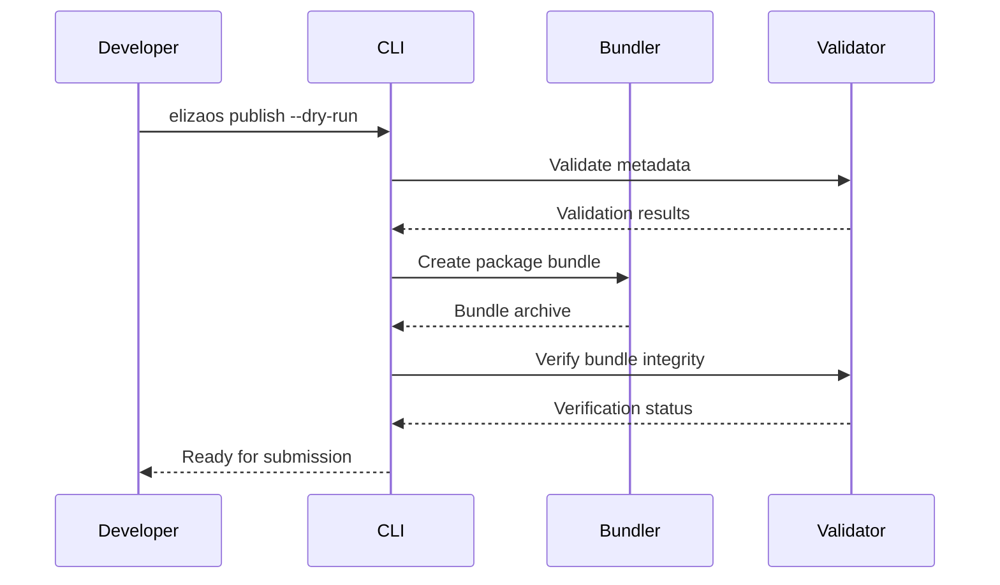
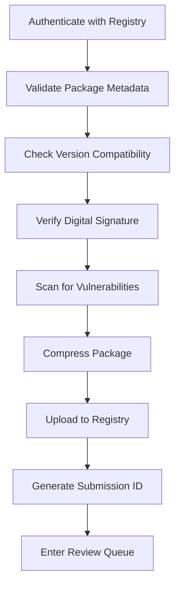
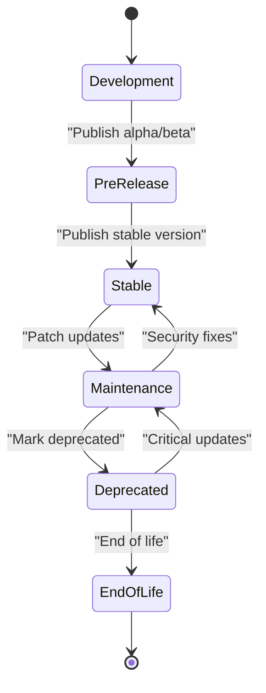
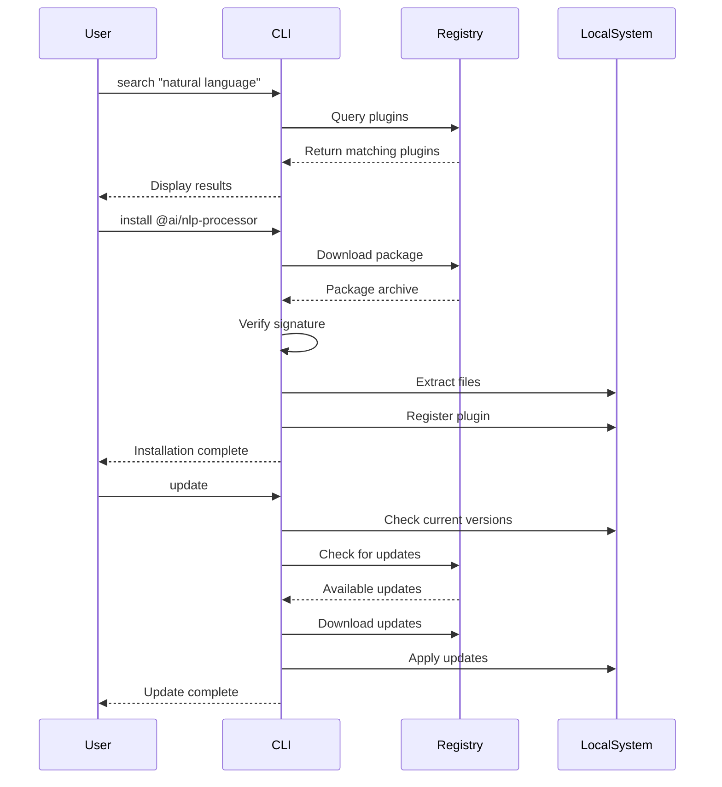
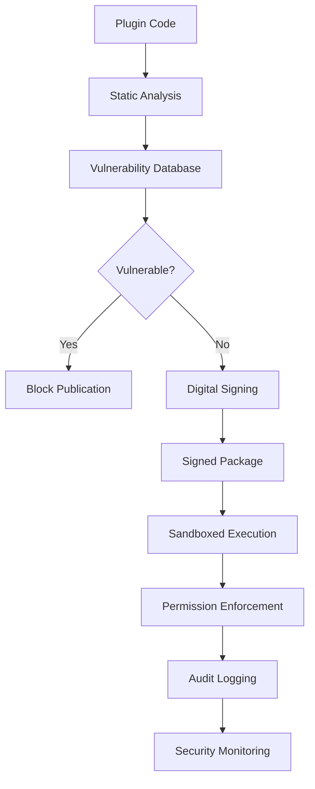

# Publishing and Registry Management

<cite>
**Referenced Files in This Document**   
- [Plugin Publishing Guide.md](file://elizaos/Guides/Plugin Publishing Guide.md)
- [Publish Command.md](file://elizaos/CLI Reference/Commands/Publish Command.md)
- [Plugin Developer Guide.md](file://elizaos/Guides/Plugin Developer Guide.md)
- [Plugin Schema Guide.md](file://elizaos/Guides/Plugin Schema Guide.md)
- [Plugin Registry.md](file://elizaos/Plugins/Plugin Registry.md)
- [Plugin System Overview.md](file://elizaos/Plugins/Plugin System Overview.md)
- [package.json](file://packages/elizaos-plugins/nx-workspace/package.json)
- [plugin.ts](file://packages/elizaos-plugins/nx-workspace/src/plugin.ts)
- [types.ts](file://packages/elizaos-plugins/nx-workspace/src/types.ts)
</cite>

## Table of Contents
1. [Introduction](#introduction)
2. [Plugin Publishing Process](#plugin-publishing-process)
3. [Plugin Metadata Requirements](#plugin-metadata-requirements)
4. [Versioning and Package Bundling](#versioning-and-package-bundling)
5. [Registry Submission via ElizaOS CLI](#registry-submission-via-elizaos-cli)
6. [Review and Validation Process](#review-and-validation-process)
7. [Version Management and Deprecation](#version-management-and-deprecation)
8. [User Discovery, Installation, and Updates](#user-discovery-installation-and-updates)
9. [Security Considerations](#security-considerations)
10. [Best Practices](#best-practices)

## Introduction
This document provides comprehensive guidance on publishing plugins to the 371OS registry and managing their lifecycle within the ElizaOS ecosystem. It covers the complete workflow from development to publication, including metadata requirements, versioning strategies, security protocols, and user interaction patterns. The 371OS plugin system enables extensibility through modular components that can be discovered, installed, and updated by users across the platform.

**Section sources**
- [Plugin System Overview.md](file://elizaos/Plugins/Plugin System Overview.md#L1-L20)
- [Plugin Publishing Guide.md](file://elizaos/Guides/Plugin Publishing Guide.md#L1-L15)

## Plugin Publishing Process
The plugin publishing process involves several key stages: development, packaging, metadata configuration, validation, and registry submission. Developers must first create a plugin that adheres to the ElizaOS plugin architecture, implementing required interfaces and following established design patterns. The plugin must be structured as a standalone package with proper dependencies declared.

Plugins are developed within the `packages/elizaos-plugins` directory using a monorepo structure. Each plugin exists as an independent package with its own source files, tests, and configuration. The development process follows standard practices outlined in the Plugin Developer Guide, including proper typing, error handling, and integration with the core agent runtime.

Once development is complete, the plugin must be bundled into a distributable format. This involves compiling TypeScript sources (if applicable), resolving dependencies, and creating a compressed package archive. The bundling process ensures that all necessary files are included and that the plugin can be reliably deployed across different environments.



**Diagram sources**
- [plugin.ts](file://packages/elizaos-plugins/nx-workspace/src/plugin.ts#L1-L50)
- [Plugin Developer Guide.md](file://elizaos/Guides/Plugin Developer Guide.md#L10-L30)

**Section sources**
- [Plugin Developer Guide.md](file://elizaos/Guides/Plugin Developer Guide.md#L1-L100)
- [Plugin Publishing Guide.md](file://elizaos/Guides/Plugin Publishing Guide.md#L15-L40)

## Plugin Metadata Requirements
Plugins must include comprehensive metadata in their package.json file to enable proper discovery, compatibility checking, and installation. The metadata schema is defined in the Plugin Schema Guide and enforced during the validation process.

Key metadata fields include:
- **name**: Unique identifier following the format `@scope/plugin-name`
- **version**: Semantic version number (major.minor.patch)
- **description**: Brief summary of plugin functionality
- **keywords**: Array of search terms for discovery
- **author**: Plugin developer information
- **license**: SPDX license identifier
- **elizaos**: Plugin-specific configuration object containing:
  - **type**: Plugin category (action, provider, evaluator)
  - **apiVersion**: Compatible ElizaOS API version
  - **dependencies**: Required plugin dependencies
  - **capabilities**: Array of supported features
  - **configurationSchema**: JSON Schema for plugin configuration

The metadata enables the registry to perform compatibility checks between plugins and the host system. It also powers the discovery interface, allowing users to search and filter plugins based on functionality, popularity, and compatibility.



**Diagram sources**
- [package.json](file://packages/elizaos-plugins/nx-workspace/package.json#L1-L30)
- [types.ts](file://packages/elizaos-plugins/nx-workspace/src/types.ts#L5-L25)

**Section sources**
- [Plugin Schema Guide.md](file://elizaos/Guides/Plugin Schema Guide.md#L1-L80)
- [package.json](file://packages/elizaos-plugins/nx-workspace/package.json#L1-L50)

## Versioning and Package Bundling
The plugin system follows Semantic Versioning (SemVer) 2.0.0 for version management. Version numbers follow the pattern MAJOR.MINOR.PATCH, where:
- **MAJOR**: Incremented for backward-incompatible changes
- **MINOR**: Incremented for new functionality in a backward-compatible manner
- **PATCH**: Incremented for backward-compatible bug fixes

Package bundling creates a distributable archive containing all necessary plugin files. The bundling process includes:
1. Compiling source code (TypeScript to JavaScript)
2. Resolving and including dependencies
3. Minifying code (optional)
4. Generating source maps (optional)
5. Creating a compressed archive (tar.gz)

The bundle must include:
- Compiled JavaScript files
- Package manifest (package.json)
- Type definitions (.d.ts files)
- Documentation files (README.md)
- License file
- Configuration templates

Versioning and bundling are automated through the ElizaOS CLI, which validates the version number against the previous release and ensures the bundle meets size and structure requirements.



**Diagram sources**
- [Publish Command.md](file://elizaos/CLI Reference/Commands/Publish Command.md#L1-L25)
- [Plugin Publishing Guide.md](file://elizaos/Guides/Plugin Publishing Guide.md#L25-L50)

**Section sources**
- [Plugin Publishing Guide.md](file://elizaos/Guides/Plugin Publishing Guide.md#L20-L60)
- [Publish Command.md](file://elizaos/CLI Reference/Commands/Publish Command.md#L1-L30)

## Registry Submission via ElizaOS CLI
Plugins are submitted to the 371OS registry using the ElizaOS CLI's publish command. The submission process requires authentication and follows a standardized workflow.

To publish a plugin, developers execute:
```bash
elizaos publish [package-path] [options]
```

Command options include:
- `--registry`: Target registry URL
- `--tag`: Distribution tag (e.g., "latest", "beta")
- `--dry-run`: Validate without submitting
- `--verbose`: Show detailed output
- `--api-key`: Authentication token

The CLI performs several validation steps before submission:
1. Authenticates the user with the registry
2. Validates package.json structure and required fields
3. Checks version number against existing releases
4. Verifies digital signature (if enabled)
5. Scans for known vulnerabilities
6. Compresses and uploads the package bundle

Successful submissions receive a unique submission ID and enter the review queue. Developers receive email notifications about the review status and any issues that need to be addressed.



**Diagram sources**
- [Publish Command.md](file://elizaos/CLI Reference/Commands/Publish Command.md#L1-L40)
- [Plugin Publishing Guide.md](file://elizaos/Guides/Plugin Publishing Guide.md#L40-L70)

**Section sources**
- [Publish Command.md](file://elizaos/CLI Reference/Commands/Publish Command.md#L1-L50)
- [Plugin Publishing Guide.md](file://elizaos/Guides/Plugin Publishing Guide.md#L40-L80)

## Review and Validation Process
All plugin submissions undergo a comprehensive review and validation process before being approved for the public registry. This multi-stage process ensures quality, security, and compatibility.

The review process includes:
1. **Automated Validation**: System checks for package integrity, metadata completeness, and basic security
2. **Security Scanning**: Static analysis for vulnerabilities, malicious code patterns, and dependency risks
3. **Compatibility Testing**: Verification against supported ElizaOS versions and platform requirements
4. **Manual Review**: Human evaluation of code quality, documentation, and user experience
5. **Performance Testing**: Assessment of resource usage and impact on system performance

Plugins are tested in an isolated environment that simulates real-world usage scenarios. The testing framework evaluates:
- Startup time and initialization
- Memory and CPU usage
- Error handling and recovery
- Integration with core services
- Configuration flexibility

Reviewers use a standardized checklist to ensure consistent evaluation across all submissions. Common rejection reasons include:
- Incomplete or inaccurate documentation
- Security vulnerabilities in code or dependencies
- Poor error handling or crash conditions
- Excessive resource consumption
- Violations of API usage policies
- Inadequate test coverage

Approved plugins are signed by the registry and assigned a trust level based on the review outcome. Developers receive detailed feedback for rejected submissions, enabling them to address issues and resubmit.

```mermaid
graph TB
A["Submission Received"] --> B["Automated Validation"]
B --> C{"Valid?"}
C --> |No| D["Reject with Error Report"]
C --> |Yes| E["Security Scanning"]
E --> F{"Secure?"}
F --> |No| G["Reject with Security Advisory"]
F --> |Yes| H["Compatibility Testing"]
H --> I{"Compatible?"}
I --> |No| J["Reject with Compatibility Report"]
I --> |Yes| K["Manual Review"]
K --> L["Performance Testing"]
L --> M{"Approved?"]
M --> |No| N["Request Changes"]
M --> |Yes| O["Sign Package"]
O --> P["Publish to Registry"]
```

**Diagram sources**
- [Plugin Registry.md](file://elizaos/Plugins/Plugin Registry.md#L1-L40)
- [Plugin Publishing Guide.md](file://elizaos/Guides/Plugin Publishing Guide.md#L60-L100)

**Section sources**
- [Plugin Registry.md](file://elizaos/Plugins/Plugin Registry.md#L1-L50)
- [Plugin Publishing Guide.md](file://elizaos/Guides/Plugin Publishing Guide.md#L50-L120)

## Version Management and Deprecation
The plugin registry supports comprehensive version management to ensure backward compatibility and smooth upgrades. Developers can publish multiple versions of a plugin simultaneously, using distribution tags to manage release channels.

Version management features include:
- **Multiple Active Versions**: Support for parallel version streams (e.g., 1.x, 2.x)
- **Distribution Tags**: Named references to specific versions (e.g., "latest", "beta", "stable")
- **Version Pinning**: Ability to lock dependencies to specific versions
- **Deprecation Notices**: Formal process for marking versions as deprecated
- **End-of-Life Announcements**: Notification system for discontinued versions

When deprecating a version, developers must:
1. Publish a deprecation notice in the plugin's README
2. Update the package.json with deprecation metadata
3. Provide migration guidance to newer versions
4. Maintain critical security fixes for a minimum period
5. Announce end-of-life timeline

The registry enforces a deprecation policy requiring:
- 30 days notice before end-of-life
- Continued security updates during deprecation period
- Clear documentation of breaking changes
- Migration tools when significant changes are introduced

Users receive warnings when installing deprecated versions, encouraging them to upgrade to supported releases. The CLI provides commands to list available versions, check deprecation status, and migrate between versions.



**Diagram sources**
- [Plugin Publishing Guide.md](file://elizaos/Guides/Plugin Publishing Guide.md#L100-L140)
- [Plugin Registry.md](file://elizaos/Plugins/Plugin Registry.md#L30-L60)

**Section sources**
- [Plugin Publishing Guide.md](file://elizaos/Guides/Plugin Publishing Guide.md#L80-L150)
- [Plugin Registry.md](file://elizaos/Plugins/Plugin Registry.md#L25-L70)

## User Discovery, Installation, and Updates
Users discover, install, and update plugins through the ElizaOS CLI and integrated development environment. The plugin registry provides a searchable catalog with filtering by category, popularity, and compatibility.

Discovery features include:
- Full-text search across plugin names, descriptions, and keywords
- Category browsing (actions, providers, evaluators)
- Sorting by download count, rating, and recent updates
- Compatibility filtering by ElizaOS version
- Featured and recommended plugins

Installation is performed via the CLI:
```bash
elizaos install @scope/plugin-name [version]
```

The installation process:
1. Resolves plugin dependencies
2. Downloads package from registry
3. Verifies digital signature
4. Extracts files to plugin directory
5. Registers plugin with runtime
6. Runs post-installation scripts

Updates are managed through:
- `elizaos update`: Updates all plugins to latest compatible versions
- `elizaos update @scope/plugin-name`: Updates specific plugin
- Automatic update notifications for security patches

The system maintains a local plugin registry that tracks installed versions, dependencies, and configuration. This enables dependency resolution, conflict detection, and rollback capabilities.



**Diagram sources**
- [Plugin Publishing Guide.md](file://elizaos/Guides/Plugin Publishing Guide.md#L140-L180)
- [Plugin Registry.md](file://elizaos/Plugins/Plugin Registry.md#L50-L90)

**Section sources**
- [Plugin Registry.md](file://elizaos/Plugins/Plugin Registry.md#L40-L100)
- [Plugin Publishing Guide.md](file://elizaos/Guides/Plugin Publishing Guide.md#L130-L200)

## Security Considerations
The plugin ecosystem incorporates multiple security layers to protect users and the platform. Security measures span the entire plugin lifecycle from development to execution.

Key security features include:
- **Code Signing**: All published plugins are digitally signed by the registry
- **Vulnerability Scanning**: Automated scanning for known CVEs in dependencies
- **Sandboxed Execution**: Plugins run in restricted environments with limited privileges
- **Permission Model**: Explicit permission declarations for system access
- **Audit Logging**: Comprehensive logging of plugin activities
- **Trust Levels**: Risk-based classification of plugins

Code signing uses industry-standard cryptographic algorithms to verify plugin integrity. Each plugin package includes a digital signature that is validated during installation. The registry maintains a certificate authority that issues signing certificates to approved publishers.

The permission model requires plugins to declare their required capabilities in the metadata. Users must explicitly grant permissions during installation, similar to mobile app permission systems. This principle of least privilege minimizes potential attack surfaces.

Vulnerability scanning integrates with public CVE databases and private threat intelligence feeds. Plugins with high-severity vulnerabilities in their dependencies are blocked from publication. The system also monitors for newly disclosed vulnerabilities in published plugins, triggering automatic security advisories.



**Diagram sources**
- [Plugin Registry.md](file://elizaos/Plugins/Plugin Registry.md#L80-L120)
- [Plugin Publishing Guide.md](file://elizaos/Guides/Plugin Publishing Guide.md#L180-L220)

**Section sources**
- [Plugin Registry.md](file://elizaos/Plugins/Plugin Registry.md#L70-L130)
- [Plugin Publishing Guide.md](file://elizaos/Guides/Plugin Publishing Guide.md#L170-L250)

## Best Practices
Developers should follow established best practices to ensure high-quality, secure, and maintainable plugins.

### Documentation
- Maintain comprehensive README with installation, configuration, and usage examples
- Document all configuration options and their defaults
- Provide clear examples of common use cases
- Include troubleshooting section with common issues
- Keep documentation synchronized with code changes

### Changelog Maintenance
- Follow standardized changelog format (e.g., Keep a Changelog)
- Document all user-facing changes
- Categorize changes as Added, Changed, Deprecated, Removed, Fixed, Security
- Include issue tracker references for bug fixes
- Note backward-incompatible changes prominently

### User Support
- Establish clear support channels (issue tracker, forum, email)
- Respond to user inquiries within 48 hours
- Triaging and labeling of reported issues
- Regular release cadence for bug fixes
- Community engagement through documentation contributions

### Performance Optimization
- Minimize startup time and initialization overhead
- Implement efficient resource management
- Use asynchronous operations for I/O-bound tasks
- Cache expensive computations when appropriate
- Monitor and optimize memory usage

### Testing
- Achieve high test coverage (minimum 80%)
- Include unit, integration, and end-to-end tests
- Test edge cases and error conditions
- Validate against multiple ElizaOS versions
- Automate testing in CI/CD pipeline

Following these best practices ensures plugins are reliable, secure, and provide excellent user experiences. The registry may give preference to plugins that demonstrate strong adherence to these guidelines through enhanced visibility and trust ratings.

**Section sources**
- [Plugin Developer Guide.md](file://elizaos/Guides/Plugin Developer Guide.md#L1-L100)
- [Plugin Publishing Guide.md](file://elizaos/Guides/Plugin Publishing Guide.md#L200-L300)