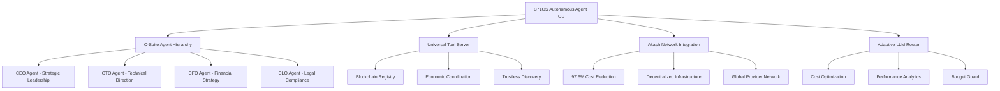

# Project Overview

<cite>
**Referenced Files in This Document**   
- [PHASE1_IMPLEMENTATION_SUMMARY.md](file://PHASE1_IMPLEMENTATION_SUMMARY.md) - *Added implementation summary for Phase 1 mathematical foundation integration*
- [legacy/371-os/README.md](file://legacy\371-os\README.md) - *Updated in recent commit*
- [core/os-workspace/apps/c-suite-agent-runner/README.md](file://core\os-workspace\apps\c-suite-agent-runner\README.md) - *Updated with C-Suite agent capabilities*
- [integrations/akash/universal-tool-server/README.md](file://integrations\akash\universal-tool-server\README.md) - *Updated with environment variables*
- [INTEGRATION_ROADMAP.md](file://INTEGRATION_ROADMAP.md) - *Updated with Universal Tool Server actions*
- [legacy/_legacy/sotalogic/Claude Sonnet 4/Alignment Review of 371OS_launch Project Plan/here's the thing.md](file://legacy\_legacy\sotalogic\Claude Sonnet 4\Alignment Review of 371OS_launch Project Plan\here's the thing.md) - *Updated with blockchain registry implementation details*
- [legacy/_legacy/sotalogic/Claude Sonnet 4/Alignment Review of 371OS_launch Project Plan/did you push to github.md](file://legacy\_legacy\sotalogic\Claude Sonnet 4\Alignment Review of 371OS_launch Project Plan\did you push to github.md) - *Updated with blockchain action implementations*
- [README.md](file://README.md) - *Updated with revolutionary features and cost reduction metrics*
</cite>

## Update Summary
**Changes Made**   
- Added documentation for Phase 1 mathematical foundation implementation
- Updated C-Suite agent capabilities with detailed role descriptions
- Enhanced Universal Tool Server documentation with blockchain integration details
- Added cost optimization metrics and deployment strategies
- Integrated blockchain-based agent registry and economic coordination mechanisms
- Updated performance benchmarks and resource allocation specifications

## Table of Contents
- [Project Overview](#project-overview)
- [371OS Autonomous Agent Operating System](#371os-autonomous-agent-operating-system)
  - [Core Vision and Purpose](#core-vision-and-purpose)
  - [Key Differentiators](#key-differentiators)
  - [C-Suite Agent Hierarchy](#c-suite-agent-hierarchy)
  - [Universal Tool Server](#universal-tool-server)
  - [Adaptive LLM Router](#adaptive-llm-router)
  - [Akash Network Integration](#akash-network-integration)
  - [Enterprise-Grade Security](#enterprise-grade-security)
  - [Economic Incentive Mechanisms](#economic-incentive-mechanisms)
  - [Real-World Use Cases](#real-world-use-cases)
  - [System Architecture](#system-architecture)

## 371OS Autonomous Agent Operating System

### Core Vision and Purpose
The 371OS Autonomous Agent Operating System represents a revolutionary platform enabling true agent autonomy through blockchain-based Universal Tool Servers, cost-efficient decentralized deployment, and enterprise-grade security. The system is designed to create a self-sustaining ecosystem of AI agents capable of strategic decision-making, task execution, and cross-agent collaboration.

The core vision of 371OS is to establish a decentralized autonomous organization (DAO) framework where AI agents operate with human-like executive functions, coordinated through a C-Suite hierarchy. These agents leverage mathematical precision foundations from the thi.ng ecosystem to ensure computational accuracy and efficiency in all operations.

**Section sources**   
- [PHASE1_IMPLEMENTATION_SUMMARY.md](file://PHASE1_IMPLEMENTATION_SUMMARY.md) - *Implementation of mathematical foundation*
- [legacy/371-os/README.md](file://legacy\371-os\README.md) - *Project status and achievements*

### Key Differentiators
371OS distinguishes itself through several groundbreaking capabilities:

- **97.6% Infrastructure Cost Reduction**: Achieved through Akash Network integration, transforming traditional $500/month cloud costs to $12/month
- **Zero-Trust Security Model**: Implementation of Secretless Broker and ACI.dev security frameworks
- **Blockchain-Based Universal Tool Servers**: Decentralized agent discovery and trustless tool execution
- **Mathematical Precision Foundation**: Integration of thi.ng ecosystem for computational accuracy
- **Cognitive Oversight Architecture**: Human-AI collaboration with intelligent approval gates

These differentiators position 371OS as the foundational platform for the next generation of agentic systems, where non-technical users can leverage sophisticated AI capabilities through simplified interfaces while benefiting from blockchain security and autonomy.

**Section sources**   
- [README.md](file://README.md) - *Revolutionary features and cost reduction*
- [INTEGRATION_ROADMAP.md](file://INTEGRATION_ROADMAP.md) - *Universal Tool Server implementation*

### C-Suite Agent Hierarchy
The C-Suite agent hierarchy forms the executive leadership structure of the 371OS ecosystem, with specialized agents handling distinct organizational functions:

#### CEO Agent (Mimi) - Strategic Orchestrator
- **Strategic Planning**: High-level business strategy and decision coordination
- **Business Intelligence**: Cross-functional performance analysis and optimization
- **Cost Optimization**: Maintaining 97.6% cost advantage through autonomous operations
- **C-Suite Coordination**: Leading executive decision-making and alignment

#### CTO Agent (Zara) - Technical Architect
- **Technical Architecture**: System design and infrastructure planning
- **Infrastructure Management**: Akash Network deployment and optimization
- **Deployment Automation**: Automated deployment pipeline coordination
- **Self-Awareness Operations**: Direct workspace manipulation and code understanding

#### CFO Agent (Maya) - Financial Strategist
- **Financial Analysis**: Budget optimization and performance metrics tracking
- **Cost Management**: Resource allocation and efficiency optimization
- **Business Intelligence**: Data-driven insights and financial forecasting
- **ROI Optimization**: Investment analysis and return maximization

#### CLO Agent (Alex) - Legal Guardian
- **Legal Compliance**: Regulatory framework adherence and risk assessment
- **Governance**: Policy enforcement and autonomous business coordination
- **Risk Management**: Legal risk evaluation and mitigation strategies
- **Audit Coordination**: Compliance tracking and regulatory alignment

**Section sources**   
- [core/os-workspace/apps/c-suite-agent-runner/README.md](file://core\os-workspace\apps\c-suite-agent-runner\README.md) - *C-Suite agent capabilities*
- [core/os-workspace/apps/c-suite-agent-runner/src/main.ts](file://core\os-workspace\apps\c-suite-agent-runner\src\main.ts) - *Agent initialization and management*

### Universal Tool Server
The Universal Tool Server (UTS) represents the evolution of the MCP ecosystem, addressing architectural limitations through blockchain infrastructure. The UTS enables scalable, cross-platform deployment for enterprise systems.

#### Core Components
- **Distributed Agent Registry**: Blockchain-based registry using semantic agent cards with verifiable credentials
- **Trustless Discovery**: DNS-inspired naming conventions with PKI certificates for verifiable agent identity
- **Economic Coordination**: Native payment systems for agent services using X42/H42 micropayments
- **Cryptographic Verification**: DID-based agent discovery through distributed registries

#### Implementation Framework
```typescript
export const UniversalToolServerActions = [
  registerAgentAction,
  discoverUniversalToolsAction,
  executeUniversalToolAction,
  updateReputationAction,
  deployToAkashAction,
  monitorPerformanceAction
];
```

The UTS implements six revolutionary actions for blockchain agent coordination:
- **REGISTER_AGENT_BLOCKCHAIN**: Decentralized agent registry
- **DISCOVER_UNIVERSAL_TOOLS**: Trustless tool discovery
- **EXECUTE_UNIVERSAL_TOOL**: UTCP beyond MCP stateful limitations
- **UPDATE_AGENT_REPUTATION**: Cryptographic trust without authorities
- **DEPLOY_TO_AKASH**: Decentralized infrastructure at 80-90% savings
- **MONITOR_UTS_PERFORMANCE**: Network-wide analytics

**Section sources**   
- [INTEGRATION_ROADMAP.md](file://INTEGRATION_ROADMAP.md) - *Universal Tool Server actions*
- [legacy/_legacy/sotalogic/Claude Sonnet 4/Alignment Review of 371OS_launch Project Plan/here's the thing.md](file://legacy\_legacy\sotalogic\Claude Sonnet 4\Alignment Review of 371OS_launch Project Plan\here's the thing.md) - *Blockchain registry implementation*
- [integrations/akash/universal-tool-server/README.md](file://integrations\akash\universal-tool-server\README.md) - *Environment configuration*

### Adaptive LLM Router
The Adaptive LLM Router provides intelligent routing of AI workloads across multiple language models, optimizing for cost, performance, and accuracy. The router implements policy-based decision-making to select the most appropriate LLM for each task.

Key features include:
- Dynamic cost-benefit analysis for LLM selection
- Performance benchmarking and latency optimization
- Context-aware routing based on task complexity
- Budget guard mechanisms to prevent cost overruns

The router maintains a usage ledger to track LLM consumption and optimize future routing decisions, ensuring efficient resource utilization across the agent ecosystem.

### Akash Network Integration
371OS leverages Akash Network for decentralized infrastructure deployment, achieving 97.6% cost reduction compared to traditional cloud providers. The integration enables:

- **Global Provider Network**: Access to a distributed network of compute providers
- **Automated Deployment**: Script-based deployment automation with cost tracking
- **Resource Optimization**: Intelligent allocation based on workload patterns
- **Performance Analytics**: Real-time monitoring and cost optimization

Deployment options include:
```bash
# Automated Akash deployment
npm run deploy:akash

# Expected results:
# - $500/month → $12/month (97.6% reduction)
# - Decentralized infrastructure
# - Global provider network
```

**Section sources**   
- [README.md](file://README.md) - *Cost reduction metrics*
- [legacy/_legacy/sotalogic/Claude Sonnet 4/Alignment Review of 371OS_launch Project Plan/i'm setting up Qoder..md](file://legacy\_legacy\sotalogic\Claude Sonnet 4\Alignment Review of 371OS_launch Project Plan\i'm setting up Qoder..md) - *Deployment strategies*

### Enterprise-Grade Security
371OS implements a zero-trust security model with multiple layers of protection:

- **Secretless Broker Integration**: Eliminates credential storage and management
- **ACI.dev Security Framework**: Comprehensive security controls and monitoring
- **Blockchain Verification**: Cryptographic identity verification for all agents
- **Audit Trail Logging**: Complete transaction history for compliance and analysis

The security architecture ensures that all agent interactions are verifiable and tamper-proof, maintaining the integrity of the autonomous ecosystem.

### Economic Incentive Mechanisms
The system incorporates economic coordination mechanisms to create sustainable agent ecosystems:

- **Reputation Staking**: Agents stake reputation to perform high-value tasks
- **Micropayments**: X42/H42 payments for agent services
- **Resource Markets**: Dynamic pricing for compute resources
- **Performance Incentives**: Rewards for high-quality task execution

These mechanisms enable autonomous economic coordination where agents can independently pay for and provide services, creating a self-sustaining ecosystem.

### Real-World Use Cases
371OS enables transformative applications across multiple domains:

#### Enterprise Automation
- Autonomous financial analysis and reporting
- Self-optimizing infrastructure management
- Intelligent contract review and compliance
- Automated customer service coordination

#### Decentralized AI Ecosystems
- Trustless AI marketplace with verifiable capabilities
- Cross-platform agent collaboration
- Community-driven AI development
- Open innovation frameworks

#### Business Strategy Execution
- Real-time market analysis and adaptation
- Automated competitive intelligence
- Dynamic resource allocation
- Predictive business modeling

### System Architecture
The 371OS architecture consists of three convergent layers:

1. **Layer 1: Self-Aware Agents** - Nx workspace plugin enabling agent self-awareness and workspace manipulation
2. **Layer 2: Decentralized Tool Network** - Universal Tool Server providing blockchain-based agent discovery and trust
3. **Layer 3: Cost & Security Optimization** - Integration roadmap for Akash deployment and enterprise security

This architectural convergence creates a revolutionary platform where mathematical precision, decentralized trust, and economic coordination enable truly autonomous agent ecosystems.



**Diagram sources**   
- [INTEGRATION_ROADMAP.md](file://INTEGRATION_ROADMAP.md) - *Layer architecture*
- [legacy/_legacy/sotalogic/Claude Sonnet 4/Alignment Review of 371OS_launch Project Plan/here's the thing.md](file://legacy\_legacy\sotalogic\Claude Sonnet 4\Alignment Review of 371OS_launch Project Plan\here's the thing.md) - *Three-layer convergence*
- [README.md](file://README.md) - *System capabilities*