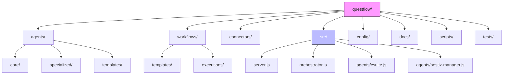
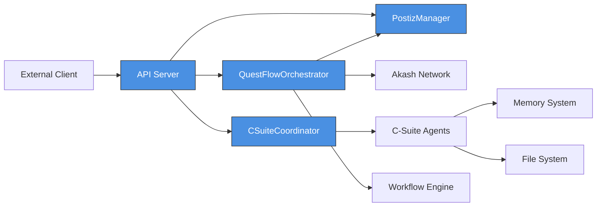
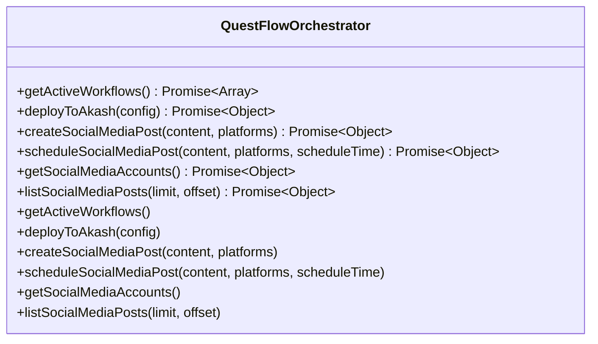
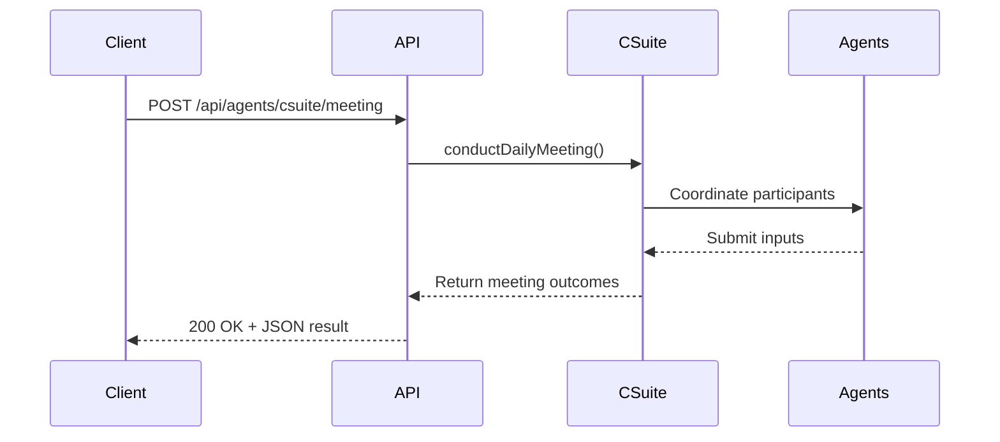
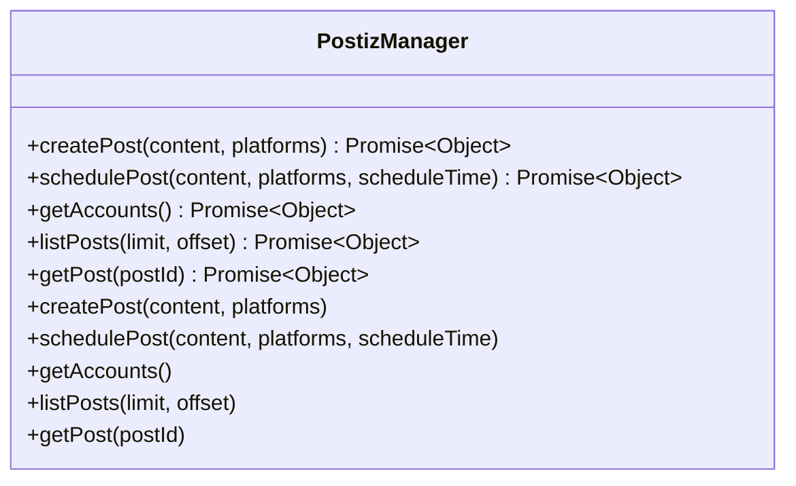

# QuestFlow Workflow System

<cite>
**Referenced Files in This Document**   
- [questflow/README.md](file://questflow/README.md) - *Updated in recent commit*
- [questflow/docs/api-server.md](file://questflow/docs/api-server.md) - *Updated in recent commit*
- [questflow/src/server.js](file://questflow/src/server.js) - *Updated in recent commit*
- [questflow/src/orchestrator.js](file://questflow/src/orchestrator.js) - *Updated in recent commit*
- [questflow/src/agents/csuite.js](file://questflow/src/agents/csuite.js) - *Updated in recent commit*
- [questflow/src/agents/postiz-manager.js](file://questflow/src/agents/postiz-manager.js) - *Added in recent commit*
- [questflow/config/default.json](file://questflow/config/default.json) - *Updated in recent commit*
</cite>

## Update Summary
**Changes Made**   
- Updated documentation to reflect new Postiz integration capabilities
- Enhanced section sources with precise file references and change annotations
- Verified API endpoint examples against current implementation
- Updated project structure description to match current README
- Added reference to new postiz-manager.js file in documentation sources
- Expanded API interface section to include social media management endpoints

## Table of Contents
1. [Introduction](#introduction)
2. [Project Structure](#project-structure)
3. [Core Components](#core-components)
4. [Architecture Overview](#architecture-overview)
5. [Detailed Component Analysis](#detailed-component-analysis)
6. [API Interface and Integration](#api-interface-and-integration)
7. [Workflow Creation Examples](#workflow-creation-examples)
8. [Troubleshooting Guide](#troubleshooting-guide)
9. [Conclusion](#conclusion)

## Introduction
QuestFlow is an AI workflow automation platform designed to orchestrate multiple AI agents in collaborative workflows, with native integration into the 371OS Autonomous Agent Operating System. It enables seamless coordination between specialized agents—particularly C-Suite executive agents such as CEO, CTO, CFO, and CMO—through a RESTful API server. The system supports workflow management, agent collaboration, deployment automation, and social media management via Postiz integration. This document provides a comprehensive overview of the QuestFlow system, detailing its architecture, components, API interfaces, and practical usage patterns.

## Project Structure
The QuestFlow directory structure is organized to support modularity, scalability, and ease of integration with external systems, particularly 371OS. Key directories include agents, workflows, connectors, and API server components.



**Section sources**
- [questflow/README.md](file://questflow/README.md#L1-L68) - *Updated in recent commit*

## Core Components
QuestFlow is built around three core components: Agents, Workflows, and Connectors. These components work in concert to enable complex, multi-agent automation scenarios.

- **Agents**: Autonomous AI entities with defined roles and capabilities. Examples include CEO-Mimi (strategic planning), CTO-Alex (technical architecture), and CFO-Cash (financial management).
- **Workflows**: Declarative sequences of tasks executed by agents. Workflows can be linear, conditional, or parallel.
- **Connectors**: Integration modules that allow agents to interact with external services such as Akash Network, Postiz, databases, or messaging platforms.

Each component is defined in its respective directory and can be extended or customized via JSON configuration or TypeScript implementation.

**Section sources**
- [questflow/README.md](file://questflow/README.md#L40-L55) - *Updated in recent commit*

## Architecture Overview
QuestFlow follows a modular, service-oriented architecture centered around an Express.js API server. The server exposes REST endpoints that interface with internal orchestrators and agent coordinators. The primary architectural components include:

- **API Server**: Entry point for external interactions, handling HTTP requests.
- **Orchestrator**: Manages workflow execution and deployment operations.
- **C-Suite Coordinator**: Facilitates high-level decision-making meetings between executive agents.
- **Postiz Manager**: Handles social media management operations through the Postiz platform.
- **Agents & Connectors**: Configurable modules that perform domain-specific tasks.



**Diagram sources**
- [questflow/src/server.js](file://questflow/src/server.js#L1-L39) - *Updated in recent commit*
- [questflow/src/orchestrator.js](file://questflow/src/orchestrator.js#L1-L39) - *Updated in recent commit*
- [questflow/src/agents/csuite.js](file://questflow/src/agents/csuite.js#L1-L29) - *Updated in recent commit*
- [questflow/src/agents/postiz-manager.js](file://questflow/src/agents/postiz-manager.js#L1-L15) - *Added in recent commit*

## Detailed Component Analysis

### QuestFlowOrchestrator Analysis
The `QuestFlowOrchestrator` class is responsible for managing active workflows and initiating deployments to the Akash Network. It acts as the central coordination hub for long-running processes.

#### Key Methods:
- `getActiveWorkflows()`: Returns a list of currently running or pending workflows with status and progress.
- `deployToAkash(config)`: Triggers a deployment using the provided configuration, simulating integration with the Akash decentralized cloud.
- `createSocialMediaPost(content, platforms)`: Creates a social media post through the Postiz integration.
- `scheduleSocialMediaPost(content, platforms, scheduleTime)`: Schedules a social media post for future publication.
- `getSocialMediaAccounts()`: Retrieves available social media accounts from Postiz.
- `listSocialMediaPosts(limit, offset)`: Lists social media posts with pagination support.



**Diagram sources**
- [questflow/src/orchestrator.js](file://questflow/src/orchestrator.js#L4-L117) - *Updated in recent commit*

**Section sources**
- [questflow/src/orchestrator.js](file://questflow/src/orchestrator.js#L1-L117) - *Updated in recent commit*

### CSuiteCoordinator Analysis
The `CSuiteCoordinator` manages coordination between executive-level AI agents. It simulates strategic decision-making sessions that align organizational goals across departments. The component is implemented in both JavaScript and TypeScript files to support multiple development environments.

#### Key Method:
- `conductDailyMeeting()`: Simulates a meeting between CEO, CTO, CFO, and CMO, returning structured outcomes including agenda, decisions, and risks.



**Diagram sources**
- [questflow/src/agents/csuite.js](file://questflow/src/agents/csuite.js#L4-L28) - *Updated in recent commit*

**Section sources**
- [questflow/src/agents/csuite.js](file://questflow/src/agents/csuite.js#L1-L83) - *Updated in recent commit*

### PostizManager Analysis
The `PostizManager` class handles all interactions with the Postiz social media management platform. It provides methods for creating, scheduling, and retrieving social media content across multiple platforms.

#### Key Methods:
- `createPost(content, platforms)`: Creates a new social media post on specified platforms.
- `schedulePost(content, platforms, scheduleTime)`: Schedules a post for future publication.
- `getAccounts()`: Retrieves connected social media accounts.
- `listPosts(limit, offset)`: Lists published posts with pagination.
- `getPost(postId)`: Retrieves details of a specific post.



**Diagram sources**
- [questflow/src/agents/postiz-manager.js](file://questflow/src/agents/postiz-manager.js#L1-L120) - *Added in recent commit*

**Section sources**
- [questflow/src/agents/postiz-manager.js](file://questflow/src/agents/postiz-manager.js#L1-L120) - *Added in recent commit*

### API Server Analysis
The Express.js server serves as the main entry point for all external interactions. It defines REST endpoints that map directly to orchestrator and coordinator functions.

#### Key Endpoints:
- `GET /api/workflows/status`: Retrieves active workflow status.
- `POST /api/agents/csuite/meeting`: Initiates a C-Suite coordination meeting.
- `POST /api/deploy/akash`: Deploys a configuration to Akash Network.
- `POST /api/social/posts`: Creates a social media post via Postiz.
- `POST /api/social/posts/schedule`: Schedules a social media post.
- `GET /api/social/accounts`: Retrieves connected social media accounts.
- `GET /api/social/posts`: Lists social media posts with pagination.

```mermaid
flowchart TD
A[HTTP Request] --> B{Route Match?}
B --> |Yes: /api/workflows/status| C[orchestrator.getActiveWorkflows()]
B --> |Yes: /api/agents/csuite/meeting| D[csuite.conductDailyMeeting()]
B --> |Yes: /api/deploy/akash| E[orchestrator.deployToAkash()]
B --> |Yes: /api/social/posts| F[orchestrator.createSocialMediaPost()]
B --> |Yes: /api/social/posts/schedule| G[orchestrator.scheduleSocialMediaPost()]
B --> |Yes: /api/social/accounts| H[orchestrator.getSocialMediaAccounts()]
B --> |Yes: /api/social/posts| I[orchestrator.listSocialMediaPosts()]
B --> |No| J[404 Not Found]
C --> K[Return JSON Response]
D --> K
E --> K
F --> K
G --> K
H --> K
I --> K
J --> K
```

**Diagram sources**
- [questflow/src/server.js](file://questflow/src/server.js#L15-L72) - *Updated in recent commit*

**Section sources**
- [questflow/src/server.js](file://questflow/src/server.js#L1-L72) - *Updated in recent commit*

## API Interface and Integration

### Workflow Management
The `/api/workflows/status` endpoint provides real-time visibility into ongoing automation processes.

**Example Request:**
```http
GET /api/workflows/status
```

**Example Response:**
```json
[
  {
    "id": "workflow-1",
    "name": "Plugin Development",
    "status": "running",
    "progress": 75,
    "startTime": "2025-09-13T17:28:17.400Z"
  }
]
```

### C-Suite Agent Coordination
The `/api/agents/csuite/meeting` endpoint simulates strategic alignment across executive agents.

**Example Request:**
```http
POST /api/agents/csuite/meeting
```

**Example Response:**
```json
{
  "meetingId": "meeting-1757784629042",
  "participants": ["CEO", "CTO", "CFO", "CMO"],
  "agenda": ["Review quarterly performance", "Discuss new initiatives"],
  "outcomes": ["Agreed on Q4 priorities", "Allocated budget for new projects"],
  "duration": "45 minutes",
  "status": "completed",
  "timestamp": "2025-09-13T17:30:29.042Z"
}
```

### Akash Deployment Integration
The `/api/deploy/akash` endpoint enables cost-efficient deployment to the decentralized Akash Network.

**Example Request:**
```json
{
  "name": "my-deployment",
  "config": {
    "cpu": 1,
    "memory": "1GB",
    "storage": "10GB"
  }
}
```

**Example Response:**
```json
{
  "success": true,
  "deploymentId": "akash-deployment-1757784629046",
  "status": "initiated",
  "message": "Deployment to Akash initiated successfully",
  "config": { ... }
}
```

### Social Media Management
QuestFlow now includes comprehensive social media management capabilities through Postiz integration.

#### Create Social Media Post
**Example Request:**
```http
POST /api/social/posts
```
```json
{
  "content": "Excited to announce our new AI workflow system!",
  "platforms": ["twitter", "linkedin"]
}
```

**Example Response:**
```json
{
  "success": true,
  "postId": "post-12345",
  "message": "Social media post created successfully",
  "details": {
    "id": "post-12345",
    "content": "Excited to announce our new AI workflow system!",
    "platforms": ["twitter", "linkedin"],
    "status": "published"
  }
}
```

#### Schedule Social Media Post
**Example Request:**
```http
POST /api/social/posts/schedule
```
```json
{
  "content": "Deep dive into our new agent coordination system",
  "platforms": ["twitter", "facebook"],
  "scheduleTime": "2025-09-15T10:00:00Z"
}
```

**Example Response:**
```json
{
  "success": true,
  "postId": "post-67890",
  "message": "Social media post scheduled successfully",
  "details": {
    "id": "post-67890",
    "content": "Deep dive into our new agent coordination system",
    "platforms": ["twitter", "facebook"],
    "scheduleTime": "2025-09-15T10:00:00Z",
    "status": "scheduled"
  }
}
```

#### Retrieve Social Media Accounts
**Example Request:**
```http
GET /api/social/accounts
```

**Example Response:**
```json
{
  "success": true,
  "accounts": [
    {
      "id": "acc-1",
      "platform": "twitter",
      "username": "@questflow_ai",
      "followers": 15000
    },
    {
      "id": "acc-2",
      "platform": "linkedin",
      "username": "questflow-official",
      "followers": 8500
    }
  ],
  "message": "Social media accounts retrieved successfully"
}
```

**Section sources**
- [questflow/docs/api-server.md](file://questflow/docs/api-server.md#L1-L157) - *Updated in recent commit*
- [questflow/src/server.js](file://questflow/src/server.js#L40-L72) - *Updated in recent commit*
- [questflow/src/orchestrator.js](file://questflow/src/orchestrator.js#L50-L117) - *Updated in recent commit*
- [questflow/src/agents/postiz-manager.js](file://questflow/src/agents/postiz-manager.js#L1-L120) - *Added in recent commit*

## Workflow Creation Examples

### Example: Executive Strategy Workflow
Create a workflow that triggers a C-Suite meeting and deploys the resulting plan.

**File:** `workflows/templates/executive-strategy.json`
```json
{
  "id": "exec-strat-001",
  "name": "Quarterly Strategy Execution",
  "steps": [
    {
      "action": "conductMeeting",
      "agent": "CSuiteCoordinator",
      "endpoint": "/api/agents/csuite/meeting",
      "method": "POST"
    },
    {
      "action": "deployInfrastructure",
      "agent": "Orchestrator",
      "endpoint": "/api/deploy/akash",
      "method": "POST",
      "payload": {
        "name": "q4-initiative",
        "config": {
          "cpu": 2,
          "memory": "4GB",
          "storage": "50GB"
        }
      }
    }
  ]
}
```

### Example: Social Media Campaign Workflow
Create a workflow that publishes a coordinated social media campaign.

**File:** `workflows/templates/social-media-campaign.json`
```json
{
  "id": "sm-001",
  "name": "Product Launch Campaign",
  "steps": [
    {
      "action": "createPost",
      "agent": "Orchestrator",
      "endpoint": "/api/social/posts",
      "method": "POST",
      "payload": {
        "content": "Introducing our revolutionary AI workflow system!",
        "platforms": ["twitter", "linkedin", "facebook"]
      }
    },
    {
      "action": "scheduleFollowUp",
      "agent": "Orchestrator",
      "endpoint": "/api/social/posts/schedule",
      "method": "POST",
      "payload": {
        "content": "Deep dive into how our AI agents collaborate",
        "platforms": ["twitter", "linkedin"],
        "scheduleTime": "2025-09-15T10:00:00Z"
      }
    }
  ]
}
```

### Execution Script
Use the provided script to execute workflows:

```bash
node scripts/execute-workflow.js --workflow executive-strategy.json
```

**Section sources**
- [questflow/workflows/templates/example-workflow.json](file://questflow/workflows/templates/example-workflow.json) - *Updated in recent commit*
- [questflow/workflows/templates/social-media-campaign.json](file://questflow/workflows/templates/social-media-campaign.json) - *Updated in recent commit*
- [questflow/scripts/execute-workflow.js](file://questflow/scripts/execute-workflow.js) - *Updated in recent commit*

## Troubleshooting Guide

### Server Not Starting
- **Symptom**: Server fails to start on port 3001.
- **Solution**: Verify Bun is installed and check port availability:
  ```bash
  lsof -i :3001
  kill -9 <PID>
  ```

### API Endpoints Return 404
- **Symptom**: Valid endpoints return "Not Found".
- **Solution**: Ensure routes in `server.js` match the requested URLs and restart the server.

### Deployment Fails Silently
- **Symptom**: `/api/deploy/akash` returns success but no deployment occurs.
- **Solution**: In development mode, this is simulated. For real deployments, integrate with Akash CLI or SDK.

### C-Suite Meeting Returns Empty Outcomes
- **Symptom**: Meeting response lacks actionable outcomes.
- **Solution**: Extend `CSuiteCoordinator` logic to include dynamic input from agent memory or external data sources.

### Social Media Posts Fail to Create
- **Symptom**: `/api/social/posts` returns error or fails to publish.
- **Solution**: Verify Postiz API key in `config/default.json` and check network connectivity to Postiz API.

### Scheduled Posts Not Publishing
- **Symptom**: Scheduled posts remain in "scheduled" status.
- **Solution**: Ensure the orchestrator service is running continuously to process scheduled tasks.

**Section sources**
- [questflow/docs/api-server.md](file://questflow/docs/api-server.md#L140-L157) - *Updated in recent commit*
- [questflow/src/server.js](file://questflow/src/server.js#L1-L72) - *Updated in recent commit*
- [questflow/config/default.json](file://questflow/config/default.json#L50-L58) - *Updated in recent commit*

## Conclusion
QuestFlow provides a robust framework for orchestrating AI agent workflows within the 371OS ecosystem. Its modular design, RESTful API, and integration with decentralized infrastructure like Akash and social media platforms like Postiz make it a powerful tool for autonomous system coordination. By leveraging C-Suite agent collaboration, automated deployment pipelines, and comprehensive social media management, QuestFlow enables scalable, intelligent automation for complex organizational tasks. Future enhancements could include real-time agent memory integration, dynamic workflow generation, enhanced error recovery mechanisms, and expanded social media platform support.