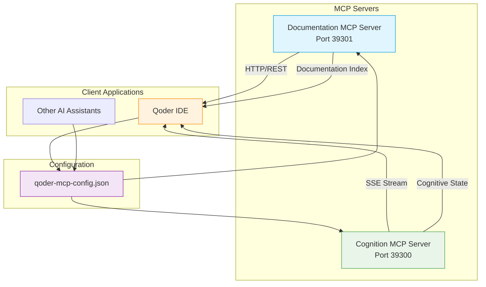

<docs>
# Resolution Summary Documentation

<cite>
**Referenced Files in This Document**   
- [RESOLUTION_SUMMARY.md](file://core/mcp/RESOLUTION_SUMMARY.md)
- [documentation-mcp-server.js](file://core/mcp/documentation-mcp-server.js)
- [mock-cognition-server.js](file://core/mcp/mock-cognition-server.js)
- [qoder-mcp-config.json](file://core/mcp/qoder-mcp-config.json)
- [start-mcp-servers.ps1](file://core/mcp/start-mcp-servers.ps1)
- [test-mcp-connection.js](file://core/mcp/test-mcp-connection.js)
- [EPICACHE_IMPLEMENTATION_PLAN.md](file://EPICACHE_IMPLEMENTATION_PLAN.md)
</cite>

## Table of Contents
1. [Introduction](#introduction)
2. [System Architecture](#system-architecture)
3. [Core Components](#core-components)
4. [Workflow Patterns](#workflow-patterns)
5. [Integration with Other Components](#integration-with-other-components)
6. [Practical Examples](#practical-examples)
7. [Troubleshooting Guide](#troubleshooting-guide)
8. [Performance Considerations](#performance-considerations)
9. [Conclusion](#conclusion)

## Introduction

The Resolution Summary system is a critical component of the 371 OS Model Context Protocol (MCP) ecosystem, designed to resolve configuration issues and ensure seamless integration between AI assistants and project documentation. This system addresses common problems such as transport errors, invalid package references, and module system conflicts that prevent proper initialization of MCP clients.

The primary purpose of the Resolution Summary system is to provide a comprehensive solution for establishing reliable connections between development environments (like Qoder IDE) and the MCP servers that deliver contextual awareness and documentation access. By resolving the "context deadline exceeded" error and other initialization failures, this system enables AI assistants to access real-time cognitive state information and comprehensive project documentation.

The implementation leverages two main MCP servers: a Documentation MCP Server running on port 39301 and a Cognition MCP Server on port 39300. These servers work together to provide both static documentation access and dynamic cognitive state streaming through Server-Sent Events (SSE). The system also incorporates EPICACHE memory optimization technology, which enables 6x memory compression for efficient episodic clustering of documentation and conversation history.

This documentation provides detailed information about the system's architecture, workflow patterns, integration points, and practical usage examples to help developers successfully implement and troubleshoot the Resolution Summary system.

**Section sources**
- [RESOLUTION_SUMMARY.md](file://core/mcp/RESOLUTION_SUMMARY.md#L1-L136)
- [EPICACHE_IMPLEMENTATION_PLAN.md](file://EPICACHE_IMPLEMENTATION_PLAN.md#L1-L542)

## System Architecture

The Resolution Summary system follows a client-server architecture with two primary MCP servers that provide complementary services to AI assistants and development environments. The architecture is designed to deliver both static documentation access and dynamic cognitive state awareness through standardized endpoints.

**Diagram sources **
- [RESOLUTION_SUMMARY.md](file://core/mcp/RESOLUTION_SUMMARY.md#L1-L136)
- [documentation-mcp-server.js](file://core/mcp/documentation-mcp-server.js#L1-L675)
- [mock-cognition-server.js](file://core/mcp/mock-cognition-server.js#L1-L403)

The Documentation MCP Server provides RESTful endpoints for accessing project documentation, including a comprehensive index of all documentation files, search functionality, and document retrieval capabilities. It serves metadata-rich documentation organized by sections such as core, agents, development, architecture, deployment, and troubleshooting.

The Cognition MCP Server implements Server-Sent Events (SSE) to deliver real-time updates about the cognitive state of the system, including current mode (Executive, Technical, or Creative), focus level, cognitive load, and active agents. This server also provides memory optimization insights through EPICACHE technology, which enables efficient episodic clustering and compression of context