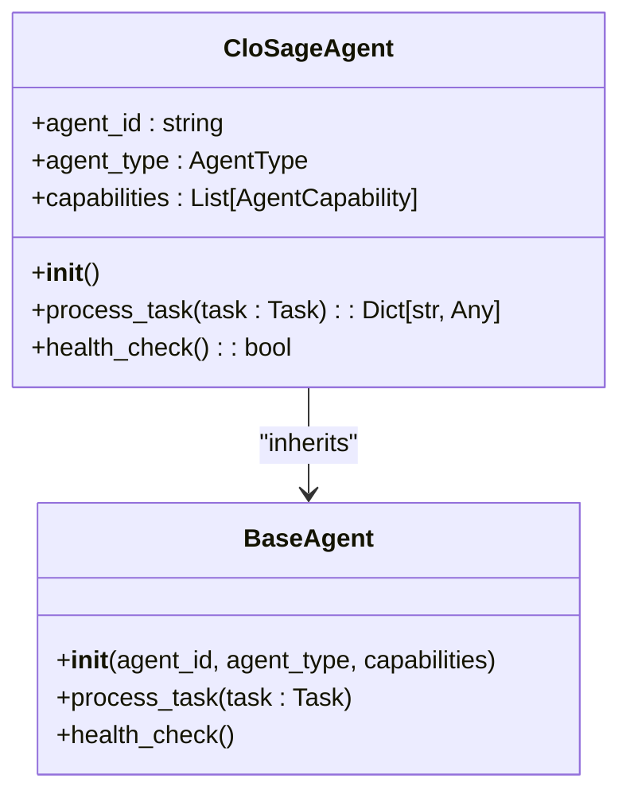
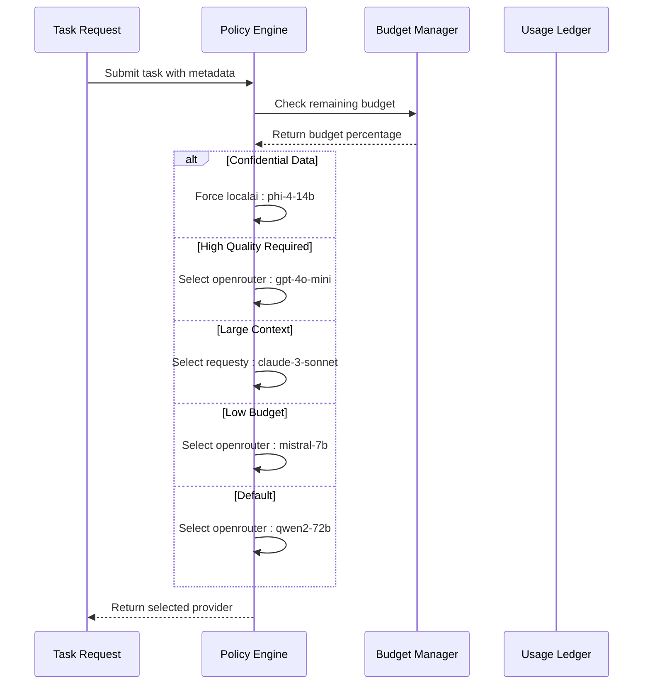
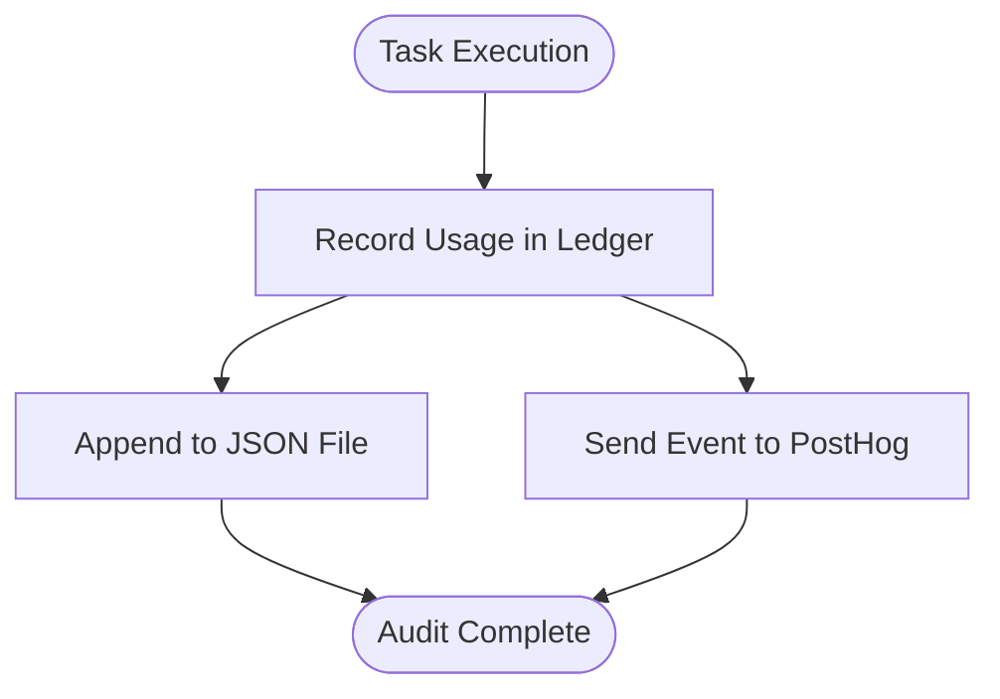
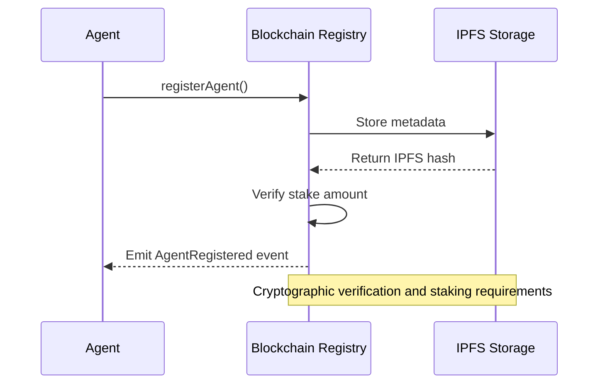

# Compliance and Governance

<cite>
**Referenced Files in This Document**   
- [clo_sage.py](file://371-os/src/minds371/agents/business/clo_sage.py)
- [CLO_Agent_Logic.md](file://371-os/CLO_Agent_Logic.md)
- [policy_engine.py](file://371-os/src/minds371/adaptive_llm_router/policy_engine.py)
- [budget_guard.py](file://371-os/src/minds371/adaptive_llm_router/budget_guard.py)
- [usage_ledger.py](file://371-os/src/minds371/adaptive_llm_router/usage_ledger.py)
- [data_models.py](file://371-os/src/minds371/adaptive_llm_router/data_models.py)
- [blockchain-registry.ts](file://packages/elizaos-plugins/universal-tool-server/src/blockchain-registry.ts)
- [types.ts](file://packages/elizaos-plugins/universal-tool-server/src/types.ts)
- [code_mern_agent.py](file://371-os/src/minds371/agents/technical/code_mern_agent.py)
- [code_t3_agent.py](file://371-os/src/minds371/agents/technical/code_t3_agent.py)
- [Legal and Compliance Guide.txt](file://Consulting/Legal and Compliance Guide.txt)
- [repository_intake_agent.py](file://371-os/src/minds371/agents/technical/repository_intake_agent.py)
- [ref-tools-mcp.md](file://371-os/src/minds371/mcp_servers/ref-tools-mcp.md)
</cite>

## Table of Contents
1. [Introduction](#introduction)
2. [CLO Agent Implementation](#clo-agent-implementation)
3. [Policy Engine and Budget Enforcement](#policy-engine-and-budget-enforcement)
4. [Audit Trail Generation](#audit-trail-generation)
5. [Blockchain-Based Governance](#blockchain-based-governance)
6. [Data Privacy and Consent Management](#data-privacy-and-consent-management)
7. [Custom Compliance Policy Configuration](#custom-compliance-policy-configuration)
8. [Challenges and Mitigation Strategies](#challenges-and-mitigation-strategies)
9. [Integration with External Legal Repositories](#integration-with-external-legal-repositories)
10. [Conclusion](#conclusion)

## Introduction
The Compliance and Governance sub-component of the Security Framework ensures that all agent operations adhere to legal, regulatory, and organizational requirements. This document details how the CLO Agent (Alex) enforces compliance across data privacy (GDPR, CCPA), intellectual property rights, and industry-specific regulations. It covers automated audit trails, policy evaluation engines, blockchain-based governance via the Universal Tool Server, and mechanisms for managing evolving regulatory landscapes. The system integrates technical enforcement with organizational processes to maintain accountability, transparency, and legal alignment across distributed agent operations.

## CLO Agent Implementation

The CLO Sage Agent (CloSageAgent) serves as the central compliance enforcement entity within the 371OS framework. It inherits from the BaseAgent class and implements specialized capabilities for assessing agent performance, identifying behavioral patterns, proposing optimizations, and designing knowledge transfer protocols.



**Diagram sources**
- [clo_sage.py](file://371-os/src/minds371/agents/business/clo_sage.py#L1-L77)

**Section sources**
- [clo_sage.py](file://371-os/src/minds371/agents/business/clo_sage.py#L1-L77)
- [CLO_Agent_Logic.md](file://371-os/CLO_Agent_Logic.md#L1-L21)

### Rule Evaluation Logic
The `process_task` method evaluates incoming tasks against predefined learning workflows. Based on task description keywords, it routes processing to specific compliance assessment paths:

```python
async def process_task(self, task: Task) -> Dict[str, Any]:
    description = task.description.lower()
    if "assess performance" in description:
        response_message = "Analyzing agent performance metrics..."
    elif "identify successful patterns" in description:
        response_message = "Identifying successful patterns in agent behavior..."
    elif "propose optimization" in description:
        response_message = "Proposing workflow optimizations..."
    elif "analyze collaboration protocols" in description:
        response_message = "Monitoring inter-agent communication protocols..."
    elif "design a new knowledge transfer loop" in description:
        response_message = "Designing a new knowledge transfer loop..."
    else:
        response_message = f"Learning task '{task.description}' is being processed..."
    return {"status": "success", "message": response_message}
```

This keyword-based routing enables declarative policy enforcement where task semantics directly determine compliance actions.

## Policy Engine and Budget Enforcement

The policy engine governs LLM provider selection based on compliance rules related to privacy, cost, and quality. It operates in conjunction with a budget guard that enforces financial constraints.



**Diagram sources**
- [policy_engine.py](file://371-os/src/minds371/adaptive_llm_router/policy_engine.py#L1-L33)
- [budget_guard.py](file://371-os/src/minds371/adaptive_llm_router/budget_guard.py#L1-L49)

**Section sources**
- [policy_engine.py](file://371-os/src/minds371/adaptive_llm_router/policy_engine.py#L1-L33)
- [budget_guard.py](file://371-os/src/minds371/adaptive_llm_router/budget_guard.py#L1-L49)

### Policy Evaluation Code
The `select_provider` function implements a decision graph based on task metadata:

```python
def select_provider(meta: Dict[str, Any], est_in: int, est_out: int) -> str:
    budget_percentage = budget_manager.get_remaining_budget_percentage()

    if meta.get("confidential"):
        return "localai:phi-4-14b"
    if meta.get("quality") == "high" and budget_percentage > 0.20:
        return "openrouter:gpt-4o-mini"
    if est_in > 8000:
        return "requesty:claude-3-sonnet"
    if budget_percentage < 0.05:
        return "openrouter:mistral-7b"
    return "openrouter:qwen2-72b"
```

This logic prioritizes data privacy (confidential flag), task quality, context length requirements, and budget availability in sequence.

### Budget Enforcement Mechanism
The BudgetManager class enforces monthly spending caps:

```python
class BudgetManager:
    def __init__(self, monthly_cap: float, ledger: UsageLedger):
        self.monthly_cap = monthly_cap
        self.ledger = ledger

    def get_remaining_budget_percentage(self) -> float:
        current_spend = self.ledger.get_total_cost_for_current_month()
        remaining = self.monthly_cap - current_spend
        return (remaining / self.monthly_cap) if self.monthly_cap > 0 and remaining > 0 else 0.0

    def is_budget_exceeded(self) -> bool:
        return self.get_remaining_budget_percentage() <= 0

    def check_budget(self):
        if self.is_budget_exceeded():
            raise BudgetExceededError(f"Monthly budget of ${self.monthly_cap} has been exceeded.")
```

When the budget is exceeded, the system can trigger alerts or downgrade to lower-cost models automatically.

## Audit Trail Generation

The system generates comprehensive audit trails by persisting every LLM request's cost, latency, success status, and response quality score. This enables forensic analysis of agent decisions, data accesses, and external communications.



**Diagram sources**
- [usage_ledger.py](file://371-os/src/minds371/adaptive_llm_router/usage_ledger.py#L1-L88)
- [data_models.py](file://371-os/src/minds371/adaptive_llm_router/data_models.py#L1-L39)

**Section sources**
- [usage_ledger.py](file://371-os/src/minds371/adaptive_llm_router/usage_ledger.py#L1-L88)
- [data_models.py](file://371-os/src/minds371/adaptive_llm_router/data_models.py#L1-L39)

### Usage Ledger Implementation
The UsageLedger class records detailed usage metrics:

```python
class UsageLedger:
    def record_usage(self, usage_data: LLMUsage):
        self._write_to_ledger(usage_data)
        self._capture_posthog_event(usage_data)

    def _write_to_ledger(self, usage_data: LLMUsage):
        records = []
        if self.usage_file.exists():
            with open(self.usage_file, 'r') as f:
                records = json.load(f)
        records.append(usage_data.model_dump(mode='json'))
        with open(self.usage_file, 'w') as f:
            json.dump(records, f, indent=2)

    def _capture_posthog_event(self, usage_data: LLMUsage):
        if self.posthog_client:
            self.posthog_client.capture(
                "llm_usage",
                properties={
                    "provider": usage_data.provider,
                    "model": usage_data.model,
                    "cost": usage_data.cost,
                    "agent": usage_data.agent,
                    "tokens_in": usage_data.tokens_in,
                    "tokens_out": usage_data.tokens_out,
                    "status": usage_data.status,
                    "task_id": usage_data.task_id,
                }
            )
```

### Data Model Structure
The LLMUsage model defines the audit trail schema:

```python
class LLMUsage(BaseModel):
    ts: datetime = Field(default_factory=datetime.now)
    provider: str
    model: str
    tokens_in: int
    tokens_out: int
    cost: float
    task_id: Optional[str] = None
    agent: Optional[str] = None
    status: Union[str, None] = "ok"
```

This structure captures temporal, financial, operational, and attribution data for each interaction.

## Blockchain-Based Governance

Smart contracts on the Universal Tool Server blockchain registry enforce governance at the protocol level, ensuring trustless agent discovery, reputation management, and economic coordination.



**Diagram sources**
- [blockchain-registry.ts](file://packages/elizaos-plugins/universal-tool-server/src/blockchain-registry.ts#L1-L400)
- [types.ts](file://packages/elizaos-plugins/universal-tool-server/src/types.ts#L1-L271)

**Section sources**
- [blockchain-registry.ts](file://packages/elizaos-plugins/universal-tool-server/src/blockchain-registry.ts#L1-L400)
- [types.ts](file://packages/elizaos-plugins/universal-tool-server/src/types.ts#L1-L271)

### Agent Registration Process
The `registerAgent` method enforces governance through cryptographic verification:

```typescript
async registerAgent(entry: AgentRegistryEntry): Promise<string> {
    const metadataBuffer = Buffer.from(JSON.stringify(entry));
    const ipfsResult = await this.ipfs.add(metadataBuffer);
    const ipfsHash = ipfsResult.cid.toString();
    
    const agentIdBytes = ethers.id(entry.agentId);
    const stakeAmount = this.calculateStakeRequirement(entry.capabilities);
    
    const wallet = new ethers.Wallet(process.env.AGENT_PRIVATE_KEY, this.provider);
    const contractWithSigner = this.contract.connect(wallet);
    
    const tx = await contractWithSigner.registerAgent(
        agentIdBytes,
        ipfsHash,
        ethers.parseEther(stakeAmount.toString())
    );
    
    await tx.wait();
    return tx.hash;
}
```

Registration requires staking cryptocurrency proportional to capability complexity, creating economic disincentives for malicious behavior.

### Governance Data Structures
The AgentRegistryEntry type defines governance-critical metadata:

```typescript
interface AgentRegistryEntry {
  agentId: string;
  did: string;
  capabilities: AgentCapability[];
  verifiableCredentials: VerifiableCredential[];
  reputation: ReputationScore;
  economicTerms: EconomicTerms;
  deploymentInfo: DeploymentInfo;
}
```

These verifiable credentials and reputation scores enable trust-minimized interactions between agents.

## Data Privacy and Consent Management

The system implements data privacy compliance through technical controls and process documentation aligned with GDPR and CCPA requirements.

**Section sources**
- [Legal and Compliance Guide.txt](file://Consulting/Legal and Compliance Guide.txt#L1782-L1876)
- [code_t3_agent.py](file://371-os/src/minds371/agents/technical/code_t3_agent.py#L362-L398)

### GDPR Compliance Measures
Key implementation features include:
- **Explicit opt-in consent** before processing personal data
- **Detailed consent records** capturing time, method, and content
- **Easy unsubscribe mechanisms** in all communications
- **Data minimization** principles applied to data collection
- **Automated unsubscribe processing** with prompt execution
- **Consent expiration tracking** to ensure ongoing validity
- **Geographic segmentation** for jurisdiction-specific compliance

### Audit Logging for Privacy
Comprehensive audit logging supports privacy compliance:

```typescript
export async function logUserAction(
  userId: string,
  action: string,
  metadata: Record<string, any> = {}
) {
  try {
    await prisma.auditLog.create({
      data: {
        userId,
        action,
        timestamp: new Date(),
        metadata,
      },
    });
  } catch (error) {
    console.error("Failed to log audit event:", error);
  }
}
```

This ensures accountability for all data access and processing activities.

## Custom Compliance Policy Configuration

The framework supports configuration of custom compliance policies, jurisdiction mappings, and retention schedules through both code and process documentation.

**Section sources**
- [Legal and Compliance Guide.txt](file://Consulting/Legal and Compliance Guide.txt#L2188-L2276)
- [repository_intake_agent.py](file://371-os/src/minds371/agents/technical/repository_intake_agent.py#L1-L45)

### Configuration Framework
Organizations can define:
- **Jurisdiction-specific policies** for different regulatory environments
- **Data retention schedules** based on legal requirements
- **Industry-specific compliance rules** for regulated sectors
- **Custom audit requirements** for internal governance

### Organizational Structure
Effective compliance requires cross-functional coordination:
- **Legal and Compliance Team**: Policy definition and regulatory interpretation
- **Product and Engineering**: Technical implementation
- **Marketing and Sales**: Customer-facing compliance
- **Subsidiary Coordinators**: Local compliance leadership

## Challenges and Mitigation Strategies

The system addresses common compliance challenges through technical and organizational measures.

**Section sources**
- [Legal and Compliance Guide.txt](file://Consulting/Legal and Compliance Guide.txt#L2188-L2276)
- [ref-tools-mcp.md](file://371-os/src/minds371/mcp_servers/ref-tools-mcp.md#L1-L31)

### Conflicting International Regulations
**Challenge**: Differing requirements across jurisdictions (e.g., GDPR vs. CCPA vs. local laws)  
**Mitigation**: Geographic segmentation with jurisdiction-specific policy application and routing

### Real-Time Compliance Monitoring
**Challenge**: Ensuring continuous compliance as regulations evolve  
**Mitigation**: 
- **Regulatory monitoring**: Designated responsibility for tracking changes
- **Regular legal updates**: Impact assessments of new regulations
- **Subscription services**: Alerts for relevant regulatory changes
- **Reference tools**: Integration with up-to-date documentation sources

### Compliance Verification
**Challenge**: Demonstrating compliance to auditors and regulators  
**Mitigation**:
- **Quarterly internal reviews**: Regular compliance assessments
- **Annual comprehensive audits**: Formal evaluation of compliance posture
- **Third-party validation**: Independent verification for high-risk areas

## Integration with External Legal Repositories

The system integrates with external knowledge sources to maintain up-to-date compliance information.

**Section sources**
- [ref-tools-mcp.md](file://371-os/src/minds371/mcp_servers/ref-tools-mcp.md#L1-L31)
- [repository_intake_agent.py](file://371-os/src/minds371/agents/technical/repository_intake_agent.py#L156-L188)

### Reference Tools Integration
The ref-tools MCP provides access to thousands of documentation sites and public GitHub repositories with:
- **Smart documentation chunking**: Returns only relevant content
- **Code tab awareness**: Loads all code examples
- **Deep link generation**: Provides specific page locations
- **Fast performance**: P95 latency of 1.7 seconds
- **Comprehensive coverage**: Thousands of sites and repositories

This eliminates hallucinations by providing up-to-date, verifiable information.

### Automated Update Mechanisms
The Repository Intake Engine can fetch structured compliance data:
```python
def _fetch_structured_data(self, repo_url: str) -> Optional[Dict]:
    for branch in ["main", "master"]:
        yaml_url = f"{base_url}/{branch}/structured.yaml"
        response = requests.get(yaml_url)
        if response.status_code == 200:
            return yaml.safe_load(response.text)
    return None
```

This enables automated ingestion of compliance policies from external repositories.

## Conclusion
The Compliance and Governance framework provides a comprehensive approach to ensuring that AI agent operations remain legally and ethically sound. By combining automated policy enforcement through the CLO Agent and policy engine, comprehensive audit trail generation, blockchain-based governance, and integration with external legal repositories, the system creates a robust compliance infrastructure. The layered approach addresses technical, organizational, and regulatory dimensions of compliance, enabling organizations to deploy autonomous agents with confidence in their adherence to evolving legal requirements.