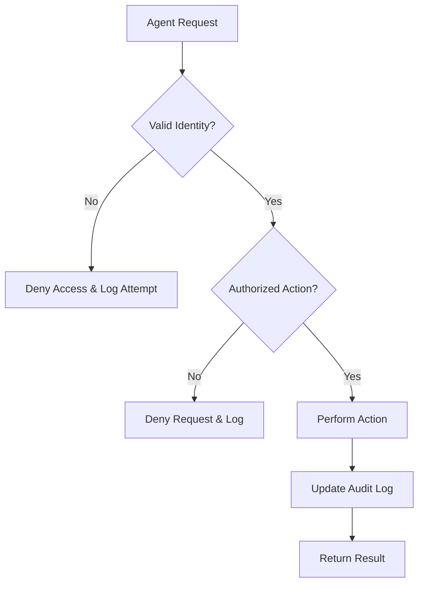
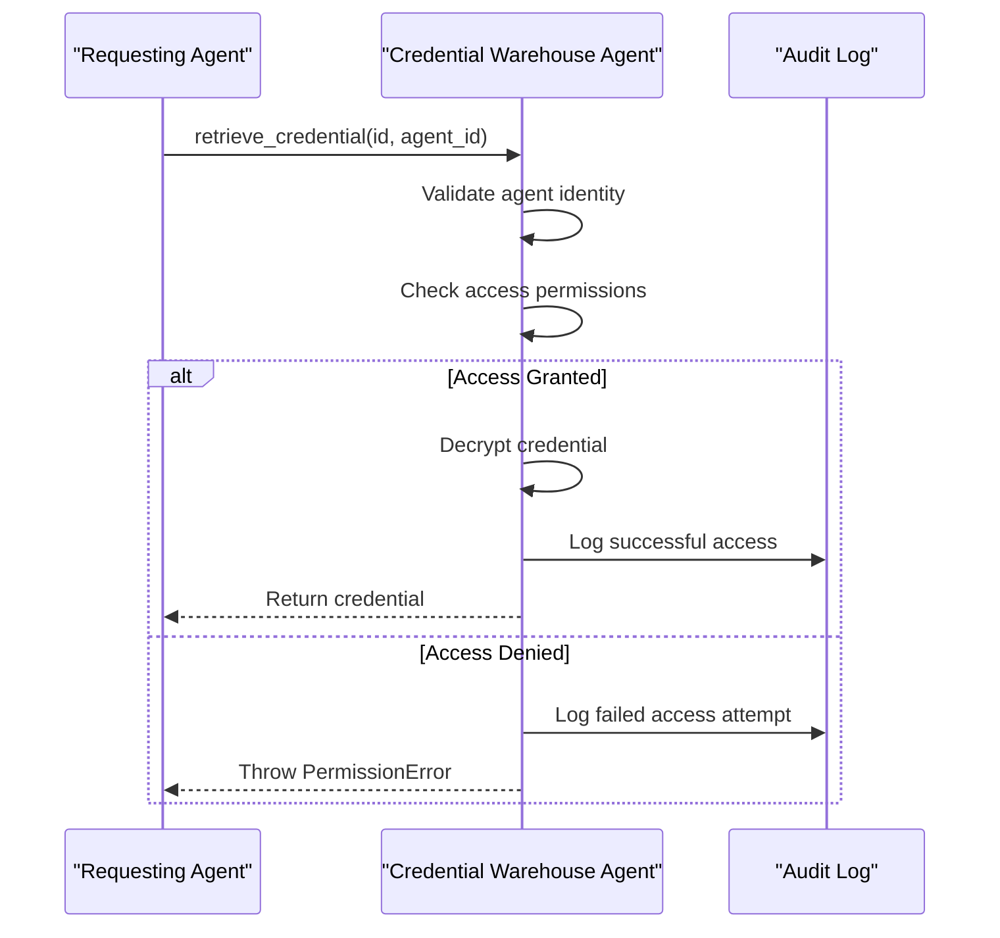
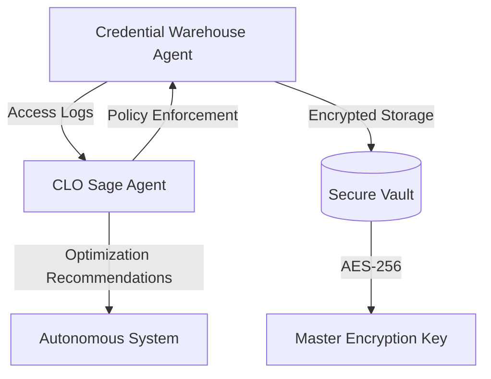

# Credential Warehouse Agent

<cite>
**Referenced Files in This Document**   
- [credential_warehouse_agent.py](file://371-os/src/minds371/agents/utility/credential_warehouse_agent.py)
- [credential_warehouse_agent.md](file://371-os/src/minds371/agents/utility/credential_warehouse_agent.md)
- [clo_sage.py](file://371-os/src/minds371/agents/business/clo_sage.py)
- [system_architecture.html](file://371-os/docs/architecture/system_architecture.html)
- [credential_warehouse_agent.yaml](file://prompts/utility_agents/credential_warehouse_agent.yaml)
</cite>

## Table of Contents
1. [Introduction](#introduction)
2. [Core Functionality and Architecture](#core-functionality-and-architecture)
3. [Request-Response Flow](#request-response-flow)
4. [Security and Compliance Integration](#security-and-compliance-integration)
5. [Configuration Options](#configuration-options)
6. [Common Issues and Remediation](#common-issues-and-remediation)
7. [Performance and Scalability](#performance-and-scalability)

## Introduction

The Credential Warehouse Agent is a critical component within the 371OS Security Framework, designed to serve as a centralized, encrypted vault for managing sensitive credentials used by autonomous agents across the system. It securely stores API keys, database passwords, service tokens, and other secrets, ensuring that access is strictly controlled and auditable. The agent operates on principles of zero-trust security, requiring verified identities and enforcing granular access policies before releasing any credential data.

This document provides a comprehensive overview of the agent’s implementation, including its secure storage mechanisms, access control model, integration with compliance systems, and operational best practices. The analysis is based on available code, configuration files, and system documentation, offering both technical depth and accessibility for non-specialist readers.

**Section sources**
- [credential_warehouse_agent.py](file://371-os/src/minds371/agents/utility/credential_warehouse_agent.py)
- [system_architecture.html](file://371-os/docs/architecture/system_architecture.html)

## Core Functionality and Architecture

The Credential Warehouse Agent functions as a secure intermediary between autonomous agents and their required credentials. Its architecture is built around a vault model where all sensitive data is encrypted at rest using strong cryptographic standards. The agent exposes a set of asynchronous methods for storing, retrieving, rotating, and auditing credentials, all of which are protected by a robust access control system.

The core implementation is encapsulated within the `SecureCredentialWarehouse` class, which manages credential lifecycle operations. Credentials are stored with metadata including name, type, tags, creation timestamp, and expiration date. Each credential is encrypted using a master key provided during initialization, ensuring that even if the underlying storage is compromised, the data remains inaccessible without the key.

Access to credentials is governed by a creator-grant model: only the agent that initially stores a credential can grant access to other agents. This prevents unauthorized delegation and ensures accountability. The system also supports time-limited access tokens, although this functionality is implied by the access control model rather than explicitly implemented in the available code.

**Diagram sources**
- [credential_warehouse_agent.py](file://371-os/src/minds371/agents/utility/credential_warehouse_agent.py)

**Section sources**
- [credential_warehouse_agent.py](file://371-os/src/minds371/agents/utility/credential_warehouse_agent.py)
- [credential_warehouse_agent.yaml](file://prompts/utility_agents/credential_warehouse_agent.yaml)

### Encryption and Storage

The agent uses AES-256 encryption for securing credential data at rest, as specified in its configuration. The master key is provided during initialization and is used to encrypt all stored credentials. While the exact encryption routines are not visible in the available code, the system architecture documentation confirms the use of AES encryption for credential storage.

The storage backend is abstracted through a configuration parameter (`storage_backend: secure_vault`), indicating that the implementation supports pluggable backends. Although IPFS with encryption is mentioned in the documentation objective, the current configuration points to a generic "secure_vault" backend, suggesting that the system is designed for flexibility in storage choice.

Credential identifiers are generated with a combination of type, timestamp, and a unique hash, ensuring global uniqueness and traceability. For example, a DigitalOcean API key is stored with an ID like `cred_digital_ocean_api_1754934691_4c48fafb8fde7723`.

**Section sources**
- [credential_warehouse_agent.py](file://371-os/src/minds371/agents/utility/credential_warehouse_agent.py)
- [system_architecture.html](file://371-os/docs/architecture/system_architecture.html)
- [credential_warehouse_agent.yaml](file://prompts/utility_agents/credential_warehouse_agent.yaml)

### Access Control and Audit Logging

Access control is enforced through agent identity verification and creator-based permission checks. When an agent requests a credential, the system verifies that the requesting agent has been granted access, either as the creator or through an explicit grant. The benchmark demonstrates that attempts by unauthorized agents to retrieve or delete credentials result in `PermissionError` exceptions.

Audit logging is a fundamental feature, with every access attempt—successful or failed—recorded in a log. The `get_audit_logs` method allows retrieval of logs for specific credentials, enabling forensic analysis and compliance reporting. Logs include the agent ID, action performed, timestamp, and success status.

**Diagram sources**
- [credential_warehouse_agent.py](file://371-os/src/minds371/agents/utility/credential_warehouse_agent.py)

**Section sources**
- [credential_warehouse_agent.py](file://371-os/src/minds371/agents/utility/credential_warehouse_agent.py)

## Request-Response Flow

The request-response flow for credential access follows a strict verification process to ensure security and integrity. When an agent queries for a credential, the following steps occur:

1. **Identity Verification**: The requesting agent's identity is validated.
2. **Permission Check**: The system checks if the agent is the creator or has been granted access.
3. **Credential Retrieval**: If authorized, the encrypted credential is retrieved.
4. **Decryption**: The credential is decrypted using the master key.
5. **Logging**: The access attempt is recorded in the audit log.
6. **Response**: The decrypted credential data is returned.

The `get_secret` convenience method allows retrieval of a specific secret value by credential name, reducing the need for agents to handle full credential objects. This method still enforces the same access controls as the base `retrieve_credential` method.

Revocation is handled through the `delete_credential` method, which permanently removes a credential from the vault. Only the creator of the credential can initiate deletion, preventing unauthorized revocation by other agents.

**Section sources**
- [credential_warehouse_agent.py](file://371-os/src/minds371/agents/utility/credential_warehouse_agent.py)

## Security and Compliance Integration

The Credential Warehouse Agent integrates with the CLO (Chief Learning Officer) Agent, represented by `clo_sage.py`, to enforce compliance policies such as GDPR and SOC2. While the direct integration points are not visible in the code, the CLO Agent's role in continuous learning and optimization suggests it monitors credential usage patterns and enforces policy adherence.

The agent supports compliance through several mechanisms:
- **Audit Logging**: Comprehensive logs support forensic analysis and regulatory reporting.
- **Credential Rotation**: The `rotate_credential` method allows for periodic updating of secrets, a key requirement for many compliance frameworks.
- **Expiration Management**: The `check_expiring_credentials` method identifies credentials nearing their rotation period, enabling proactive management.

The CLO Agent, as a `CLO` type agent with capabilities in performance assessment and pattern identification, likely analyzes access logs and usage patterns to detect anomalies or policy violations, triggering alerts or automated remediation.

**Diagram sources**
- [credential_warehouse_agent.py](file://371-os/src/minds371/agents/utility/credential_warehouse_agent.py)
- [clo_sage.py](file://371-os/src/minds371/agents/business/clo_sage.py)

**Section sources**
- [credential_warehouse_agent.py](file://371-os/src/minds371/agents/utility/credential_warehouse_agent.py)
- [clo_sage.py](file://371-os/src/minds371/agents/business/clo_sage.py)

## Configuration Options

The Credential Warehouse Agent supports several configuration options, primarily defined in its YAML configuration file. These options allow for customization of security and operational parameters:

- **Storage Backend**: Configurable via `storage_backend`, currently set to `secure_vault`.
- **Encryption Algorithm**: Set to `AES-256`, ensuring strong encryption for data at rest.
- **Rotation Policies**: Credentials can have custom rotation periods (e.g., 15 days for database passwords).
- **Audit Logging**: Enabled by default, with all access attempts logged.

The agent also supports tagging of credentials (e.g., "cloud", "production"), enabling filtered access and management. Tags can be used in listing operations to retrieve subsets of credentials based on metadata.

**Section sources**
- [credential_warehouse_agent.yaml](file://prompts/utility_agents/credential_warehouse_agent.yaml)
- [credential_warehouse_agent.py](file://371-os/src/minds371/agents/utility/credential_warehouse_agent.py)

## Common Issues and Remediation

### Credential Synchronization Across Clusters

In distributed environments, credential synchronization can become inconsistent if multiple instances of the Credential Warehouse Agent are running. The current design, which relies on a single master key and centralized vault, suggests a single-instance architecture. For clustered deployments, a shared storage backend with strong consistency guarantees (e.g., a distributed database with ACID properties) would be required.

**Remediation Workflow**:
1. Deploy the Credential Warehouse Agent as a singleton service.
2. Use a highly available, consistent storage backend.
3. Implement health checks and failover mechanisms.

### Recovery from Compromised Agents

If an agent is compromised, its access to credentials must be immediately revoked. Since only the creator can delete a credential, a compromised agent that created credentials would need to be isolated and its credentials manually rotated or deleted by a higher-privileged agent.

**Remediation Workflow**:
1. Isolate the compromised agent from the network.
2. Use a trusted administrative agent to revoke access or delete credentials.
3. Rotate all credentials that were accessible to the compromised agent.
4. Conduct a forensic audit using the access logs to determine the scope of the breach.

**Section sources**
- [credential_warehouse_agent.py](file://371-os/src/minds371/agents/utility/credential_warehouse_agent.py)
- [credential_warehouse_agent.md](file://371-os/src/minds371/agents/utility/credential_warehouse_agent.md)

## Performance and Scalability

The Credential Warehouse Agent is designed for asynchronous operation using Python's `asyncio` framework, allowing it to handle multiple concurrent requests efficiently. The benchmark demonstrates operations such as storing, retrieving, and rotating credentials, all executed asynchronously.

For high-concurrency environments, performance considerations include:
- **Encryption Overhead**: AES-256 encryption/decryption adds computational cost.
- **Storage Latency**: Backend storage performance directly impacts response times.
- **Access Control Checks**: Permission validation must be fast to avoid bottlenecks.

**Scaling Strategies**:
- **Caching**: Implement a secure in-memory cache for frequently accessed credentials (with strict TTL and access controls).
- **Load Balancing**: Deploy multiple read replicas of the credential store, with a single write master.
- **Connection Pooling**: Reuse database or storage connections to reduce overhead.

The agent’s current implementation appears optimized for correctness and security over raw performance, making it suitable for moderate workloads. For high-scale deployments, additional optimization and horizontal scaling would be necessary.

**Section sources**
- [credential_warehouse_agent.py](file://371-os/src/minds371/agents/utility/credential_warehouse_agent.py)