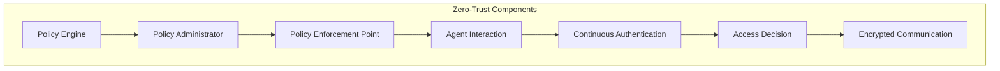
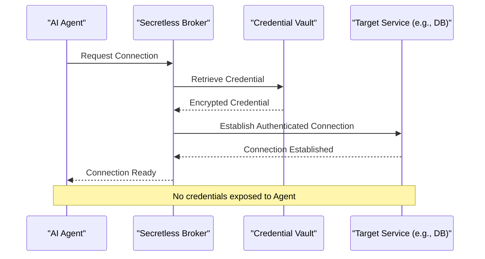
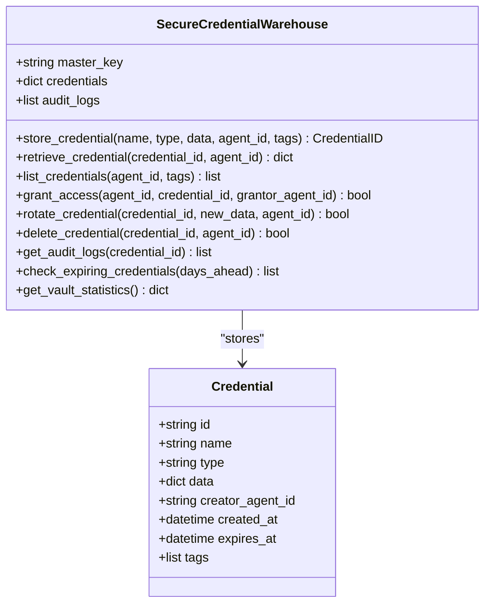
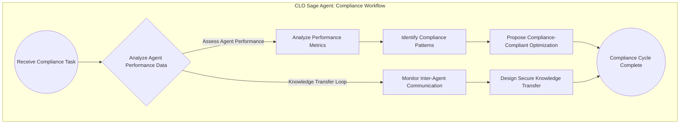
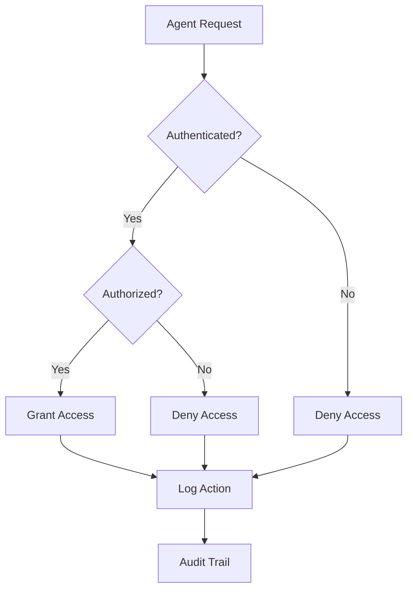

# Security Framework

<cite>
**Referenced Files in This Document**   
- [system_architecture.html](file://371-os/docs/architecture/system_architecture.html)
- [clo_sage.py](file://371-os/src/minds371/agents/business/clo_sage.py)
- [credential_warehouse_agent.py](file://371-os/src/minds371/agents/utility/credential_warehouse_agent.py)
- [report.md](file://thought_leadership/AASA/report.md)
- [researchprotocol.md](file://thought_leadership/AASA/researchprotocol.md)
- [CLO_Agent_Logic.md](file://371-os/CLO_Agent_Logic.md)
- [Legal and Compliance Guide.txt](file://Consulting/Legal and Compliance Guide.txt)
</cite>

## Table of Contents
1. [Introduction](#introduction)
2. [Zero-Trust Architecture Principles](#zero-trust-architecture-principles)
3. [Secretless Broker Integration](#secretless-broker-integration)
4. [Credential Warehouse Agent Implementation](#credential-warehouse-agent-implementation)
5. [Legal Compliance Framework (CLO Agent)](#legal-compliance-framework-clo-agent)
6. [Security Data Flows](#security-data-flows)
7. [Configuration Options for Security Policies](#configuration-options-for-security-policies)
8. [Secure Deployment Patterns and Threat Mitigation](#secure-deployment-patterns-and-threat-mitigation)
9. [Common Security Issues in AI Systems](#common-security-issues-in-ai-systems)
10. [Performance Considerations and Optimization](#performance-considerations-and-optimization)

## Introduction
The Security Framework for 371 Minds OS is designed to provide enterprise-grade protection for AI agent operations. It integrates zero-trust architecture, secretless credential handling, secure credential management, and comprehensive legal compliance mechanisms. This document details the implementation of these components, their interactions, and best practices for deployment and optimization.

**Section sources**
- [system_architecture.html](file://371-os/docs/architecture/system_architecture.html#L500-L699)

## Zero-Trust Architecture Principles
The system implements a Zero-Trust Architecture (ZTA) based on NIST SP 800-207 guidelines, ensuring that no component is trusted by default. All communications are encrypted with TLS 1.3, and continuous authentication and authorization are enforced for all agent interactions.

Key tenets include:
- **Network Security**: No implicit trust between components; all communications are encrypted.
- **Identity Verification**: Continuous authentication and authorization for all agent interactions.
- **Least Privilege Access**: Agents are granted only the minimum permissions required for their tasks.
- **Audit & Compliance**: Complete audit trail for all security-related operations.

This architecture ensures that even if an agent is compromised, lateral movement is prevented through strict access controls and microsegmentation.



**Diagram sources**
- [system_architecture.html](file://371-os/docs/architecture/system_architecture.html#L550-L586)
- [report.md](file://thought_leadership/AASA/report.md#L1-L140)

## Secretless Broker Integration
The Secretless Broker eliminates the need for agents to handle credentials directly, reducing the attack surface. It acts as a proxy that retrieves credentials from secure vaults and injects them into connections without exposing them to the application.

### Key Features:
- **Credential Isolation**: Applications never touch secrets; the broker handles authentication.
- **Dynamic Rotation**: Credentials are rotated seamlessly without requiring application restarts.
- **Support for Multiple Protocols**: Works with DB, HTTP, SSH, and other connectors.
- **Sidecar Deployment**: Can be deployed as a sidecar in Kubernetes environments for secure, isolated access.

By implementing the Secretless pattern, the system ensures that credentials are never stored in application code or configuration files, significantly reducing the risk of credential leakage.



**Diagram sources**
- [report.md](file://thought_leadership/AASA/report.md#L1-L140)
- [researchprotocol.md](file://thought_leadership/AASA/researchprotocol.md#L1-L500)

## Credential Warehouse Agent Implementation
The Credential Warehouse Agent provides secure credential management with role-based access control, encryption, and audit logging. It stores credentials using AES encryption and enforces strict access policies.

### Core Capabilities:
- **AES Encryption**: All credentials are encrypted at rest.
- **Role-Based Access Control (RBAC)**: Agents can only access credentials they are authorized for.
- **Audit Logging**: Comprehensive logs track all credential access and modifications.
- **Automatic Rotation**: Supports time-based and event-driven credential rotation.
- **Multi-Agent Permission Validation**: Ensures only authorized agents can grant or revoke access.

The agent supports storing various credential types (API keys, database passwords, etc.) and allows fine-grained tagging and access control.



**Diagram sources**
- [credential_warehouse_agent.py](file://371-os/src/minds371/agents/utility/credential_warehouse_agent.py#L1-L203)

**Section sources**
- [credential_warehouse_agent.py](file://371-os/src/minds371/agents/utility/credential_warehouse_agent.py#L1-L203)

## Legal Compliance Framework (CLO Agent)
The CLO Agent (Sage) manages legal compliance, data privacy, regulatory requirements, and audit trails. It ensures that all agent operations adhere to enterprise governance standards.

### Responsibilities:
- **Assess Agent Performance**: Analyzes performance metrics to ensure compliance with operational standards.
- **Identify Patterns**: Detects successful and failed patterns in agent behavior for regulatory reporting.
- **Propose Optimizations**: Recommends workflow improvements that align with compliance requirements.
- **Design Knowledge Transfer**: Creates secure knowledge transfer protocols that maintain data integrity.

The agent processes tasks related to compliance monitoring and generates audit-ready reports. It also supports human oversight layers where compliance officers have final authority over automated assessments.



**Diagram sources**
- [CLO_Agent_Logic.md](file://371-os/CLO_Agent_Logic.md#L1-L21)
- [clo_sage.py](file://371-os/src/minds371/agents/business/clo_sage.py#L1-L77)

**Section sources**
- [clo_sage.py](file://371-os/src/minds371/agents/business/clo_sage.py#L1-L77)
- [Legal and Compliance Guide.txt](file://Consulting/Legal and Compliance Guide.txt#L1235-L1476)

## Security Data Flows
Security data flows cover authentication, authorization, and auditing across the system.

### Authentication Flow:
1. Agent requests access to a resource.
2. Identity is verified via continuous authentication.
3. Policy Engine evaluates access request.
4. Access granted or denied based on least privilege principles.

### Authorization Flow:
- Role-based access control checks agent permissions.
- Just-in-time credential provisioning for temporary access.
- Time-limited tokens with automatic expiration.

### Auditing Flow:
- All security-related operations are logged.
- Logs include agent ID, action, timestamp, and success/failure status.
- Audit trails are immutable and tamper-evident.

These flows ensure that every interaction is authenticated, authorized, and recorded for compliance.



**Diagram sources**
- [system_architecture.html](file://371-os/docs/architecture/system_architecture.html#L528-L586)

## Configuration Options for Security Policies
The system supports configurable security policies and compliance rules:

### Policy Configuration:
- **Access Control Policies**: Define RBAC roles and permissions.
- **Credential Rotation Policies**: Set rotation intervals (e.g., every 15 days).
- **Audit Logging Levels**: Configure verbosity and retention periods.
- **Compliance Rule Sets**: Map to regulatory frameworks (e.g., GDPR, HIPAA).

### Example Configuration:
```yaml
security:
  access_control:
    roles:
      - name: admin
        permissions: ["read", "write", "delete"]
      - name: finance
        permissions: ["read", "write"]
  credential_rotation:
    default_days: 30
    exceptions:
      - type: database_password
        days: 15
  audit:
    retention_days: 365
    include_payloads: false
```

These configurations allow organizations to tailor security settings to their specific compliance needs.

**Section sources**
- [system_architecture.html](file://371-os/docs/architecture/system_architecture.html#L571-L586)
- [Legal and Compliance Guide.txt](file://Consulting/Legal and Compliance Guide.txt#L742-L852)

## Secure Deployment Patterns and Threat Mitigation
### Deployment Patterns:
- **Sidecar Pattern**: Deploy Secretless Broker as a sidecar for secure credential injection.
- **Microsegmentation**: Isolate agent environments to prevent lateral movement.
- **Immutable Infrastructure**: Use containerized agents with read-only filesystems.

### Threat Mitigation Strategies:
- **Credential Leakage Prevention**: Secretless Broker ensures no credentials in code.
- **Anomaly Detection**: Monitor for unexpected behavior patterns.
- **Automated Intervention**: Automatically quarantine suspicious agents.
- **Regular Vulnerability Assessments**: Scan execution environments for weaknesses.

These patterns and strategies ensure that the system remains resilient against common attack vectors.

**Section sources**
- [report.md](file://thought_leadership/AASA/report.md#L1-L140)
- [Legal and Compliance Guide.txt](file://Consulting/Legal and Compliance Guide.txt#L1384-L1476)

## Common Security Issues in AI Systems
### Identified Issues:
- **Credential Exposure**: Solved by Secretless Broker.
- **Overprivileged Agents**: Mitigated by least privilege access.
- **Insufficient Audit Trails**: Addressed by comprehensive logging.
- **Model Prompt Injection**: Prevented by input validation and guardrails.
- **Data Privacy Violations**: Handled through encryption and access controls.

The framework provides specific solutions for each issue, ensuring robust protection across all layers of the AI system.

**Section sources**
- [report.md](file://thought_leadership/AASA/report.md#L1-L140)
- [researchprotocol.md](file://thought_leadership/AASA/researchprotocol.md#L1-L500)

## Performance Considerations and Optimization
### Performance Impacts:
- **Encryption Overhead**: AES encryption adds minimal latency.
- **Authentication Latency**: Continuous authentication is optimized with caching.
- **Audit Logging**: Asynchronous logging prevents blocking operations.

### Optimization Techniques:
- **Caching**: Frequently accessed credentials are cached securely.
- **Connection Pooling**: Reuse database connections to reduce overhead.
- **Asynchronous Processing**: Non-critical operations (e.g., logging) run in background.

These optimizations ensure that security measures do not significantly impact system performance.

**Section sources**
- [system_architecture.html](file://371-os/docs/architecture/system_architecture.html#L500-L699)
- [clo_sage.py](file://371-os/src/minds371/agents/business/clo_sage.py#L1-L77)