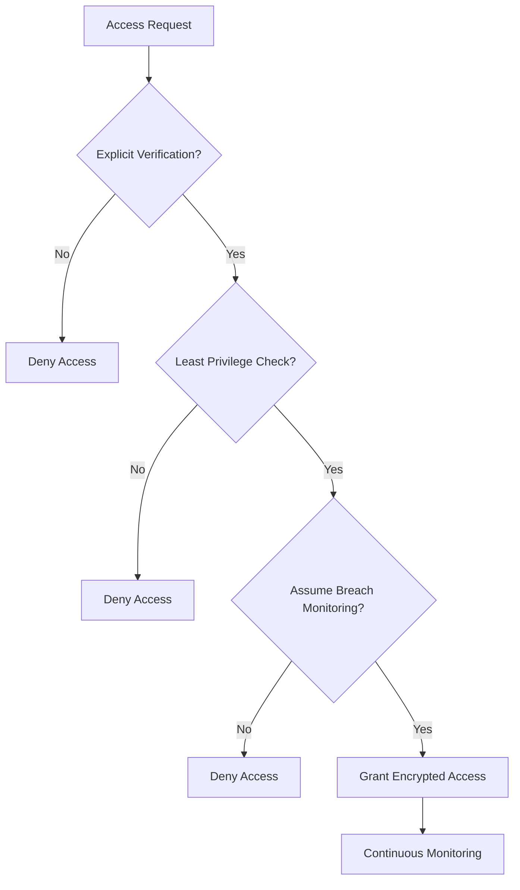
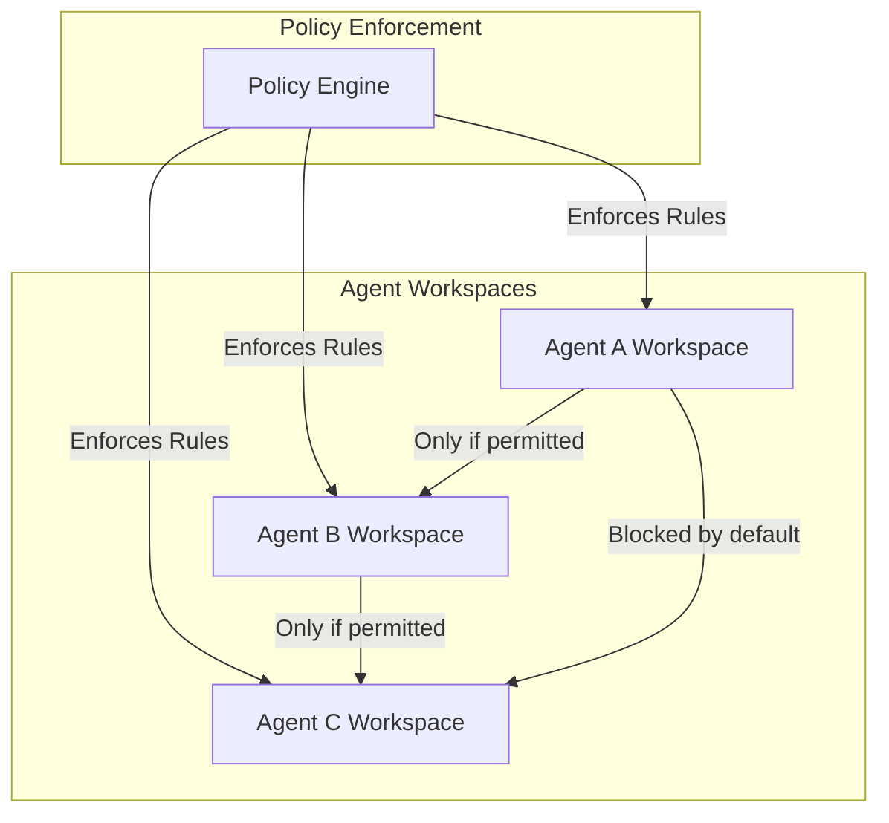
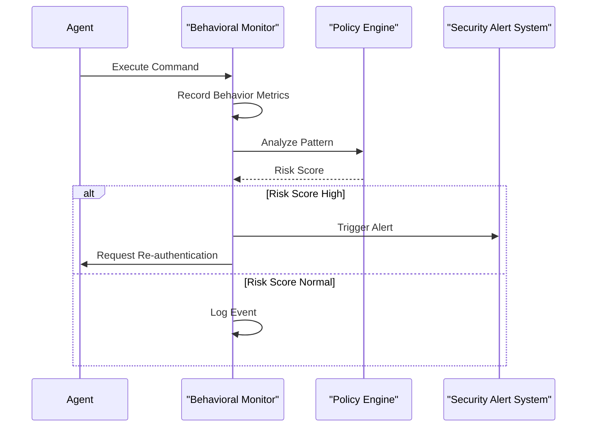
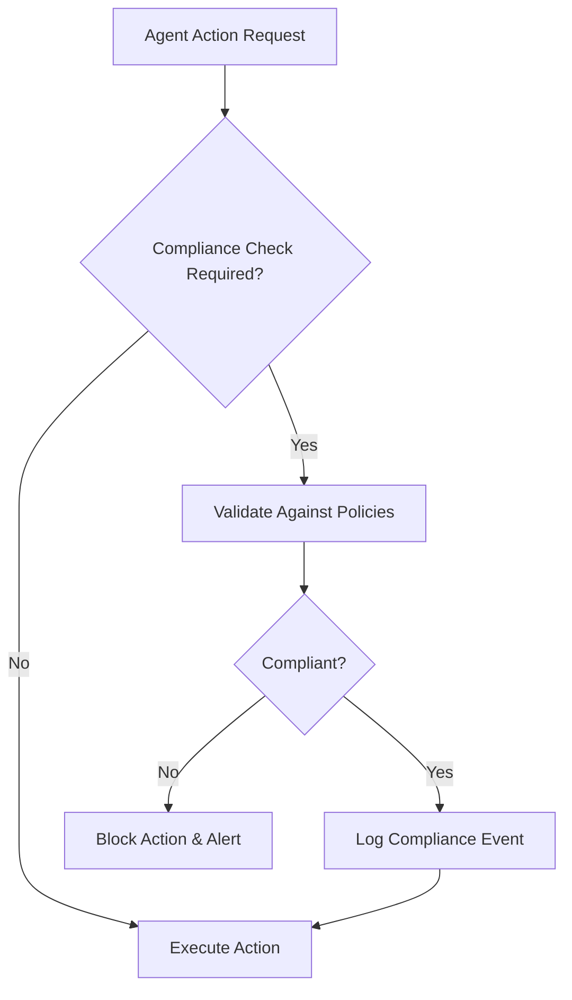

# Zero-Trust Architecture

<cite>
**Referenced Files in This Document**   
- [security_model.md](file://371-os/docs/architecture/security_model.md)
- [auth_service.py](file://371-os/src/minds371/services/security/auth_service.py)
- [credential_vault.py](file://371-os/src/minds371/services/security/credential_vault.py)
- [encryption.py](file://371-os/src/minds371/services/security/encryption.py)
- [audit_logger.py](file://371-os/src/minds371/services/security/audit_logger.py)
- [base_agent.py](file://371-os/src/minds371/agents/base_agent/base_agent.py)
- [clo_sage.py](file://371-os/src/minds371/agents/business/clo_sage.py)
- [adaptive_llm_router/policy_engine.py](file://371-os/src/minds371/adaptive_llm_router/policy_engine.py)
- [adaptive_llm_router/config.py](file://371-os/src/minds371/adaptive_llm_router/config.py)
- [_MASTER_ARCHITECTURE.md](file://371-os/_MASTER_ARCHITECTURE.md)
</cite>

## Table of Contents
1. [Introduction](#introduction)
2. [Core Principles of Zero-Trust Architecture](#core-principles-of-zero-trust-architecture)
3. [Identity Verification and Authentication](#identity-verification-and-authentication)
4. [Micro-Segmentation and Workspace Isolation](#micro-segmentation-and-workspace-isolation)
5. [Continuous Authentication and Behavioral Monitoring](#continuous-authentication-and-behavioral-monitoring)
6. [Dynamic Policy Enforcement with ACI.dev Integration](#dynamic-policy-enforcement-with-acidev-integration)
7. [Least-Privilege Access and Service-to-Service Authentication](#least-privilege-access-and-service-to-service-authentication)
8. [Compliance Integration in Agent Workflows](#compliance-integration-in-agent-workflows)
9. [Performance and Policy Complexity Challenges](#performance-and-policy-complexity-challenges)
10. [Best Practices for Scaling and External Integration](#best-practices-for-scaling-and-external-integration)

## Introduction
The Zero-Trust Architecture (ZTA) within the 371OS security framework is designed to enforce strict access controls and eliminate implicit trust across all system interactions. This document details how the principle of "never trust, always verify" is implemented throughout agent communications, system boundaries, and resource access points. The architecture ensures that every user, device, and agent undergoes rigorous identity verification regardless of network location or prior authentication status. By integrating micro-segmentation, continuous monitoring, and dynamic policy enforcement, the system maintains a robust security posture even in complex, distributed environments.

**Section sources**
- [_MASTER_ARCHITECTURE.md](file://371-os/_MASTER_ARCHITECTURE.md#L1-L50)
- [security_model.md](file://371-os/docs/architecture/security_model.md#L1-L10)

## Core Principles of Zero-Trust Architecture
The foundation of the Zero-Trust model in 371OS rests on three core tenets: explicit verification, least privilege access, and assume breach. These principles are embedded into every layer of the system, from agent initialization to inter-service communication.

Explicit verification mandates that all access requests—whether internal or external—are authenticated, authorized, and encrypted before being granted. This eliminates the concept of trusted networks, treating every request as potentially hostile.

Least privilege access ensures that agents and users are granted only the minimum permissions necessary to perform their functions. This reduces the attack surface and limits lateral movement in case of compromise.

Assume breach shifts the security mindset from perimeter defense to continuous monitoring and rapid response. The system operates under the assumption that breaches will occur, focusing on detection, containment, and mitigation.



**Diagram sources**
- [security_model.md](file://371-os/docs/architecture/security_model.md#L1-L10)
- [auth_service.py](file://371-os/src/minds371/services/security/auth_service.py#L15-L40)

## Identity Verification and Authentication
All entities—users, devices, and agents—must prove their identity before accessing any system resource. The authentication process is multi-layered, combining cryptographic credentials, behavioral biometrics, and contextual analysis.

The `auth_service.py` module implements a pluggable authentication framework that supports multiple identity providers and verification methods. Each agent is issued a unique cryptographic identity during registration, stored securely in the credential vault.

```python
# Example: Agent Identity Initialization (Pseudocode based on clo_sage.py)
class AgentIdentity:
    def __init__(self, agent_id):
        self.agent_id = agent_id
        self.private_key = generate_ecc_key()
        self.certificate = issue_certificate(agent_id, self.public_key)
        self.context_token = generate_contextual_token()
```

Authentication occurs at multiple levels:
- **Network Layer**: Mutual TLS (mTLS) for all service-to-service communication
- **Application Layer**: JWT-based tokens with short expiration times
- **Data Layer**: Attribute-based access control (ABAC) policies

The system integrates with external identity providers via standardized protocols (OAuth 2.0, OpenID Connect), while maintaining internal consistency through a centralized identity management service.

**Section sources**
- [auth_service.py](file://371-os/src/minds371/services/security/auth_service.py#L1-L100)
- [credential_vault.py](file://371-os/src/minds371/services/security/credential_vault.py#L20-L60)
- [clo_sage.py](file://371-os/src/minds371/agents/business/clo_sage.py#L30-L80)

## Micro-Segmentation and Workspace Isolation
To prevent lateral movement and contain potential breaches, the system employs micro-segmentation at both the network and application levels. Each agent operates within a dedicated, isolated workspace with strictly defined communication boundaries.

Agent workspaces are created using containerized environments with mandatory namespace isolation. Network policies restrict inter-agent communication to explicitly authorized channels only.



**Diagram sources**
- [base_agent.py](file://371-os/src/minds371/agents/base_agent/base_agent.py#L45-L90)
- [policy_engine.py](file://371-os/src/minds371/adaptive_llm_router/policy_engine.py#L10-L50)

Workspace isolation is enforced through:
- **Namespace Segmentation**: Separate execution contexts for each agent
- **Network Policies**: Zero-trust network access (ZTNA) rules
- **Storage Isolation**: Dedicated, encrypted storage volumes
- **Memory Protection**: Process-level memory sandboxing

This segmentation strategy ensures that even if one agent is compromised, the attacker cannot easily move to other parts of the system without re-authenticating and re-authorizing.

**Section sources**
- [base_agent.py](file://371-os/src/minds371/agents/base_agent/base_agent.py#L1-L120)
- [policy_engine.py](file://371-os/src/minds371/adaptive_llm_router/policy_engine.py#L1-L80)

## Continuous Authentication and Behavioral Monitoring
The system implements continuous authentication by monitoring agent behavior in real time and validating that actions align with expected patterns. This goes beyond initial authentication to ensure ongoing trustworthiness.

Behavioral monitoring is performed by the `audit_logger.py` service, which collects telemetry data including:
- Command frequency and timing
- Resource access patterns
- Communication partners
- Data transfer volumes
- Execution context changes

Anomalies are detected using machine learning models trained on normal operational behavior. For example, if an agent suddenly accesses resources outside its usual scope or executes commands at unusual times, the system flags it for review.



**Diagram sources**
- [audit_logger.py](file://371-os/src/minds371/services/security/audit_logger.py#L15-L60)
- [policy_engine.py](file://371-os/src/minds371/adaptive_llm_router/policy_engine.py#L85-L120)

The system also implements session timeouts and periodic re-authentication requirements, ensuring that long-lived sessions do not become security liabilities.

**Section sources**
- [audit_logger.py](file://371-os/src/minds371/services/security/audit_logger.py#L1-L100)
- [policy_engine.py](file://371-os/src/minds371/adaptive_llm_router/policy_engine.py#L1-L150)

## Dynamic Policy Enforcement with ACI.dev Integration
The Zero-Trust framework integrates with ACI.dev for dynamic policy enforcement and context-aware access control. Policies are evaluated in real time based on multiple factors including user role, device posture, location, time of day, and sensitivity of the requested resource.

The policy engine in `adaptive_llm_router/policy_engine.py` uses a rule-based system enhanced with machine learning to make access decisions. Policies are defined in YAML format and can be updated without system downtime.

```yaml
# Example: Least-Privilege Access Policy
policy:
  name: "agent-data-access"
  description: "Restrict data access based on agent role"
  rules:
    - effect: "allow"
      actions: ["read"]
      resources: ["data/analytics/*"]
      conditions:
        agent_role: "analyst"
        time_of_day: "09:00-17:00"
        device_compliant: true
    
    - effect: "deny"
      actions: ["write"]
      resources: ["secrets/*"]
      conditions:
        agent_role: "guest"
```

Contextual attributes are gathered from various sources:
- **Device Health**: Patch level, encryption status, security software
- **Network Context**: IP reputation, connection type, geolocation
- **Behavioral History**: Past access patterns, anomaly scores
- **Resource Sensitivity**: Classification level, data type

This integration allows for fine-grained, adaptive security policies that respond to changing conditions and threat landscapes.

**Section sources**
- [policy_engine.py](file://371-os/src/minds371/adaptive_llm_router/policy_engine.py#L1-L200)
- [config.py](file://371-os/src/minds371/adaptive_llm_router/config.py#L1-L50)

## Least-Privilege Access and Service-to-Service Authentication
The system enforces least-privilege access through role-based access control (RBAC) combined with attribute-based access control (ABAC). Each agent is assigned a minimal set of permissions required for its function.

Service-to-service authentication uses mutual TLS (mTLS) with short-lived certificates. Every service must present a valid certificate to communicate with another service, and connections are encrypted end-to-end.

```python
# Example: Service-to-Service Authentication Setup
def setup_mtls_connection(service_a, service_b):
    cert_a = get_service_certificate(service_a)
    cert_b = get_service_certificate(service_b)
    
    # Both services must validate each other's certificates
    connection = create_secure_connection(
        cert_a, 
        cert_b, 
        cipher_suite="TLS_ECDHE_RSA_WITH_AES_256_GCM_SHA384"
    )
    
    return connection
```

Access policies are defined in configuration files and loaded at runtime:

```yaml
# Example: Service-to-Service Authentication Rules
service_policies:
  - source: "analytics-agent"
    destination: "database-service"
    allowed_methods: ["GET", "POST"]
    rate_limit: "100/minute"
    encryption_required: true
    mfa_required: false
```

This approach ensures that even if an attacker gains access to one service, they cannot easily escalate privileges or access other services without proper authorization.

**Section sources**
- [policy_engine.py](file://371-os/src/minds371/adaptive_llm_router/policy_engine.py#L1-L200)
- [config.py](file://371-os/src/minds371/adaptive_llm_router/config.py#L1-L50)
- [encryption.py](file://371-os/src/minds371/services/security/encryption.py#L1-L60)

## Compliance Integration in Agent Workflows
Compliance checks are embedded directly into agent operational workflows, ensuring that security policies are enforced at the point of execution. The CLO Agent (Sage) exemplifies this approach by automatically validating all actions against regulatory requirements.

When an agent attempts to perform a sensitive operation, the system:
1. Intercepts the request
2. Evaluates it against compliance policies
3. Logs the decision
4. Either allows or blocks the action



**Diagram sources**
- [clo_sage.py](file://371-os/src/minds371/agents/business/clo_sage.py#L1-L150)
- [policy_engine.py](file://371-os/src/minds371/adaptive_llm_router/policy_engine.py#L1-L200)

This integration ensures that compliance is not a separate audit process but an integral part of daily operations, reducing the risk of policy violations.

**Section sources**
- [clo_sage.py](file://371-os/src/minds371/agents/business/clo_sage.py#L1-L200)

## Performance and Policy Complexity Challenges
Implementing Zero-Trust architecture introduces several challenges, particularly around performance overhead and policy complexity.

**Performance Overhead**: Each access request requires authentication, authorization, and encryption, which can introduce latency. The system mitigates this through:
- **Caching**: Storing validated authentication tokens for short durations
- **Batch Processing**: Grouping related policy evaluations
- **Asynchronous Validation**: Performing non-critical checks in background threads
- **Hardware Acceleration**: Using dedicated cryptographic processors when available

**Policy Complexity**: As the number of agents and resources grows, managing access policies becomes increasingly complex. The system addresses this through:
- **Policy Inheritance**: Allowing policies to be defined at multiple levels (global, team, individual)
- **Policy Templates**: Pre-defined templates for common scenarios
- **Automated Policy Generation**: Using AI to suggest policies based on observed behavior
- **Policy Visualization Tools**: Graphical interfaces for understanding policy interactions

Optimization strategies include:
- Regular policy reviews to eliminate redundant rules
- Implementing policy decision points close to resources
- Using efficient data structures for policy evaluation
- Monitoring policy evaluation performance and tuning as needed

**Section sources**
- [policy_engine.py](file://371-os/src/minds371/adaptive_llm_router/policy_engine.py#L1-L200)
- [base_agent.py](file://371-os/src/minds371/agents/base_agent/base_agent.py#L1-L120)

## Best Practices for Scaling and External Integration
To maintain a strong Zero-Trust posture during scaling and external integration, the following best practices are recommended:

**Scaling Best Practices**:
- **Automated Agent Provisioning**: Use secure, audited processes for onboarding new agents
- **Distributed Policy Enforcement**: Deploy policy decision points across multiple regions
- **Elastic Monitoring**: Scale monitoring infrastructure in tandem with agent count
- **Centralized Logging**: Aggregate logs from all agents for comprehensive analysis

**External Integration Best Practices**:
- **API Gateways**: Use gateways to enforce Zero-Trust principles for external access
- **Federated Identity**: Implement SSO with external partners using standardized protocols
- **Sandboxed Environments**: Isolate external integrations in dedicated, restricted environments
- **Strict Contract Enforcement**: Define and enforce API contracts with external systems

**Ongoing Maintenance**:
- Regular security audits and penetration testing
- Continuous policy review and optimization
- Automated compliance reporting
- Real-time threat intelligence integration

These practices ensure that the Zero-Trust architecture remains effective and manageable as the system grows in complexity and scale.

**Section sources**
- [_MASTER_ARCHITECTURE.md](file://371-os/_MASTER_ARCHITECTURE.md#L1-L100)
- [security_model.md](file://371-os/docs/architecture/security_model.md#L1-L20)
- [policy_engine.py](file://371-os/src/minds371/adaptive_llm_router/policy_engine.py#L1-L200)