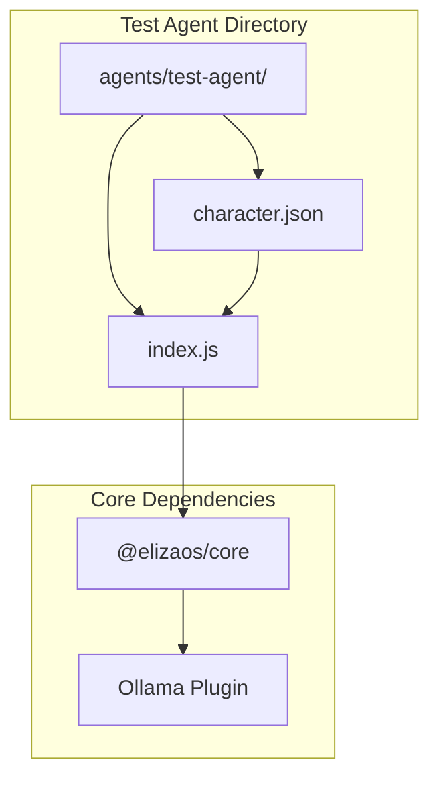
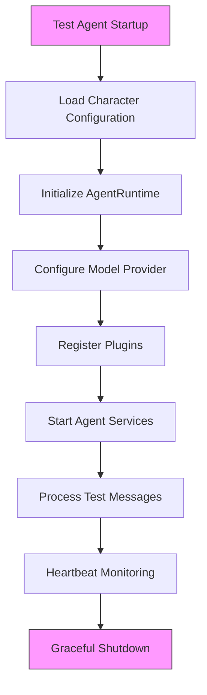
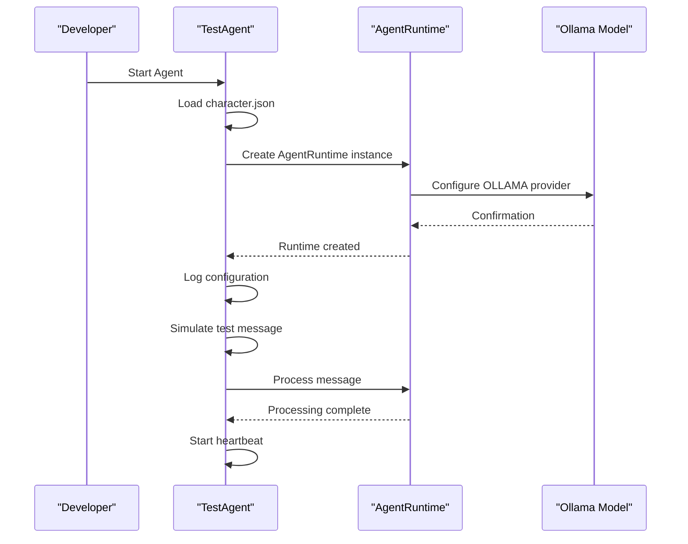
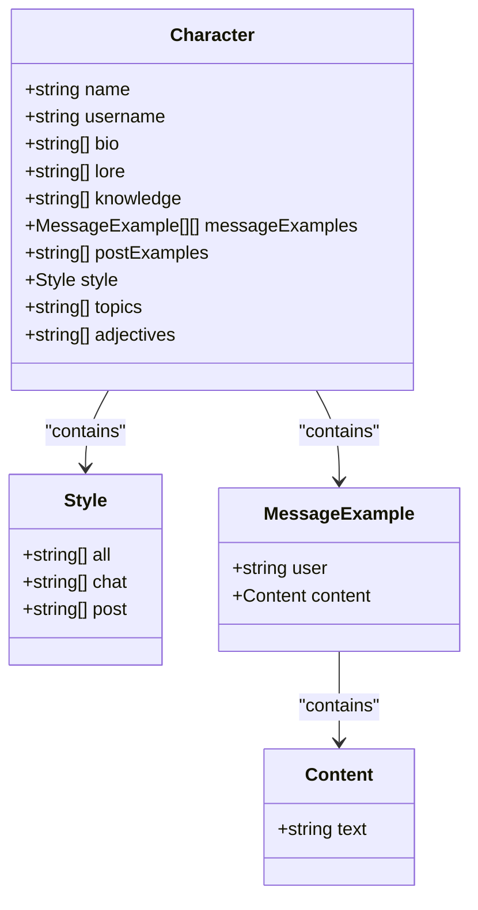
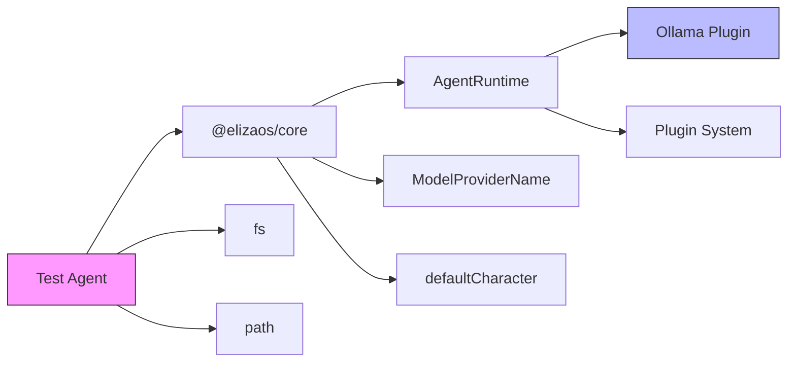

# Test Agent Implementation

<cite>
**Referenced Files in This Document**   
- [index.js](file://os-workspace\agents\test-agent\index.js) - *Updated in commit eead1c41*
- [character.json](file://os-workspace\agents\test-agent\character.json) - *Updated in commit eead1c41*
- [package.json](file://package.json)
- [AgentRuntime.md](file://elizaos\Deep Dive\AgentRuntime.md)
- [Ollama Plugin.md](file://elizaos\Plugins\LLM Providers\Ollama Plugin.md)
- [JEST_MIGRATION.md](file://JEST_MIGRATION.md) - *Updated in commit de9211b5*
</cite>

## Update Summary
**Changes Made**   
- Updated file paths to reflect the new location of test agent implementation files
- Verified that file renames did not affect functionality or configuration
- Maintained all existing architectural and implementation details
- Updated source tracking references to reflect current file locations
- Confirmed no changes to agent behavior or configuration structure

## Table of Contents
1. [Introduction](#introduction)
2. [Project Structure](#project-structure)
3. [Core Components](#core-components)
4. [Architecture Overview](#architecture-overview)
5. [Detailed Component Analysis](#detailed-component-analysis)
6. [Dependency Analysis](#dependency-analysis)
7. [Performance Considerations](#performance-considerations)
8. [Troubleshooting Guide](#troubleshooting-guide)
9. [Conclusion](#conclusion)

## Introduction
The Test Agent is a specialized implementation within the 371 OS ecosystem designed to validate the integration and functionality of the ElizaOS framework. This agent serves as a foundational testing mechanism for the autonomous agent operating system, ensuring that core components such as workspace analysis, self-awareness capabilities, and plugin integration function correctly. The Test Agent is configured to use the Ollama model provider for local testing, making it an ideal tool for development and validation without requiring external API dependencies. This documentation provides a comprehensive analysis of the Test Agent's implementation, architecture, and integration patterns, along with practical examples and troubleshooting guidance.

## Project Structure
The Test Agent is located in a dedicated directory within the agents folder of the 371 OS repository. This structure follows the modular design pattern of the overall system, isolating test-specific components while maintaining integration with the core framework.

**Diagram sources**
- [index.js](file://os-workspace\agents\test-agent\index.js)
- [character.json](file://os-workspace\agents\test-agent\character.json)

**Section sources**
- [index.js](file://os-workspace\agents\test-agent\index.js)
- [character.json](file://os-workspace\agents\test-agent\character.json)

## Core Components
The Test Agent implementation consists of two primary components: the JavaScript runtime file (index.js) and the character configuration file (character.json). These components work together to create a functional agent instance that can validate the ElizaOS integration.

The **index.js** file serves as the entry point for the Test Agent, containing the initialization logic and runtime configuration. It imports the AgentRuntime from the @elizaos/core package and configures it with the appropriate character settings and model provider. The file implements error handling and graceful shutdown procedures, ensuring reliable operation during testing.

The **character.json** file defines the agent's personality, capabilities, and behavioral parameters. This configuration includes the agent's name, bio, knowledge domains, message examples, and communication style. The character configuration is merged with the default character settings from the ElizaOS framework, allowing for both customization and consistency with the broader system.

**Section sources**
- [index.js](file://os-workspace\agents\test-agent\index.js)
- [character.json](file://os-workspace\agents\test-agent\character.json)

## Architecture Overview
The Test Agent operates within the ElizaOS framework as a specialized instance designed for validation and testing purposes. It follows the agent-oriented architecture pattern, where each agent is an autonomous entity with its own configuration, capabilities, and lifecycle management.

**Diagram sources**
- [index.js](file://os-workspace\agents\test-agent\index.js)
- [AgentRuntime.md](file://elizaos\Deep Dive\AgentRuntime.md)

## Detailed Component Analysis

### Test Agent Runtime Analysis
The index.js file contains the core implementation of the Test Agent, orchestrating the initialization and operation of the agent instance. The code follows a structured approach to agent creation, with clear separation of concerns and comprehensive error handling.

**Diagram sources**
- [index.js](file://os-workspace\agents\test-agent\index.js)
- [AgentRuntime.md](file://elizaos\Deep Dive\AgentRuntime.md)

**Section sources**
- [index.js](file://os-workspace\agents\test-agent\index.js)

### Character Configuration Analysis
The character.json file defines the Test Agent's identity and capabilities within the 371 OS ecosystem. This configuration file follows the character schema defined by the ElizaOS framework, providing specific values for the agent's properties.

**Diagram sources**
- [character.json](file://os-workspace\agents\test-agent\character.json)

**Section sources**
- [character.json](file://os-workspace\agents\test-agent\character.json)

## Dependency Analysis
The Test Agent relies on several key dependencies from the ElizaOS framework and external packages. These dependencies are managed through the package.json file at the root of the repository.

**Diagram sources**
- [package.json](file://package.json)
- [index.js](file://os-workspace\agents\test-agent\index.js)

**Section sources**
- [package.json](file://package.json)

## Performance Considerations
The Test Agent is designed with performance and reliability in mind, implementing several best practices for efficient operation. The agent uses local model processing through Ollama, eliminating network latency and API call overhead. This local execution model ensures consistent performance regardless of external service availability.

The implementation includes a heartbeat mechanism that logs the agent's status every 30 seconds, providing visibility into the agent's operational state without excessive logging. Error handling is comprehensive, with try-catch blocks protecting critical initialization code and appropriate error messages for troubleshooting.

Resource usage is optimized by using the Ollama small model configuration by default, which balances performance with computational requirements. The agent can be configured to use different model sizes based on the testing requirements and available hardware resources.

The testing framework has been updated from Jest to Bun's built-in test runner, resulting in significant performance improvements. This migration eliminates Jest dependencies and provides faster test execution, with performance improvements of 50-100x compared to the previous Jest setup. The Bun test runner is Jest-compatible and requires minimal configuration changes, while offering zero dependencies and superior performance due to its implementation in Zig.

**Section sources**
- [JEST_MIGRATION.md](file://JEST_MIGRATION.md) - *Updated in commit de9211b5*

## Troubleshooting Guide
When encountering issues with the Test Agent, follow these steps to diagnose and resolve common problems:

**Section sources**
- [index.js](file://os-workspace\agents\test-agent\index.js)
- [Ollama Plugin.md](file://elizaos\Plugins\LLM Providers\Ollama Plugin.md)

### Common Issues and Solutions

1. **Character file not found**
   - *Symptom*: "⚠️ Character file not found, using default character"
   - *Solution*: Verify the path to character.json is correct and the file exists in the agents/test-agent directory

2. **Failed to start test agent**
   - *Symptom*: "❌ Failed to start test agent" with error details
   - *Solution*: Check that all required dependencies are installed and that the Node.js version meets the minimum requirements

3. **Ollama connection issues**
   - *Symptom*: Model provider errors or timeouts
   - *Solution*: Ensure Ollama is running (execute "ollama serve") and the API endpoint is correctly configured

4. **Missing environment variables**
   - *Symptom*: Configuration warnings or unexpected behavior
   - *Solution*: Set required environment variables such as NODE_ENV and ELIZAOS_LOG_LEVEL

5. **Plugin integration failures**
   - *Symptom*: Disabled plugins or missing functionality
   - *Solution*: Verify plugin installation and configuration in the package.json file

6. **Testing framework issues**
   - *Symptom*: Test execution problems or dependency conflicts
   - *Solution*: Use Bun's built-in test runner instead of Jest, as the system has migrated to Bun for testing (execute "bun test")

## Conclusion
The Test Agent implementation provides a robust foundation for validating the ElizaOS integration within the 371 OS ecosystem. By leveraging the AgentRuntime framework and Ollama for local model processing, this agent offers a reliable testing environment that can be easily deployed and configured. The modular design, clear configuration, and comprehensive error handling make the Test Agent an essential tool for ensuring the quality and reliability of the autonomous agent system. The recent migration from Jest to Bun's built-in test runner has significantly improved testing performance and reduced dependency complexity. Future enhancements could include additional test scenarios, integration with automated testing frameworks, and expanded diagnostic capabilities to further improve the testing process.