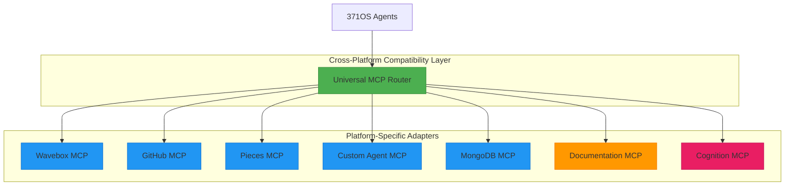

# Universal MCP Architecture

<cite>
**Referenced Files in This Document**   
- [universal_mcp_architecture.md](file://371-os/docs/architecture/universal_mcp_architecture.md#L1-L240)
- [mcp_integration.md](file://docs/mcp_integration.md#L1-L74)
- [wavebox-universal-mcp-windows.md](file://AB/sessions/abideas/wavebox-universal-mcp-windows.md)
- [custom_agent_mcp.md](file://371-os/src/minds371/mcp_servers/custom_agent_mcp.md)
- [local_file_mcp.md](file://371-os/src/minds371/mcp_servers/local_file_mcp.md)
- [memory_mcp.md](file://371-os/src/minds371/mcp_servers/memory_mcp.md)
- [github-mcp.md](file://371-os/src/minds371/mcp_servers/github-mcp.md)
- [cognition-layer-mcp.json](file://core/mcp/cognition-layer-mcp.json) - *Updated in commit 042ba97*
- [qoder-mcp-config.json](file://core/mcp/qoder-mcp-config.json) - *Updated in commit 7062046*
- [documentation-mcp-server.js](file://core/mcp/documentation-mcp-server.js) - *Added in commit 7062046*
- [mock-cognition-server.js](file://core/mcp/mock-cognition-server.js) - *Updated in commit 042ba97*
- [RESOLUTION_SUMMARY.md](file://core/mcp/RESOLUTION_SUMMARY.md) - *Added in commit 7062046*
</cite>

## Update Summary
**Changes Made**   
- Updated Architecture Overview to reflect new cognition and documentation servers
- Added new section for Documentation MCP Server
- Added new section for Cognition MCP Server
- Updated MCP Server Structure section with new file extensions (.cjs)
- Updated Cross-Platform Development Standards with CommonJS considerations
- Added configuration details for qoder-mcp-config.json
- Updated Troubleshooting Guide with resolution steps from RESOLUTION_SUMMARY.md
- Added sources for all new and modified files

## Table of Contents
1. [Introduction](#introduction)
2. [Architecture Overview](#architecture-overview)
3. [Core Principles](#core-principles)
4. [MCP Server Structure](#mcp-server-structure)
5. [Universal MCP Router](#universal-mcp-router)
6. [Cross-Platform Development Standards](#cross-platform-development-standards)
7. [Existing MCP Servers](#existing-mcp-servers)
8. [Implementation Guidelines](#implementation-guidelines)
9. [Security Considerations](#security-considerations)
10. [Performance Optimization](#performance-optimization)
11. [Troubleshooting Guide](#troubleshooting-guide)
12. [Future Enhancements](#future-enhancements)

## Introduction

The Universal Model Context Protocol (MCP) Architecture is a foundational component of the 371OS ecosystem, designed to enable seamless agent coordination and tool integration across multiple platforms. This architecture eliminates platform-specific limitations by implementing a cross-platform, blockchain-coordinated framework that ensures consistent behavior on Windows, macOS, and Linux systems. The Universal MCP serves as a standardized interface through which autonomous agents can access tools, execute actions, and share contextual information regardless of the underlying operating system.

**Section sources**
- [universal_mcp_architecture.md](file://371-os/docs/architecture/universal_mcp_architecture.md#L1-L20)

## Architecture Overview

The Universal MCP Architecture implements a layered routing system that abstracts platform-specific differences while maintaining interoperability across diverse environments. At its core, the architecture follows a hub-and-spoke model where agents communicate with the Universal MCP Router, which then delegates requests to appropriate platform-specific MCP adapters.

The recent updates have introduced two critical new components: the Documentation MCP Server and the Cognition MCP Server. These servers now operate on standardized ports (39301 and 39300 respectively) and provide enhanced capabilities for documentation access and cognitive state awareness.



**Diagram sources**
- [universal_mcp_architecture.md](file://371-os/docs/architecture/universal_mcp_architecture.md#L25-L35)
- [RESOLUTION_SUMMARY.md](file://core/mcp/RESOLUTION_SUMMARY.md#L1-L136)

**Section sources**
- [universal_mcp_architecture.md](file://371-os/docs/architecture/universal_mcp_architecture.md#L21-L40)
- [RESOLUTION_SUMMARY.md](file://core/mcp/RESOLUTION_SUMMARY.md#L1-L136)

## Core Principles

### Cross-Platform Compatibility
The Universal MCP Architecture enforces strict cross-platform compatibility requirements to ensure consistent operation across all supported operating systems. This principle mandates the use of platform-agnostic technologies and prohibits platform-specific automation scripts such as AppleScript or Windows COM objects. Instead, developers must utilize cross-platform alternatives including PowerShell (with proper execution policy handling), URL schemes, and extension APIs that function uniformly across Windows, macOS, and Linux environments.

### Stateless Design
All MCP servers within the 371OS ecosystem adhere to a stateless design philosophy. This architectural decision ensures that no session or contextual data is stored within the MCP server itself. Instead, all state management is delegated to external systems—the blockchain registry handles agent discovery and trust verification, while the Universal Tool Server manages session persistence. This separation of concerns enables horizontal scalability and fault tolerance.

### Blockchain Coordination
The architecture leverages blockchain technology to coordinate agent interactions and establish trust within the ecosystem. Agent discovery occurs through a decentralized registry, eliminating the need for centralized directories. Cryptographic verification ensures the authenticity of all interactions, while a stake-based reputation system provides economic incentives for reliable service provision. This decentralized approach enhances security and resilience against single points of failure.

**Section sources**
- [universal_mcp_architecture.md](file://371-os/docs/architecture/universal_mcp_architecture.md#L42-L70)

## MCP Server Structure

All MCP servers in the 371OS ecosystem follow a standardized directory structure and code organization pattern. This consistency simplifies development, testing, and integration processes across different tool implementations.

```mermaid
graph TD
A[packages/elizaos-plugins/{mcp-name}/] --> B[src/]
A --> C[package.json]
A --> D[project.json]
A --> E[tsconfig.json]
A --> F[README.md]
B --> G[plugin.ts]
B --> H[actions.ts]
B --> I[provider.ts]
B --> J[evaluator.ts]
B --> K[types.ts]
B --> L[index.ts]
style A fill:#FFC107,stroke:#FFA000
style B fill:#03A9F4,stroke:#0288D1
```

The source directory contains the core implementation files:
- **plugin.ts**: Main plugin definition and registration
- **actions.ts**: Agent action handlers and business logic
- **provider.ts**: Context provider implementation
- **evaluator.ts**: Quality assessment and result validation
- **types.ts**: Type definitions and interfaces
- **index.ts**: Export declarations for public API

Recent updates have introduced CommonJS module compatibility by implementing `.cjs` file extensions for server scripts to resolve module system conflicts in mixed ES module environments.

**Diagram sources**
- [universal_mcp_architecture.md](file://371-os/docs/architecture/universal_mcp_architecture.md#L72-L85)

**Section sources**
- [universal_mcp_architecture.md](file://371-os/docs/architecture/universal_mcp_architecture.md#L72-L85)
- [RESOLUTION_SUMMARY.md](file://core/mcp/RESOLUTION_SUMMARY.md#L1-L136)

## Universal MCP Router

The Universal MCP Router serves as the central coordination point for all agent-to-tool communications within the 371OS ecosystem. It implements a dynamic registration and routing system that allows MCP servers to be added or removed at runtime without disrupting overall system functionality.

```typescript
// packages/elizaos-plugins/universal-mcp-router/src/router.ts
import { Plugin } from '@elizaos/core';

export class UniversalMCPRouter {
  private mcpServers: Map<string, Plugin> = new Map();
  
  registerMCPServer(name: string, server: Plugin): void {
    this.mcpServers.set(name, server);
  }
  
  async routeRequest(serverName: string, action: string, params: any): Promise<any> {
    const server = this.mcpServers.get(serverName);
    if (!server) {
      throw new Error(`MCP Server ${serverName} not found`);
    }
    
    // Route to appropriate action handler
    // Implementation details...
  }
}
```

The router maintains a registry of available MCP servers and provides type-safe request routing. When an agent submits a request, the router validates the target server, authenticates the request, and forwards it to the appropriate action handler. Response normalization ensures consistent output formats regardless of the underlying MCP server implementation.

**Section sources**
- [universal_mcp_architecture.md](file://371-os/docs/architecture/universal_mcp_architecture.md#L87-L105)

## Cross-Platform Development Standards

### Platform Compatibility Requirements
All MCP implementations must satisfy stringent cross-platform requirements:
- ✅ Must function identically on Windows, macOS, and Linux
- ✅ No platform-specific automation scripts
- ✅ Use cross-platform Node.js APIs for file system and process operations
- ✅ PowerShell scripts must include ExecutionPolicy bypass handling

### Module System Compatibility
Recent updates have addressed ES Module vs CommonJS conflicts in the MCP ecosystem:
- **✅ Created `.cjs` versions** of all MCP server scripts
- **✅ Updated configurations** to reference correct file extensions
- **✅ Maintained CommonJS syntax** while respecting ES module workspace setup

```powershell
# All PowerShell scripts must handle ExecutionPolicy
# Run with: PowerShell -ExecutionPolicy Bypass -File script.ps1

param(
    [string]$Action,
    [string]$Parameter
)

switch ($Action) {
    "open" {
        # Use URL schemes instead of platform-specific automation
        Start-Process "app://open?param=$Parameter"
    }
}
```

This approach ensures that automation commands can execute without being blocked by restrictive execution policies while maintaining security through explicit invocation parameters.

### TypeScript Implementation Standards
All MCP servers must adhere to standardized TypeScript patterns:

```typescript
import { Action, IAgentRuntime, Memory, State, ActionResult } from '@elizaos/core';

export const crossPlatformAction: Action = {
  name: 'CROSS_PLATFORM_ACTION',
  description: 'Example cross-platform MCP action',
  handler: async (runtime: IAgentRuntime, message: Memory, state?: State): Promise<ActionResult> => {
    // Implementation that works across all platforms
    return { success: true, data: {} };
  }
};
```

These standards ensure type safety, predictable behavior, and seamless integration with the broader 371OS agent framework.

**Section sources**
- [universal_mcp_architecture.md](file://371-os/docs/architecture/universal_mcp_architecture.md#L107-L145)
- [RESOLUTION_SUMMARY.md](file://core/mcp/RESOLUTION_SUMMARY.md#L1-L136)

## Existing MCP Servers

### Wavebox MCP
- **Cross-platform**: ✅ Windows, macOS, Linux
- **Features**: URL control, profile management, session handling
- **Automation**: PowerShell scripts, URL schemes
- **Documentation**: [wavebox-universal-mcp-windows.md](file://AB/sessions/abideas/wavebox-universal-mcp-windows.md)

### GitHub MCP
- **Cross-platform**: ✅ Windows, macOS, Linux
- **Features**: Repository management, issue tracking, code review
- **Automation**: GitHub API integration
- **Documentation**: [github-mcp.md](file://371-os/src/minds371/mcp_servers/github-mcp.md)

### Custom Agent MCP
- **Cross-platform**: ✅ Windows, macOS, Linux
- **Features**: Custom agent communication, workflow coordination
- **Automation**: REST API, WebSocket connections
- **Documentation**: [custom_agent_mcp.md](file://371-os/src/minds371/mcp_servers/custom_agent_mcp.md)

### Local File MCP
- **Cross-platform**: ✅ Windows, macOS, Linux
- **Features**: File system operations, document management
- **Automation**: Node.js fs module
- **Documentation**: [local_file_mcp.md](file://371-os/src/minds371/mcp_servers/local_file_mcp.md)

### Memory MCP
- **Cross-platform**: ✅ Windows, macOS, Linux
- **Features**: Memory storage and retrieval, context management
- **Automation**: Database operations
- **Documentation**: [memory_mcp.md](file://371-os/src/minds371/mcp_servers/memory_mcp.md)

### Documentation MCP Server
- **Cross-platform**: ✅ Windows, macOS, Linux
- **Port**: 39301
- **Features**: Comprehensive project documentation search, intelligent retrieval, EPICACHE integration
- **Implementation**: [documentation-mcp-server.js](file://core/mcp/documentation-mcp-server.js)
- **Configuration**: [qoder-mcp-config.json](file://core/mcp/qoder-mcp-config.json)

### Cognition MCP Server
- **Cross-platform**: ✅ Windows, macOS, Linux
- **Port**: 39300
- **Features**: Real-time SSE stream, memory market simulation, executive/technical/creative modes, EPICACHE memory management
- **Implementation**: [mock-cognition-server.js](file://core/mcp/mock-cognition-server.js)
- **Configuration**: [cognition-layer-mcp.json](file://core/mcp/cognition-layer-mcp.json)

Each MCP server implements the standardized structure while providing domain-specific functionality through well-defined action interfaces.

**Section sources**
- [universal_mcp_architecture.md](file://371-os/docs/architecture/universal_mcp_architecture.md#L147-L180)
- [RESOLUTION_SUMMARY.md](file://core/mcp/RESOLUTION_SUMMARY.md#L1-L136)

## Implementation Guidelines

### Creating New MCP Servers
Developers creating new MCP servers should follow these steps:
1. Create a new package following the standard MCP server structure
2. Implement cross-platform functionality using approved APIs
3. Include comprehensive error handling with appropriate fallback mechanisms
4. Document all platform-specific considerations and limitations
5. Test thoroughly on all supported operating systems
6. Ensure CommonJS compatibility by using `.cjs` extensions when needed

### Integration with 371OS Agents
Agent configuration with MCP integration follows a modular pattern:

```typescript
const agentConfig = {
  name: 'TestAgent',
  plugins: [
    WaveboxMCPPlugin,    // Cross-platform Wavebox integration
    GithubMCPPlugin,     // Cross-platform GitHub integration
    CustomAgentMCPPlugin // Custom agent coordination
  ]
};
```

This plugin-based approach allows agents to dynamically incorporate tool capabilities based on their operational requirements.

### Error Handling and Fallbacks
Robust error handling is critical for maintaining reliability across diverse environments:

```typescript
try {
  // Attempt primary automation method
  await executePrimaryMethod();
} catch (error) {
  // Fallback to alternative method
  await executeFallbackMethod();
}
```

This pattern ensures graceful degradation when platform-specific issues arise, maintaining overall system resilience.

**Section sources**
- [universal_mcp_architecture.md](file://371-os/docs/architecture/universal_mcp_architecture.md#L182-L205)

## Security Considerations

### Zero-Trust Architecture
The Universal MCP Architecture implements a zero-trust security model:
- No hardcoded credentials in any MCP server
- All authentication flows through the Secretless Broker
- Cryptographic verification of all inter-component communications
- Role-based access control for sensitive operations

### Platform-Specific Security
Each operating system presents unique security considerations:
- **Windows**: Proper PowerShell execution policy handling and script signing
- **All Platforms**: Secure storage of sensitive data using encrypted vaults
- **Network**: TLS encryption for all external communications
- **Local Storage**: File system permissions and access controls

These measures ensure that security is maintained consistently across all deployment environments.

**Section sources**
- [universal_mcp_architecture.md](file://371-os/docs/architecture/universal_mcp_architecture.md#L207-L220)

## Performance Optimization

### Cross-Platform Performance
Performance optimization focuses on minimizing platform-specific overhead:
- Asynchronous operations to prevent blocking
- Result caching for expensive operations
- Resource pooling for database and network connections
- Efficient data serialization formats

### Scalability
The stateless design enables horizontal scaling:
- Multiple instances of MCP servers can run simultaneously
- Load balancing through the Universal MCP Router
- Connection pooling and resource sharing
- Monitoring and auto-scaling based on demand

This architecture supports both vertical and horizontal scaling strategies to accommodate varying workloads.

**Section sources**
- [universal_mcp_architecture.md](file://371-os/docs/architecture/universal_mcp_architecture.md#L222-L230)

## Troubleshooting Guide

### Common Issues and Solutions
- **MCP Server Not Found**: Verify registration with the Universal MCP Router
- **Platform-Specific Failures**: Check execution policies and permissions
- **Authentication Errors**: Validate Secretless Broker configuration
- **Performance Degradation**: Monitor resource usage and implement caching
- **Context Deadline Exceeded**: Check for module system conflicts and update to `.cjs` extensions

### Debugging Tools
- Built-in logging with structured output
- Request/response tracing across components
- Performance monitoring metrics
- Health check endpoints for all MCP servers

### Testing Procedures
- Automated cross-platform testing pipeline
- Manual verification on all supported operating systems
- Integration testing with agent workflows
- Security vulnerability scanning

### Resolution Steps for Cognition Issues
Based on the successful resolution documented in RESOLUTION_SUMMARY.md:

1. **Fix Configuration Files**:
   - Remove duplicate keys from `qoder-mcp-config.json`
   - Update server paths to local scripts instead of non-existent npm packages

2. **Resolve Module Conflicts**:
   - Use `.cjs` extensions for CommonJS compatibility
   - Ensure proper module syntax matching

3. **Verify Server Functionality**:
```bash
# Check server health
curl http://localhost:39300/health
curl http://localhost:39301/health
```

**Section sources**
- [mcp_integration.md](file://docs/mcp_integration.md#L1-L74)
- [RESOLUTION_SUMMARY.md](file://core/mcp/RESOLUTION_SUMMARY.md#L1-L136)

## Future Enhancements

### Enhanced Cross-Platform Support
Planned improvements include:
- Additional platform-specific adapters
- Improved automation methods with better error recovery
- Enhanced compatibility testing infrastructure
- Expanded library of cross-platform utilities

### Advanced Coordination Features
Future development will focus on:
- Machine learning-based request routing
- Predictive automation based on usage patterns
- Enhanced security protocols with adaptive authentication
- Real-time performance optimization

These enhancements will further solidify the Universal MCP Architecture as a leading solution for cross-platform agent coordination.

**Section sources**
- [universal_mcp_architecture.md](file://371-os/docs/architecture/universal_mcp_architecture.md#L232-L240)