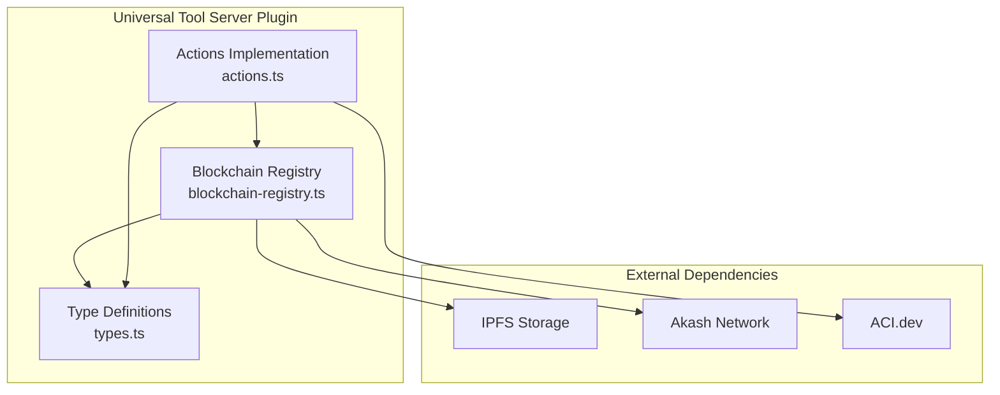
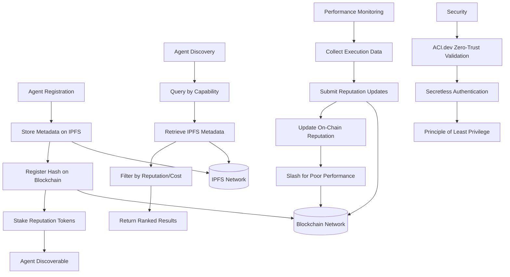
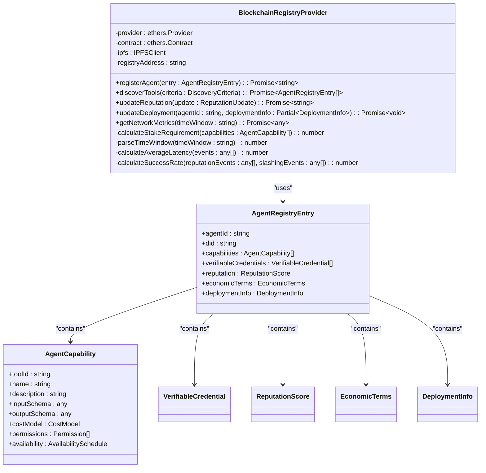
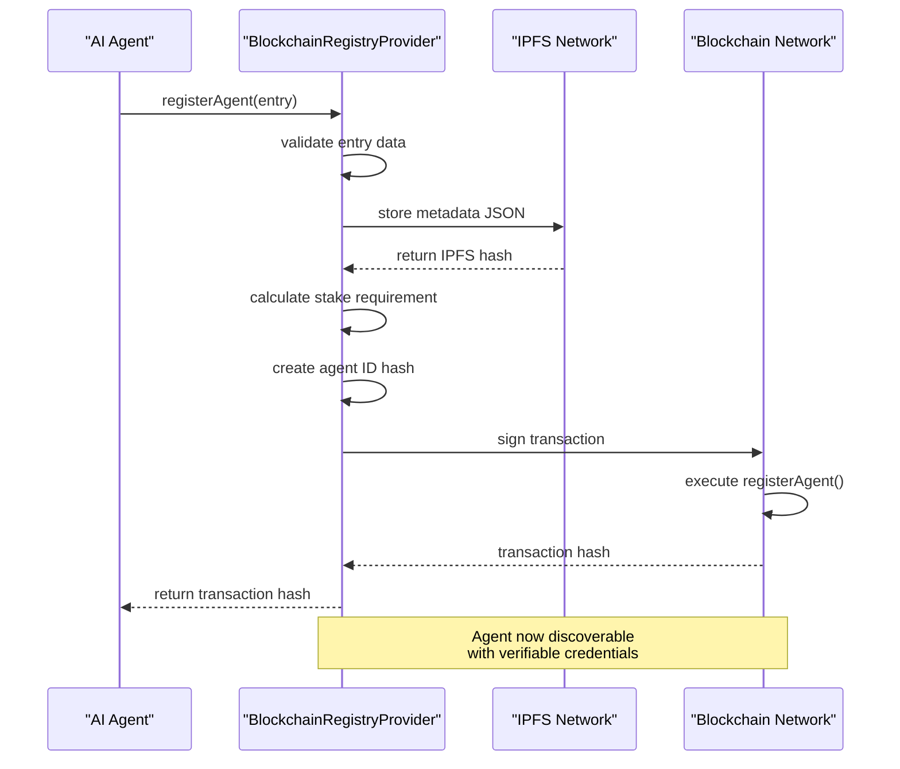
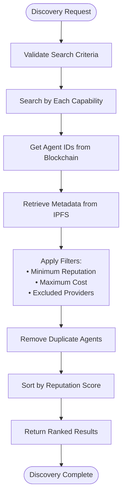
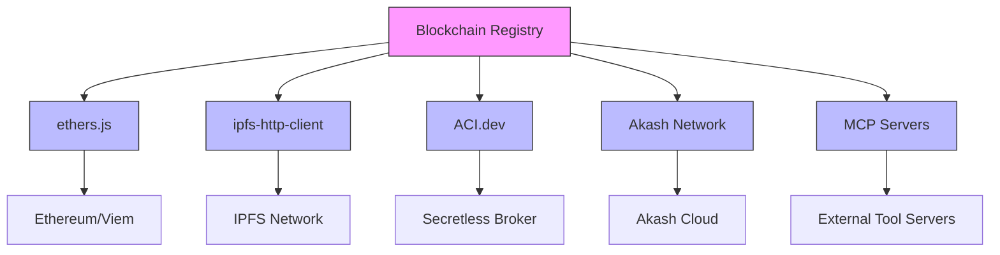

# Blockchain Registry

<cite>
**Referenced Files in This Document**   
- [blockchain-registry.ts](file://packages/elizaos-plugins/universal-tool-server/src/blockchain-registry.ts)
- [types.ts](file://packages/elizaos-plugins/universal-tool-server/src/types.ts)
- [actions.ts](file://packages/elizaos-plugins/universal-tool-server/src/actions.ts)
- [AgentRegistry.sol](file://contracts/AgentRegistry.sol)
- [IMPLEMENTATION_GUIDE.md](file://IMPLEMENTATION_GUIDE.md)
- [i'm setting up Qoder..md](file://sotalogic/Claude Sonnet 4/Alignment Review of 371OS_launch Project Plan/i'm setting up Qoder..md)
</cite>

## Table of Contents
1. [Introduction](#introduction)
2. [Project Structure](#project-structure)
3. [Core Components](#core-components)
4. [Architecture Overview](#architecture-overview)
5. [Detailed Component Analysis](#detailed-component-analysis)
6. [Dependency Analysis](#dependency-analysis)
7. [Performance Considerations](#performance-considerations)
8. [Troubleshooting Guide](#troubleshooting-guide)
9. [Conclusion](#conclusion)

## Introduction
The Blockchain Registry serves as the decentralized agent discovery and coordination layer within the Universal Tool Server ecosystem. It enables trustless registration, discovery, and validation of AI agents through immutable blockchain records. This document details the implementation of the registry using MCP servers, covering agent registration with capability metadata, reputation staking, cryptographic identity verification, and query interfaces for discovering agents by skill, availability, and performance history. The system integrates with ACI.dev for zero-trust validation and supports multiple blockchain networks with gas-efficient transaction management.

## Project Structure
The Blockchain Registry implementation is organized within the universal-tool-server plugin package, with core functionality separated into distinct modules for blockchain interaction, type definitions, and agent actions. The architecture follows a modular design pattern that separates concerns between blockchain operations, data modeling, and agent coordination logic.

**Diagram sources**
- [blockchain-registry.ts](file://packages/elizaos-plugins/universal-tool-server/src/blockchain-registry.ts)
- [types.ts](file://packages/elizaos-plugins/universal-tool-server/src/types.ts)
- [actions.ts](file://packages/elizaos-plugins/universal-tool-server/src/actions.ts)

**Section sources**
- [blockchain-registry.ts](file://packages/elizaos-plugins/universal-tool-server/src/blockchain-registry.ts)
- [types.ts](file://packages/elizaos-plugins/universal-tool-server/src/types.ts)

## Core Components
The Blockchain Registry consists of three primary components: the BlockchainRegistryProvider class for blockchain interactions, type definitions for agent metadata and capabilities, and action handlers that enable agents to register and discover services. The system stores agent metadata on IPFS while maintaining cryptographic hashes and reputation scores on-chain, creating a hybrid decentralized storage solution.

**Section sources**
- [blockchain-registry.ts](file://packages/elizaos-plugins/universal-tool-server/src/blockchain-registry.ts)
- [types.ts](file://packages/elizaos-plugins/universal-tool-server/src/types.ts)
- [actions.ts](file://packages/elizaos-plugins/universal-tool-server/src/actions.ts)

## Architecture Overview
The Blockchain Registry implements a decentralized agent discovery system where AI agents register their capabilities on-chain with staked reputation. Other agents can query the registry to discover suitable service providers based on capability, reputation, and economic terms. The architecture combines blockchain immutability with IPFS for scalable metadata storage, creating a trustless coordination layer for the Universal Tool Server.

**Diagram sources**
- [blockchain-registry.ts](file://packages/elizaos-plugins/universal-tool-server/src/blockchain-registry.ts)
- [AgentRegistry.sol](file://contracts/AgentRegistry.sol)

## Detailed Component Analysis

### Blockchain Registry Provider
The BlockchainRegistryProvider class handles all interactions with the blockchain network, including agent registration, discovery, and reputation management. It uses ethers.js for blockchain connectivity and IPFS for decentralized metadata storage.

#### Class Diagram

**Diagram sources**
- [blockchain-registry.ts](file://packages/elizaos-plugins/universal-tool-server/src/blockchain-registry.ts)
- [types.ts](file://packages/elizaos-plugins/universal-tool-server/src/types.ts)

**Section sources**
- [blockchain-registry.ts](file://packages/elizaos-plugins/universal-tool-server/src/blockchain-registry.ts)

### Agent Registration Process
The agent registration process involves storing comprehensive metadata on IPFS and registering a cryptographic hash on-chain with a reputation stake. This creates a verifiable and immutable record of the agent's capabilities and terms.

#### Sequence Diagram

**Diagram sources**
- [blockchain-registry.ts](file://packages/elizaos-plugins/universal-tool-server/src/blockchain-registry.ts)
- [actions.ts](file://packages/elizaos-plugins/universal-tool-server/src/actions.ts)

**Section sources**
- [blockchain-registry.ts](file://packages/elizaos-plugins/universal-tool-server/src/blockchain-registry.ts)
- [actions.ts](file://packages/elizaos-plugins/universal-tool-server/src/actions.ts)

### Agent Discovery and Query Interface
The discovery system allows orchestrators to find agents by capability, filtering results by reputation, cost, and availability. The query interface supports complex criteria including preferred and excluded providers.

#### Flowchart

**Diagram sources**
- [blockchain-registry.ts](file://packages/elizaos-plugins/universal-tool-server/src/blockchain-registry.ts)

**Section sources**
- [blockchain-registry.ts](file://packages/elizaos-plugins/universal-tool-server/src/blockchain-registry.ts)

## Dependency Analysis
The Blockchain Registry depends on several external systems and libraries to provide its functionality. The primary dependencies include ethers.js for blockchain interactions, IPFS for decentralized storage, and integration with ACI.dev for zero-trust security validation.

**Diagram sources**
- [blockchain-registry.ts](file://packages/elizaos-plugins/universal-tool-server/src/blockchain-registry.ts)
- [actions.ts](file://packages/elizaos-plugins/universal-tool-server/src/actions.ts)

**Section sources**
- [blockchain-registry.ts](file://packages/elizaos-plugins/universal-tool-server/src/blockchain-registry.ts)
- [actions.ts](file://packages/elizaos-plugins/universal-tool-server/src/actions.ts)

## Performance Considerations
The Blockchain Registry is designed with performance and cost efficiency in mind. The system minimizes on-chain operations by storing detailed metadata on IPFS while keeping only essential verification data on-chain. Gas optimization techniques include batch processing where possible and efficient data encoding.

The registry implements caching strategies for frequently accessed data and uses event filtering to efficiently query blockchain data. Network metrics are calculated based on configurable time windows, allowing for both real-time monitoring and historical analysis.

**Section sources**
- [blockchain-registry.ts](file://packages/elizaos-plugins/universal-tool-server/src/blockchain-registry.ts)

## Troubleshooting Guide
Common issues with the Blockchain Registry typically involve configuration errors, network connectivity problems, or insufficient staking requirements. The following guidance helps diagnose and resolve these issues:

**Section sources**
- [blockchain-registry.ts](file://packages/elizaos-plugins/universal-tool-server/src/blockchain-registry.ts)
- [IMPLEMENTATION_GUIDE.md](file://IMPLEMENTATION_GUIDE.md)

### Registration Failures
When agent registration fails, check the following:
- Ensure the AGENT_PRIVATE_KEY environment variable is set
- Verify the RPC endpoint is accessible
- Confirm sufficient AKT tokens are available for staking
- Validate the agent metadata structure against the AgentRegistryEntry interface

### Discovery Issues
If agent discovery returns no results:
- Verify the capability hash matches what was registered
- Check that the agent's reputation meets minimum thresholds
- Ensure the blockchain contract address is correctly configured
- Validate IPFS connectivity for metadata retrieval

### Reputation Update Problems
For reputation update failures:
- Confirm the rater's DID is properly formatted
- Ensure the rating is within 0-1 range
- Verify the execution ID exists in the system
- Check that the evidence array contains valid references

## Conclusion
The Blockchain Registry provides a robust decentralized infrastructure for AI agent discovery and coordination within the Universal Tool Server ecosystem. By leveraging blockchain immutability and IPFS scalability, the system creates a trustless environment where agents can register capabilities, establish reputation, and discover suitable collaborators. The integration with ACI.dev ensures zero-trust security, while economic incentives and slashing mechanisms prevent Sybil attacks and ensure service quality. This architecture enables a self-sustaining ecosystem of AI agents that can autonomously coordinate to accomplish complex tasks.