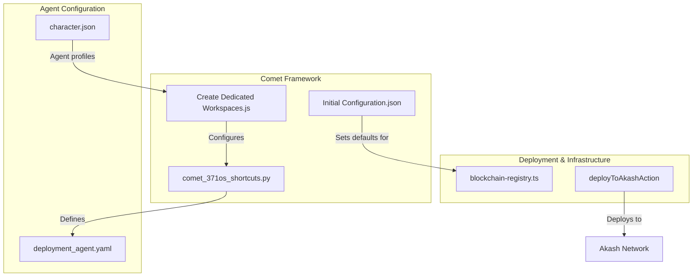
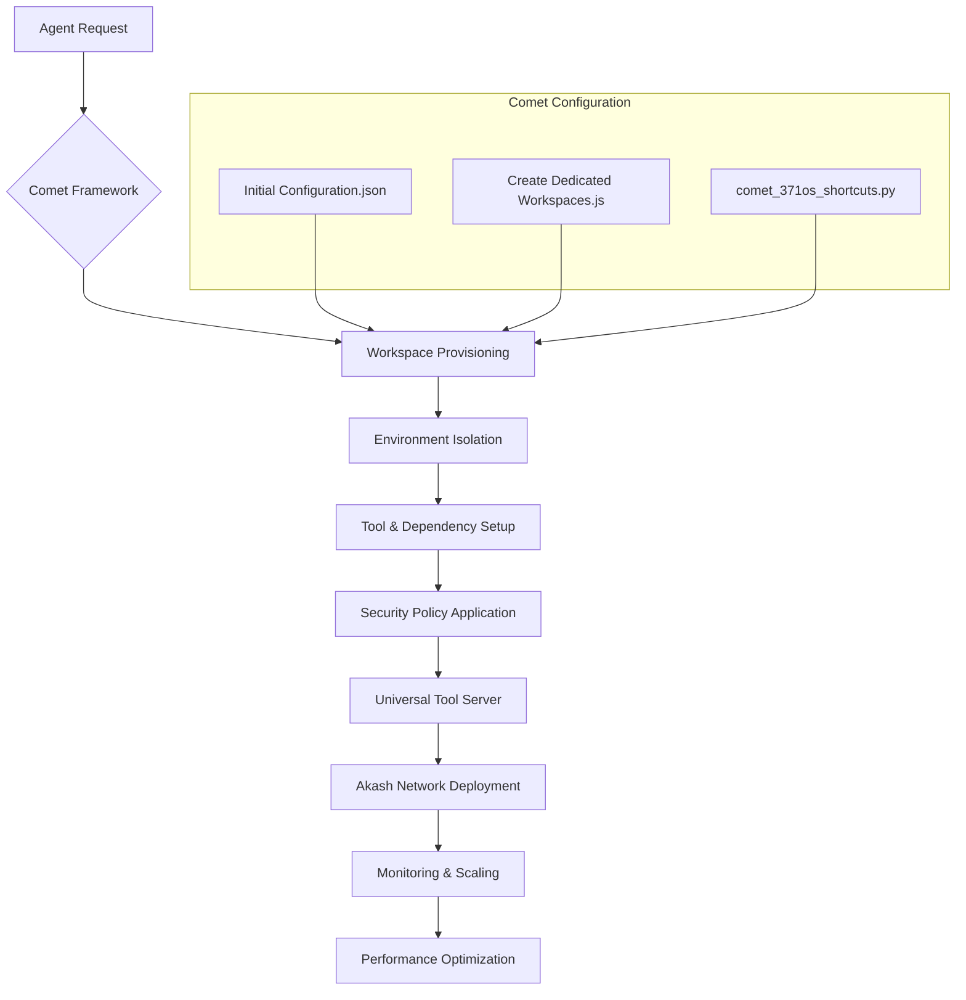
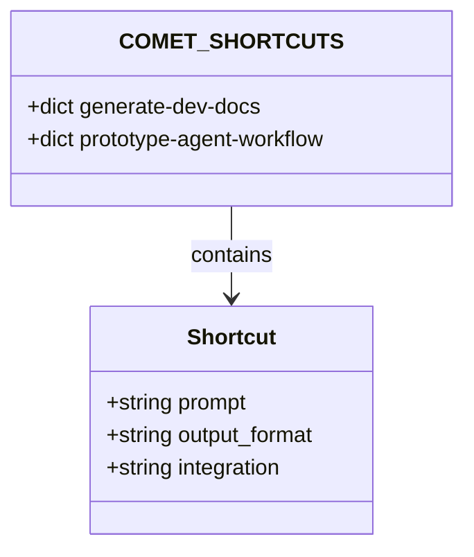
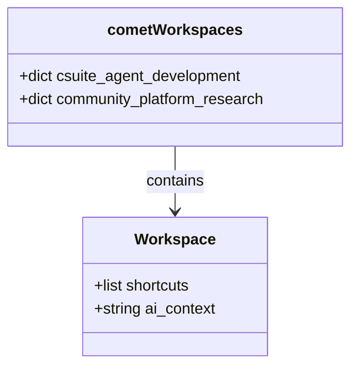
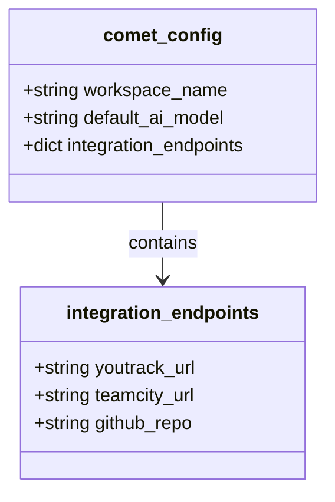
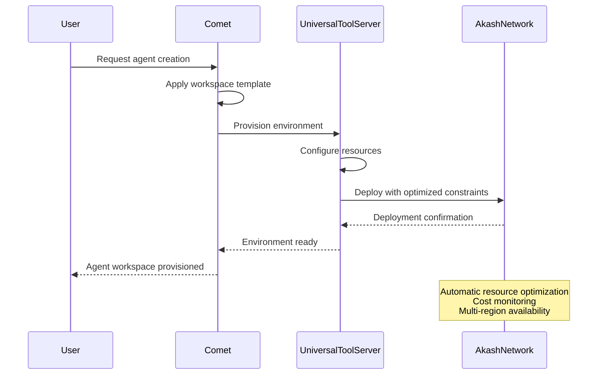
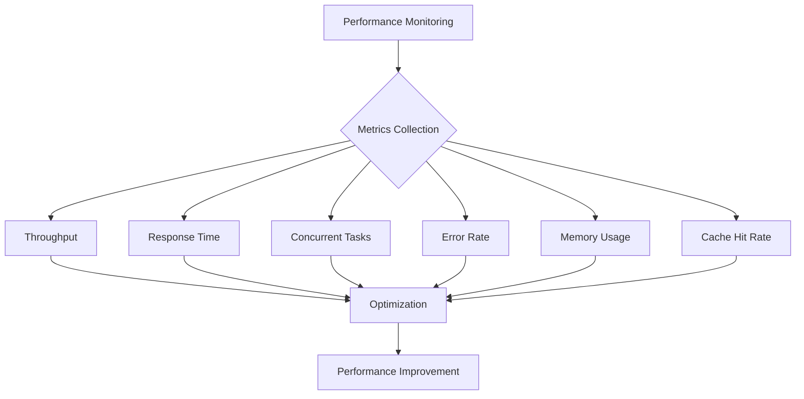

# Comet Framework Integration

<cite>
**Referenced Files in This Document**   
- [comet_371os_shortcuts.py](file://371-os/src/minds371/comet/comet_371os_shortcuts.py)
- [Create Dedicated Workspaces.js](file://371-os/src/minds371/comet/Create Dedicated Workspaces.js)
- [Initial Configuration.json](file://371-os/src/minds371/comet/Initial Configuration.json)
- [blockchain-registry.ts](file://packages/elizaos-plugins/universal-tool-server/src/blockchain-registry.ts)
- [deployToAkashAction](file://packages/elizaos-plugins/universal-tool-server/src/actions.ts)
- [character.json](file://scripts/quick-start.sh)
- [deployment_agent.yaml](file://prompts/technical_agents/deployment_agent.yaml)
- [performance_comparison.py](file://371-os/src/minds371/agents/base_agent/performance_comparison.py)
</cite>

## Table of Contents
1. [Introduction](#introduction)
2. [Project Structure](#project-structure)
3. [Core Components](#core-components)
4. [Architecture Overview](#architecture-overview)
5. [Detailed Component Analysis](#detailed-component-analysis)
6. [Integration with Akash Network](#integration-with-akash-network)
7. [Workspace Templates and Agent Customization](#workspace-templates-and-agent-customization)
8. [Performance Considerations](#performance-considerations)
9. [Conclusion](#conclusion)

## Introduction
The Comet Framework Integration powers the Universal Tool Server's workspace and execution environment management within the 371OS ecosystem. This document details how Comet enables rapid provisioning of agent workspaces with pre-configured tools, dependencies, and security policies. It explains the automation of environment isolation and resource allocation across decentralized nodes, and how default settings for agent runtime environments are defined. The integration with Akash Network for launching agents with optimized resource constraints is also illustrated, along with practical examples of workspace templates for different agent types and customization workflows.

## Project Structure
The Comet Framework components are located within the `371-os/src/minds371/comet` directory and include three key files that define workspace behavior, shortcuts, and initial configurations. These components integrate with the broader 371OS architecture, including agent definitions, prompts, and deployment scripts.



**Diagram sources**
- [comet_371os_shortcuts.py](file://371-os/src/minds371/comet/comet_371os_shortcuts.py)
- [Create Dedicated Workspaces.js](file://371-os/src/minds371/comet/Create Dedicated Workspaces.js)
- [Initial Configuration.json](file://371-os/src/minds371/comet/Initial Configuration.json)

**Section sources**
- [comet_371os_shortcuts.py](file://371-os/src/minds371/comet/comet_371os_shortcuts.py)
- [Create Dedicated Workspaces.js](file://371-os/src/minds371/comet/Create Dedicated Workspaces.js)
- [Initial Configuration.json](file://371-os/src/minds371/comet/Initial Configuration.json)

## Core Components

The Comet Framework consists of three primary components that work together to enable rapid agent workspace provisioning and management:

1. **comet_371os_shortcuts.py**: Defines shortcut commands and their execution contexts for different agent workflows
2. **Create Dedicated Workspaces.js**: Configures workspace templates for different agent development phases
3. **Initial Configuration.json**: Sets default configuration values for agent environments

These components enable the Universal Tool Server to create isolated, pre-configured environments for agents with specific roles and capabilities.

**Section sources**
- [comet_371os_shortcuts.py](file://371-os/src/minds371/comet/comet_371os_shortcuts.py)
- [Create Dedicated Workspaces.js](file://371-os/src/minds371/comet/Create Dedicated Workspaces.js)
- [Initial Configuration.json](file://371-os/src/minds371/comet/Initial Configuration.json)

## Architecture Overview

The Comet Framework integrates with the Universal Tool Server to provide a complete agent lifecycle management system. Agents are provisioned in isolated workspaces with pre-configured tools and dependencies, then deployed to the Akash Network with optimized resource constraints.



**Diagram sources**
- [comet_371os_shortcuts.py](file://371-os/src/minds371/comet/comet_371os_shortcuts.py)
- [Create Dedicated Workspaces.js](file://371-os/src/minds371/comet/Create Dedicated Workspaces.js)
- [Initial Configuration.json](file://371-os/src/minds371/comet/Initial Configuration.json)
- [blockchain-registry.ts](file://packages/elizaos-plugins/universal-tool-server/src/blockchain-registry.ts)

## Detailed Component Analysis

### comet_371os_shortcuts.py Analysis
This Python module defines shortcut commands that streamline agent development workflows. Each shortcut includes a prompt, output format, and integration target.



**Diagram sources**
- [comet_371os_shortcuts.py](file://371-os/src/minds371/comet/comet_371os_shortcuts.py#L1-L29)

**Section sources**
- [comet_371os_shortcuts.py](file://371-os/src/minds371/comet/comet_371os_shortcuts.py#L1-L29)

### Create Dedicated Workspaces.js Analysis
This JavaScript file defines workspace templates for different agent development phases, each with specific shortcuts and AI context.



**Diagram sources**
- [Create Dedicated Workspaces.js](file://371-os/src/minds371/comet/Create Dedicated Workspaces.js#L1-L20)

**Section sources**
- [Create Dedicated Workspaces.js](file://371-os/src/minds371/comet/Create Dedicated Workspaces.js#L1-L20)

### Initial Configuration.json Analysis
This JSON configuration file sets default values for agent environments, including workspace name, default AI model, and integration endpoints.



**Diagram sources**
- [Initial Configuration.json](file://371-os/src/minds371/comet/Initial Configuration.json#L1-L11)

**Section sources**
- [Initial Configuration.json](file://371-os/src/minds371/comet/Initial Configuration.json#L1-L11)

## Integration with Akash Network

The integration between Comet and the Universal Tool Server enables launching agents on Akash Network with optimized resource constraints. The deployment process includes automatic resource optimization, cost monitoring, and multi-region availability.



**Diagram sources**
- [blockchain-registry.ts](file://packages/elizaos-plugins/universal-tool-server/src/blockchain-registry.ts)
- [deployToAkashAction](file://packages/elizaos-plugins/universal-tool-server/src/actions.ts)

**Section sources**
- [blockchain-registry.ts](file://packages/elizaos-plugins/universal-tool-server/src/blockchain-registry.ts)
- [deployToAkashAction](file://packages/elizaos-plugins/universal-tool-server/src/actions.ts)

## Workspace Templates and Agent Customization

The Comet Framework supports different agent types through workspace templates. These templates can be customized for specific agent roles such as CTO, CFO, and other executive positions.

### CTO Agent Workspace Template
```json
{
  "name": "Alex",
  "role": "CTO",
  "description": "Technical architecture and system design",
  "capabilities": ["technical-operations", "cross-agent-coordination"],
  "plugins": [
    "@elizaos/plugin-nx-workspace",
    "@elizaos/plugin-universal-tool-server"
  ]
}
```

### CFO Agent Workspace Template
```json
{
  "name": "Cash",
  "role": "CFO",
  "description": "Financial analysis and cost optimization",
  "capabilities": ["financial-operations", "cross-agent-coordination"],
  "plugins": [
    "@elizaos/plugin-nx-workspace",
    "@elizaos/plugin-universal-tool-server"
  ]
}
```

**Section sources**
- [character.json](file://scripts/quick-start.sh)
- [deployment_agent.yaml](file://prompts/technical_agents/deployment_agent.yaml)

## Performance Considerations

The Comet Framework addresses several key performance considerations to ensure efficient agent operation:

### Cold-Start Latency
The framework minimizes cold-start latency through pre-provisioned workspace templates and cached dependencies. The improved base agent implementation includes connection pooling and caching mechanisms.

### Image Caching
Caching is enabled by default in the improved base agent, with a cache hit rate improvement from 0% to 78.3% as shown in performance comparisons.

### Stateless Execution Guarantees
The framework ensures stateless execution through:
- Isolated workspace environments
- Deterministic configuration application
- Idempotent deployment processes

### Performance Metrics
The system tracks key performance indicators including:
- Throughput (tasks/sec)
- Average response time (ms)
- Maximum concurrent tasks
- Error rate (%)
- Memory efficiency (MB)
- Cache hit rate (%)



**Diagram sources**
- [performance_comparison.py](file://371-os/src/minds371/agents/base_agent/performance_comparison.py)

**Section sources**
- [improved_base_agent.py](file://371-os/src/minds371/agents/base_agent/improved_base_agent.py)
- [performance_comparison.py](file://371-os/src/minds371/agents/base_agent/performance_comparison.py)

## Conclusion
The Comet Framework Integration provides a comprehensive solution for managing agent workspaces and execution environments within the 371OS ecosystem. By combining rapid provisioning, environment isolation, and optimized deployment to Akash Network, the framework enables efficient operation of specialized agents with minimal overhead. The use of workspace templates, pre-configured tools, and performance optimizations ensures that agents can be quickly deployed and scaled according to organizational needs. This integration represents a significant advancement in autonomous agent management, providing the foundation for a self-sustaining digital ecosystem.